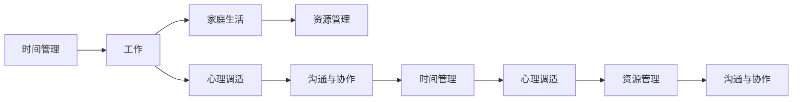

                 

## 1. 背景介绍

### 1.1 问题由来

在现代社会中，工作与家庭生活的平衡已经成为许多人面临的挑战。随着技术的发展，人们的工作方式也在发生改变，远程办公、灵活工作时间等新型工作模式越来越普遍。这些变化虽然提供了更多的自由度，但也带来了新的矛盾和冲突。如何在这两个方面找到一个均衡点，成为了现代社会的一个核心议题。

### 1.2 问题核心关键点

在探讨如何平衡工作与家庭生活时，需要关注以下几个关键点：

- **时间管理**：如何有效分配时间，既满足工作需求，又能留出时间陪伴家人。
- **心理状态**：工作中的压力和家庭中的琐事如何影响一个人的心理状态，并找到相应的调节方法。
- **资源分配**：如何分配物理资源（如金钱、空间），使工作和家庭生活都能得到满足。
- **沟通与协作**：家庭成员、同事之间的有效沟通，以及对冲突的妥善处理。

### 1.3 问题研究意义

实现工作与家庭生活的平衡，不仅能够提升个人的幸福感，还能促进社会的和谐发展。具体而言，平衡的生活：

1. **提升个人生产力**：有充足的家庭时间可以促进身心健康，提高工作效率。
2. **增强家庭关系**：定期与家人互动能增强家庭的凝聚力，提高家庭成员的幸福感。
3. **促进社会稳定**：平衡的工作和家庭生活有利于构建和谐社会，减少家庭矛盾和离婚率。
4. **推动技术创新**：平衡工作与生活促使人们探索更多提高生产力和提升生活质量的技术解决方案。

## 2. 核心概念与联系

### 2.1 核心概念概述

在探讨平衡工作与家庭生活时，需要明确几个核心概念：

- **工作**：包括全职和兼职工作，但并非仅指办公室环境中的职业工作，也包括了自由职业、远程办公等方式。
- **家庭生活**：包括与家庭成员的互动、家庭事务的处理、休闲娱乐等。
- **时间管理**：如何在有限的时间里有效分配和利用时间，确保每个方面都能得到妥善处理。
- **心理调适**：通过心理调整，减轻工作压力，保持积极心态。
- **资源管理**：合理分配资金、空间等物理资源，满足工作和家庭生活的需求。
- **沟通与协作**：家庭成员、同事之间的有效沟通，以促进理解和协调。

这些概念之间相互关联，共同构成了平衡工作与家庭生活的综合框架。

### 2.2 核心概念原理和架构的 Mermaid 流程图



这个流程图展示了各个概念之间的联系和互动，以及如何通过时间、心理、资源和沟通等维度来综合协调工作与家庭生活。

## 3. 核心算法原理 & 具体操作步骤

### 3.1 算法原理概述

平衡工作与家庭生活的问题可以视为一个多目标优化问题。目标包括高效工作、优质家庭生活和心理健康。核心算法原理如下：

1. **时间分割**：将一天的时间划分为工作时间和家庭时间，并合理分配。
2. **任务优先级**：确定任务的重要性，根据优先级进行时间安排。
3. **心理平衡**：通过心理调适技术（如冥想、运动、社交等）保持心理状态良好。
4. **资源优化**：优化物理资源的分配，如金钱、时间、空间等。
5. **沟通优化**：通过有效的沟通方式，解决冲突，增强协作。

### 3.2 算法步骤详解

1. **需求评估**：
   - **工作需求**：评估当前工作任务和未来的职业发展需求。
   - **家庭需求**：评估家庭成员的期望和日常生活中的需求。

2. **时间规划**：
   - **时间记录**：记录每天的活动时间，包括工作时间、家庭时间和个人时间。
   - **时间分割**：根据需求评估结果，将一天时间分为工作时间、家庭时间和个人时间。

3. **任务管理**：
   - **任务列表**：列出所有需要完成的任务，并按优先级排序。
   - **时间分配**：根据任务优先级和时间记录，分配任务完成时间。

4. **心理调适**：
   - **心理评估**：评估当前的心理学状态，识别潜在的压力源。
   - **心理调适**：采用冥想、运动、社交等方法缓解压力，保持心理健康。

5. **资源管理**：
   - **资源清单**：列出所有可用的物理资源，如金钱、时间、空间等。
   - **资源优化**：根据任务需求和心理调适结果，优化资源分配。

6. **沟通与协作**：
   - **沟通计划**：制定家庭内部的沟通计划，定期举行家庭会议。
   - **冲突解决**：采用有效的沟通技巧，解决家庭和工作中可能出现的冲突。

### 3.3 算法优缺点

**优点**：
- **系统化**：提供了结构化的解决方案，帮助个人有条理地处理工作与家庭事务。
- **动态调整**：可以根据实际情况灵活调整时间分配和任务优先级。
- **心理健康**：通过心理调适，减轻压力，提高生活质量。

**缺点**：
- **复杂性**：需要一定的计划和管理能力，执行起来较为复杂。
- **个性化需求**：每个人的实际情况不同，需要根据自身需求进行调整。
- **外界影响**：工作中的突发事件、家庭中的紧急情况可能打乱计划。

### 3.4 算法应用领域

平衡工作与家庭生活的算法在多个领域都有应用：

- **个人生活管理**：适用于所有需要在工作和家庭之间找到平衡的个人。
- **人力资源管理**：企业管理层通过了解员工的需求和家庭状况，制定合理的工作计划。
- **家庭规划**：适用于家庭规划和资源管理，帮助家庭共同制定决策。
- **教育规划**：帮助家长和学生制定学习计划，确保学业与家庭生活的平衡。
- **养老规划**：为老年人和其家庭成员提供生活平衡的指导。

## 4. 数学模型和公式 & 详细讲解 & 举例说明

### 4.1 数学模型构建

假设一个人一天有 $T$ 小时，工作时间为 $W$ 小时，家庭时间为 $H$ 小时，个人时间为 $P$ 小时。目标是最优化如下函数：

$$
\text{Maximize} \quad \text{工作满意度} + \text{家庭满意度} + \text{心理满意度} - \text{压力水平}
$$

其中，工作满意度可以通过工作完成度、效率等指标来衡量；家庭满意度可以通过家庭互动时间、家庭幸福度等指标来衡量；心理满意度可以通过心理健康状态来衡量；压力水平可以通过心理健康测试来衡量。

### 4.2 公式推导过程

以工作满意度和家庭满意度为例，推导公式：

假设工作满意度的函数为 $f_{\text{work}}(W)$，家庭满意度的函数为 $f_{\text{family}}(H)$。根据任务优先级和时间分割，我们有：

$$
W + H + P = T
$$

在给定 $W$ 和 $H$ 的情况下，个人时间 $P$ 可以通过 $P = T - W - H$ 来计算。

假设工作满意度的目标函数为：

$$
\text{目标} = f_{\text{work}}(W) + f_{\text{family}}(H) + f_{\text{心理健康}}(\text{心理调适}) - \text{压力水平}
$$

目标最大化问题转化为：

$$
\max_{W,H} \quad f_{\text{work}}(W) + f_{\text{family}}(H) + f_{\text{心理健康}}(\text{心理调适}) - \text{压力水平}
$$

### 4.3 案例分析与讲解

假设一个开发者每天有24小时，其中8小时工作，8小时家庭，8小时个人时间。他的目标函数可以表示为：

$$
\max_{W,H} \quad f_{\text{编程效率}}(W) + f_{\text{家庭互动}}(H) + f_{\text{心理健康}}(\text{冥想}) - \text{工作压力}
$$

其中，$f_{\text{编程效率}}$ 可以根据编程任务完成度来衡量，$f_{\text{家庭互动}}$ 可以根据与家庭成员互动的时间来衡量，$f_{\text{心理健康}}$ 可以通过冥想等心理调适方法来衡量，压力水平可以通过心理健康测试来衡量。

## 5. 项目实践：代码实例和详细解释说明

### 5.1 开发环境搭建

使用Python开发一个时间管理工具，需要安装以下包：

```bash
pip install pandas numpy matplotlib scikit-learn jupyter notebook
```

在Jupyter Notebook中，使用Python语言编写代码。

### 5.2 源代码详细实现

以下是一个简化的代码示例，用于规划一天的时间分配：

```python
import pandas as pd
import matplotlib.pyplot as plt

# 设置时间参数
total_hours = 24
work_hours = 8
family_hours = 8
personal_hours = total_hours - work_hours - family_hours

# 设置满意度函数
def work_satisfaction(work_hours):
    # 假设编程效率为线性函数
    return 0.8 * work_hours

def family_satisfaction(family_hours):
    # 假设家庭互动时间为线性函数
    return 0.7 * family_hours

def mental_health(family_hours, work_hours, personal_hours):
    # 假设心理健康为工作与家庭时间之和
    return 0.6 * (family_hours + work_hours + personal_hours)

# 设置压力函数
def pressure(work_hours, family_hours, personal_hours):
    # 假设压力水平为工作与家庭时间之和
    return 0.5 * (work_hours + family_hours)

# 计算目标函数
target = work_satisfaction(work_hours) + family_satisfaction(family_hours) + mental_health(family_hours, work_hours, personal_hours) - pressure(work_hours, family_hours, personal_hours)

# 输出结果
print(f"工作满意度: {work_satisfaction(work_hours)}")
print(f"家庭满意度: {family_satisfaction(family_hours)}")
print(f"心理健康: {mental_health(family_hours, work_hours, personal_hours)}")
print(f"压力水平: {pressure(work_hours, family_hours, personal_hours)}")
print(f"目标函数值: {target}")
```

### 5.3 代码解读与分析

以上代码实现了一个简化版的时间管理工具，用于计算工作、家庭和心理健康的满意度，以及压力水平。通过调整工作时间和家庭时间，可以优化目标函数，找到一个平衡点。

## 6. 实际应用场景

### 6.1 企业人力资源管理

企业可以通过对员工进行时间管理培训，帮助他们平衡工作与家庭生活。这不仅提高了员工的工作效率和生活质量，还增强了员工的忠诚度和满意度，从而提升企业整体的绩效。

### 6.2 教育规划

家长可以通过规划孩子和家庭的时间，确保孩子在完成学业的同时，也能享受家庭时光。这有助于孩子的全面发展，减少学业压力。

### 6.3 个人生活管理

个人可以借助时间管理工具，制定合理的工作和家庭计划，避免过度劳累和忽视家庭。这有助于提升个人的整体幸福感。

### 6.4 家庭规划

家庭成员可以通过共同制定家庭计划，确保每个人都能得到应有的关注和陪伴。这有助于增强家庭的凝聚力和幸福感。

## 7. 工具和资源推荐

### 7.1 学习资源推荐

- **《时间管理》（Time Management）**：提供了全面的时间管理技巧和方法。
- **《家庭关系》（Family Relations）**：探讨了家庭内部的沟通和冲突解决技巧。
- **《心理健康》（Mental Health）**：介绍了心理健康的基本概念和调适方法。
- **《编程效率提升》（Programming Efficiency）**：提供了提升编程效率的实用技巧。

### 7.2 开发工具推荐

- **Trello**：用于任务管理和时间规划。
- **Google Calendar**：用于记录和安排家庭和工作的日常活动。
- **Slack**：用于家庭和团队内部的沟通和协作。
- **Jupyter Notebook**：用于编写和分享时间管理代码。

### 7.3 相关论文推荐

- **"Time Management Strategies for Effective Work-Life Balance"**：探讨了多种时间管理策略在平衡工作与家庭生活中的应用。
- **"The Impact of Work-Life Balance on Employee Productivity and Health"**：研究了工作与家庭平衡对员工生产力和健康的影响。
- **"Collaborative Tools for Enhancing Family Well-being"**：探讨了家庭内部的沟通和协作工具如何增强家庭幸福感。

## 8. 总结：未来发展趋势与挑战

### 8.1 总结

本文介绍了如何平衡工作与家庭生活，通过时间管理、任务优先级、心理调适、资源优化和沟通协作等策略，提供一个系统化的解决方案。通过案例分析和代码实例，展示了平衡工作与家庭生活的方法和工具。

### 8.2 未来发展趋势

未来，平衡工作与家庭生活的研究将更加深入，技术也将不断进步：

- **智能化时间管理工具**：通过AI技术，自动优化时间分配和任务优先级。
- **多维度综合评估**：结合健康、心理等多维度数据，综合评估工作与家庭平衡的效果。
- **远程协同技术**：通过远程办公和协同工具，优化跨地域和时间的工作与家庭协调。

### 8.3 面临的挑战

尽管在平衡工作与家庭生活中已经取得了一些进展，但仍面临以下挑战：

- **技术普及**：目前的时间管理工具和应用普及度还不高，需要更多教育和推广。
- **个性化需求**：每个人的需求和情况不同，如何提供个性化的解决方案是一个难题。
- **社会结构**：社会对工作和家庭平衡的认知和支持还不足，需要更多政策和引导。

### 8.4 研究展望

未来的研究方向包括：

- **人工智能辅助**：开发智能算法，自动优化时间分配和任务优先级。
- **多目标优化**：结合健康、心理等多个维度，综合优化工作与家庭生活。
- **社区支持**：建立社区和组织，提供支持和资源共享。

总之，平衡工作与家庭生活是一个复杂而重要的课题。通过技术创新和社区支持，相信未来能够找到更多有效的解决方案，实现更加平衡和幸福的生活。

## 9. 附录：常见问题与解答

**Q1: 如何在短时间内平衡工作和家庭生活？**

A: 可以通过优化时间分配和任务优先级，重点处理最紧急和最重要的任务。同时，学会说“不”，避免接受过多的额外任务。

**Q2: 如何处理工作中的突发事件对家庭生活的影响？**

A: 建立紧急应对机制，预留一部分时间处理突发事件。同时，家庭成员间保持良好沟通，相互理解和支持。

**Q3: 如何保持心理状态良好？**

A: 定期进行心理调适，如运动、冥想、社交等。同时，保持积极的心态，接受生活的不完美。

**Q4: 如何优化资源分配？**

A: 根据任务需求和心理调适结果，合理分配资金、时间和空间等资源。确保每个方面都能得到妥善处理。

**Q5: 如何在家庭内部建立有效的沟通机制？**

A: 定期举行家庭会议，分享日常生活中的问题和感受。采用有效的沟通技巧，如倾听、表达、反馈等，解决潜在的冲突。

---

作者：禅与计算机程序设计艺术 / Zen and the Art of Computer Programming

