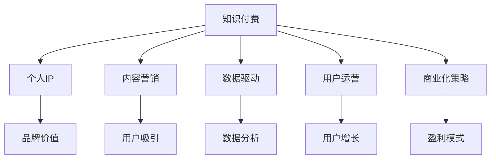

                 

# 如何打造个人知识付费商业帝国

> 关键词：知识付费, 个人IP, 内容营销, 数据驱动, 用户运营, 商业化策略

## 1. 背景介绍

在互联网时代，知识付费逐渐成为一种新兴的商业模式，成为很多专业人士转型和变现的重要途径。传统教育、科研、咨询等行业的专家，借助视频、音频、文本等多种形式，提供高质量的课程、讲座和咨询，赢得了越来越多的粉丝和客户。从俞敏洪的新东方到罗永浩的直播间，知识付费正成为连接专业人士与用户，实现商业价值的新渠道。

本文将从知识付费的内涵、现状与挑战出发，探讨如何打造个人知识付费商业帝国，构建稳定的商业模式，持续创造价值。文章将深入分析核心概念和原理，提供详细的具体操作步骤，并对未来趋势和挑战进行预测。

## 2. 核心概念与联系

### 2.1 核心概念概述

要打造个人知识付费商业帝国，首先需要了解几个关键概念：

- **知识付费(Knowledge Pricing)**：指用户为获取知识、技能、经验等付费的行为。通过付费机制，可以筛选出高价值用户，并建立用户与专家之间的信任关系。

- **个人IP(Personal Branding)**：指通过个人在某一领域的持续输出和品牌建设，建立独特的品牌形象和商业价值。知识付费是一种有效的IP打造手段，通过高质量的内容吸引粉丝和付费用户。

- **内容营销(Content Marketing)**：指通过提供有价值的内容，吸引、转化和留存用户，实现商业目标。内容营销是知识付费的核心，通过有趣、有用、有深度的内容，建立用户粘性和忠诚度。

- **数据驱动(Data-Driven)**：指在知识付费运营中，通过数据分析和优化，提高运营效率，实现个性化推荐、精准营销和用户画像构建。数据驱动是知识付费持续优化和迭代的保证。

- **用户运营(User Engagement)**：指通过多种策略和手段，提高用户参与度、留存率和转化率，构建健康稳定的用户生态。用户运营是知识付费商业模式的核心。

- **商业化策略(Business Strategy)**：指根据用户需求、市场变化和运营数据，设计有效的商业模式和盈利模型，实现可持续的商业化运营。商业化策略是知识付费商业帝国的基石。

### 2.2 核心概念原理和架构的 Mermaid 流程图



## 3. 核心算法原理 & 具体操作步骤

### 3.1 算法原理概述

个人知识付费商业帝国的构建，是一个复杂的多维系统工程。其核心原理是通过高质量的内容输出，建立个人品牌，吸引和转化用户，通过数据分析和用户运营，实现盈利模型的闭环和商业价值的最大化。

具体而言，知识付费系统的构建需要以下步骤：

1. **内容产出与品牌建设**：专家根据自身领域积累，生产高质量的内容，并通过社交媒体、博客、视频等多种渠道进行输出。同时，通过持续的优质内容输出，建立个人品牌形象和专业权威。
2. **用户吸引与转化**：利用内容营销手段，吸引潜在用户关注和付费。通过用户运营策略，提升用户留存率和转化率，建立稳定的用户群体。
3. **数据分析与优化**：通过数据分析，识别用户需求和行为规律，优化内容和运营策略，提高用户满意度和转化率。
4. **商业化运营与盈利**：根据用户需求和市场反馈，设计合理的盈利模型和商业模式，实现可持续的商业化运营。

### 3.2 算法步骤详解

以下是构建个人知识付费商业帝国的详细步骤：

**Step 1: 内容产出与品牌建设**

1. **确定内容定位**：根据自身专长和市场需求，确定知识付费的内容主题和形式。如编程、数据分析、人工智能、心理等。
2. **内容创作**：利用自己的专业知识，结合市场需求，创作高质量、有深度、有趣味的内容。可以是视频课程、音频讲座、博客文章、专栏等。
3. **品牌建设**：通过社交媒体、博客、视频等渠道，持续输出内容，建立个人品牌形象。利用Twitter、LinkedIn、YouTube、Bilibili等平台，提升个人曝光度和影响力。

**Step 2: 用户吸引与转化**

1. **渠道拓展**：选择合适的内容分发渠道，如视频平台、音频平台、博客平台、社交媒体等。
2. **内容推广**：利用SEO、KOL合作、广告投放、社交媒体推广等手段，提升内容的曝光度和关注度。
3. **用户运营**：建立社群、论坛、粉丝团等用户组织，定期互动和反馈，提升用户粘性和忠诚度。
4. **付费机制**：设置合理的付费门槛和优惠策略，如免费试听、订阅模式、团购折扣等，吸引用户付费。

**Step 3: 数据分析与优化**

1. **用户画像构建**：通过数据分析，识别用户的兴趣、需求、行为模式等，构建详细的用户画像。
2. **内容优化**：根据用户反馈和数据结果，不断优化内容和形式，提高内容的吸引力和用户满意度。
3. **运营策略优化**：利用数据分析，调整用户运营策略，如内容推送、社群互动、用户反馈等，提升用户留存率和转化率。

**Step 4: 商业化运营与盈利**

1. **盈利模型设计**：根据用户需求和市场反馈，设计合理的盈利模型，如单次付费、订阅付费、按需付费等。
2. **产品开发与迭代**：开发高质量的知识付费产品，如视频课程、音频讲座、专栏文章等，定期迭代更新，提升产品竞争力。
3. **商业化运营**：通过用户运营和市场推广，实现产品销售和品牌变现，构建可持续的商业运营体系。

### 3.3 算法优缺点

个人知识付费商业帝国的构建，具有以下优点：

1. **高附加值**：知识付费提供了高附加值的内容，可以显著提高个人收入和影响力。
2. **低门槛**：知识付费的准入门槛相对较低，只需具备一定的专业知识，即可通过内容输出实现商业价值。
3. **灵活性高**：知识付费的形式多样，可以适应不同的市场和用户需求，灵活调整运营策略。

同时，也存在一些缺点：

1. **市场竞争激烈**：随着知识付费的兴起，市场竞争日益激烈，获取和保持用户关注度需要持续努力。
2. **内容更新压力**：保持高质量的内容输出，需要持续学习和研究，对个人时间和精力要求较高。
3. **盈利模式单一**：目前主要依赖订阅和单次付费模式，未来的多元化盈利模式还需要探索和创新。

### 3.4 算法应用领域

个人知识付费商业帝国，已经在教育、咨询、健康、投资等诸多领域得到了广泛应用，成为专业人士实现商业化转型的重要手段。以下是几个典型应用场景：

- **教育培训**：如新东方、好未来、Coursera等平台，通过高质量的课程和讲座，帮助用户提升知识和技能。
- **职业咨询**：如罗永浩、俞敏洪等人士，通过个人品牌和内容输出，提供职业发展建议和咨询服务。
- **健康管理**：如张文宏医生通过视频和文章，普及健康知识和医学常识，提升公众健康意识。
- **投资理财**：如巴菲特、段永平等人士，通过博客和视频，分享投资理念和策略，吸引投资者关注和付费。

## 4. 数学模型和公式 & 详细讲解 & 举例说明

### 4.1 数学模型构建

我们可以从用户满意度和付费率两个维度，构建知识付费系统的数学模型。假设用户数量为 $N$，用户满意率为 $R$，付费率为 $P$，则系统的净收入 $I$ 可以表示为：

$$
I = P \times R \times N
$$

其中，$P$ 表示付费用户占总用户的比例，$R$ 表示付费用户的满意度，$N$ 表示总用户数量。

### 4.2 公式推导过程

为了最大化系统净收入 $I$，需要优化用户满意度和付费率。假设用户满意率为 $R$，付费率为 $P$，则有：

$$
R = f(C)
$$

其中 $C$ 表示内容质量，$f$ 为满意度的函数。

$$
P = g(D)
$$

其中 $D$ 表示用户对内容的兴趣度，$g$ 为付费率的函数。

将 $R$ 和 $P$ 代入净收入公式，得：

$$
I = g(D) \times f(C) \times N
$$

要最大化 $I$，需要优化 $C$ 和 $D$。内容质量 $C$ 和用户兴趣度 $D$ 是相互关联的，可以通过数据分析和用户反馈，不断优化内容策略和运营手段，提高用户满意度和付费率。

### 4.3 案例分析与讲解

以教育培训为例，通过分析用户反馈和课程评分，优化课程内容和教学方式，提升用户满意度和付费率。具体步骤如下：

1. **用户反馈分析**：利用在线问卷、评论、评分等手段，收集用户对课程的反馈，识别主要问题和改进方向。
2. **课程优化**：根据用户反馈，调整课程内容、教学方法、互动形式等，提高课程质量和用户满意度。
3. **兴趣度分析**：利用数据分析工具，如Google Analytics、Tableau等，分析用户行为数据，识别用户对课程内容的兴趣点。
4. **内容推荐**：利用推荐算法，推荐相关课程和文章，提升用户粘性和付费率。

通过以上步骤，可以持续优化课程内容，提高用户满意度和付费率，实现知识付费商业帝国的良性循环。

## 5. 项目实践：代码实例和详细解释说明

### 5.1 开发环境搭建

要实现知识付费系统的构建，需要以下开发环境：

1. **编程语言**：Python、JavaScript、Ruby等。
2. **开发框架**：Django、Flask、Express等。
3. **数据库**：MySQL、MongoDB、Redis等。
4. **云服务**：AWS、Google Cloud、阿里云等。
5. **开发工具**：Jupyter Notebook、PyCharm、Visual Studio Code等。

完成以上环境的搭建，即可开始开发。

### 5.2 源代码详细实现

以下是知识付费系统的主要功能模块和代码实现：

1. **用户管理模块**：负责用户注册、登录、信息管理等。
```python
from flask import Flask, render_template, redirect, url_for
from flask_sqlalchemy import SQLAlchemy

app = Flask(__name__)
app.config['SQLALCHEMY_DATABASE_URI'] = 'sqlite:///user.db'
db = SQLAlchemy(app)

class User(db.Model):
    id = db.Column(db.Integer, primary_key=True)
    username = db.Column(db.String(80), unique=True, nullable=False)
    email = db.Column(db.String(120), unique=True, nullable=False)
    password = db.Column(db.String(120), nullable=False)

@app.route('/register', methods=['GET', 'POST'])
def register():
    if request.method == 'POST':
        username = request.form['username']
        email = request.form['email']
        password = request.form['password']
        user = User(username=username, email=email, password=password)
        db.session.add(user)
        db.session.commit()
        return redirect(url_for('login'))
    return render_template('register.html')
```

2. **内容管理模块**：负责课程发布、查看、评论等。
```python
from flask import Flask, render_template, redirect, url_for
from flask_sqlalchemy import SQLAlchemy

app = Flask(__name__)
app.config['SQLALCHEMY_DATABASE_URI'] = 'sqlite:///content.db'
db = SQLAlchemy(app)

class Course(db.Model):
    id = db.Column(db.Integer, primary_key=True)
    title = db.Column(db.String(120), nullable=False)
    content = db.Column(db.Text, nullable=False)
    author = db.Column(db.String(80), nullable=False)
    price = db.Column(db.Float, nullable=False)

@app.route('/courses', methods=['GET', 'POST'])
def courses():
    courses = Course.query.all()
    return render_template('courses.html', courses=courses)
```

3. **支付模块**：负责用户付费、订单管理等。
```python
from flask import Flask, render_template, redirect, url_for
from flask_sqlalchemy import SQLAlchemy
from flask_pymongo import PyMongo

app = Flask(__name__)
app.config['SQLALCHEMY_DATABASE_URI'] = 'sqlite:///user.db'
app.config['MONGO_URI'] = 'mongodb://localhost:27017/payment'
db = SQLAlchemy(app)
mongo = PyMongo(app)

class Payment(db.Model):
    id = db.Column(db.Integer, primary_key=True)
    course_id = db.Column(db.Integer, nullable=False)
    user_id = db.Column(db.Integer, nullable=False)
    price = db.Column(db.Float, nullable=False)
    status = db.Column(db.String(20), nullable=False)

@app.route('/payment', methods=['GET', 'POST'])
def payment():
    course_id = request.form['course_id']
    user_id = request.form['user_id']
    price = request.form['price']
    payment = Payment(course_id=course_id, user_id=user_id, price=price, status='pending')
    db.session.add(payment)
    db.session.commit()
    return redirect(url_for('courses'))
```

### 5.3 代码解读与分析

通过以上代码，实现了知识付费系统的主要功能模块，包括用户管理、内容管理、支付模块等。具体解读如下：

1. **用户管理模块**：负责用户注册、登录、信息管理等。通过SQLAlchemy库，实现用户信息的存储和查询。
2. **内容管理模块**：负责课程发布、查看、评论等。通过SQLAlchemy库，实现课程信息的存储和查询。
3. **支付模块**：负责用户付费、订单管理等。通过SQLAlchemy和PyMongo库，实现支付信息的存储和查询。

### 5.4 运行结果展示

运行以上代码，即可实现知识付费系统的基本功能。用户可以通过注册、登录后，查看课程信息、发布评论、支付课程费用。

## 6. 实际应用场景

### 6.1 在线教育

在线教育平台通过知识付费模式，实现了教师和学生的双向互动和知识变现。如Coursera、Udacity、网易云课堂等，通过高质量的课程内容和用户运营，吸引了大量学习者，实现了商业价值的变现。

### 6.2 职业咨询

职业咨询专家通过知识付费，提供职业规划、求职技巧、面试指导等专业服务。如俞敏洪、李笑来、王垠等人士，通过个人品牌和内容输出，建立了稳定的用户群体，实现了商业价值的变现。

### 6.3 健康管理

健康管理专家通过知识付费，提供健康咨询、营养指导、心理辅导等专业服务。如张文宏医生通过视频和文章，普及健康知识和医学常识，提升公众健康意识，实现了商业价值的变现。

### 6.4 投资理财

投资理财专家通过知识付费，提供投资理念、股市分析、理财规划等专业服务。如巴菲特、段永平等人士，通过博客和视频，分享投资理念和策略，吸引了大量投资者关注和付费，实现了商业价值的变现。

## 7. 工具和资源推荐

### 7.1 学习资源推荐

为了帮助开发者系统掌握知识付费系统的构建和运营，这里推荐一些优质的学习资源：

1. **《知识付费实战指南》系列书籍**：详细介绍知识付费系统的原理、搭建、运营和优化，提供了大量成功案例和实操经验。
2. **《内容营销的艺术》课程**：由Google、HubSpot等知名机构开设，涵盖了内容创作、分发、优化等各个环节。
3. **《数据分析实战》课程**：介绍数据分析和优化的基本原理和工具，如Python、R、Tableau等，适用于知识付费系统的数据分析和优化。
4. **《用户运营的艺术》课程**：介绍用户运营和管理的策略和手段，如社群运营、用户增长、客户服务等，适用于知识付费系统的用户运营和维护。

### 7.2 开发工具推荐

高效的开发离不开优秀的工具支持。以下是几款用于知识付费系统开发的常用工具：

1. **编程语言**：Python、JavaScript、Ruby等。
2. **开发框架**：Django、Flask、Express等。
3. **数据库**：MySQL、MongoDB、Redis等。
4. **云服务**：AWS、Google Cloud、阿里云等。
5. **开发工具**：Jupyter Notebook、PyCharm、Visual Studio Code等。

### 7.3 相关论文推荐

知识付费系统的研究和实践，源于学界的持续研究。以下是几篇奠基性的相关论文，推荐阅读：

1. **《知识付费商业模型研究》**：深入探讨知识付费的商业模型和盈利模式，提供了大量的案例分析和实际应用建议。
2. **《内容推荐算法研究》**：介绍内容推荐算法的基本原理和实现方法，适用于知识付费系统的用户推荐和个性化服务。
3. **《用户行为分析与优化》**：介绍用户行为分析和优化的基本方法和工具，适用于知识付费系统的用户运营和数据驱动优化。
4. **《社交媒体对知识付费的影响》**：研究社交媒体对知识付费用户吸引和转化效果的影响，提供了社交媒体策略的实用建议。

## 8. 总结：未来发展趋势与挑战

### 8.1 总结

本文对知识付费的内涵、现状与挑战进行了全面系统的介绍。首先阐述了知识付费的基本概念、核心原则和主要运营环节。其次，从内容产出与品牌建设、用户吸引与转化、数据分析与优化、商业化运营与盈利等环节，详细讲解了知识付费系统的搭建和运营。最后，通过对实际应用场景的探讨，展示了知识付费系统的广阔前景。

通过本文的系统梳理，可以看到，知识付费正成为连接专业人士与用户，实现商业价值的重要途径。未来，伴随知识付费平台的持续发展和运营优化，知识付费模式必将在更多领域得到应用，为专业人士实现商业价值提供更多可能。

### 8.2 未来发展趋势

展望未来，知识付费系统将呈现以下几个发展趋势：

1. **内容多元化**：知识付费内容将更加丰富和多元化，涵盖编程、金融、心理学、健康等多个领域，满足不同用户的需求。
2. **平台生态化**：知识付费平台将实现生态化发展，通过课程推荐、社区互动、用户反馈等手段，构建更加稳定和可持续的用户生态。
3. **数据驱动化**：通过大数据和人工智能技术，实现内容推荐、用户画像构建、运营策略优化等，提升知识付费系统的运营效率和用户满意度。
4. **用户个性化**：通过用户画像和个性化推荐算法，实现定制化、差异化的内容输出，提升用户粘性和忠诚度。
5. **技术前沿化**：引入前沿技术，如区块链、人工智能、增强现实等，提升知识付费系统的安全性、互动性和沉浸感。

### 8.3 面临的挑战

尽管知识付费系统在实践中取得了一定成效，但仍面临以下挑战：

1. **内容质量**：高质量内容的持续产出，需要专家具备较强的专业知识和持续学习能力。如何确保内容的更新和优化，是知识付费系统需要解决的问题。
2. **用户留存**：用户流失率高，如何通过优质的内容和服务，提高用户留存率和转化率，需要持续运营和优化。
3. **盈利模式**：单一的订阅和单次付费模式，无法满足多样化的用户需求和市场变化，如何设计多元化的盈利模式，需要更多的探索和创新。
4. **平台竞争**：知识付费平台众多，如何突出自身特色，吸引和保持用户关注，需要持续创新和优化。
5. **技术落地**：如何将前沿技术应用于知识付费系统，需要更多的实践和验证。

### 8.4 研究展望

未来的研究需要在以下几个方向进行更多的探索：

1. **内容质量提升**：通过大数据和人工智能技术，持续优化内容质量和用户满意度，提升知识付费系统的核心竞争力。
2. **平台生态构建**：通过社区互动、用户反馈等手段，构建稳定的用户生态，提升知识付费系统的粘性和持续性。
3. **盈利模式创新**：探索更多的盈利模式，如按需付费、众筹模式、平台分成等，实现知识付费系统的多元化收入来源。
4. **技术应用深化**：引入前沿技术，如区块链、人工智能、增强现实等，提升知识付费系统的安全性和用户体验。

通过持续的研究和创新，知识付费系统必将在更广阔的领域得到应用，为专业人士实现商业价值提供更多可能。总之，知识付费需要开发者不断迭代和优化内容、运营和盈利模式，方能得到理想的效果。

## 9. 附录：常见问题与解答

**Q1：如何确定知识付费的内容定位？**

A: 确定内容定位需要考虑市场调研、自身专长和用户需求三个方面。首先，通过市场调研，了解行业趋势和用户需求，选择具有市场潜力的内容方向。其次，结合自身专长和经验，选择擅长且感兴趣的内容领域。最后，通过用户反馈和市场数据，不断优化和调整内容定位，确保内容质量和用户满意度。

**Q2：如何提高知识付费用户的留存率和转化率？**

A: 提高用户留存率和转化率需要从内容、运营和用户互动等多个环节进行优化。具体措施包括：
1. **内容优化**：通过持续产出高质量、有深度的内容，满足用户需求，提升用户满意度。
2. **运营策略**：通过社区互动、社群运营、用户反馈等手段，提升用户粘性和忠诚度。
3. **个性化推荐**：通过用户画像和推荐算法，实现个性化内容推荐，提升用户粘性和转化率。

**Q3：知识付费系统的盈利模式有哪些？**

A: 知识付费系统的盈利模式多种多样，主要包括以下几种：
1. **单次付费**：用户购买一次课程或文章，获得长期访问权。
2. **订阅付费**：用户按月、按年订阅课程或专栏，享受持续更新和优质内容。
3. **按需付费**：用户根据课程时长或内容价值，按需支付费用。
4. **会员制**：用户通过购买会员，享受更多课程、社群、工具等权益。
5. **众筹模式**：用户通过资助特定课程的开发，享受提前发布或独家内容。

通过多样化的盈利模式，知识付费系统可以更好地满足用户需求，实现商业价值的最大化。

**Q4：如何构建知识付费平台的用户生态？**

A: 构建知识付费平台的用户生态，需要从用户吸引、社群运营、社区互动等多个环节进行优化。具体措施包括：
1. **用户吸引**：通过SEO、KOL合作、广告投放、社交媒体推广等手段，提升内容曝光度和用户关注度。
2. **社群运营**：建立社群、论坛、粉丝团等用户组织，定期互动和反馈，提升用户粘性和忠诚度。
3. **社区互动**：通过评论区、私信、问答等手段，增强用户互动和社区氛围。
4. **用户反馈**：通过在线问卷、评论、评分等手段，收集用户反馈，不断优化内容和运营策略。

通过以上措施，可以构建健康稳定的用户生态，实现知识付费平台的持续发展和商业价值最大化。

**Q5：如何设计知识付费平台的盈利模型？**

A: 设计知识付费平台的盈利模型，需要考虑用户需求、市场变化和运营数据等多个因素。具体步骤包括：
1. **市场调研**：通过调研市场和用户需求，确定适合的知识付费内容和形式。
2. **用户画像构建**：利用数据分析工具，识别用户行为和需求，构建详细的用户画像。
3. **盈利模式选择**：根据用户画像和市场反馈，设计合理的盈利模式，如单次付费、订阅付费、按需付费等。
4. **商业模式验证**：通过小规模试点和用户反馈，验证盈利模式的可行性和用户接受度。
5. **盈利模型优化**：根据运营数据和用户反馈，不断优化盈利模型，提升商业价值和用户体验。

通过以上步骤，可以设计出适合的知识付费盈利模型，实现平台的商业化运营和持续发展。

---

作者：禅与计算机程序设计艺术 / Zen and the Art of Computer Programming

