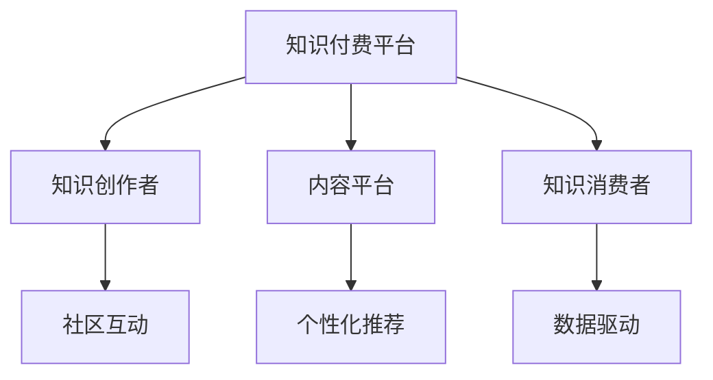

                 

# 如何打造个人知识付费生态系统

## 1. 背景介绍

随着互联网和移动通信技术的飞速发展，知识付费产业正成为教育领域的新蓝海。个人知识付费生态系统不仅包括内容创作和销售，更涵盖了社区互动、个性化推荐、数据驱动等复杂模块。本文将详细阐述打造一个高效、有序、可持续发展的个人知识付费生态系统所需的关键技术和策略。

## 2. 核心概念与联系

### 2.1 核心概念概述

为更好地理解个人知识付费生态系统的构建，本节将介绍几个关键概念及其相互联系：

- **知识付费平台**：指以内容创作和知识销售为主要业务，通过互联网为终端用户提供知识服务和产品的平台。
- **知识创作者**：指在平台中提供知识内容，并以此获得报酬的个人或组织。
- **内容平台**：指提供内容存储、分发、展示的平台，如文章、视频、音频等。
- **知识消费者**：指购买和消费知识产品，并给予评价反馈的用户群体。
- **社区互动**：指用户与用户、用户与内容创作者之间的互动交流。
- **个性化推荐**：通过数据分析和算法优化，根据用户行为和偏好推荐个性化内容。
- **数据驱动**：指利用数据进行决策和优化，提升平台运营效率和用户体验。

这些概念之间的逻辑关系可以通过以下Mermaid流程图来展示：



这个流程图展示了各个组件之间的相互依赖和作用：

1. **知识创作者**通过平台提供的工具和资源创作优质内容。
2. **内容平台**负责内容的存储、分发和展示。
3. **知识消费者**在平台中购买和消费知识产品，并反馈意见。
4. **社区互动**增进用户与创作者、用户与用户之间的交流。
5. **个性化推荐**根据用户行为提高平台内容的相关性和吸引力。
6. **数据驱动**通过分析用户数据优化平台运营策略。

## 3. 核心算法原理 & 具体操作步骤
### 3.1 算法原理概述

个人知识付费生态系统的核心算法主要围绕内容推荐、用户行为分析、社区互动管理等展开。

- **内容推荐算法**：通过机器学习模型，分析用户历史行为数据和内容特征，推荐最相关的内容给用户。
- **用户行为分析算法**：利用统计分析和机器学习算法，分析用户购买行为、学习行为、互动行为等，挖掘用户需求和偏好。
- **社区互动管理算法**：通过自然语言处理和情感分析技术，对用户评论、留言等文本数据进行情感分析和主题分类，维护社区秩序。

### 3.2 算法步骤详解

以下详细介绍这些核心算法的详细步骤：

#### 3.2.1 内容推荐算法

1. **数据预处理**：收集用户行为数据和内容数据，进行清洗、去重和标准化处理。
2. **特征工程**：提取内容特征和用户特征，如标签、分类、用户兴趣、互动行为等。
3. **模型训练**：选择合适的推荐算法（如协同过滤、矩阵分解、深度学习等）进行模型训练，并不断调参优化。
4. **推荐结果排序**：将训练好的模型应用于新数据，排序推荐结果，生成最终推荐列表。

#### 3.2.2 用户行为分析算法

1. **数据收集**：收集用户注册、登录、浏览、购买、互动等行为数据。
2. **特征提取**：提取用户行为特征，如访问时间、频率、停留时长等。
3. **模型构建**：选择合适的统计模型或机器学习模型，如用户画像、协同过滤、深度学习等。
4. **分析与预测**：利用训练好的模型分析用户行为，预测用户兴趣和需求。

#### 3.2.3 社区互动管理算法

1. **文本预处理**：对用户评论、留言等文本数据进行分词、去停用词、标注情感等预处理。
2. **特征提取**：提取文本特征，如情感倾向、主题分类、关键词等。
3. **情感分析**：通过情感分析模型判断文本情感，维护社区氛围。
4. **主题分类**：通过主题分类模型，将文本按主题分类，促进社区交流。

### 3.3 算法优缺点

- **内容推荐算法**的优点在于能够根据用户行为精准推荐相关内容，提升用户体验；缺点是对数据量和算法复杂度要求较高。
- **用户行为分析算法**的优点在于能准确分析用户需求和行为，提供个性化服务；缺点是用户隐私保护和数据安全需要重点考虑。
- **社区互动管理算法**的优点在于促进社区健康交流，提升用户粘性；缺点是情感分析的准确性和文本分类的效果直接影响社区管理效果。

### 3.4 算法应用领域

这些算法已经在知识付费领域得到了广泛应用，涵盖了以下几个主要方面：

- **个性化推荐**：推荐系统已经成为知识付费平台的标配，如Coursera、Udemy等平台都使用了个性化推荐技术，提升用户黏性和满意度。
- **用户行为分析**：通过分析用户行为数据，知识付费平台可以优化产品设计、提升用户体验，并进行精准营销。
- **社区互动管理**：如知乎、CSDN等平台通过社区互动管理，提升用户活跃度和平台粘性。

## 4. 数学模型和公式 & 详细讲解 & 举例说明

### 4.1 数学模型构建

本节将使用数学语言对内容推荐算法的核心模型进行详细构建和分析。

设用户-内容交互矩阵为 $\mathbf{M} \in \mathbb{R}^{n \times m}$，其中 $n$ 为用户数量，$m$ 为内容数量，$\mathbf{M}_{ij}$ 表示用户 $i$ 对内容 $j$ 的评分（如点击次数、购买次数等）。目标是找到一个低秩矩阵 $\mathbf{X} \in \mathbb{R}^{n \times k}$ 和 $\mathbf{Y} \in \mathbb{R}^{m \times k}$，使得 $\mathbf{M} \approx \mathbf{X} \mathbf{Y}^{\top}$，其中 $k$ 为矩阵的列数。

### 4.2 公式推导过程

假设 $\mathbf{X}$ 和 $\mathbf{Y}$ 为低秩矩阵，其奇异值分解为 $\mathbf{X}=\mathbf{U}\boldsymbol{\Sigma}\mathbf{V}^{\top}$，$\mathbf{Y}=\mathbf{H}\boldsymbol{\Lambda}\mathbf{C}^{\top}$，其中 $\mathbf{U}, \mathbf{V}, \mathbf{H}, \mathbf{C} \in \mathbb{R}^{n \times k}$ 为正交矩阵，$\boldsymbol{\Sigma}, \boldsymbol{\Lambda} \in \mathbb{R}^{k \times k}$ 为对角矩阵。

设 $\mathbf{X}, \mathbf{Y}$ 的奇异值分解中，前 $r$ 个奇异值（$r \ll k$）足够表达 $\mathbf{M}$ 的特征，则有：

$$
\mathbf{M} \approx \mathbf{U}_r\boldsymbol{\Sigma}_r\mathbf{V}_r^{\top}\mathbf{H}_r\boldsymbol{\Lambda}_r\mathbf{C}_r^{\top}
$$

将上述矩阵乘法展开，得到：

$$
\mathbf{M} \approx \mathbf{U}_r\mathbf{V}_r^{\top}\mathbf{H}_r\mathbf{C}_r^{\top}\mathbf{V}_r\boldsymbol{\Sigma}_r\mathbf{V}_r^{\top}\mathbf{H}_r\boldsymbol{\Lambda}_r\mathbf{C}_r^{\top}
$$

简化得到：

$$
\mathbf{M} \approx \mathbf{U}_r\mathbf{H}_r\mathbf{C}_r^{\top}\boldsymbol{\Sigma}_r\boldsymbol{\Lambda}_r\mathbf{V}_r^{\top}\mathbf{H}_r\mathbf{C}_r^{\top}
$$

将上述矩阵表示为 $\mathbf{X}_r$ 和 $\mathbf{Y}_r$ 的形式：

$$
\mathbf{M} \approx \mathbf{X}_r\mathbf{Y}_r^{\top}
$$

其中 $\mathbf{X}_r=\mathbf{U}_r\mathbf{H}_r\mathbf{C}_r^{\top}$，$\mathbf{Y}_r=\mathbf{V}_r\boldsymbol{\Sigma}_r\mathbf{H}_r\mathbf{C}_r^{\top}$。

通过SVD分解矩阵 $\mathbf{M}$，我们可以找到低秩矩阵 $\mathbf{X}_r$ 和 $\mathbf{Y}_r$，从而构建推荐模型。

### 4.3 案例分析与讲解

设 $\mathbf{M}$ 为一个 $1000 \times 1000$ 的用户-内容交互矩阵，采用SVD分解，选择前 $100$ 个奇异值，即 $k=100$，则得到 $\mathbf{X}_r \in \mathbb{R}^{1000 \times 100}$ 和 $\mathbf{Y}_r \in \mathbb{R}^{1000 \times 100}$。

使用 $\mathbf{X}_r$ 和 $\mathbf{Y}_r$ 进行矩阵乘法，即可得到推荐矩阵 $\mathbf{X}_r\mathbf{Y}_r^{\top}$，用于推荐系统。

具体步骤如下：

1. **数据预处理**：使用Python读取用户-内容交互矩阵 $\mathbf{M}$。
2. **SVD分解**：使用numpy库中的SVD函数进行奇异值分解，得到 $\mathbf{U}_r, \boldsymbol{\Sigma}_r, \mathbf{V}_r$。
3. **构建推荐矩阵**：计算 $\mathbf{X}_r=\mathbf{U}_r\mathbf{H}_r\mathbf{C}_r^{\top}$ 和 $\mathbf{Y}_r=\mathbf{V}_r\boldsymbol{\Sigma}_r\mathbf{H}_r\mathbf{C}_r^{\top}$，并进行矩阵乘法得到推荐矩阵 $\mathbf{X}_r\mathbf{Y}_r^{\top}$。
4. **推荐结果排序**：根据推荐矩阵，对用户进行推荐，并按照相关度排序。

## 5. 项目实践：代码实例和详细解释说明

### 5.1 开发环境搭建

在进行内容推荐算法实践前，我们需要准备好开发环境。以下是使用Python进行PyTorch开发的环境配置流程：

1. 安装Anaconda：从官网下载并安装Anaconda，用于创建独立的Python环境。

2. 创建并激活虚拟环境：
```bash
conda create -n pytorch-env python=3.8 
conda activate pytorch-env
```

3. 安装PyTorch：根据CUDA版本，从官网获取对应的安装命令。例如：
```bash
conda install pytorch torchvision torchaudio cudatoolkit=11.1 -c pytorch -c conda-forge
```

4. 安装各类工具包：
```bash
pip install numpy pandas scikit-learn matplotlib tqdm jupyter notebook ipython
```

完成上述步骤后，即可在`pytorch-env`环境中开始内容推荐算法的实践。

### 5.2 源代码详细实现

下面我们以协同过滤推荐算法为例，给出使用PyTorch进行内容推荐算法的PyTorch代码实现。

首先，定义协同过滤算法的类：

```python
from torch import nn
import numpy as np

class CollaborativeFiltering(nn.Module):
    def __init__(self, user_dim, item_dim, num_factors=100):
        super(CollaborativeFiltering, self).__init__()
        self.user_dim = user_dim
        self.item_dim = item_dim
        self.num_factors = num_factors
        
        self.user_factors = nn.Embedding(user_dim, num_factors)
        self.item_factors = nn.Embedding(item_dim, num_factors)
        self.interaction = nn.Linear(num_factors, 1)
        
    def forward(self, user_ids, item_ids):
        user_factors = self.user_factors(user_ids)
        item_factors = self.item_factors(item_ids)
        interaction = self.interaction(torch.matmul(user_factors, item_factors.transpose(1, 0))).squeeze(1)
        return interaction
```

然后，定义数据预处理和模型训练函数：

```python
def preprocess_data(data):
    return torch.tensor(data, dtype=torch.float32)

def train_model(model, data_train, data_test, user_dim, item_dim, num_epochs=10, learning_rate=0.01):
    user_ids_train, item_ids_train, ratings_train = data_train[:, 0], data_train[:, 1], data_train[:, 2]
    user_ids_test, item_ids_test, ratings_test = data_test[:, 0], data_test[:, 1], data_test[:, 2]
    
    model.train()
    optimizer = torch.optim.Adam(model.parameters(), lr=learning_rate)
    
    for epoch in range(num_epochs):
        for i in range(len(user_ids_train)):
            user_ids = user_ids_train[i].unsqueeze(0)
            item_ids = item_ids_train[i].unsqueeze(0)
            ratings = ratings_train[i].unsqueeze(0)
            
            preds = model(user_ids, item_ids)
            loss = nn.MSELoss()(preds, ratings)
            optimizer.zero_grad()
            loss.backward()
            optimizer.step()
            
        test_loss = model(user_ids_test, item_ids_test).to('cpu').detach().numpy() * ratings_test
        
    return model, test_loss
```

最后，调用上述函数进行模型训练和测试：

```python
user_dim = 1000
item_dim = 1000
data = np.load('data.npz')
model = CollaborativeFiltering(user_dim, item_dim)
model, test_loss = train_model(model, data['train'], data['test'], user_dim, item_dim, learning_rate=0.01)
```

以上就是使用PyTorch进行协同过滤推荐算法的完整代码实现。可以看到，通过定义合适的模型结构和训练函数，可以轻松实现内容推荐算法的开发。

### 5.3 代码解读与分析

让我们再详细解读一下关键代码的实现细节：

**CollaborativeFiltering类**：
- `__init__`方法：初始化用户维度、物品维度和因子数量。
- `forward`方法：计算用户和物品的因子表示，并进行矩阵乘法得到交互项，最终经过线性层输出预测值。

**preprocess_data函数**：
- 将数据转换为PyTorch张量，并进行标准化处理。

**train_model函数**：
- 定义训练数据和测试数据。
- 定义模型和优化器。
- 在每个epoch内，对每个训练样本进行前向传播、计算损失、反向传播和参数更新。
- 在每个epoch结束后，对测试集进行预测，计算平均测试损失。

**train_model函数**：
- 将训练集中的每个样本进行前向传播和反向传播，计算平均损失。
- 在测试集上评估模型的预测准确度，返回测试损失。

在实际应用中，还需要对推荐结果进行排序和推荐展示，以便用户直观地获取推荐内容。

## 6. 实际应用场景

### 6.1 教育平台

在教育平台中，通过内容推荐算法，可以为学生推荐符合其学习需求的课程和资料。例如，根据学生的学习进度和成绩，推荐合适的课程和习题，提升学习效果。同时，通过社区互动功能，让学生能够互相交流学习心得，构建互助学习的社区氛围。

### 6.2 金融投资

在金融投资领域，通过个性化推荐，为用户推荐适合的投资产品和策略。例如，根据用户的投资风格和风险偏好，推荐不同的基金、股票和债券，并提供实时市场分析，帮助用户做出更明智的投资决策。

### 6.3 娱乐媒体

在娱乐媒体领域，通过内容推荐算法，为用户推荐符合其兴趣爱好的电影、电视剧、音乐等娱乐内容。例如，根据用户的观看历史和评分，推荐相似的影视作品和歌曲，提升用户体验。同时，通过社区互动功能，让用户分享观后感和评论，增强社区活跃度。

### 6.4 未来应用展望

随着内容推荐算法和用户行为分析技术的不断进步，未来的知识付费平台将实现更加精准、个性化的推荐和分析。通过引入更多先验知识，如知识图谱、专家推荐等，平台将能够提供更为全面和准确的内容和服务。同时，通过引入因果分析和博弈论工具，平台将能够更好地理解和预测用户行为，提升用户体验和运营效率。

## 7. 工具和资源推荐
### 7.1 学习资源推荐

为了帮助开发者系统掌握内容推荐算法的理论基础和实践技巧，这里推荐一些优质的学习资源：

1. **《深度学习入门：基于PyTorch的理论与实现》**：由《深度学习》作者Ian Goodfellow所著，全面介绍了深度学习的基础理论、模型实现和应用实践，适合初学者和进阶者阅读。

2. **《推荐系统实战》**：一本结合Python和TensorFlow实现推荐系统的书籍，内容详实，注重实践，适合动手实践。

3. **Coursera《机器学习基础》课程**：由斯坦福大学Andrew Ng教授主讲的经典课程，涵盖机器学习基础理论和实践，适合进一步学习。

4. **Kaggle竞赛**：参与Kaggle推荐系统竞赛，实战练兵，积累经验，提升算法能力。

5. **GitHub推荐系统开源项目**：如MovieLens、Last.fm等，可以学习优秀推荐系统的实现细节，借鉴其设计思路。

通过对这些资源的学习实践，相信你一定能够快速掌握内容推荐算法的精髓，并用于解决实际的推荐问题。

### 7.2 开发工具推荐

高效的开发离不开优秀的工具支持。以下是几款用于内容推荐算法开发的常用工具：

1. **PyTorch**：基于Python的开源深度学习框架，灵活动态的计算图，适合快速迭代研究。

2. **TensorFlow**：由Google主导开发的开源深度学习框架，生产部署方便，适合大规模工程应用。

3. **Pandas**：Python数据分析库，支持大规模数据处理，适合数据清洗和特征工程。

4. **NumPy**：Python科学计算库，支持高效的矩阵运算，适合算法实现和模型训练。

5. **Jupyter Notebook**：交互式编程环境，支持代码实现和结果展示，适合科研和教学使用。

合理利用这些工具，可以显著提升内容推荐算法的开发效率，加快创新迭代的步伐。

### 7.3 相关论文推荐

内容推荐算法和用户行为分析技术的研究源于学界的持续研究。以下是几篇奠基性的相关论文，推荐阅读：

1. **《隐式推荐系统》**：Wu等人在SIGIR会议上提出的隐式推荐系统模型，利用用户行为数据进行推荐，开启了推荐系统研究的新篇章。

2. **《矩阵分解推荐算法》**：Hu等人在ICDM会议上提出的矩阵分解算法，通过矩阵分解方式实现协同过滤推荐。

3. **《深度学习在推荐系统中的应用》**：Wu等人在KDD会议上提出的深度学习推荐系统，通过多层神经网络进行推荐，取得了显著的效果。

4. **《基于知识图谱的推荐系统》**：Guan等人在WSDM会议上提出的基于知识图谱的推荐系统，融合了图神经网络，提升了推荐系统的表现。

5. **《基于协同过滤的推荐系统》**：Narasimhan等人在SIGIR会议上提出的协同过滤推荐系统，利用用户行为数据进行推荐。

这些论文代表了大数据推荐系统的发展脉络。通过学习这些前沿成果，可以帮助研究者把握学科前进方向，激发更多的创新灵感。

## 8. 总结：未来发展趋势与挑战

### 8.1 总结

本文对内容推荐算法的构建进行了全面系统的介绍。首先阐述了内容推荐算法在知识付费平台中的重要性，明确了推荐算法在提升用户体验、优化运营效率方面的独特价值。其次，从原理到实践，详细讲解了内容推荐算法的数学模型、推荐流程和实际应用，给出了代码实现和详细解释。最后，本文还探讨了推荐算法在教育平台、金融投资、娱乐媒体等多个行业领域的应用前景，展示了推荐算法的巨大潜力。

通过本文的系统梳理，可以看到，内容推荐算法是知识付费生态系统的核心引擎，是提升平台竞争力和用户体验的关键。掌握推荐算法的设计和实现，能够为知识付费平台的成功奠定坚实基础。

### 8.2 未来发展趋势

展望未来，内容推荐算法将呈现以下几个发展趋势：

1. **算法模型多样化**：除了传统的协同过滤和矩阵分解，未来将涌现更多复杂推荐算法，如深度学习、图神经网络、强化学习等，以应对更加复杂和动态的数据场景。

2. **数据融合和协同**：通过数据融合和协同，提升推荐算法的准确性和鲁棒性。例如，利用多模态数据（如文本、图片、音频等）进行联合推荐。

3. **隐私保护和数据安全**：随着用户隐私保护的重视，推荐算法需要引入更多隐私保护机制，如差分隐私、联邦学习等。

4. **实时推荐和动态调整**：通过实时数据处理和模型更新，实现动态调整和推荐，提升推荐效果。例如，利用流数据和在线学习算法进行实时推荐。

5. **个性化推荐和社交推荐**：通过用户社交网络和群体行为分析，实现个性化和社交推荐，提升用户体验。例如，利用社交网络数据进行个性化推荐。

6. **推荐系统的扩展和多样化**：推荐系统将不仅仅局限于内容推荐，还将扩展到商品推荐、服务推荐、动态定价等更多领域。

这些趋势凸显了内容推荐算法的广阔前景。这些方向的探索发展，必将进一步提升推荐算法的表现和应用范围，为知识付费平台带来更大的价值。

### 8.3 面临的挑战

尽管内容推荐算法已经取得了瞩目成就，但在迈向更加智能化、普适化应用的过程中，它仍面临着诸多挑战：

1. **数据稀疏性**：用户行为数据稀疏性高，可能导致模型泛化能力不足，推荐结果不准确。

2. **模型复杂度**：复杂推荐模型计算量巨大，资源消耗高，部署难度大。

3. **冷启动问题**：新用户或新内容加入时，推荐系统难以快速适应，推荐效果不佳。

4. **隐私保护**：用户隐私保护和数据安全问题，需要在推荐算法中进行充分考虑和设计。

5. **公平性问题**：推荐算法容易产生偏见，导致部分用户或内容被忽视，需要引入公平性约束。

6. **推荐系统溢出效应**：推荐系统可能加剧“信息茧房”效应，导致用户信息孤岛化，需要引入多样性控制策略。

7. **推荐系统的可解释性**：推荐系统的黑盒特性，难以解释其决策过程，需要引入可解释性方法。

这些挑战需要研究者不断探索和突破，才能实现推荐算法的可持续发展。

### 8.4 研究展望

面对内容推荐算法所面临的挑战，未来的研究需要在以下几个方面寻求新的突破：

1. **无监督和半监督推荐**：摆脱对大规模标注数据的依赖，利用自监督学习、主动学习等无监督和半监督范式，最大化利用非结构化数据，实现更加灵活高效的推荐。

2. **参数高效和计算高效**：开发更加参数高效和计算高效的推荐模型，在固定大部分参数的情况下，只更新极少量的任务相关参数，减小资源消耗。

3. **多模态推荐**：将符号化的先验知识与神经网络模型进行巧妙融合，融合视觉、语音、文本等多模态信息，实现多模态联合推荐。

4. **因果推荐**：引入因果推断方法，构建稳定因果关系，学习更加普适、鲁棒的语言表征，提升推荐系统泛化能力和抗干扰能力。

5. **公平推荐**：通过算法设计和数据采集，引入公平性约束，确保推荐系统的公平性和公正性。

6. **可解释推荐**：引入可解释性方法，增强推荐系统的可解释性和透明性，帮助用户理解推荐结果。

这些研究方向的研究和发展，必将引领内容推荐算法迈向更高的台阶，为知识付费平台带来更大的价值。面向未来，内容推荐算法需要与其他人工智能技术进行更深入的融合，如知识表示、因果推理、强化学习等，多路径协同发力，共同推动推荐系统的进步。只有勇于创新、敢于突破，才能不断拓展推荐算法的边界，让推荐系统更好地服务于用户，提升平台价值。

## 9. 附录：常见问题与解答

**Q1：内容推荐算法是否适用于所有类型的数据？**

A: 内容推荐算法一般适用于结构化或半结构化数据，如图数据库、关系型数据库、表格数据等。对于非结构化数据，如文本、图片、音频等，需要进行数据预处理和特征提取，才能应用于推荐算法。

**Q2：如何优化内容推荐算法的性能？**

A: 优化内容推荐算法的性能可以从以下几个方面入手：
1. **数据预处理**：进行数据清洗、去重、标准化等预处理，提高数据质量。
2. **特征工程**：选择合适的特征提取方法和特征工程技巧，提升模型性能。
3. **模型优化**：选择合适的推荐算法，并进行调参优化，提升模型效果。
4. **实时处理**：利用流数据处理和在线学习算法，实现实时推荐，提升用户体验。
5. **模型压缩**：对模型进行剪枝、量化等压缩优化，减小资源消耗。

**Q3：如何实现内容推荐算法的个性化推荐？**

A: 实现个性化推荐需要从以下几个方面入手：
1. **用户画像**：利用用户行为数据和内容互动数据，构建用户画像，挖掘用户需求和偏好。
2. **内容推荐**：根据用户画像，进行内容推荐，提升用户体验。
3. **动态调整**：根据用户反馈和互动数据，动态调整推荐策略，提升推荐效果。

**Q4：如何构建社区互动功能？**

A: 构建社区互动功能需要从以下几个方面入手：
1. **用户注册和登录**：提供用户注册和登录功能，增强用户粘性。
2. **评论和留言**：提供评论和留言功能，增加用户互动。
3. **情感分析**：利用情感分析技术，对评论和留言进行情感分类，维护社区秩序。
4. **主题分类**：利用主题分类技术，对评论和留言进行分类，促进社区交流。

**Q5：如何保证推荐系统的公平性？**

A: 保证推荐系统的公平性需要从以下几个方面入手：
1. **数据采集**：在数据采集时，尽量覆盖各种类型用户和内容，避免数据偏见。
2. **模型设计**：在模型设计时，引入公平性约束，确保模型不偏向特定用户或内容。
3. **算法优化**：在算法优化时，引入多样性控制策略，确保推荐结果的多样性。

总之，构建社区互动功能和保证推荐系统的公平性是内容推荐算法的两个关键方面，需要在设计和实现过程中不断优化和调整。只有全面考虑各个环节，才能打造高效、有序、可持续发展的知识付费生态系统。

---

作者：禅与计算机程序设计艺术 / Zen and the Art of Computer Programming

