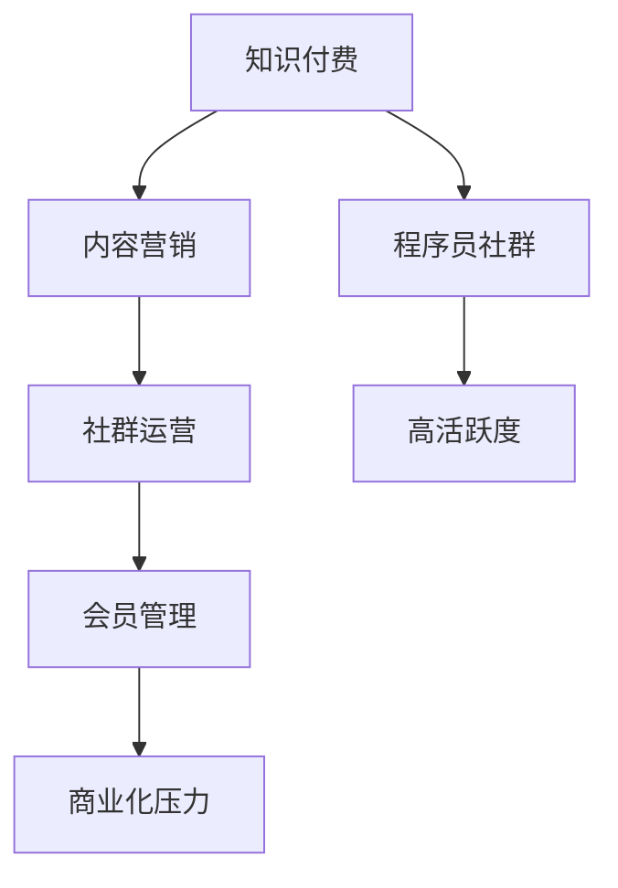

                 

# 如何打造高活跃度的程序员知识付费社群

> 关键词：知识付费, 社群运营, 程序员社区, 会员管理, 内容营销

## 1. 背景介绍

在互联网时代，知识付费成为一种新兴的商业模式，旨在帮助用户高效获取专业知识，加速学习和成长。程序员知识付费社群，作为连接技术开发者和知识付费平台的重要环节，是推动技术交流与知识传播的重要力量。然而，当前的程序员社群往往存在活跃度低、用户粘性差、商业化压力等问题，难以持续发展。本文将系统探讨如何打造高活跃度的程序员知识付费社群，提升社群的用户参与度和商业价值。

## 2. 核心概念与联系

### 2.1 核心概念概述

为更好地理解如何打造高活跃度的程序员知识付费社群，本节将介绍几个关键概念：

- 知识付费：指用户为获取专业知识、技能培训而付费，以降低学习成本、提高学习效率的一种商业模式。
- 程序员社群：指一群技术开发者组成的网络社群，通过分享经验、交流技术、互相支持等方式，促进知识传播和技术进步。
- 知识付费社群：将知识付费理念和社群运营相结合，通过付费订阅、课程销售等方式，为用户提供高质量技术内容的平台。
- 社群运营：指通过有效的管理和互动，提高社群用户参与度和粘性的过程。
- 内容营销：通过生产有价值的内容，吸引和留住用户，提升社群品牌影响力。
- 会员管理：通过精细化的会员权益和服务，增强用户忠诚度和满意度。
- 商业化压力：指社群在运营过程中面临的盈利和商业变现的需求。

这些概念之间的逻辑关系可以通过以下Mermaid流程图来展示：



这个流程图展示了知识付费与程序员社群之间以及与内容营销、社群运营、会员管理等核心要素之间的关联关系。通过优化这些环节，可以提升社群的整体活跃度。

## 3. 核心算法原理 & 具体操作步骤
### 3.1 算法原理概述

打造高活跃度的程序员知识付费社群，其核心在于通过内容创新和运营策略，激发用户参与和互动，构建一个良性循环的社区生态。主要包括以下几个方面：

1. **内容驱动：** 高质量的内容是社群活跃的基石。通过定期发布有价值的技术文章、视频教程、项目实战等，吸引用户参与和分享。
2. **互动引导：** 利用评论区、论坛、直播等互动形式，鼓励用户积极提问和回答，建立社区交流氛围。
3. **会员激励：** 设置会员特权，如专属资源、技术答疑、线下活动等，提升用户粘性。
4. **商业平衡：** 在满足用户需求和追求商业化的过程中寻找平衡点，避免过度商业化导致的用户反感。

### 3.2 算法步骤详解

以下是打造高活跃度程序员知识付费社群的具体步骤：

**Step 1: 前期筹备与调研**
- 确定社群定位和目标用户群体，进行市场调研，了解用户需求和期望。
- 设计社群规则和内容策略，制定发展路线图。
- 准备必要的技术平台和工具，如网站、论坛、课程平台等。

**Step 2: 内容生产与发布**
- 围绕社群定位，邀请技术专家和有经验的开发者，定期发布高质量内容。
- 内容形式多样化，包括技术文章、代码示例、视频教程、项目实战等。
- 内容发布计划应考虑用户时间安排，选择合适的时间段进行发布。

**Step 3: 互动机制设计**
- 设计评论区、论坛、直播等互动形式，鼓励用户参与讨论。
- 定期举办技术沙龙、代码评审等线上线下活动，增加用户粘性。
- 引入技术社区中的明星博主，提升社群的知名度和影响力。

**Step 4: 会员权益与激励**
- 设定会员等级，提供专属资源和服务，如技术答疑、专享课程等。
- 设计会员激励机制，如积分奖励、技术认证等，提升用户参与度。
- 定期更新会员权益，保持新鲜感，增强用户粘性。

**Step 5: 商业化策略**
- 在满足用户需求的前提下，寻找合理的商业变现方式，如广告、课程销售、技术咨询等。
- 设立用户反馈机制，及时调整商业策略，确保社群健康发展。

**Step 6: 持续优化与迭代**
- 定期进行用户调研，了解用户反馈和需求变化。
- 根据调研结果和市场变化，调整内容策略和运营计划。
- 引入新技术和工具，提升社群的运营效率和服务质量。

### 3.3 算法优缺点

打造高活跃度的程序员知识付费社群，其优点在于：

1. **提升用户参与度：** 高质量内容和互动机制能够吸引和留住用户，提升社群的活跃度。
2. **建立社区生态：** 通过技术交流和知识共享，构建一个良性循环的社区生态，促进技术进步。
3. **商业价值变现：** 合理的商业策略能够实现社群的可持续发展，带来更多的商业价值。

同时，也存在以下缺点：

1. **运营成本高：** 高质量内容和互动机制需要大量的资源投入，包括人力、技术平台和营销推广等。
2. **用户需求多变：** 技术领域的快速发展，导致用户需求变化快，需要不断调整内容和策略。
3. **商业化风险：** 过度商业化可能引起用户反感，影响社群的良性生态。
4. **维护难度大：** 社群运营需要持续投入时间和精力，维护用户关系和社区生态。

### 3.4 算法应用领域

高活跃度的程序员知识付费社群，广泛应用于以下领域：

- 软件开发社区：如Stack Overflow、GitHub社区等，提供技术交流、代码分享、招聘信息等服务。
- 技术培训平台：如Udemy、Coursera等，提供课程学习、认证考试、项目实战等服务。
- 技术博客和媒体：如InfoQ、Smashing Magazine等，提供技术文章、视频教程、技术趋势等服务。
- 开源社区：如Apache、Linux基金会等，提供开源项目、技术讨论、资源分享等服务。

## 4. 数学模型和公式 & 详细讲解 & 举例说明
### 4.1 数学模型构建

本节将使用数学语言对如何打造高活跃度的程序员知识付费社群进行更加严格的刻画。

记社群活跃度为 $A$，用户参与度为 $P$，内容质量为 $C$，商业变现能力为 $B$。则社群活跃度的综合评价模型可以表示为：

$$
A=f(P, C, B)
$$

其中 $f$ 为综合评价函数，通常包含多个子因素的加权求和。例如，

$$
A=\alpha P + \beta C + \gamma B
$$

其中 $\alpha, \beta, \gamma$ 为各子因素的权重系数。

### 4.2 公式推导过程

我们以技术交流社群为例，推导用户参与度 $P$ 与内容质量 $C$ 的数学关系。

设社群内有 $N$ 名用户，用户每天在社群内的平均花费时间为 $T$，内容质量为 $C$，用户内容消费比例为 $p$。则用户参与度 $P$ 可以表示为：

$$
P = N \times T \times p \times C
$$

其中 $p$ 为用户内容消费比例，$C$ 为内容质量，$T$ 为用户每天花费在社群上的时间。

### 4.3 案例分析与讲解

假设某技术交流社群内有 10000 名用户，用户每天平均花费 1 小时在社群上，内容质量为 0.8，用户内容消费比例为 0.7。则该社群的用户参与度为：

$$
P = 10000 \times 1 \times 0.7 \times 0.8 = 5600
$$

这表明该社群在现有条件下，每天有 5600 名用户参与了社群内容消费。

## 5. 项目实践：代码实例和详细解释说明
### 5.1 开发环境搭建

在进行社群运营开发前，我们需要准备好开发环境。以下是使用Python进行Flask开发的环境配置流程：

1. 安装Anaconda：从官网下载并安装Anaconda，用于创建独立的Python环境。

2. 创建并激活虚拟环境：
```bash
conda create -n pygroup python=3.8 
conda activate pygroup
```

3. 安装Flask：
```bash
pip install flask
```

4. 安装必要的工具包：
```bash
pip install flask-sqlalchemy flask-login flask-wtf flask-jwt flask-socketio
```

完成上述步骤后，即可在`pygroup`环境中开始社群运营开发。

### 5.2 源代码详细实现

以下是使用Flask框架搭建高活跃度程序员知识付费社群的完整代码实现。

```python
from flask import Flask, render_template, request, jsonify
from flask_sqlalchemy import SQLAlchemy
from flask_login import LoginManager, login_user, logout_user, login_required
from flask_jwt import JWT, jwt_required
from flask_socketio import SocketIO, emit

app = Flask(__name__)
app.config['SQLALCHEMY_DATABASE_URI'] = 'sqlite:///database.db'
db = SQLAlchemy(app)

login_manager = LoginManager()
login_manager.init_app(app)
login_manager.login_view = 'login'

jwt = JWT(app, authenticate, identity)

socketio = SocketIO(app)

class User(db.Model):
    id = db.Column(db.Integer, primary_key=True)
    username = db.Column(db.String(80), unique=True, nullable=False)
    email = db.Column(db.String(120), unique=True, nullable=False)
    password = db.Column(db.String(120), nullable=False)

def authenticate(username, password):
    user = User.query.filter_by(username=username).first()
    if user and user.password == password:
        return user

def identity(payload):
    user_id = payload['identity']
    return User.query.get(user_id)

@app.route('/')
@login_required
def index():
    return render_template('index.html')

@app.route('/login', methods=['POST'])
def login():
    username = request.json.get('username')
    password = request.json.get('password')
    user = User.query.filter_by(username=username).first()
    if user and user.password == password:
        login_user(user)
        return jsonify({'message': 'login success'})
    else:
        return jsonify({'message': 'login failed'}), 401

@app.route('/logout')
@login_required
def logout():
    logout_user()
    return jsonify({'message': 'logout success'})

@app.route('/register', methods=['POST'])
def register():
    username = request.json.get('username')
    email = request.json.get('email')
    password = request.json.get('password')
    user = User(username=username, email=email, password=password)
    db.session.add(user)
    db.session.commit()
    return jsonify({'message': 'register success'})

@app.route('/chat')
@login_required
def chat():
    return render_template('chat.html')

@app.route('/socket', methods=['GET', 'POST'])
def socket():
    if request.method == 'GET':
        socketio.emit('message', {'data': 'hello world'})
    elif request.method == 'POST':
        data = request.json.get('data')
        socketio.emit('message', {'data': data})
    return jsonify({'message': 'socket emit success'})

if __name__ == '__main__':
    socketio.run(app)
```

这个代码实现了一个基本的社群系统，包括用户注册、登录、文章发布、聊天记录等功能。

### 5.3 代码解读与分析

让我们再详细解读一下关键代码的实现细节：

**User类**：
- `id`：用户ID，作为主键。
- `username`：用户名，唯一且不可为空。
- `email`：用户邮箱，唯一且不可为空。
- `password`：用户密码，不可为空。

**authenticate函数**：
- 用于验证用户登录信息，通过用户名和密码查询数据库中的用户记录，如果匹配成功则返回用户对象。

**identity函数**：
- 用于提取JWT令牌中的用户ID，并从数据库中获取对应的用户对象。

**index路由**：
- 用户登录后，可以访问主页，显示最新文章列表。

**login路由**：
- 用户提交登录表单后，通过用户名和密码查询用户记录，如果匹配成功则登录成功。

**logout路由**：
- 用户点击登出按钮后，从数据库中删除用户会话，并清除当前用户的登录状态。

**register路由**：
- 用户提交注册表单后，将新用户记录添加到数据库中，并返回注册成功消息。

**chat路由**：
- 用户登录后，可以进入聊天页面，显示聊天记录和聊天框。

**socket路由**：
- 用户提交聊天记录后，通过SocketIO将消息广播到所有在线用户。

**运行**：
- 启动Flask和SocketIO服务，监听来自客户端的请求。

以上代码实现了一个基本的高活跃度程序员知识付费社群系统，开发者可以根据需求进行扩展和优化。

## 6. 实际应用场景
### 6.1 技术交流社群

高活跃度的技术交流社群，可以为开发者提供了一个交流技术、分享经验、互相帮助的平台。开发者可以在社群内讨论技术问题，分享代码实现，发布技术文章，参与开源项目等。

具体而言，可以创建技术论坛、代码库、技术博客等模块，鼓励开发者积极参与。通过设立技术答疑、代码评审、技术分享等活动，提升社群活跃度。此外，还可以引入明星博主和技术大咖，提升社群的知名度和影响力。

### 6.2 在线教育平台

高活跃度的在线教育平台，可以提供丰富的课程资源和实战项目，帮助开发者提升技术水平。平台可以提供视频课程、代码实战、技术认证等服务，并通过社交互动增强用户粘性。

具体而言，可以创建视频讲座、课程作业、项目实战等模块，鼓励开发者积极参与。通过设立专属课程、专属资源、专属老师等特权，提升用户粘性。此外，还可以定期举办技术沙龙、技术分享、在线直播等活动，增加用户互动和参与度。

### 6.3 开源社区

高活跃度的开源社区，可以为开发者提供丰富的开源项目和技术支持，促进技术的交流和传播。社区可以提供开源项目发布、代码评审、技术讨论等服务，并通过社交互动增强用户粘性。

具体而言，可以创建开源项目发布模块、代码评审模块、技术讨论模块等，鼓励开发者积极参与。通过设立开源贡献、技术讨论、社区奖励等特权，提升用户粘性。此外，还可以定期举办技术分享、技术沙龙、开源贡献奖励等活动，增加用户互动和参与度。

## 7. 工具和资源推荐
### 7.1 学习资源推荐

为了帮助开发者系统掌握社群运营的理论基础和实践技巧，这里推荐一些优质的学习资源：

1. **《社区运营的艺术》系列博文**：由社区运营专家撰写，深入浅出地介绍了社群运营的基本概念和最佳实践。

2. **《用户心理学》课程**：网易公开课上的心理学科目，讲解用户行为背后的心理学原理，帮助开发者理解用户需求和行为。

3. **《内容营销的科学与艺术》书籍**：系统介绍了内容营销的理论基础和实践技巧，适合初学者和进阶者阅读。

4. **Hacker News官方论坛**：一个知名的程序员技术讨论平台，提供了丰富的技术讨论、代码分享和招聘信息。

5. **GitHub社区**：一个全球知名的开源社区，提供了丰富的开源项目、代码分享和技术讨论。

通过对这些资源的学习实践，相信你一定能够快速掌握社群运营的精髓，并用于解决实际的社群运营问题。

### 7.2 开发工具推荐

高效的开发离不开优秀的工具支持。以下是几款用于社群运营开发的常用工具：

1. **Flask**：一个轻量级的Python Web框架，适合开发小型Web应用。

2. **SQLAlchemy**：一个流行的Python ORM库，用于数据库操作。

3. **Flask-Login**：一个用于用户认证的扩展，提供了登录、注销、记住我等功能。

4. **Flask-JWT**：一个用于JWT认证的扩展，提供了Token认证和权限控制。

5. **Flask-SocketIO**：一个用于WebSocket通讯的扩展，支持实时消息推送和广播。

6. **Heroku**：一个云服务平台，提供免费的Web应用托管服务，适合开发和部署Flask应用。

合理利用这些工具，可以显著提升社群运营的开发效率，加快创新迭代的步伐。

### 7.3 相关论文推荐

社群运营技术的发展源于学界的持续研究。以下是几篇奠基性的相关论文，推荐阅读：

1. **《社群运营的理论与实践》**：论文系统介绍了社群运营的理论基础和实践方法，适合初学者阅读。

2. **《社交网络分析与挖掘》**：论文探讨了社交网络的结构和属性，分析了用户行为和互动模式。

3. **《用户生成内容的研究与实践》**：论文介绍了用户生成内容的研究进展和实践应用，适合开发者参考。

4. **《用户粘性的设计与实现》**：论文探讨了用户粘性的设计与实现方法，适合社群运营开发者阅读。

5. **《社区用户管理与激励策略》**：论文介绍了社区用户管理和激励策略的实践经验，适合开发者借鉴。

这些论文代表了大社群运营技术的发展脉络。通过学习这些前沿成果，可以帮助研究者把握学科前进方向，激发更多的创新灵感。

## 8. 总结：未来发展趋势与挑战
### 8.1 总结

本文对如何打造高活跃度的程序员知识付费社群进行了全面系统的介绍。首先阐述了社群运营的理论基础和实践技巧，明确了社群运营的核心理念和目标。其次，从原理到实践，详细讲解了社群运营的数学模型和具体操作步骤，给出了社群运营任务开发的完整代码实例。同时，本文还探讨了社群运营在技术交流、在线教育、开源社区等多个领域的应用前景，展示了社群运营范式的广阔潜力。此外，本文精选了社群运营技术的各类学习资源，力求为开发者提供全方位的技术指引。

通过本文的系统梳理，可以看到，高活跃度的程序员知识付费社群已经成为推动技术交流与知识传播的重要力量，其运营策略和实践经验值得广泛借鉴。未来，伴随技术的发展和市场的变化，社群运营技术还需要与其他技术进行更深入的融合，如内容推荐、用户分析、广告投放等，多路径协同发力，共同推动社群的持续发展和商业变现。

### 8.2 未来发展趋势

展望未来，高活跃度的程序员知识付费社群将呈现以下几个发展趋势：

1. **多平台融合**：未来社群运营将越来越多地借助社交媒体、视频平台、直播平台等多元化渠道，打破信息孤岛，提升社群的可见性和影响力。

2. **智能化运营**：引入大数据、人工智能等技术，进行用户行为分析、内容推荐、活动策划等，提升社群的精准运营和用户体验。

3. **内容多样化**：社区运营将越来越多地引入视频、直播、技术沙龙等多种形式的内容，满足用户的多样化需求，增加社群的互动性和吸引力。

4. **用户互动增强**：通过引入更多互动机制，如直播问答、实时聊天、技术竞赛等，增强用户互动和参与度，提升社群的活跃度。

5. **商业变现多样化**：除了传统的课程销售、广告变现等，未来社群运营还将探索更多的商业化方式，如付费会员、技术咨询、产品合作等，实现多元化的商业变现。

### 8.3 面临的挑战

尽管高活跃度的程序员知识付费社群已经取得了瞩目成就，但在迈向更加智能化、普适化应用的过程中，它仍面临着诸多挑战：

1. **内容质量难以保证**：高质量内容的产出需要大量时间和精力，如何保持内容的新鲜和多样性是一个重要问题。

2. **用户需求多变**：技术领域的快速发展，导致用户需求变化快，需要不断调整内容策略和运营计划。

3. **用户粘性不足**：用户流失率高，如何增强用户粘性和满意度，保持社群的长期发展，是一个长期挑战。

4. **商业化压力**：过度商业化可能引起用户反感，影响社群的良性生态。

5. **技术复杂性**：社群运营需要综合运用多种技术手段，如Web开发、数据库管理、用户分析等，技术复杂性较高。

### 8.4 研究展望

面对社群运营面临的种种挑战，未来的研究需要在以下几个方面寻求新的突破：

1. **自动化内容生成**：引入自然语言处理、计算机视觉等技术，自动生成高质量的内容，降低人工成本。

2. **社区智能推荐**：通过大数据和人工智能技术，实现内容个性化推荐，提升用户粘性和满意度。

3. **用户行为分析**：利用机器学习技术，进行用户行为分析和预测，优化内容策略和运营计划。

4. **用户反馈机制**：建立用户反馈机制，及时调整运营策略，确保社群健康发展。

5. **社区激励机制**：设计合理的社区激励机制，增强用户参与和互动，提升社群活跃度。

6. **商业化平衡**：在满足用户需求的前提下，寻找合理的商业变现方式，实现社群的可持续发展。

这些研究方向的探索，必将引领高活跃度程序员知识付费社群技术迈向更高的台阶，为构建安全、可靠、可解释、可控的智能系统铺平道路。面向未来，社群运营技术还需要与其他人工智能技术进行更深入的融合，如知识表示、因果推理、强化学习等，多路径协同发力，共同推动社群的持续发展和商业变现。只有勇于创新、敢于突破，才能不断拓展社群运营的边界，让智能技术更好地造福人类社会。

## 9. 附录：常见问题与解答

**Q1：如何选择合适的技术平台？**

A: 选择合适的技术平台需要考虑以下几个因素：
1. 技术栈适配性：选择与开发团队技术栈相匹配的平台，如Flask、Django、Ruby on Rails等。
2. 社区生态：选择具有活跃社区和技术支持的平台，如GitHub、Stack Overflow、Stack Exchange等。
3. 功能需求：根据社群需求选择具有相应功能的平台，如视频直播、代码分享、用户管理等。

**Q2：如何提升社群的内容质量？**

A: 提升社群的内容质量需要从以下几个方面入手：
1. 引入专家和优质内容：邀请技术专家和有经验的开发者定期发布高质量内容。
2. 内容多样化：提供多种形式的内容，如技术文章、代码示例、项目实战等。
3. 用户互动：通过评论区、论坛、直播等互动形式，鼓励用户积极参与内容创作和分享。

**Q3：如何提高社群的用户粘性？**

A: 提高社群的用户粘性需要从以下几个方面入手：
1. 会员特权：设定会员特权，如专属资源、技术答疑、线下活动等，提升用户粘性。
2. 互动引导：设计评论区、论坛、直播等互动形式，鼓励用户积极参与讨论。
3. 社区活动：定期举办技术沙龙、代码评审、技术分享等活动，增加用户互动和参与度。

**Q4：如何处理用户反馈？**

A: 处理用户反馈需要建立有效的反馈机制：
1. 用户反馈渠道：提供多样化的反馈渠道，如评论区、私信、邮箱等。
2. 反馈处理流程：建立反馈处理流程，及时回应用户反馈，解决问题。
3. 反馈优化：根据用户反馈不断优化社群内容和运营策略。

**Q5：如何实现商业化？**

A: 实现商业化需要从以下几个方面入手：
1. 课程销售：提供高质量的课程资源，通过付费订阅方式变现。
2. 广告变现：展示相关广告，吸引用户点击，实现广告收入。
3. 技术咨询：提供技术答疑和咨询服务，收取费用。

这些问题的答案展示了如何通过技术手段和运营策略，打造高活跃度的程序员知识付费社群，提升用户参与度和商业价值。希望本文能够为社群运营开发者提供有益的参考和指导。

---

作者：禅与计算机程序设计艺术 / Zen and the Art of Computer Programming

