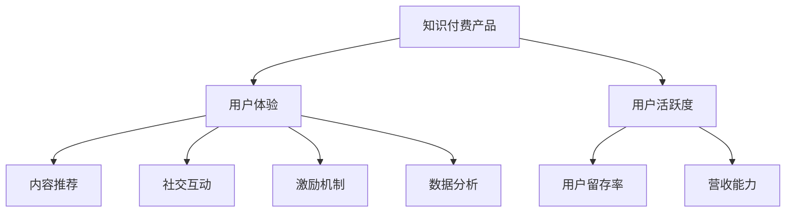

                 

# 如何提高知识付费产品的用户活跃度

> 关键词：知识付费产品,用户活跃度,用户体验,内容推荐,社交互动,激励机制,数据分析

## 1. 背景介绍

### 1.1 问题由来
知识付费产品的用户活跃度是决定其商业成功与否的关键指标。随着互联网和智能手机的普及，知识付费平台逐渐成为人们获取知识和信息的重要渠道。然而，高昂的订阅费用和碎片化的时间安排，使得用户流失率居高不下。如何提升知识付费产品的用户活跃度，使其成为用户消费的重要组成部分，成为了各大知识付费平台面临的共同难题。

### 1.2 问题核心关键点
用户活跃度的高低直接影响到知识付费平台的用户留存率和营收能力。影响用户活跃度的因素众多，包括内容质量、用户界面、推荐系统、社交互动、激励机制等多个维度。提升用户活跃度需要对这些因素进行系统优化，形成良性循环。

### 1.3 问题研究意义
提升知识付费产品的用户活跃度，不仅能够增强用户粘性，提升平台的用户留存率和营收能力，还能加速知识传播和普及，提升社会整体的知识水平。更重要的是，通过深入理解用户行为和需求，可以为知识付费产品的未来发展提供方向性指导。

## 2. 核心概念与联系

### 2.1 核心概念概述

为更好地理解如何提高知识付费产品的用户活跃度，本节将介绍几个密切相关的核心概念：

- 知识付费产品(Knowledge-as-a-Service Platforms)：提供付费订阅服务，内容涵盖书籍、课程、讲座等多种形式的知识消费平台。常见的有得到、喜马拉雅、新东方在线等。
- 用户活跃度(User Engagement)：衡量用户在产品中互动和参与程度的指标，包括访问次数、停留时间、消费频率等。
- 用户体验(User Experience, UX)：通过优化产品界面、交互流程等手段，提升用户在使用产品时的满意度。
- 内容推荐(Content Recommendation)：根据用户的历史行为和偏好，推荐符合其兴趣的内容，增加用户停留时间和互动频率。
- 社交互动(Social Interaction)：通过引入用户交流和分享功能，增强用户之间的互动和参与感。
- 激励机制(Incentive Mechanisms)：通过奖励和引导机制，激励用户持续使用产品，增加产品粘性。
- 数据分析(Data Analysis)：通过收集和分析用户行为数据，洞察用户需求，优化产品策略，提升用户活跃度。

这些核心概念之间的逻辑关系可以通过以下Mermaid流程图来展示：



这个流程图展示了几大核心概念及其之间的关系：

1. 知识付费产品通过优化用户体验，提升用户满意度。
2. 内容推荐、社交互动和激励机制通过提升用户粘性，增加用户活跃度。
3. 数据分析用于洞察用户需求和行为，优化内容和推荐策略。
4. 提升用户活跃度能够增强用户留存率和营收能力，形成良性循环。

## 3. 核心算法原理 & 具体操作步骤

### 3.1 算法原理概述

提高知识付费产品的用户活跃度，本质上是一个多目标优化问题。核心思想是通过综合运用内容推荐、社交互动、激励机制等多种手段，最大化用户活跃度，实现用户留存和营收的双重提升。

形式化地，设知识付费产品平台为 $P$，用户为 $U$，内容为 $C$，社交互动为 $S$，激励机制为 $I$，用户活跃度为 $A$，则优化目标为：

$$
\max_{P, U, C, S, I} \text{A}
$$

其中 $\max$ 表示最大化目标函数，通过合理的模型和算法策略，使得用户活跃度 $A$ 达到最优。

### 3.2 算法步骤详解

提高用户活跃度的算法步骤主要包括：

**Step 1: 收集用户行为数据**
- 通过SDK收集用户在产品中的操作数据，包括浏览、点击、订阅、评论、分享等行为。
- 利用数据湖或数据仓库存储用户行为数据，便于后续分析和建模。

**Step 2: 分析用户行为特征**
- 使用统计分析、机器学习等方法，对用户行为数据进行特征提取和建模，识别出影响用户活跃度的关键因素。
- 常见的特征包括用户年龄、性别、兴趣标签、消费行为、社交关系等。

**Step 3: 设计用户模型**
- 基于用户行为特征，设计用户兴趣模型，用于描述用户对不同内容的偏好。
- 常用的用户模型包括协同过滤模型、基于内容的推荐模型、混合推荐模型等。

**Step 4: 内容推荐系统**
- 根据用户模型，设计推荐算法，生成个性化的内容推荐结果。
- 常见的推荐算法包括基于协同过滤的推荐算法、基于深度学习的推荐算法、基于混合模型的推荐算法等。

**Step 5: 社交互动系统**
- 设计社交互动功能，支持用户之间的交流和分享。
- 常见的社交互动功能包括评论、点赞、转发、群聊等。

**Step 6: 激励机制设计**
- 引入激励机制，通过奖励和引导，提升用户活跃度。
- 常见的激励机制包括积分奖励、会员特权、免费试用、折扣优惠等。

**Step 7: 评估和优化**
- 通过实验和A/B测试等方法，评估不同策略的效果，不断优化产品体验。
- 定期对用户活跃度进行监控和分析，及时发现和解决问题。

### 3.3 算法优缺点

提高知识付费产品用户活跃度的算法具有以下优点：

1. 全面提升用户粘性。通过内容推荐、社交互动和激励机制的结合，用户可以在平台上获得更多的价值，从而提升用户留存率和消费频率。
2. 实现动态优化。通过数据分析和机器学习模型，能够动态调整推荐策略和激励机制，适应不同用户的需求。
3. 提升平台营收。用户活跃度提升后，订阅量、消费金额等营收指标也会随之提升。

同时，该算法也存在一些局限性：

1. 数据隐私问题。通过收集用户行为数据，可能会涉及隐私保护问题，需要遵守相关法律法规。
2. 算法复杂度较高。内容推荐、社交互动和激励机制的优化需要多维度的模型和算法支持，计算复杂度较高。
3. 资源消耗较大。数据收集、模型训练和优化等过程需要大量的计算资源和存储空间，可能对平台的运营成本产生一定影响。

尽管存在这些局限性，但整体而言，该算法通过系统化、多维度的策略组合，为提升知识付费产品的用户活跃度提供了切实可行的解决方案。

### 3.4 算法应用领域

提高知识付费产品的用户活跃度的算法方法，在多个应用领域得到了广泛应用：

- 在线教育平台：通过个性化推荐和社交互动功能，提升课程订阅率和学员活跃度。
- 新闻媒体平台：根据用户兴趣推荐相关内容，增强用户停留时间和互动频率。
- 电商购物平台：通过个性化推荐和优惠券等激励机制，提升用户购买转化率。
- 社交媒体平台：通过内容推荐和社交互动功能，增强用户参与感和留存率。
- 知识分享平台：通过知识问答和社区互动功能，提升内容生产和用户参与度。

除了上述这些经典应用场景外，知识付费产品的用户活跃度优化方法还可以应用于更多领域，如健身运动、旅游出行、金融理财等，为不同行业提供用户粘性和留存率的提升方案。

## 4. 数学模型和公式 & 详细讲解 & 举例说明

### 4.1 数学模型构建

假设知识付费产品的用户活跃度为 $A$，用户行为数据为 $D$，用户兴趣模型为 $M$，内容推荐算法为 $R$，社交互动算法为 $S$，激励机制为 $I$，则优化目标可以表示为：

$$
\max_{D, M, R, S, I} \text{A}
$$

其中 $A$ 的表达式可以定义为：

$$
A = f(D, M, R, S, I)
$$

函数 $f$ 表示用户活跃度的计算方式，可以是访问次数、停留时间、订阅频率等指标的加权和。

### 4.2 公式推导过程

以访问次数和停留时间为主要指标的活跃度计算方式为例，设用户在一段时间内的访问次数为 $V$，停留时间为 $T$，则用户活跃度可以表示为：

$$
A = \alpha V + \beta T
$$

其中 $\alpha$ 和 $\beta$ 为权重系数，需要根据具体业务场景进行调整。

对于内容推荐算法 $R$，可以使用协同过滤模型，假设用户 $u$ 的兴趣向量为 $v_u$，内容 $c$ 的特征向量为 $f_c$，则推荐算法可以表示为：

$$
R_{u,c} = \text{sim}(v_u, f_c)
$$

其中 $\text{sim}$ 表示用户和内容之间的相似度函数，常见的有余弦相似度、皮尔逊相关系数等。

对于社交互动算法 $S$，假设用户在内容 $c$ 下的社交互动度为 $S_c$，则可以表示为：

$$
S_c = \sum_{i=1}^{N_u} \text{dist}(u_i, c)
$$

其中 $N_u$ 表示用户 $u$ 的社交关系数，$\text{dist}$ 表示社交互动度量函数，可以是点赞数、评论数等。

对于激励机制 $I$，假设用户 $u$ 的激励权重为 $w_u$，则激励机制可以表示为：

$$
I_{u} = w_u \times V_u
$$

其中 $V_u$ 表示用户在平台上的消费行为，如订阅次数、购买金额等。

综合以上各部分，用户活跃度 $A$ 的计算公式可以表示为：

$$
A = f(V, T, R_{u,c}, S_c, I_u)
$$

### 4.3 案例分析与讲解

以在线教育平台为例，分析如何通过多维度策略提升用户活跃度：

**Step 1: 收集用户行为数据**
- 通过SDK收集用户登录、浏览、订阅、完成课程、参与讨论等行为数据。
- 使用数据湖存储这些数据，以便后续分析和建模。

**Step 2: 分析用户行为特征**
- 通过统计分析，识别出影响用户活跃度的关键因素，如用户性别、年龄、课程兴趣等。
- 使用机器学习模型，如K-means聚类、协同过滤模型等，对用户行为数据进行建模。

**Step 3: 设计用户模型**
- 基于用户行为特征，设计用户兴趣模型，描述用户对不同课程的偏好。
- 使用协同过滤模型，根据用户历史行为，生成个性化的课程推荐列表。

**Step 4: 内容推荐系统**
- 根据用户模型，设计推荐算法，生成个性化的课程推荐结果。
- 使用深度学习模型，如DeepFM、DNN等，对用户行为和内容特征进行组合学习。

**Step 5: 社交互动系统**
- 设计社交互动功能，支持用户之间的交流和分享。
- 引入评论、点赞、转发等功能，增强用户互动性。

**Step 6: 激励机制设计**
- 引入积分奖励、会员特权、免费试用、折扣优惠等激励机制，提升用户活跃度。
- 通过定期推送优惠券和推荐课程，引导用户完成学习行为。

**Step 7: 评估和优化**
- 通过A/B测试等方法，评估不同策略的效果，不断优化推荐和激励机制。
- 定期监控用户活跃度指标，及时发现和解决问题。

通过以上步骤，在线教育平台可以在多维度上优化用户体验，提升用户活跃度和留存率，增加营收能力。

## 5. 项目实践：代码实例和详细解释说明

### 5.1 开发环境搭建

在进行知识付费产品的用户活跃度优化实践前，需要先搭建好开发环境。以下是使用Python进行Flask开发的环境配置流程：

1. 安装Anaconda：从官网下载并安装Anaconda，用于创建独立的Python环境。

2. 创建并激活虚拟环境：
```bash
conda create -n flask-env python=3.8 
conda activate flask-env
```

3. 安装Flask：
```bash
pip install Flask
```

4. 安装相关库：
```bash
pip install pandas numpy joblib sklearn tqdm
```

完成上述步骤后，即可在`flask-env`环境中开始开发。

### 5.2 源代码详细实现

这里我们以在线教育平台为例，使用Flask框架搭建一个基本的推荐系统：

```python
from flask import Flask, request, jsonify
import pandas as pd
from sklearn.feature_extraction.text import TfidfVectorizer
from sklearn.metrics.pairwise import cosine_similarity

app = Flask(__name__)

# 用户行为数据，包括用户ID、课程ID、访问时间、停留时间等
data = {
    "user_id": ["1", "2", "3", "4", "5"],
    "course_id": ["c1", "c2", "c3", "c2", "c1"],
    "access_time": ["2023-01-01 10:00", "2023-01-01 12:00", "2023-01-02 14:00", "2023-01-03 15:00", "2023-01-03 17:00"],
    "stay_time": ["30", "45", "60", "15", "25"]
}

# 课程信息数据，包括课程ID、课程名称、课程简介等
course_data = {
    "course_id": ["c1", "c2", "c3"],
    "course_name": ["Python基础", "机器学习", "数据挖掘"],
    "course_introduction": ["Python基础入门", "机器学习原理与应用", "数据挖掘技术"]
}

# 初始化数据集
def load_data():
    return pd.DataFrame(data), pd.DataFrame(course_data)

# 用户兴趣模型，使用TF-IDF对课程ID和课程简介进行向量化
def get_user_interest(user_id, data, tfidf):
    user_data = data[data["user_id"] == user_id]
    course_ids = user_data["course_id"].values
    tfidf_matrix = tfidf.fit_transform([course_data["course_introduction"]])
    user_interest = tfidf.transform(course_ids)
    similarity = cosine_similarity(user_interest, tfidf_matrix)
    return similarity

# 推荐系统，返回用户最相关的课程ID
def recommend_course(user_id, similarity, top_n=5):
    user_interest = similarity[user_id]
    sorted_indices = user_interest.argsort()[-top_n:]
    recommended_courses = sorted_indices.tolist()
    return recommended_courses

# 数据加载和处理
data, course_data = load_data()
tfidf = TfidfVectorizer()
tfidf.fit_transform(course_data["course_introduction"])

# 用户ID为1的用户进行课程推荐
user_id = 1
similarity = get_user_interest(user_id, data, tfidf)
recommended_courses = recommend_course(user_id, similarity)

# 返回推荐结果
@app.route("/recommendation", methods=["GET"])
def get_recommendation():
    recommendations = {"courses": recommended_courses}
    return jsonify(recommendations)

if __name__ == "__main__":
    app.run(debug=True)
```

在代码实现中，我们通过Flask框架搭建了一个简单的推荐系统，用于演示如何基于用户行为数据和课程数据进行内容推荐。

### 5.3 代码解读与分析

让我们再详细解读一下关键代码的实现细节：

**Flask应用**：
- `Flask` 是 Python 中一个流行的 Web 框架，用于快速构建 Web 应用。
- 通过 `Flask` 可以方便地定义路由、处理请求、返回响应等。

**用户兴趣模型**：
- 使用 TF-IDF 对课程 ID 和课程简介进行向量化，生成用户兴趣模型。
- 利用余弦相似度计算用户与课程之间的相似度，生成推荐结果。

**推荐系统**：
- 根据用户兴趣模型和课程数据，生成个性化推荐列表。
- 通过设置 `top_n` 参数，控制推荐列表的长度。

**API接口**：
- 使用 `@app.route` 装饰器定义接口，接受 `GET` 请求，返回推荐结果。
- 使用 `jsonify` 函数将推荐列表转换为 JSON 格式，便于前端展示。

**运行测试**：
- 运行应用，通过 `http://localhost:5000/recommendation` 接口获取推荐结果。
- 前端界面可以根据推荐结果进行课程展示和推荐，提升用户活跃度。

通过以上代码实现，我们可以看到，使用 Flask 和 TF-IDF 算法，可以快速搭建一个简单的推荐系统，用于提高知识付费产品的用户活跃度。

## 6. 实际应用场景

### 6.1 智能推荐系统

智能推荐系统是提高知识付费产品用户活跃度的重要手段。通过分析用户历史行为数据，生成个性化推荐内容，可以提升用户停留时间和互动频率，增加订阅率和消费金额。

以在线教育平台为例，通过分析用户浏览课程、购买课程、评论课程等行为数据，可以生成个性化的课程推荐列表，引导用户完成学习行为。此外，还可以通过引入社交互动和激励机制，增强用户参与感和留存率。

### 6.2 用户行为分析

用户行为分析是提升知识付费产品用户活跃度的基础。通过收集和分析用户行为数据，可以识别出影响用户活跃度的关键因素，优化产品设计和推荐策略。

常见的用户行为分析方法包括用户流失模型、用户转化模型等。通过这些模型，可以预测用户流失风险，制定相应的挽留策略。

### 6.3 多渠道推广

多渠道推广是提升知识付费产品用户活跃度的重要手段。通过在不同的渠道（如社交媒体、搜索引擎、邮件等）上进行推广，可以吸引更多的用户访问和使用产品。

以在线教育平台为例，可以通过在社交媒体上发布课程推荐和用户分享内容，吸引潜在用户访问平台。同时，还可以利用搜索引擎优化（SEO）技术，提升产品在搜索引擎中的排名。

## 7. 工具和资源推荐

### 7.1 学习资源推荐

为了帮助开发者系统掌握知识付费产品的用户活跃度优化理论基础和实践技巧，这里推荐一些优质的学习资源：

1. 《推荐系统实战》系列博文：由大模型技术专家撰写，深入浅出地介绍了推荐系统原理、算法实现、系统架构等。

2. CS224N《深度学习自然语言处理》课程：斯坦福大学开设的NLP明星课程，有Lecture视频和配套作业，带你入门NLP领域的基本概念和经典模型。

3. 《推荐系统》书籍：经典推荐系统教材，系统介绍了推荐系统原理和算法实现，适合进阶学习。

4. HuggingFace官方文档：Transformers库的官方文档，提供了海量预训练模型和完整的推荐系统样例代码，是学习推荐系统的重要资源。

5. Kaggle竞赛平台：全球知名的数据科学竞赛平台，提供丰富的推荐系统竞赛数据集和模型，适合实战练习。

通过对这些资源的学习实践，相信你一定能够快速掌握知识付费产品用户活跃度优化的精髓，并用于解决实际的推荐系统问题。

### 7.2 开发工具推荐

高效的开发离不开优秀的工具支持。以下是几款用于知识付费产品用户活跃度优化的常用工具：

1. Python：高效的数据处理和分析工具，支持丰富的机器学习和深度学习库。
2. Pandas：数据处理和分析库，适合进行数据清洗、统计分析等操作。
3. NumPy：高效的数组计算库，支持多种数据格式和计算操作。
4. Scikit-learn：机器学习库，提供丰富的分类、回归、聚类等算法实现。
5. TensorFlow和PyTorch：深度学习框架，支持复杂的推荐系统和多维建模。
6. Flask和Django：Web框架，适合快速搭建推荐系统API接口。

合理利用这些工具，可以显著提升知识付费产品用户活跃度优化的开发效率，加快创新迭代的步伐。

### 7.3 相关论文推荐

知识付费产品用户活跃度优化技术的发展源于学界的持续研究。以下是几篇奠基性的相关论文，推荐阅读：

1. "Personalized Recommendation Algorithms" by Yang et al.：介绍了推荐系统中的经典算法，如协同过滤、基于内容的推荐、混合推荐等。
2. "Factors Influencing User Engagement in Online Education Platforms" by Lee et al.：分析了在线教育平台中影响用户活跃度的关键因素，提出了相应的优化策略。
3. "User Behavior Prediction Models in Recommendation Systems" by He et al.：介绍了用户行为预测模型，用于预测用户流失和推荐效果。
4. "Multi-Channel Marketing and Recommendation System" by Zhang et al.：介绍了多渠道推广和推荐系统结合的方法，提升了产品用户活跃度和留存率。
5. "User Engagement Optimization in Knowledge-based Systems" by Wang et al.：分析了知识付费平台中用户活跃度优化的方法，提出了多种改进策略。

这些论文代表了大模型微调技术的最新进展，通过学习这些前沿成果，可以帮助研究者把握推荐系统的发展方向，激发更多的创新灵感。

## 8. 总结：未来发展趋势与挑战

### 8.1 总结

本文对知识付费产品用户活跃度的优化方法进行了全面系统的介绍。首先阐述了用户活跃度的重要性，明确了提升用户活跃度对知识付费平台的重要意义。其次，从原理到实践，详细讲解了用户活跃度的影响因素和优化策略，给出了用户活跃度优化的完整代码实例。同时，本文还广泛探讨了用户活跃度优化方法在推荐系统、社交互动、多渠道推广等多个领域的应用前景，展示了用户活跃度优化的巨大潜力。

通过本文的系统梳理，可以看到，知识付费产品用户活跃度的提升，离不开多维度的策略组合和系统化的方法优化。优化过程中，需要兼顾用户体验、内容推荐、社交互动、激励机制等多个方面，形成良性循环。未来，伴随着推荐系统、深度学习等技术的不断进步，用户活跃度优化也将迎来新的突破。

### 8.2 未来发展趋势

展望未来，知识付费产品用户活跃度优化技术将呈现以下几个发展趋势：

1. 推荐系统智能化。通过引入深度学习、增强学习等技术，提升推荐系统的效果，实现个性化推荐和用户流失预测。
2. 社交互动多元化。引入社交网络、知识图谱等技术，构建多维度的社交互动体系，增强用户参与感和留存率。
3. 多渠道推广精准化。利用大数据和AI技术，实现精准营销和个性化推广，提升产品曝光率和用户转化率。
4. 用户行为动态化。通过实时分析用户行为数据，动态调整推荐策略和激励机制，实现用户行为的预测和优化。
5. 平台生态系统化。构建平台生态系统，形成内容创作者、知识分享者、用户之间的良性互动，提升用户活跃度和留存率。
6. 用户服务体验化。提升用户界面和交互体验，使用户在平台上获得更自然、流畅的使用体验，增强用户粘性。

以上趋势凸显了知识付费产品用户活跃度优化的广阔前景。这些方向的探索发展，必将进一步提升知识付费产品的用户留存率和营收能力，为平台带来更加可持续的发展。

### 8.3 面临的挑战

尽管知识付费产品用户活跃度优化技术已经取得了显著进展，但在迈向更加智能化、系统化的过程中，仍面临诸多挑战：

1. 数据隐私保护。在数据收集和使用过程中，如何保护用户隐私，遵守相关法律法规，是技术应用的前提。
2. 计算资源消耗。推荐系统和多渠道推广需要大量计算资源和存储空间，如何高效优化资源使用，降低运营成本，是技术优化的重要方向。
3. 用户行为理解。如何深入理解用户行为和需求，准确预测用户流失和推荐效果，是提升用户活跃度的关键。
4. 技术落地难度。如何有效地将技术和产品相结合，制定可行的落地策略，形成实际的用户活跃度提升效果，是技术推广的难点。
5. 多渠道协同。如何实现多渠道推广和推荐的协同，避免信息冲突和资源浪费，提升整体效果，是平台生态建设的关键。

正视知识付费产品用户活跃度优化面临的这些挑战，积极应对并寻求突破，将使产品更具有市场竞争力和用户粘性。

### 8.4 研究展望

面向未来，知识付费产品用户活跃度优化技术需要在以下几个方面寻求新的突破：

1. 探索无监督和半监督优化方法。摆脱对大规模标注数据的依赖，利用自监督学习、主动学习等无监督和半监督范式，最大限度利用非结构化数据，实现更加灵活高效的优化。
2. 研究个性化推荐与用户流失预测的结合。通过引入深度学习、强化学习等技术，实现个性化推荐和用户流失预测的协同优化，提升用户活跃度。
3. 融合多模态数据。将文本、图像、语音等多模态数据进行融合，构建更加全面、准确的用户兴趣模型，提升推荐效果。
4. 引入外部知识库。将符号化的先验知识，如知识图谱、逻辑规则等，与推荐算法进行巧妙融合，引导优化过程学习更准确、合理的用户兴趣模型。
5. 结合因果分析和博弈论工具。将因果分析方法引入推荐算法，识别出推荐决策的关键特征，增强推荐结果的因果性和逻辑性。

这些研究方向的探索，必将引领知识付费产品用户活跃度优化技术迈向更高的台阶，为构建安全、可靠、可解释、可控的智能系统铺平道路。面向未来，知识付费产品用户活跃度优化技术还需要与其他人工智能技术进行更深入的融合，如知识表示、因果推理、强化学习等，多路径协同发力，共同推动推荐系统和智能交互系统的进步。只有勇于创新、敢于突破，才能不断拓展知识付费产品用户活跃度的边界，让智能技术更好地造福人类社会。

## 9. 附录：常见问题与解答

**Q1：如何评估用户活跃度优化效果？**

A: 用户活跃度优化效果可以通过多种指标进行评估，包括用户留存率、平台日活跃用户数、平均访问时长、消费频次等。通常采用A/B测试、对比实验等方法，评估不同策略的效果，不断优化产品设计。

**Q2：如何平衡个性化推荐和推荐多样性？**

A: 在个性化推荐过程中，需要平衡推荐的相关性和多样性，避免过度个性化导致用户体验单一。可以通过引入多样性约束、多臂老虎机算法等方法，增强推荐结果的多样性，提升用户体验。

**Q3：如何应对用户行为变化？**

A: 用户行为是动态变化的，需要实时分析用户行为数据，动态调整推荐策略和激励机制。可以利用流式数据处理技术，实时计算用户行为特征，动态生成推荐结果。

**Q4：如何提升推荐系统的实时性？**

A: 推荐系统的实时性需要通过多维度的优化策略，如分布式计算、缓存技术、异步处理等。合理利用技术手段，可以显著提升推荐系统的响应速度，增强用户体验。

**Q5：如何平衡推荐效果和运营成本？**

A: 推荐系统的优化需要兼顾效果和成本。可以通过参数调优、模型压缩、资源优化等手段，降低计算资源和存储空间的使用，提升推荐系统的运营效率。

这些问题的解答，展示了知识付费产品用户活跃度优化的具体策略和方法，希望能够为实际应用提供有价值的参考。

---

作者：禅与计算机程序设计艺术 / Zen and the Art of Computer Programming

