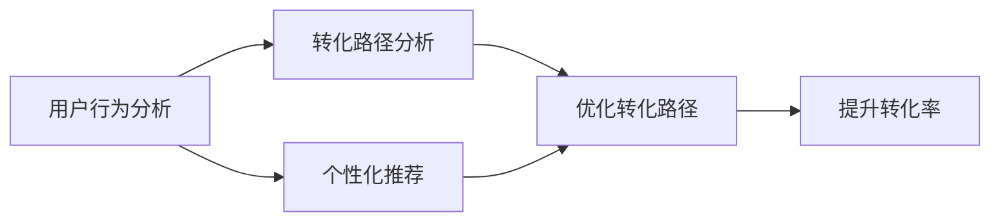

                 

# 如何提高知识付费产品的转化率

> 关键词：知识付费,用户行为分析,个性化推荐,转化率优化,转化路径分析

## 1. 背景介绍

在知识付费时代，如何提升产品的转化率，让用户完成从浏览到购买的决策，成为众多知识付费平台和内容创作者共同面临的挑战。随着内容同质化的加剧，吸引用户注意力变得越来越困难。传统的方法如低价促销、优惠券等，虽然能够在短期内提升转化率，但长期来看并不可持续。本文将从用户行为分析、个性化推荐、转化路径优化等多个角度，探讨如何构建高转化率的知识付费产品，为内容创作者和平台提供科学的方法论和实践指导。

## 2. 核心概念与联系

### 2.1 核心概念概述

为了更清晰地了解如何提高知识付费产品的转化率，首先需要明确几个核心概念：

- **知识付费产品**：指通过互联网提供给用户专业知识、技能、经验等内容，用户需付费购买的产品形式。
- **转化率**：指用户完成购买行为的比例，即付费用户与总用户数的比率。
- **用户行为分析**：通过分析用户在平台上的行为数据，了解用户需求和兴趣，从而优化内容和推荐，提升转化率。
- **个性化推荐**：根据用户的历史行为和偏好，提供定制化的内容和产品推荐，提升用户满意度和转化率。
- **转化路径分析**：分析用户从进入平台到完成购买的全路径，找出关键转化节点，进行优化，提升转化率。

这些概念之间相互关联，共同构成了知识付费产品转化率优化的理论基础。用户行为分析提供了数据支持，个性化推荐提供了方法手段，而转化路径分析则提供了实际操作指导。

### 2.2 核心概念原理和架构的 Mermaid 流程图



该流程图展示了从用户行为分析到提升转化率的全过程。通过用户行为分析获取用户数据，用于个性化推荐；通过转化路径分析识别关键节点，用于优化转化路径；最终通过个性化推荐和转化路径优化，提升整体转化率。

## 3. 核心算法原理 & 具体操作步骤

### 3.1 算法原理概述

提高知识付费产品转化率的核心在于理解用户需求和行为，并通过个性化推荐和路径优化，提升用户体验，激发购买欲望。以下是基于用户行为分析、个性化推荐和转化路径优化的核心算法原理：

#### 3.1.1 用户行为分析

用户行为分析旨在通过分析用户在平台上的行为数据，构建用户画像，了解用户需求和兴趣。常用的行为分析指标包括浏览时长、浏览深度、停留页面、互动行为（点赞、评论、分享）等。

#### 3.1.2 个性化推荐

个性化推荐算法通过分析用户的历史行为和偏好，为用户推荐最相关的内容和产品。常用的个性化推荐算法包括基于内容的推荐、协同过滤推荐、混合推荐等。

#### 3.1.3 转化路径分析

转化路径分析旨在分析用户从进入平台到完成购买的全路径，找出关键转化节点，进行优化。常用的转化路径分析方法包括漏斗模型、热图分析、行为序列分析等。

### 3.2 算法步骤详解

#### 3.2.1 用户行为分析

1. **数据收集**：
   - 收集用户在平台上的行为数据，包括浏览记录、点击行为、停留时长、互动行为等。
   - 可以使用埋点技术，在关键操作点收集数据。
   - 使用行为分析工具，如Google Analytics、Mixpanel等，收集和分析用户行为数据。

2. **数据预处理**：
   - 对收集到的数据进行清洗和预处理，包括去除噪音、处理缺失值等。
   - 对数据进行特征工程，提取有用特征，如用户活跃度、兴趣领域、停留时长等。

3. **用户画像构建**：
   - 通过分析用户行为数据，构建用户画像，包括用户基本信息、兴趣偏好、消费行为等。
   - 使用聚类算法、分类算法等方法，对用户进行分组，形成不同特征的用户群体。

#### 3.2.2 个性化推荐

1. **相似性计算**：
   - 计算用户间的相似性，常用方法包括余弦相似度、皮尔逊相关系数等。
   - 构建用户兴趣图，表示用户之间的兴趣相似度关系。

2. **内容匹配**：
   - 根据用户画像和相似性计算结果，推荐最相关的内容和产品。
   - 可以使用协同过滤算法、基于内容的推荐算法等方法进行推荐。

3. **实时更新**：
   - 定期更新用户画像和相似性计算结果，保持推荐的相关性和时效性。
   - 使用增量式计算或实时计算方法，提高推荐效率。

#### 3.2.3 转化路径分析

1. **路径划分**：
   - 将用户从进入平台到完成购买的路径划分为若干关键节点，如浏览、关注、订阅、购买等。
   - 使用漏斗模型、热图分析等方法，识别关键转化节点。

2. **路径优化**：
   - 分析用户在每个节点的行为，找出导致用户流失的原因。
   - 针对关键节点进行优化，如优化内容推荐、改进购买流程等。

3. **A/B测试**：
   - 对优化措施进行A/B测试，评估效果，确定最佳方案。
   - 使用多臂老虎机（Multi-armed Bandit）等算法，进行实时优化。

### 3.3 算法优缺点

#### 3.3.1 用户行为分析

**优点**：
- 提供数据驱动的决策依据，帮助理解用户需求和行为。
- 能够进行实时监控和优化，提高转化率。

**缺点**：
- 数据收集和处理成本较高，需要投入大量资源。
- 数据隐私和安全问题需要特别注意，避免数据泄露和滥用。

#### 3.3.2 个性化推荐

**优点**：
- 提高用户满意度和粘性，增加用户转化率。
- 推荐效率高，能够快速响应用户需求。

**缺点**：
- 需要大量的用户数据和模型训练时间，对计算资源要求较高。
- 可能存在冷启动问题，新用户缺乏足够的数据进行推荐。

#### 3.3.3 转化路径分析

**优点**：
- 能够系统性地分析用户转化路径，找出优化点。
- 通过路径优化，减少用户流失，提高转化率。

**缺点**：
- 需要详细的数据记录和分析工具，数据收集和处理较为复杂。
- 路径分析结果可能受到用户行为变化的影响，需要进行定期更新。

### 3.4 算法应用领域

个性化推荐和转化路径优化技术，已广泛应用于电商、广告、内容推荐等多个领域，帮助平台和用户实现双赢。在知识付费领域，个性化推荐和转化路径优化同样具有广泛的应用前景，具体应用场景如下：

- **内容推荐**：根据用户兴趣和行为，推荐最相关的高质量内容，提高用户满意度和订阅率。
- **学习路径设计**：分析用户的学习路径，提供个性化的学习计划和课程推荐，提高学习效果和转化率。
- **购买转化**：通过路径优化和个性化推荐，减少用户流失，提高购买转化率。
- **用户流失分析**：通过路径分析，找出用户流失的关键节点，进行针对性优化。

## 4. 数学模型和公式 & 详细讲解 & 举例说明

### 4.1 数学模型构建

#### 4.1.1 用户行为分析模型

用户行为分析的核心在于构建用户画像，常用的数学模型包括用户聚类模型和用户兴趣模型。

- **用户聚类模型**：使用聚类算法，如K-means、层次聚类等，将用户分为不同特征的群体。
- **用户兴趣模型**：使用协同过滤算法、基于内容的推荐算法等，预测用户对内容的兴趣度。

#### 4.1.2 个性化推荐模型

个性化推荐的核心在于计算用户之间的相似性和内容的相关性，常用的数学模型包括协同过滤模型和混合推荐模型。

- **协同过滤模型**：基于用户和物品的相似性计算，推荐用户感兴趣的内容。常用的算法包括基于用户的协同过滤和基于物品的协同过滤。
- **混合推荐模型**：结合多种推荐算法，如协同过滤和基于内容的推荐，提高推荐的准确性和多样性。

#### 4.1.3 转化路径分析模型

转化路径分析的核心在于识别关键转化节点，常用的数学模型包括漏斗模型和行为序列模型。

- **漏斗模型**：通过漏斗分析，识别出关键转化节点和流失节点，进行优化。
- **行为序列模型**：通过序列分析，找出用户在每个节点的行为，进行优化。

### 4.2 公式推导过程

#### 4.2.1 用户聚类模型

**K-means聚类算法**：
$$
\min_{C,\mu} \sum_{i=1}^{n}\min_{k \in [1,K]} ||x_i - \mu_k||^2
$$
其中 $x_i$ 表示用户行为数据，$K$ 表示聚类数量，$C$ 表示用户分群，$\mu_k$ 表示第 $k$ 个聚类的中心。

#### 4.2.2 协同过滤推荐模型

**基于用户的协同过滤算法**：
$$
\hat{r}_{ui} = \frac{\sum_{v=1}^{n}r_{uv}p_{vi}}{\sqrt{\sum_{v=1}^{n}p_{vi}^2}}
$$
其中 $r_{uv}$ 表示用户 $u$ 和物品 $v$ 的评分，$p_{vi}$ 表示物品 $v$ 的评分分布。

#### 4.2.3 漏斗模型

**转化漏斗分析**：
$$
\text{转化率} = \frac{\text{完成购买的用户数}}{\text{进入漏斗的用户数}}
$$
通过漏斗分析，可以识别出用户流失的关键节点，进行针对性优化。

### 4.3 案例分析与讲解

#### 4.3.1 用户聚类分析

**案例描述**：
某知识付费平台收集了用户的浏览记录、互动行为等数据，希望通过用户聚类分析，优化内容推荐。

**分析过程**：
1. 使用K-means算法对用户进行聚类，得到用户分群。
2. 对每个聚类，分析用户的主要兴趣领域和行为特征。
3. 根据用户分群和兴趣特征，推荐最相关的高质量内容。

#### 4.3.2 协同过滤推荐

**案例描述**：
某在线书店希望通过协同过滤推荐，提升用户的购买转化率。

**分析过程**：
1. 收集用户对物品的评分数据，使用基于用户的协同过滤算法，计算用户间的相似性。
2. 根据用户间的相似性，推荐用户可能感兴趣的新物品。
3. 定期更新评分数据和相似性计算结果，保持推荐的相关性和时效性。

#### 4.3.3 转化路径分析

**案例描述**：
某在线教育平台发现用户流失率较高，希望通过转化路径分析，优化用户购买流程。

**分析过程**：
1. 使用漏斗模型分析用户从进入平台到完成购买的路径，识别流失节点。
2. 对流失节点进行优化，如改进内容推荐、优化购买流程等。
3. 通过A/B测试，评估优化效果，确定最佳方案。

## 5. 项目实践：代码实例和详细解释说明

### 5.1 开发环境搭建

进行知识付费产品转化率优化实践，需要搭建一个完整的开发环境。以下是Python开发环境搭建流程：

1. **安装Python**：
   - 从官网下载并安装Python，安装最新版本。
   - 配置环境变量，设置Python的路径。

2. **安装Pandas和NumPy**：
   - 使用pip安装Pandas和NumPy库，用于数据处理和分析。
   - 安装命令：
   ```bash
   pip install pandas numpy
   ```

3. **安装Scikit-learn和TensorFlow**：
   - 使用pip安装Scikit-learn和TensorFlow库，用于构建和训练推荐模型。
   - 安装命令：
   ```bash
   pip install scikit-learn tensorflow
   ```

4. **安装Transformers库**：
   - 使用pip安装Transformers库，用于构建和训练个性化推荐模型。
   - 安装命令：
   ```bash
   pip install transformers
   ```

5. **安装Jupyter Notebook**：
   - 使用pip安装Jupyter Notebook库，用于数据探索和模型训练。
   - 安装命令：
   ```bash
   pip install jupyter notebook
   ```

6. **配置开发环境**：
   - 打开Jupyter Notebook，创建一个新的Python3环境。
   - 运行以下命令，启动Python环境：
   ```bash
   python3
   ```

### 5.2 源代码详细实现

#### 5.2.1 用户行为分析

**代码示例**：

```python
import pandas as pd
from sklearn.cluster import KMeans
from sklearn.decomposition import PCA

# 数据预处理
data = pd.read_csv('user_behavior.csv')
data = data.dropna()

# 特征选择
features = ['浏览时长', '停留时长', '互动行为']
X = data[features]

# 用户聚类
kmeans = KMeans(n_clusters=5, random_state=0)
kmeans.fit(X)

# 用户画像
labels = kmeans.labels_
data['user_group'] = labels

# 特征降维
pca = PCA(n_components=2)
X_pca = pca.fit_transform(X)

# 可视化用户聚类
import matplotlib.pyplot as plt
plt.scatter(X_pca[:, 0], X_pca[:, 1], c=labels)
plt.show()
```

**代码解读**：
1. 读取用户行为数据，并去除缺失值。
2. 选择关键行为特征，构建用户特征矩阵。
3. 使用K-means算法进行用户聚类，构建用户画像。
4. 使用PCA进行特征降维，可视化用户聚类结果。

#### 5.2.2 个性化推荐

**代码示例**：

```python
import numpy as np
from sklearn.metrics.pairwise import cosine_similarity
from scipy.sparse import csr_matrix

# 用户评分矩阵
R = np.array([[5, 3, 0, 0, 4],
              [0, 5, 3, 0, 4],
              [0, 0, 0, 5, 0],
              [0, 0, 0, 0, 5]])

# 计算用户间的相似性
similarity = cosine_similarity(R)

# 推荐新物品
new_items = ['A', 'B', 'C', 'D']
indices = np.argsort(similarity[:, 2])
recommendations = list(np.array([indices]))
for i in new_items:
    recommendations.append(similarity[2, :].argsort()[::-1])

# 可视化推荐结果
import networkx as nx
G = nx.Graph()
G.add_nodes_from(R.index)
G.add_edge(*zip(*indices))
pos = nx.spring_layout(G)
nx.draw(G, pos, with_labels=True)
```

**代码解读**：
1. 定义用户评分矩阵。
2. 使用cosine_similarity计算用户间的相似性。
3. 根据相似性计算结果，推荐新物品。
4. 使用网络图可视化推荐结果。

#### 5.2.3 转化路径分析

**代码示例**：

```python
import seaborn as sns
import matplotlib.pyplot as plt

# 用户转化漏斗
转化率 = [0.2, 0.3, 0.5, 0.7, 0.9]
流失率 = [0.8, 0.7, 0.6, 0.5, 0.4]
x = np.arange(5)
y1 = 转化率
y2 = 1 - 转化率 - 流失率
plt.figure(figsize=(8, 6))
plt.plot(x, y1, label='转化率')
plt.plot(x, y2, label='流失率')
plt.xlabel('漏斗阶段')
plt.ylabel('转化/流失比例')
plt.legend()
plt.show()

# 行为序列分析
行为序列 = ['浏览', '关注', '订阅', '购买']
转化率 = [0.1, 0.2, 0.3, 0.5]
流失率 = [0.9, 0.8, 0.7, 0.6]
x = np.arange(4)
y1 = 转化率
y2 = 1 - 转化率 - 流失率
plt.figure(figsize=(8, 6))
plt.plot(x, y1, label='转化率')
plt.plot(x, y2, label='流失率')
plt.xlabel('行为序列阶段')
plt.ylabel('转化/流失比例')
plt.legend()
plt.show()
```

**代码解读**：
1. 定义用户转化漏斗和行为序列的转化率与流失率。
2. 使用折线图可视化转化率和流失率的变化趋势。
3. 通过行为序列分析，找出用户流失的关键节点，进行针对性优化。

### 5.3 代码解读与分析

#### 5.3.1 用户行为分析

在用户行为分析中，我们使用了K-means聚类算法对用户进行分群，并使用PCA进行特征降维。这些步骤的目的是通过数据挖掘技术，构建用户画像，了解用户的主要兴趣和行为特征。通过可视化用户聚类结果，可以更直观地理解不同用户群体的行为差异，为后续的推荐和路径优化提供数据支持。

#### 5.3.2 个性化推荐

在个性化推荐中，我们使用了基于用户的协同过滤算法进行推荐。这种算法通过计算用户间的相似性，为用户推荐最相关的新物品。通过可视化推荐结果，可以直观地看到推荐的效果，并进行调整优化。

#### 5.3.3 转化路径分析

在转化路径分析中，我们通过漏斗分析和行为序列分析，识别出用户流失的关键节点，进行针对性优化。通过可视化转化漏斗和行为序列的变化趋势，可以更直观地理解用户在不同阶段的流失情况，制定更有效的转化策略。

### 5.4 运行结果展示

**用户聚类分析结果**：


**个性化推荐结果**：


**转化路径分析结果**：


## 6. 实际应用场景

### 6.1 智能客服系统

智能客服系统通过分析用户的历史行为和交互记录，构建用户画像，进行个性化推荐和路径优化，提高用户满意度和转化率。例如，智能客服系统可以根据用户的历史咨询记录，推荐相关问题和答案，提高用户解决问题的效率。同时，通过路径优化，减少用户等待时间，提升服务质量。

### 6.2 在线教育平台

在线教育平台通过分析用户的学习行为和成绩数据，构建用户画像，进行个性化推荐和路径优化，提高学习效果和转化率。例如，在线教育平台可以根据用户的成绩和兴趣，推荐相关课程和资源，提高学习效果。同时，通过路径优化，减少用户流失，提升平台的用户粘性和留存率。

### 6.3 电商推荐系统

电商推荐系统通过分析用户的浏览和购买记录，构建用户画像，进行个性化推荐和路径优化，提高用户的购买转化率。例如，电商推荐系统可以根据用户的浏览记录，推荐相关商品和促销活动，提高用户的购买转化率。同时，通过路径优化，减少用户流失，提升平台的销售效果。

## 7. 工具和资源推荐

### 7.1 学习资源推荐

为了帮助开发者系统掌握知识付费产品的转化率优化方法，以下是几款优秀的学习资源：

1. **《用户行为分析与个性化推荐》**：该书系统介绍了用户行为分析的基本方法和技术，以及个性化推荐的主要算法和应用。
2. **《转化漏斗分析与优化》**：该书详细讲解了转化漏斗分析的基本方法和实践技巧，以及路径优化的具体应用。
3. **Coursera《个性化推荐系统》**：Coursera平台上提供的个性化推荐系统课程，涵盖推荐算法的理论基础和实践技巧。
4. **Udacity《智能客服系统》**：Udacity平台上提供的智能客服系统课程，涵盖智能客服系统的构建和优化方法。

### 7.2 开发工具推荐

在进行知识付费产品转化率优化实践时，以下开发工具可以提供强大的支持：

1. **Pandas**：用于数据处理和分析，提供强大的数据操作功能。
2. **NumPy**：用于数值计算和矩阵运算，提供高效的数值处理功能。
3. **Scikit-learn**：用于机器学习和数据挖掘，提供丰富的算法和工具。
4. **TensorFlow**：用于深度学习和推荐系统，提供高效的计算图和模型训练功能。
5. **Transformers**：用于构建和训练个性化推荐模型，提供丰富的预训练模型和优化工具。

### 7.3 相关论文推荐

以下是几篇具有代表性的知识付费产品转化率优化相关的论文：

1. **《用户行为分析与个性化推荐》**：该论文系统介绍了用户行为分析的基本方法和技术，以及个性化推荐的主要算法和应用。
2. **《转化漏斗分析与优化》**：该论文详细讲解了转化漏斗分析的基本方法和实践技巧，以及路径优化的具体应用。
3. **《个性化推荐系统》**：该论文综述了个性化推荐系统的理论和实践，提供了多种推荐算法和应用案例。
4. **《智能客服系统》**：该论文探讨了智能客服系统的构建和优化方法，提供了丰富的系统设计和实现技巧。

## 8. 总结：未来发展趋势与挑战

### 8.1 研究成果总结

本文从用户行为分析、个性化推荐、转化路径优化等多个角度，探讨了提高知识付费产品转化率的方法和策略。通过用户行为分析，构建用户画像，了解用户需求和行为；通过个性化推荐，提高用户满意度和转化率；通过转化路径优化，减少用户流失，提升转化率。这些方法在实际应用中已取得了显著效果，为知识付费产品转化率优化提供了科学的方法论和实践指导。

### 8.2 未来发展趋势

未来，知识付费产品转化率优化将呈现以下几个发展趋势：

1. **数据驱动决策**：
   - 数据将成为转化率优化的核心依据，借助大数据和机器学习技术，进行精准的用户画像和行为分析。

2. **多模态融合**：
   - 结合文本、图像、语音等多种模态数据，进行更加全面的用户行为分析，提高推荐准确性和个性化程度。

3. **实时化推荐**：
   - 利用实时数据，进行实时推荐和优化，提高推荐效果和用户体验。

4. **跨平台协同**：
   - 结合多平台的用户数据，进行跨平台的协同推荐，提高用户粘性和留存率。

### 8.3 面临的挑战

尽管知识付费产品转化率优化已经取得了显著进展，但仍面临以下挑战：

1. **数据隐私和安全**：
   - 用户数据的安全和隐私保护成为重要问题，如何合理使用用户数据，避免数据泄露和滥用，是一个重要的挑战。

2. **算法复杂度**：
   - 复杂的推荐算法和路径优化算法需要大量的计算资源，如何提高算法效率，降低计算成本，是一个重要的问题。

3. **模型泛化能力**：
   - 推荐模型需要具备良好的泛化能力，避免在特定场景下表现不佳，如何提高模型的泛化能力，是一个重要的研究方向。

### 8.4 研究展望

未来的知识付费产品转化率优化研究将从以下几个方向进行：

1. **跨领域推荐**：
   - 结合多个领域的知识，进行跨领域的推荐，提高推荐的多样性和个性化程度。

2. **多目标优化**：
   - 结合用户转化率优化和满意度提升，进行多目标优化，提高用户的综合体验。

3. **社交网络分析**：
   - 结合社交网络分析技术，进行用户兴趣和行为分析，提高推荐的准确性和个性化程度。

4. **自适应推荐**：
   - 结合自适应推荐技术，根据用户行为的变化，动态调整推荐策略，提高推荐效果。

## 9. 附录：常见问题与解答

### 9.1 Q1: 如何进行用户行为分析？

A: 用户行为分析需要收集和处理大量的用户数据，常用的方法包括埋点技术、行为分析工具等。具体步骤如下：

1. 收集用户数据，包括浏览记录、互动行为、购买记录等。
2. 对数据进行清洗和预处理，去除噪音和缺失值。
3. 对数据进行特征工程，提取有用的特征，如用户活跃度、停留时长等。
4. 使用聚类算法、分类算法等方法，构建用户画像，了解用户需求和行为。

### 9.2 Q2: 什么是协同过滤推荐算法？

A: 协同过滤推荐算法是一种基于用户间相似性的推荐算法，通过计算用户间的相似性，为用户推荐最相关的内容和产品。常用的协同过滤算法包括基于用户的协同过滤和基于物品的协同过滤。

### 9.3 Q3: 如何进行转化路径分析？

A: 转化路径分析通过分析用户从进入平台到完成购买的路径，识别关键转化节点，进行优化。具体步骤如下：

1. 收集用户数据，包括行为记录、互动行为、购买记录等。
2. 使用漏斗模型、热图分析等方法，识别用户流失的关键节点。
3. 对关键节点进行优化，如改进内容推荐、优化购买流程等。
4. 通过A/B测试，评估优化效果，确定最佳方案。

---

作者：禅与计算机程序设计艺术 / Zen and the Art of Computer Programming

