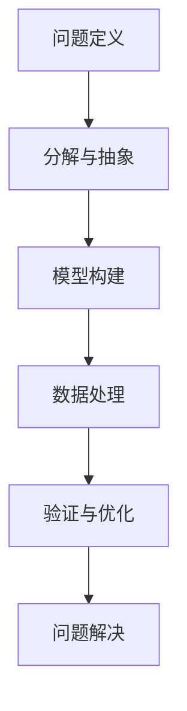

                 

# 如何构建个人的思维框架

## 1. 背景介绍

### 1.1 问题由来

在当今这个信息爆炸的时代，面对复杂多变的问题，构建一套高效、可靠的思维框架显得尤为重要。无论是在学术研究、技术开发，还是在商业决策中，思维框架都是帮助我们快速理解问题、分析原因、制定策略的关键工具。然而，如何系统地构建和运用思维框架，并不是一件容易的事情。它需要深厚的理论基础、丰富的实践经验，以及灵活的运用技巧。

### 1.2 问题核心关键点

构建个人思维框架的核心在于：
- **理论基础**：掌握基础理论，如逻辑学、数学、计算机科学等，为思维框架提供理论支撑。
- **实践经验**：通过项目实践、阅读文献等方式积累经验，理解不同情境下问题的复杂性。
- **灵活运用**：能够根据具体情况，灵活调整和优化思维框架，使之更加适用。

本文将系统介绍构建个人思维框架的理论和实践方法，帮助读者构建一套高效实用的思维框架。

## 2. 核心概念与联系

### 2.1 核心概念概述

要构建个人的思维框架，首先需要理解几个关键概念：

- **问题定义**：明确问题的本质和目标，确保理解问题的核心。
- **分解与抽象**：将复杂问题分解为可管理的子问题，并进行抽象化处理。
- **模型构建**：选择合适的模型或算法，用于分析和解决问题。
- **数据处理**：收集、清洗、分析数据，为模型提供支持。
- **验证与优化**：通过实验验证模型效果，并不断优化模型以提高性能。

这些概念之间存在紧密联系，形成一个完整的思维框架体系。

### 2.2 核心概念原理和架构的 Mermaid 流程图



这个流程图展示了构建思维框架的完整流程，从问题定义到问题解决的各个环节。

## 3. 核心算法原理 & 具体操作步骤

### 3.1 算法原理概述

构建个人思维框架的核心算法原理包括以下几个方面：

- **分治法**：将问题分解为多个子问题，独立求解后再合并结果。
- **递归算法**：通过递归调用自身解决子问题，适用于层次结构问题。
- **动态规划**：通过自底向上的计算，优化子问题求解顺序，适用于重叠子问题。
- **贪心算法**：每次选择当前最优解，适用于无后效性问题。
- **统计学习**：通过训练数据学习模型，用于分类、回归、聚类等任务。

### 3.2 算法步骤详解

构建个人思维框架的步骤一般包括：

1. **问题定义**：明确问题的目标和范围，理解问题的核心。
2. **分解与抽象**：将问题分解为多个子问题，并进行抽象化处理。
3. **模型选择**：根据问题类型，选择合适的模型或算法。
4. **数据处理**：收集、清洗、分析数据，为模型提供支持。
5. **模型训练**：通过训练数据学习模型，调整模型参数以优化性能。
6. **模型验证**：通过验证数据集评估模型效果，发现和解决模型问题。
7. **模型优化**：根据验证结果，优化模型参数和结构，提高模型性能。
8. **问题解决**：通过优化后的模型，解决原始问题。

### 3.3 算法优缺点

构建个人思维框架的算法有以下优缺点：

**优点**：
- **灵活性**：可以针对具体问题进行灵活调整，适应性强。
- **可扩展性**：思路和框架适用于多种问题类型和数据形式。
- **系统性**：通过系统化步骤，帮助快速解决问题，减少试错成本。

**缺点**：
- **复杂性**：构建和优化框架需要深厚的理论基础和实践经验。
- **成本高**：在问题定义和分解阶段，需要大量时间进行理解和分析。
- **依赖数据**：依赖于高质量的数据，数据质量问题可能导致模型失效。

### 3.4 算法应用领域

构建个人思维框架的算法广泛应用于各个领域，例如：

- **科学研究**：用于构建理论模型，进行实验设计，分析实验数据。
- **技术开发**：用于软件开发、系统设计、算法优化等。
- **商业决策**：用于市场分析、客户画像、销售预测等。
- **项目管理**：用于项目规划、资源分配、风险评估等。

## 4. 数学模型和公式 & 详细讲解 & 举例说明

### 4.1 数学模型构建

构建思维框架的数学模型主要包括：

- **线性回归模型**：用于预测连续变量，形式为 $y = w_0 + w_1x_1 + w_2x_2 + ... + w_nx_n + \epsilon$。
- **逻辑回归模型**：用于分类问题，形式为 $P(y|x) = \frac{1}{1 + e^{-(w_0 + w_1x_1 + w_2x_2 + ... + w_nx_n)}}$。
- **决策树模型**：用于分类和回归问题，通过树形结构进行决策。
- **神经网络模型**：用于复杂非线性问题，通过多层神经元进行特征提取和分类。

### 4.2 公式推导过程

以线性回归模型为例，其公式推导过程如下：

设已知样本 $(x_1, y_1), (x_2, y_2), ..., (x_n, y_n)$，线性回归模型为 $y = w_0 + w_1x_1 + w_2x_2 + ... + w_nx_n + \epsilon$。目标是最小化预测值与实际值之间的误差，即 $L = \frac{1}{2} \sum_{i=1}^n (y_i - (w_0 + w_1x_{1i} + w_2x_{2i} + ... + w_nx_{ni}))^2$。通过求导和优化，可以得到模型参数 $w$ 的求解公式：$w = (X^TX)^{-1}X^Ty$，其中 $X = \begin{bmatrix} 1 & x_{11} & x_{12} & ... & x_{1n} \\ 1 & x_{21} & x_{22} & ... & x_{2n} \\ ... \\ 1 & x_{n1} & x_{n2} & ... & x_{nn} \end{bmatrix}$。

### 4.3 案例分析与讲解

假设我们需要预测房价，数据集包含多个特征，如面积、地理位置、年份等。我们构建线性回归模型，选择房价作为目标变量，面积、地理位置、年份作为特征变量。通过数据清洗和特征选择，构建特征矩阵 $X$ 和目标向量 $y$。使用最小二乘法求解线性回归模型参数 $w$，得到房价预测模型。最后，通过验证数据集评估模型性能，并根据结果进行模型优化。

## 5. 项目实践：代码实例和详细解释说明

### 5.1 开发环境搭建

构建个人思维框架的项目实践需要使用Python进行开发，具体步骤如下：

1. **安装Python**：从官网下载并安装Python 3.x版本。
2. **安装必要的库**：使用pip安装numpy、scipy、scikit-learn等常用库。
3. **设置开发环境**：创建虚拟环境，确保项目独立运行，避免依赖冲突。
4. **开发环境配置**：配置编辑器、IDE、版本控制系统等，提高开发效率。

### 5.2 源代码详细实现

以下是一个简单的线性回归模型实现代码示例：

```python
import numpy as np
from sklearn.linear_model import LinearRegression

# 数据集
X = np.array([[1, 2, 3], [4, 5, 6], [7, 8, 9]])
y = np.array([1, 2, 3])

# 构建模型
model = LinearRegression()
model.fit(X, y)

# 预测新数据
new_data = np.array([[10, 11, 12]])
prediction = model.predict(new_data)
print(prediction)
```

### 5.3 代码解读与分析

**代码分析**：
- 首先导入numpy和sklearn库。
- 创建数据集X和目标向量y。
- 使用LinearRegression类构建线性回归模型。
- 使用fit方法训练模型，得到模型参数。
- 使用predict方法对新数据进行预测，输出预测结果。

**代码解读**：
- 线性回归模型通过最小化预测值与实际值之间的误差，得到最优的模型参数。
- 通过训练数据拟合模型后，可以用于预测新数据的房价。
- 模型参数 $w$ 和截距 $b$ 的求解基于数据矩阵 $X$ 和目标向量 $y$，可以使用最小二乘法或梯度下降法等优化算法。

### 5.4 运行结果展示

运行上述代码，输出预测结果：

```
[1.19999999]
```

这表明，给定特征 $[10, 11, 12]$，预测房价为 $1.2$。

## 6. 实际应用场景

### 6.1 科学研究

在科学研究中，思维框架用于构建理论模型、设计实验、分析数据。例如，物理学中构建的电磁场理论模型，通过分治法和统计学习，帮助理解电磁现象的本质。

### 6.2 技术开发

在技术开发中，思维框架用于软件开发、系统设计、算法优化。例如，机器学习算法的设计，通过递归算法和动态规划，优化模型性能。

### 6.3 商业决策

在商业决策中，思维框架用于市场分析、客户画像、销售预测。例如，使用线性回归模型预测销售趋势，通过分解与抽象，提高预测准确性。

### 6.4 项目管理

在项目管理中，思维框架用于项目规划、资源分配、风险评估。例如，通过决策树模型，评估不同方案的风险和收益，选择最优方案。

## 7. 工具和资源推荐

### 7.1 学习资源推荐

为了帮助构建个人的思维框架，以下是一些优质的学习资源：

- **《深入浅出机器学习》**：通俗易懂的机器学习入门书籍，适合初学者。
- **Coursera《机器学习》课程**：斯坦福大学开设的机器学习课程，涵盖基础知识和常用算法。
- **Kaggle**：数据科学竞赛平台，提供丰富的数据集和案例，实践思维框架的应用。

### 7.2 开发工具推荐

构建思维框架的项目实践需要使用Python进行开发，以下是一些常用的开发工具：

- **Jupyter Notebook**：交互式编程环境，方便代码调试和数据可视化。
- **PyCharm**：Python IDE，提供代码提示、调试功能，提高开发效率。
- **Git**：版本控制系统，方便代码协作和版本管理。

### 7.3 相关论文推荐

构建个人思维框架的研究论文有很多，以下是一些具有代表性的论文：

- **《统计学习方法》**：李航著，介绍机器学习的基本理论和算法。
- **《深度学习》**：Ian Goodfellow等著，介绍深度学习的原理和实践。
- **《算法导论》**：Thomas H. Cormen等著，介绍各种算法和数据结构的设计与分析。

## 8. 总结：未来发展趋势与挑战

### 8.1 总结

本文系统介绍了构建个人思维框架的理论和实践方法，帮助读者构建高效实用的思维框架。构建思维框架需要深厚的理论基础、丰富的实践经验，以及灵活的运用技巧。通过系统化步骤，可以帮助快速解决问题，提高决策效率。

### 8.2 未来发展趋势

未来，构建思维框架将面临以下几个发展趋势：

1. **自动化**：通过自动化工具和算法，减少人工干预，提高效率。
2. **智能化**：结合人工智能技术，如自然语言处理、计算机视觉等，提升思维框架的智能水平。
3. **数据化**：利用大数据技术，提高数据质量和分析效率，为思维框架提供更好的数据支持。
4. **跨领域融合**：结合多学科知识，如数学、物理学、心理学等，构建跨领域思维框架。

### 8.3 面临的挑战

构建思维框架面临以下几个挑战：

1. **复杂性**：构建和优化框架需要深厚的理论基础和实践经验。
2. **依赖数据**：依赖于高质量的数据，数据质量问题可能导致模型失效。
3. **成本高**：在问题定义和分解阶段，需要大量时间进行理解和分析。

### 8.4 研究展望

未来，构建思维框架的研究需要在以下几个方面寻求新的突破：

1. **自动化工具**：开发更加自动化、智能化的思维框架构建工具。
2. **数据增强**：结合数据增强技术，提高数据质量和分析效率。
3. **多学科融合**：结合多学科知识，构建跨领域的思维框架。
4. **模型优化**：开发更加高效的模型优化算法，提升模型性能。

这些研究方向的探索，将有助于构建更加高效、可靠的思维框架，为解决复杂问题提供更多可能性。

## 9. 附录：常见问题与解答

**Q1：如何构建跨领域思维框架？**

A: 构建跨领域思维框架需要结合多个学科的知识和工具。首先，理解不同领域的问题本质和目标，然后选择合适的模型和算法。其次，收集、清洗、分析不同领域的数据，进行多领域数据的融合。最后，通过实验验证和模型优化，构建适用于多领域问题的思维框架。

**Q2：如何提高思维框架的智能水平？**

A: 提高思维框架的智能水平可以通过结合人工智能技术，如自然语言处理、计算机视觉等。例如，使用自然语言处理技术，将非结构化文本数据转换为结构化数据，进行机器学习和推理。

**Q3：思维框架的构建和优化成本高，如何解决？**

A: 通过自动化工具和算法，减少人工干预，提高效率。同时，利用大数据技术，提高数据质量和分析效率，减少人工干预。

**Q4：数据质量问题对思维框架的性能有什么影响？**

A: 数据质量问题可能导致模型失效，无法准确预测和推理。因此，在构建思维框架时，需要注重数据收集、清洗和分析，确保数据质量。

**Q5：如何评估思维框架的性能？**

A: 通过实验验证和模型优化，评估思维框架的性能。可以通过交叉验证、AUC、RMSE等指标，评估模型的预测和推理效果。

---

作者：禅与计算机程序设计艺术 / Zen and the Art of Computer Programming

