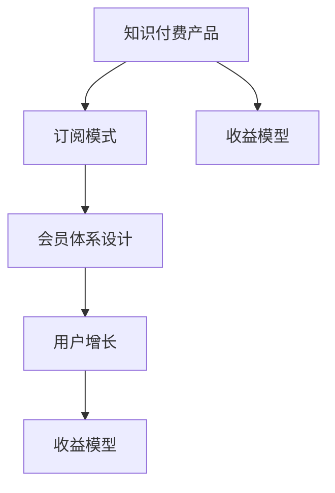

                 

# 如何设计知识付费产品的会员体系

> 关键词：知识付费产品,会员体系设计,订阅模式,用户增长,收益模型

## 1. 背景介绍

### 1.1 问题由来
随着互联网和移动设备的普及，知识付费逐渐成为一种流行的内容消费方式。许多企业和个人利用知识付费平台传播和获取知识，用户也逐步养成了付费订阅优质内容的习惯。在这种背景下，设计一个有效的知识付费产品会员体系，既能吸引用户持续订阅，又能保证企业可持续盈利，显得尤为重要。

## 2. 核心概念与联系

### 2.1 核心概念概述

为了更好地理解如何设计知识付费产品的会员体系，我们首先介绍一些关键概念：

- **知识付费产品**：基于互联网的知识服务形式，用户通过付费获取专业、高质量的内容，如在线课程、电子书、音频教程、问答等。

- **会员体系**：用户通过付费成为平台会员，享受专属内容和服务，并可能获得额外特权，如专属课程、优先推荐等。

- **订阅模式**：用户定期支付费用获取平台提供的服务，分为按月、按季、按年订阅等不同类型。

- **用户增长**：通过有效的会员体系设计和运营策略，吸引新用户加入平台，并提高现有用户续订率，实现会员规模的持续扩大。

- **收益模型**：基于会员订阅、内容销售、广告合作等多种盈利手段，建立平台稳定的收入来源。

这些概念之间的关系可以理解为：通过订阅模式，用户成为平台会员，享受专属服务，平台通过会员体系实现用户增长，并通过收益模型产生盈利。

### 2.2 核心概念原理和架构的 Mermaid 流程图



在这个流程图中，知识付费产品通过订阅模式吸引用户成为会员，会员体系设计帮助用户保持长期订阅，用户增长策略提升新用户获取和现有用户续订，收益模型确保平台收入稳定。

## 3. 核心算法原理 & 具体操作步骤

### 3.1 算法原理概述

设计知识付费产品的会员体系，本质上是构建一个用户激励和留存机制，让用户长期订阅并推荐其他用户加入。这一机制需要建立在用户对平台内容的价值认可和情感依赖之上，同时也要考虑平台自身的收益目标。

### 3.2 算法步骤详解

**Step 1: 用户需求分析**
- 调查用户对不同内容的需求和偏好。
- 分析用户对会员特权的期望和敏感度。

**Step 2: 会员体系设计**
- 设计会员等级和特权。
- 确定订阅价格和周期。

**Step 3: 订阅模式选择**
- 确定单次购买和定期订阅的比例。
- 设计会员续费策略，如折扣、积分兑换等。

**Step 4: 收益模型优化**
- 设置会员内容销售策略，如付费下载、专属会员区等。
- 引入广告和品牌合作，扩大收益渠道。

**Step 5: 用户增长策略**
- 通过内容营销、社交网络、SEO优化等方式吸引新用户。
- 构建用户社区，提升用户粘性。

**Step 6: 会员体验优化**
- 优化平台界面和功能，提升用户体验。
- 收集用户反馈，不断迭代优化。

### 3.3 算法优缺点

#### 优点
- **用户留存高**：通过会员体系设计，提升用户粘性，增加续订率。
- **收益稳定**：通过多种盈利手段，确保平台收入稳定。
- **灵活性**：根据用户需求和市场变化灵活调整策略。

#### 缺点
- **复杂性高**：需要综合考虑多个因素，设计复杂。
- **成本高**：维护用户关系和优化体验需要较高的投入。

### 3.4 算法应用领域

知识付费产品的会员体系设计广泛应用于在线教育、专业咨询、技能培训等多个领域。例如：

- 在线教育平台，如Coursera、Udemy等，通过会员体系提升课程订阅率和用户粘性。
- 专业咨询平台，如Medium、Patron等，通过会员特权和专属内容，吸引用户长期支持。
- 技能培训平台，如Skillshare、Udacity等，通过会员体系提供高质量课程和优质服务。

## 4. 数学模型和公式 & 详细讲解 & 举例说明

### 4.1 数学模型构建

我们可以建立一个简单的会员体系数学模型，用来描述用户续订行为和收益模式。假设平台有$N$个用户，每个用户可以选择成为不同级别的会员，每个级别$j$的订阅价格为$p_j$，月度收益为$R_j$。用户加入会员的概率为$P_j$，续订率为$r_j$，会员流失率为$f_j$。平台的总收益为$R_{total}$。

### 4.2 公式推导过程

构建以下模型：
- 用户加入会员的概率：$P_j = \frac{1}{1+\sum_{i=1}^{j-1}\frac{p_i}{p_j}}$
- 用户续订率为：$r_j = \max(1-\frac{p_j}{p_{j-1}}, 1-\alpha_j)$，其中$\alpha_j$为续订折扣率。
- 会员流失率为：$f_j = \beta_j \cdot (1-r_j)$，其中$\beta_j$为流失率。
- 平台总收益：$R_{total} = \sum_{j=1}^{J}P_j \cdot r_j \cdot p_j$，其中$J$为会员级别数。

### 4.3 案例分析与讲解

假设某知识付费平台有三个会员级别：普通会员、专业会员和高级会员，其价格分别为$10$元/月、$30$元/月和$50$元/月，续订率分别为$0.8$、$0.9$和$0.95$，流失率分别为$0.1$、$0.2$和$0.05$。

计算平台总收益$R_{total}$：

1. 普通会员：$P_1 = \frac{1}{1+\frac{0}{10}} = 1$
2. 专业会员：$P_2 = \frac{1}{1+\frac{10}{30}} = \frac{2}{3}$
3. 高级会员：$P_3 = \frac{1}{1+\frac{10}{30}+\frac{30}{50}} = \frac{2}{5}$

续订率计算：

1. 普通会员：$r_1 = \max(1-\frac{10}{30}, 1-0.1) = 0.9$
2. 专业会员：$r_2 = \max(1-\frac{30}{50}, 1-0.2) = 0.9$
3. 高级会员：$r_3 = \max(1-\frac{50}{50}, 1-0.05) = 0.95$

总收益计算：

$$
R_{total} = P_1 \cdot r_1 \cdot 10 + P_2 \cdot r_2 \cdot 30 + P_3 \cdot r_3 \cdot 50 = 1 \cdot 0.9 \cdot 10 + \frac{2}{3} \cdot 0.9 \cdot 30 + \frac{2}{5} \cdot 0.95 \cdot 50 \approx 126.4
$$

通过计算，平台在上述价格和续订策略下，预计月度总收益约为$126.4$元。

## 5. 项目实践：代码实例和详细解释说明

### 5.1 开发环境搭建

为了构建和分析会员体系模型，我们需要搭建一个包含数据分析和模拟环境的项目环境。这里建议使用Python和Jupyter Notebook，配置必要的库和工具。

### 5.2 源代码详细实现

```python
import sympy as sp

# 定义参数
p = [10, 30, 50]  # 价格
r = [0.8, 0.9, 0.95]  # 续订率
alpha = [0.1, 0.2, 0.05]  # 续订折扣
beta = [0.1, 0.2, 0.05]  # 流失率

# 计算概率
P = [1 / (1 + sum(p[:i]) / p[i] if i > 0 else 1) for i in range(len(p))]

# 计算续订率
r = [sp.Max(1 - p[i] / p[i-1], 1 - a) if i > 0 else 1 for i, a in enumerate(alpha)]

# 计算总收益
R_total = sum(P[i] * r[i] * p[i] for i in range(len(p)))

# 输出结果
R_total
```

### 5.3 代码解读与分析

首先，我们定义了价格、续订率、续订折扣和流失率等参数。然后，根据公式计算了每个级别的会员加入概率$P$和续订率$r$。最后，通过循环求和计算平台总收益$R_{total}$。

## 6. 实际应用场景

### 6.1 智能客服系统

在智能客服系统中，可以通过设计会员等级和特权，提升用户满意度，从而提高平台用户数和续订率。例如，提供会员专属客服、优先解决疑问、赠送定制礼品等特权，可以增加用户粘性。

### 6.2 金融信息服务

金融信息服务平台上，通过会员体系设计，提供专享市场分析、定制化投资建议等高级服务，吸引高端用户加入。通过会员贡献行为积分系统，增加会员参与度，同时通过会员推荐新用户给予奖励，提升平台传播力。

### 6.3 健康管理应用

健康管理应用中，会员体系可以设计为不同等级的医疗咨询、健康指导、个性化的营养餐单等特权。通过会员订阅，持续获取专业健康管理内容，提升用户对平台的依赖性。

### 6.4 未来应用展望

随着技术的进步和市场的发展，知识付费产品的会员体系将更加多样化，更加注重个性化和用户互动。例如：

- **虚拟社区**：构建虚拟社区，用户可以互动、讨论、分享，形成良好的社群氛围。
- **增值服务**：提供专业咨询、专家一对一定制等增值服务，满足用户深度需求。
- **推荐算法**：基于用户行为数据，精准推荐个性化内容，提升用户体验。
- **用户激励**：设计积分系统、任务完成奖励等，鼓励用户积极参与平台活动。

## 7. 工具和资源推荐

### 7.1 学习资源推荐

为了帮助开发者系统掌握会员体系设计，以下是一些优质的学习资源：

1. **《会员体系设计》系列博文**：详细介绍了会员体系的理论基础和实战技巧，适合初学者和进阶开发者。
2. **《用户增长实战》课程**：来自国内外知名增长专家，提供丰富的实战案例和经验分享，适合增长团队和产品经理学习。
3. **《数据分析实战》书籍**：介绍了如何通过数据分析优化会员体系设计，适合数据科学家和产品经理参考。
4. **《产品运营攻略》网站**：提供产品运营的各种策略和方法，适合产品团队参考。
5. **《用户体验设计》书籍**：从用户体验的角度出发，指导如何设计有效的会员体系，提升用户满意度和留存率。

### 7.2 开发工具推荐

构建会员体系的设计和模拟，需要使用一些专业的工具和框架：

1. **Jupyter Notebook**：强大的数据分析和模拟环境，适合进行数学建模和模拟实验。
2. **Python**：广泛使用的编程语言，适合进行数据分析和模型实现。
3. **Tableau**：数据可视化工具，适合分析用户行为数据，发现规律和趋势。
4. **Google Analytics**：网站流量分析工具，适合监控和分析用户增长和会员行为。
5. **Salesforce**：CRM系统，适合管理会员关系和用户数据。

### 7.3 相关论文推荐

知识付费产品会员体系设计涉及多个领域，以下是几篇重要的相关论文：

1. **《用户增长模型》论文**：研究如何通过模型化的方法，优化用户增长策略，提高用户留存率和转化率。
2. **《会员体系设计》论文**：分析不同会员体系的设计策略和效果，提供科学的设计方法。
3. **《社交网络分析》论文**：研究社交网络中的用户行为和互动模式，为会员体系设计提供理论支持。
4. **《产品生命周期管理》论文**：探索产品生命周期各阶段的用户行为和增长策略，为会员体系优化提供思路。
5. **《用户行为分析》论文**：通过数据挖掘和机器学习技术，分析用户行为数据，预测用户续订率和流失率。

## 8. 总结：未来发展趋势与挑战

### 8.1 总结

本文详细介绍了如何设计知识付费产品的会员体系，从核心概念到具体操作步骤，再到实际应用场景，全面覆盖了会员体系设计的重要内容。通过理解会员体系设计的原理和流程，开发者能够更好地构建和优化平台会员体系，提升用户留存率和平台收益。

### 8.2 未来发展趋势

展望未来，知识付费产品的会员体系设计将呈现以下发展趋势：

1. **个性化服务**：通过大数据和人工智能技术，提供更个性化的会员服务，提升用户体验。
2. **多渠道融合**：将会员体系设计扩展到多个渠道，如移动端、Web端、社交媒体等，实现多渠道协同增长。
3. **社区化互动**：通过构建虚拟社区，增加用户之间的互动，形成强大的用户粘性。
4. **会员激励机制**：设计多样化的会员激励措施，如积分系统、任务奖励等，提升用户参与度。
5. **用户数据分析**：利用先进的数据分析技术，深度挖掘用户行为数据，优化会员体系设计。

### 8.3 面临的挑战

尽管会员体系设计有诸多优势，但在实际应用中仍面临以下挑战：

1. **成本控制**：设计和维护会员体系需要较高的时间和成本投入。如何平衡成本和收益，提高运营效率，是重要的课题。
2. **用户需求多样化**：用户需求不断变化，如何灵活调整会员体系，满足多样化需求，是另一个挑战。
3. **技术更新快速**：市场和技术变化快速，如何及时更新和优化会员体系，保持竞争力，是一大难题。

### 8.4 研究展望

未来的研究需要在以下几个方面寻求新的突破：

1. **数据驱动设计**：利用大数据和机器学习技术，进行用户行为预测和会员体系优化。
2. **多渠道协同**：将会员体系设计扩展到多渠道，实现多渠道数据整合和协同增长。
3. **个性化推荐**：基于用户行为数据，实现精准的个性化推荐，提升用户粘性和满意度。
4. **用户行为研究**：深入研究用户行为模式，设计更有效的会员激励机制，提升用户参与度。
5. **系统集成优化**：将会员体系设计与其他系统集成优化，提升整体用户满意度和平台收益。

通过这些研究方向的探索，知识付费产品的会员体系设计将更加科学、高效、灵活，为用户和企业创造更大的价值。

## 9. 附录：常见问题与解答

**Q1：会员体系如何与现有业务进行整合？**

A: 会员体系设计需要考虑与现有业务的整合，通常采用以下步骤：
- 识别现有业务的核心价值点。
- 分析现有用户的行为和需求。
- 设计会员特权与现有业务功能结合。
- 通过系统升级，实现会员体系与现有业务的整合。

**Q2：如何评估会员体系的效果？**

A: 评估会员体系的效果需要多个维度的数据指标：
- **续订率**：评估用户是否继续订阅。
- **流失率**：评估用户是否流失。
- **活跃度**：评估用户活跃程度和平台使用频率。
- **转化率**：评估用户从潜在客户到付费会员的转化效率。
- **收入增长**：评估会员体系带来的收益增长。

通过多维度数据分析，可以全面了解会员体系的效果，并进行优化调整。

**Q3：如何平衡会员体系的收益和成本？**

A: 平衡会员体系的收益和成本需要考虑以下因素：
- **用户量**：确定目标用户量，计算达到目标用户量所需的投入。
- **续订率**：提高续订率，增加会员续费收入。
- **用户生命周期价值**：计算每个用户的生命周期价值，优化会员特权和激励措施。
- **数据驱动决策**：利用数据分析，优化会员体系的运营策略。

通过精细化的运营和科学的数据分析，可以有效平衡会员体系的收益和成本，实现可持续的盈利。

**Q4：会员体系如何避免信息孤岛？**

A: 避免会员体系的信息孤岛，需要：
- 建立统一的用户数据中心，实现多渠道数据整合。
- 引入先进的数据分析和可视化工具，提升数据处理能力。
- 设计标准化的数据接口和API，实现系统集成。
- 定期进行数据同步和更新，确保数据一致性。

通过多渠道数据整合和系统集成，可以避免信息孤岛，提升会员体系的运行效率和用户满意度。

---

作者：禅与计算机程序设计艺术 / Zen and the Art of Computer Programming

