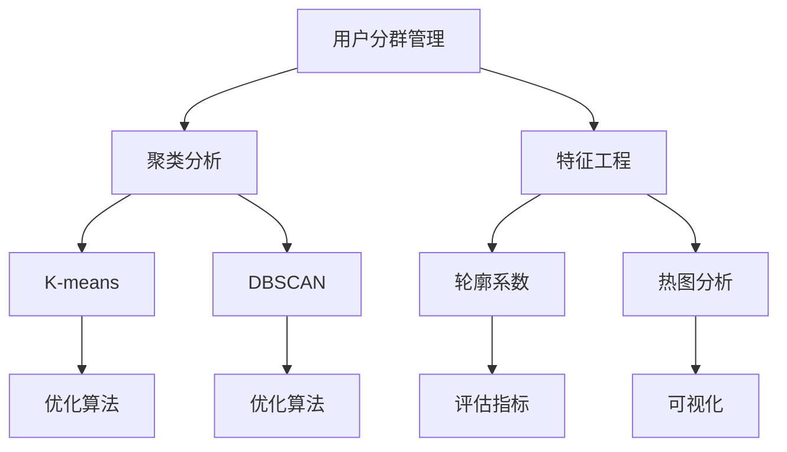

                 

# 如何进行有效的用户分群管理

在现代数字化营销和运营中，用户分群管理是一项至关重要的任务。通过将用户根据其行为、属性和需求划分为不同的群体，企业能够实现更加精准的营销策略，提升用户满意度和忠诚度，增加业务收入。本文将深入探讨用户分群管理的核心概念、算法原理、具体操作步骤和实际应用场景，以期为从业者提供全面的技术指导。

## 1. 背景介绍

### 1.1 问题由来

随着互联网和移动设备普及，企业的数字化营销和运营变得更加复杂和精细。传统的以一概全的营销策略已经无法满足需求，细分市场、精准营销变得尤为重要。用户分群管理，就是在大量的用户数据中，通过聚类分析、关联规则等方法，找出具有相似特征的用户群体，从而进行有针对性的营销。

### 1.2 问题核心关键点

用户分群管理主要包括以下几个关键点：

- **数据准备**：收集和处理用户数据，确保数据质量和完整性。
- **分群算法**：选择合适的聚类算法，将用户分为不同的群体。
- **特征选择**：从海量数据中选择关键特征，减少计算量和提升模型精度。
- **评估与优化**：通过评估指标，优化分群结果，提高营销效果。
- **应用与反馈**：将分群结果应用于营销策略，收集用户反馈，持续改进。

### 1.3 问题研究意义

用户分群管理在提升用户体验、增强用户粘性、优化营销效果等方面具有重要意义：

1. **提升用户体验**：通过分析用户行为和偏好，提供个性化推荐和服务，增强用户体验。
2. **增强用户粘性**：了解用户需求和反馈，优化产品和服务，提升用户满意度和忠诚度。
3. **优化营销效果**：根据用户分群进行精准营销，提高营销ROI，增加业务收入。
4. **加速产品迭代**：通过用户分群分析，快速发现问题，指导产品改进和创新。

## 2. 核心概念与联系

### 2.1 核心概念概述

为了更好地理解用户分群管理的全貌，本节将介绍几个关键概念：

- **用户分群管理**：通过聚类算法将用户分为具有相似特征的群体，从而进行精准营销和管理。
- **聚类分析**：一种无监督学习方法，将相似的数据点划分为不同的组。
- **特征工程**：从原始数据中提取、选择、构造有意义的特征，用于提升模型性能。
- **K-means**：一种常用的聚类算法，通过迭代优化，将数据点划分为K个簇。
- **DBSCAN**：一种基于密度的聚类算法，能够发现任意形状的簇。
- **轮廓系数**：评估聚类结果的指标，值越大表示簇内数据点越相似，簇间数据点差异越大。
- **热图分析**：将用户分群结果可视化，通过颜色深浅和簇内成员数量，直观展示聚类效果。

这些概念之间的逻辑关系可以通过以下Mermaid流程图来展示：



这个流程图展示了一系列关键概念及其之间的关系：

1. 用户分群管理：通过聚类分析得到用户群体，再通过特征工程、热图分析等手段进行优化和可视化。
2. 聚类分析：包括K-means、DBSCAN等算法，用于将用户数据划分为不同的组。
3. 特征工程：用于选择和构造有意义的特征，提升聚类效果。
4. 轮廓系数：评估聚类结果的质量，指导算法优化。
5. 热图分析：将聚类结果可视化，便于理解分析。

这些概念共同构成了用户分群管理的核心，帮助企业在数字化运营中实现更精准的决策和营销。

## 3. 核心算法原理 & 具体操作步骤

### 3.1 算法原理概述

用户分群管理的核心算法原理是聚类分析。聚类算法是一种无监督学习方法，将数据点划分为不同的组，使得同一组内的数据点相似度较高，而不同组之间的数据点相似度较低。常见的聚类算法包括K-means、DBSCAN等。

在聚类分析中，输入为n个数据点，输出为k个簇。通过迭代优化，寻找最佳的簇分配方案。常见的评估指标包括轮廓系数、Calinski-Harabasz指数等，用于衡量聚类效果。

### 3.2 算法步骤详解

用户分群管理的详细步骤主要包括数据准备、特征选择、聚类分析、结果评估和优化。

**Step 1: 数据准备**

收集和处理用户数据，确保数据的质量和完整性。用户数据通常包括行为数据、属性数据和文本数据等。

**Step 2: 特征选择**

从海量数据中选择关键特征，减少计算量和提升模型精度。常用的特征选择方法包括卡方检验、信息增益、L1正则等。

**Step 3: 聚类分析**

选择合适的聚类算法，将用户分为不同的群体。常用的聚类算法包括K-means、DBSCAN等。

**Step 4: 结果评估**

通过轮廓系数、Calinski-Harabasz指数等指标，评估聚类结果的质量。

**Step 5: 结果优化**

根据评估结果，对聚类算法进行优化，提高聚类效果。

### 3.3 算法优缺点

用户分群管理算法具有以下优点：

1. 自动化程度高：通过算法自动进行数据分组，减少人工干预。
2. 可扩展性好：适用于大规模数据集，能够处理数百万乃至数十亿级别的用户数据。
3. 结果可解释性强：聚类结果可视化和评估指标，便于理解和分析。

但同时也存在一些缺点：

1. 数据质量要求高：用户数据需要高质量和完整性，否则聚类结果可能不准确。
2. 算法选择困难：不同的聚类算法适用于不同的数据类型和业务场景，选择合适的算法需要经验。
3. 计算资源消耗大：大规模数据集和复杂算法需要高计算资源，可能导致时间成本较高。

### 3.4 算法应用领域

用户分群管理算法在多个领域都有广泛的应用：

1. **电子商务**：通过用户分群管理，提升个性化推荐和精准营销效果。
2. **金融服务**：分析客户行为和需求，进行风险控制和客户管理。
3. **医疗健康**：分析患者数据，进行疾病预测和个性化治疗。
4. **社交媒体**：分析用户兴趣和行为，提供内容推荐和广告投放。
5. **旅游酒店**：分析客户偏好，提供定制化服务和推荐。

## 4. 数学模型和公式 & 详细讲解 & 举例说明

### 4.1 数学模型构建

本节将使用数学语言对用户分群管理的核心算法进行更加严格的刻画。

记用户数据集为 $D=\{x_1, x_2, ..., x_n\}$，其中每个用户 $x_i$ 表示为一个向量，包含若干特征。聚类算法的目标是将数据集划分为 $k$ 个簇，使得簇内数据点相似度较高，簇间数据点相似度较低。聚类过程可以用如下公式表示：

$$
C = \arg\min_{K} \sum_{i=1}^{n} \sum_{j=1}^{k} d(x_i, C_j)^2
$$

其中 $C_j$ 表示第 $j$ 个簇的中心点，$d$ 表示欧几里得距离。

### 4.2 公式推导过程

以下我们以K-means算法为例，推导其核心公式和计算步骤。

K-means算法的基本思想是通过迭代优化，将数据点划分到最近的簇中心点。假设初始时随机选择 $k$ 个簇中心点，记为 $C_1, C_2, ..., C_k$，则第 $i$ 个数据点 $x_i$ 到最近的簇中心点 $C_j$ 的距离为：

$$
d(x_i, C_j) = \sum_{l=1}^{d} (x_{il} - C_{jl})^2
$$

其中 $d$ 表示数据点的维数，$x_{il}$ 和 $C_{jl}$ 分别表示数据点和簇中心点在第 $l$ 个特征上的值。

K-means算法的目标是最小化总距离，即：

$$
\min_{C} \sum_{i=1}^{n} \min_{j} d(x_i, C_j)^2
$$

根据上述目标，K-means算法可以分解为以下几个步骤：

1. **初始化簇中心点**：随机选择 $k$ 个数据点作为初始的簇中心点。
2. **分配数据点**：将每个数据点分配到最近的簇中心点。
3. **更新簇中心点**：计算每个簇内所有数据点的均值，更新簇中心点。
4. **重复迭代**：重复2和3步骤，直到簇中心点不再变化。

### 4.3 案例分析与讲解

假设有一个电子商务网站，拥有数百万的用户数据。网站希望通过用户分群管理，提升个性化推荐和精准营销效果。

首先，收集用户的浏览、购买、评价等行为数据，以及年龄、性别、地区等属性数据，作为输入数据。

然后，进行特征选择，选取与用户购买行为相关的特征，如浏览时长、购买频率、评价评分等。

接下来，使用K-means算法对用户进行聚类，将相似的用户分为不同的群体。通过热图分析，可视化聚类结果，发现部分群体可能存在购买倾向相似的用户。

最后，对不同的用户群体进行精准营销，如对高购买频次的用户推荐高性价比商品，对高评价评分用户推荐相关商品等，显著提升营销效果和用户体验。

## 5. 项目实践：代码实例和详细解释说明

### 5.1 开发环境搭建

在进行用户分群管理项目实践前，我们需要准备好开发环境。以下是使用Python进行PyTorch开发的环境配置流程：

1. 安装Anaconda：从官网下载并安装Anaconda，用于创建独立的Python环境。

2. 创建并激活虚拟环境：
```bash
conda create -n pytorch-env python=3.8 
conda activate pytorch-env
```

3. 安装PyTorch：根据CUDA版本，从官网获取对应的安装命令。例如：
```bash
conda install pytorch torchvision torchaudio cudatoolkit=11.1 -c pytorch -c conda-forge
```

4. 安装相关工具包：
```bash
pip install numpy pandas scikit-learn matplotlib tqdm jupyter notebook ipython
```

完成上述步骤后，即可在`pytorch-env`环境中开始用户分群管理的实践。

### 5.2 源代码详细实现

以下是使用PyTorch进行用户分群管理的完整代码实现，包括数据准备、特征选择、聚类分析和结果评估等步骤。

```python
import numpy as np
import pandas as pd
import torch
import matplotlib.pyplot as plt
from sklearn.cluster import KMeans
from sklearn.metrics import silhouette_score

# 准备数据
data = pd.read_csv('user_data.csv')
X = data[['browsing_time', 'purchase_frequency', 'rating_score']].values

# 特征选择
selected_features = X[:, [0, 1, 2]]

# 聚类分析
kmeans = KMeans(n_clusters=3, random_state=42)
kmeans.fit(selected_features)

# 结果评估
silhouette_avg = silhouette_score(selected_features, kmeans.labels_)
print(f'Silhouette Score: {silhouette_avg}')

# 可视化
plt.figure(figsize=(10, 6))
plt.scatter(selected_features[:, 0], selected_features[:, 1], c=kmeans.labels_, cmap='viridis')
plt.xlabel('Browsing Time')
plt.ylabel('Purchase Frequency')
plt.title('User Clustering')
plt.show()
```

### 5.3 代码解读与分析

让我们再详细解读一下关键代码的实现细节：

**数据准备**：
- 使用Pandas读取用户数据，获取需要分析的特征数据。

**特征选择**：
- 选取与用户行为相关的特征，构建特征矩阵。

**聚类分析**：
- 使用KMeans算法对特征数据进行聚类，选择簇数为3（根据业务需求和数据情况确定）。

**结果评估**：
- 使用轮廓系数评估聚类效果，输出平均轮廓系数。

**可视化**：
- 将聚类结果可视化，展示簇内成员分布情况。

可以看到，PyTorch配合Scikit-Learn库使得用户分群管理的代码实现变得简洁高效。开发者可以将更多精力放在数据处理、模型改进等高层逻辑上，而不必过多关注底层的实现细节。

当然，工业级的系统实现还需考虑更多因素，如模型的保存和部署、超参数的自动搜索、更灵活的任务适配层等。但核心的分群范式基本与此类似。

## 6. 实际应用场景

### 6.1 电子商务

在电子商务领域，用户分群管理可以应用于个性化推荐、精准营销、客户管理等方面。通过分析用户行为和偏好，提供个性化推荐和服务，提升用户体验和满意度。

例如，某电商平台通过用户分群管理，将用户分为高价值用户、潜在高价值用户和低价值用户三类，并针对不同用户群体设计不同的营销策略。对高价值用户提供专属优惠和定制化服务，对潜在高价值用户进行精准推荐和内容推送，对低价值用户进行流失预警和挽救策略。

### 6.2 金融服务

金融服务行业可以通过用户分群管理，进行风险控制和客户管理。通过分析用户交易行为和属性，将用户分为高风险用户、中等风险用户和低风险用户，对高风险用户进行严格的账户管理，对中等风险用户进行风险预警，对低风险用户进行客户关怀。

例如，某银行通过用户分群管理，将用户分为个人用户和企业用户，对个人用户进行信用卡营销和个性化服务，对企业用户进行风险管理和信用评估。

### 6.3 医疗健康

医疗健康领域可以通过用户分群管理，进行疾病预测和个性化治疗。通过分析患者历史数据和行为，将患者分为高风险患者、中等风险患者和低风险患者，对高风险患者进行早期干预和预防措施，对中等风险患者进行定期检查和健康管理，对低风险患者进行健康教育和知识普及。

例如，某医疗机构通过用户分群管理，将患者分为心脏病患者、糖尿病患者和普通患者，对心脏病患者进行定期体检和病情监控，对糖尿病患者进行饮食和运动指导，对普通患者进行健康教育和定期检查。

### 6.4 社交媒体

社交媒体平台可以通过用户分群管理，进行内容推荐和广告投放。通过分析用户兴趣和行为，将用户分为不同兴趣群体的用户，对不同兴趣群体的用户推送相关内容，提升用户粘性和平台活跃度。

例如，某社交媒体平台通过用户分群管理，将用户分为新闻爱好者、娱乐爱好者和社交爱好者，对新闻爱好者推送新闻资讯，对娱乐爱好者推送娱乐内容，对社交爱好者推送社交互动。

### 6.5 旅游酒店

旅游酒店可以通过用户分群管理，提供定制化服务和推荐。通过分析用户旅游偏好和行为，将用户分为不同旅游兴趣的用户，对不同兴趣的用户推荐相关旅游产品和线路，提升用户体验和满意度。

例如，某旅游公司通过用户分群管理，将用户分为户外爱好者、历史文化爱好者和休闲度假爱好者，对户外爱好者推荐户外旅行线路和装备，对历史文化爱好者推荐历史景点和文化遗产，对休闲度假爱好者推荐度假胜地和休闲设施。

## 7. 工具和资源推荐

### 7.1 学习资源推荐

为了帮助开发者系统掌握用户分群管理的理论基础和实践技巧，这里推荐一些优质的学习资源：

1. **《Python数据科学手册》**：由Jake VanderPlas编写，全面介绍了数据科学和机器学习的核心概念和实践技巧，包括聚类分析等。

2. **《机器学习实战》**：由Peter Harrington编写，通过Python代码实现各种机器学习算法，包括K-means等聚类算法。

3. **Coursera《机器学习》课程**：由Andrew Ng教授授课，系统讲解机器学习理论和实践，包括聚类分析等。

4. **Kaggle**：全球最大的数据科学竞赛平台，提供丰富的聚类分析和用户分群管理的竞赛和案例，帮助开发者实践和提升技能。

5. **GitHub**：开源代码托管平台，提供大量用户分群管理的开源项目和代码，方便开发者学习和参考。

通过对这些资源的学习实践，相信你一定能够快速掌握用户分群管理的精髓，并用于解决实际的业务问题。

### 7.2 开发工具推荐

高效的开发离不开优秀的工具支持。以下是几款用于用户分群管理开发的常用工具：

1. **PyTorch**：基于Python的开源深度学习框架，灵活动态的计算图，适合快速迭代研究。

2. **Scikit-Learn**：Python的科学计算库，提供了丰富的机器学习算法和工具，包括聚类算法。

3. **Kaggle**：全球最大的数据科学竞赛平台，提供了丰富的数据集和算法库，便于开发者实践和优化。

4. **Jupyter Notebook**：Python的交互式开发环境，支持代码编写和可视化展示，便于开发者调试和演示。

5. **TensorBoard**：TensorFlow配套的可视化工具，可实时监测模型训练状态，提供丰富的图表呈现方式，便于开发者调试和优化。

合理利用这些工具，可以显著提升用户分群管理的开发效率，加快创新迭代的步伐。

### 7.3 相关论文推荐

用户分群管理的研究源于学界的持续研究。以下是几篇奠基性的相关论文，推荐阅读：

1. **K-means: A method for clustering by Dunn and Bakry**：提出K-means聚类算法，成为聚类分析的经典方法。

2. **DBSCAN: Density-Based Clustering of Points in a Spatial Database with Noise**：提出DBSCAN算法，通过密度衡量和核心点选择实现聚类。

3. **Silhouette Analysis**：提出轮廓系数，用于评估聚类效果，广泛应用于聚类分析和用户分群管理。

4. **User Clustering for Recommendation Systems**：研究用户分群管理在推荐系统中的应用，提出基于协同过滤和聚类算法的推荐模型。

5. **Personalized Recommendations with Clustering and Influence Propagation**：提出基于聚类分析和影响力传播的推荐模型，应用于电商、社交媒体等领域。

这些论文代表了大语言模型微调技术的发展脉络。通过学习这些前沿成果，可以帮助研究者把握学科前进方向，激发更多的创新灵感。

## 8. 总结：未来发展趋势与挑战

### 8.1 总结

本文对用户分群管理进行了全面系统的介绍。首先阐述了用户分群管理的背景和核心关键点，明确了聚类分析在用户分群管理中的重要作用。其次，从原理到实践，详细讲解了聚类分析的数学原理和关键步骤，给出了用户分群管理的完整代码实例。同时，本文还广泛探讨了用户分群管理在电子商务、金融服务、医疗健康、社交媒体和旅游酒店等领域的实际应用场景，展示了用户分群管理的巨大潜力。此外，本文精选了用户分群管理的各类学习资源，力求为读者提供全方位的技术指引。

通过本文的系统梳理，可以看到，用户分群管理在提升用户体验、增强用户粘性、优化营销效果等方面具有重要意义。未来，伴随大数据和人工智能技术的不断发展，用户分群管理必将进入新的发展阶段，带来更多的创新应用。

### 8.2 未来发展趋势

展望未来，用户分群管理技术将呈现以下几个发展趋势：

1. **自动化程度提升**：通过AI和机器学习算法，自动进行数据处理和聚类分析，提升聚类效果和速度。

2. **多维度聚类**：结合用户行为、属性、情感等多维度数据进行聚类分析，提高聚类结果的准确性和精细度。

3. **实时聚类**：通过流式数据处理技术，实现实时聚类分析，适应快速变化的业务场景。

4. **跨平台应用**：将用户分群管理应用到多个平台和场景，如电商平台、社交媒体、医疗健康等，实现全渠道的客户管理。

5. **个性化推荐**：通过聚类分析和推荐算法，实现个性化推荐，提升用户体验和满意度。

6. **数据安全**：加强数据隐私和安全保护，防止用户数据泄露和滥用。

以上趋势凸显了用户分群管理的广阔前景。这些方向的探索发展，必将进一步提升用户体验，优化营销效果，推动数字化运营向更加智能和精细的方向发展。

### 8.3 面临的挑战

尽管用户分群管理技术已经取得了瞩目成就，但在迈向更加智能化、普适化应用的过程中，它仍面临着诸多挑战：

1. **数据质量问题**：用户数据需要高质量和完整性，否则聚类结果可能不准确。

2. **算法选择困难**：不同的聚类算法适用于不同的数据类型和业务场景，选择合适的算法需要经验。

3. **计算资源消耗大**：大规模数据集和复杂算法需要高计算资源，可能导致时间成本较高。

4. **模型解释性不足**：聚类结果通常缺乏可解释性，难以对其内部工作机制和决策逻辑进行分析和调试。

5. **用户隐私保护**：用户数据隐私和安全性需要得到保障，防止数据滥用和泄露。

6. **业务场景复杂**：不同行业和业务场景下的用户分群管理需求各异，需要量身定制解决方案。

这些挑战需要开发者不断优化算法和模型，提高数据质量和处理效率，保障数据隐私和安全，才能实现用户分群管理的落地应用。

### 8.4 研究展望

面对用户分群管理所面临的挑战，未来的研究需要在以下几个方面寻求新的突破：

1. **优化算法性能**：开发更加高效的聚类算法，减少计算资源消耗，提升聚类速度和精度。

2. **增强模型可解释性**：通过特征选择和可视化手段，增强聚类模型的可解释性，便于理解和使用。

3. **融合多模态数据**：结合用户行为、属性、情感等多维度数据，实现多模态聚类分析。

4. **应用AI和机器学习**：结合AI和机器学习技术，自动化进行用户分群管理和推荐策略设计。

5. **保障数据隐私**：通过数据匿名化和加密技术，保障用户数据隐私和安全。

这些研究方向的探索，必将引领用户分群管理技术迈向更高的台阶，为数字化运营带来新的突破。面向未来，用户分群管理技术还需要与其他人工智能技术进行更深入的融合，如知识表示、因果推理、强化学习等，多路径协同发力，共同推动用户分群管理的进步。只有勇于创新、敢于突破，才能不断拓展用户分群管理的边界，让数字化运营更加智能和精细。

## 9. 附录：常见问题与解答

**Q1：用户分群管理是否适用于所有业务场景？**

A: 用户分群管理在大多数业务场景中都有广泛的应用。但在一些特定场景下，如医疗健康、金融服务等，可能存在数据隐私和合规问题，需要特别注意。

**Q2：如何选择合适的聚类算法？**

A: 选择合适的聚类算法需要考虑数据类型、业务需求和计算资源等因素。常用的聚类算法包括K-means、DBSCAN等，建议结合具体业务场景进行选择。

**Q3：用户分群管理需要哪些计算资源？**

A: 用户分群管理需要较高的计算资源，特别是在处理大规模数据集时。建议使用高性能计算设备和分布式计算框架，如PyTorch、TensorFlow等。

**Q4：用户分群管理如何保障数据隐私？**

A: 用户分群管理需要严格遵守数据隐私和合规要求，可以通过数据匿名化、加密等技术手段，保障用户数据隐私和安全。

**Q5：用户分群管理如何应用于推荐系统？**

A: 用户分群管理可以应用于推荐系统，通过聚类分析用户行为和偏好，进行个性化推荐，提升用户体验和满意度。

**Q6：用户分群管理如何应用于客户管理？**

A: 用户分群管理可以应用于客户管理，通过聚类分析客户属性和行为，进行客户分类和客户关系管理，提升客户满意度和忠诚度。

总之，用户分群管理作为数字化运营的重要工具，具有广泛的应用前景和实践意义。通过科学地选择聚类算法、优化数据处理和分析流程，可以实现更加精准的用户分群管理，提升数字化运营的智能化和精细化水平。相信在未来，随着技术的发展和应用的深入，用户分群管理必将带来更多的创新和突破，推动数字化运营进入新的发展阶段。

