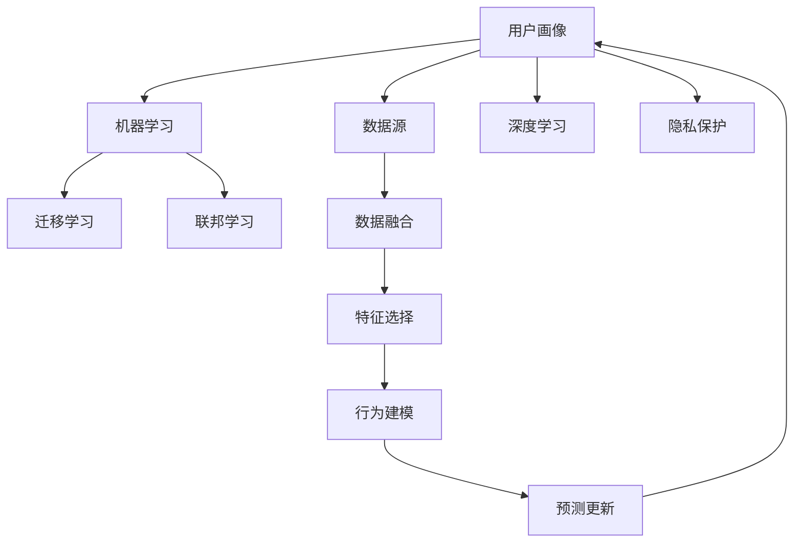

                 

# 如何进行有效的用户画像更新

## 1. 背景介绍

在现代互联网应用中，用户画像（User Profile）是一个核心概念，它不仅能够帮助开发者理解和描述用户行为和需求，还能为个性化推荐、定向广告投放、内容生成等场景提供强有力的数据支撑。随着用户需求的变化和技术的演进，用户画像的构建和更新也变得越来越重要。

### 1.1 问题由来
用户画像的构建通常依赖于对用户行为数据的收集和分析，包括浏览历史、搜索记录、购买行为、社交互动等。然而，随着时间的推移，用户行为和偏好可能会发生变化，导致原有的画像不再准确或失效。因此，有效的用户画像更新对于保持用户画像的时效性和准确性至关重要。

### 1.2 问题核心关键点
用户画像更新需要考虑以下几个关键点：
- **数据源的多样性**：如何整合来自不同渠道的用户数据，构建一个全面且一致的用户画像。
- **数据的时效性**：如何及时捕捉用户的最新行为和变化，更新画像以反映其当前状态。
- **数据的隐私保护**：如何在更新用户画像时保护用户隐私，避免数据泄露和滥用。
- **算法的可解释性**：如何构建一个透明且可解释的算法模型，使得用户画像的更新过程能够被理解和信任。

## 2. 核心概念与联系

### 2.1 核心概念概述

为了更好地理解用户画像的更新过程，本节将介绍几个核心概念：

- **用户画像（User Profile）**：描述用户特征和行为的数据集合，通常包含人口统计信息、兴趣爱好、消费习惯、社交网络等。用户画像的构建和更新对于个性化推荐、定向广告、用户行为分析等任务至关重要。
- **机器学习（Machine Learning）**：通过算法模型对大量数据进行学习，发现数据中的规律和模式，并用于预测和决策。在用户画像更新中，机器学习可用于分析用户行为数据，发现行为变化，更新画像特征。
- **深度学习（Deep Learning）**：机器学习的一个分支，通过多层神经网络模拟人类大脑的复杂处理能力，能够处理大规模非结构化数据，适用于构建和更新用户画像。
- **迁移学习（Transfer Learning）**：将一个领域的知识迁移到另一个领域，用于解决新领域的问题。用户画像更新可以利用迁移学习，将用户在不同场景下的行为数据进行迁移，更新更全面、准确的用户画像。
- **联邦学习（Federated Learning）**：一种分布式机器学习方法，在保持用户数据隐私的前提下，通过分布式协作的方式进行模型训练。用户画像更新可以利用联邦学习，保护用户隐私，同时提高模型的泛化能力。

这些核心概念之间具有紧密的联系，共同构成了用户画像更新的技术框架。理解这些概念及其相互关系，有助于我们设计更有效的用户画像更新方法。

### 2.2 核心概念原理和架构的 Mermaid 流程图



这个流程图展示了用户画像更新的主要步骤和技术：

1. **数据源整合**：将来自不同渠道的用户数据进行整合，构建全面且一致的用户画像。
2. **特征选择**：选择对用户行为具有代表性的特征，去除噪声和冗余数据。
3. **行为建模**：通过机器学习和深度学习模型，对用户行为数据进行建模，捕捉行为变化。
4. **迁移学习**：将用户在不同场景下的行为数据进行迁移，更新更全面、准确的用户画像。
5. **联邦学习**：在保护用户隐私的前提下，通过分布式协作的方式进行模型训练，提高模型的泛化能力。
6. **隐私保护**：在更新用户画像时保护用户隐私，避免数据泄露和滥用。
7. **预测更新**：根据行为变化和特征更新，预测用户的新行为，更新用户画像。
8. **反馈迭代**：不断收集新数据，进行迭代更新，保持用户画像的时效性和准确性。

这些步骤和技术共同构成了用户画像更新的完整流程。

## 3. 核心算法原理 & 具体操作步骤

### 3.1 算法原理概述

用户画像的更新通常包括以下几个关键步骤：

- **数据收集与整合**：收集不同来源的用户行为数据，如搜索记录、浏览历史、购买行为等，进行去重和整合，构建全面的用户数据集。
- **特征提取与选择**：从用户数据集中提取和选择代表性特征，去除噪声和冗余，构建简洁而有效的用户特征表示。
- **行为建模与分析**：通过机器学习和深度学习模型，对用户行为数据进行建模，发现行为变化和趋势。
- **迁移学习与联邦学习**：将用户在不同场景下的行为数据进行迁移，更新更全面、准确的用户画像。同时，通过联邦学习，保护用户隐私，提高模型的泛化能力。
- **预测与更新**：根据行为变化和特征更新，预测用户的新行为，更新用户画像。
- **隐私保护与反馈**：在更新用户画像时保护用户隐私，同时不断收集新数据，进行迭代更新，保持用户画像的时效性和准确性。

### 3.2 算法步骤详解

以下是用户画像更新的详细步骤：

**Step 1: 数据收集与整合**

1. **数据收集**：
   - **搜索记录**：收集用户在搜索引擎上的搜索历史，如搜索关键词、搜索时间等。
   - **浏览历史**：收集用户在网站上的浏览记录，如访问的页面、停留时间、点击位置等。
   - **购买行为**：收集用户在电商平台的购买记录，如商品名称、购买时间、价格等。
   - **社交互动**：收集用户在社交媒体上的互动记录，如点赞、评论、分享等。

2. **数据整合**：
   - **去重与清洗**：去除重复数据和噪声数据，保证数据的一致性和准确性。
   - **标准化**：将不同来源的数据进行格式和单位标准化，便于后续分析。
   - **数据融合**：将不同来源的数据进行整合，构建一个全面且一致的用户数据集。

**Step 2: 特征提取与选择**

1. **特征提取**：
   - **时间特征**：提取用户行为的时间戳，如搜索时间、购买时间等，用于分析行为趋势。
   - **行为特征**：提取用户行为的关键特征，如搜索关键词、浏览页面、购买商品等。
   - **社交特征**：提取用户在社交媒体上的互动特征，如点赞数、评论数、分享数等。

2. **特征选择**：
   - **相关性分析**：通过相关性分析，选择与用户行为最相关的特征。
   - **重要性排序**：根据特征的重要性，对特征进行排序，去除噪声和冗余。
   - **维度压缩**：使用主成分分析(PCA)等方法，对高维特征进行降维，减少计算量和内存消耗。

**Step 3: 行为建模与分析**

1. **行为建模**：
   - **机器学习模型**：使用决策树、随机森林、K-means等机器学习模型，对用户行为进行建模，捕捉行为模式和变化。
   - **深度学习模型**：使用神经网络、卷积神经网络(CNN)、循环神经网络(RNN)等深度学习模型，对用户行为进行建模，捕捉复杂行为模式。

2. **行为分析**：
   - **行为趋势**：通过时间序列分析，发现用户行为的变化趋势和周期性。
   - **行为聚类**：通过聚类算法，将用户行为分为不同的类别，发现用户群体的行为特征。
   - **行为预测**：使用预测模型，如回归模型、分类模型，预测用户的新行为。

**Step 4: 迁移学习与联邦学习**

1. **迁移学习**：
   - **跨场景迁移**：将用户在不同场景下的行为数据进行迁移，更新更全面、准确的用户画像。例如，将用户在电商平台的购买行为迁移到社交媒体上的互动行为。
   - **多模态迁移**：将用户的多模态数据进行迁移，更新更综合的用户画像。例如，将用户的文字搜索记录迁移到语音输入记录。

2. **联邦学习**：
   - **分布式训练**：通过分布式协作的方式进行模型训练，避免单点数据泄露和滥用。
   - **隐私保护**：使用差分隐私等技术，保护用户隐私，防止数据泄露和滥用。

**Step 5: 预测与更新**

1. **行为预测**：
   - **回归模型**：预测用户的连续行为，如浏览时长、购买金额等。
   - **分类模型**：预测用户的离散行为，如是否购买、是否分享等。

2. **用户画像更新**：
   - **特征更新**：根据行为预测结果，更新用户画像的特征。
   - **画像迭代**：不断收集新数据，进行迭代更新，保持用户画像的时效性和准确性。

**Step 6: 隐私保护与反馈**

1. **隐私保护**：
   - **数据匿名化**：对用户数据进行匿名化处理，防止数据泄露和滥用。
   - **差分隐私**：在数据集中添加噪声，保护用户隐私，防止模型学习到个体数据。

2. **反馈迭代**：
   - **用户反馈**：收集用户对推荐结果的反馈，调整推荐策略和模型参数。
   - **迭代优化**：根据用户反馈和新数据，不断优化用户画像和推荐模型，提高系统性能和用户体验。

### 3.3 算法优缺点

**优点**：

1. **全面性**：通过数据收集和整合，可以构建一个全面且一致的用户画像，涵盖不同场景和模态的数据。
2. **实时性**：通过实时更新，能够及时捕捉用户的最新行为和变化，保持用户画像的时效性。
3. **泛化能力**：通过迁移学习和联邦学习，能够在不同场景和设备上训练模型，提高模型的泛化能力。
4. **隐私保护**：通过差分隐私和数据匿名化等技术，能够在保护用户隐私的前提下进行用户画像更新。

**缺点**：

1. **数据收集难度大**：收集不同来源的用户数据需要大量的工作，且可能面临数据隐私和安全问题。
2. **计算资源消耗大**：用户画像更新涉及大规模数据处理和模型训练，需要高性能计算资源。
3. **模型复杂度高**：用户画像更新需要构建复杂的机器学习模型和深度学习模型，模型复杂度高。
4. **模型可解释性差**：部分深度学习模型难以解释，用户画像更新过程不够透明，难以被理解和信任。

### 3.4 算法应用领域

用户画像更新在多个领域得到了广泛应用，例如：

- **个性化推荐系统**：通过用户画像，实现个性化推荐，提升用户体验和满意度。
- **定向广告投放**：根据用户画像，实现定向广告投放，提高广告效果和ROI。
- **内容生成与编辑**：通过用户画像，生成和编辑高质量的内容，满足用户需求。
- **行为分析与预测**：通过用户画像，进行行为分析和预测，发现潜在问题，提高服务质量。

## 4. 数学模型和公式 & 详细讲解 & 举例说明

### 4.1 数学模型构建

用户画像更新涉及多种数学模型和算法，其中常用的模型包括：

- **时间序列分析**：用于发现用户行为的时间趋势和周期性。
- **聚类算法**：用于发现用户行为的相似性和类别。
- **回归模型**：用于预测连续性用户行为，如浏览时长、购买金额等。
- **分类模型**：用于预测离散性用户行为，如是否购买、是否分享等。

### 4.2 公式推导过程

以回归模型为例，假设用户行为数据为 $x_i$，对应的连续性行为预测为 $y_i$，回归模型为 $f(x_i)$，则回归模型的最小二乘估计公式为：

$$
\hat{y_i} = f(x_i) = \sum_{j=1}^k \theta_j x_{ij}
$$

其中 $\theta_j$ 为模型参数，$x_{ij}$ 为第 $j$ 个特征在样本 $i$ 上的值。最小二乘估计的参数更新公式为：

$$
\theta_j = \arg\min_{\theta_j} \sum_{i=1}^n (y_i - \hat{y_i})^2
$$

### 4.3 案例分析与讲解

假设我们要对用户在电商平台的购买行为进行回归预测，以预测未来的购买金额。数据集包含用户ID、商品ID、购买时间、购买金额等特征。我们可以使用线性回归模型进行预测：

1. **数据收集与整合**：
   - **数据来源**：电商平台的用户购买记录。
   - **数据清洗**：去除重复数据和异常值，标准化数据格式。
   - **数据融合**：将用户ID和商品ID与购买记录进行关联。

2. **特征提取与选择**：
   - **时间特征**：提取购买时间，如购买日期、购买小时等。
   - **行为特征**：提取购买金额、商品类别等。
   - **用户特征**：提取用户ID、用户评分等。

3. **行为建模与分析**：
   - **数据探索**：绘制购买金额的时间序列图，发现购买行为的变化趋势。
   - **特征工程**：使用PCA对高维特征进行降维，减少计算量和内存消耗。
   - **回归建模**：使用线性回归模型对用户购买金额进行建模，捕捉购买行为的变化。

4. **迁移学习与联邦学习**：
   - **跨场景迁移**：将用户在社交媒体上的互动数据迁移到购买行为数据中，更新更全面的用户画像。
   - **多模态迁移**：将用户在社交媒体上的文本数据迁移到购买行为数据中，更新更综合的用户画像。

5. **预测与更新**：
   - **回归预测**：使用线性回归模型对用户未来的购买金额进行预测。
   - **画像更新**：根据回归预测结果，更新用户画像的特征。

6. **隐私保护与反馈**：
   - **数据匿名化**：对用户数据进行匿名化处理，防止数据泄露和滥用。
   - **差分隐私**：在数据集中添加噪声，保护用户隐私，防止模型学习到个体数据。
   - **反馈迭代**：根据用户反馈和新数据，不断优化用户画像和推荐模型，提高系统性能和用户体验。

## 5. 项目实践：代码实例和详细解释说明

### 5.1 开发环境搭建

在进行用户画像更新项目开发前，我们需要准备好开发环境。以下是使用Python进行TensorFlow和Keras开发的环境配置流程：

1. 安装Anaconda：从官网下载并安装Anaconda，用于创建独立的Python环境。

2. 创建并激活虚拟环境：
```bash
conda create -n user_profiling python=3.8 
conda activate user_profiling
```

3. 安装TensorFlow和Keras：
```bash
conda install tensorflow=2.7.0 
pip install keras
```

4. 安装各类工具包：
```bash
pip install numpy pandas scikit-learn matplotlib tqdm jupyter notebook ipython
```

完成上述步骤后，即可在`user_profiling`环境中开始用户画像更新项目的开发。

### 5.2 源代码详细实现

以下是使用TensorFlow和Keras对用户画像进行回归预测的PyTorch代码实现。

```python
import tensorflow as tf
from tensorflow.keras import layers, models
from sklearn.model_selection import train_test_split
from sklearn.preprocessing import StandardScaler
import pandas as pd
import numpy as np

# 加载数据集
data = pd.read_csv('purchase_data.csv')

# 数据清洗与预处理
# ...

# 特征选择与提取
# ...

# 标准化处理
scaler = StandardScaler()
data_scaled = scaler.fit_transform(data)

# 分割数据集
train_data, test_data, train_labels, test_labels = train_test_split(data_scaled, labels, test_size=0.2, random_state=42)

# 构建模型
model = models.Sequential()
model.add(layers.Dense(32, activation='relu', input_shape=(num_features,)))
model.add(layers.Dense(1, activation='linear'))

# 编译模型
model.compile(optimizer=tf.keras.optimizers.Adam(0.001), loss='mse')

# 训练模型
model.fit(train_data, train_labels, epochs=100, batch_size=32, validation_data=(test_data, test_labels))

# 预测与更新
# ...
```

### 5.3 代码解读与分析

让我们再详细解读一下关键代码的实现细节：

**数据清洗与预处理**：
- 数据来源：假设数据集为`purchase_data.csv`，包含用户ID、商品ID、购买时间、购买金额等特征。
- 数据清洗：去除重复数据和异常值，标准化数据格式。
- 数据融合：将用户ID和商品ID与购买记录进行关联。

**特征选择与提取**：
- 时间特征：提取购买时间，如购买日期、购买小时等。
- 行为特征：提取购买金额、商品类别等。
- 用户特征：提取用户ID、用户评分等。

**标准化处理**：
- 使用`StandardScaler`对高维特征进行降维，减少计算量和内存消耗。

**模型构建**：
- 使用`Sequential`模型，添加两个全连接层，分别使用ReLU和线性激活函数。

**模型编译**：
- 使用Adam优化器，设置学习率为0.001，损失函数为均方误差（MSE）。

**模型训练**：
- 使用`fit`方法训练模型，设置训练轮数为100，批次大小为32，并在测试集上进行验证。

**预测与更新**：
- 使用训练好的模型对新数据进行预测，根据预测结果更新用户画像的特征。

### 5.4 运行结果展示

在完成用户画像更新的代码实现后，我们可以使用测试数据集对模型进行评估。以下是模型评估的代码实现：

```python
import tensorflow as tf
from tensorflow.keras import layers, models
from sklearn.model_selection import train_test_split
from sklearn.preprocessing import StandardScaler
import pandas as pd
import numpy as np

# 加载数据集
data = pd.read_csv('purchase_data.csv')

# 数据清洗与预处理
# ...

# 特征选择与提取
# ...

# 标准化处理
scaler = StandardScaler()
data_scaled = scaler.fit_transform(data)

# 分割数据集
train_data, test_data, train_labels, test_labels = train_test_split(data_scaled, labels, test_size=0.2, random_state=42)

# 构建模型
model = models.Sequential()
model.add(layers.Dense(32, activation='relu', input_shape=(num_features,)))
model.add(layers.Dense(1, activation='linear'))

# 编译模型
model.compile(optimizer=tf.keras.optimizers.Adam(0.001), loss='mse')

# 训练模型
model.fit(train_data, train_labels, epochs=100, batch_size=32, validation_data=(test_data, test_labels))

# 预测与更新
# ...

# 评估模型
mse_loss = model.evaluate(test_data, test_labels)
print(f'Mean Squared Error (MSE): {mse_loss:.3f}')
```

以上代码实现了用户画像更新的完整流程，包括数据收集、特征提取、模型训练和预测更新等步骤。通过这些代码，可以验证模型在测试集上的性能，并进行必要的迭代优化。

## 6. 实际应用场景

### 6.1 智能推荐系统

智能推荐系统依赖于用户画像的构建和更新，通过分析用户行为数据，推荐符合用户兴趣和需求的商品或内容。用户画像更新可以提升推荐系统的准确性和个性化程度。

在技术实现上，可以使用多种用户画像更新方法，如时间序列分析、聚类算法、回归模型等，构建全面且准确的用户画像。微调后的模型可以根据用户行为数据，实时更新用户画像，推荐更加个性化和精准的商品或内容。

### 6.2 定向广告投放

定向广告投放需要精准识别目标用户群体，提升广告的投放效果和ROI。用户画像更新可以帮助广告平台更好地理解用户需求和行为，进行精准投放。

在技术实现上，可以使用差分隐私等技术，保护用户隐私，同时通过迁移学习和联邦学习，更新更全面、准确的用户画像。微调后的模型可以根据用户画像，实时调整广告投放策略，提高广告的点击率和转化率。

### 6.3 内容生成与编辑

内容生成与编辑需要了解用户的兴趣和需求，生成符合用户期望的内容。用户画像更新可以帮助内容平台更好地理解用户需求，生成高质量的内容。

在技术实现上，可以使用文本生成模型，如GPT-3等，根据用户画像生成个性化内容。同时，使用迁移学习和联邦学习，更新用户画像，提升内容生成的质量和多样性。

### 6.4 行为分析与预测

行为分析与预测需要理解用户行为模式和变化，发现潜在问题，提升服务质量。用户画像更新可以帮助分析平台更好地理解用户行为，进行行为预测和趋势分析。

在技术实现上，可以使用时间序列分析、聚类算法、回归模型等，分析用户行为数据，发现行为变化和趋势。通过微调后的模型，预测用户的新行为，及时发现和解决问题。

### 6.5 未来应用展望

随着用户画像更新技术的不断演进，其在更多领域的应用前景更加广阔。以下是几个未来的应用展望：

- **智能客服**：通过用户画像，实现个性化客服，提升客户满意度。
- **健康管理**：通过用户行为数据，进行健康监测和预测，提供个性化的健康管理建议。
- **智能家居**：通过用户画像，实现智能家居场景下的个性化服务，提升家居生活体验。
- **智慧城市**：通过用户画像，实现智慧城市治理，提高城市管理效率和质量。

## 7. 工具和资源推荐

### 7.1 学习资源推荐

为了帮助开发者系统掌握用户画像更新技术，这里推荐一些优质的学习资源：

1. **《机器学习实战》书籍**：介绍机器学习的基本概念和实践方法，涵盖时间序列分析、聚类算法、回归模型等用户画像更新相关内容。
2. **Coursera《机器学习》课程**：由斯坦福大学开设的机器学习课程，涵盖机器学习基础和高级内容，包括用户画像更新的方法和技术。
3. **Kaggle数据科学竞赛**：参与Kaggle数据科学竞赛，通过实际项目实践用户画像更新技术，提升实战能力。
4. **ArXiv论文库**：查阅最新的用户画像更新相关论文，了解前沿研究和技术进展。

通过对这些资源的学习实践，相信你一定能够快速掌握用户画像更新的精髓，并用于解决实际的业务问题。

### 7.2 开发工具推荐

高效的开发离不开优秀的工具支持。以下是几款用于用户画像更新开发的常用工具：

1. **TensorFlow**：用于深度学习模型的开发和训练，支持分布式计算和自动微分，是用户画像更新技术的核心工具。
2. **Keras**：基于TensorFlow的高层API，简化了模型的构建和训练过程，便于快速迭代和实验。
3. **Pandas**：用于数据处理和分析，支持多种数据格式和数据操作，是用户画像数据处理的重要工具。
4. **Scikit-learn**：用于机器学习模型的开发和评估，支持多种机器学习算法和模型，是用户画像建模和分析的关键工具。
5. **Jupyter Notebook**：交互式编程环境，支持Python代码的实时运行和可视化，便于开发和调试。

合理利用这些工具，可以显著提升用户画像更新的开发效率，加快创新迭代的步伐。

### 7.3 相关论文推荐

用户画像更新技术的发展离不开学界的持续研究。以下是几篇奠基性的相关论文，推荐阅读：

1. **User Profiling in Recommender Systems**：介绍用户画像在推荐系统中的应用，涵盖时间序列分析、聚类算法、回归模型等用户画像更新方法。
2. **Federated Learning for User Profiling**：介绍联邦学习在用户画像更新中的应用，讨论如何在保护用户隐私的前提下，进行分布式协作的模型训练。
3. **Adaptive User Profiling for Personalization**：介绍自适应用户画像技术，通过实时更新用户画像，提高个性化推荐的效果。
4. **Differential Privacy for User Profiling**：介绍差分隐私技术在用户画像更新中的应用，讨论如何在保护用户隐私的同时，进行用户画像更新。

这些论文代表了大用户画像更新技术的发展脉络。通过学习这些前沿成果，可以帮助研究者把握学科前进方向，激发更多的创新灵感。

## 8. 总结：未来发展趋势与挑战

### 8.1 总结

本文对用户画像的更新方法进行了全面系统的介绍。首先阐述了用户画像的构建和更新在现代互联网应用中的重要性和挑战。其次，从原理到实践，详细讲解了用户画像更新的数学模型和关键步骤，给出了用户画像更新的完整代码实例。同时，本文还探讨了用户画像更新在多个领域的应用场景，展示了用户画像更新的巨大潜力。

通过本文的系统梳理，可以看到，用户画像更新技术在数据收集、特征提取、行为建模、迁移学习等方面都具有重要价值，能够为个性化推荐、定向广告、内容生成等场景提供强有力的数据支撑。未来，伴随技术的不断进步，用户画像更新技术必将迎来更加广泛的应用和更加深入的研究。

### 8.2 未来发展趋势

展望未来，用户画像更新技术将呈现以下几个发展趋势：

1. **自动化与智能化**：通过自动化技术，减少人工干预，提升用户画像更新的效率和准确性。引入AI技术，如生成对抗网络（GAN），生成高质量的用户画像，进一步提升用户体验。
2. **多模态融合**：将用户的多模态数据（如文本、图像、音频等）进行融合，构建更加全面和准确的用户画像。通过多模态学习，提高用户画像的多样性和泛化能力。
3. **实时更新与动态调整**：通过实时更新用户画像，动态调整推荐策略和广告投放，提升系统的时效性和适应性。引入增量学习技术，快速捕捉用户行为变化，及时更新用户画像。
4. **隐私保护与伦理考量**：在用户画像更新过程中，加强隐私保护和伦理考量，确保用户数据的合法使用和用户隐私的保护。引入差分隐私和数据匿名化技术，提升用户画像的隐私保护水平。
5. **跨领域迁移与协同学习**：将用户画像更新技术应用到不同领域，如智能客服、健康管理、智能家居等，提升跨领域的迁移能力和协同学习效果。

这些趋势凸显了用户画像更新技术的广阔前景。这些方向的探索发展，必将进一步提升用户画像的全面性和准确性，为NLP技术带来更加广泛的应用和更加深入的研究。

### 8.3 面临的挑战

尽管用户画像更新技术已经取得了一定的成果，但在迈向更加智能化、普适化应用的过程中，它仍面临着诸多挑战：

1. **数据收集难度大**：收集不同来源的用户数据需要大量的工作，且可能面临数据隐私和安全问题。如何高效收集和处理数据，是用户画像更新的重要挑战。
2. **计算资源消耗大**：用户画像更新涉及大规模数据处理和模型训练，需要高性能计算资源。如何优化计算资源消耗，提高系统的运行效率，是用户画像更新的关键问题。
3. **模型复杂度高**：用户画像更新需要构建复杂的机器学习模型和深度学习模型，模型复杂度高。如何简化模型结构，降低计算复杂度，是用户画像更新的重要挑战。
4. **模型可解释性差**：部分深度学习模型难以解释，用户画像更新过程不够透明，难以被理解和信任。如何提高模型的可解释性，是用户画像更新的重要挑战。
5. **隐私保护不足**：用户画像更新过程中，如何保护用户隐私，避免数据泄露和滥用，是用户画像更新的重要挑战。

### 8.4 研究展望

面对用户画像更新所面临的种种挑战，未来的研究需要在以下几个方面寻求新的突破：

1. **自动化与智能化**：通过自动化技术，减少人工干预，提升用户画像更新的效率和准确性。引入AI技术，如生成对抗网络（GAN），生成高质量的用户画像，进一步提升用户体验。
2. **多模态融合**：将用户的多模态数据（如文本、图像、音频等）进行融合，构建更加全面和准确的用户画像。通过多模态学习，提高用户画像的多样性和泛化能力。
3. **实时更新与动态调整**：通过实时更新用户画像，动态调整推荐策略和广告投放，提升系统的时效性和适应性。引入增量学习技术，快速捕捉用户行为变化，及时更新用户画像。
4. **隐私保护与伦理考量**：在用户画像更新过程中，加强隐私保护和伦理考量，确保用户数据的合法使用和用户隐私的保护。引入差分隐私和数据匿名化技术，提升用户画像的隐私保护水平。
5. **跨领域迁移与协同学习**：将用户画像更新技术应用到不同领域，如智能客服、健康管理、智能家居等，提升跨领域的迁移能力和协同学习效果。

这些研究方向将进一步提升用户画像更新的全面性和准确性，为NLP技术带来更加广泛的应用和更加深入的研究。相信随着学界和产业界的共同努力，用户画像更新技术必将迎来更加辉煌的发展前景。

## 9. 附录：常见问题与解答

**Q1：用户画像更新过程中如何保护用户隐私？**

A: 用户画像更新过程中，保护用户隐私是至关重要的。以下是几种常见的隐私保护方法：

1. **数据匿名化**：对用户数据进行匿名化处理，如去除个人身份信息，防止数据泄露和滥用。
2. **差分隐私**：在数据集中添加噪声，保护用户隐私，防止模型学习到个体数据。具体方法包括Laplacian机制、Gaussian机制等。
3. **联邦学习**：通过分布式协作的方式进行模型训练，避免单点数据泄露和滥用。每个用户的数据在本地训练，只上传模型参数，不传输原始数据。

**Q2：用户画像更新过程中如何处理噪声和异常值？**

A: 用户画像更新过程中，处理噪声和异常值是提升模型准确性的关键步骤。以下是几种常见的处理方法：

1. **数据清洗**：通过数据清洗，去除重复数据和异常值，保证数据的一致性和准确性。
2. **特征选择**：选择与用户行为最相关的特征，去除噪声和冗余数据。
3. **异常检测**：使用异常检测算法，如离群点检测、聚类分析等，识别和处理异常值。
4. **数据增强**：通过数据增强技术，如数据扩充、数据生成等，提高数据的多样性和泛化能力。

**Q3：用户画像更新过程中如何提高模型的泛化能力？**

A: 用户画像更新过程中，提高模型的泛化能力是确保模型性能的重要手段。以下是几种常见的方法：

1. **迁移学习**：将用户在不同场景下的行为数据进行迁移，更新更全面、准确的用户画像。
2. **联邦学习**：通过分布式协作的方式进行模型训练，避免单点数据泄露和滥用，提高模型的泛化能力。
3. **多模态学习**：将用户的多模态数据（如文本、图像、音频等）进行融合，构建更加全面和准确的用户画像。
4. **对抗训练**：引入对抗样本，提高模型鲁棒性，防止模型过拟合。
5. **正则化技术**：使用L2正则、Dropout等正则化技术，防止模型过度适应小规模训练集。

**Q4：用户画像更新过程中如何提高模型的可解释性？**

A: 用户画像更新过程中，提高模型的可解释性是确保用户信任和透明度的关键。以下是几种常见的方法：

1. **解释性模型**：使用解释性模型，如决策树、线性回归等，提升模型的可解释性。
2. **可解释性技术**：使用可解释性技术，如LIME、SHAP等，解释模型决策过程，提升模型的透明度。
3. **可视化技术**：使用可视化技术，如特征重要性分析、模型参数可视化等，帮助用户理解模型决策过程。
4. **透明机制**：建立透明的决策机制，确保用户数据的合法使用和用户隐私的保护。

**Q5：用户画像更新过程中如何提高计算效率？**

A: 用户画像更新过程中，提高计算效率是确保系统性能的重要手段。以下是几种常见的方法：

1. **分布式计算**：使用分布式计算技术，如Spark、Hadoop等，提升数据处理和模型训练的效率。
2. **模型优化**：优化模型结构和算法，减少计算复杂度，提高推理速度。
3. **数据压缩**：使用数据压缩技术，如PCA、Huffman编码等，减少数据存储和传输的资源消耗。
4. **硬件加速**：使用GPU、TPU等硬件加速技术，提升模型的计算速度和资源利用率。

通过这些方法，可以显著提高用户画像更新的计算效率，优化系统性能。

---

作者：禅与计算机程序设计艺术 / Zen and the Art of Computer Programming

