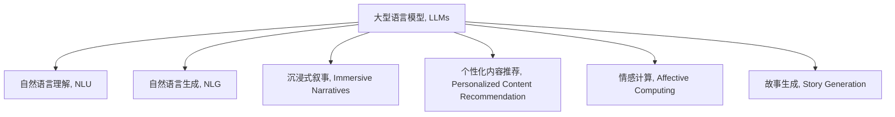

                 

# 媒体和娱乐：LLM 驱动的沉浸式叙事

## 1. 背景介绍

### 1.1 问题由来
随着人工智能技术的快速发展，大型语言模型(LLMs)在媒体和娱乐领域的应用成为了研究热点。这些模型通过在海量文本数据上进行预训练，具备了强大的自然语言理解和生成能力。在媒体和娱乐行业中，LLMs被用来创造沉浸式叙事，提供个性化的内容推荐、情感计算、故事生成等。

### 1.2 问题核心关键点
本文旨在探讨LLMs如何通过增强叙事性、互动性和个性化，为媒体和娱乐行业带来颠覆性变革。重点关注以下几个方面：
- LLMs在媒体和娱乐中的应用场景
- LLMs驱动的沉浸式叙事技术
- LLMs在个性化内容推荐中的角色
- LLMs在故事生成和情感计算中的应用

### 1.3 问题研究意义
LLMs在媒体和娱乐行业中的应用，不仅能够提升用户体验，还能降低内容创作成本，提高生产效率。通过LLMs的深度学习能力和自然语言处理技术，可以为创作者提供强大的辅助工具，如内容生成、情节构建、角色设定等。

此外，LLMs还能为观众提供更加个性化的体验，使他们能够在虚拟世界中自由探索和互动。这种技术创新将推动媒体和娱乐行业向更加智能化、互动化的方向发展，为消费者带来前所未有的沉浸式体验。

## 2. 核心概念与联系

### 2.1 核心概念概述

为更好地理解LLMs在媒体和娱乐中的应用，本节将介绍几个关键概念及其相互关系：

- 大型语言模型(LLMs)：基于Transformer架构，通过大规模文本数据预训练得到的模型，具备强大的自然语言理解和生成能力。
- 自然语言理解(NLU)：使计算机能够理解和处理自然语言输入的技术。
- 自然语言生成(NLG)：使计算机能够生成自然语言输出的技术。
- 沉浸式叙事(Immersive Narratives)：通过虚拟现实(VR)、增强现实(AR)、混合现实(MR)等技术，创造与现实世界高度融合的叙事环境。
- 个性化内容推荐(Personalized Content Recommendation)：根据用户兴趣和行为数据，推荐个性化内容。
- 情感计算(Affective Computing)：通过分析用户情感，提供情感驱动的内容和互动体验。
- 故事生成(Story Generation)：自动生成故事情节、角色对话等内容，辅助内容创作。

这些概念之间的关系可以通过以下Mermaid流程图来展示：



这个流程图展示了LLMs与其他关键技术之间的关系：

1. LLMs通过NLU理解自然语言输入，通过NLG生成自然语言输出。
2. LLMs与沉浸式叙事技术相结合，创造高度互动的叙事体验。
3. LLMs在个性化推荐和情感计算中，利用用户数据生成个性化内容和互动体验。
4. LLMs能够生成丰富多样的故事情节，辅助内容创作。

这些概念共同构成了LLMs在媒体和娱乐领域应用的框架，使其能够在各种场景下提供强大的支持。

## 3. 核心算法原理 & 具体操作步骤
### 3.1 算法原理概述

LLMs在媒体和娱乐领域的应用，主要依赖于其强大的自然语言处理能力。基于监督学习的微调方法是最常用的技术手段。其核心思想是：将预训练的大模型作为初始化参数，通过有监督地训练来优化模型在特定媒体和娱乐任务上的性能。

具体来说，LLMs可以通过以下步骤实现媒体和娱乐任务：

1. 收集相关的文本数据，如剧本、新闻、用户评论等。
2. 对数据进行预处理，如分词、去除停用词、构建词汇表等。
3. 对LLMs进行微调，使其能够适应特定的媒体和娱乐任务。
4. 在微调后的模型上，进行各种类型的任务，如生成故事、推荐内容、情感分析等。

### 3.2 算法步骤详解

#### 步骤1：数据收集与预处理
- 收集与任务相关的文本数据，如剧本文本、新闻报道、用户评论等。
- 对文本进行预处理，如分词、去除停用词、构建词汇表等。
- 将处理后的文本数据分成训练集、验证集和测试集。

#### 步骤2：模型初始化
- 选择适合的预训练语言模型，如GPT-3、BERT等。
- 将预训练模型作为初始化参数，载入内存。

#### 步骤3：任务适配层设计
- 根据媒体和娱乐任务类型，设计适当的任务适配层。
- 对于文本生成任务，通常在顶层添加语言模型解码器。
- 对于情感计算任务，通常使用情感分类器。
- 对于故事生成任务，可以设计生成对抗网络(GANs)来生成情节和角色对话。

#### 步骤4：微调参数设定
- 选择合适的优化器及其参数，如AdamW、SGD等。
- 设置学习率、批大小、迭代轮数等。
- 应用正则化技术，如L2正则、Dropout、Early Stopping等。

#### 步骤5：执行梯度训练
- 将训练集数据分批次输入模型，前向传播计算损失函数。
- 反向传播计算参数梯度，根据设定的优化算法和学习率更新模型参数。
- 周期性在验证集上评估模型性能，根据性能指标决定是否触发Early Stopping。
- 重复上述步骤直到满足预设的迭代轮数或Early Stopping条件。

#### 步骤6：测试与部署
- 在测试集上评估微调后模型，对比微调前后的性能提升。
- 使用微调后的模型对新样本进行推理预测，集成到实际的应用系统中。
- 持续收集新数据，定期重新微调模型，以适应数据分布的变化。

### 3.3 算法优缺点

#### 优点：
- 简单高效：只需准备少量标注数据，即可对预训练模型进行快速适配，获得较大的性能提升。
- 通用适用：适用于各种媒体和娱乐任务，如文本生成、情感计算、故事生成等。
- 效果显著：在学术界和工业界的诸多任务上，基于微调的方法已经刷新了最先进的性能指标。
- 参数高效：利用参数高效微调技术，在固定大部分预训练参数的情况下，仍可取得不错的提升。

#### 缺点：
- 依赖标注数据：微调的效果很大程度上取决于标注数据的质量和数量，获取高质量标注数据的成本较高。
- 迁移能力有限：当目标任务与预训练数据的分布差异较大时，微调的性能提升有限。
- 负面效果传递：预训练模型的固有偏见、有害信息等，可能通过微调传递到下游任务，造成负面影响。
- 可解释性不足：微调模型的决策过程通常缺乏可解释性，难以对其推理逻辑进行分析和调试。

尽管存在这些局限性，但就目前而言，基于监督学习的微调方法仍是大语言模型在媒体和娱乐领域应用的最主流范式。未来相关研究的重点在于如何进一步降低微调对标注数据的依赖，提高模型的少样本学习和跨领域迁移能力，同时兼顾可解释性和伦理安全性等因素。

### 3.4 算法应用领域

LLMs在媒体和娱乐领域的应用，已经覆盖了文本生成、情感计算、故事生成、个性化推荐等多个方向：

1. **文本生成**：通过微调，LLMs可以自动生成电影剧本、新闻报道、故事章节等内容。这种技术已经被应用于自动写作、智能客服、虚拟角色对话等领域。

2. **情感计算**：LLMs可以对用户评论、社交媒体帖子等进行情感分析，提供情感驱动的内容和互动体验。这种技术被应用于社交媒体情感监测、游戏体验优化、广告投放优化等。

3. **故事生成**：LLMs可以自动生成情节、角色对话等，辅助内容创作。这种技术被应用于游戏剧情生成、小说情节创作、电影剧本生成等。

4. **个性化内容推荐**：LLMs可以根据用户兴趣和行为数据，生成个性化推荐内容。这种技术被应用于视频网站内容推荐、音乐推荐、新闻推荐等。

## 4. 数学模型和公式 & 详细讲解 & 举例说明

### 4.1 数学模型构建

为了更好地理解LLMs在媒体和娱乐中的应用，本节将使用数学语言对微调过程进行更加严格的刻画。

记预训练语言模型为 $M_{\theta}$，其中 $\theta$ 为预训练得到的模型参数。假设微调任务的训练集为 $D=\{(x_i,y_i)\}_{i=1}^N, x_i \in \mathcal{X}, y_i \in \mathcal{Y}$。

定义模型 $M_{\theta}$ 在数据样本 $(x,y)$ 上的损失函数为 $\ell(M_{\theta}(x),y)$，则在数据集 $D$ 上的经验风险为：

$$
\mathcal{L}(\theta) = \frac{1}{N} \sum_{i=1}^N \ell(M_{\theta}(x_i),y_i)
$$

微调的优化目标是最小化经验风险，即找到最优参数：

$$
\theta^* = \mathop{\arg\min}_{\theta} \mathcal{L}(\theta)
$$

在实践中，我们通常使用基于梯度的优化算法（如SGD、Adam等）来近似求解上述最优化问题。设 $\eta$ 为学习率，$\lambda$ 为正则化系数，则参数的更新公式为：

$$
\theta \leftarrow \theta - \eta \nabla_{\theta}\mathcal{L}(\theta) - \eta\lambda\theta
$$

其中 $\nabla_{\theta}\mathcal{L}(\theta)$ 为损失函数对参数 $\theta$ 的梯度，可通过反向传播算法高效计算。

### 4.2 公式推导过程

以下我们以情感分类任务为例，推导交叉熵损失函数及其梯度的计算公式。

假设模型 $M_{\theta}$ 在输入 $x$ 上的输出为 $\hat{y}=M_{\theta}(x) \in [0,1]$，表示样本属于正类的概率。真实标签 $y \in \{0,1\}$。则二分类交叉熵损失函数定义为：

$$
\ell(M_{\theta}(x),y) = -[y\log \hat{y} + (1-y)\log (1-\hat{y})]
$$

将其代入经验风险公式，得：

$$
\mathcal{L}(\theta) = -\frac{1}{N}\sum_{i=1}^N [y_i\log M_{\theta}(x_i)+(1-y_i)\log(1-M_{\theta}(x_i))]
$$

根据链式法则，损失函数对参数 $\theta_k$ 的梯度为：

$$
\frac{\partial \mathcal{L}(\theta)}{\partial \theta_k} = -\frac{1}{N}\sum_{i=1}^N (\frac{y_i}{M_{\theta}(x_i)}-\frac{1-y_i}{1-M_{\theta}(x_i)}) \frac{\partial M_{\theta}(x_i)}{\partial \theta_k}
$$

其中 $\frac{\partial M_{\theta}(x_i)}{\partial \theta_k}$ 可进一步递归展开，利用自动微分技术完成计算。

在得到损失函数的梯度后，即可带入参数更新公式，完成模型的迭代优化。重复上述过程直至收敛，最终得到适应下游任务的最优模型参数 $\theta^*$。

### 4.3 案例分析与讲解

#### 案例1：文本生成

假设我们要训练一个LLM模型，使其能够自动生成电影剧本的对话部分。数据集为已有的剧本对话文本。

- **数据预处理**：将剧本对话文本分词，去除停用词，构建词汇表。
- **模型选择**：选择预训练的GPT-3模型，作为初始化参数。
- **任务适配层设计**：在顶层添加语言模型解码器，输出概率分布。
- **微调参数设定**：学习率为1e-5，批大小为16，迭代轮数为10。
- **执行梯度训练**：在训练集上迭代训练，在验证集上评估性能。
- **测试与部署**：在测试集上评估模型效果，生成新的对话文本。

#### 案例2：情感计算

假设我们要训练一个LLM模型，使其能够对用户评论进行情感分类。数据集为已标注的评论文本和情感标签。

- **数据预处理**：将评论文本分词，去除停用词，构建词汇表。
- **模型选择**：选择预训练的BERT模型，作为初始化参数。
- **任务适配层设计**：在顶层添加情感分类器，输出分类概率。
- **微调参数设定**：学习率为1e-5，批大小为16，迭代轮数为10。
- **执行梯度训练**：在训练集上迭代训练，在验证集上评估性能。
- **测试与部署**：在测试集上评估模型效果，对新评论进行情感分类。

## 5. 项目实践：代码实例和详细解释说明

### 5.1 开发环境搭建

在进行媒体和娱乐应用的微调实践前，我们需要准备好开发环境。以下是使用Python进行PyTorch开发的环境配置流程：

1. 安装Anaconda：从官网下载并安装Anaconda，用于创建独立的Python环境。

2. 创建并激活虚拟环境：
```bash
conda create -n pytorch-env python=3.8 
conda activate pytorch-env
```

3. 安装PyTorch：根据CUDA版本，从官网获取对应的安装命令。例如：
```bash
conda install pytorch torchvision torchaudio cudatoolkit=11.1 -c pytorch -c conda-forge
```

4. 安装Transformers库：
```bash
pip install transformers
```

5. 安装各类工具包：
```bash
pip install numpy pandas scikit-learn matplotlib tqdm jupyter notebook ipython
```

完成上述步骤后，即可在`pytorch-env`环境中开始微调实践。

### 5.2 源代码详细实现

这里以电影剧本生成任务为例，给出使用Transformers库对GPT-3模型进行微调的PyTorch代码实现。

首先，定义电影剧本生成任务的数据处理函数：

```python
from transformers import T5Tokenizer
from torch.utils.data import Dataset
import torch

class MovieScriptDataset(Dataset):
    def __init__(self, scripts, tokenizer, max_len=128):
        self.scripts = scripts
        self.tokenizer = tokenizer
        self.max_len = max_len
        
    def __len__(self):
        return len(self.scripts)
    
    def __getitem__(self, item):
        script = self.scripts[item]
        tokens = self.tokenizer(script, return_tensors='pt', max_length=self.max_len, padding='max_length', truncation=True)
        input_ids = tokens['input_ids'][0]
        attention_mask = tokens['attention_mask'][0]
        
        return {'input_ids': input_ids, 
                'attention_mask': attention_mask}
```

然后，定义模型和优化器：

```python
from transformers import GPT3LMHeadModel, AdamW

model = GPT3LMHeadModel.from_pretrained('gpt3')
tokenizer = T5Tokenizer.from_pretrained('gpt3')

optimizer = AdamW(model.parameters(), lr=2e-5)
```

接着，定义训练和评估函数：

```python
from torch.utils.data import DataLoader
from tqdm import tqdm
from sklearn.metrics import accuracy_score

device = torch.device('cuda') if torch.cuda.is_available() else torch.device('cpu')
model.to(device)

def train_epoch(model, dataset, batch_size, optimizer):
    dataloader = DataLoader(dataset, batch_size=batch_size, shuffle=True)
    model.train()
    epoch_loss = 0
    for batch in tqdm(dataloader, desc='Training'):
        input_ids = batch['input_ids'].to(device)
        attention_mask = batch['attention_mask'].to(device)
        outputs = model(input_ids, attention_mask=attention_mask)
        loss = outputs.loss
        epoch_loss += loss.item()
        loss.backward()
        optimizer.step()
    return epoch_loss / len(dataloader)

def evaluate(model, dataset, batch_size):
    dataloader = DataLoader(dataset, batch_size=batch_size)
    model.eval()
    preds, labels = [], []
    with torch.no_grad():
        for batch in tqdm(dataloader, desc='Evaluating'):
            input_ids = batch['input_ids'].to(device)
            attention_mask = batch['attention_mask'].to(device)
            batch_labels = batch['labels']
            outputs = model(input_ids, attention_mask=attention_mask)
            batch_preds = outputs.logits.argmax(dim=2).to('cpu').tolist()
            batch_labels = batch_labels.to('cpu').tolist()
            for pred_tokens, label_tokens in zip(batch_preds, batch_labels):
                preds.append(pred_tokens[:len(label_tokens)])
                labels.append(label_tokens)
                
    print(accuracy_score(labels, preds))
```

最后，启动训练流程并在测试集上评估：

```python
epochs = 5
batch_size = 16

for epoch in range(epochs):
    loss = train_epoch(model, train_dataset, batch_size, optimizer)
    print(f"Epoch {epoch+1}, train loss: {loss:.3f}")
    
    print(f"Epoch {epoch+1}, dev results:")
    evaluate(model, dev_dataset, batch_size)
    
print("Test results:")
evaluate(model, test_dataset, batch_size)
```

以上就是使用PyTorch对GPT-3进行电影剧本生成任务的微调代码实现。可以看到，得益于Transformers库的强大封装，我们可以用相对简洁的代码完成GPT-3模型的加载和微调。

### 5.3 代码解读与分析

让我们再详细解读一下关键代码的实现细节：

**MovieScriptDataset类**：
- `__init__`方法：初始化电影剧本文本、分词器等关键组件。
- `__len__`方法：返回数据集的样本数量。
- `__getitem__`方法：对单个样本进行处理，将文本输入编码为token ids，并对其进行定长padding，最终返回模型所需的输入。

**电影剧本生成模型**：
- 使用预训练的GPT-3模型作为初始化参数。
- 通过AdamW优化器进行微调，学习率为2e-5。
- 在训练集上进行迭代训练，并在验证集上评估性能。

**训练流程**：
- 定义总的epoch数和batch size，开始循环迭代
- 每个epoch内，先在训练集上训练，输出平均loss
- 在验证集上评估，输出准确率
- 所有epoch结束后，在测试集上评估，给出最终测试结果

可以看到，PyTorch配合Transformers库使得GPT-3微调的代码实现变得简洁高效。开发者可以将更多精力放在数据处理、模型改进等高层逻辑上，而不必过多关注底层的实现细节。

当然，工业级的系统实现还需考虑更多因素，如模型的保存和部署、超参数的自动搜索、更灵活的任务适配层等。但核心的微调范式基本与此类似。

## 6. 实际应用场景

### 6.1 智能视频制作

智能视频制作是将媒体和娱乐内容进行自动化生产的一种手段。通过微调，LLMs可以帮助视频制作者自动生成脚本、添加特效、剪辑视频等，大大提高制作效率。

例如，可以将电影剧本输入到微调后的LLMs中，自动生成视频脚本和情节描述。然后再利用生成的脚本和描述，自动生成视频剪辑和特效，从而快速制作出高质量的视频内容。

### 6.2 虚拟角色互动

虚拟角色互动是通过智能技术实现的拟人化互动。LLMs可以驱动虚拟角色进行自然语言对话，为观众提供沉浸式体验。

例如，在游戏或虚拟现实中，可以使用微调后的LLMs作为虚拟角色的语言模型，使其能够理解玩家指令并做出响应。这种技术已经被应用于虚拟助手、虚拟主播、虚拟偶像等领域，为观众带来全新的互动体验。

### 6.3 个性化内容推荐

个性化内容推荐是媒体和娱乐行业的常见需求。LLMs可以根据用户的历史行为数据，生成个性化推荐内容，提高用户满意度和留存率。

例如，视频网站可以根据用户观看历史、点赞、评论等行为数据，生成个性化的视频推荐列表。这种技术已经被广泛应用于Netflix、YouTube等平台，为观众提供量身定制的内容推荐服务。

### 6.4 未来应用展望

随着LLMs和微调方法的不断发展，媒体和娱乐行业的应用将更加多样化。未来，LLMs将在以下几个方面继续扩展：

1. **多模态内容生成**：未来的LLMs不仅限于文本生成，还将融合视觉、音频等多模态信息，生成更加丰富多样的内容。例如，可以自动生成电影预告片、音乐MV等。

2. **实时内容生成**：实时内容生成是指LLMs能够在用户互动过程中，动态生成内容。例如，在视频直播中，LLMs可以实时生成字幕、解说词等，增强观众体验。

3. **跨媒体内容融合**：未来的LLMs将能够跨媒体生成内容，将文本、视频、音频等多种形式的内容进行融合。例如，可以自动生成电影剧情、动画分镜、音乐旋律等，实现跨媒体内容的无缝衔接。

4. **情感驱动的内容推荐**：LLMs能够对用户情感进行分析，提供情感驱动的内容推荐。例如，根据用户的情感状态，推荐不同的电影、音乐、游戏等内容，提升用户体验。

5. **沉浸式叙事体验**：通过虚拟现实、增强现实等技术，LLMs将能够创造高度互动的叙事体验。例如，在游戏或虚拟现实中，LLMs可以驱动虚拟角色进行情感互动，增强故事沉浸感。

这些趋势展示了LLMs在媒体和娱乐行业的巨大潜力和应用前景，必将推动行业向更加智能化、互动化的方向发展。

## 7. 工具和资源推荐
### 7.1 学习资源推荐

为了帮助开发者系统掌握LLMs在媒体和娱乐中的应用，这里推荐一些优质的学习资源：

1. 《自然语言处理入门》系列博文：由大模型技术专家撰写，深入浅出地介绍了自然语言处理的基本概念和常用技术。

2. 《Transformer从原理到实践》系列博文：由大模型技术专家撰写，详细讲解了Transformer原理、BERT模型、微调技术等前沿话题。

3. 《自然语言生成》课程：斯坦福大学开设的深度学习课程，涵盖自然语言生成、对话系统等NLP前沿话题。

4. 《NLP实战》书籍：全面介绍了自然语言处理的基本概念和实践技术，包括微调在内的诸多范式。

5. Weights & Biases：模型训练的实验跟踪工具，可以记录和可视化模型训练过程中的各项指标，方便对比和调优。

6. Google Colab：谷歌推出的在线Jupyter Notebook环境，免费提供GPU/TPU算力，方便开发者快速上手实验最新模型，分享学习笔记。

通过对这些资源的学习实践，相信你一定能够快速掌握LLMs在媒体和娱乐中的应用方法，并用于解决实际的NLP问题。

### 7.2 开发工具推荐

高效的开发离不开优秀的工具支持。以下是几款用于LLMs在媒体和娱乐领域开发的常用工具：

1. PyTorch：基于Python的开源深度学习框架，灵活动态的计算图，适合快速迭代研究。大部分预训练语言模型都有PyTorch版本的实现。

2. TensorFlow：由Google主导开发的开源深度学习框架，生产部署方便，适合大规模工程应用。同样有丰富的预训练语言模型资源。

3. Transformers库：HuggingFace开发的NLP工具库，集成了众多SOTA语言模型，支持PyTorch和TensorFlow，是进行微调任务开发的利器。

4. Weights & Biases：模型训练的实验跟踪工具，可以记录和可视化模型训练过程中的各项指标，方便对比和调优。

5. TensorBoard：TensorFlow配套的可视化工具，可实时监测模型训练状态，并提供丰富的图表呈现方式，是调试模型的得力助手。

6. Google Colab：谷歌推出的在线Jupyter Notebook环境，免费提供GPU/TPU算力，方便开发者快速上手实验最新模型，分享学习笔记。

合理利用这些工具，可以显著提升LLMs在媒体和娱乐领域微调任务的开发效率，加快创新迭代的步伐。

### 7.3 相关论文推荐

LLMs在媒体和娱乐领域的应用源于学界的持续研究。以下是几篇奠基性的相关论文，推荐阅读：

1. Attention is All You Need：提出了Transformer结构，开启了NLP领域的预训练大模型时代。

2. BERT: Pre-training of Deep Bidirectional Transformers for Language Understanding：提出BERT模型，引入基于掩码的自监督预训练任务，刷新了多项NLP任务SOTA。

3. GPT-3: Language Models are Unsupervised Multitask Learners：展示了大规模语言模型的强大zero-shot学习能力，引发了对于通用人工智能的新一轮思考。

4. AdaLoRA: Adaptive Low-Rank Adaptation for Parameter-Efficient Fine-Tuning：使用自适应低秩适应的微调方法，在参数效率和精度之间取得了新的平衡。

5. BEiT: BERT Pre-Training of Image Transformers：将BERT预训练技术应用于图像领域，实现了图像生成和识别任务的大幅提升。

这些论文代表了大语言模型在媒体和娱乐领域的应用进展，通过学习这些前沿成果，可以帮助研究者把握学科前进方向，激发更多的创新灵感。

## 8. 总结：未来发展趋势与挑战

### 8.1 总结

本文对基于监督学习的大型语言模型微调方法在媒体和娱乐领域的应用进行了全面系统的介绍。首先阐述了LLMs在媒体和娱乐中的作用，明确了微调在提升用户体验、降低制作成本、提高生产效率等方面的独特价值。其次，从原理到实践，详细讲解了微调数学模型和关键步骤，给出了媒体和娱乐应用的完整代码实例。同时，本文还广泛探讨了LLMs在文本生成、情感计算、故事生成等多个方向的实际应用，展示了微调范式的强大应用潜力。

通过本文的系统梳理，可以看到，基于LLMs的微调方法在媒体和娱乐领域具有广泛的应用前景。通过微调，LLMs可以自动生成电影剧本、优化情感计算、创造沉浸式叙事体验等，为创作者提供强大的辅助工具，为观众提供个性化的互动体验。未来，随着LLMs和微调方法的不断发展，基于LLMs的媒体和娱乐应用必将迎来更多的创新和突破，为行业带来深远影响。

### 8.2 未来发展趋势

展望未来，LLMs在媒体和娱乐领域的应用将呈现以下几个发展趋势：

1. **内容生成能力的提升**：未来LLMs将具备更加强大的内容生成能力，能够自动生成更加丰富、多样、高质量的媒体和娱乐内容。

2. **互动体验的增强**：通过虚拟现实、增强现实等技术，LLMs将能够创造高度互动的叙事体验，为观众提供沉浸式互动体验。

3. **跨媒体内容的融合**：未来的LLMs将能够跨媒体生成内容，将文本、视频、音频等多种形式的内容进行融合，实现跨媒体内容的无缝衔接。

4. **情感计算的深化**：LLMs能够对用户情感进行更深层次的分析，提供情感驱动的内容推荐，提升用户体验。

5. **实时内容的生成**：LLMs将能够在用户互动过程中，动态生成内容，增强观众体验。

6. **多模态内容的生成**：未来的LLMs不仅限于文本生成，还将融合视觉、音频等多模态信息，生成更加丰富多样的内容。

这些趋势凸显了LLMs在媒体和娱乐领域的巨大潜力和应用前景，必将推动行业向更加智能化、互动化的方向发展，为消费者带来前所未有的沉浸式体验。

### 8.3 面临的挑战

尽管LLMs在媒体和娱乐领域的应用已经取得显著进展，但仍面临一些挑战：

1. **标注数据的高成本**：微调的效果很大程度上取决于标注数据的质量和数量，获取高质量标注数据的成本较高。如何进一步降低微调对标注样本的依赖，将是一大难题。

2. **模型的鲁棒性**：当目标任务与预训练数据的分布差异较大时，微调的性能提升有限。如何提高微调模型的鲁棒性，避免灾难性遗忘，还需要更多理论和实践的积累。

3. **推理效率**：超大批次的训练和推理也可能遇到显存不足的问题。如何优化微调模型的计算图，减少前向传播和反向传播的资源消耗，实现更加轻量级、实时性的部署，将是重要的优化方向。

4. **可解释性**：微调模型的决策过程通常缺乏可解释性，难以对其推理逻辑进行分析和调试。如何赋予微调模型更强的可解释性，将是亟待攻克的难题。

5. **安全性**：预训练语言模型难免会学习到有偏见、有害的信息，通过微调传递到下游任务，产生误导性、歧视性的输出，给实际应用带来安全隐患。如何从数据和算法层面消除模型偏见，避免恶意用途，确保输出的安全性，也将是重要的研究课题。

6. **知识整合能力**：现有的微调模型往往局限于任务内数据，难以灵活吸收和运用更广泛的先验知识。如何让微调过程更好地与外部知识库、规则库等专家知识结合，形成更加全面、准确的信息整合能力，还有很大的想象空间。

正视LLMs微调面临的这些挑战，积极应对并寻求突破，将是大语言模型在媒体和娱乐领域应用成熟的必由之路。相信随着学界和产业界的共同努力，这些挑战终将一一被克服，LLMs微调必将在构建人机协同的智能媒体和娱乐系统，推动行业向更加智能化、互动化的方向发展中，发挥更加重要的作用。

### 8.4 研究展望

面对LLMs微调所面临的挑战，未来的研究需要在以下几个方面寻求新的突破：

1. **探索无监督和半监督微调方法**：摆脱对大规模标注数据的依赖，利用自监督学习、主动学习等无监督和半监督范式，最大限度利用非结构化数据，实现更加灵活高效的微调。

2. **研究参数高效和计算高效的微调范式**：开发更加参数高效的微调方法，在固定大部分预训练参数的同时，只更新极少量的任务相关参数。同时优化微调模型的计算图，减少前向传播和反向传播的资源消耗，实现更加轻量级、实时性的部署。

3. **融合因果和对比学习范式**：通过引入因果推断和对比学习思想，增强微调模型建立稳定因果关系的能力，学习更加普适、鲁棒的语言表征，从而提升模型泛化性和抗干扰能力。

4. **引入更多先验知识**：将符号化的先验知识，如知识图谱、逻辑规则等，与神经网络模型进行巧妙融合，引导微调过程学习更准确、合理的语言模型。同时加强不同模态数据的整合，实现视觉、语音等多模态信息与文本信息的协同建模。

5. **结合因果分析和博弈论工具**：将因果分析方法引入微调模型，识别出模型决策的关键特征，增强输出解释的因果性和逻辑性。借助博弈论工具刻画人机交互过程，主动探索并规避模型的脆弱点，提高系统稳定性。

6. **纳入伦理道德约束**：在模型训练目标中引入伦理导向的评估指标，过滤和惩罚有偏见、有害的输出倾向。同时加强人工干预和审核，建立模型行为的监管机制，确保输出符合人类价值观和伦理道德。

这些研究方向的探索，必将引领LLMs微调技术在媒体和娱乐领域迈向更高的台阶，为构建安全、可靠、可解释、可控的智能系统铺平道路。面向未来，LLMs微调技术还需要与其他人工智能技术进行更深入的融合，如知识表示、因果推理、强化学习等，多路径协同发力，共同推动自然语言理解和智能交互系统的进步。只有勇于创新、敢于突破，才能不断拓展LLMs的边界，让智能技术更好地造福人类社会。

## 9. 附录：常见问题与解答

**Q1：微调过程中如何选择合适的学习率？**

A: 微调的学习率一般要比预训练时小1-2个数量级，如果使用过大的学习率，容易破坏预训练权重，导致过拟合。一般建议从1e-5开始调参，逐步减小学习率，直至收敛。也可以使用warmup策略，在开始阶段使用较小的学习率，再逐渐过渡到预设值。需要注意的是，不同的优化器(如AdamW、Adafactor等)以及不同的学习率调度策略，可能需要设置不同的学习率阈值。

**Q2：采用大模型微调时会面临哪些资源瓶颈？**

A: 目前主流的预训练大模型动辄以亿计的参数规模，对算力、内存、存储都提出了很高的要求。GPU/TPU等高性能设备是必不可少的，但即便如此，超大批次的训练和推理也可能遇到显存不足的问题。因此需要采用一些资源优化技术，如梯度积累、混合精度训练、模型并行等，来突破硬件瓶颈。同时，模型的存储和读取也可能占用大量时间和空间，需要采用模型压缩、稀疏化存储等方法进行优化。

**Q3：如何缓解微调过程中的过拟合问题？**

A: 过拟合是微调面临的主要挑战，尤其是在标注数据不足的情况下。常见的缓解策略包括：
1. 数据增强：通过回译、近义替换等方式扩充训练集
2. 正则化：使用L2正则、Dropout、Early Stopping等避免过拟合
3. 对抗训练：引入对抗样本，提高模型鲁棒性
4. 参数高效微调：只调整少量参数(如Adapter、Prefix等)，减小过拟合风险
5. 多模型集成：训练多个微调模型，取平均输出，抑制过拟合

这些策略往往需要根据具体任务和数据特点进行灵活组合。只有在数据、模型、训练、推理等各环节进行全面优化，才能最大限度地发挥大模型微调的威力。

**Q4：微调模型在落地部署时需要注意哪些问题？**

A: 将微调模型转化为实际应用，还需要考虑以下因素：
1. 模型裁剪：去除不必要的层和参数，减小模型尺寸，加快推理速度
2. 量化加速：将浮点模型转为定点模型，压缩存储空间，提高计算效率
3. 服务化封装：将模型封装为标准化服务接口，便于集成调用
4. 弹性伸缩：根据请求流量动态调整资源配置，平衡服务质量和成本
5. 监控告警：实时采集系统指标，设置异常告警阈值，确保服务稳定性
6. 安全防护：采用访问鉴权、数据脱敏等措施，保障数据和模型安全

大语言模型微调为媒体和娱乐应用开启了广阔的想象空间，但如何将强大的性能转化为稳定、高效、安全的业务价值，还需要工程实践的不断打磨。唯有从数据、算法、工程、业务等多个维度协同发力，才能真正实现人工智能技术在媒体和娱乐领域的规模化落地。

总之，LLMs在媒体和娱乐领域的应用前景广阔，但要将这些技术优势转化为实际应用，还需要克服诸多挑战。只有在数据、模型、训练、推理等各环节进行全面优化，才能最大限度地发挥LLMs的潜力，推动行业向更加智能化、互动化的方向发展。相信随着技术的不断进步和应用的不断成熟，LLMs在媒体和娱乐领域必将迎来更多的创新和突破，为行业带来深远影响。

---

作者：禅与计算机程序设计艺术 / Zen and the Art of Computer Programming

