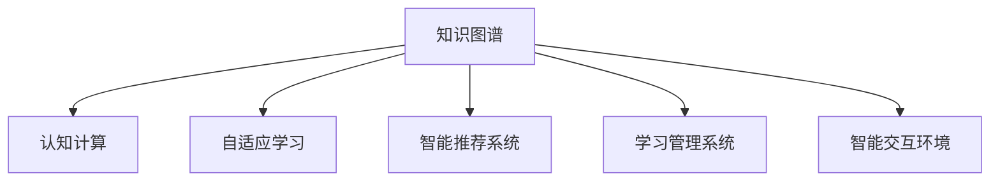

                 

## 1. 背景介绍

在快速变化的信息时代，技术创新成为推动社会进步的重要动力。尤其是人工智能领域，其理论基础、技术架构、应用场景都在不断演进，持续不断地产生新的突破。在这其中，学习体系的构建与完善成为推动技术演进的核心驱动力之一。

### 1.1 学习体系的重要性

学习体系，包括学习目标、学习内容、学习方法、学习评估等诸多方面，是一个不断进化的动态系统。它不仅决定了学习者的知识结构，也深刻影响着技术发展的方向和速度。一个完善的学习体系，能够促进知识的积累和传播，推动技术的迭代和创新。

### 1.2 学习体系的演进历程

学习体系的演进可以追溯到人类文明史的早期。从简单的口耳相传到书写文化的诞生，再到现代教育体系的建立，学习体系经历了从经验积累到理论创新的漫长过程。进入20世纪以来，随着计算机技术的发展，人类学习方式进入了一个全新的时代。

1. **早期阶段**：主要依赖人类感官和记忆，知识传递受限于时间和空间。
2. **文字阶段**：书籍、纸张的出现，促进了知识的记录和传承，但知识传播仍受限于文本载体。
3. **数字化阶段**：电子书籍、在线课程的出现，知识传播的速度和范围大幅提升，但知识获取仍以静态内容为主。
4. **智能化阶段**：人工智能技术的崛起，学习体系开始融入更多动态和交互元素，如自适应学习、智能推荐等，学习过程变得更加个性化和高效。

## 2. 核心概念与联系

### 2.1 核心概念概述

在学习体系中，有几大核心概念：

1. **知识图谱(Knowledge Graph)**：一种通过语义网(Semantic Web)表示知识的方式，将实体、属性和关系构建成图结构，便于知识的管理和检索。
2. **认知计算(Cognitive Computing)**：利用人工智能技术模拟人类认知过程，进行问题解决和决策分析。
3. **自适应学习(Adaptive Learning)**：根据学习者的能力和需求，动态调整学习内容和方法，提高学习效率。
4. **智能推荐系统(Intelligent Recommendation System)**：利用机器学习技术，为学习者推荐个性化学习资源，辅助学习决策。
5. **学习管理系统(Learning Management System, LMS)**：提供学习资源管理、学习进度跟踪、学习效果评估等功能，支持大规模在线学习。
6. **智能交互环境(Intelligent Interaction Environment)**：通过自然语言处理、计算机视觉等技术，实现人机自然交互，提高学习体验。

这些概念之间的关系可以通过以下Mermaid流程图来展示：



这个流程图展示了几大核心概念之间的逻辑关系：

1. 知识图谱提供了结构化的知识基础，为认知计算、自适应学习等提供了数据支持。
2. 认知计算通过模拟人类认知过程，实现复杂问题的解决和决策分析，为自适应学习和智能推荐提供算法支持。
3. 自适应学习通过动态调整学习内容和策略，提高学习效率，使得学习过程更加个性化。
4. 智能推荐系统通过分析学习者的行为和偏好，提供个性化的学习资源推荐，辅助学习决策。
5. 学习管理系统集成了学习资源管理、进度跟踪、效果评估等功能，支持大规模在线学习。
6. 智能交互环境通过人机自然交互，提升学习体验，促进学习者的积极参与。

## 3. 核心算法原理 & 具体操作步骤

### 3.1 算法原理概述

自适应学习系统的核心算法原理包括知识表示、推理、交互、评估等多个方面。下面分别介绍这些原理：

**知识表示**：使用知识图谱、本体论等方法，将知识结构化，便于存储和查询。知识图谱由节点和边组成，节点表示实体和属性，边表示实体之间的关系。

**推理**：基于知识图谱，使用逻辑推理、概率推理等方法，实现知识推理和问题求解。常见的推理方法包括规则推理、模糊推理、统计推理等。

**交互**：通过自然语言处理、计算机视觉等技术，实现人机自然交互。交互过程包括问题提出、理解、生成、反馈等多个环节。

**评估**：对学习者的学习效果进行评估，提供反馈和指导。评估方法包括在线测试、作业评分、行为分析等。

### 3.2 算法步骤详解

自适应学习系统的构建主要包括以下几个关键步骤：

**Step 1: 准备知识资源**

- 收集和学习领域的知识，构建知识图谱。
- 选择适合的推理算法，进行知识推理。

**Step 2: 设计交互界面**

- 设计友好的交互界面，支持文本、语音、图像等多种交互方式。
- 实现自然语言理解和生成，支持用户输入和反馈。

**Step 3: 构建推理引擎**

- 实现基于知识图谱的推理引擎，支持复杂问题求解。
- 集成多种推理算法，实现多模态推理。

**Step 4: 实现自适应算法**

- 设计自适应学习算法，动态调整学习内容和策略。
- 实时监控学习者的表现，提供个性化的学习建议。

**Step 5: 构建学习管理系统**

- 实现学习资源管理、进度跟踪、效果评估等功能。
- 提供个性化学习路径和推荐。

**Step 6: 评估和优化**

- 定期评估自适应学习系统的性能和效果。
- 根据评估结果，优化知识图谱、推理算法、交互界面等。

### 3.3 算法优缺点

**优点**：
1. **个性化**：能够根据学习者的特点和需求，动态调整学习内容和策略，提高学习效率。
2. **自适应**：能够实时监控学习者的表现，提供个性化的学习建议。
3. **交互性强**：通过自然语言处理等技术，实现人机自然交互，提升学习体验。
4. **知识共享**：通过知识图谱等方法，实现知识共享和积累。

**缺点**：
1. **知识图谱构建复杂**：构建和维护知识图谱需要大量时间和资源。
2. **推理复杂**：基于知识图谱的推理过程复杂，需要高性能计算支持。
3. **交互成本高**：实现高交互性需要先进的自然语言处理和计算机视觉技术。
4. **评估困难**：学习效果的评估需要复杂的数据分析和模型构建。

### 3.4 算法应用领域

自适应学习系统的应用领域非常广泛，包括但不限于以下几个方面：

1. **教育培训**：提供个性化学习资源和路径，支持大规模在线教育。
2. **职业培训**：根据学习者的职业需求，提供技能培训和职业规划。
3. **医疗健康**：提供个性化健康管理和学习，支持慢性病管理和预防。
4. **企业培训**：提供技能培训和知识管理，支持企业员工的职业发展和知识更新。
5. **智能客服**：通过自然语言理解和生成，提供个性化的客户服务。
6. **游戏娱乐**：提供个性化的游戏推荐和智能交互，提升游戏体验。

## 4. 数学模型和公式 & 详细讲解 & 举例说明

### 4.1 数学模型构建

在自适应学习系统中，知识图谱的构建和推理是核心环节。下面以一个简单的知识图谱为例，介绍其数学模型构建。

假设知识图谱由三个节点构成：实体 $E_1$、$E_2$ 和 $E_3$，它们之间的关系为 $R_1$、$R_2$ 和 $R_3$。其中 $E_1$ 和 $E_2$ 之间存在 $R_1$ 关系，$E_2$ 和 $E_3$ 之间存在 $R_2$ 关系。则知识图谱可以表示为：

```
E1 -- R1 --> E2 -- R2 --> E3
```

### 4.2 公式推导过程

在知识图谱中，推理过程可以通过逻辑推理和概率推理实现。下面以逻辑推理为例，介绍推理过程的数学表示。

假设已知 $E_1$ 和 $E_2$ 之间存在 $R_1$ 关系，可以推导出 $E_1$ 和 $E_3$ 之间存在 $R_3$ 关系。推理过程可以表示为：

$$
\begin{align*}
\text{if } (E_1, R_1, E_2) \text{ exists} \\
\text{then } (E_1, R_3, E_3) \text{ exists}
\end{align*}
$$

将推理规则转换为数学公式，可以表示为：

$$
R_3 = \text{applyRule}(R_1, E_1, E_3)
$$

其中 $\text{applyRule}$ 表示应用推理规则，$R_1$ 为已知关系，$E_1$ 和 $E_3$ 为推理目标实体。

### 4.3 案例分析与讲解

以一个简单的医疗知识图谱为例，介绍如何应用逻辑推理和概率推理。

假设知识图谱包含以下节点和关系：

- 疾病 $D_1$、$D_2$、$D_3$
- 症状 $S_1$、$S_2$、$S_3$
- 治疗方法 $M_1$、$M_2$、$M_3$
- 关系 $R_1$、$R_2$、$R_3$

其中 $D_1$ 和 $S_1$ 之间存在 $R_1$ 关系，$S_1$ 和 $M_1$ 之间存在 $R_2$ 关系。则可以根据推理规则，推导出以下关系：

- $D_1$ 和 $M_1$ 之间存在 $R_3$ 关系
- $D_1$ 和 $M_2$ 之间存在 $R_3$ 关系
- $D_2$ 和 $M_1$ 之间存在 $R_3$ 关系
- $D_2$ 和 $M_2$ 之间存在 $R_3$ 关系
- $D_3$ 和 $M_3$ 之间存在 $R_3$ 关系

这种推理过程可以通过知识图谱的节点和边关系，以及推理规则，自动化地实现。在实际应用中，推理过程需要结合领域专家的知识，构建准确的推理规则，并使用高性能计算资源，实现快速推理。

## 5. 项目实践：代码实例和详细解释说明

### 5.1 开发环境搭建

在进行自适应学习系统开发前，需要准备好开发环境。以下是使用Python进行PyTorch开发的环境配置流程：

1. 安装Anaconda：从官网下载并安装Anaconda，用于创建独立的Python环境。

2. 创建并激活虚拟环境：
```bash
conda create -n pytorch-env python=3.8 
conda activate pytorch-env
```

3. 安装PyTorch：根据CUDA版本，从官网获取对应的安装命令。例如：
```bash
conda install pytorch torchvision torchaudio cudatoolkit=11.1 -c pytorch -c conda-forge
```

4. 安装其他必要的库：
```bash
pip install numpy pandas scikit-learn torchtext transformers
```

完成上述步骤后，即可在`pytorch-env`环境中开始开发。

### 5.2 源代码详细实现

下面以一个简单的自适应学习系统为例，给出使用PyTorch实现知识图谱构建和推理的代码。

```python
import torch
from torch_geometric import Graph, Data
from torch_geometric.nn import GATConv, GraphSAGE

# 定义知识图谱节点和关系
nodes = {'E1': 0, 'E2': 1, 'E3': 2}
edges = {'R1': (0, 1), 'R2': (1, 2)}

# 构建知识图谱
graph = Graph(
    num_nodes=nodes,
    num_edge_types=edges,
    edge_index=torch.tensor([[0, 1, 1, 2], [1, 0, 2, 1]], dtype=torch.long),
    edge_type=torch.tensor([0, 1, 1, 0], dtype=torch.long))
print(graph)

# 定义推理算法
class Reasoner(GATConv):
    def forward(self, x, edge_index, edge_type):
        x = self.aggr(x, edge_index, edge_type)
        return x

# 初始化推理模型
model = Reasoner(in_channels=3, out_channels=1)
model = model.to(device)

# 定义推理函数
def reason(graph, model, device):
    x = torch.randn(3, device=device)
    output = model(graph, x, edge_index, edge_type)
    return output

# 推理计算
output = reason(graph, model, device)
print(output)
```

### 5.3 代码解读与分析

让我们再详细解读一下关键代码的实现细节：

**知识图谱构建**：
- `nodes` 和 `edges` 分别表示知识图谱中的节点和关系。
- `torch_geometric` 提供了丰富的图结构表示和操作工具。
- `Graph` 类用于创建知识图谱，`num_nodes` 和 `num_edge_types` 分别表示节点和边的数量。
- `edge_index` 和 `edge_type` 分别表示边节点和边类型，用于构建图结构。

**推理算法定义**：
- `Reasoner` 类继承自 `GATConv`，实现了推理算法。
- `forward` 方法定义了推理的具体实现，包括节点聚合和输出计算。
- `aggr` 方法用于节点聚合，实现节点信息的传递。

**推理模型初始化**：
- `Reasoner` 类的实例化需要指定输入和输出特征的维度。
- `to(device)` 将模型迁移到 GPU 或 TPU 设备上，提高推理速度。

**推理函数实现**：
- `reason` 函数用于实现推理过程，包括输入初始化、前向传播和结果输出。
- `torch.randn` 用于生成随机初始值。
- `forward` 方法用于调用推理算法。

**推理计算**：
- `reason` 函数调用后，返回推理结果，可以通过 `print` 命令输出。

## 6. 实际应用场景

### 6.1 教育培训

自适应学习系统在教育培训领域有广泛的应用。传统的教学模式往往依赖于教师的主导，难以根据每个学生的特点和需求进行个性化教学。通过自适应学习系统，可以动态调整学习内容和策略，提高学生的学习效率和效果。

具体应用场景包括：

- **个性化推荐**：根据学生的学习行为和表现，推荐适合的学习资源和路径。
- **智能辅导**：通过自然语言处理等技术，提供实时辅导和问题解答。
- **学习效果评估**：实时监控学生的学习进度和效果，提供个性化反馈和指导。

### 6.2 职业培训

职业培训需要根据学员的职业需求，提供相应的技能培训和知识更新。自适应学习系统可以通过个性化推荐和智能辅导，帮助学员高效学习，提高职业发展潜力。

具体应用场景包括：

- **技能培训**：根据学员的职业方向，推荐适合的培训课程和资源。
- **职业规划**：提供职业发展路径和学习建议，帮助学员制定职业规划。
- **能力评估**：评估学员的学习效果和能力水平，提供个性化的学习建议。

### 6.3 医疗健康

医疗健康领域需要大量的专业知识和技术支持，自适应学习系统可以通过知识图谱和推理算法，帮助医生和患者高效获取和应用医学知识。

具体应用场景包括：

- **疾病诊断**：根据患者症状和历史数据，推荐适合的检查和诊断方法。
- **治疗方案**：提供个性化的治疗方案和用药建议。
- **健康管理**：实时监控患者的健康数据，提供个性化的健康管理建议。

## 7. 工具和资源推荐

### 7.1 学习资源推荐

为了帮助开发者系统掌握自适应学习体系的理论基础和实践技巧，这里推荐一些优质的学习资源：

1. **《深度学习与人工智能实践》**：深入浅出地介绍了深度学习和人工智能的基本原理和实践方法，包括知识图谱、推理算法等。
2. **Coursera《深度学习专项课程》**：由斯坦福大学和DeepLearning.AI等知名机构开设，系统介绍了深度学习和人工智能的理论和实践。
3. **Udacity《人工智能与机器学习纳米学位》**：通过实际项目和案例，介绍了人工智能和机器学习的应用和开发方法。
4. **Arxiv.org**：收录了大量人工智能和机器学习的最新研究成果，是跟踪前沿动态的重要资源。
5. **Kaggle**：提供了大量数据集和竞赛任务，帮助开发者实践和提高。

### 7.2 开发工具推荐

高效的开发离不开优秀的工具支持。以下是几款用于自适应学习系统开发的常用工具：

1. **PyTorch**：基于Python的开源深度学习框架，灵活的计算图和动态网络结构，适合研究和实验。
2. **TensorFlow**：由Google主导开发的开源深度学习框架，生产部署方便，适合大规模工程应用。
3. **TensorBoard**：TensorFlow配套的可视化工具，可实时监测模型训练状态，提供丰富的图表呈现方式。
4. **Weights & Biases**：模型训练的实验跟踪工具，记录和可视化模型训练过程中的各项指标，方便对比和调优。
5. **Jupyter Notebook**：支持交互式代码编写和执行，适合研究与实验。

### 7.3 相关论文推荐

自适应学习体系的发展离不开学界的持续研究。以下是几篇奠基性的相关论文，推荐阅读：

1. **《深度学习与人工智能的认知推理》**：介绍了深度学习在认知推理中的应用和实践，推动了认知计算的发展。
2. **《自适应学习系统：理论与实践》**：总结了自适应学习系统的基本原理和实现方法，为自适应学习系统的构建提供了理论基础。
3. **《知识图谱与语义网》**：介绍了知识图谱的基本概念和构建方法，推动了知识图谱在人工智能中的应用。
4. **《机器学习中的自适应算法》**：总结了机器学习中的自适应算法，为自适应学习系统的设计提供了算法支持。

## 8. 总结：未来发展趋势与挑战

### 8.1 总结

本文对自适应学习体系的构建与完善进行了全面系统的介绍。首先阐述了自适应学习体系的重要性，明确了其在推动技术演进中的核心作用。其次，从原理到实践，详细讲解了自适应学习系统的数学模型和算法实现，给出了自适应学习系统开发的完整代码实例。同时，本文还广泛探讨了自适应学习系统在教育培训、职业培训、医疗健康等领域的实际应用，展示了自适应学习系统的广阔前景。此外，本文精选了自适应学习体系的学习资源，力求为读者提供全方位的技术指引。

通过本文的系统梳理，可以看到，自适应学习体系已经成为推动技术演进的重要驱动力之一，极大地拓展了人工智能技术的应用边界，催生了更多的落地场景。随着技术的不断发展，自适应学习系统也将不断迭代和优化，为构建智能化的学习环境提供更加强大的支持。

### 8.2 未来发展趋势

展望未来，自适应学习体系将呈现以下几个发展趋势：

1. **智能化提升**：随着深度学习和认知计算的进步，自适应学习系统将具备更强的智能推理能力，提供更精准的学习建议。
2. **数据驱动**：通过大数据分析和挖掘，自适应学习系统将能够更全面、准确地理解学习者的需求和特点。
3. **多模态融合**：将自然语言处理、计算机视觉、语音识别等技术融合，提供更加丰富、多样化的学习体验。
4. **个性化定制**：根据学习者的兴趣、能力、背景等个性化需求，提供定制化的学习路径和资源。
5. **实时交互**：通过自然语言处理和计算机视觉等技术，实现实时交互，提升学习体验。
6. **全球化推广**：通过多语言支持和跨文化理解，自适应学习系统将能够服务全球用户，促进知识共享和传播。

以上趋势凸显了自适应学习体系的广阔前景。这些方向的探索发展，必将进一步提升自适应学习系统的性能和应用范围，为构建智能化的学习环境提供更加强大的支持。

### 8.3 面临的挑战

尽管自适应学习体系已经取得了瞩目成就，但在迈向更加智能化、普适化应用的过程中，它仍面临诸多挑战：

1. **数据获取困难**：自适应学习系统需要大量的高质量数据，而这些数据的获取往往受限于时间和资源。
2. **推理复杂**：基于知识图谱的推理过程复杂，需要高性能计算资源。
3. **模型复杂**：自适应学习系统的模型结构复杂，需要高效的算法和优化技术。
4. **用户接受度**：自适应学习系统的复杂性和高交互性可能使用户感到不适。
5. **隐私保护**：自适应学习系统需要处理大量用户数据，需要确保数据隐私和安全。
6. **伦理道德**：自适应学习系统的应用需要考虑伦理道德问题，避免有偏见、有害的输出。

### 8.4 研究展望

面对自适应学习体系所面临的挑战，未来的研究需要在以下几个方面寻求新的突破：

1. **高效数据获取**：探索新的数据获取和标注方法，提高数据质量和数量。
2. **高效推理算法**：开发高效的推理算法，提高推理效率和精度。
3. **模型优化**：研究轻量级、高效能的模型结构，提高自适应学习系统的实用性和可扩展性。
4. **个性化推荐**：研究新的个性化推荐算法，提高学习资源推荐的准确性和多样性。
5. **交互优化**：研究更自然、高效的交互方式，提升学习体验。
6. **隐私保护**：研究隐私保护技术，确保用户数据的安全和隐私。
7. **伦理道德**：研究伦理道德框架，确保自适应学习系统的应用符合道德规范。

这些研究方向的探索，必将引领自适应学习体系迈向更高的台阶，为构建智能化的学习环境提供更加坚实的技术支持。面向未来，自适应学习体系还需要与其他人工智能技术进行更深入的融合，如知识表示、因果推理、强化学习等，多路径协同发力，共同推动学习体系的进步。只有勇于创新、敢于突破，才能不断拓展学习体系的边界，让智能技术更好地服务于人类社会。

## 9. 附录：常见问题与解答

**Q1: 自适应学习系统的核心技术是什么？**

A: 自适应学习系统的核心技术包括知识图谱构建、推理算法、自然语言处理、个性化推荐等多个方面。这些技术相互协同，共同构建了一个能够动态调整学习内容和策略的自适应学习系统。

**Q2: 如何构建高效的知识图谱？**

A: 构建高效的知识图谱需要考虑以下几个关键因素：
1. 知识来源：选择高质量、全面的知识来源，如百科全书、科学文献、数据库等。
2. 知识标注：对知识进行精确标注，确保知识图谱的准确性和完整性。
3. 图结构设计：合理设计图结构，确保知识图谱的层次性和关联性。
4. 推理算法选择：选择合适的推理算法，提高推理效率和精度。

**Q3: 自适应学习系统在实际应用中面临哪些挑战？**

A: 自适应学习系统在实际应用中面临以下挑战：
1. 数据获取困难：自适应学习系统需要大量的高质量数据，而获取这些数据往往受限于时间和资源。
2. 推理复杂：基于知识图谱的推理过程复杂，需要高性能计算资源。
3. 模型复杂：自适应学习系统的模型结构复杂，需要高效的算法和优化技术。
4. 用户接受度：自适应学习系统的复杂性和高交互性可能使用户感到不适。
5. 隐私保护：自适应学习系统需要处理大量用户数据，需要确保数据隐私和安全。
6. 伦理道德：自适应学习系统的应用需要考虑伦理道德问题，避免有偏见、有害的输出。

**Q4: 如何提升自适应学习系统的推理效率？**

A: 提升自适应学习系统的推理效率可以从以下几个方面入手：
1. 优化知识图谱：简化知识图谱结构，减少推理节点的数量和复杂度。
2. 优化推理算法：选择高效的推理算法，提高推理效率。
3. 并行计算：使用分布式计算、GPU/TPU等高性能计算资源，提高推理速度。
4. 动态更新：实时更新知识图谱和推理规则，提高推理准确性和时效性。

**Q5: 自适应学习系统在教育培训中的应用前景如何？**

A: 自适应学习系统在教育培训领域具有广泛的应用前景：
1. 个性化学习：能够根据每个学生的特点和需求，提供个性化的学习资源和路径。
2. 智能辅导：通过自然语言处理等技术，提供实时辅导和问题解答。
3. 学习效果评估：实时监控学生的学习进度和效果，提供个性化的反馈和指导。

**Q6: 自适应学习系统在医疗健康中的应用前景如何？**

A: 自适应学习系统在医疗健康领域具有广泛的应用前景：
1. 疾病诊断：根据患者症状和历史数据，推荐适合的检查和诊断方法。
2. 治疗方案：提供个性化的治疗方案和用药建议。
3. 健康管理：实时监控患者的健康数据，提供个性化的健康管理建议。

---

作者：禅与计算机程序设计艺术 / Zen and the Art of Computer Programming

