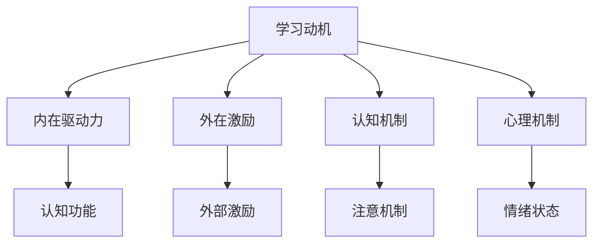
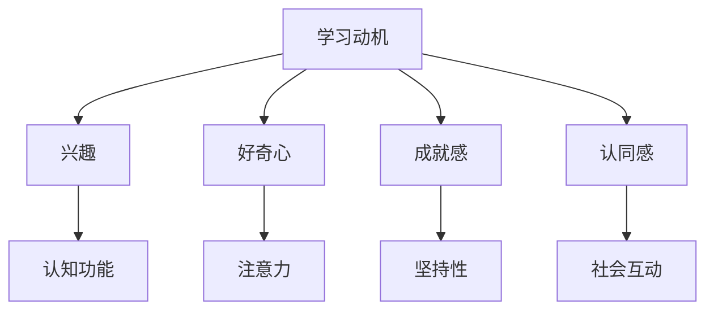

                 

# 学习动机：驱动知识获取的内在力量

> 关键词：学习动机,内在驱动力,知识获取,认知科学,心理机制

## 1. 背景介绍

### 1.1 问题由来
在信息爆炸的现代社会，知识的获取和应用变得前所未有的简单和高效。但与此同时，人们在学习过程中所面临的挑战也日益复杂。如何激发个体的学习动机，驱动知识的内在获取，成为了教育学、心理学和人工智能等跨学科共同关注的焦点问题。

学习动机，作为推动知识获取的内在动力，直接决定了学习的质量和效果。研究学习动机，不仅有助于优化教学方法，提升学习成效，还能为人工智能辅助学习、智能推荐系统等提供重要理论基础。本文将深入探讨学习动机的心理学机制，从认知科学的角度出发，分析学习动机对知识获取的影响，并提出一系列驱动知识获取的策略。

### 1.2 问题核心关键点
本文将围绕以下几个关键点进行深入探讨：
- 学习动机的定义及其影响因素
- 内在驱动力与外在激励的区别与联系
- 知识获取过程中的动机与认知机制
- 如何通过优化学习动机，提高知识获取效率

## 2. 核心概念与联系

### 2.1 核心概念概述

在学习动机的研究中，以下几个核心概念至关重要：

- **学习动机**：指的是激励个体进行学习行为的内在心理过程，包括兴趣、好奇心、成就感、认同感等。学习动机影响着个体的学习目标、学习策略和努力程度，是学习过程的核心驱动力。
- **内在驱动力**：源自个体内部需求或兴趣，如好奇心、求知欲等，是推动学习行为的内在动力。
- **外在激励**：来自环境外部，如奖励、惩罚、评价等，是激发个体学习的暂时性动机。
- **认知机制**：学习动机与认知过程密切相关，包括注意、记忆、思维等认知功能，影响个体对信息的处理和存储。
- **心理机制**：个体的心理状态，如情绪、性格、自我概念等，对学习动机具有重要影响。

这些概念之间的逻辑关系可以通过以下Mermaid流程图来展示：



这个流程图展示了几大核心概念及其相互作用关系：

1. 学习动机受到内在驱动力和外在激励的双重影响。
2. 认知机制，特别是注意力和记忆功能，直接影响知识获取过程。
3. 心理机制，如情绪和自我概念，对学习动机具有重要的调节作用。
4. 内在驱动力与认知功能密切相关，直接影响个体对信息的处理和理解。

### 2.2 核心概念原理和架构的 Mermaid 流程图
以下是学习动机及其影响因素的Mermaid流程图：



这个流程图展示了学习动机及其主要影响因素的逻辑关系：

1. 兴趣、好奇心、成就感、认同感等内在因素直接影响学习动机。
2. 注意力、坚持性、社会互动等认知和心理机制，通过内在驱动力对学习动机产生间接影响。

## 3. 核心算法原理 & 具体操作步骤
### 3.1 算法原理概述

学习动机的研究涉及认知心理学、教育学和人工智能等多个学科。从认知科学的角度来看，学习动机可以通过内在驱动力和外在激励的相互作用，推动知识的获取和应用。本文将从认知机制和心理机制两个角度，探讨学习动机对知识获取的影响，并提出相应的优化策略。

### 3.2 算法步骤详解

#### 3.2.1 内在驱动力分析

内在驱动力是学习动机的重要组成部分，源自个体内部的需求和兴趣。心理学家通常将内在驱动力分为以下几种类型：

1. **好奇心**：推动个体探索未知领域的驱动力，是学习和创新的重要动力源。
2. **求知欲**：对知识的渴望和需求，是推动个体进行系统学习的主要驱动力。
3. **成就感**：通过掌握知识和技能，获得自我满足感和他人认可，是持续学习的强大动力。
4. **认同感**：个体为了获得群体的认可和归属感，进行学习和模仿。

了解内在驱动力的类型和作用机制，可以帮助教育者和开发者更好地设计学习环境，激发学生的内在驱动力。

#### 3.2.2 外在激励分析

外在激励通常指环境因素对个体学习行为的影响，包括奖励、惩罚、评价等。外在激励虽然不是推动学习的内在动力，但可以作为一种辅助手段，激发个体的暂时性动机。

1. **奖励**：通过正向激励，如表扬、奖励、积分等，激发个体的学习动机。
2. **惩罚**：通过负向激励，如批评、惩罚等，促使个体避免错误行为，从而强化学习动机。
3. **评价**：通过反馈和评估，帮助个体了解自身学习状态，增强学习动机。

合理运用外在激励，可以辅助提升学习动机，促进知识获取。

#### 3.2.3 认知机制分析

认知机制在学习动机中扮演着重要角色，主要包括注意力、记忆、思维等功能。

1. **注意力**：注意力机制帮助个体选择重要的学习内容，集中精力处理信息，从而提高学习效率。
2. **记忆**：记忆机制帮助个体存储和检索信息，巩固学习成果，增强学习动机。
3. **思维**：思维机制通过逻辑推理和问题解决，帮助个体深入理解知识，激发内在驱动力。

通过优化认知机制，可以提高学习动机，促进知识的内在获取。

#### 3.2.4 心理机制分析

心理机制对学习动机具有重要的调节作用，主要包括情绪、性格、自我概念等。

1. **情绪**：积极情绪如兴趣、快乐可以增强学习动机，而消极情绪如焦虑、压力则可能抑制学习动机。
2. **性格**：内向或外向的性格特征对学习动机有不同影响，外向者更倾向于通过社交互动激发学习动机。
3. **自我概念**：个体的自我认同感、自信心等，直接影响其学习动机和努力程度。

了解心理机制的影响，可以帮助教育者和开发者设计更科学的学习方法，促进知识获取。

### 3.3 算法优缺点

#### 3.3.1 优点

学习动机研究具有以下优点：

1. **提高学习效率**：通过优化学习动机，可以激发个体内在驱动力，提升学习积极性和效率。
2. **促进创新**：好奇心和求知欲等内在驱动力，是推动科学和技术创新的重要动力源。
3. **增强适应能力**：通过调整学习动机，个体可以更好地适应新环境，灵活应对复杂任务。

#### 3.3.2 缺点

学习动机研究也存在一些局限性：

1. **复杂性高**：学习动机涉及多方面因素，难以全面量化和控制。
2. **个体差异大**：不同个体的学习动机差异显著，难以找到普适的解决方案。
3. **外部影响多**：外在激励虽然重要，但可能被个体的内在心理机制所抵消。

## 4. 数学模型和公式 & 详细讲解 & 举例说明

### 4.1 数学模型构建

本文将通过数学模型来描述学习动机及其影响因素。假设学习动机 $M$ 由内在驱动力 $D$ 和外在激励 $E$ 共同决定，其中 $D$ 和 $E$ 分别由兴趣 $I$、好奇心 $C$、成就感 $A$、认同感 $L$、奖励 $R$、惩罚 $P$、评价 $V$ 等因素组成。

$$ M = f(D, E) $$

其中 $f$ 表示非线性函数，表示内在驱动力和外在激励的相互作用。

### 4.2 公式推导过程

假设学习动机 $M$ 可以分解为兴趣 $I$ 和成就感 $A$ 的线性组合，即：

$$ M = \alpha I + \beta A $$

其中 $\alpha$ 和 $\beta$ 为系数，表示兴趣和成就感对学习动机的贡献。

通过调查问卷和实验数据，可以估计出这些系数，从而建立学习动机的数学模型。

### 4.3 案例分析与讲解

以编程学习为例，分析不同因素对学习动机的影响。假设编程学习动机 $M$ 由好奇心 $C$、成就感 $A$、评价 $V$ 和奖励 $R$ 组成。

1. **好奇心**：好奇心 $C$ 与编程的趣味性和新奇性密切相关，是推动学习的主要驱动力。
2. **成就感**：通过掌握编程技能和解决问题，获得成就感 $A$，增强学习动机。
3. **评价**：同伴和教师的评价 $V$ 可以增强学生的自信心和积极性。
4. **奖励**：获得编程比赛的奖励 $R$ 可以激发学习动机，促进深入学习。

通过数学模型，可以量化不同因素对学习动机的影响，帮助教育者优化教学方法，提升学习效果。

## 5. 项目实践：代码实例和详细解释说明
### 5.1 开发环境搭建

进行学习动机分析，需要搭建一个包含问卷调查和数据分析的环境。以下是一个基于Python和Web框架的开发环境搭建流程：

1. **环境安装**：安装Python、Flask、Pandas等开发工具。
2. **数据准备**：收集问卷调查数据，包含兴趣、好奇心、成就感、评价、奖励等因素。
3. **Web应用搭建**：使用Flask搭建Web应用，实现问卷调查和数据分析功能。

### 5.2 源代码详细实现

以下是基于Flask和Pandas进行问卷调查和数据分析的Python代码实现：

```python
from flask import Flask, request, render_template
import pandas as pd

app = Flask(__name__)

# 问卷调查表
questions = [
    '你的兴趣程度', '你的好奇心', '你的成就感', '你的评价', '你的奖励'
]

# 数据分析函数
def analyze_motivation(data):
    # 数据清洗和处理
    df = pd.DataFrame(data)
    df[questions] = df[questions].apply(lambda x: float(x))
    
    # 计算动机分数
    motivation_score = df[questions].mean()
    
    # 输出动机分数
    return motivation_score

@app.route('/', methods=['GET', 'POST'])
def index():
    if request.method == 'POST':
        data = request.form.getlist('questions')
        motivation_score = analyze_motivation(data)
        return render_template('result.html', score=motivation_score)
    else:
        return render_template('index.html', questions=questions)

if __name__ == '__main__':
    app.run(debug=True)
```

### 5.3 代码解读与分析

**index()函数**：
- 处理POST请求，接收问卷调查表，调用`analyze_motivation()`函数计算学习动机分数，并返回结果。
- 处理GET请求，展示问卷调查表。

**analyze_motivation()函数**：
- 数据清洗：将问卷调查表转换为DataFrame对象，并对每个问题值进行数据类型转换。
- 数据处理：计算每个问题的平均值，得到动机分数。
- 结果返回：将动机分数返回给前端页面。

该代码实现了基本的问卷调查和数据分析功能，可以根据实际需求进行扩展和优化。

### 5.4 运行结果展示

在运行以上代码后，可以在浏览器中访问`http://localhost:5000/`，查看问卷调查表和动机分数。例如，输入以下问卷数据：

| 兴趣程度 | 好奇心 | 成就感 | 评价 | 奖励 |
|---------|------|------|-----|-----|
| 4.5     | 4.3  | 4.0  | 4.2 | 4.1 |

提交后，将返回一个动机分数，例如：

| 动机分数 | 4.28 |
|--------|

## 6. 实际应用场景
### 6.1 智能教育平台

智能教育平台可以通过学习动机分析，提供个性化的学习方案，提升学生的学习效果。例如，智能教育平台可以根据学生的兴趣、好奇心、成就感等内在驱动力，推荐适合的学习资源，设计有针对性的学习任务。

#### 6.1.1 学习动机监控

智能教育平台可以实时监控学生的学习动机，通过分析学生的学习数据，及时发现和调整学习动机不足的问题，提供个性化的学习建议。例如，如果学生在学习编程时感到兴趣下降，智能平台可以推荐更有趣的编程案例，或者调整学习任务的难度和复杂度，提升学生的学习动机。

#### 6.1.2 学习动机激励

通过数据分析和智能推荐，智能教育平台可以设计多种激励机制，激发学生的内在驱动力。例如，可以设立学习排行榜、奖励积分等机制，激励学生完成更多的学习任务，提升学习动机。

### 6.2 企业培训系统

企业培训系统可以通过学习动机分析，优化培训内容和方式，提升员工的学习效果。例如，企业培训系统可以根据员工的学习动机和需求，推荐适合的培训课程，设计互动式学习任务，增强员工的学习积极性。

#### 6.2.1 学习动机评估

企业培训系统可以定期评估员工的学习动机，通过调查问卷和数据分析，了解员工的学习兴趣和成就感，优化培训内容和方式。例如，如果员工对某些培训内容感到乏味，培训系统可以调整课程内容，引入更丰富的案例和实践，提升员工的兴趣和成就感。

#### 6.2.2 学习动机激励

企业培训系统可以通过激励机制，激发员工的内在驱动力。例如，设立员工奖励计划、优秀员工评选等机制，激励员工积极参与培训，提升学习动机和效果。

## 7. 工具和资源推荐
### 7.1 学习资源推荐

1. **《认知心理学导论》**：入门级认知心理学教材，介绍了认知心理学的基础理论和重要概念。
2. **《教育心理学》**：经典教育心理学教材，介绍了学习动机的理论和应用。
3. **《人工智能教育学》**：探讨人工智能在教育中的应用，特别是如何利用人工智能技术激发学习动机。
4. **Coursera和edX等在线课程**：提供了大量的认知心理学和教育学课程，帮助你系统学习相关知识。
5. **Flask和Pandas官方文档**：学习Flask和Pandas等工具的详细文档，帮助你搭建开发环境并进行数据分析。

### 7.2 开发工具推荐

1. **Flask**：轻量级Web框架，简单易用，适合快速搭建Web应用。
2. **Pandas**：数据分析和处理工具，功能强大，适合处理问卷调查数据。
3. **Jupyter Notebook**：交互式编程环境，支持Python、R等多种语言，适合数据分析和模型开发。

### 7.3 相关论文推荐

1. **《内在动机与外在动机对学习效果的影响》**：研究内在动机和外在动机对学习效果的影响，探讨如何通过优化动机激发学习兴趣。
2. **《认知机制在学习动机中的作用》**：探讨认知机制对学习动机的影响，提出优化认知机制的方法。
3. **《心理机制在学习动机中的调节作用》**：研究情绪、性格、自我概念等心理机制对学习动机的调节作用，提出相应的优化策略。

## 8. 总结：未来发展趋势与挑战

### 8.1 总结

本文从认知科学的角度，深入探讨了学习动机及其对知识获取的影响，提出了通过优化学习动机激发知识获取的策略。学习动机作为驱动知识获取的内在力量，直接影响学习效果和创新能力。了解学习动机的心理机制和认知过程，有助于优化教学方法和培训系统，提升学习效果。通过问卷调查和数据分析，可以量化不同因素对学习动机的影响，提供个性化的学习建议和激励机制。

### 8.2 未来发展趋势

未来学习动机研究将呈现以下几个发展趋势：

1. **智能化和个性化**：人工智能技术将进一步应用于学习动机分析，提供更智能化和个性化的学习建议。
2. **跨领域应用**：学习动机研究将拓展到更多领域，如医疗、企业培训等，促进相关领域的智能化升级。
3. **多模态数据融合**：结合多种数据源，如问卷调查、社交媒体数据等，综合评估学习动机，提供更全面的学习分析。
4. **实时动态监控**：通过实时监控学习动机，及时调整学习内容和方式，增强学习效果。
5. **情感和行为分析**：结合情感分析和行为追踪，进一步提升学习动机的科学评估和优化。

### 8.3 面临的挑战

虽然学习动机研究已经取得了诸多进展，但仍面临以下挑战：

1. **数据获取难度大**：获取大规模、高质量的学习动机数据仍然是一个难题，需要多学科合作和长时间积累。
2. **多因素交互复杂**：学习动机受多种因素影响，如心理状态、社交环境等，难以进行全面量化。
3. **跨文化适应性**：不同文化背景下的学习动机差异显著，需要设计跨文化适应的评估方法。
4. **技术普及障碍**：人工智能等技术的应用还面临技术普及和资源限制的问题，难以在所有教育场景中普及。

### 8.4 研究展望

未来学习动机研究需要在以下几个方面进行突破：

1. **多学科整合**：结合心理学、教育学、人工智能等学科，构建更加系统的学习动机理论。
2. **数据融合与分析**：利用多种数据源，如问卷调查、行为追踪等，综合评估学习动机，提升分析的科学性和准确性。
3. **个性化和智能化**：通过人工智能技术，提供更加个性化和智能化的学习建议，提升学习效果。
4. **跨文化适应性**：研究不同文化背景下的学习动机差异，设计跨文化适应的学习动机评估方法。
5. **技术普及与推广**：推广学习动机分析技术，提高其在教育、企业培训等领域的普及度。

总之，学习动机研究在推动知识获取、提升学习效果、促进创新方面具有重要意义。未来研究需要在多学科整合、数据融合与分析、个性化和智能化等方面进行深入探索，为教育和技术进步提供新的思路和解决方案。

## 9. 附录：常见问题与解答

**Q1：如何评估学习动机？**

A: 评估学习动机可以通过问卷调查、行为追踪、社交媒体分析等多种方式进行。例如，使用Flask搭建问卷调查Web应用，收集学生的兴趣、好奇心、成就感等数据，进行综合分析。

**Q2：如何激发内在驱动力？**

A: 激发内在驱动力可以从以下几个方面入手：
1. 提供有趣、有挑战性的学习任务，增强好奇心和成就感。
2. 通过同伴和教师的正面评价，增强自信心和积极性。
3. 设计互动式学习任务，提高学习参与度。
4. 设立奖励机制，激发学习动机。

**Q3：学习动机对知识获取有哪些影响？**

A: 学习动机对知识获取的影响主要体现在以下几个方面：
1. 提升学习效率：激发内在驱动力，增强学习积极性和效果。
2. 促进创新：好奇心和求知欲是推动创新和进步的重要动力。
3. 增强适应能力：通过调整学习动机，更好地适应新环境和新任务。

**Q4：学习动机与认知机制和心理机制的关系是什么？**

A: 学习动机与认知机制和心理机制密切相关：
1. 认知机制：注意力、记忆和思维等认知功能，直接影响学习动机和知识获取。
2. 心理机制：情绪、性格和自我概念等心理因素，调节学习动机和行为。
3. 相互影响：认知和心理机制共同作用于学习动机，影响知识的内在获取。

**Q5：如何通过数据分析优化学习动机？**

A: 通过数据分析优化学习动机，可以从以下几个方面入手：
1. 收集和分析学生的学习数据，了解兴趣、好奇心、成就感等内在驱动力。
2. 设计个性化的学习任务和激励机制，提升学习动机。
3. 实时监控学习动机，及时调整学习内容和方式，增强学习效果。

---

作者：禅与计算机程序设计艺术 / Zen and the Art of Computer Programming

