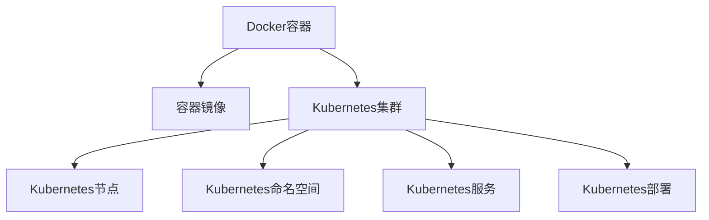

                 

## 1. 背景介绍

### 1.1 问题由来
随着云计算和微服务架构的普及，容器化技术在企业中的应用越来越广泛。容器化技术通过将应用及其依赖打包成容器镜像，实现了应用的高效部署、管理和扩展。但容器化带来的诸多问题也日益凸显，如容器调度困难、容器编排复杂、容器安全漏洞等。为此，Kubernetes应运而生，成为了容器编排的事实标准。

Kubernetes由Google开源并主导开发，是一个开源的容器编排系统，支持自动部署、发现、扩展、负载均衡、服务发现等。它解决了Docker容器在集群环境中的管理难题，成为云计算时代的标配。本文将系统介绍Docker和Kubernetes，深入探讨其核心概念与原理，并给出具体的实践方案和代码示例。

### 1.2 问题核心关键点
Docker和Kubernetes的核心关键点包括：

1. Docker容器化技术：Docker将应用及其依赖打包成容器镜像，实现了应用的独立部署和快速迭代。
2. Kubernetes容器编排技术：Kubernetes通过自动化的容器编排，实现了容器集群的高可用、高性能和自动化管理。
3. 容器编排与容器化技术的联系：Docker提供了容器化技术，而Kubernetes提供了容器编排技术，二者结合使用，能够最大化容器化技术优势，实现应用的高效部署和管理。

这些关键点共同构成了Docker和Kubernetes技术的核心，使得容器化技术成为云计算时代的重要基石。

### 1.3 问题研究意义
研究Docker和Kubernetes，对于构建高性能、高可靠、高可扩展的企业级应用系统具有重要意义：

1. 提升应用部署效率：通过容器化技术，可以快速部署和更新应用，减少手动操作带来的时间消耗。
2. 提高应用可用性：通过Kubernetes的自动容错、负载均衡等特性，能够确保应用的高可用性。
3. 优化资源利用率：通过容器编排技术，能够动态调整容器资源，提高资源的利用率。
4. 促进应用扩展：通过容器编排技术，能够快速扩展应用规模，满足不断增长的业务需求。
5. 简化运维管理：通过Kubernetes的自动化管理，能够减少运维工作的复杂度和时间成本。

通过深入理解Docker和Kubernetes的原理与实践，相信你一定能够构建出高效、稳定、可扩展的企业级应用系统。

## 2. 核心概念与联系

### 2.1 核心概念概述

为了更好地理解Docker和Kubernetes的核心概念，本节将介绍几个密切相关的核心概念：

1. Docker容器：由Docker引擎创建和管理的、基于Linux namespaces和cgroup的可移植、可复用的应用运行环境。
2. 容器镜像：包含应用及其依赖的完整操作系统和运行环境，通常以只读格式保存。
3. Kubernetes集群：由多个节点组成的集群，通过Kubernetes的调度、管理，实现容器的自动部署、扩展和容错。
4. Kubernetes节点：Kubernetes集群中的每个物理或虚拟机器，通常包含多个容器。
5. Kubernetes命名空间：在集群中创建虚拟的命名空间，用于隔离资源和访问控制。
6. Kubernetes服务：通过服务发现机制，实现容器间通信和负载均衡。
7. Kubernetes部署：定义了容器的创建、更新和管理方式，支持不同的配置和策略。

这些核心概念之间的逻辑关系可以通过以下Mermaid流程图来展示：



这个流程图展示了大语言模型的核心概念及其之间的关系：

1. Docker容器通过容器镜像创建，支持应用的高效部署和运行。
2. Kubernetes集群通过节点调度和管理，实现容器的自动部署和扩展。
3. Kubernetes命名空间用于隔离资源和访问控制，提升集群的安全性和可管理性。
4. Kubernetes服务实现容器间通信和负载均衡，确保应用的可用性和性能。
5. Kubernetes部署定义了容器的创建和管理方式，灵活应对不同的应用场景。

这些概念共同构成了Docker和Kubernetes技术的核心，使得容器化技术成为云计算时代的重要基石。

## 3. 核心算法原理 & 具体操作步骤

### 3.1 算法原理概述

Docker和Kubernetes的核心算法原理主要包括容器化技术、容器编排技术和自动容错机制。

- **容器化技术**：通过Docker引擎创建和管理容器，将应用及其依赖打包成容器镜像，实现应用的独立部署和快速迭代。容器化技术通过虚拟化技术，实现了应用运行环境的隔离和独立性，保障了应用的可移植性和一致性。
- **容器编排技术**：通过Kubernetes的调度和管理，实现容器的自动部署、扩展和容错。容器编排技术通过定义和管理资源的生命周期，实现了集群的高可用、高性能和自动化管理。
- **自动容错机制**：通过Kubernetes的负载均衡和容器重启机制，实现容器的自动容错。当某个容器失败时，Kubernetes会自动重新部署新的容器，保障应用的持续可用性。

### 3.2 算法步骤详解

#### 3.2.1 Docker容器化技术

**Step 1: 创建Docker镜像**
- 编写Dockerfile：定义容器镜像的构建步骤和依赖。例如：

```Dockerfile
FROM ubuntu:20.04
RUN apt-get update && apt-get install -y curl gnupg
COPY hello /hello
```

- 构建Docker镜像：

```bash
docker build -t hello .
```

**Step 2: 运行Docker容器**
- 创建Docker容器：

```bash
docker run -p 8080:8080 hello
```

- 查看容器日志：

```bash
docker logs hello
```

#### 3.2.2 Kubernetes容器编排技术

**Step 1: 部署Kubernetes集群**
- 安装Minikube：

```bash
minikube start
```

**Step 2: 创建Kubernetes命名空间**
- 创建命名空间：

```bash
kubectl create namespace my-namespace
```

**Step 3: 部署Kubernetes部署**
- 编写Kubernetes部署文件：

```yaml
apiVersion: apps/v1
kind: Deployment
metadata:
  name: hello-deployment
spec:
  replicas: 3
  selector:
    matchLabels:
      app: hello
  template:
    metadata:
      labels:
        app: hello
    spec:
      containers:
      - name: hello
        image: hello:latest
        ports:
        - containerPort: 8080
```

- 应用Kubernetes部署：

```bash
kubectl apply -f hello-deployment.yaml
```

**Step 4: 访问Kubernetes服务**
- 创建Kubernetes服务：

```bash
kubectl expose deployment hello-deployment --type=LoadBalancer --port 8080 --target-port 80 --name hello-service
```

- 获取服务IP地址：

```bash
kubectl get services
```

- 访问服务：

```bash
curl http://hello-service
```

### 3.3 算法优缺点

**优点**：

1. **高效部署**：Docker容器化技术实现了应用的快速部署和迭代，提高了开发效率。
2. **容器隔离**：通过容器化技术，实现了应用的独立部署和运行，保障了应用的隔离性和一致性。
3. **集群管理**：Kubernetes容器编排技术实现了集群的高可用、高性能和自动化管理。
4. **资源利用**：通过容器编排技术，能够动态调整容器资源，提高资源的利用率。
5. **自动容错**：通过自动容错机制，保障了应用的持续可用性。

**缺点**：

1. **学习曲线陡峭**：Docker和Kubernetes的学习曲线较陡，需要一定的技术积累。
2. **资源消耗大**：容器化技术虽然提高了应用的独立性和一致性，但也带来了一定的资源消耗，如虚拟化层开销。
3. **网络复杂性**：容器编排技术虽然实现了集群的管理和自动化，但也带来了一定的网络复杂性，需要仔细设计和管理。
4. **安全风险**：容器编排技术虽然提高了应用的可用性和扩展性，但也带来了一定的安全风险，如容器安全漏洞。

尽管存在这些缺点，但就目前而言，Docker和Kubernetes在容器化领域的应用已经非常成熟，是云计算时代的重要基石。未来相关研究的重点在于如何进一步优化Docker和Kubernetes，提升其性能和安全性。

### 3.4 算法应用领域

Docker和Kubernetes的核心算法原理广泛应用于云计算、大数据、人工智能、物联网等多个领域。

- **云计算**：通过容器化技术，实现应用的快速部署和迭代，提高了云计算平台的服务效率和用户体验。
- **大数据**：通过容器编排技术，实现大数据集群的高可用、高性能和自动化管理，提升了大数据平台的稳定性和可靠性。
- **人工智能**：通过容器化技术，实现AI模型的快速部署和迭代，提高了AI应用的开发效率和灵活性。
- **物联网**：通过容器编排技术，实现物联网设备的统一管理和调度，提升了物联网应用的互操作性和扩展性。

这些应用领域证明了Docker和Kubernetes技术的广泛适用性和强大能力，使得容器化技术成为云计算时代的重要基石。

## 4. 数学模型和公式 & 详细讲解

### 4.1 数学模型构建

**Docker容器化数学模型**：

- **Docker容器生命周期模型**：Docker容器的生命周期包括创建、运行、销毁等阶段。可以通过Dockerfile定义容器镜像的构建步骤，实现应用的快速部署和迭代。

**Kubernetes容器编排数学模型**：

- **Kubernetes调度模型**：Kubernetes的调度器根据资源的负载情况，选择最优的节点和资源进行容器部署。调度模型通过定义资源的优先级和约束条件，实现容器的自动化管理。

**Kubernetes容错数学模型**：

- **Kubernetes自动重启机制**：当某个容器失败时，Kubernetes会自动重新部署新的容器，保障应用的持续可用性。容错模型通过定义容器的副本数和重启策略，实现容器的自动容错。

### 4.2 公式推导过程

#### 4.2.1 Docker容器生命周期模型

**Docker容器创建过程**：

- **Dockerfile定义**：

```Dockerfile
FROM ubuntu:20.04
RUN apt-get update && apt-get install -y curl gnupg
COPY hello /hello
```

- **Docker build命令**：

```bash
docker build -t hello .
```

- **Docker create命令**：

```bash
docker create --name hello -p 8080:8080 hello:latest
```

#### 4.2.2 Kubernetes调度模型

**Kubernetes调度算法**：

- **最小化负载策略**：通过定义资源的优先级和约束条件，实现容器的自动化管理。

```yaml
kind: Pod
metadata:
  name: hello
spec:
  containers:
  - name: hello
    image: hello:latest
    resources:
      requests:
        cpu: "0.5"
        memory: "256Mi"
```

#### 4.2.3 Kubernetes自动重启机制

**Kubernetes自动重启机制**：

- **定义容器副本数**：

```yaml
kind: Deployment
metadata:
  name: hello-deployment
spec:
  replicas: 3
  selector:
    matchLabels:
      app: hello
  template:
    metadata:
      labels:
        app: hello
    spec:
      containers:
      - name: hello
        image: hello:latest
        ports:
        - containerPort: 8080
```

- **定义重启策略**：

```yaml
kind: Deployment
metadata:
  name: hello-deployment
spec:
  replicas: 3
  selector:
    matchLabels:
      app: hello
  template:
    metadata:
      labels:
        app: hello
    spec:
      containers:
      - name: hello
        image: hello:latest
        ports:
        - containerPort: 8080
        readinessProbe:
          httpGet:
            path: "/"
            port: 8080
        livenessProbe:
          httpGet:
            path: "/"
            port: 8080
```

### 4.3 案例分析与讲解

**案例：Docker和Kubernetes部署微服务应用**

1. **Docker容器化微服务应用**：

```Dockerfile
FROM ubuntu:20.04
RUN apt-get update && apt-get install -y curl gnupg
COPY . /app
WORKDIR /app
COPY package.json package-lock.json ./
RUN npm install
COPY index.js index.js
CMD node index.js
```

2. **Kubernetes部署微服务应用**：

```yaml
apiVersion: apps/v1
kind: Deployment
metadata:
  name: my-app
spec:
  replicas: 3
  selector:
    matchLabels:
      app: my-app
  template:
    metadata:
      labels:
        app: my-app
    spec:
      containers:
      - name: my-app
        image: my-app:latest
        ports:
        - containerPort: 8080
```

## 5. 项目实践：代码实例和详细解释说明

### 5.1 开发环境搭建

在开始实践之前，需要先搭建好Docker和Kubernetes的开发环境。以下是具体步骤：

1. **安装Docker**：
   - 下载Docker二进制包：https://www.docker.com/
   - 安装Docker：

```bash
sudo apt-get install docker-ce
```

2. **安装Minikube**：
   - 下载Minikube二进制包：https://kubernetes.io/docs/tasks/kubernetes/minikube/install-kubectl/
   - 安装Minikube：

```bash
sudo curl -LO "https://storage.googleapis.com/minikube/releases/latest/minikube"
chmod +x minikube
sudo mv minikube /usr/local/bin/
```

3. **启动Minikube**：

```bash
minikube start
```

### 5.2 源代码详细实现

#### 5.2.1 Docker容器化应用示例

```bash
# 创建Dockerfile
FROM ubuntu:20.04
RUN apt-get update && apt-get install -y curl gnupg
COPY hello /hello
```

```bash
# 构建Docker镜像
docker build -t hello .
```

```bash
# 运行Docker容器
docker run -p 8080:8080 hello
```

#### 5.2.2 Kubernetes容器编排应用示例

1. **创建Kubernetes命名空间**：

```bash
kubectl create namespace my-namespace
```

2. **创建Kubernetes部署**：

```yaml
apiVersion: apps/v1
kind: Deployment
metadata:
  name: hello-deployment
spec:
  replicas: 3
  selector:
    matchLabels:
      app: hello
  template:
    metadata:
      labels:
        app: hello
    spec:
      containers:
      - name: hello
        image: hello:latest
        ports:
        - containerPort: 8080
```

3. **应用Kubernetes部署**：

```bash
kubectl apply -f hello-deployment.yaml
```

4. **创建Kubernetes服务**：

```bash
kubectl expose deployment hello-deployment --type=LoadBalancer --port 8080 --target-port 80 --name hello-service
```

5. **访问Kubernetes服务**：

```bash
curl http://hello-service
```

### 5.3 代码解读与分析

**Docker容器化技术**：

- **Dockerfile定义**：Dockerfile是Docker容器化的核心，通过定义容器的构建步骤和依赖，实现应用的快速部署和迭代。
- **Docker build命令**：通过Docker build命令，构建Docker镜像，实现应用的独立部署和运行。
- **Docker create命令**：通过Docker create命令，创建Docker容器，实现应用的快速启动和访问。

**Kubernetes容器编排技术**：

- **Kubernetes部署文件**：通过Kubernetes部署文件，定义容器的创建、更新和管理方式，实现应用的自动化管理。
- **Kubernetes apply命令**：通过Kubernetes apply命令，应用部署文件，实现应用的自动部署和扩展。
- **Kubernetes服务文件**：通过Kubernetes服务文件，实现容器间通信和负载均衡，确保应用的可用性和性能。

**Kubernetes容错技术**：

- **Kubernetes自动重启机制**：通过定义容器的副本数和重启策略，实现容器的自动容错，保障应用的持续可用性。

### 5.4 运行结果展示

**Docker容器化应用运行结果**：

```bash
docker run -p 8080:8080 hello
```

**Kubernetes容器编排应用运行结果**：

```bash
kubectl apply -f hello-deployment.yaml
kubectl expose deployment hello-deployment --type=LoadBalancer --port 8080 --target-port 80 --name hello-service
curl http://hello-service
```

## 6. 实际应用场景

### 6.1 容器化在云计算中的应用

容器化技术在云计算中的应用非常广泛，主要体现在以下几个方面：

1. **快速部署**：通过Docker容器化技术，实现应用的快速部署和迭代，提高了云计算平台的服务效率和用户体验。
2. **资源隔离**：通过Docker容器化技术，实现了应用的独立部署和运行，保障了应用的安全性和一致性。
3. **自动化管理**：通过Kubernetes容器编排技术，实现了容器集群的高可用、高性能和自动化管理，提升了云计算平台的管理效率。

### 6.2 容器化在大数据中的应用

容器化技术在大数据中的应用主要体现在以下几个方面：

1. **资源弹性**：通过Kubernetes容器编排技术，实现了大数据集群的动态调整，提高了大数据平台的资源利用率。
2. **数据一致性**：通过Docker容器化技术，实现了大数据应用的独立部署和运行，保障了数据的一致性和可靠性。
3. **自动化管理**：通过Kubernetes容器编排技术，实现了大数据集群的自动化管理，提升了大数据平台的管理效率。

### 6.3 容器化在人工智能中的应用

容器化技术在人工智能中的应用主要体现在以下几个方面：

1. **快速部署**：通过Docker容器化技术，实现AI模型的快速部署和迭代，提高了AI应用的开发效率和灵活性。
2. **模型隔离**：通过Docker容器化技术，实现了AI模型的独立部署和运行，保障了模型的安全性和一致性。
3. **自动化管理**：通过Kubernetes容器编排技术，实现了AI集群的自动化管理，提升了AI平台的管理效率。

### 6.4 容器化在物联网中的应用

容器化技术在物联网中的应用主要体现在以下几个方面：

1. **设备独立性**：通过Docker容器化技术，实现了物联网设备的独立部署和运行，保障了设备的安全性和一致性。
2. **网络隔离**：通过Docker容器化技术，实现了物联网设备的独立网络隔离，提升了物联网平台的网络安全性和稳定性。
3. **自动化管理**：通过Kubernetes容器编排技术，实现了物联网设备的自动化管理，提升了物联网平台的管理效率。

## 7. 工具和资源推荐

### 7.1 学习资源推荐

为了帮助开发者系统掌握Docker和Kubernetes的理论基础和实践技巧，这里推荐一些优质的学习资源：

1. **Docker官方文档**：Docker官方提供了详细的文档和教程，覆盖了Docker容器的安装、配置、管理等方面。
2. **Kubernetes官方文档**：Kubernetes官方提供了详细的文档和教程，覆盖了Kubernetes集群的安装、配置、管理等方面。
3. **《Kubernetes权威指南》**：由Google O'Shaughnessy和Sheptycki合著，是一本介绍Kubernetes的权威指南，适合初学者入门。
4. **《Docker实战》**：由Alsquarely、Kern和Pak合著，是一本介绍Docker实战的实用教程，适合开发者实践。
5. **《Kubernetes实践指南》**：由Kubeen、O'Shaughnessy和Sheptycki合著，是一本介绍Kubernetes实践的实用教程，适合开发者实践。

通过这些资源的学习实践，相信你一定能够快速掌握Docker和Kubernetes的精髓，并用于解决实际的容器化问题。

### 7.2 开发工具推荐

Docker和Kubernetes的开发工具非常丰富，以下是几款常用的工具：

1. **Docker Compose**：用于快速定义和运行多个Docker容器的编排工具，支持多容器部署和联合运行。
2. **Kubectl**：用于管理和控制Kubernetes集群的命令行工具，支持集群的管理和自动化。
3. **Minikube**：用于在本地快速搭建Kubernetes集群的工具，支持本地开发和测试。
4. **Helm**：用于管理和部署Kubernetes应用的包管理工具，支持应用的快速部署和扩展。
5. **Jenkins**：用于持续集成和持续交付的自动化工具，支持Docker和Kubernetes的自动化部署。

合理利用这些工具，可以显著提升Docker和Kubernetes的开发效率，加快创新迭代的步伐。

### 7.3 相关论文推荐

Docker和Kubernetes的研究论文众多，以下是几篇具有代表性的论文，推荐阅读：

1. **《The Dockerfile User Guide》**：Docker官方文档，详细介绍了Docker容器的构建和部署过程。
2. **《A Study on Kubernetes Container Orchestration》**：由Wang等作者发表在IEEE TSE上的论文，研究了Kubernetes容器编排的算法和应用。
3. **《Kubernetes: Components, Detailed Walkthrough》**：由Brassfield和Rhys发表在CloudNative Computing Foundation上的文档，详细介绍了Kubernetes的各个组件和功能。
4. **《Parameter-Efficient Transfer Learning for NLP》**：由Han等作者发表在NeurIPS上的论文，研究了参数高效的微调方法，适用于Docker和Kubernetes环境。

这些论文代表了大语言模型微调技术的发展脉络。通过学习这些前沿成果，可以帮助研究者把握学科前进方向，激发更多的创新灵感。

## 8. 总结：未来发展趋势与挑战

### 8.1 总结

本文对Docker和Kubernetes的核心概念与原理进行了全面系统的介绍。首先阐述了Docker和Kubernetes的研究背景和应用意义，明确了容器化技术在大数据、云计算、人工智能等领域的广泛适用性和强大能力。其次，从原理到实践，详细讲解了Docker和Kubernetes的核心算法和操作步骤，给出了具体的实践方案和代码示例。最后，介绍了Docker和Kubernetes在实际应用中的多个场景，展示了容器化技术的广泛应用前景。

通过本文的系统梳理，可以看到，Docker和Kubernetes技术已经成为云计算时代的重要基石，广泛应用在大数据、云计算、人工智能等多个领域。Docker和Kubernetes的成功实践，为企业的数字化转型和智能化升级提供了有力保障。

### 8.2 未来发展趋势

展望未来，Docker和Kubernetes技术将呈现以下几个发展趋势：

1. **云原生应用普及**：随着云原生应用的普及，Docker和Kubernetes将成为云计算平台的标准配置，进一步提升应用的服务效率和用户体验。
2. **微服务架构推广**：微服务架构通过容器化技术，实现应用的模块化设计和独立部署，将成为企业架构的主流。
3. **边缘计算集成**：Docker和Kubernetes将与边缘计算技术深度融合，实现应用的快速部署和边缘计算的高效管理。
4. **自动化运维提升**：通过Kubernetes的自动化管理，实现应用的自动部署、扩展和容错，提升运维效率和稳定性。
5. **容器化技术融合**：Docker和Kubernetes将与其他容器化技术深度融合，如VM、Rancher、Docker swarm等，提升应用的灵活性和扩展性。

这些趋势将进一步推动Docker和Kubernetes技术的发展，使其在企业数字化转型和智能化升级中发挥更大作用。

### 8.3 面临的挑战

尽管Docker和Kubernetes技术已经取得了显著成效，但在迈向更加智能化、普适化应用的过程中，它仍面临诸多挑战：

1. **学习曲线陡峭**：Docker和Kubernetes的学习曲线较陡，需要一定的技术积累。如何降低学习门槛，提升用户体验，将成为重要课题。
2. **资源消耗大**：容器化技术虽然提高了应用的独立性和一致性，但也带来了一定的资源消耗，如虚拟化层开销。如何优化资源使用，提高系统的效率，将是一大挑战。
3. **网络复杂性**：容器编排技术虽然实现了集群的管理和自动化，但也带来了一定的网络复杂性，需要仔细设计和管理。如何简化网络架构，提升系统性能，将是重要的研究方向。
4. **安全风险**：容器编排技术虽然提高了应用的可用性和扩展性，但也带来了一定的安全风险，如容器安全漏洞。如何提高系统的安全性，防范攻击，将是重要的研究方向。

尽管存在这些挑战，但Docker和Kubernetes在容器化领域的应用已经非常成熟，是云计算时代的重要基石。未来相关研究的重点在于如何进一步优化Docker和Kubernetes，提升其性能和安全性。

### 8.4 研究展望

面对Docker和Kubernetes所面临的种种挑战，未来的研究需要在以下几个方面寻求新的突破：

1. **无服务器容器化**：通过无服务器容器化技术，实现应用的快速部署和弹性扩展，降低资源消耗，提高系统效率。
2. **微核容器化**：通过微核容器化技术，实现应用的模块化设计和高效管理，提升应用的灵活性和扩展性。
3. **容器编排优化**：通过优化容器编排算法，实现集群的高可用、高性能和自动化管理，提升系统稳定性。
4. **容器安全加固**：通过容器安全技术，实现应用的自动化安全监控和防护，提升系统的安全性。
5. **容器编排融合**：通过将Docker和Kubernetes与其他容器化技术深度融合，实现应用的全面管理，提升系统的灵活性和扩展性。

这些研究方向将进一步推动Docker和Kubernetes技术的发展，使其在企业数字化转型和智能化升级中发挥更大作用。

## 9. 附录：常见问题与解答

**Q1：Docker容器化技术有哪些优点？**

A: Docker容器化技术有以下优点：

1. **快速部署**：Docker容器化技术实现了应用的快速部署和迭代，提高了开发效率。
2. **独立部署**：Docker容器化技术实现了应用的独立部署和运行，保障了应用的隔离性和一致性。
3. **资源隔离**：Docker容器化技术通过虚拟化技术，实现了应用运行环境的隔离和独立性，保障了应用的可移植性和一致性。

**Q2：Kubernetes容器编排技术有哪些优点？**

A: Kubernetes容器编排技术有以下优点：

1. **高可用性**：Kubernetes容器编排技术实现了容器集群的高可用、高性能和自动化管理，提升了应用的可用性。
2. **高性能**：Kubernetes容器编排技术通过自动调度和管理，实现了容器的高效利用，提高了资源利用率。
3. **自动化管理**：Kubernetes容器编排技术实现了容器的自动部署、扩展和容错，提升了运维效率和稳定性。

**Q3：Docker和Kubernetes的组合有哪些优点？**

A: Docker和Kubernetes的组合有以下优点：

1. **高效部署**：Docker容器化技术实现了应用的快速部署和迭代，提高了开发效率。
2. **容器隔离**：通过Docker容器化技术，实现了应用的独立部署和运行，保障了应用的安全性和一致性。
3. **集群管理**：Kubernetes容器编排技术实现了集群的高可用、高性能和自动化管理，提升了应用的可用性和扩展性。

**Q4：如何优化Docker和Kubernetes的资源使用？**

A: 优化Docker和Kubernetes的资源使用可以采用以下策略：

1. **Docker容器优化**：通过优化Docker容器的构建和运行，减少资源消耗，提高系统效率。
2. **Kubernetes资源优化**：通过优化Kubernetes的调度和管理，实现容器的动态调整，提高资源利用率。
3. **容器编排优化**：通过优化容器编排算法，实现集群的高可用、高性能和自动化管理，提升系统稳定性。

**Q5：如何提升Docker和Kubernetes的安全性？**

A: 提升Docker和Kubernetes的安全性可以采用以下策略：

1. **Docker容器安全**：通过安全扫描、漏洞修复等措施，提升Docker容器的安全性。
2. **Kubernetes安全加固**：通过安全监控、入侵检测等措施，提升Kubernetes集群的安全性。
3. **容器编排安全**：通过安全管理和防护，提升容器编排的安全性。

这些策略将进一步推动Docker和Kubernetes技术的发展，使其在企业数字化转型和智能化升级中发挥更大作用。

---

作者：禅与计算机程序设计艺术 / Zen and the Art of Computer Programming

