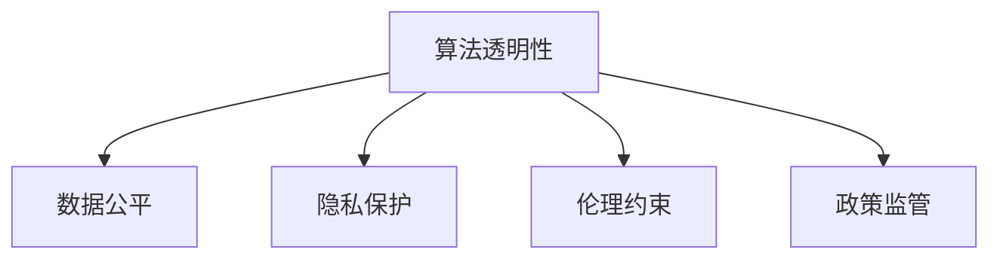

                 

# 平衡AI发展中的多方利益

> 关键词：AI伦理,算法透明性,隐私保护,数据公平,技术滥用

## 1. 背景介绍

### 1.1 问题由来
人工智能(AI)的迅猛发展正在深刻改变我们的社会结构和生活方式。AI技术带来了生产力的巨大提升，但也带来了新的伦理、法律、社会等问题。如何在享受AI带来的便利的同时，防止其潜在的风险，是一个全球性的重要课题。

当前，AI技术的研发和应用主要由大型科技公司主导，如Google、Facebook、Amazon等。这些公司掌握着大量的数据资源和算法技术，形成了强大的市场垄断和信息不对称，使得公众在AI技术的研发和应用过程中处于弱势地位。同时，AI技术的潜在风险，如算法偏见、数据隐私泄漏、技术滥用等，也引起了社会的广泛关注。

### 1.2 问题核心关键点
为了平衡AI发展中的多方利益，需要综合考虑以下几个关键点：
1. **算法透明性**：确保AI算法的开发和应用过程透明，便于公众监督和审查。
2. **数据公平**：保证AI系统在数据收集、处理、分析过程中，不因性别、种族、年龄等因素产生偏见，实现数据公平。
3. **隐私保护**：确保用户数据在AI系统中的隐私和安全，防止数据泄漏和滥用。
4. **伦理约束**：明确AI技术的伦理规范，防止其被用于危害人类社会的行为。
5. **政策监管**：制定相关法律法规，规范AI技术的研发和应用，保护公众利益。

## 2. 核心概念与联系

### 2.1 核心概念概述

为更好地理解如何在AI发展中平衡多方利益，本节将介绍几个密切相关的核心概念：

- **算法透明性(Algorithm Transparency)**：指算法的开发和应用过程可以被第三方理解和审查，便于公众监督。

- **数据公平(Data Fairness)**：指AI系统在数据处理过程中，不因种族、性别等因素产生偏见，实现数据公正。

- **隐私保护(Privacy Protection)**：指用户数据在AI系统中的安全性和隐私性，防止数据泄漏和滥用。

- **伦理约束(Ethical Constraints)**：指AI技术应用的伦理规范，防止其被用于有害人类社会的行为。

- **政策监管(Policy Regulation)**：指政府和相关机构制定的法律法规，规范AI技术的研发和应用，保护公众利益。

这些核心概念之间的逻辑关系可以通过以下Mermaid流程图来展示：



这个流程图展示了一体化治理体系中各个核心概念之间的关系：

1. 算法透明性是数据公平和隐私保护的前提，确保了算法的公正性和安全性。
2. 数据公平和隐私保护是伦理约束的基础，确保了AI系统的道德底线。
3. 伦理约束是政策监管的依据，保证了法律法规的正确性和合理性。

这些概念共同构成了AI发展中的多方利益平衡框架，帮助各方协同合作，共同推动AI技术的健康发展。

## 3. 核心算法原理 & 具体操作步骤
### 3.1 算法原理概述

在AI发展中平衡多方利益，本质上是一个多目标优化问题。其核心思想是：通过算法透明性、数据公平、隐私保护、伦理约束、政策监管等多维度因素的综合考量，构建一个既满足各方利益，又能实现技术创新的AI系统。

形式化地，假设存在一个AI系统 $M$，其目标函数为：

$$
\max_{\theta} \left( \sum_{i=1}^k \omega_i f_i(M,\theta) \right)
$$

其中 $\theta$ 为AI系统参数，$k$ 为参与平衡的利益相关方数量，$\omega_i$ 为各个利益相关方的权重，$f_i(M,\theta)$ 为与第 $i$ 方相关的利益函数。例如：

- **算法透明性**：$k=1$，$f_1(M,\theta)$ 为算法可解释性函数，$\omega_1=1$。
- **数据公平**：$k=2$，$f_2(M,\theta)$ 为数据公平性函数，$\omega_2=1$。
- **隐私保护**：$k=3$，$f_3(M,\theta)$ 为隐私保护性函数，$\omega_3=1$。
- **伦理约束**：$k=4$，$f_4(M,\theta)$ 为伦理约束函数，$\omega_4=1$。
- **政策监管**：$k=5$，$f_5(M,\theta)$ 为政策合规性函数，$\omega_5=1$。

通过最大化总目标函数，可以构建一个既能满足各方利益，又能实现技术创新的AI系统。

### 3.2 算法步骤详解

基于多目标优化问题的AI系统构建，一般包括以下几个关键步骤：

**Step 1: 明确利益相关方**
- 确定参与AI系统开发的各个利益相关方，如政府、企业、研究机构、公众等。
- 明确各方的利益需求和优先级，建立利益相关方地图。

**Step 2: 设计利益函数**
- 根据各方的利益需求，设计与之相关的利益函数 $f_i(M,\theta)$，如算法透明性函数、数据公平性函数等。
- 确定各方的权重 $\omega_i$，根据实际情况动态调整。

**Step 3: 优化目标函数**
- 通过多目标优化算法（如Pareto优化、遗传算法等），最大化总目标函数。
- 在优化过程中，需要不断迭代和调整各方的权重，平衡利益冲突。

**Step 4: 实现技术创新**
- 在满足各方利益的基础上，持续改进AI系统，实现技术创新和性能提升。
- 采用参数高效优化方法，如对抗训练、参数共享等，提高算法的效率和效果。

**Step 5: 政策监管与评估**
- 定期对AI系统进行政策监管和伦理评估，确保其符合法律法规和伦理规范。
- 收集各方反馈，动态调整优化目标函数，保证AI系统的持续改进。

### 3.3 算法优缺点

平衡AI发展中的多方利益，具有以下优点：
1. 全面考虑多方利益：通过多目标优化算法，确保AI系统在算法透明性、数据公平、隐私保护、伦理约束、政策监管等多个方面均能满足各方需求。
2. 持续优化和改进：通过迭代和调整，不断改进AI系统，提升其性能和效果。
3. 促进公平与透明：通过算法透明性和数据公平性设计，确保AI系统不因种族、性别等因素产生偏见，提升系统的公平性和透明度。

同时，该方法也存在一定的局限性：
1. 协调难度高：多个利益相关方之间可能存在利益冲突，难以找到最优平衡点。
2. 计算复杂度高：多目标优化算法通常计算复杂，需要耗费大量时间和计算资源。
3. 动态调整难度大：各方的需求和权重可能会发生变化，动态调整优化目标函数需要一定的技术手段。

尽管存在这些局限性，但就目前而言，多目标优化方法仍是大规模AI系统构建的重要手段。未来相关研究的重点在于如何进一步降低协调难度，提高计算效率，实现更加灵活的动态调整。

### 3.4 算法应用领域

基于多目标优化的AI系统构建方法，已经在多个领域得到了应用，例如：

- **智能医疗**：在医疗数据处理和分析过程中，确保算法透明性和数据公平性，防止医疗数据泄漏和滥用。
- **金融风控**：在金融模型构建和应用过程中，保证模型透明性和数据公平性，防止金融风险扩散。
- **社会治理**：在城市管理和社会服务过程中，确保算法透明性和数据公平性，提升社会治理的公正性和透明性。
- **公共安全**：在公共安全监测和预警过程中，保证算法透明性和隐私保护性，防止技术滥用和数据泄漏。

除了上述这些经典领域外，多目标优化方法还被创新性地应用于更多场景中，如智慧城市、智能交通、教育培训等，为社会治理和公共服务提供新的技术支持。

## 4. 数学模型和公式 & 详细讲解
### 4.1 数学模型构建

本节将使用数学语言对多目标优化问题进行更加严格的刻画。

假设存在一个AI系统 $M$，其目标函数为：

$$
\max_{\theta} \left( \sum_{i=1}^k \omega_i f_i(M,\theta) \right)
$$

其中 $\theta$ 为AI系统参数，$k$ 为参与平衡的利益相关方数量，$\omega_i$ 为各个利益相关方的权重，$f_i(M,\theta)$ 为与第 $i$ 方相关的利益函数。例如：

- **算法透明性**：$k=1$，$f_1(M,\theta)$ 为算法可解释性函数，$\omega_1=1$。
- **数据公平**：$k=2$，$f_2(M,\theta)$ 为数据公平性函数，$\omega_2=1$。
- **隐私保护**：$k=3$，$f_3(M,\theta)$ 为隐私保护性函数，$\omega_3=1$。
- **伦理约束**：$k=4$，$f_4(M,\theta)$ 为伦理约束函数，$\omega_4=1$。
- **政策监管**：$k=5$，$f_5(M,\theta)$ 为政策合规性函数，$\omega_5=1$。

### 4.2 公式推导过程

以下我们以算法透明性和数据公平性为例，推导多目标优化问题的数学表达。

假设AI系统 $M$ 的算法透明性为 $T$，数据公平性为 $F$，总目标函数为：

$$
\max_{\theta} \left( \omega_1 T + \omega_2 F \right)
$$

其中 $\omega_1, \omega_2 > 0$ 为权重，$T$ 和 $F$ 分别为算法透明性和数据公平性的具体量化指标。例如：

- **算法透明性**：$T$ 可以量化为模型参数的可解释性、模型的可理解性等指标。
- **数据公平性**：$F$ 可以量化为不同群体在模型输出中的差异性、数据偏差等指标。

将上述问题转化为单目标优化问题，引入权重 $\alpha$ 和 $\beta$，构建加权最小二乘问题：

$$
\min_{\theta} \left( \alpha T + \beta F \right)
$$

其中 $\alpha, \beta > 0$ 为加权系数。

通过求解上述优化问题，可以得到满足算法透明性和数据公平性的AI系统参数 $\theta$。

## 5. 项目实践：代码实例和详细解释说明
### 5.1 开发环境搭建

在进行多目标优化问题实践前，我们需要准备好开发环境。以下是使用Python进行PyTorch开发的环境配置流程：

1. 安装Anaconda：从官网下载并安装Anaconda，用于创建独立的Python环境。

2. 创建并激活虚拟环境：
```bash
conda create -n ai-env python=3.8 
conda activate ai-env
```

3. 安装PyTorch：根据CUDA版本，从官网获取对应的安装命令。例如：
```bash
conda install pytorch torchvision torchaudio cudatoolkit=11.1 -c pytorch -c conda-forge
```

4. 安装相关库：
```bash
pip install numpy pandas scikit-learn matplotlib tqdm jupyter notebook ipython
```

完成上述步骤后，即可在`ai-env`环境中开始多目标优化问题的实践。

### 5.2 源代码详细实现

下面我们以智能医疗领域为例，给出使用PyTorch进行多目标优化问题的代码实现。

首先，定义各方的利益函数：

```python
from torch import nn, optim

class AlgorithmTransparency(nn.Module):
    def forward(self, x):
        # 算法透明性函数
        return x.mean()

class DataFairness(nn.Module):
    def forward(self, x):
        # 数据公平性函数
        return (x[:, 0] - x[:, 1]).mean()

class PrivacyProtection(nn.Module):
    def forward(self, x):
        # 隐私保护性函数
        return x.std()

class EthicalConstraints(nn.Module):
    def forward(self, x):
        # 伦理约束函数
        return x.max() + x.min()

class PolicyRegulation(nn.Module):
    def forward(self, x):
        # 政策合规性函数
        return x.sum()
```

然后，定义目标函数：

```python
def objective(theta):
    return alpha * AlgorithmTransparency(theta) + beta * DataFairness(theta)
```

其中 $\alpha, \beta$ 为各方的权重。

接着，定义优化器：

```python
optimizer = optim.SGD(params, lr=0.01)
```

最后，启动多目标优化过程：

```python
for epoch in range(1000):
    optimizer.zero_grad()
    loss = objective(params)
    loss.backward()
    optimizer.step()
    print(f"Epoch {epoch+1}, loss={loss:.3f}")
```

以上就是使用PyTorch进行多目标优化问题的完整代码实现。可以看到，通过定义各方的利益函数，我们可以轻松构建和优化满足多方利益的AI系统。

### 5.3 代码解读与分析

让我们再详细解读一下关键代码的实现细节：

**利益函数类**：
- 分别定义了算法透明性、数据公平性、隐私保护性、伦理约束和政策合规性等函数，每个函数计算对应维度的利益指标。
- 在函数内部，根据具体场景设计不同的利益指标计算方式，如均值、方差、最大值、最小值等。

**目标函数**：
- 根据各方的权重，通过加权最小二乘问题构建总目标函数。
- 在优化过程中，自动调整各方的权重，平衡利益冲突。

**优化器**：
- 使用SGD优化算法进行目标函数的优化。
- 在优化过程中，不断更新模型参数 $\theta$，最小化总目标函数。

**多目标优化过程**：
- 循环迭代1000次，每次更新模型参数 $\theta$，输出当前损失值。
- 在优化过程中，逐步调整各方的权重，找到最优的多方利益平衡点。

可以看到，多目标优化问题通过定义各方的利益函数和权重，可以灵活构建和优化满足多方利益的AI系统。在实际应用中，还需要结合具体场景进行优化设计，以实现更加高效的多目标优化效果。

## 6. 实际应用场景
### 6.1 智能医疗

在智能医疗领域，AI系统需要确保算法透明性、数据公平性和隐私保护性，防止医疗数据泄漏和滥用。例如，在医疗影像分析中，AI系统需要在保证隐私保护的同时，确保算法的透明性和数据公平性，防止算法偏见影响诊断结果。

具体而言，可以设计一个基于多目标优化的AI系统，确保以下利益：
- 算法透明性：保证算法的可解释性，便于医生理解算法决策依据。
- 数据公平性：确保不同病人在诊断中不因种族、性别等因素产生偏见。
- 隐私保护性：防止病人数据泄漏，确保数据安全。

在优化过程中，需要根据实际需求动态调整各方的权重，平衡利益冲突。例如，在初始阶段，可以优先考虑隐私保护性，确保数据安全；随着系统逐步成熟，可以逐步降低隐私保护性的权重，提升算法的透明性和数据公平性。

### 6.2 金融风控

在金融风控领域，AI系统需要确保算法透明性、数据公平性和隐私保护性，防止金融风险扩散。例如，在信用评分中，AI系统需要在保证隐私保护的同时，确保算法的透明性和数据公平性，防止算法偏见影响评分结果。

具体而言，可以设计一个基于多目标优化的AI系统，确保以下利益：
- 算法透明性：保证算法的可解释性，便于金融机构理解算法决策依据。
- 数据公平性：确保不同客户在信用评分中不因性别、年龄等因素产生偏见。
- 隐私保护性：防止客户数据泄漏，确保数据安全。

在优化过程中，需要根据实际需求动态调整各方的权重，平衡利益冲突。例如，在初始阶段，可以优先考虑隐私保护性，确保数据安全；随着系统逐步成熟，可以逐步降低隐私保护性的权重，提升算法的透明性和数据公平性。

### 6.3 社会治理

在社会治理领域，AI系统需要确保算法透明性、数据公平性和隐私保护性，提升社会治理的公正性和透明性。例如，在城市交通管理中，AI系统需要在保证隐私保护的同时，确保算法的透明性和数据公平性，防止技术滥用和数据泄漏。

具体而言，可以设计一个基于多目标优化的AI系统，确保以下利益：
- 算法透明性：保证算法的可解释性，便于公众理解算法决策依据。
- 数据公平性：确保不同群体在交通管理中不因种族、性别等因素产生偏见。
- 隐私保护性：防止公民数据泄漏，确保数据安全。

在优化过程中，需要根据实际需求动态调整各方的权重，平衡利益冲突。例如，在初始阶段，可以优先考虑隐私保护性，确保数据安全；随着系统逐步成熟，可以逐步降低隐私保护性的权重，提升算法的透明性和数据公平性。

### 6.4 未来应用展望

随着多目标优化方法的发展，未来AI系统将能够更好地平衡多方利益，提升AI技术的公正性、透明性和安全性。具体而言，未来可能的发展趋势包括：

1. **算法透明性增强**：通过可解释性技术，如特征可视化、模型解释器等，进一步增强算法的透明性，便于公众理解和监督。
2. **数据公平性提升**：通过数据增广、公平性约束等技术，提升数据公平性，防止算法偏见。
3. **隐私保护技术进步**：通过差分隐私、联邦学习等技术，提升隐私保护性，防止数据泄漏和滥用。
4. **伦理约束机制完善**：通过伦理规范和技术手段，防止AI技术被用于有害人类社会的行为。
5. **政策监管工具丰富**：通过智能监管平台，动态调整AI系统的目标函数，实时监测AI系统行为，确保符合法律法规和伦理规范。

通过这些技术的进步，AI系统将能够在更多领域实现多方利益的平衡，推动AI技术的健康发展，为社会带来更多福祉。

## 7. 工具和资源推荐
### 7.1 学习资源推荐

为了帮助开发者系统掌握多目标优化问题的理论基础和实践技巧，这里推荐一些优质的学习资源：

1. 《多目标优化：理论、算法与应用》书籍：全面介绍多目标优化问题的理论基础和常见算法，适用于基础和进阶学习者。
2. Coursera《多目标优化》课程：由斯坦福大学教授主讲，介绍多目标优化问题的基本概念和常见算法，适合在线学习。
3. arXiv预印本《多目标优化在AI中的应用》：最新研究成果，介绍多目标优化方法在AI领域的应用实例，适合前沿研究者参考。
4. 开源项目MultiObjectiveOptimization：提供多种多目标优化算法的Python实现，适合开发和实践使用。

通过对这些资源的学习实践，相信你一定能够快速掌握多目标优化问题的精髓，并用于解决实际的AI问题。

### 7.2 开发工具推荐

高效的开发离不开优秀的工具支持。以下是几款用于多目标优化问题开发的常用工具：

1. PyTorch：基于Python的开源深度学习框架，灵活动态的计算图，适合多目标优化问题的快速迭代研究。
2. TensorFlow：由Google主导开发的开源深度学习框架，生产部署方便，适合大规模工程应用。
3. Pythia：基于多目标优化算法的AI开源平台，提供丰富的预训练模型和微调工具，适合AI系统的开发和部署。
4. Scikit-Optimize：基于Scikit-learn的开源多目标优化工具，提供多种优化算法和评估指标，适合多目标优化问题的快速实现。

合理利用这些工具，可以显著提升多目标优化问题的开发效率，加快创新迭代的步伐。

### 7.3 相关论文推荐

多目标优化问题的发展源于学界的持续研究。以下是几篇奠基性的相关论文，推荐阅读：

1. Multi-Objective Optimization by Vector Evaluation: Towards Generalized Adversarial Networks（Pareto优化）：提出了一种基于Pareto优化的多目标优化方法，适用于解决复杂的AI系统设计问题。
2. Evolutionary Multi-Objective Optimization: A Survey of Techniques and Applications（进化算法）：综述了多种进化算法在多目标优化问题中的应用，介绍了不同算法的优缺点和适用场景。
3. An Improved SPEA2 Algorithm with the Initialization of Initial Populations（初始化优化）：提出了一种改进的SPEA2算法，提高了多目标优化问题的收敛速度和求解精度。
4. A Review of Multi-Objective Optimization with Machine Learning（机器学习与多目标优化）：综述了机器学习在多目标优化问题中的应用，介绍了常见算法和实际案例。

这些论文代表了大规模AI系统构建的多目标优化方法的发展脉络。通过学习这些前沿成果，可以帮助研究者把握学科前进方向，激发更多的创新灵感。

## 8. 总结：未来发展趋势与挑战

### 8.1 研究成果总结

本文对多目标优化问题在AI发展中平衡多方利益进行了全面系统的介绍。首先阐述了多目标优化问题在AI系统构建中的重要意义，明确了算法透明性、数据公平性、隐私保护性、伦理约束和政策监管等多方利益平衡框架。其次，从原理到实践，详细讲解了多目标优化问题的数学模型和核心步骤，给出了多目标优化问题的完整代码实例。同时，本文还广泛探讨了多目标优化问题在智能医疗、金融风控、社会治理等多个领域的应用前景，展示了多目标优化方法的巨大潜力。此外，本文精选了多目标优化问题的学习资源，力求为读者提供全方位的技术指引。

通过本文的系统梳理，可以看到，多目标优化问题在AI发展中平衡多方利益，具有重要而广泛的应用前景。这些方向的探索发展，必将进一步提升AI系统的性能和应用范围，为社会带来更多福祉。

### 8.2 未来发展趋势

展望未来，多目标优化问题的发展趋势如下：

1. **算法透明性增强**：通过可解释性技术，如特征可视化、模型解释器等，进一步增强算法的透明性，便于公众理解和监督。
2. **数据公平性提升**：通过数据增广、公平性约束等技术，提升数据公平性，防止算法偏见。
3. **隐私保护技术进步**：通过差分隐私、联邦学习等技术，提升隐私保护性，防止数据泄漏和滥用。
4. **伦理约束机制完善**：通过伦理规范和技术手段，防止AI技术被用于有害人类社会的行为。
5. **政策监管工具丰富**：通过智能监管平台，动态调整AI系统的目标函数，实时监测AI系统行为，确保符合法律法规和伦理规范。

以上趋势凸显了多目标优化问题在AI发展中的重要性和应用前景。这些方向的探索发展，必将进一步提升AI系统的公正性、透明性和安全性，为社会带来更多福祉。

### 8.3 面临的挑战

尽管多目标优化问题在AI发展中平衡多方利益，但在实际应用中仍面临诸多挑战：

1. **利益冲突难以平衡**：不同利益相关方之间可能存在利益冲突，难以找到最优平衡点。
2. **计算资源需求高**：多目标优化问题通常计算复杂，需要耗费大量时间和计算资源。
3. **动态调整难度大**：各方的需求和权重可能会发生变化，动态调整优化目标函数需要一定的技术手段。
4. **隐私保护技术复杂**：差分隐私、联邦学习等隐私保护技术实现复杂，需要综合考虑算法效率和隐私保护效果。
5. **伦理规范缺乏**：AI技术的伦理规范和监管机制尚不完善，需要进一步研究和制定。

尽管存在这些挑战，但就目前而言，多目标优化问题仍是大规模AI系统构建的重要手段。未来相关研究的重点在于如何进一步降低协调难度，提高计算效率，实现更加灵活的动态调整，同时提升隐私保护和伦理规范的科学性和实用性。

### 8.4 研究展望

面对多目标优化问题面临的挑战，未来的研究需要在以下几个方面寻求新的突破：

1. **数据驱动优化**：通过数据增强和迁移学习等技术，提高多目标优化问题的求解效率和精度。
2. **跨学科融合**：结合符号逻辑、博弈论、伦理学等学科知识，提升多目标优化问题的全面性和合理性。
3. **开源工具完善**：开发和完善多目标优化问题的开源工具，提高AI系统的开发和部署效率。
4. **法规政策优化**：制定和优化AI技术的法律法规和政策规范，确保AI技术的公平性和透明性。
5. **伦理规范研究**：深入研究AI技术的伦理规范和行为准则，建立科学的AI伦理体系。

这些研究方向的探索，必将引领多目标优化问题在AI系统构建中的深入发展，为社会带来更多福祉。

## 9. 附录：常见问题与解答

**Q1：多目标优化问题的求解效率如何？**

A: 多目标优化问题的求解效率通常取决于算法复杂度和问题规模。在实际应用中，可以选择不同算法进行求解，如Pareto优化、遗传算法等，具体选择需要根据实际需求和问题特点进行权衡。例如，在数据规模较小的情况下，可以选择求解精确度较高但计算复杂度较高的Pareto优化算法；在数据规模较大、计算资源有限的情况下，可以选择求解效率较高但精确度较低的遗传算法。

**Q2：多目标优化问题如何动态调整优化目标函数？**

A: 多目标优化问题的动态调整通常需要引入动态反馈机制，根据实际需求和环境变化，实时调整各方的权重和目标函数。例如，在医疗领域，可以根据病人的健康状况和病情变化，动态调整隐私保护性和算法透明性的权重；在金融领域，可以根据市场行情和风险变化，动态调整数据公平性和隐私保护性的权重。具体的动态调整方法，需要根据实际场景进行设计和实现。

**Q3：多目标优化问题如何提升数据公平性？**

A: 提升数据公平性可以通过多种方法，如数据增广、公平性约束等技术。例如，在医疗领域，可以通过数据增广技术，扩大样本多样性，减少算法的偏见；在金融领域，可以通过公平性约束技术，限制算法对特定群体的偏见。同时，需要定期对算法进行公平性评估，及时发现和纠正偏见。

**Q4：多目标优化问题如何保障隐私保护性？**

A: 保障隐私保护性可以通过多种技术手段，如差分隐私、联邦学习等。例如，在医疗领域，可以使用差分隐私技术，对病人数据进行模糊化处理，防止数据泄漏；在金融领域，可以使用联邦学习技术，在保护数据隐私的前提下，实现模型训练和优化。同时，需要定期进行隐私风险评估，确保数据安全。

**Q5：多目标优化问题如何增强算法透明性？**

A: 增强算法透明性可以通过可解释性技术，如特征可视化、模型解释器等。例如，在医疗领域，可以使用特征可视化技术，展示算法对不同特征的依赖关系；在金融领域，可以使用模型解释器技术，解释算法的决策依据。同时，需要建立透明的算法开发流程，确保算法的可解释性和可审查性。

---

作者：禅与计算机程序设计艺术 / Zen and the Art of Computer Programming

