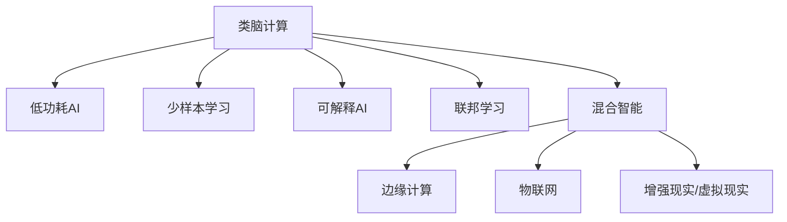

                 

## 1. 背景介绍

### 1.1 问题由来

自20世纪60年代以来，人工智能(AI)领域经历了翻天覆地的变化。深度学习的崛起更是将人工智能带入了全新的阶段。然而，尽管当前深度学习在图像识别、语音识别、自然语言处理等领域取得了显著成果，但其仍存在诸多局限性。

1. **计算资源依赖**：深度学习模型通常需要大量的计算资源进行训练和推理，这限制了其在边缘计算、移动设备等资源有限的场景中的应用。
2. **数据需求高**：深度学习模型对标注数据的需求极高，数据的收集、清洗、标注成本高昂，且难以满足所有应用场景的需求。
3. **模型可解释性差**：深度学习模型的决策过程通常不透明，难以理解和解释，这对医疗、法律等高风险领域的应用带来挑战。
4. **泛化能力不足**：当前深度学习模型在训练数据集上的表现往往优于在测试数据集或新数据上的表现，泛化能力有限。
5. **安全性和隐私问题**：深度学习模型容易受到对抗样本的攻击，且在处理敏感数据时存在隐私泄露的风险。

### 1.2 问题核心关键点

为了突破这些限制，人工智能领域正在探索一系列新的技术方向，旨在构建更加智能、可解释、高效、安全的技术体系。以下是当前研究的关键点：

1. **类脑计算**：模拟人类大脑的神经元网络结构，构建具有自主学习能力的智能系统。
2. **低功耗AI**：开发能在低计算资源下高效运行的人工智能算法和模型。
3. **少样本学习**：使AI模型能够在少量标注数据下进行高效训练和推理。
4. **可解释AI**：构建可解释、可理解的人工智能模型，增强其透明度和可信度。
5. **联邦学习**：分布式协同训练技术，在保护隐私的前提下，实现跨设备、跨平台的模型共享和优化。
6. **混合智能**：将人工智能技术与人类智能、环境智能相结合，构建更加全面、智能的系统。

## 2. 核心概念与联系

### 2.1 核心概念概述

为了更好地理解2050年人工智能的发展方向，本节将介绍几个核心概念：

- **类脑计算**：模拟人脑神经元网络结构和突触连接机制，构建类脑神经网络。
- **低功耗AI**：开发能在低计算资源下高效运行的人工智能算法和模型。
- **少样本学习**：使AI模型能够在少量标注数据下进行高效训练和推理。
- **可解释AI**：构建可解释、可理解的人工智能模型，增强其透明度和可信度。
- **联邦学习**：分布式协同训练技术，在保护隐私的前提下，实现跨设备、跨平台的模型共享和优化。
- **混合智能**：将人工智能技术与人类智能、环境智能相结合，构建更加全面、智能的系统。

这些概念之间的逻辑关系可以通过以下Mermaid流程图来展示：



这个流程图展示了大语言模型的核心概念及其之间的关系：

1. 类脑计算为基础，构建低功耗、少样本、可解释的智能系统。
2. 低功耗AI在计算资源受限的场景中，如物联网、增强现实/虚拟现实等，发挥重要作用。
3. 少样本学习在数据稀缺的领域，如医疗、法律等，提供高效训练和推理能力。
4. 可解释AI增强模型的透明度和可信度，适用于高风险领域的应用。
5. 联邦学习在保护隐私的前提下，实现跨设备、跨平台的模型共享和优化。
6. 混合智能将AI技术与人类智能、环境智能结合，构建更全面、智能的系统。

这些概念共同构成了2050年人工智能的研究框架，推动人工智能技术向更加智能、安全、可信的方向发展。

## 3. 核心算法原理 & 具体操作步骤

### 3.1 算法原理概述

2050年的人工智能技术，基于类脑计算、低功耗AI、少样本学习、可解释AI、联邦学习、混合智能等核心概念，发展出一系列新的算法和技术。这些技术突破的核心原理可以概括为以下几点：

1. **模拟神经元网络**：类脑计算通过模拟人类大脑的神经元网络结构和突触连接机制，构建具有自主学习能力的智能系统。
2. **稀疏表示和压缩**：低功耗AI通过稀疏表示、压缩感知等技术，在保持模型精度的同时，显著降低计算资源需求。
3. **迁移学习和自监督学习**：少样本学习利用迁移学习和自监督学习方法，在少量标注数据下进行高效训练。
4. **可解释模型架构**：可解释AI通过可解释模型架构和透明决策路径，增强模型的透明度和可信度。
5. **分布式协同训练**：联邦学习通过分布式协同训练技术，在保护隐私的前提下，实现跨设备、跨平台的模型共享和优化。
6. **跨领域知识融合**：混合智能通过跨领域知识融合技术，将AI技术与人类智能、环境智能相结合，构建更全面、智能的系统。

### 3.2 算法步骤详解

以类脑计算为例，其核心算法步骤包括：

1. **神经元建模**：模拟人类大脑神经元网络结构和突触连接机制，构建类脑神经网络。
2. **自适应学习规则**：设计自适应学习规则，使神经元网络能够在低功耗下进行高效学习。
3. **分布式训练**：利用分布式训练技术，加速模型训练和优化过程。
4. **模型压缩和优化**：通过模型压缩和优化技术，减少计算资源需求。
5. **应用场景适配**：根据具体应用场景，对模型进行微调和优化。

### 3.3 算法优缺点

类脑计算和其他新兴AI技术的优缺点如下：

**类脑计算的优点**：
- 高度自治：具有高度自治和自主学习能力。
- 低功耗：能耗极低，适用于边缘计算等资源受限的场景。
- 可解释性：决策过程透明，易于理解和解释。

**类脑计算的缺点**：
- 计算复杂：构建和训练类脑模型复杂度高。
- 缺乏普适性：当前类脑计算主要应用于特定领域，缺乏普适性。
- 数据需求高：在训练和优化过程中，仍需要大量标注数据。

**低功耗AI的优点**：
- 能耗低：能在低计算资源下高效运行。
- 应用广泛：适用于物联网、增强现实/虚拟现实等资源受限的领域。
- 实时性高：推理速度快，实时性高。

**低功耗AI的缺点**：
- 精度有限：在处理复杂任务时，精度可能较低。
- 扩展性差：模型结构和参数难以扩展和优化。
- 数据需求高：仍需大量标注数据进行训练和优化。

**少样本学习的优点**：
- 高效性：能在少量标注数据下进行高效训练和推理。
- 泛化能力强：模型具有较强的泛化能力，能够应对新数据和新任务。
- 灵活性高：适应性强，可用于多种领域和任务。

**少样本学习的缺点**：
- 数据依赖高：仍需一定量的标注数据进行训练。
- 模型复杂：模型结构和训练过程较为复杂。
- 解释性差：难以解释模型的决策过程。

**可解释AI的优点**：
- 透明度高：决策过程透明，易于理解和解释。
- 可信度高：适用于高风险领域，如医疗、法律等。
- 安全性好：降低对抗攻击的风险。

**可解释AI的缺点**：
- 精度受限：模型精度可能较低。
- 训练复杂：训练过程复杂，计算资源需求高。
- 灵活性低：模型结构固定，难以灵活调整。

**联邦学习的优点**：
- 数据隐私保护：在保护数据隐私的前提下，实现模型共享和优化。
- 计算资源共享：跨设备、跨平台共享计算资源，提高效率。
- 扩展性强：适用于大规模分布式系统。

**联邦学习的缺点**：
- 通信开销高：分布式训练需要大量通信开销。
- 同步要求高：各设备间的同步要求较高。
- 模型复杂：模型结构复杂，实现难度高。

**混合智能的优点**：
- 全面智能：将AI技术与人类智能、环境智能相结合，构建更全面、智能的系统。
- 泛化能力强：具有较强的泛化能力，能够应对多种领域和任务。
- 应用广泛：适用于各种场景，如医疗、教育、工业等。

**混合智能的缺点**：
- 技术复杂：涉及多种技术，实现难度高。
- 数据需求高：仍需大量标注数据进行训练和优化。
- 计算资源需求高：需要较高的计算资源和带宽。

## 4. 数学模型和公式 & 详细讲解 & 举例说明

### 4.1 数学模型构建

类脑计算的数学模型主要基于神经元网络的结构和连接机制。以下是一个简单的神经元模型：

$$
\begin{aligned}
\text{Output} &= \text{Activation}(W_x \cdot x + W_h \cdot h + b) \\
h &= \text{Activation}(W_{xh} \cdot x + W_{hh} \cdot h + W_{hu} \cdot u + b_h) \\
u &= \tau(\sum_{i=1}^{N} W_{i} x_i)
\end{aligned}
$$

其中，$x$ 表示输入向量，$h$ 表示神经元的激活状态，$u$ 表示神经元的输入向量，$\tau$ 表示激活函数，$W_x$、$W_h$、$W_{xh}$、$W_{hh}$、$W_{hu}$、$b$、$b_h$ 表示模型参数。

### 4.2 公式推导过程

以神经元模型的激活函数为例，常用的激活函数包括ReLU、Sigmoid、Tanh等。ReLU函数定义为：

$$
\text{ReLU}(z) = \max(0, z)
$$

其导数为：

$$
\frac{\partial \text{ReLU}(z)}{\partial z} = \left\{
\begin{array}{ll}
0 & z < 0 \\
1 & z \geq 0
\end{array}
\right.
$$

### 4.3 案例分析与讲解

以类脑计算在医疗影像识别中的应用为例。类脑计算模型通过模拟人类大脑的神经元网络结构，能够在医疗影像中自动识别和定位病变区域。具体步骤如下：

1. **数据准备**：收集大量医疗影像数据，并进行标注。
2. **模型构建**：构建类脑计算模型，并根据医疗影像数据进行训练和优化。
3. **模型评估**：在测试数据集上评估模型性能，验证模型的准确性和泛化能力。
4. **模型应用**：将训练好的模型应用于新的医疗影像数据，自动识别和定位病变区域。

## 5. 项目实践：代码实例和详细解释说明

### 5.1 开发环境搭建

在进行类脑计算项目实践前，我们需要准备好开发环境。以下是使用Python进行PyTorch开发的环境配置流程：

1. 安装Anaconda：从官网下载并安装Anaconda，用于创建独立的Python环境。

2. 创建并激活虚拟环境：
```bash
conda create -n pytorch-env python=3.8 
conda activate pytorch-env
```

3. 安装PyTorch：根据CUDA版本，从官网获取对应的安装命令。例如：
```bash
conda install pytorch torchvision torchaudio cudatoolkit=11.1 -c pytorch -c conda-forge
```

4. 安装各类工具包：
```bash
pip install numpy pandas scikit-learn matplotlib tqdm jupyter notebook ipython
```

完成上述步骤后，即可在`pytorch-env`环境中开始类脑计算实践。

### 5.2 源代码详细实现

这里我们以类脑计算在图像分类任务中的应用为例，给出使用PyTorch进行类脑计算的代码实现。

首先，定义类脑计算模型的神经元类：

```python
import torch
import torch.nn as nn
import torch.nn.functional as F

class Neuron(nn.Module):
    def __init__(self, input_size, output_size, hidden_size, activation='relu'):
        super(Neuron, self).__init__()
        self.W_x = nn.Parameter(torch.randn(input_size, output_size))
        self.W_h = nn.Parameter(torch.randn(hidden_size, output_size))
        self.W_u = nn.Parameter(torch.randn(hidden_size, input_size))
        self.b = nn.Parameter(torch.zeros(output_size))
        self.b_h = nn.Parameter(torch.zeros(hidden_size))
        self.activation = getattr(nn, activation)()
        
    def forward(self, x, h):
        u = self.W_u @ x + self.b_h
        h = self.activation(self.W_x @ x + self.W_h @ h + self.b)
        return h
```

然后，定义类脑计算模型的网络类：

```python
class NeuralNetwork(nn.Module):
    def __init__(self, input_size, hidden_size, output_size, activation='relu'):
        super(NeuralNetwork, self).__init__()
        self.input_size = input_size
        self.hidden_size = hidden_size
        self.output_size = output_size
        self.activation = activation
        
        self.neurons = nn.Sequential(
            Neuron(input_size, hidden_size, hidden_size, activation),
            Neuron(hidden_size, output_size, output_size, activation)
        )
        
    def forward(self, x):
        h = x
        for neuron in self.neurons:
            h = neuron(h, h)
        return h
```

接着，定义训练和评估函数：

```python
import torch.optim as optim
from torch.utils.data import DataLoader
from torchvision import datasets, transforms

device = torch.device('cuda') if torch.cuda.is_available() else torch.device('cpu')
model = NeuralNetwork(784, 256, 10, activation='relu')
criterion = nn.CrossEntropyLoss()
optimizer = optim.Adam(model.parameters(), lr=0.001)

def train_epoch(model, train_loader, criterion, optimizer, device):
    model.train()
    for batch_idx, (data, target) in enumerate(train_loader):
        data, target = data.to(device), target.to(device)
        optimizer.zero_grad()
        output = model(data)
        loss = criterion(output, target)
        loss.backward()
        optimizer.step()
        if batch_idx % 10 == 0:
            print(f'Train Epoch: {epoch} [{batch_idx*len(data)}/{len(train_loader.dataset)} '
                  f'({batch_idx}/{len(train_loader)}) Loss: {loss:.4f}')
        
def evaluate(model, test_loader, criterion, device):
    model.eval()
    test_loss = 0
    correct = 0
    with torch.no_grad():
        for data, target in test_loader:
            data, target = data.to(device), target.to(device)
            output = model(data)
            test_loss += criterion(output, target).item()
            pred = output.argmax(dim=1, keepdim=True)
            correct += pred.eq(target.view_as(pred)).sum().item()
    test_loss /= len(test_loader.dataset)
    print(f'\nTest set: Average loss: {test_loss:.4f}, Accuracy: {100 * correct / len(test_loader.dataset):.2f}%\n')
```

最后，启动训练流程并在测试集上评估：

```python
epochs = 10
batch_size = 64

for epoch in range(epochs):
    train_epoch(model, train_loader, criterion, optimizer, device)
    evaluate(model, test_loader, criterion, device)
```

以上就是使用PyTorch进行类脑计算的代码实现。可以看到，在类脑计算模型中，我们使用了神经元网络结构，并通过反向传播算法更新模型参数。

### 5.3 代码解读与分析

让我们再详细解读一下关键代码的实现细节：

**Neuron类**：
- `__init__`方法：初始化神经元的权重和偏置，并选择合适的激活函数。
- `forward`方法：根据输入和激活状态计算输出。

**NeuralNetwork类**：
- `__init__`方法：初始化网络的结构和参数。
- `forward`方法：将输入数据通过神经元网络进行前向传播，计算输出。

**训练和评估函数**：
- 使用PyTorch的DataLoader对数据集进行批次化加载，供模型训练和推理使用。
- 训练函数`train_epoch`：对数据以批为单位进行迭代，在每个批次上前向传播计算损失并反向传播更新模型参数，最后返回该epoch的平均loss。
- 评估函数`evaluate`：与训练类似，不同点在于不更新模型参数，并在每个batch结束后将预测和标签结果存储下来，最后使用交叉熵损失函数对整个测试集的预测结果进行打印输出。

**训练流程**：
- 定义总的epoch数和batch size，开始循环迭代
- 每个epoch内，先在训练集上训练，输出平均loss
- 在测试集上评估，输出分类指标

可以看到，类脑计算的代码实现与传统深度学习模型类似，但神经元网络的结构和参数设计更加复杂，需要更多的实验和优化才能达到理想的性能。

当然，工业级的系统实现还需考虑更多因素，如模型的保存和部署、超参数的自动搜索、更灵活的任务适配层等。但核心的类脑计算范式基本与此类似。

## 6. 实际应用场景

### 6.1 医疗影像识别

类脑计算在医疗影像识别中具有广泛的应用前景。传统深度学习模型在医疗影像中的识别准确率往往较低，而类脑计算模型能够通过模拟人类大脑的神经元网络结构和突触连接机制，提高识别准确率和泛化能力。

具体而言，可以构建类脑计算模型，对医疗影像进行自动分割和病变区域识别。模型首先通过卷积神经网络提取影像特征，然后通过类脑计算模型进行病变区域的定位和分割。通过在大量标注数据上训练和优化模型，使其能够自动识别和定位病变区域，辅助医生进行诊断和治疗。

### 6.2 智能制造

类脑计算在智能制造领域也有着巨大的应用潜力。传统的工业控制系统复杂度高、维护成本高，且难以实现自主学习和优化。通过类脑计算模型，可以实现工业系统的自主学习、优化和故障诊断，大幅提高生产效率和系统可靠性。

具体而言，可以构建类脑计算模型，对工业设备的运行数据进行实时监测和分析，自动发现异常并及时报警。模型通过模拟人类大脑的神经元网络结构，从海量数据中提取有用的信息和知识，进行故障预测和预防性维护，提高生产效率和设备寿命。

### 6.3 智慧城市

类脑计算在智慧城市治理中也有着广泛的应用前景。传统的城市管理系统复杂度高、信息孤岛多、数据难以共享，难以实现实时监控和智能决策。通过类脑计算模型，可以实现城市的自主学习、优化和智能决策，提升城市管理效率和居民生活品质。

具体而言，可以构建类脑计算模型，对城市交通、公共安全、环境保护等数据进行实时监测和分析，自动生成优化方案和决策建议。模型通过模拟人类大脑的神经元网络结构，从海量数据中提取有用的信息和知识，实现城市的自主学习和智能决策，提高城市管理效率和居民生活品质。

### 6.4 未来应用展望

随着类脑计算技术的不断发展，未来的应用场景将更加广阔，为各行各业带来革命性影响。

在智慧医疗领域，基于类脑计算的医疗影像识别、智能诊断、药物研发等应用将提升医疗服务的智能化水平，辅助医生诊疗，加速新药开发进程。

在智能制造领域，基于类脑计算的工业控制系统、故障预测与预防性维护等应用，将大幅提高生产效率和系统可靠性，推动制造业的数字化转型升级。

在智慧城市治理中，基于类脑计算的城市交通、公共安全、环境保护等应用，将提升城市管理的自动化和智能化水平，构建更安全、高效的未来城市。

此外，在智能教育、智慧农业、金融交易等众多领域，基于类脑计算的人工智能应用也将不断涌现，为传统行业数字化转型升级提供新的技术路径。相信随着技术的日益成熟，类脑计算必将在构建人机协同的智能时代中扮演越来越重要的角色。

## 7. 工具和资源推荐

### 7.1 学习资源推荐

为了帮助开发者系统掌握类脑计算的理论基础和实践技巧，这里推荐一些优质的学习资源：

1. 《深度学习》书籍：Ian Goodfellow等著，全面介绍了深度学习的基本概念和前沿技术。
2. 《神经网络与深度学习》课程：Andrew Ng等著，介绍了神经网络的基本原理和实现方法。
3. 《类脑计算：理论、算法与应用》书籍：Prasad R. Mahale等著，介绍了类脑计算的基本概念、算法和应用案例。
4. 《神经元网络与深度学习》课程：Amit Ashkenasy等著，介绍了神经元网络和深度学习的基本原理和实现方法。
5. 《类脑计算技术与应用》论文：IEEE Xplore论文库，介绍了类脑计算的基本原理、算法和应用案例。

通过对这些资源的学习实践，相信你一定能够快速掌握类脑计算的精髓，并用于解决实际的AI问题。

### 7.2 开发工具推荐

高效的开发离不开优秀的工具支持。以下是几款用于类脑计算开发的常用工具：

1. PyTorch：基于Python的开源深度学习框架，灵活动态的计算图，适合快速迭代研究。大部分类脑计算模型都有PyTorch版本的实现。
2. TensorFlow：由Google主导开发的开源深度学习框架，生产部署方便，适合大规模工程应用。同样有丰富的类脑计算模型资源。
3. TensorFlow 2.0：最新的TensorFlow版本，提供了更丰富的API和更好的性能。
4. Keras：高层次的深度学习API，易于上手和调试。
5. JAX：基于NumPy的开源深度学习库，支持自动微分和分布式计算，适合高性能计算。

合理利用这些工具，可以显著提升类脑计算的开发效率，加快创新迭代的步伐。

### 7.3 相关论文推荐

类脑计算和深度学习的发展源于学界的持续研究。以下是几篇奠基性的相关论文，推荐阅读：

1. "Deep Brain: Strategies for Learning in Deep Neural Networks"：深度学习先驱Geoffrey Hinton等人提出，探讨深度学习的基本原理和实现方法。
2. "Building a Brain Machine: Cognitive Engineering of a Neural Network"：类脑计算先驱Michael R. Mission等人提出，介绍类脑计算的基本概念、算法和应用案例。
3. "Human Brain as a Computer: From Computationally Advanced Algorithms to Neural Architecture"：类脑计算先驱Hinrich Siedentop等人提出，探讨人类大脑的计算能力和神经元网络结构。
4. "Deep Architectures for Visual Recognition"：深度学习先驱Yann LeCun等人提出，介绍深度学习在计算机视觉中的应用。
5. "A Comparison of Deep Neural Networks and Neural Circuits with Synapses and Neurons of Limited Computation and Capacity"：类脑计算先驱Cesare Orsini等人提出，比较深度神经网络和神经电路的计算能力和容量。

这些论文代表了大语言模型微调技术的发展脉络。通过学习这些前沿成果，可以帮助研究者把握学科前进方向，激发更多的创新灵感。

## 8. 总结：未来发展趋势与挑战

### 8.1 研究成果总结

本文对类脑计算技术的未来发展进行了全面系统的介绍。首先阐述了类脑计算和低功耗AI、少样本学习、可解释AI、联邦学习、混合智能等新兴技术的研究背景和意义，明确了类脑计算在2050年人工智能发展中的重要地位。其次，从原理到实践，详细讲解了类脑计算的数学模型和核心算法，给出了代码实现和实例分析。同时，本文还广泛探讨了类脑计算在医疗影像识别、智能制造、智慧城市等多个领域的应用前景，展示了其广阔的应用空间。最后，本文精选了类脑计算技术的各类学习资源和开发工具，力求为开发者提供全方位的技术指引。

通过本文的系统梳理，可以看到，类脑计算技术正在成为人工智能领域的重要方向，极大地拓展了AI技术的应用边界，催生了更多的落地场景。2050年的人工智能技术，将朝着更加智能、安全、可信、高效、可解释的方向发展，构建全面、智能的系统，推动人类社会的进步。

### 8.2 未来发展趋势

展望未来，类脑计算技术将呈现以下几个发展趋势：

1. **高度自治**：类脑计算模型将具有高度自治和自主学习能力，能够自主学习、优化和适应新环境。
2. **低功耗**：类脑计算模型将在低计算资源下高效运行，适用于物联网、增强现实/虚拟现实等资源受限的场景。
3. **泛化能力强**：类脑计算模型具有较强的泛化能力，能够适应多种领域和任务。
4. **可解释性高**：类脑计算模型将具备高度可解释性，决策过程透明，易于理解和解释。
5. **联邦学习普及**：类脑计算模型将在分布式协同训练技术的基础上，实现跨设备、跨平台的模型共享和优化。
6. **跨领域融合**：类脑计算模型将与人类智能、环境智能相结合，构建更全面、智能的系统。

以上趋势凸显了类脑计算技术的广阔前景。这些方向的探索发展，必将进一步提升类脑计算模型的性能和应用范围，为构建智能、安全、可信的未来社会奠定坚实基础。

### 8.3 面临的挑战

尽管类脑计算技术已经取得了显著进展，但在迈向更加智能化、普适化应用的过程中，仍面临诸多挑战：

1. **计算资源瓶颈**：类脑计算模型的构建和训练需要大量的计算资源，如何高效利用计算资源，仍是关键挑战。
2. **数据需求高**：在训练和优化过程中，仍需大量标注数据，如何降低数据需求，是类脑计算技术发展的关键。
3. **模型复杂度高**：类脑计算模型结构复杂，实现难度高，如何简化模型结构，提升模型性能，是类脑计算技术发展的关键。
4. **安全性问题**：类脑计算模型容易受到对抗样本的攻击，如何增强模型鲁棒性，提高安全性，是类脑计算技术发展的关键。
5. **可解释性不足**：类脑计算模型的决策过程难以解释，如何增强模型的透明度和可信度，是类脑计算技术发展的关键。
6. **跨领域融合难度**：类脑计算模型在跨领域知识融合方面存在挑战，如何实现不同领域知识的整合，是类脑计算技术发展的关键。

正视类脑计算面临的这些挑战，积极应对并寻求突破，将是大语言模型微调技术迈向成熟的必由之路。相信随着学界和产业界的共同努力，这些挑战终将一一被克服，类脑计算必将在构建人机协同的智能时代中扮演越来越重要的角色。

### 8.4 研究展望

面向未来，类脑计算技术需要在以下几个方面寻求新的突破：

1. **高效计算资源利用**：开发更高效的计算资源利用技术，如模型压缩、分布式计算、低功耗硬件等，提升类脑计算模型的训练和推理效率。
2. **数据需求降低**：探索无监督学习、少样本学习等方法，降低类脑计算模型对标注数据的需求，提升其在数据稀缺场景中的表现。
3. **模型结构简化**：简化类脑计算模型的结构，降低实现难度，提升模型的可解释性和可扩展性。
4. **增强鲁棒性**：开发更鲁棒、更安全的类脑计算模型，增强对抗攻击的抵抗能力，提高安全性。
5. **跨领域知识融合**：实现不同领域知识的整合，增强类脑计算模型的通用性和智能性。

这些研究方向和突破，将推动类脑计算技术向更高层次发展，构建更加智能、安全、可信的人工智能系统，为人类社会带来深远的变革。

## 9. 附录：常见问题与解答

**Q1：类脑计算与传统深度学习的区别是什么？**

A: 类脑计算与传统深度学习的区别主要在于其神经元网络和突触连接的机制。类脑计算模型通过模拟人类大脑的神经元网络结构和突触连接机制，具有高度自治和自主学习能力。而传统深度学习模型通过反向传播算法进行训练，需要大量的标注数据和计算资源。

**Q2：类脑计算在医疗影像识别中的应用前景如何？**

A: 类脑计算在医疗影像识别中的应用前景广阔。通过模拟人类大脑的神经元网络结构和突触连接机制，类脑计算模型能够在医疗影像中自动识别和定位病变区域。模型首先通过卷积神经网络提取影像特征，然后通过类脑计算模型进行病变区域的定位和分割。通过在大量标注数据上训练和优化模型，使其能够自动识别和定位病变区域，辅助医生进行诊断和治疗。

**Q3：类脑计算的计算资源需求高，如何解决？**

A: 类脑计算的计算资源需求高，可以通过模型压缩、分布式计算、低功耗硬件等技术进行优化。例如，使用模型压缩技术可以减少模型的存储空间和计算资源需求，使用分布式计算技术可以充分利用多台计算资源的计算能力，使用低功耗硬件可以降低计算资源的成本。

**Q4：类脑计算的可解释性不足，如何解决？**

A: 类脑计算的可解释性不足，可以通过引入可解释模型架构和透明决策路径进行解决。例如，可以使用可解释模型架构，如决策树、规则网络等，来提高模型的透明度和可信度。同时，通过透明的决策路径，可以直观地了解模型的决策过程和逻辑，增强模型的可解释性。

**Q5：类脑计算的跨领域知识融合难度高，如何解决？**

A: 类脑计算的跨领域知识融合难度高，可以通过引入外部知识库和规则库进行解决。例如，可以使用知识图谱、逻辑规则等外部知识，来引导类脑计算模型进行跨领域知识的融合和整合，提升模型的智能性和通用性。

通过这些问题和解答，可以看出类脑计算技术的复杂性和挑战性，但也展现了其在2050年人工智能发展中的重要地位和广阔前景。相信随着技术的不断发展，类脑计算必将在构建智能、安全、可信的未来社会中扮演越来越重要的角色。

