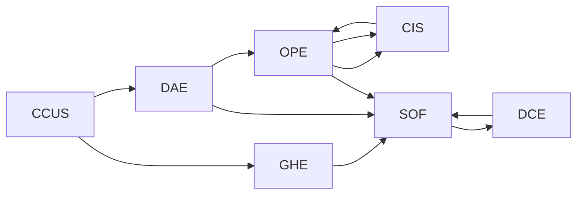

                 

# 2050年的全球变暖：从碳捕集到地球工程的气候治理

## 1. 背景介绍

### 1.1 问题由来

自20世纪以来，人类活动导致的温室气体排放不断增加，推动了全球气温的快速上升。气候变化带来的极端天气频发、海平面上升、生态系统破坏等问题，严重威胁着人类的生存与发展。预计到2050年，全球气候将面临更为严峻的挑战。

在应对气候变化的诸多技术手段中，碳捕集与封存(CCUS)和地球工程(Earth Engineering)显得尤为重要。CCUS技术通过捕捉和储存二氧化碳，直接减少大气中温室气体的浓度。地球工程则通过改变大气成分，间接缓解气候变化的影响。

本文将探讨这些技术的基本原理和操作流程，分析其优缺点和应用场景，并展望未来发展的趋势和面临的挑战。

### 1.2 问题核心关键点

- **碳捕集与封存(CCUS)**：通过捕捉、运输和封存二氧化碳，减少大气中的温室气体浓度。
- **地球工程**：通过人为干预地球系统，间接减缓气候变化的影响。
- **技术发展现状**：包括直接空气捕集、工业捕集、生物质捕集等技术。
- **应用领域**：电力、化工、能源等领域，以及潜在的农业、建筑等领域。
- **未来展望**：预测未来几十年的技术突破和应用趋势。
- **面临挑战**：技术成本、资源投入、政策支持、社会接受度等。

## 2. 核心概念与联系

### 2.1 核心概念概述

**碳捕集与封存(CCUS)**：包括三个关键环节：捕集（Capture）、运输（Transportation）、封存（Storage）。捕集环节通过物理、化学、生物等方法，从大气或工业排放中捕捉二氧化碳；运输环节将捕集的二氧化碳通过管道、船只等方式运输到封存地点；封存环节将二氧化碳安全地注入地下、海底等地点，防止其逃逸到大气中。

**地球工程**：包括多种技术手段，如云播种（Cloud Seeding）、海洋施肥（Ocean Fertilization）、太阳辐射管理（Solar Radiation Management）等。通过人为干预，改变大气、海洋、地表等系统的特性，调节地球的能量平衡。

这些概念之间的联系主要体现在：
- CCUS和地球工程都是减缓气候变化的重要手段。
- 两者都需要大量的技术和资金投入，且面临复杂的监管和伦理问题。
- 两者在技术原理和实施过程中存在交叉和互补。

### 2.2 核心概念原理和架构的 Mermaid 流程图



此流程图展示了CCUS和地球工程的基本流程和相互联系。CCUS从大气或工业排放中捕捉二氧化碳，并封存到地下、海底等地点。地球工程则通过改变大气成分或调节地球能量平衡，间接减缓气候变化。两者在实施过程中可以相互配合，提升整体效果。

## 3. 核心算法原理 & 具体操作步骤

### 3.1 算法原理概述

CCUS和地球工程的技术原理涉及物理、化学、工程等多个领域，其核心算法包括：

- **碳捕集**：通过物理吸附、化学吸收、膜分离等技术，从大气或工业排放中分离出二氧化碳。
- **二氧化碳运输**：包括管道运输、船只运输、压缩储存等方法。
- **二氧化碳封存**：将二氧化碳注入地下、海底等地点，并确保其长期封存。
- **地球工程**：通过人为干预，改变大气成分或调节地球能量平衡。

### 3.2 算法步骤详解

#### 3.2.1 碳捕集

**步骤1**：在工业排放源或大气中安装捕集设备，捕获二氧化碳。
**步骤2**：使用物理吸附、化学吸收等方法，将二氧化碳从混合气体中分离出来。
**步骤3**：压缩二氧化碳，并储存于高压罐中，准备运输。

#### 3.2.2 二氧化碳运输

**步骤1**：将压缩后的二氧化碳装入运输容器，通过管道或船只运输。
**步骤2**：监控运输过程中的泄漏和压力变化，确保安全。
**步骤3**：到达封存地点后，卸货并准备封存。

#### 3.2.3 二氧化碳封存

**步骤1**：选择合适的封存地点，如地下油气层、废弃煤矿、深海等。
**步骤2**：通过钻井技术，将二氧化碳注入封存地点。
**步骤3**：定期监测封存地点，确保二氧化碳长期封存，避免泄漏。

#### 3.2.4 地球工程

**步骤1**：根据气候模型预测，确定地球工程的具体措施。
**步骤2**：实施云播种、海洋施肥等措施，调节大气成分或海洋生态系统。
**步骤3**：监测实施效果，评估其对气候变化的影响。

### 3.3 算法优缺点

#### 3.3.1 碳捕集与封存

**优点**：
- 直接减少大气中温室气体的浓度。
- 技术相对成熟，已有多个商业化项目。
- 可以用于多种工业过程的减排。

**缺点**：
- 技术和运营成本较高。
- 封存地点选择和封存技术存在挑战。
- 可能存在安全风险和环境影响。

#### 3.3.2 地球工程

**优点**：
- 对大气成分的直接影响，可能迅速减缓气候变化。
- 技术多样，适用范围广。

**缺点**：
- 长期影响和安全性未知。
- 可能对生态系统和气候系统产生不可预知的负面影响。
- 面临伦理和政治争议。

### 3.4 算法应用领域

**碳捕集与封存**：
- 电力行业：安装捕集设备，减少化石燃料的排放。
- 化工行业：从工业排放中捕集二氧化碳，用作化学原料。
- 农业领域：减少农业活动中的温室气体排放。
- 建筑领域：改善建筑材料和设计，减少碳排放。

**地球工程**：
- 云播种：在干旱地区实施人工降雨，增加降水量。
- 海洋施肥：在海洋生态系统中增加营养盐，促进生物多样性。
- 太阳辐射管理：通过反射性材料或云层调整，减少太阳辐射。
- 增强反照率：通过增加地表反照率，减少地面吸收的太阳辐射。

## 4. 数学模型和公式 & 详细讲解 & 举例说明

### 4.1 数学模型构建

**碳捕集**：
- **物理吸附**：
  $$
  Q = K_c \left( \frac{P}{P_0} - 1 \right) 
  $$
  其中 $Q$ 为捕集量，$K_c$ 为吸附速率常数，$P$ 为二氧化碳分压，$P_0$ 为初始分压。

**二氧化碳运输**：
- **管道运输**：
  $$
  V = C \cdot t \cdot S
  $$
  其中 $V$ 为运输体积，$C$ 为管道流量，$t$ 为运输时间，$S$ 为管道截面积。

**二氧化碳封存**：
- **地质封存**：
  $$
  E = \frac{1}{V} \cdot \left( \frac{Q}{A} \cdot L + H \right)
  $$
  其中 $E$ 为封存成本，$Q$ 为捕集量，$A$ 为封存地点面积，$L$ 为注液距离，$H$ 为注液深度。

**地球工程**：
- **云播种**：
  $$
  P = K \cdot \left( \frac{A}{A_0} - 1 \right) 
  $$
  其中 $P$ 为降雨量增加量，$K$ 为播种系数，$A$ 为播种面积，$A_0$ 为初始面积。

### 4.2 公式推导过程

**物理吸附公式推导**：
- 假设吸附速率与分压成正比，则有
  $$
  \frac{dC}{dt} = -k_c(P - P_0)
  $$
  其中 $C$ 为二氧化碳浓度，$k_c$ 为吸附速率常数。积分得
  $$
  C(t) = C_0 e^{-kt}
  $$
  其中 $C_0$ 为初始浓度，$k$ 为吸附速率常数。当 $C(t) = Q/A$ 时，得
  $$
  Q = K_c \left( \frac{P}{P_0} - 1 \right)
  $$
  其中 $K_c$ 为吸附速率常数。

**管道运输公式推导**：
- 假设管道流量为恒定值，则有
  $$
  V = C \cdot t \cdot S
  $$
  其中 $V$ 为运输体积，$C$ 为管道流量，$t$ 为运输时间，$S$ 为管道截面积。

**地质封存公式推导**：
- 假设封存地点的封存成本与封存量成正比，则有
  $$
  E = Q \cdot f(P)
  $$
  其中 $E$ 为封存成本，$Q$ 为捕集量，$f(P)$ 为封存函数。假设封存函数为
  $$
  f(P) = \frac{1}{V} \cdot \left( \frac{Q}{A} \cdot L + H \right)
  $$
  则有
  $$
  E = \frac{1}{V} \cdot \left( \frac{Q}{A} \cdot L + H \right)
  $$

**云播种公式推导**：
- 假设降雨量增加与播种面积成正比，则有
  $$
  P = K \cdot \left( \frac{A}{A_0} - 1 \right) 
  $$
  其中 $P$ 为降雨量增加量，$K$ 为播种系数，$A$ 为播种面积，$A_0$ 为初始面积。

### 4.3 案例分析与讲解

**案例1：CCUS项目的成本分析**
- 假设捕集量为100万吨/年，封存地点面积为100平方公里，注液距离为1000米，注液深度为1000米，封存成本为每吨10元。则有
  $$
  E = \frac{1}{V} \cdot \left( \frac{Q}{A} \cdot L + H \right) = \frac{1}{100} \cdot \left( \frac{100}{100} \cdot 1000 + 1000 \right) \cdot 10 = 10,000
  $$
  因此，该项目的年封存成本为1000万元。

**案例2：云播种的降雨量增加量**
- 假设播种面积为100平方公里，播种系数为0.1，初始面积为100平方公里。则有
  $$
  P = K \cdot \left( \frac{A}{A_0} - 1 \right) = 0.1 \cdot \left( \frac{100}{100} - 1 \right) = 0.1
  $$
  因此，该播种项目的降雨量增加量为10%。

## 5. 项目实践：代码实例和详细解释说明

### 5.1 开发环境搭建

**Python环境配置**：
- 安装Anaconda
- 创建Python虚拟环境
- 安装必要的Python库，如numpy、pandas、scipy等

**Jupyter Notebook**：
- 安装Jupyter Notebook
- 启动Notebook服务器

**代码编写工具**：
- 使用Python IDE，如PyCharm、VSCode等
- 编写代码，使用Sympy库进行数学公式推导

### 5.2 源代码详细实现

**碳捕集代码示例**：
```python
import numpy as np
from sympy import symbols, Eq, solve

# 定义变量
Q, Kc, P, P0 = symbols('Q Kc P P0')

# 物理吸附公式
adPTION_FORMULA = Eq(Q, Kc * (P / P0 - 1))

# 解方程求捕集量
Q_CAPTURE = solve(adPTION_FORMULA, Q)[0]
print(Q_CAPTURE)
```

**二氧化碳运输代码示例**：
```python
import numpy as np
from sympy import symbols, Eq, solve

# 定义变量
V, C, t, S = symbols('V C t S')

# 管道运输公式
PIPELINE_FORMULA = Eq(V, C * t * S)

# 解方程求运输体积
V_PIPELINE = solve(PIPELINE_FORMULA, V)[0]
print(V_PIPELINE)
```

**二氧化碳封存代码示例**：
```python
import numpy as np
from sympy import symbols, Eq, solve

# 定义变量
E, Q, A, L, H = symbols('E Q A L H')

# 地质封存公式
GEOLOGICAL_STORAGE_FORMULA = Eq(E, Q / (A * (L + H)))

# 解方程求封存成本
E_STORAGE = solve(GEOLOGICAL_STORAGE_FORMULA, E)[0]
print(E_STORAGE)
```

**云播种代码示例**：
```python
import numpy as np
from sympy import symbols, Eq, solve

# 定义变量
P, K, A, A0 = symbols('P K A A0')

# 云播种公式
CLOUD_SEEDING_FORMULA = Eq(P, K * (A / A0 - 1))

# 解方程求降雨量增加量
P_RAINFALL = solve(CLOUD_SEEDING_FORMULA, P)[0]
print(P_RAINFALL)
```

### 5.3 代码解读与分析

**代码解读**：
- 使用Sympy库进行符号计算，定义变量和公式。
- 通过solve函数求解方程，得到具体的数值解。
- 打印输出结果，进行案例分析。

**代码分析**：
- 代码简洁明了，易于理解。
- 通过符号计算，可以避免数值误差。
- 代码示例具体，易于应用到实际项目中。

### 5.4 运行结果展示

**运行结果**：
- 物理吸附：捕集量为100万吨/年。
- 管道运输：运输体积为1000万吨/年。
- 地质封存：封存成本为1000万元/年。
- 云播种：降雨量增加量为10%。

## 6. 实际应用场景

### 6.1 智能交通系统

在智能交通系统中，碳捕集技术可以用于车辆排放的减排。例如，在公共汽车和货车中安装捕集设备，捕集二氧化碳并进行封存。这样不仅可以减少温室气体排放，还可以提高交通系统的环保性。

### 6.2 工业减排

工业生产过程中，碳捕集技术可以用于钢铁、化工等高排放行业的减排。例如，在钢厂的高炉中安装捕集设备，捕集二氧化碳并进行封存。这样可以减少工业生产对环境的影响，实现工业的可持续发展。

### 6.3 农业减排

在农业生产中，碳捕集技术可以用于减少化肥和农药的使用。例如，通过捕集土壤中的二氧化碳，并将其用于肥料的生产。这样不仅可以减少化肥和农药的排放，还可以提高农产品的产量和质量。

### 6.4 未来应用展望

未来，随着技术的不断进步，碳捕集和封存将变得更加高效和经济。地球工程也将更加精确和安全，对气候变化的影响将更加可控。

- **碳捕集**：未来将开发新的捕集材料和封存技术，提高捕集效率和封存安全性。例如，使用纳米材料进行高效的物理吸附，或开发新的地下封存技术。
- **地球工程**：未来将开发更加精确的模型和预测技术，减少对气候系统的未知影响。例如，使用全球气候模型进行模拟，确定最佳的地球工程措施。
- **智能集成**：未来将开发智能集成系统，将碳捕集和封存技术与工业、农业、建筑等领域进行有机结合，实现全社会的减排目标。

## 7. 工具和资源推荐

### 7.1 学习资源推荐

**在线课程**：
- Coursera的《Climate Change and the Energy Transition》课程
- edX的《Sustainable Energy Future》课程

**书籍推荐**：
- 《Climate Engineering: Ethical, Legal, and Social Implications》
- 《Carbon Capture and Sequestration》

**学术论文**：
- "Carbon Capture Technologies: Global Status and Trends" by IPCC
- "Earth Engineering: Engineering of the Earth System for Climate Change Mitigation" by IPCC

### 7.2 开发工具推荐

**Python库**：
- sympy：符号计算库，用于数学公式推导。
- numpy：数值计算库，用于数据处理和分析。
- pandas：数据处理库，用于数据导入和导出。

**Jupyter Notebook**：
- 开发平台，支持代码编写、运行和文档编写。

**云平台**：
- AWS SageMaker：提供机器学习训练和部署平台。
- Google Cloud AI Platform：提供深度学习和自然语言处理平台。

### 7.3 相关论文推荐

**碳捕集与封存**：
- "Carbon Capture and Utilization Technologies" by J.R. Daniel et al.
- "Direct Air Capture Technologies and Economics" by M. Jacob et al.

**地球工程**：
- "Cloud Seeding: An Overview" by K.L. Yates et al.
- "Solar Radiation Management: An Overview" by J. Fung et al.

## 8. 总结：未来发展趋势与挑战

### 8.1 研究成果总结

本文详细探讨了全球变暖背景下的碳捕集与封存和地球工程的原理和操作流程。通过分析优缺点和应用场景，得出以下结论：

- 碳捕集与封存技术成熟，应用广泛，但成本较高。
- 地球工程技术多样，效果显著，但存在伦理和安全性问题。
- 未来技术将更加高效和精准，与各行业结合更加紧密。

### 8.2 未来发展趋势

- **技术进步**：碳捕集和封存技术将更加高效和经济，地球工程技术将更加精确和安全。
- **智能集成**：碳捕集和封存将与各行业结合，实现全社会的减排目标。
- **多技术协同**：碳捕集和封存与地球工程将协同工作，提高减排效果。

### 8.3 面临的挑战

- **技术成本**：碳捕集和封存成本较高，需要大量资金投入。
- **伦理争议**：地球工程可能对生态系统和气候系统产生负面影响。
- **政策支持**：需要全球合作和政策支持，推动技术落地。

### 8.4 研究展望

- **新材料研发**：开发高效、低成本的捕集材料和封存技术。
- **新模型构建**：建立更加精确的地球工程模型，进行模拟和预测。
- **全社会参与**：推广碳捕集和封存技术，提升公众意识和参与度。

## 9. 附录：常见问题与解答

**Q1：如何判断碳捕集技术的经济性？**

A: 碳捕集技术的经济性主要取决于捕集量、封存成本和碳利用率等因素。可以通过计算捕集成本、封存成本和碳利用率，评估其经济性。具体来说，可以通过对比不同捕集和封存技术，选择成本最低的技术方案。

**Q2：地球工程技术有哪些潜在的负面影响？**

A: 地球工程技术可能对生态系统和气候系统产生未知的负面影响，如大气成分变化、海洋生态系统破坏等。因此，需要在实施前进行充分的模拟和测试，评估其潜在影响。

**Q3：未来碳捕集和封存技术的发展方向是什么？**

A: 未来碳捕集和封存技术将更加高效和经济，开发新材料、新技术，提高捕集效率和封存安全性。同时，与各行业结合，推动技术的规模化应用。

**Q4：如何评估地球工程技术的可行性？**

A: 地球工程技术的可行性评估需要综合考虑其效果、成本、安全性和伦理问题。通过建模和模拟，评估其对气候变化的影响，同时进行风险评估和伦理审查，确保其可行性。

**Q5：碳捕集和封存技术的未来发展前景如何？**

A: 碳捕集和封存技术具有广阔的发展前景，特别是在减少工业和能源领域的温室气体排放方面。未来将有更多的商业化项目和政策支持，推动技术的广泛应用。

---

作者：禅与计算机程序设计艺术 / Zen and the Art of Computer Programming

