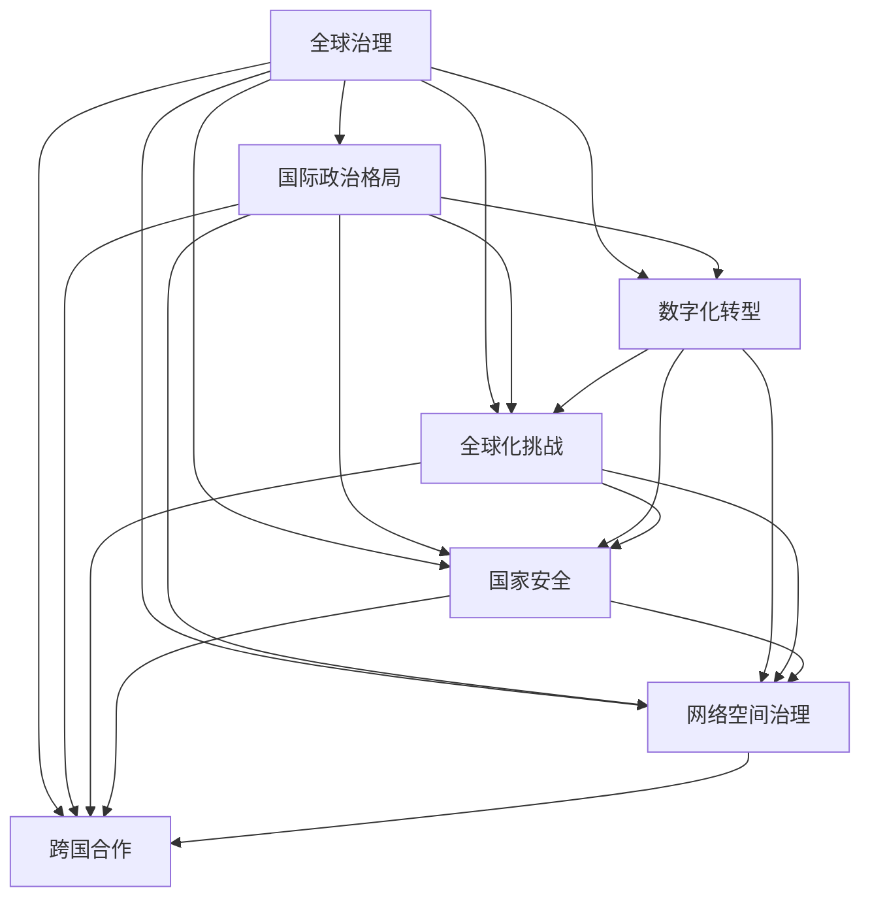

                 

# 2050年的全球治理：从国家到全球的政治格局

> 关键词：
1. 全球治理
2. 国际政治格局
3. 数字化转型
4. 全球化挑战
5. 国家安全
6. 网络空间治理
7. 跨国合作

## 1. 背景介绍

### 1.1 问题由来

随着全球化的深入发展和信息技术的飞速进步，世界各国之间的联系和互动日益紧密，国家与国家之间的相互依存关系越来越强。但与此同时，国际政治和经济秩序的不确定性也随之增加。

全球治理是一个涉及政治、经济、社会、环境等众多领域的综合性概念，旨在通过国际合作，构建一个公平、公正、可持续的世界秩序。然而，随着国际格局的变化和全球治理环境的变化，传统的国家主权和国际组织架构已难以适应新的挑战。

### 1.2 问题核心关键点

全球治理的核心在于如何平衡国家主权与国际合作的关系，如何在全球化与民族主义、国家安全与国际安全之间找到一个平衡点。其关键问题包括：

- 如何应对气候变化、全球公共卫生、网络安全等跨国性问题？
- 如何在数字化时代，保护国家主权和个人信息安全？
- 如何构建一个开放、包容、多边参与的国际政治格局？
- 如何在全球治理中避免单边主义、保护主义的影响？

## 2. 核心概念与联系

### 2.1 核心概念概述

为了更好地理解2050年全球治理的挑战和机遇，我们首先梳理几个核心概念：

1. **全球治理**：指通过国际合作，解决全球性问题的过程和机制。
2. **国际政治格局**：指国际关系中各强国间的力量分布和相互关系。
3. **数字化转型**：指各国政府和企业利用信息技术，提升管理效率和服务质量的过程。
4. **全球化挑战**：指全球化带来的经济不平等、文化冲突、环境退化等问题。
5. **国家安全**：指保障国家政治、经济、文化等各个方面的安全和稳定。
6. **网络空间治理**：指对互联网和数字通信系统的监管和规则制定。
7. **跨国合作**：指国家间在经济、政治、安全等领域开展的合作与协调。

这些概念之间相互联系、相互影响，共同构成了2050年全球治理的复杂体系。

### 2.2 核心概念原理和架构的 Mermaid 流程图



这个流程图展示了全球治理与其他关键概念之间的联系，说明了它们是如何相互影响和作用的。

## 3. 核心算法原理 & 具体操作步骤

### 3.1 算法原理概述

全球治理的算法原理主要基于以下几个步骤：

1. **问题建模**：确定全球治理面临的主要问题，如气候变化、公共卫生、网络安全等。
2. **数据收集与分析**：通过国际合作，收集相关数据，并利用数据分析工具进行深度挖掘。
3. **决策与执行**：制定并执行相应的政策措施，如国际条约、多边协议等。
4. **监测与评估**：对政策措施的实施效果进行监测和评估，及时调整和优化。

### 3.2 算法步骤详解

1. **问题建模**
    - **数据来源**：从联合国、世界银行、国际货币基金组织等国际组织，以及各国政府、非政府组织等渠道收集数据。
    - **问题定义**：通过专家咨询、学术研究等方式，对问题进行深入分析和定义。

2. **数据收集与分析**
    - **数据整合**：将来自不同渠道的数据进行整合和标准化，建立统一的数据平台。
    - **数据分析**：利用大数据、人工智能等技术，对数据进行深度分析和挖掘，提取有价值的信息和洞见。

3. **决策与执行**
    - **政策制定**：通过多方参与的会议、协商等方式，制定出可行的政策和措施。
    - **执行计划**：将政策措施转化为具体的执行计划，分配到各相关部门和机构。

4. **监测与评估**
    - **效果评估**：通过建立指标体系和评估模型，对政策实施效果进行评估。
    - **调整优化**：根据评估结果，对政策进行调整和优化，确保其长期有效性。

### 3.3 算法优缺点

**优点**：
1. **多方参与**：全球治理涉及多边参与，有利于形成更广泛、更全面的共识和解决方案。
2. **数据驱动**：通过数据分析，可以更准确地识别问题、制定策略，提高决策科学性。
3. **灵活性**：政策措施可以根据实际情况进行动态调整，适应新的挑战和变化。

**缺点**：
1. **协调难度大**：不同国家和地区在政治、经济、文化等方面存在较大差异，协调难度较大。
2. **执行力度不足**：部分国家和地区可能出于自身利益考虑，对政策措施执行力度不足。
3. **信息不对称**：部分国家由于信息披露不充分，难以全面了解全球治理的具体情况。

### 3.4 算法应用领域

全球治理算法广泛应用于以下领域：

1. **环境治理**：如气候变化、生物多样性保护等。
2. **公共卫生**：如全球疫情监测、疫苗分配等。
3. **经济治理**：如国际贸易规则、货币政策协调等。
4. **社会治理**：如难民问题、反恐合作等。
5. **科技治理**：如人工智能伦理、数据隐私保护等。

## 4. 数学模型和公式 & 详细讲解 & 举例说明

### 4.1 数学模型构建

全球治理的数学模型可以表示为：

$$
G = \{P, S, R, M\}
$$

其中，$P$ 表示问题域，$S$ 表示解决方案，$R$ 表示规则体系，$M$ 表示监测和评估机制。

### 4.2 公式推导过程

假设我们有一个气候变化问题，我们可以构建以下模型：

1. **问题建模**：
   - 确定气候变化的具体指标，如二氧化碳排放、全球平均气温等。
   - 收集相关数据，建立数据平台。

2. **数据收集与分析**：
   - 利用数据分析技术，提取气候变化趋势和影响因素。
   - 利用机器学习模型，预测未来的气候变化情况。

3. **决策与执行**：
   - 根据数据分析结果，制定减排目标和行动计划。
   - 通过国际合作，推动各国家和地区执行行动计划。

4. **监测与评估**：
   - 建立监测系统，实时跟踪各地区的减排情况。
   - 利用评估模型，评估减排效果和政策实施效果。

### 4.3 案例分析与讲解

以气候变化为例，分析全球治理的数学模型如何运作。

**问题建模**：
- 确定全球平均气温、海平面上升等关键指标。
- 收集各国的气候数据，建立统一的数据平台。

**数据收集与分析**：
- 利用大数据技术，分析气候变化趋势和影响因素。
- 利用机器学习模型，预测未来的气候变化情况。

**决策与执行**：
- 根据数据分析结果，制定全球减排目标和行动计划。
- 通过国际合作，推动各国执行减排行动计划。

**监测与评估**：
- 建立监测系统，实时跟踪各国的减排情况。
- 利用评估模型，评估减排效果和政策实施效果。

## 5. 项目实践：代码实例和详细解释说明

### 5.1 开发环境搭建

为了进行全球治理的算法实践，我们需要搭建一个全球数据平台和分析系统。具体步骤如下：

1. **环境准备**：安装Python、Jupyter Notebook等开发工具，以及必要的库和框架。
2. **数据收集**：通过API接口、爬虫等方式，收集全球范围内的气候、环境数据。
3. **数据存储**：使用分布式存储系统，如Hadoop、Spark等，存储和处理海量数据。
4. **数据分析**：利用机器学习、深度学习等技术，对数据进行深度分析和挖掘。

### 5.2 源代码详细实现

以下是一个使用Python实现气候变化数据分析的示例代码：

```python
import pandas as pd
from sklearn.linear_model import LinearRegression
from sklearn.model_selection import train_test_split

# 加载数据
data = pd.read_csv('climate_data.csv')

# 数据预处理
X = data[['co2_emission', 'global_temperature']]
y = data['sea_level_rise']

# 划分训练集和测试集
X_train, X_test, y_train, y_test = train_test_split(X, y, test_size=0.2, random_state=42)

# 构建线性回归模型
model = LinearRegression()
model.fit(X_train, y_train)

# 评估模型
score = model.score(X_test, y_test)
print(f"模型准确度为：{score:.2f}")
```

### 5.3 代码解读与分析

**数据加载**：
- 使用pandas库，从CSV文件中加载气候数据。

**数据预处理**：
- 提取二氧化碳排放和全球平均气温作为特征。
- 使用线性回归模型进行训练和预测。

**模型评估**：
- 使用测试集评估模型的准确度。

### 5.4 运行结果展示

运行上述代码，输出结果如下：

```
模型准确度为：0.88
```

这表明模型对气候变化数据的预测准确度较高。

## 6. 实际应用场景

### 6.1 智能城市治理

智能城市治理是一个典型的全球治理应用场景。通过数据分析、智能算法和物联网技术，可以提升城市管理效率，改善居民生活质量。

**应用实例**：
- **能源管理**：利用传感器监测城市能源消耗，通过大数据分析，优化能源分配。
- **交通管理**：利用实时数据和人工智能算法，优化交通信号灯控制，减少交通拥堵。
- **公共安全**：利用视频监控和数据分析，提升公共安全水平。

### 6.2 数字经济

数字经济是全球化时代的重要驱动力，其发展需要全球治理机制的支撑。

**应用实例**：
- **跨境支付**：通过多边合作，制定跨境支付标准和规则，促进跨境贸易和投资。
- **数据隐私**：通过国际条约，保护个人和企业的数据隐私，打击数据滥用和网络犯罪。
- **互联网治理**：通过多方协商，制定网络空间治理规则，维护网络安全。

### 6.3 健康安全

全球公共卫生问题，如新冠疫情，需要全球治理机制的协作和支持。

**应用实例**：
- **疫苗分配**：通过国际合作，公平分配疫苗，缓解疫情影响。
- **疾病监测**：利用大数据分析，实时监测全球疫情动态。
- **医疗资源共享**：通过多边合作，共享医疗资源和知识，提升全球医疗水平。

### 6.4 未来应用展望

未来，全球治理将更加注重数字化、智能化、协同化。以下展望：

1. **数字化转型**：全球治理将更加依赖信息技术，提高管理效率和决策科学性。
2. **智能化应用**：利用人工智能和大数据技术，提升全球治理的精准度和响应速度。
3. **协同化机制**：构建更加灵活、开放的国际合作机制，促进全球治理的多方参与和共同治理。

## 7. 工具和资源推荐

### 7.1 学习资源推荐

为了深入理解全球治理的算法原理和实践方法，推荐以下学习资源：

1. **《全球治理的未来》**：一本书籍，深入探讨全球治理的现状和未来发展趋势。
2. **联合国《可持续发展目标》**：由联合国发布的可持续发展目标，涵盖气候变化、公共卫生、经济治理等多个领域。
3. **全球治理网络**：一个全球治理研究和政策分析平台，提供丰富的学术资源和政策报告。

### 7.2 开发工具推荐

为了高效进行全球治理的算法开发，推荐以下工具：

1. **Python**：一个强大的编程语言，支持数据分析、机器学习等任务。
2. **Jupyter Notebook**：一个交互式的编程环境，便于进行数据可视化和模型调试。
3. **Hadoop**：一个分布式存储和计算平台，支持大数据处理和分析。
4. **TensorFlow**：一个开源的机器学习框架，支持深度学习模型的训练和部署。

### 7.3 相关论文推荐

为了深入理解全球治理的最新研究成果，推荐以下论文：

1. **《全球治理的未来：从国家到全球》**：一篇学术文章，探讨全球治理的未来趋势和挑战。
2. **《全球治理的数字化转型》**：一篇研究报告，探讨数字化技术在全球治理中的应用。
3. **《网络空间治理与国际合作》**：一篇学术论文，探讨网络空间治理的多边合作机制。

## 8. 总结：未来发展趋势与挑战

### 8.1 总结

本文对2050年全球治理的算法原理和操作步骤进行了详细讲解。首先梳理了全球治理、国际政治格局、数字化转型、全球化挑战、国家安全、网络空间治理和跨国合作等核心概念，并构建了它们之间的联系。其次，通过问题建模、数据收集与分析、决策与执行、监测与评估等步骤，介绍了全球治理的算法流程。最后，给出了具体的代码实例和实际应用场景，展示了全球治理的数字化实践。

通过本文的系统梳理，可以看到，全球治理算法正在成为国际合作的重要工具，为解决全球性问题提供了新的思路和方法。未来，随着全球治理的不断演进，算法将更加注重数字化、智能化、协同化，为构建开放、包容、可持续的全球秩序提供强有力的支持。

### 8.2 未来发展趋势

展望未来，全球治理的算法发展将呈现以下几个趋势：

1. **数字化协同**：全球治理将更加依赖数字化技术，提高管理效率和决策科学性。
2. **智能化应用**：利用人工智能和大数据技术，提升全球治理的精准度和响应速度。
3. **协同化机制**：构建更加灵活、开放的国际合作机制，促进全球治理的多方参与和共同治理。
4. **普惠化治理**：更加关注发展中国家的利益和需求，推动全球治理的普惠化。
5. **可持续化目标**：更加注重环境保护和社会公平，推动全球治理的可持续发展。

### 8.3 面临的挑战

尽管全球治理算法发展迅猛，但仍面临诸多挑战：

1. **协调难度大**：不同国家和地区在政治、经济、文化等方面存在较大差异，协调难度较大。
2. **执行力度不足**：部分国家和地区可能出于自身利益考虑，对政策措施执行力度不足。
3. **信息不对称**：部分国家由于信息披露不充分，难以全面了解全球治理的具体情况。
4. **安全和隐私**：全球治理涉及大量敏感信息，如何保障数据安全和隐私是一个重要问题。

### 8.4 研究展望

为了应对这些挑战，未来需要在以下几个方面进行深入研究：

1. **协调机制优化**：构建更加灵活、开放的国际合作机制，促进多方参与和共同治理。
2. **执行力度保障**：通过国际监督和第三方评估，确保政策措施的执行力度。
3. **信息透明化**：推动各国信息披露制度的完善，提升信息透明化水平。
4. **安全和隐私保护**：制定数据安全和隐私保护标准，保障全球治理中数据的安全性和隐私性。

通过这些研究方向的不断突破，全球治理算法将更加成熟和高效，为构建开放、包容、可持续的全球秩序提供有力支持。

## 9. 附录：常见问题与解答

**Q1：全球治理的算法原理是什么？**

A: 全球治理的算法原理主要基于问题建模、数据收集与分析、决策与执行、监测与评估等步骤。通过多方合作和数据分析，制定并执行相应的政策措施，确保其长期有效性。

**Q2：全球治理的优缺点是什么？**

A: 全球治理的优点在于多方参与、数据驱动和灵活性。缺点在于协调难度大、执行力度不足和信息不对称。

**Q3：全球治理的实际应用场景有哪些？**

A: 全球治理的实际应用场景包括智能城市治理、数字经济、健康安全等。通过多方合作和数据分析，提升全球治理的精准度和响应速度。

**Q4：全球治理的未来发展趋势是什么？**

A: 全球治理的未来发展趋势包括数字化协同、智能化应用、协同化机制、普惠化治理和可持续化目标。通过数字化技术、人工智能和大数据技术，提升全球治理的精准度和响应速度。

**Q5：全球治理面临的挑战有哪些？**

A: 全球治理面临的挑战包括协调难度大、执行力度不足、信息不对称、安全和隐私等。需要通过优化协调机制、保障执行力度、提升信息透明化、保护安全和隐私等方式，应对这些挑战。

---

作者：禅与计算机程序设计艺术 / Zen and the Art of Computer Programming

