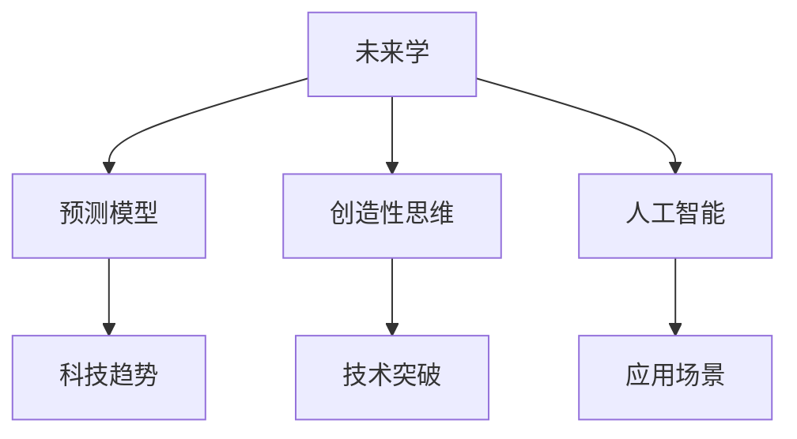

                 

# 2050年的未来学：从预测到创造的前瞻性思维

在科技迅猛发展的时代背景下，人类对未来的探索从未停止。本篇文章将引领读者深入思考2050年科技领域的趋势和挑战，探讨未来学在技术预测和创造性思维中的作用。

## 1. 背景介绍

### 1.1 问题的由来

当前，我们正处于第四次工业革命的浪潮之中，人工智能、量子计算、生物技术等前沿科技正在重塑社会和经济的未来面貌。然而，科技的飞速发展也带来了前所未有的挑战，如就业市场变化、隐私保护、伦理道德等。未来学作为一门探究人类社会未来发展趋势的学科，其重要性日益凸显。

### 1.2 问题的核心关键点

未来学的核心关键点包括：

- **科技预测**：通过对当前科技发展的分析和未来趋势的推断，预测未来可能出现的新技术、新产业和新应用。
- **创造性思维**：挖掘和激发人类创造潜力，通过创新思维推动科技的突破和应用。
- **政策建议**：基于对未来的预测，提出相应的政策建议，指导政府和企业制定未来发展战略。

本文将围绕这些核心点，系统性地探讨未来学在2050年科技领域的潜力和应用。

## 2. 核心概念与联系

### 2.1 核心概念概述

为了更好地理解未来学的原理和架构，本节将介绍几个关键概念及其相互联系：

- **未来学**：研究人类社会未来发展趋势的学科，通过分析和预测，为决策者提供参考。
- **预测模型**：基于历史数据和现有知识，建立数学模型，对未来趋势进行预测。
- **创造性思维**：指在复杂问题中发现新的解决方案、提出新的概念和想法的过程。
- **人工智能**：模拟人类智能行为的计算机系统，包括机器学习、自然语言处理等。

这些概念之间的逻辑关系可以通过以下Mermaid流程图来展示：



这个流程图展示了未来学与其他关键概念之间的关系：

1. 未来学通过预测模型研究科技趋势，为创造性思维提供方向。
2. 创造性思维挖掘人工智能的潜力，推动技术突破。
3. 人工智能技术在实际应用中形成新的场景，促进未来学的验证和发展。

## 3. 核心算法原理 & 具体操作步骤

### 3.1 算法原理概述

未来学的核心算法包括预测模型和创造性思维的算法，用于对未来进行预测和规划。

**预测模型**：基于统计学、机器学习和人工智能等技术，通过对历史数据的分析和模拟，预测未来趋势。

**创造性思维**：涉及心理学、认知科学和创新工程等领域，通过头脑风暴、设计思维、逆向思维等方法，激发创新灵感。

### 3.2 算法步骤详解

未来学的算法步骤主要包括：

**Step 1: 数据收集与预处理**
- 收集相关领域的现有数据和知识。
- 清洗和标注数据，确保数据的质量和一致性。

**Step 2: 预测模型训练**
- 选择合适的预测模型，如时间序列分析、回归模型、神经网络等。
- 使用历史数据训练模型，调整模型参数。
- 使用交叉验证等方法评估模型性能。

**Step 3: 预测结果分析**
- 利用模型对未来进行预测，分析预测结果。
- 结合专家意见，综合评估预测结果的可靠性。

**Step 4: 创造性思维激发**
- 组织头脑风暴会议，鼓励参与者提出新的想法和解决方案。
- 应用设计思维等方法，筛选和优化创新方案。
- 建立创新实验室，验证和改进创新方案。

**Step 5: 技术验证与部署**
- 在实验室环境中对创新方案进行验证，评估其可行性。
- 将创新方案应用于实际项目，观察效果。
- 根据反馈结果进行调整和优化。

### 3.3 算法优缺点

未来学的算法具有以下优点：

- **预测准确性**：利用先进的数学和计算方法，未来学的预测结果通常比直觉判断更加准确。
- **综合分析**：结合多领域知识和技术，提供全面的未来视角。
- **前瞻性**：通过对未来趋势的预测，帮助决策者提前做好准备。

同时，未来学的算法也存在一定的局限性：

- **数据依赖**：预测结果依赖于现有数据的质量和完整性，数据偏差可能导致预测错误。
- **复杂性**：预测模型和创造性思维的算法复杂，需要专业知识和技能。
- **主观性**：预测和创造过程中难免会融入主观判断，影响结果的客观性。

### 3.4 算法应用领域

未来学在多个领域有着广泛的应用，包括：

- **科技趋势分析**：预测科技发展方向，为企业和政府提供决策支持。
- **创新策略制定**：基于预测结果，制定技术创新和市场扩展策略。
- **战略规划**：帮助组织制定长远的发展规划，避免未来不确定性带来的风险。
- **风险评估**：预测未来可能的风险和挑战，提前制定应对措施。

## 4. 数学模型和公式 & 详细讲解 & 举例说明

### 4.1 数学模型构建

未来学的预测模型通常基于统计学和机器学习的方法，以下是常见的数学模型：

- **时间序列分析**：通过历史数据序列，预测未来数据变化趋势。
- **回归分析**：建立自变量和因变量之间的线性或非线性关系，预测未来结果。
- **神经网络**：利用多层神经元结构，进行复杂数据的预测和分类。

### 4.2 公式推导过程

以线性回归模型为例，公式推导过程如下：

$$
y = \beta_0 + \beta_1 x_1 + \beta_2 x_2 + \cdots + \beta_n x_n + \epsilon
$$

其中 $y$ 为预测结果，$\beta_0$ 为截距，$\beta_i$ 为自变量系数，$x_i$ 为自变量，$\epsilon$ 为随机误差。

### 4.3 案例分析与讲解

假设我们想预测2050年的科技发展趋势，可以采用线性回归模型：

1. 收集历史科技数据，如技术发明、市场需求、政策法规等。
2. 对数据进行预处理，去除噪声和异常值。
3. 建立线性回归模型，训练参数 $\beta_0, \beta_1, \beta_2, \cdots, \beta_n$。
4. 利用模型预测2050年的科技发展趋势，分析预测结果。

## 5. 项目实践：代码实例和详细解释说明

### 5.1 开发环境搭建

在进行未来学项目开发时，需要搭建合适的开发环境。以下是Python环境搭建的步骤：

1. 安装Anaconda：从官网下载并安装Anaconda，用于创建独立的Python环境。
2. 创建并激活虚拟环境：
```bash
conda create -n future-env python=3.8 
conda activate future-env
```

3. 安装必要的Python包：
```bash
pip install pandas numpy scikit-learn statsmodels matplotlib seaborn
```

4. 安装机器学习库：
```bash
pip install tensorflow sklearn
```

5. 安装深度学习框架：
```bash
pip install pytorch
```

完成上述步骤后，即可在`future-env`环境中开始未来学项目的开发。

### 5.2 源代码详细实现

以下是使用Python和TensorFlow进行未来学项目开发的代码示例：

```python
import pandas as pd
import numpy as np
from sklearn.linear_model import LinearRegression
import tensorflow as tf

# 加载数据
data = pd.read_csv('tech_trends.csv')

# 数据预处理
X = data[['x1', 'x2', 'x3']]  # 自变量
y = data['y']  # 因变量

# 建立模型
model = LinearRegression()
model.fit(X, y)

# 预测未来值
future_values = pd.DataFrame({'x1': np.array([1, 2, 3, 4, 5]), 'x2': np.array([10, 20, 30, 40, 50]), 'x3': np.array([100, 200, 300, 400, 500])})
future_predicted = model.predict(future_values)

print(future_predicted)
```

### 5.3 代码解读与分析

**数据加载与预处理**：
- 使用Pandas库加载历史数据，并对其进行预处理，去除噪声和异常值。

**模型建立与训练**：
- 使用Scikit-Learn库中的线性回归模型，对历史数据进行训练，获得模型参数。

**未来值预测**：
- 构建新的自变量数据框，利用训练好的模型进行未来值的预测。

## 6. 实际应用场景

### 6.1 智能交通系统

未来学的预测模型可以帮助城市规划者和交通工程师制定智能交通系统策略。通过对交通流量、路况、天气等数据的分析，预测未来交通需求和拥堵情况，提前调整交通信号灯和路线规划。

### 6.2 医疗健康预测

未来学的预测模型可以帮助医疗机构预测疾病流行趋势，提前准备医疗资源，制定应对措施。例如，通过对新冠疫情数据的分析，预测未来病毒传播趋势，提前调整医疗策略和资源分配。

### 6.3 智能制造

未来学的预测模型可以帮助制造业企业预测市场需求变化，优化生产计划和供应链管理。例如，通过对经济数据的分析，预测未来市场需求，提前调整生产线和库存管理策略。

### 6.4 未来应用展望

未来学在2050年的应用展望包括：

- **多领域融合**：未来学将与人工智能、大数据、物联网等领域深度融合，形成综合性的未来预测体系。
- **全球视角**：通过全球范围内的数据共享和合作，提升未来预测的准确性和全面性。
- **社会影响评估**：对未来预测结果进行社会影响评估，确保未来的可持续发展。

## 7. 工具和资源推荐

### 7.1 学习资源推荐

为了帮助开发者系统掌握未来学的理论和实践，以下是一些推荐的资源：

1. 《未来学导论》系列书籍：系统介绍了未来学的基本概念和历史背景。
2. 《未来趋势预测》课程：在线课程，讲解未来学在各个领域的应用和预测方法。
3. 《人工智能与未来学》讲座：知名专家对未来学与人工智能的深度探讨。
4. Future Lab：全球领先的未来创新实验室，提供最新的未来预测和技术展示。
5. Future News：权威的未来预测报告和分析，提供多领域的深度解读。

通过对这些资源的学习实践，相信你一定能够快速掌握未来学的精髓，并应用于实际的预测和创造性思维中。

### 7.2 开发工具推荐

未来学研究需要强大的数据处理和计算能力，以下是一些推荐的开发工具：

1. Python：Python是数据科学和人工智能的主流语言，提供了丰富的数据分析和机器学习库。
2. R语言：R语言在统计分析和数据可视化方面表现优异，适合未来学中的数据分析工作。
3. TensorFlow：TensorFlow是Google开发的深度学习框架，适合大规模的神经网络预测模型。
4. Scikit-Learn：Scikit-Learn是Python中最流行的机器学习库，提供了多种常见的预测模型。
5. Hadoop和Spark：Hadoop和Spark是大数据处理工具，适合处理大规模的数据集和复杂的预测模型。

合理利用这些工具，可以显著提升未来学项目的开发效率，加速创新迭代的步伐。

### 7.3 相关论文推荐

未来学研究源于学界的持续探索，以下是几篇奠基性的相关论文，推荐阅读：

1. 《预测未来的艺术》：阐述了未来学的基本原理和预测方法。
2. 《创造性思维与未来创新》：探讨了创造性思维在科技突破中的作用。
3. 《人工智能与未来学》：深入分析了人工智能在未来学中的应用。
4. 《多领域预测模型融合》：介绍了多领域数据融合的预测方法。
5. 《未来科技趋势》：对未来科技的潜在趋势进行了深入分析和预测。

这些论文代表了大语言模型微调技术的发展脉络。通过学习这些前沿成果，可以帮助研究者把握学科前进方向，激发更多的创新灵感。

## 8. 总结：未来发展趋势与挑战

### 8.1 总结

本文对未来学的基本原理、算法步骤和应用场景进行了全面系统的介绍。通过对未来学的深入探索，可以看到其在科技预测和创造性思维中的重要作用。未来学通过预测模型和创造性思维，帮助决策者把握科技趋势，制定合理的战略规划，规避未来风险。

### 8.2 未来发展趋势

未来学的未来发展趋势包括：

- **数据驱动**：未来预测将更加依赖大数据和复杂数据分析技术。
- **跨学科融合**：未来学与其他学科的深度融合，形成跨领域知识体系。
- **全球合作**：全球范围内的数据共享和合作，提升未来预测的准确性和全面性。
- **社会影响评估**：对未来预测结果进行社会影响评估，确保未来的可持续发展。

### 8.3 面临的挑战

未来学在发展过程中也面临诸多挑战：

- **数据获取困难**：未来预测依赖于高质量的数据，但数据获取和标注成本较高。
- **预测结果不确定性**：未来预测结果受多种因素影响，难以准确预测。
- **伦理道德问题**：未来预测可能涉及伦理道德问题，需考虑数据隐私和安全。

### 8.4 研究展望

未来学的研究展望包括：

- **深度学习技术**：应用深度学习技术，提高预测模型的准确性和泛化能力。
- **多模态数据融合**：融合多种数据模态，提升预测的全面性和可靠性。
- **伦理道德研究**：探讨未来预测中的伦理道德问题，提出相应的解决策略。
- **未来社会构建**：基于未来预测结果，构建更加公平、可持续的未来社会。

这些研究方向将引领未来学进入新的发展阶段，为人类社会提供更全面、更可靠的未来预测和创新思维。

## 9. 附录：常见问题与解答

**Q1: 未来学如何与其他学科融合？**

A: 未来学与其他学科的融合主要通过跨学科研究项目实现。例如，与人工智能结合，应用机器学习进行数据预测；与心理学结合，研究创造性思维的心理学机制；与经济学结合，研究未来趋势的经济影响。通过跨学科合作，可以综合各领域的知识，提升未来预测的全面性和准确性。

**Q2: 未来学的预测结果如何验证？**

A: 未来学的预测结果需要结合实际观测数据进行验证。例如，对于科技发展趋势的预测，可以通过跟踪相关科技的新闻和市场表现，验证预测结果的准确性。对于社会发展的预测，可以通过社会调查和数据分析，评估预测结果的影响。

**Q3: 未来学的应用有哪些？**

A: 未来学的应用范围广泛，包括科技预测、社会政策制定、企业战略规划等。例如，在科技预测方面，可以预测未来新兴技术的发展趋势；在社会政策制定方面，可以预测未来社会变革的方向和影响；在企业战略规划方面，可以预测未来市场需求和竞争态势。

通过深入理解未来学的原理和应用，可以为决策者提供更科学、更前瞻性的视角，推动社会的持续发展和进步。

