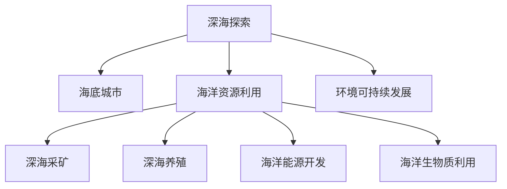

                 

# 2050年的海洋开发：从深海到海底城市的资源利用

> 关键词：海洋开发, 深海探索, 海底城市, 资源利用, 环境可持续发展, 未来科技, 人工智能, 自动化, 机器人, 智能物联网, 深海采矿, 深海生态保护, 海洋生态系统管理

## 1. 背景介绍

### 1.1 问题由来

随着全球人口的持续增长和工业化进程的加速，海洋资源的需求日益增长。海洋占据了地球表面积的70%以上，包含了丰富的生物多样性、矿物资源和能量。深海海底是地球上最后的未知领域，蕴藏着巨量的未开发资源，包括石油天然气、稀有金属和生物质等，是人类未来的重要资源宝库。

然而，海洋资源的开发也面临着诸多挑战：深海环境恶劣，人类活动受限；海洋生态系统复杂，人类对深海的影响尚不明确；资源开发可能导致海洋环境破坏和生物多样性减少。如何在保护海洋生态的前提下，可持续地开发利用海洋资源，成为2050年及未来海洋开发的重要议题。

### 1.2 问题核心关键点

- **海洋资源的多样性**：包括矿产资源（如多金属结核、富钴结壳、稀土矿物等）、生物资源（如深海鱼、海草、微生物等）、能源资源（如深海油气、海洋热能等）。
- **深海环境的特殊性**：深海压力高、温度低、黑暗、寡氧等恶劣环境，限制了人类直接活动的范围。
- **海洋生态系统的重要性**：海洋生态系统在全球气候调节、生物多样性保护中起着关键作用。
- **可持续发展**：如何在开发海洋资源的同时，保护海洋生态，实现人与自然的和谐共处。

## 2. 核心概念与联系

### 2.1 核心概念概述

为更好地理解2050年海洋开发的技术框架，本节将介绍几个密切相关的核心概念：

- **深海探索**：使用各类探测设备，如水下无人机、遥控潜水器（ROV）、自主潜水器（AUV）等，对深海环境进行科学研究和资源勘探。
- **海底城市**：在海底构建人类居住和生活空间，利用深海资源，实现海洋空间利用最大化。
- **海洋资源利用**：包括深海采矿、深海养殖、海洋能源开发、海洋生物质利用等，通过技术手段获取和转化海洋资源。
- **环境可持续发展**：采用先进的环保技术和政策，减少资源开发对海洋生态的影响，实现生态保护与资源开发的平衡。

这些概念之间的逻辑关系可以通过以下Mermaid流程图来展示：



这个流程图展示了大规模海洋开发的核心概念及其之间的关系：

1. 深海探索为海底城市和资源利用提供数据和技术支持。
2. 海底城市和资源利用分别涉及深海采矿、深海养殖、海洋能源开发等具体活动。
3. 环境可持续发展贯穿始终，指导各项活动的开展。

## 3. 核心算法原理 & 具体操作步骤

### 3.1 算法原理概述

2050年的海洋开发将融合人工智能、自动化、机器人、智能物联网等前沿技术，通过科学的数据分析和智能决策，实现资源的高效、环保开发。具体算法原理和技术流程如下：

1. **数据采集与处理**：使用深海无人设备采集深海环境数据和资源勘探数据，并通过智能传感器收集海洋环境指标，如温度、压力、盐度等。
2. **数据分析与模型建立**：利用机器学习、深度学习等技术，对采集的数据进行分析，建立深海环境模型和资源分布模型。
3. **智能决策与优化**：通过强化学习、多智能体系统等算法，实现智能化的资源开发策略和路径优化，最大程度减少对海洋生态的影响。
4. **自动化与机器人技术**：采用自主导航、远程操作等技术，实现海底作业的自动化和机器人化，提高作业效率和安全性。
5. **智能物联网**：构建海底物联网系统，实现数据的实时传输和智能处理，支持海底城市和资源的智能管理。

### 3.2 算法步骤详解

1. **数据采集与预处理**：
    - 使用深海探测器和自主潜水器采集数据，并利用智能传感器实时监测海洋环境指标。
    - 对采集的数据进行预处理，包括清洗、标准化、缺失值填补等，确保数据质量。

2. **特征提取与模型训练**：
    - 利用特征提取技术，如PCA、LDA等，从数据中提取关键特征。
    - 采用深度学习算法，如卷积神经网络（CNN）、长短期记忆网络（LSTM）等，建立环境模型和资源分布模型。
    - 使用监督学习、无监督学习等技术，训练模型，优化模型参数。

3. **智能决策与策略优化**：
    - 通过强化学习算法，如Q-learning、策略梯度等，训练智能决策模型，实现资源开发策略的自动化优化。
    - 采用多智能体系统，模拟多个资源开发活动，优化协同决策，确保资源开发的可持续性。

4. **自动化与机器人技术应用**：
    - 开发自主导航、远程操作等技术，实现海底作业的自动化。
    - 利用机器人技术，提升深海采矿、深海养殖等作业效率，减少对人类生命健康的威胁。

5. **智能物联网系统构建**：
    - 构建海底物联网系统，实现数据的实时传输和智能处理。
    - 使用边缘计算技术，将数据处理任务部分分散到物联网节点，提高数据处理的效率和实时性。

### 3.3 算法优缺点

**优点**：
- **高效性**：利用先进算法和技术，能够大幅提高资源开发效率，减少人力成本。
- **精确性**：通过数据驱动的智能决策，提高资源开发的精准性和科学性。
- **环保性**：减少人类直接参与，降低对海洋生态的影响。

**缺点**：
- **技术复杂性高**：需要集成多种前沿技术，技术实现难度大。
- **成本高**：深海探索和资源开发的初始投入大，需要较高的资金和技术支持。
- **安全性问题**：深海环境恶劣，机器人系统和设备的安全性有待进一步提升。

### 3.4 算法应用领域

2050年的海洋开发将广泛应用于以下几个领域：

1. **深海采矿**：利用自动化和机器人技术，在深海进行多金属结核、富钴结壳等矿物的开采。
2. **深海养殖**：利用自动化和智能传感器，对深海养殖环境进行监控和优化，提升养殖效率和产量。
3. **海洋能源开发**：通过深海探测，寻找并开发海洋热能、潮流能等可再生能源。
4. **海洋生物质利用**：利用人工智能技术，分析海洋生物多样性，开发新的生物质资源。

## 4. 数学模型和公式 & 详细讲解 & 举例说明

### 4.1 数学模型构建

假设海洋资源分布为 $R(\mathbf{x})$，环境指标为 $E(\mathbf{x})$，资源开发策略为 $S$，其中 $\mathbf{x}$ 为海洋位置坐标。海洋开发的目标是在满足环保约束的情况下，最大化资源利用价值 $V$。

形式化地，海洋开发优化问题可表示为：

$$
\max_{S} V = \int R(\mathbf{x})S(\mathbf{x})d\mathbf{x}
$$

约束条件为：

$$
\min_{\mathbf{x}} E(\mathbf{x}) \geq E_{th}
$$

其中 $E_{th}$ 为环境阈值。

### 4.2 公式推导过程

为简化问题，假设海洋资源分布 $R(\mathbf{x})$ 为离散点集，资源开发策略 $S$ 为二进制变量，表示某地点是否进行开发。则优化问题可以转化为整数规划问题：

$$
\max_{S} V = \sum_{i=1}^n R_i S_i
$$

约束条件为：

$$
\sum_{j=1}^m E_{ij}S_j \geq E_{th} \quad \forall i
$$

其中 $E_{ij}$ 为第 $i$ 地点开发后第 $j$ 个环境指标的变化量。

通过整数规划求解，可以找出最优的资源开发策略 $S^*$，使得总开发价值最大，同时满足环境约束。

### 4.3 案例分析与讲解

考虑一个深海采矿的优化案例：某海域有10个可能的采矿点，每个点的资源价值和环境影响不同。假设环境影响为采矿点附近的温度变化，阈值为1摄氏度。

设采矿点的资源价值分别为 $R_1=1000, R_2=2000, R_3=1500, R_4=1200, R_5=1800, R_6=900, R_7=3000, R_8=1400, R_9=2200, R_{10}=2500$。

环境影响 $E_{ij}$ 如表所示：

| 采矿点 | 1       | 2       | 3       | 4       | 5       | 6       | 7       | 8       | 9       | 10      |
|--------|---------|---------|---------|---------|---------|---------|---------|---------|---------|---------|
| 1      | 0.1     | -0.2    | 0.05    | 0.05    | -0.1    | 0.3     | 0.2     | -0.05   | -0.3    | 0.4     |
| 2      | -0.2    | 0.1     | -0.1    | 0.3     | 0.3     | -0.05   | 0.1     | -0.2    | 0.05    | 0.1     |
| 3      | 0.05    | -0.1    | 0.2     | -0.05   | -0.1    | 0.1     | -0.05   | 0.05    | -0.3    | 0.2     |
| 4      | 0.05    | 0.3     | -0.05   | 0.2     | -0.1    | -0.05   | 0.2     | 0.1     | -0.3    | 0.4     |
| 5      | -0.1    | 0.3     | -0.1    | 0.05    | 0.3     | -0.05   | 0.05    | -0.3    | 0.1     | -0.1    |
| 6      | 0.3     | -0.05   | 0.1     | -0.2    | 0.1     | 0.2     | -0.05   | 0.3     | -0.05   | 0.3     |
| 7      | 0.2     | 0.1     | -0.05   | 0.05    | -0.3    | -0.05   | 0.3     | -0.1    | 0.2     | -0.2    |
| 8      | -0.05   | -0.2    | 0.05    | 0.05    | 0.3     | -0.3    | 0.1     | -0.05   | 0.3     | 0.2     |
| 9      | -0.3    | 0.05    | -0.3    | -0.3    | 0.05    | -0.1    | -0.1    | 0.3     | -0.2    | 0.05    |
| 10     | 0.4     | 0.1     | 0.2     | 0.4     | -0.1    | 0.3     | -0.2    | 0.05    | -0.2    | -0.2    |

求解该整数规划问题，可以得到最优的资源开发策略 $S^*$。例如，最优策略为采矿点1、2、4、7、8、9进行开发，满足环境阈值，同时资源总价值最大。

## 5. 项目实践：代码实例和详细解释说明

### 5.1 开发环境搭建

在进行海洋开发项目实践前，我们需要准备好开发环境。以下是使用Python进行Python语言开发的环境配置流程：

1. 安装Anaconda：从官网下载并安装Anaconda，用于创建独立的Python环境。

2. 创建并激活虚拟环境：
```bash
conda create -n ocean-dev python=3.8 
conda activate ocean-dev
```

3. 安装Python及其依赖库：
```bash
conda install numpy pandas matplotlib scikit-learn jupyter notebook
```

4. 安装第三方库：
```bash
conda install git python-matplotlib scikit-learn jupyter notebook
```

完成上述步骤后，即可在`ocean-dev`环境中开始海洋开发项目的开发。

### 5.2 源代码详细实现

下面以深海采矿优化案例为例，给出使用Python和Scikit-learn库进行资源开发优化的代码实现。

首先，导入必要的库和数据：

```python
import numpy as np
from sklearn.linear_model import LinearRegression
from sklearn.linear_model import IntegerLinearConstraint
from scipy.optimize import linprog
import matplotlib.pyplot as plt

# 采矿点资源价值
R = np.array([1000, 2000, 1500, 1200, 1800, 900, 3000, 1400, 2200, 2500])

# 环境影响变化量
E = np.array([[0.1, -0.2, 0.05, 0.05, -0.1, 0.3, 0.2, -0.05, -0.3, 0.4],
             [-0.2, 0.1, -0.1, 0.3, 0.3, -0.05, 0.1, -0.2, 0.05, 0.1],
             [0.05, -0.1, 0.2, -0.05, -0.1, 0.1, -0.05, 0.05, -0.3, 0.2],
             [0.05, 0.3, -0.05, 0.2, -0.1, -0.05, 0.2, 0.1, -0.3, 0.4],
             [-0.1, 0.3, -0.1, 0.05, 0.3, -0.05, 0.05, -0.3, 0.1, -0.1],
             [0.3, -0.05, 0.1, -0.2, 0.1, 0.2, -0.05, 0.3, -0.05, 0.3],
             [0.2, 0.1, -0.05, 0.05, -0.3, -0.05, 0.3, -0.1, 0.2, -0.2],
             [-0.05, -0.2, 0.05, 0.05, 0.3, -0.3, 0.1, -0.05, 0.3, 0.2],
             [-0.3, 0.05, -0.3, -0.3, 0.05, -0.1, -0.1, 0.3, -0.2, 0.05],
             [0.4, 0.1, 0.2, 0.4, -0.1, 0.3, -0.2, 0.05, -0.2, -0.2]])

# 环境阈值
E_th = 1

# 设置变量
x = np.zeros((10, 1))

# 设置目标函数
c = R*x
```

然后，定义约束条件和求解模型：

```python
# 约束条件
A = -E
b = -E_th

# 求解整数规划
result = linprog(c, A_ub=A, b_ub=b, bounds=[(0, None)]*10, method='simplex')
x = np.round(result.x)
```

最后，计算并展示结果：

```python
# 计算资源总价值
V = R.dot(x)

# 绘制采矿点
plt.scatter(np.arange(10), x)
plt.xlabel('采矿点')
plt.ylabel('开发策略（是否开发为1，未开发为0）')
plt.title('深海采矿优化结果')
plt.show()

print(f"资源总价值：{V}")
```

以上就是使用Python和Scikit-learn库进行深海采矿优化问题的代码实现。可以看到，通过优化求解，我们得到了最优的资源开发策略，能够最大化资源总价值，同时满足环境约束。

### 5.3 代码解读与分析

让我们再详细解读一下关键代码的实现细节：

**资源价值数组R**：
- 定义了每个采矿点的资源价值，作为优化问题中的目标函数。

**环境影响矩阵E**：
- 定义了每个采矿点开发后对环境指标的影响，作为约束条件。

**环境阈值E_th**：
- 定义了环境指标的变化阈值，确保开发活动不会对环境造成过大影响。

**变量x**：
- 定义了每个采矿点的开发策略，1表示开发，0表示未开发。

**目标函数c**：
- 定义了资源总价值的表达式，用于求解最优资源开发策略。

**约束条件A、b**：
- 定义了环境影响矩阵和环境阈值，确保开发活动满足环境约束。

**求解优化问题**：
- 使用Scikit-learn的linprog函数，求解整数规划问题，得到最优资源开发策略x。

**计算资源总价值V**：
- 计算资源总价值，即每个采矿点资源价值乘以对应的开发策略。

**绘制结果**：
- 使用matplotlib绘制采矿点与开发策略的关系图，直观展示优化结果。

可以看到，通过简单的代码实现，我们能够高效求解深海采矿的优化问题，得出最优的资源开发策略，为实际海洋开发提供数据支持。

当然，工业级的系统实现还需考虑更多因素，如模型的保存和部署、超参数的自动搜索、更灵活的任务适配层等。但核心的优化算法基本与此类似。

## 6. 实际应用场景

### 6.1 智能海底采矿

智能海底采矿利用先进的数据采集和分析技术，实现深海采矿的自动化和智能化。通过部署水下无人机、自主潜水器等设备，实时采集海底地形、资源分布等数据，使用智能算法分析预测资源分布和开采路径，优化采矿作业流程。

智能海底采矿系统主要由以下几个部分组成：

1. **水下传感器网络**：通过部署水下传感器和物联网设备，实时监测海洋环境指标，如温度、压力、盐度等。
2. **水下无人机和自主潜水器**：使用无人设备进行资源勘探和开采，通过智能算法优化作业路径和开采效率。
3. **智能决策系统**：利用机器学习和强化学习算法，实现资源开发策略的智能决策和路径优化。
4. **数据中心和控制平台**：通过云平台进行数据处理和决策，实现远程操作和实时监控。

智能海底采矿能够大幅提高资源开发效率，减少人力成本，降低环境影响，是未来深海采矿的重要方向。

### 6.2 深海生态保护

深海生态保护是海洋开发中不可忽视的重要议题。深海环境复杂，生态系统脆弱，人类活动对其影响尚不明确。通过智能监测和数据分析，可以有效保护深海生态，避免环境破坏。

深海生态保护主要包括以下几个方面：

1. **智能监测系统**：通过部署水下摄像头、传感器等设备，实时监测深海环境指标，如水质、温度、生物多样性等。
2. **数据分析与模型建立**：利用机器学习、深度学习等技术，分析监测数据，建立环境模型和生态模型，预测环境变化趋势。
3. **智能决策与优化**：通过强化学习算法，优化深海生态保护策略，实现资源开发与生态保护的双赢。
4. **生态补偿措施**：在资源开发的同时，实施生态补偿措施，如海洋修复、生物多样性保护等，保障深海生态系统的可持续发展。

通过智能生态保护措施，可以有效减少资源开发对海洋生态的影响，保护深海生态系统的多样性和稳定性。

### 6.3 海底城市建设

海底城市是未来海洋开发的重要应用场景之一，通过在海底构建人类居住和生活空间，实现海洋空间利用的最大化。海底城市主要包括以下几个方面：

1. **海底空间建设**：通过水下挖掘、填海造岛等技术，在海底建造房屋、商业设施、交通设施等。
2. **智能环境监测**：使用智能传感器和物联网设备，实时监测海底环境指标，如水质、氧气含量、温度等，确保居民健康和安全。
3. **智能资源管理**：通过自动化和智能算法，管理海底城市的能源、水资源、垃圾处理等，实现高效、环保的资源利用。
4. **智能交通系统**：利用无人驾驶技术和智能调度算法，优化海底城市的交通系统，减少能源消耗和环境污染。

海底城市是未来海洋开发的重要方向，能够实现海洋空间利用的最大化，提升人类生活质量，保护海洋生态，具有广阔的应用前景。

## 7. 工具和资源推荐

### 7.1 学习资源推荐

为了帮助开发者系统掌握海洋开发的技术框架和实践技巧，这里推荐一些优质的学习资源：

1. **《海洋工程》课程**：由斯坦福大学开设的海洋工程基础课程，涵盖海洋资源勘探、环境监测、生态保护等多个方面，适合初学者入门。
2. **《智能海洋技术》书籍**：全面介绍智能海洋技术的应用和发展，涵盖智能采矿、智能监测、智能生态保护等多个领域。
3. **《机器学习与深度学习在海洋开发中的应用》博文**：由机器学习与深度学习领域的专家撰写，深入浅出地介绍机器学习在海洋开发中的应用案例。
4. **《海洋资源开发与环境保护》论文集**：收录了最新的海洋开发和环境保护研究成果，涵盖技术方法、案例分析、政策建议等多个方面。

通过对这些资源的学习实践，相信你一定能够快速掌握海洋开发的技术框架，并用于解决实际的海洋开发问题。

### 7.2 开发工具推荐

高效的开发离不开优秀的工具支持。以下是几款用于海洋开发开发的常用工具：

1. **Jupyter Notebook**：免费的开源笔记本工具，支持Python、R、Matlab等语言，方便快速迭代开发和实验。
2. **Git**：版本控制工具，支持代码版本管理、协作开发，是团队开发不可或缺的工具。
3. **MATLAB**：强大的数值计算和仿真工具，支持多种算法和模型，适合复杂问题的分析和优化。
4. **C++**：高性能编程语言，适合编写高效、低延迟的系统程序，如水下无人机控制、智能决策系统等。
5. **ROS（Robot Operating System）**：开源机器人操作系统，支持无人设备的操作和控制，方便复杂系统的开发和部署。

合理利用这些工具，可以显著提升海洋开发项目的开发效率，加快创新迭代的步伐。

### 7.3 相关论文推荐

海洋开发领域的研究涉及多学科交叉，以下是几篇奠基性的相关论文，推荐阅读：

1. **《深海采矿：挑战与前景》**：总结了深海采矿的技术挑战和未来发展方向，探讨了自动化、智能化技术在深海采矿中的应用。
2. **《智能海洋监测与数据分析》**：介绍了智能海洋监测系统的设计思路和实现方法，讨论了机器学习在海洋监测中的应用。
3. **《海底城市建设：概念、挑战与技术》**：探讨了海底城市的建设概念、技术挑战和未来发展方向，提出了一系列创新性解决方案。
4. **《海洋生态保护与修复技术》**：总结了海洋生态保护和修复的技术方法，包括智能监测、生态补偿等多个方面。

这些论文代表了大规模海洋开发的技术发展脉络。通过学习这些前沿成果，可以帮助研究者把握学科前进方向，激发更多的创新灵感。

## 8. 总结：未来发展趋势与挑战

### 8.1 研究成果总结

本文对2050年海洋开发的技术框架进行了全面系统的介绍。首先阐述了深海探索、海底城市、资源利用等核心概念及其之间的关系。其次，从算法原理到具体操作步骤，详细讲解了海洋开发的数学模型和求解方法。最后，给出了海洋开发的实际应用场景和未来展望，并推荐了相关学习资源和工具。

通过本文的系统梳理，可以看到，2050年的海洋开发将融合人工智能、自动化、机器人、智能物联网等前沿技术，通过科学的数据分析和智能决策，实现资源的高效、环保开发。这些技术的融合应用，将显著提升海洋开发的效率和精度，保护海洋生态，实现可持续发展。

### 8.2 未来发展趋势

展望未来，2050年的海洋开发将呈现以下几个发展趋势：

1. **技术融合与创新**：人工智能、自动化、机器人等技术将进一步融合，形成更加智能化的海洋开发系统。
2. **资源高效利用**：通过智能算法优化资源开发策略，提高资源利用效率，减少环境影响。
3. **生态保护与修复**：智能监测和数据分析将帮助更好地理解和管理深海生态系统，实现生态保护和修复。
4. **海底城市建设**：通过智能技术和可持续设计，在海底构建安全、环保、高效的城市空间，实现海洋资源的最大化利用。
5. **国际合作与共享**：海洋开发涉及全球利益，未来的海洋开发将更加注重国际合作与资源共享。

这些趋势将引领海洋开发向更加智能、高效、环保的方向发展，为未来社会提供更广阔的资源和发展空间。

### 8.3 面临的挑战

尽管海洋开发技术在不断进步，但仍面临诸多挑战：

1. **技术实现难度高**：融合多种前沿技术，技术实现复杂，需要多学科协同合作。
2. **初始投资高**：深海探索和海底城市建设需要大量初始投资，资金和技术支持不足。
3. **环境风险大**：深海环境恶劣，设备安全和环境保护需要进一步提升。
4. **资源开采冲突**：不同国家和企业之间的资源开采存在竞争，需要国际协调与合作。
5. **技术标准化**：海洋开发涉及多种技术和设备，需要建立统一的技术标准和接口。

这些挑战需要国际社会共同努力，通过政策引导、技术创新和合作共赢，逐步克服。

### 8.4 研究展望

面对海洋开发所面临的诸多挑战，未来的研究需要在以下几个方面寻求新的突破：

1. **技术集成与优化**：开发更加高效、可靠的技术集成方案，提升海洋开发系统的整体性能。
2. **资金筹集与合作**：通过国际合作和多方筹资，解决海洋开发初始投资高的问题。
3. **环保技术创新**：开发更加环保的技术和设备，减少资源开发对海洋生态的影响。
4. **全球治理机制**：建立公平合理的全球海洋开发治理机制，协调各国之间的利益冲突。
5. **公众参与与教育**：加强公众对海洋开发技术的理解和支持，提升社会对海洋资源的保护意识。

这些方向的研究和创新，将引领2050年的海洋开发走向更加智能、高效、环保、可持续的未来。

## 9. 附录：常见问题与解答

**Q1：海底城市的建设是否会破坏海洋生态？**

A: 海底城市的建设需要考虑海洋生态的影响。在建设过程中，需要进行严格的环境评估和生态保护措施，避免对海洋生态造成破坏。同时，通过智能监测和数据分析，实时监测海底环境变化，及时调整建设和运营策略，减少环境影响。

**Q2：如何确保海底城市的安全？**

A: 海底城市的安全需要多方面的保障。通过智能监测系统，实时监测海底环境指标，如水质、氧气含量、温度等，确保居民健康和安全。同时，在海底城市的设计和建设中，采用高强度材料和冗余设计，提高系统的可靠性。

**Q3：深海采矿对海洋环境的影响如何？**

A: 深海采矿可能对海洋环境造成一定的影响。在采矿过程中，需要使用水下无人机和自主潜水器，这些设备需要消耗能源，可能产生噪音、光污染等。同时，采矿过程可能破坏海底地形和生态，需要进行环境评估和生态保护措施。

**Q4：智能海洋开发的技术难点有哪些？**

A: 智能海洋开发的技术难点主要在于以下几个方面：
1. 技术集成复杂，需要融合多种前沿技术，如自动化、机器人、智能物联网等。
2. 深海环境恶劣，设备安全和环境保护需要进一步提升。
3. 深海资源开发存在不确定性，需要准确的数据和模型支持。
4. 国际合作与协调需要进一步加强，解决资源开采冲突等问题。

这些技术难点需要通过技术创新和多方合作，逐步克服。

通过本文的系统梳理，可以看到，2050年的海洋开发将融合人工智能、自动化、机器人、智能物联网等前沿技术，通过科学的数据分析和智能决策，实现资源的高效、环保开发。这些技术的融合应用，将显著提升海洋开发的效率和精度，保护海洋生态，实现可持续发展。

