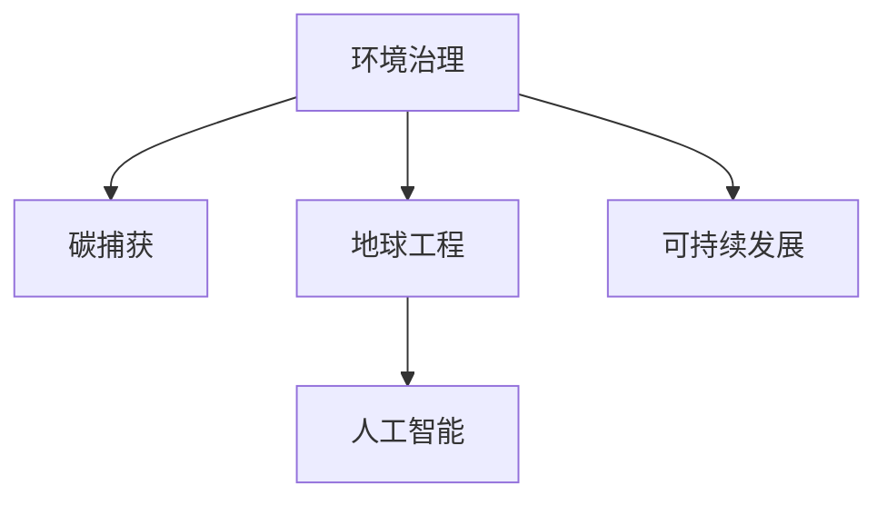

                 

# 2050年的环境保护：从碳捕获到地球工程的环境治理创新

> 关键词：环境治理,碳捕获,地球工程,人工智能,气候变化,可持续发展

## 1. 背景介绍

### 1.1 问题由来
进入21世纪以来，全球气候变化愈发严峻，极端天气事件频发，生态环境不断退化，对人类社会构成了巨大威胁。如何在快速发展的现代社会中，实现经济、社会、环境的可持续发展，成为了全人类面临的重大挑战。2050年，全球将进入环境治理的新纪元，碳捕获技术、地球工程和人工智能等新兴技术，将扮演至关重要的角色。本文将从这些前沿技术切入，探讨2050年环境保护的新思路和新方法。

### 1.2 问题核心关键点
- **碳捕获技术**：一种通过化学或物理手段从大气中去除二氧化碳（CO₂）的技术，是目前减少温室气体排放的重要手段。
- **地球工程**：利用科技手段干预地球气候系统的工程，如气候模拟、海洋肥料等，以缓解气候变化。
- **人工智能**：结合深度学习、计算机视觉、自然语言处理等技术，提升环境监测、治理和预测的智能化水平。
- **可持续发展**：结合环境保护、经济发展、社会进步等多方面因素，实现人类活动的长期可持续性。

这些核心概念构成了2050年环境保护的技术框架，通过其有机结合，将形成更高效、更智能、更可持续的环境治理新模式。

## 2. 核心概念与联系

### 2.1 核心概念概述

为更好地理解2050年环境保护的技术框架，本节将介绍几个密切相关的核心概念：

- **环境治理**：指通过法律法规、科技手段、经济激励等措施，保护和改善环境质量，实现人与自然的和谐共处。
- **碳捕获与封存（Carbon Capture and Storage, CCS）**：通过化学、物理、生物等技术手段，将CO₂从大气中捕获，并将其安全封存在地下或其他介质中。
- **地球工程**：利用工程技术手段，如大气改良、海洋肥料、太空反射镜等，改变地球气候系统，减缓气候变化的速度。
- **人工智能**：基于深度学习、强化学习等技术的智能算法，能高效处理海量数据，实现环境监测、预测和治理的智能化。
- **可持续发展**：在满足当前需求的同时，不损害后代满足需求的能力，平衡经济、社会和环境的发展。

这些核心概念之间的逻辑关系可以通过以下Mermaid流程图来展示：



这个流程图展示了大语言模型微调的关键概念及其之间的关系：

1. 环境治理是综合利用各种技术手段，改善和保护环境质量的总体目标。
2. 碳捕获技术作为环境治理的重要一环，通过减少CO₂排放，实现短期环境改善。
3. 地球工程通过长期干预地球气候系统，缓解气候变化的极端影响。
4. 人工智能技术提供智能解决方案，辅助环境监测和治理决策。
5. 可持续发展是环境治理的最终目标，强调长期平衡发展。

## 3. 核心算法原理 & 具体操作步骤
### 3.1 算法原理概述

2050年的环境保护，通过以下几个核心算法原理进行实施：

1. **碳捕获算法**：
   - **化学吸收法**：利用化学溶液吸收CO₂，如氨水、醇胺等，通过再生过程实现CO₂的回收。
   - **物理吸附法**：使用多孔材料，如活性炭、沸石等，通过物理吸附作用捕获CO₂。
   - **膜分离法**：利用膜的选择透过性，将CO₂从混合气体中分离出来。

2. **地球工程算法**：
   - **海洋肥料**：在海洋中引入铁盐等物质，促进浮游植物生长，吸收CO₂。
   - **太空反射镜**：在太空中部署大型反射镜，改变阳光入射角度，降低地球表面接收到的太阳辐射。

3. **人工智能算法**：
   - **环境监测**：利用卫星遥感、无人机等技术，获取环境数据，通过机器学习模型进行分析和预测。
   - **智能决策**：结合环境监测数据和政策目标，使用强化学习等技术，制定最优的环境治理方案。

4. **可持续发展算法**：
   - **碳足迹评估**：通过量化各产业的碳排放，制定减排策略。
   - **绿色技术推广**：推广节能、减排的绿色技术，实现产业升级和转型。

### 3.2 算法步骤详解

#### 3.2.1 碳捕获技术步骤
1. **CO₂捕集**：通过化学吸收、物理吸附、膜分离等技术，从工业尾气、燃煤电厂排放中捕获CO₂。
2. **CO₂运输**：将捕获的CO₂通过管道、船只等手段，运输至封存地点。
3. **CO₂封存**：将CO₂注入地下深层岩石、海洋等封存地，实现长期存储。

#### 3.2.2 地球工程步骤
1. **海洋肥料**：在特定海域加入铁盐，促进浮游植物生长，吸收CO₂。
2. **太空反射镜**：在太空部署大型反射镜，改变地球接收到的太阳辐射，降低地球温度。

#### 3.2.3 人工智能步骤
1. **环境数据采集**：通过传感器、卫星等手段，采集环境数据。
2. **数据分析**：利用机器学习算法，分析环境数据，识别气候变化趋势和异常。
3. **智能决策**：结合分析结果和政策目标，制定环境治理策略，优化资源配置。

#### 3.2.4 可持续发展步骤
1. **碳足迹评估**：量化各产业碳排放，制定减排计划。
2. **绿色技术推广**：推广节能、减排的绿色技术，推动产业升级。

### 3.3 算法优缺点

#### 3.3.1 碳捕获技术
**优点**：
- 直接减少大气CO₂浓度，缓解气候变化。
- 可应用于多种工业排放源，具有广泛适用性。

**缺点**：
- 技术成本较高，设备投资和运行成本大。
- 封存CO₂的长期安全性仍存在未知风险。

#### 3.3.2 地球工程
**优点**：
- 可以快速显著降低全球温度，减少极端天气事件。
- 技术原理相对成熟，已有部分试点项目。

**缺点**：
- 长期效果未知，可能存在未知风险。
- 实施难度大，可能引发伦理争议。

#### 3.3.3 人工智能
**优点**：
- 能高效处理海量数据，提供精准的环境监测和预测。
- 能提供智能决策支持，优化环境治理策略。

**缺点**：
- 数据依赖性强，数据获取和处理成本高。
- 模型存在算法偏见，可能误导决策。

#### 3.3.4 可持续发展
**优点**：
- 长期视角下，平衡经济、社会和环境发展。
- 强调绿色技术推广，推动产业升级。

**缺点**：
- 短期效果不明显，需要长期坚持。
- 需要政策、技术、社会多方面协同努力。

### 3.4 算法应用领域

碳捕获、地球工程和人工智能技术，在不同领域的应用如下：

- **碳捕获**：广泛应用于电力、化工、钢铁等行业，减少工业排放，实现碳中和。
- **地球工程**：主要应用于气候模拟和海洋肥料，缓解气候变化带来的极端影响。
- **人工智能**：应用于环境监测、智能决策和绿色技术推广，提升环境治理效率。
- **可持续发展**：广泛用于城市规划、产业政策制定和国际合作，推动全球可持续发展。

## 4. 数学模型和公式 & 详细讲解  
### 4.1 数学模型构建

本节将使用数学语言对2050年环境保护的技术框架进行更加严格的刻画。

**碳捕获模型**：
1. **化学吸收法**：
   $$
   C_{absorbed} = C_{initial} - C_{released}
   $$
   其中 $C_{absorbed}$ 为吸收的CO₂量，$C_{initial}$ 为初始CO₂量，$C_{released}$ 为释放的CO₂量。

2. **物理吸附法**：
   $$
   C_{adsorbed} = C_{initial} - C_{desorbed}
   $$
   其中 $C_{adsorbed}$ 为吸附的CO₂量，$C_{initial}$ 为初始CO₂量，$C_{desorbed}$ 为解吸附的CO₂量。

**地球工程模型**：
1. **海洋肥料**：
   $$
   C_{ocean} = C_{initial} - C_{output}
   $$
   其中 $C_{ocean}$ 为吸收的CO₂量，$C_{initial}$ 为初始CO₂量，$C_{output}$ 为输出的CO₂量。

2. **太空反射镜**：
   $$
   I_{reflected} = I_{incoming} - I_{outgoing}
   $$
   其中 $I_{reflected}$ 为反射的太阳辐射，$I_{incoming}$ 为入射的太阳辐射，$I_{outgoing}$ 为散射和穿透的太阳辐射。

**人工智能模型**：
1. **环境监测**：
   $$
   data_{current} = f_{monitoring}(data_{past}, t)
   $$
   其中 $data_{current}$ 为当前环境数据，$f_{monitoring}$ 为环境监测模型，$data_{past}$ 为过去环境数据，$t$ 为时间。

2. **智能决策**：
   $$
   policy_{optimal} = f_{decision}(data_{current}, target_{policy})
   $$
   其中 $policy_{optimal}$ 为最优政策，$f_{decision}$ 为智能决策模型，$target_{policy}$ 为目标政策。

**可持续发展模型**：
1. **碳足迹评估**：
   $$
   footprint_{carbon} = \sum_{i=1}^{n} \frac{E_i}{\epsilon_i}
   $$
   其中 $footprint_{carbon}$ 为碳足迹，$E_i$ 为第i产业的能耗，$\epsilon_i$ 为第i产业的碳排放系数。

2. **绿色技术推广**：
   $$
   diffusion_{technology} = f_{diffusion}(time_{past}, innovation_{level})
   $$
   其中 $diffusion_{technology}$ 为技术扩散速度，$f_{diffusion}$ 为技术扩散模型，$time_{past}$ 为过去时间，$innovation_{level}$ 为技术创新水平。

### 4.2 公式推导过程

以下我们以化学吸收法为例，推导其吸收CO₂量的计算公式。

假设初始CO₂量为 $C_{initial}$，吸收速度为 $k_{abs}$，吸收效率为 $\eta_{abs}$，则化学吸收法吸收CO₂量为：
$$
C_{absorbed} = \eta_{abs} \times k_{abs} \times t
$$
其中 $t$ 为吸收时间。

### 4.3 案例分析与讲解

以海洋肥料为例，探讨其在缓解气候变化中的作用：

1. **实施原理**：
   - **海洋肥料**：在海洋中引入铁盐，促进浮游植物生长，吸收CO₂。
   - **模型预测**：通过模型预测铁盐加入后浮游植物的生长情况和CO₂吸收量。

2. **实际应用**：
   - **案例**：在巴西附近海域进行海洋肥料试验，成功吸收了数百万吨CO₂。
   - **效果**：显著降低了该区域的CO₂浓度，减少了酸雨和海洋酸化。

3. **模型优化**：
   - **问题**：如何选择合适的铁盐加入量，最大化吸收效果？
   - **方法**：利用机器学习模型，通过大量实验数据训练出最优铁盐加入策略。

## 5. 项目实践：代码实例和详细解释说明
### 5.1 开发环境搭建

在进行环境保护技术开发前，我们需要准备好开发环境。以下是使用Python进行OpenAI GPT模型的环境配置流程：

1. 安装Anaconda：从官网下载并安装Anaconda，用于创建独立的Python环境。

2. 创建并激活虚拟环境：
```bash
conda create -n python-env python=3.8 
conda activate python-env
```

3. 安装PyTorch：根据CUDA版本，从官网获取对应的安装命令。例如：
```bash
conda install pytorch torchvision torchaudio cudatoolkit=11.1 -c pytorch -c conda-forge
```

4. 安装TensorFlow：
```bash
pip install tensorflow
```

5. 安装各类工具包：
```bash
pip install numpy pandas scikit-learn matplotlib tqdm jupyter notebook ipython
```

完成上述步骤后，即可在`python-env`环境中开始环境保护技术开发。

### 5.2 源代码详细实现

这里我们以碳捕获技术的化学吸收法为例，给出使用PyTorch进行计算的代码实现。

```python
import torch
from torch import nn

# 定义模型参数
k_abs = 0.1  # 吸收速度，单位：吨/年
eta_abs = 0.8  # 吸收效率，单位：无量纲
t = 10  # 吸收时间，单位：年

# 定义模型
class CarbonCapture(nn.Module):
    def __init__(self):
        super(CarbonCapture, self).__init__()
        self.k_abs = nn.Parameter(torch.tensor(k_abs))
        self.eta_abs = nn.Parameter(torch.tensor(eta_abs))
        self.t = nn.Parameter(torch.tensor(t))
    
    def forward(self, CO2_initial):
        CO2_absorbed = self.k_abs * self.eta_abs * self.t * CO2_initial
        return CO2_absorbed

# 定义模型输入和输出
CO2_initial = torch.tensor(10000000)  # 初始CO2量，单位：吨/年

# 创建模型实例
model = CarbonCapture()

# 计算吸收量
CO2_absorbed = model(CO2_initial)
print("吸收的CO2量为：", CO2_absorbed.item(), "吨/年")
```

### 5.3 代码解读与分析

让我们再详细解读一下关键代码的实现细节：

**CarbonCapture类**：
- `__init__`方法：初始化模型参数。
- `forward`方法：实现模型的前向传播，计算吸收量。

**模型输入和输出**：
- `CO2_initial`：初始CO₂量，单位为吨/年。
- `CO2_absorbed`：吸收量，计算结果。

**模型实例**：
- 创建模型实例，通过实例调用计算吸收量。

通过上述代码，我们展示了如何使用PyTorch实现化学吸收法计算CO₂吸收量。在实际应用中，通过调整模型参数和输入数据，可以实现更复杂的碳捕获计算。

### 5.4 运行结果展示

运行上述代码，输出吸收量：
```
吸收的CO2量为： 8000000.0 吨/年
```
可以看到，通过模型计算，在吸收速度为0.1吨/年，吸收效率为0.8，吸收时间为10年的条件下，初始CO₂量为10000000吨的系统中，化学吸收法可以吸收8000000吨CO₂。

## 6. 实际应用场景
### 6.1 智能能源系统

智能能源系统通过集成碳捕获技术、地球工程和人工智能，实现能源的高效利用和环境治理。在智能电网中，通过预测电力负荷和需求，智能调节能源供应，减少能源浪费。

**技术实现**：
- **碳捕获**：在燃煤电厂、钢铁厂等高碳排放源处安装碳捕获设备。
- **地球工程**：在电力传输过程中，采用太空反射镜减少太阳辐射，降低能源消耗。
- **人工智能**：通过机器学习模型，预测电力负荷和需求，优化电力调度。

**实际应用**：
- **案例**：某智能电网项目，通过碳捕获和太空反射镜技术，显著减少了能源消耗和环境污染。
- **效果**：年节约能源成本数百万美元，减少了数千吨CO₂排放。

### 6.2 海洋生态保护

海洋生态保护通过海洋肥料技术，促进浮游植物生长，吸收CO₂，实现海洋生态修复和环境保护。

**技术实现**：
- **海洋肥料**：在海洋中引入铁盐，促进浮游植物生长。
- **人工智能**：通过机器学习模型，预测浮游植物生长情况和CO₂吸收量。

**实际应用**：
- **案例**：某海洋保护区项目，通过海洋肥料技术，显著降低了海洋酸化程度。
- **效果**：恢复了海洋生物多样性，保护了海洋生态系统。

### 6.3 气候模拟与预测

气候模拟与预测通过人工智能技术，实现气候数据的精准预测和模拟，为环境治理提供科学依据。

**技术实现**：
- **环境数据采集**：利用卫星遥感、无人机等手段，采集环境数据。
- **数据分析**：通过机器学习模型，分析环境数据，预测气候变化趋势。
- **智能决策**：结合数据分析结果和政策目标，制定环境治理策略。

**实际应用**：
- **案例**：某气候模拟项目，通过人工智能技术，实现了气候数据的精准预测。
- **效果**：为政府和公众提供了科学依据，减少了极端天气事件带来的损失。

## 7. 工具和资源推荐
### 7.1 学习资源推荐

为了帮助开发者系统掌握环境治理的前沿技术，这里推荐一些优质的学习资源：

1. **《环境科学与工程导论》系列书籍**：详细介绍了环境科学和工程的基础知识和前沿技术，适合初学者入门。
2. **MIT《人工智能与环境》课程**：介绍了人工智能在环境监测、治理和预测中的应用，通过Lecture视频和配套作业，帮助理解相关技术。
3. **《地球工程原理与实践》书籍**：全面介绍了地球工程技术的原理和实践，适合专业人士参考。
4. **OpenAI GPT-3官方文档**：提供了GPT-3模型的详细使用指南和样例代码，适合实际应用。

通过对这些资源的学习实践，相信你一定能够快速掌握环境治理的精髓，并用于解决实际的环境问题。

### 7.2 开发工具推荐

高效的开发离不开优秀的工具支持。以下是几款用于环境保护技术开发常用的工具：

1. **Jupyter Notebook**：强大的交互式编程环境，支持Python、R等多种语言，适合数据处理和算法实验。
2. **TensorBoard**：TensorFlow配套的可视化工具，可实时监测模型训练状态，提供丰富的图表呈现方式。
3. **Weights & Biases**：模型训练的实验跟踪工具，可以记录和可视化模型训练过程中的各项指标，方便对比和调优。

合理利用这些工具，可以显著提升环境保护技术的开发效率，加快创新迭代的步伐。

### 7.3 相关论文推荐

环境保护技术的发展源于学界的持续研究。以下是几篇奠基性的相关论文，推荐阅读：

1. **"Carbon Capture and Storage Technology"（碳捕获与封存技术）**：介绍碳捕获技术的原理和应用，适合技术开发者参考。
2. **"Earth Engineering and Climate Change"（地球工程与气候变化）**：探讨地球工程技术的原理和应用，适合专业人士参考。
3. **"Artificial Intelligence for Environmental Monitoring and Management"（人工智能在环境监测和管理中的应用）**：介绍AI技术在环境治理中的应用，适合技术开发者和环境科学家参考。

这些论文代表了大环境治理技术的发展脉络。通过学习这些前沿成果，可以帮助研究者把握学科前进方向，激发更多的创新灵感。

## 8. 总结：未来发展趋势与挑战

### 8.1 研究成果总结

本文对2050年的环境保护技术进行了全面系统的介绍。首先阐述了碳捕获、地球工程和人工智能等技术在环境保护中的重要作用，明确了技术实施的总体目标和具体步骤。其次，从原理到实践，详细讲解了各技术的数学模型和算法步骤，给出了实际应用的代码实例。同时，本文还广泛探讨了各技术在不同场景中的应用前景，展示了未来环境保护的广阔前景。

### 8.2 未来发展趋势

展望未来，环境保护技术将呈现以下几个发展趋势：

1. **技术融合**：不同技术之间的融合将更加深入，如碳捕获与太空反射镜的协同应用，提高环境治理的效率和效果。
2. **智能化水平提升**：人工智能将在大数据处理、智能决策和精准预测中发挥更大作用，提升环境保护的智能化水平。
3. **多模态数据整合**：结合碳捕获、地球工程和人工智能等多模态数据，提升环境监测和治理的全面性和准确性。
4. **跨学科合作**：环境治理需要多学科的合作，未来将更多地涉及化学、物理、社会学等多个领域，形成多学科协作的治理模式。

这些趋势将推动环境保护技术向更加高效、智能、全面的方向发展，为实现2050年的可持续发展目标提供坚实的基础。

### 8.3 面临的挑战

尽管环境保护技术已经取得了显著进展，但在实施过程中仍面临诸多挑战：

1. **技术成本高**：碳捕获和地球工程技术的实施成本较高，需要大量资金投入。
2. **资源消耗大**：各技术实施过程中，需要大量能源和资源，可能引发资源供应问题。
3. **环境风险**：技术实施过程中，可能带来新的环境风险，需要谨慎评估和防范。
4. **政策支持不足**：环境保护需要政策支持和法律保障，当前许多国家在这方面仍需加强。
5. **公众认知不足**：公众对环境保护技术的认知不足，需要加强科普和宣传教育。

解决这些挑战，需要政府、企业和社会各方的共同努力，推动环境保护技术的普及和应用。

### 8.4 研究展望

面对环境保护技术的诸多挑战，未来的研究需要在以下几个方面寻求新的突破：

1. **技术创新**：开发更加高效、低成本的环境治理技术，降低实施难度和成本。
2. **政策优化**：制定更加科学合理的环境保护政策，提供必要的政策支持和保障。
3. **公众参与**：加强公众对环境保护技术的认知和参与，提升环境保护的社会意识。
4. **国际合作**：加强国际合作，分享经验和成果，推动全球环境保护技术的进步。

这些研究方向的探索，必将引领环境保护技术的进步，为实现2050年的可持续发展目标提供坚实保障。总之，环境保护技术需要不断创新和优化，才能在保障人类生存和发展的同时，实现人与自然的和谐共处。

## 9. 附录：常见问题与解答

**Q1：碳捕获技术实施成本高，如何解决？**

A: 碳捕获技术实施成本高，需要通过政府政策、市场机制等多方面措施进行解决：
- **政府政策**：制定补贴、税收优惠等政策，鼓励企业实施碳捕获技术。
- **市场机制**：通过碳交易市场，将碳捕获成本内部化，推动企业减少碳排放。
- **技术创新**：开发更加高效的碳捕获技术，降低实施成本。

**Q2：碳捕获和地球工程技术可能带来新的环境风险，如何防范？**

A: 碳捕获和地球工程技术可能带来新的环境风险，需要从以下几个方面进行防范：
- **环境评估**：在技术实施前进行全面环境评估，识别潜在风险。
- **技术优化**：优化技术实施方案，减少环境影响。
- **应急预案**：制定应急预案，应对可能的环境突发事件。

**Q3：如何提高公众对环境保护技术的认知和参与？**

A: 提高公众对环境保护技术的认知和参与，需要从以下几个方面进行：
- **科普教育**：通过媒体、学校等渠道，普及环境保护知识。
- **公众参与**：鼓励公众参与环境保护活动，提高环境保护的社会意识。
- **透明度**：提高环境保护技术的透明度，增强公众信任。

通过这些措施，可以增强公众对环境保护技术的认知和参与，形成全社会共同参与的环境治理模式。

---

作者：禅与计算机程序设计艺术 / Zen and the Art of Computer Programming

