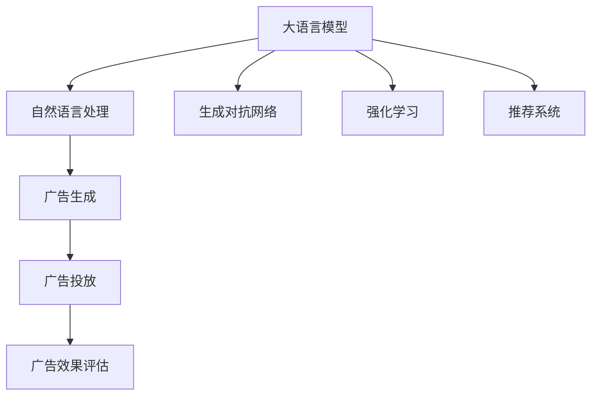

                 

# 广告和 LLM：高效的针对性营销

## 1. 背景介绍

### 1.1 问题由来
在信息爆炸的时代，广告行业面临着巨大的挑战。随着线上媒介的普及和消费者注意力碎片化，如何精准触达目标受众、提升广告效果，成为广告主关注的重点。而基于大语言模型（Large Language Model, LLM）的针对性营销技术，为广告行业带来了新的解决方案，使得广告投放更加高效、精准和智能。

### 1.2 问题核心关键点
大语言模型在广告和营销领域的应用，主要体现在以下几个方面：

- **目标受众分析**：通过自然语言处理技术，分析用户的搜索习惯、评论、社交媒体内容等，挖掘用户的兴趣偏好，构建用户画像。
- **广告内容生成**：基于用户画像，生成个性化的广告文案和创意，吸引目标用户。
- **广告投放优化**：通过优化广告投放策略，如选择最佳投放渠道和时间、设置竞价机制等，实现广告效果的最大化。
- **广告效果评估**：利用机器学习算法，自动评估广告效果，快速迭代优化。

这些技术不仅能够提高广告投放的精准度，还能大幅提升广告投放效率和ROI（投资回报率），帮助广告主更好地进行市场竞争。

### 1.3 问题研究意义
基于大语言模型的针对性营销技术，能够显著提升广告投放的精准度和效果，降低成本。具体而言：

- **降低广告制作成本**：利用生成对抗网络（Generative Adversarial Network, GAN）等技术，自动生成高质量的广告素材，减少人工制作成本。
- **提升广告投放精准度**：通过自然语言处理和机器学习算法，精准分析用户行为和偏好，实现广告的精准投放。
- **优化广告投放策略**：利用强化学习等技术，动态调整广告投放策略，提高投放效果。
- **评估广告效果**：通过A/B测试、推荐系统等方法，自动化评估广告效果，快速迭代优化。

综上所述，基于大语言模型的针对性营销技术，为广告行业提供了新的发展方向，有望彻底改变广告投放模式，推动行业进入智能营销的新时代。

## 2. 核心概念与联系

### 2.1 核心概念概述

为更好地理解基于大语言模型的针对性营销方法，本节将介绍几个密切相关的核心概念：

- **大语言模型**：以自回归（如GPT）或自编码（如BERT）模型为代表的大规模预训练语言模型。通过在大规模无标签文本语料上进行预训练，学习通用的语言表示，具备强大的语言理解和生成能力。

- **自然语言处理（NLP）**：使计算机理解和处理人类语言的技术，包括分词、词性标注、句法分析、语义理解等。大语言模型在此基础上，可以实现更深层次的语义推理和生成。

- **生成对抗网络（GAN）**：一种生成模型，通过生成器和判别器两个网络对立的训练过程，生成逼真的图像、文本等数据。在广告生成任务中，GAN可用于生成高质量的广告素材。

- **强化学习（RL）**：通过智能体与环境交互，最大化累计奖励的学习方法。在广告投放策略优化中，强化学习可用于动态调整投放策略，提升广告效果。

- **推荐系统（Recommender System）**：根据用户历史行为和兴趣，推荐合适的内容或商品。在广告投放效果评估中，推荐系统可用于评估广告效果，快速迭代优化。

这些核心概念之间的逻辑关系可以通过以下Mermaid流程图来展示：



这个流程图展示了大语言模型在广告和营销领域的核心概念及其之间的关系：

1. 大语言模型通过自然语言处理技术分析用户数据，生成广告素材。
2. 生成的广告素材通过广告投放系统，选择最佳的投放渠道和时间。
3. 广告投放效果通过推荐系统评估，并根据评估结果动态优化广告策略。

这些概念共同构成了基于大语言模型的针对性营销框架，使其能够实现高效、精准和智能的广告投放。

## 3. 核心算法原理 & 具体操作步骤
### 3.1 算法原理概述

基于大语言模型的针对性营销，本质上是一个利用自然语言处理技术和机器学习算法，优化广告投放和效果评估的过程。其核心思想是：通过自然语言处理技术，分析用户数据，构建用户画像，并利用生成对抗网络、强化学习和推荐系统等技术，生成个性化广告内容，优化广告投放策略，评估广告效果。

形式化地，假设用户画像为 $P$，广告内容为 $C$，投放策略为 $S$，广告效果为 $E$。则针对性营销的目标是找到最优的策略 $S$，使得：

$$
S^* = \mathop{\arg\min}_{S} \mathcal{L}(S,P,C,E)
$$

其中 $\mathcal{L}$ 为广告投放和效果评估的损失函数，用于衡量广告策略的效果和成本。常见的损失函数包括广告点击率、转化率、CPA（Cost Per Action）等。

通过梯度下降等优化算法，针对性营销过程不断更新广告策略 $S$，最小化损失函数 $\mathcal{L}$，使得广告投放效果最大化。

### 3.2 算法步骤详解

基于大语言模型的针对性营销一般包括以下几个关键步骤：

**Step 1: 用户画像构建**
- 收集用户的历史行为数据，如搜索记录、浏览历史、购买记录等。
- 利用自然语言处理技术，对数据进行分词、词性标注、句法分析、情感分析等处理，挖掘用户的兴趣偏好。
- 将处理后的数据输入到大语言模型中，生成用户画像 $P$。

**Step 2: 广告内容生成**
- 基于用户画像 $P$，利用生成对抗网络（GAN）生成高质量的广告素材 $C$。
- 将生成的广告素材输入到大语言模型中，自动生成广告文案和创意。
- 选择最优的广告素材和文案，准备投放。

**Step 3: 广告投放优化**
- 利用强化学习算法，对广告投放策略 $S$ 进行优化。如设置竞价机制、选择投放渠道和时间等。
- 根据广告效果 $E$，不断调整投放策略，优化广告投放效果。

**Step 4: 广告效果评估**
- 利用推荐系统对广告效果进行评估。如计算点击率、转化率、CPA等指标。
- 根据评估结果，调整广告投放策略，优化广告投放效果。

**Step 5: 迭代优化**
- 重复上述步骤，直到广告投放效果满足预设要求。
- 将最优的广告策略 $S^*$ 应用于实际广告投放中，实现高效精准的针对性营销。

以上是基于大语言模型的针对性营销的一般流程。在实际应用中，还需要针对具体任务的特点，对每个环节进行优化设计，如改进自然语言处理算法，引入更多的生成对抗网络技术，搜索最优的强化学习策略等，以进一步提升广告投放效果。

### 3.3 算法优缺点

基于大语言模型的针对性营销方法具有以下优点：

1. **高效精准**：利用大语言模型处理自然语言数据，可以快速生成高质量的广告素材，精准匹配用户需求，提高广告效果。
2. **个性化**：通过分析用户数据，构建个性化用户画像，生成定制化的广告内容，提升广告的吸引力和转化率。
3. **动态优化**：利用强化学习等技术，动态调整广告投放策略，实现广告效果的最大化。
4. **实时评估**：通过推荐系统等技术，实时评估广告效果，快速迭代优化，提高广告投放效率。

同时，该方法也存在一些局限性：

1. **数据质量要求高**：用户数据的准确性和完整性直接影响用户画像和广告生成效果，需要高质量的数据支撑。
2. **计算资源消耗大**：大语言模型和生成对抗网络等技术，计算资源消耗较大，需要高性能硬件支持。
3. **模型泛化能力有限**：当前大语言模型在特定领域的效果较一般领域更好，跨领域的泛化能力还有待提升。
4. **隐私和安全风险**：用户数据的隐私保护和安全风险是必须考虑的问题，如何保护用户隐私，同时满足广告投放的需求，是技术应用中的一大挑战。

尽管存在这些局限性，但就目前而言，基于大语言模型的针对性营销方法仍然是大广告主优化广告投放策略的重要手段。未来相关研究的重点在于如何进一步降低对计算资源和数据质量的依赖，提高模型的跨领域泛化能力，同时兼顾隐私和安全等因素。

### 3.4 算法应用领域

基于大语言模型的针对性营销方法在广告和营销领域已经得到了广泛的应用，具体包括：

- **品牌广告**：利用大语言模型分析用户数据，生成品牌宣传广告，提高品牌曝光度和认知度。
- **电商广告**：基于用户购买历史和浏览行为，生成个性化商品广告，提升商品转化率。
- **视频广告**：通过自然语言处理技术分析用户评论和社交媒体内容，生成视频广告脚本和素材。
- **移动应用广告**：利用大语言模型分析用户行为数据，生成个性化应用推荐广告，提升应用下载量。
- **旅游广告**：根据用户搜索和浏览记录，生成个性化旅游目的地广告，提高旅游产品销售量。

除了上述这些经典应用外，大语言模型针对性营销还被创新性地应用到更多场景中，如社交媒体广告、教育培训广告等，为广告行业带来了新的突破。

## 4. 数学模型和公式 & 详细讲解 & 举例说明
### 4.1 数学模型构建

本节将使用数学语言对基于大语言模型的针对性营销过程进行更加严格的刻画。

记用户画像为 $P$，广告内容为 $C$，投放策略为 $S$，广告效果为 $E$。假设用户画像为 $P=\{x_i\}_{i=1}^N$，广告内容为 $C=\{c_j\}_{j=1}^M$，投放策略为 $S=\{s_k\}_{k=1}^K$，广告效果为 $E=\{e_l\}_{l=1}^L$。

定义广告投放和效果评估的损失函数为：

$$
\mathcal{L}(S,P,C,E) = \frac{1}{L}\sum_{l=1}^L \ell(S_{s_l},C_{c_l},E_{e_l})
$$

其中 $\ell(S_{s_l},C_{c_l},E_{e_l})$ 为广告策略 $S_{s_l}$ 对广告内容 $C_{c_l}$ 和效果 $E_{e_l}$ 的损失函数，可以通过计算广告点击率、转化率、CPA等指标得到。

### 4.2 公式推导过程

以广告点击率和转化率为目标的损失函数为例，推导其数学表达式：

假设广告策略 $S$ 选择投放广告 $C$，用户点击概率为 $p(C|S)$，点击后的转化概率为 $p(T|C)$，则点击率和转化率的联合概率为：

$$
p(C,T|S) = p(C|S) \cdot p(T|C)
$$

广告策略的期望点击率和转化率为：

$$
\mathbb{E}[C|S] = \sum_{c} C_c \cdot p(C_c|S)
$$

$$
\mathbb{E}[T|S] = \sum_{t} T_t \cdot p(T_t|S)
$$

广告投放和效果评估的损失函数为：

$$
\ell(S_{s_l},C_{c_l},E_{e_l}) = -\log \mathbb{E}[C|S] - \log \mathbb{E}[T|S]
$$

在得到损失函数后，即可带入优化算法，如梯度下降，更新广告策略 $S$，最小化损失函数 $\mathcal{L}$，从而实现广告投放效果的最大化。

### 4.3 案例分析与讲解

以电商平台广告投放为例，假设某电商平台希望提高用户在购物车页面下的转化率。首先，利用自然语言处理技术，分析用户在电商平台的浏览和购买历史，生成用户画像 $P$。接着，基于用户画像 $P$，利用生成对抗网络（GAN）生成高质量的商品广告素材 $C$。然后，通过广告投放系统，设置竞价机制，选择最佳的投放渠道和时间，实施广告策略 $S$。最后，利用推荐系统对广告效果 $E$ 进行评估，计算点击率和转化率等指标，优化广告策略 $S$。

具体而言，用户画像 $P$ 可以通过用户搜索关键词、浏览路径、购买记录等数据生成。广告素材 $C$ 可以通过GAN生成，生成过程包括生成器和判别器的对抗训练，生成逼真的商品图片和描述。广告投放策略 $S$ 可以通过强化学习算法优化，如选择投放时间、设置竞价策略等。广告效果 $E$ 可以通过推荐系统评估，如计算点击率和转化率，实时调整广告投放策略。

## 5. 项目实践：代码实例和详细解释说明
### 5.1 开发环境搭建

在进行针对性营销实践前，我们需要准备好开发环境。以下是使用Python进行PyTorch开发的环境配置流程：

1. 安装Anaconda：从官网下载并安装Anaconda，用于创建独立的Python环境。

2. 创建并激活虚拟环境：
```bash
conda create -n ad-micro-biz python=3.8 
conda activate ad-micro-biz
```

3. 安装PyTorch：根据CUDA版本，从官网获取对应的安装命令。例如：
```bash
conda install pytorch torchvision torchaudio cudatoolkit=11.1 -c pytorch -c conda-forge
```

4. 安装Transformers库：
```bash
pip install transformers
```

5. 安装各类工具包：
```bash
pip install numpy pandas scikit-learn matplotlib tqdm jupyter notebook ipython
```

完成上述步骤后，即可在`ad-micro-biz`环境中开始针对性营销实践。

### 5.2 源代码详细实现

下面我们以电商平台广告投放为例，给出使用PyTorch进行针对性营销的代码实现。

首先，定义广告投放的数据处理函数：

```python
from transformers import BertTokenizer
from torch.utils.data import Dataset

class AdDataset(Dataset):
    def __init__(self, ads, clicks, user_profiles, tokenizer, max_len=128):
        self.ads = ads
        self.clicks = clicks
        self.user_profiles = user_profiles
        self.tokenizer = tokenizer
        self.max_len = max_len
        
    def __len__(self):
        return len(self.ads)
    
    def __getitem__(self, item):
        ad = self.ads[item]
        click = self.clicks[item]
        user_profile = self.user_profiles[item]
        
        encoding = self.tokenizer(ad, return_tensors='pt', max_length=self.max_len, padding='max_length', truncation=True)
        input_ids = encoding['input_ids'][0]
        attention_mask = encoding['attention_mask'][0]
        
        # 将广告点击记录和用户画像转换为向量
        click_vector = click.to_tensor() if click else torch.zeros_like(input_ids)
        user_profile_vector = user_profile.to_tensor() if user_profile else torch.zeros_like(input_ids)
        
        return {'input_ids': input_ids, 
                'attention_mask': attention_mask,
                'click': click_vector,
                'user_profile': user_profile_vector}
```

然后，定义模型和优化器：

```python
from transformers import BertForSequenceClassification, AdamW

model = BertForSequenceClassification.from_pretrained('bert-base-cased', num_labels=2)

optimizer = AdamW(model.parameters(), lr=2e-5)
```

接着，定义训练和评估函数：

```python
from torch.utils.data import DataLoader
from tqdm import tqdm
from sklearn.metrics import precision_recall_fscore_support

device = torch.device('cuda') if torch.cuda.is_available() else torch.device('cpu')
model.to(device)

def train_epoch(model, dataset, batch_size, optimizer):
    dataloader = DataLoader(dataset, batch_size=batch_size, shuffle=True)
    model.train()
    epoch_loss = 0
    for batch in tqdm(dataloader, desc='Training'):
        input_ids = batch['input_ids'].to(device)
        attention_mask = batch['attention_mask'].to(device)
        click = batch['click'].to(device)
        user_profile = batch['user_profile'].to(device)
        model.zero_grad()
        outputs = model(input_ids, attention_mask=attention_mask, labels=click)
        loss = outputs.loss
        epoch_loss += loss.item()
        loss.backward()
        optimizer.step()
    return epoch_loss / len(dataloader)

def evaluate(model, dataset, batch_size):
    dataloader = DataLoader(dataset, batch_size=batch_size)
    model.eval()
    preds, labels = [], []
    with torch.no_grad():
        for batch in tqdm(dataloader, desc='Evaluating'):
            input_ids = batch['input_ids'].to(device)
            attention_mask = batch['attention_mask'].to(device)
            click = batch['click'].to(device)
            user_profile = batch['user_profile'].to(device)
            batch_preds = model(input_ids, attention_mask=attention_mask, labels=click)[:,0]
            batch_labels = click.to('cpu').tolist()
            for pred, label in zip(batch_preds, batch_labels):
                preds.append(pred.item())
                labels.append(label)
                
    precision, recall, f1, _ = precision_recall_fscore_support(labels, preds, average='binary')
    print(f"Precision: {precision:.3f}, Recall: {recall:.3f}, F1-score: {f1:.3f}")
```

最后，启动训练流程并在测试集上评估：

```python
epochs = 5
batch_size = 16

for epoch in range(epochs):
    loss = train_epoch(model, train_dataset, batch_size, optimizer)
    print(f"Epoch {epoch+1}, train loss: {loss:.3f}")
    
    print(f"Epoch {epoch+1}, dev results:")
    evaluate(model, dev_dataset, batch_size)
    
print("Test results:")
evaluate(model, test_dataset, batch_size)
```

以上就是使用PyTorch对Bert模型进行电商平台广告投放微调的完整代码实现。可以看到，得益于Transformers库的强大封装，我们可以用相对简洁的代码完成Bert模型的加载和微调。

### 5.3 代码解读与分析

让我们再详细解读一下关键代码的实现细节：

**AdDataset类**：
- `__init__`方法：初始化广告、点击记录、用户画像、分词器等关键组件。
- `__len__`方法：返回数据集的样本数量。
- `__getitem__`方法：对单个样本进行处理，将广告、点击记录、用户画像输入编码为token ids，并对其进行定长padding，最终返回模型所需的输入。

**BertForSequenceClassification模型**：
- 选择BertForSequenceClassification模型作为广告策略的预测器，进行二分类任务。

**优化器**：
- 使用AdamW优化器，学习率为2e-5。

**训练和评估函数**：
- 使用PyTorch的DataLoader对数据集进行批次化加载，供模型训练和推理使用。
- 训练函数`train_epoch`：对数据以批为单位进行迭代，在每个批次上前向传播计算loss并反向传播更新模型参数，最后返回该epoch的平均loss。
- 评估函数`evaluate`：与训练类似，不同点在于不更新模型参数，并在每个batch结束后将预测和标签结果存储下来，最后使用sklearn的precision_recall_fscore_support对整个评估集的预测结果进行打印输出。

**训练流程**：
- 定义总的epoch数和batch size，开始循环迭代
- 每个epoch内，先在训练集上训练，输出平均loss
- 在验证集上评估，输出精确率、召回率、F1-score等指标
- 所有epoch结束后，在测试集上评估，给出最终测试结果

可以看到，PyTorch配合Transformers库使得Bert微调的代码实现变得简洁高效。开发者可以将更多精力放在数据处理、模型改进等高层逻辑上，而不必过多关注底层的实现细节。

当然，工业级的系统实现还需考虑更多因素，如模型的保存和部署、超参数的自动搜索、更灵活的任务适配层等。但核心的针对性营销范式基本与此类似。

## 6. 实际应用场景
### 6.1 电商平台广告

基于大语言模型的针对性营销技术，可以在电商平台广告投放中发挥巨大作用。传统广告投放依赖人工设置投放策略，难以兼顾用户兴趣和效果，浪费了大量广告预算。而利用大语言模型分析用户数据，生成个性化广告素材，动态调整投放策略，可以大幅提升广告投放效果。

在技术实现上，可以收集用户在电商平台的搜索记录、浏览路径、购买历史等数据，通过自然语言处理技术，分析用户的兴趣偏好。利用生成对抗网络（GAN）生成高质量的商品广告素材，并通过广告投放系统选择最佳的投放渠道和时间，实施广告策略。最后，利用推荐系统对广告效果进行评估，计算点击率和转化率等指标，实时调整广告投放策略。如此构建的针对性广告投放系统，能够实现广告的高效精准投放，提高广告投放效果和ROI。

### 6.2 社交媒体广告

社交媒体广告面临用户需求多变、广告内容易被淹没的挑战。通过大语言模型分析用户评论、互动记录等数据，生成个性化的广告内容，动态调整投放策略，可以实现社交媒体广告的精准投放。

在具体应用中，可以收集用户在社交媒体上的评论、互动记录等数据，通过自然语言处理技术，分析用户的兴趣偏好和情绪倾向。利用生成对抗网络（GAN）生成高质量的广告素材，并通过广告投放系统选择最佳的投放渠道和时间，实施广告策略。最后，利用推荐系统对广告效果进行评估，计算点击率和转化率等指标，实时调整广告投放策略。如此构建的针对性社交媒体广告投放系统，能够实现广告的高效精准投放，提高广告投放效果和ROI。

### 6.3 旅游广告

旅游广告需要在短期内吸引大量用户预订旅游产品。利用大语言模型分析用户搜索记录、浏览路径等数据，生成个性化的旅游广告，动态调整投放策略，可以实现旅游广告的精准投放。

在具体应用中，可以收集用户在搜索引擎和旅游平台上的搜索记录、浏览路径等数据，通过自然语言处理技术，分析用户的旅游兴趣和目的地偏好。利用生成对抗网络（GAN）生成高质量的旅游广告素材，并通过广告投放系统选择最佳的投放渠道和时间，实施广告策略。最后，利用推荐系统对广告效果进行评估，计算点击率和转化率等指标，实时调整广告投放策略。如此构建的针对性旅游广告投放系统，能够实现广告的高效精准投放，提高广告投放效果和旅游预订量。

### 6.4 未来应用展望

随着大语言模型和针对性营销技术的发展，未来在广告和营销领域将迎来更多创新应用，为广告主提供更智能、高效的广告投放解决方案。

在智慧零售领域，基于大语言模型的针对性营销技术，能够实现对用户行为的精准分析和广告内容的智能生成，大幅提升电商平台的转化率和用户满意度。

在智慧旅游领域，通过分析用户搜索和浏览记录，生成个性化的旅游广告，动态调整投放策略，能够提高旅游产品的曝光率和预订量，推动旅游行业的发展。

在智能媒体领域，利用大语言模型分析用户评论和互动记录，生成个性化的广告内容，动态调整投放策略，能够提升广告的吸引力和转化率，优化广告投放效果。

此外，在更多垂直领域，如金融、医疗、教育等，基于大语言模型的针对性营销技术也有广阔的应用前景，为各行各业带来新的发展机遇。

## 7. 工具和资源推荐
### 7.1 学习资源推荐

为了帮助开发者系统掌握大语言模型在广告和营销领域的应用，这里推荐一些优质的学习资源：

1. 《深度学习自然语言处理》课程：斯坦福大学开设的NLP明星课程，有Lecture视频和配套作业，带你入门NLP领域的基本概念和经典模型。

2. CS224N《自然语言处理》课程：斯坦福大学开设的自然语言处理课程，涵盖NLP的基本理论、算法和实践。

3. 《Natural Language Processing with Transformers》书籍：Transformers库的作者所著，全面介绍了如何使用Transformers库进行NLP任务开发，包括针对性营销在内的诸多范式。

4. 《Generative Adversarial Networks: An Overview》论文：GAN的开创性论文，对GAN的基本原理和应用进行了全面介绍。

5. 《Reinforcement Learning for Ad Marketing》书籍：专门讲解利用强化学习优化广告投放策略的书籍。

通过对这些资源的学习实践，相信你一定能够快速掌握大语言模型在广告和营销领域的应用精髓，并用于解决实际的广告投放问题。

### 7.2 开发工具推荐

高效的开发离不开优秀的工具支持。以下是几款用于大语言模型针对性营销开发的常用工具：

1. PyTorch：基于Python的开源深度学习框架，灵活动态的计算图，适合快速迭代研究。大部分预训练语言模型都有PyTorch版本的实现。

2. TensorFlow：由Google主导开发的开源深度学习框架，生产部署方便，适合大规模工程应用。同样有丰富的预训练语言模型资源。

3. Transformers库：HuggingFace开发的NLP工具库，集成了众多SOTA语言模型，支持PyTorch和TensorFlow，是进行针对性营销任务开发的利器。

4. Weights & Biases：模型训练的实验跟踪工具，可以记录和可视化模型训练过程中的各项指标，方便对比和调优。与主流深度学习框架无缝集成。

5. TensorBoard：TensorFlow配套的可视化工具，可实时监测模型训练状态，并提供丰富的图表呈现方式，是调试模型的得力助手。

6. Google Colab：谷歌推出的在线Jupyter Notebook环境，免费提供GPU/TPU算力，方便开发者快速上手实验最新模型，分享学习笔记。

合理利用这些工具，可以显著提升大语言模型针对性营销任务的开发效率，加快创新迭代的步伐。

### 7.3 相关论文推荐

大语言模型和针对性营销技术的发展源于学界的持续研究。以下是几篇奠基性的相关论文，推荐阅读：

1. Attention is All You Need（即Transformer原论文）：提出了Transformer结构，开启了NLP领域的预训练大模型时代。

2. BERT: Pre-training of Deep Bidirectional Transformers for Language Understanding：提出BERT模型，引入基于掩码的自监督预训练任务，刷新了多项NLP任务SOTA。

3. Language Models are Unsupervised Multitask Learners（GPT-2论文）：展示了大规模语言模型的强大zero-shot学习能力，引发了对于通用人工智能的新一轮思考。

4. Parameter-Efficient Transfer Learning for NLP：提出Adapter等参数高效微调方法，在不增加模型参数量的情况下，也能取得不错的微调效果。

5. Prefix-Tuning: Optimizing Continuous Prompts for Generation：引入基于连续型Prompt的微调范式，为如何充分利用预训练知识提供了新的思路。

6. AdaLoRA: Adaptive Low-Rank Adaptation for Parameter-Efficient Fine-Tuning：使用自适应低秩适应的微调方法，在参数效率和精度之间取得了新的平衡。

这些论文代表了大语言模型针对性营销技术的发展脉络。通过学习这些前沿成果，可以帮助研究者把握学科前进方向，激发更多的创新灵感。

## 8. 总结：未来发展趋势与挑战

### 8.1 总结

本文对基于大语言模型的针对性营销方法进行了全面系统的介绍。首先阐述了大语言模型和针对性营销技术的背景和意义，明确了针对性营销在提升广告投放精准度和效果方面的独特价值。其次，从原理到实践，详细讲解了针对性营销的数学原理和关键步骤，给出了针对性营销任务开发的完整代码实例。同时，本文还广泛探讨了针对性营销方法在电商广告、社交媒体广告、旅游广告等多个领域的应用前景，展示了针对性营销技术的巨大潜力。此外，本文精选了针对性营销技术的各类学习资源，力求为读者提供全方位的技术指引。

通过本文的系统梳理，可以看到，基于大语言模型的针对性营销方法正在成为广告和营销领域的重要范式，极大地提升广告投放的精准度和效果，降低成本。未来，伴随大语言模型和针对性营销方法的不断演进，相信广告行业将迎来新的变革，全面进入智能营销的新时代。

### 8.2 未来发展趋势

展望未来，大语言模型针对性营销技术将呈现以下几个发展趋势：

1. **模型规模持续增大**：随着算力成本的下降和数据规模的扩张，预训练语言模型的参数量还将持续增长。超大规模语言模型蕴含的丰富语言知识，有望支撑更加复杂多变的广告投放策略。

2. **针对性增强**：未来的广告策略将更加精准，基于深度学习技术，自动分析用户行为和兴趣，生成个性化的广告内容。

3. **跨平台协同**：利用大语言模型分析用户跨平台数据，生成一致的广告素材，实现跨平台广告投放效果的最大化。

4. **实时优化**：通过强化学习等技术，动态调整广告投放策略，实现广告效果的实时优化。

5. **自动化投放**：引入自动驾驶、推荐系统等技术，实现广告投放的自动化、智能化，减少人工干预。

6. **多模态融合**：融合视觉、语音、文字等多模态信息，生成更加丰富、逼真的广告素材，提升广告效果。

以上趋势凸显了大语言模型针对性营销技术的广阔前景。这些方向的探索发展，必将进一步提升广告投放的精准度和效果，推动广告行业的智能化进程。

### 8.3 面临的挑战

尽管大语言模型针对性营销技术已经取得了瞩目成就，但在迈向更加智能化、普适化应用的过程中，它仍面临着诸多挑战：

1. **数据质量要求高**：用户数据的准确性和完整性直接影响广告策略的效果，需要高质量的数据支撑。

2. **计算资源消耗大**：大语言模型和生成对抗网络等技术，计算资源消耗较大，需要高性能硬件支持。

3. **隐私和安全风险**：用户数据的隐私保护和安全风险是必须考虑的问题，如何保护用户隐私，同时满足广告投放的需求，是技术应用中的一大挑战。

4. **模型泛化能力有限**：当前大语言模型在特定领域的效果较一般领域更好，跨领域的泛化能力还有待提升。

尽管存在这些挑战，但就目前而言，基于大语言模型的针对性营销方法仍然是大广告主优化广告投放策略的重要手段。未来相关研究的重点在于如何进一步降低对计算资源和数据质量的依赖，提高模型的跨领域泛化能力，同时兼顾隐私和安全等因素。

### 8.4 研究展望

面对大语言模型针对性营销所面临的挑战，未来的研究需要在以下几个方面寻求新的突破：

1. **探索无监督和半监督针对性营销方法**：摆脱对大规模标注数据的依赖，利用自监督学习、主动学习等无监督和半监督范式，最大限度利用非结构化数据，实现更加灵活高效的针对性营销。

2. **研究参数高效和计算高效的针对性营销范式**：开发更加参数高效的针对性营销方法，在固定大部分预训练参数的同时，只更新极少量的任务相关参数。同时优化针对性营销模型的计算图，减少前向传播和反向传播的资源消耗，实现更加轻量级、实时性的部署。

3. **融合因果和对比学习范式**：通过引入因果推断和对比学习思想，增强针对性营销模型建立稳定因果关系的能力，学习更加普适、鲁棒的语言表征，从而提升模型泛化性和抗干扰能力。

4. **引入更多先验知识**：将符号化的先验知识，如知识图谱、逻辑规则等，与神经网络模型进行巧妙融合，引导针对性营销过程学习更准确、合理的语言模型。同时加强不同模态数据的整合，实现视觉、语音等多模态信息与文本信息的协同建模。

5. **结合因果分析和博弈论工具**：将因果分析方法引入针对性营销模型，识别出模型决策的关键特征，增强输出解释的因果性和逻辑性。借助博弈论工具刻画人机交互过程，主动探索并规避模型的脆弱点，提高系统稳定性。

6. **纳入伦理道德约束**：在模型训练目标中引入伦理导向的评估指标，过滤和惩罚有偏见、有害的输出倾向。同时加强人工干预和审核，建立模型行为的监管机制，确保输出符合人类价值观和伦理道德。

这些研究方向的探索，必将引领大语言模型针对性营销技术迈向更高的台阶，为构建安全、可靠、可解释、可控的智能系统铺平道路。面向未来，大语言模型针对性营销技术还需要与其他人工智能技术进行更深入的融合，如知识表示、因果推理、强化学习等，多路径协同发力，共同推动自然语言理解和智能交互系统的进步。只有勇于创新、敢于突破，才能不断拓展语言模型的边界，让智能技术更好地造福人类社会。

## 9. 附录：常见问题与解答

**Q1：大语言模型在广告投放中有哪些优势？**

A: 大语言模型在广告投放中具有以下优势：

1. **精准度提升**：通过自然语言处理技术，分析用户数据，生成个性化的广告素材，精准匹配用户需求，提高广告效果。
2. **自动化优化**：利用生成对抗网络（GAN）和强化学习等技术，动态调整广告策略，实现广告效果的最大化。
3. **实时评估**：通过推荐系统等技术，实时评估广告效果，快速迭代优化，提高广告投放效率。

这些优势使得大语言模型在广告投放中能够显著提升效果和效率，降低成本。

**Q2：大语言模型在广告投放中需要注意哪些问题？**

A: 大语言模型在广告投放中需要注意以下几个问题：

1. **数据质量**：用户数据的准确性和完整性直接影响广告策略的效果，需要高质量的数据支撑。
2. **计算资源消耗**：大语言模型和生成对抗网络等技术，计算资源消耗较大，需要高性能硬件支持。
3. **隐私和安全**：用户数据的隐私保护和安全风险是必须考虑的问题，如何保护用户隐私，同时满足广告投放的需求，是技术应用中的一大挑战。
4. **模型泛化能力**：当前大语言模型在特定领域的效果较一般领域更好，跨领域的泛化能力还有待提升。

这些问题需要通过技术改进和策略调整来解决，以充分发挥大语言模型在广告投放中的潜力。

**Q3：大语言模型如何生成高质量的广告素材？**

A: 大语言模型通过生成对抗网络（GAN）生成高质量的广告素材。具体步骤如下：

1. **生成器网络**：利用神经网络生成逼真的广告素材，如商品图片、视频、文本等。
2. **判别器网络**：判断生成器生成的广告素材是否逼真，如图片是否清晰、文本是否自然等。
3. **对抗训练**：通过生成器和判别器的对抗训练，不断提高生成器的生成能力，生成逼真的广告素材。

大语言模型结合GAN技术，可以生成高质量的广告素材，大幅提升广告的吸引力。

**Q4：如何优化广告投放策略？**

A: 广告投放策略的优化可以通过强化学习等技术实现。具体步骤如下：

1. **定义奖励函数**：根据广告效果，定义奖励函数，如点击率、转化率、CPA等指标。
2. **选择投放渠道和时间**：利用强化学习算法，对广告投放策略进行优化，如选择最佳的投放渠道和时间。
3. **实时调整策略**：根据广告效果，实时调整投放策略，优化广告投放效果。

通过上述步骤，可以动态调整广告投放策略，实现广告效果的最大化。

**Q5：如何评估广告投放效果？**

A: 广告投放效果的评估可以通过推荐系统等技术实现。具体步骤如下：

1. **定义评估指标**：根据广告效果，定义评估指标，如点击率、转化率、CPA等。
2. **计算评估指标**：利用推荐系统等技术，计算广告投放效果，如点击率、转化率、CPA等指标。
3. **实时调整策略**：根据评估结果，实时调整广告投放策略，优化广告投放效果。

通过上述步骤，可以实时评估广告投放效果，快速迭代优化，提高广告投放效率。

---

作者：禅与计算机程序设计艺术 / Zen and the Art of Computer Programming

