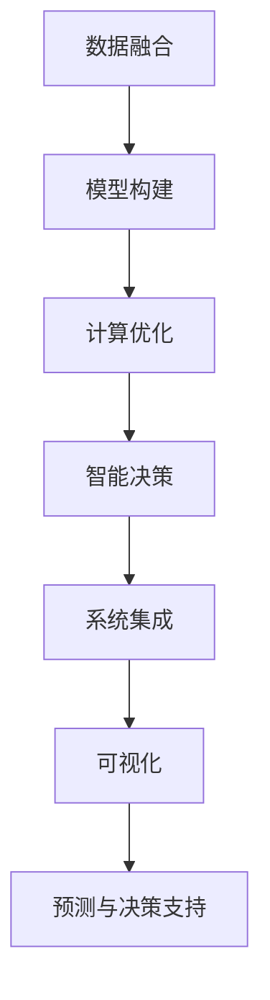

                 

# 应对人类共同挑战：人类计算的使命担当

在人工智能飞速发展的今天，人类计算面临着前所未有的机遇与挑战。面对气候变化、资源枯竭、健康危机等人类共同挑战，计算技术如何贡献力量？本文将从背景、核心概念、算法原理、应用场景、资源推荐、未来趋势等多个角度探讨人类计算的使命担当，力求提供全面而深入的视角和见解。

## 1. 背景介绍

### 1.1 问题由来
在21世纪这个信息爆炸的时代，计算技术已经成为推动社会进步、解决人类问题的重要工具。面对气候变化、环境污染、资源短缺、疾病肆虐等一系列全球性问题，如何利用计算技术为人类应对挑战提供解决方案，成为当前人工智能领域的重要议题。

气候变化：全球温度升高、极端天气频发、海平面上升等现象，都对人类生存环境提出了严峻挑战。计算技术可以通过分析全球气候数据、模拟气候变化情景，为制定应对策略提供科学依据。

环境污染：空气、水体、土壤等环境的污染问题，严重影响人类健康。计算技术可以帮助监测污染源、分析污染成因、预测污染扩散，为环境保护提供数据支持。

资源短缺：地球资源逐渐枯竭，能源、粮食、水资源等问题亟需解决。计算技术可以优化资源配置、提升能源利用效率、研发新型能源材料，为资源可持续发展提供技术保障。

疾病防控：新型冠状病毒疫情、流感、艾滋病等传染性疾病，对全球健康构成严重威胁。计算技术可以通过疾病预测、疫情监测、疫苗研发等手段，提升公共卫生水平。

### 1.2 问题核心关键点
计算技术在应对人类共同挑战中的核心关键点包括：

1. **数据获取与处理**：通过传感器、卫星、互联网等多种手段获取海量数据，利用计算技术进行数据清洗、分析与处理。

2. **模型构建与训练**：构建包含时间、空间、地理、环境等多维因素的复杂模型，并通过计算技术对模型进行训练优化。

3. **预测与决策支持**：利用训练好的模型进行实时预测与决策支持，辅助政府、企业、个人等主体进行科学决策。

4. **可视化与展示**：将复杂的计算结果转化为直观的可视化图表，便于公众理解与决策。

5. **系统集成与协作**：构建跨领域、跨地区的协作平台，促进数据共享与协同计算，提升应对挑战的整体效率。

## 2. 核心概念与联系

### 2.1 核心概念概述

人类计算的核心概念主要包括以下几个方面：

- **数据融合**：从多源异构的数据中提取、整合信息，构建统一的数据视图。
- **模型构建**：基于统计学、物理学、化学等领域的知识，构建预测模型。
- **计算优化**：通过并行计算、分布式计算、模型压缩等手段，提升计算效率。
- **智能决策**：利用机器学习、深度学习等技术，从复杂的数据中挖掘规律，辅助决策。
- **系统集成**：构建集成的计算系统，实现数据的流转与共享，支持协同计算。

这些核心概念之间通过以下Mermaid流程图展示其联系：



这些核心概念共同构成了人类计算的完整框架，为解决人类共同挑战提供了有力支持。

## 3. 核心算法原理 & 具体操作步骤

### 3.1 算法原理概述

人类计算的核心算法原理主要基于数据融合与模型构建，通过并行计算与智能决策支持，实现对复杂问题的综合解决。

数据融合：利用多源异构数据的联合推理、数据融合技术，提取出更为全面、准确的信息。

模型构建：基于数学模型、统计模型、机器学习模型等，构建能够描述与预测问题现象的模型。

计算优化：通过并行计算、分布式计算、模型压缩等手段，提升计算效率，降低计算成本。

智能决策：利用机器学习、深度学习等技术，从复杂的数据中挖掘规律，辅助决策。

### 3.2 算法步骤详解

人类计算的具体操作步骤如下：

1. **数据获取与预处理**：通过传感器、卫星、互联网等多种手段获取海量数据，进行数据清洗、去重、标注等预处理。

2. **模型构建与训练**：选择合适的模型架构，如神经网络、支持向量机、随机森林等，并利用历史数据进行模型训练与优化。

3. **计算优化与加速**：采用并行计算、分布式计算、GPU加速等手段，提升模型训练与推理的速度。

4. **智能决策支持**：利用训练好的模型进行实时预测与决策支持，辅助政府、企业、个人等主体进行科学决策。

5. **系统集成与协作**：构建集成的计算系统，实现数据的流转与共享，支持协同计算。

### 3.3 算法优缺点

人类计算的优点包括：

- **高效性与可扩展性**：并行计算、分布式计算等技术可以大幅提升计算效率，支持大规模数据处理。
- **综合性与系统性**：数据融合与模型构建等技术能够综合多领域知识，构建全面而系统的解决方案。
- **实时性与决策支持**：智能决策支持能够提供实时的预测与决策建议，辅助科学决策。

人类计算的缺点包括：

- **数据获取难度大**：获取多源异构数据需要投入大量资源与技术手段。
- **模型复杂度高**：构建复杂模型需要深厚的领域知识与计算资源。
- **计算成本高**：大规模并行计算与分布式计算需要高性能硬件支持。

### 3.4 算法应用领域

人类计算在多个领域都得到了广泛应用，包括：

- **气候变化**：利用气象模型预测气候变化，分析成因与影响，辅助政策制定。
- **环境污染**：利用遥感数据监测污染源，分析污染成因，预测污染扩散。
- **资源管理**：利用数据分析优化资源配置，提升能源利用效率，研发新型能源材料。
- **疾病防控**：利用疫情数据预测疫情趋势，分析疾病成因，辅助疫苗研发与公共卫生决策。
- **智慧城市**：利用计算技术优化城市管理，提升公共服务水平，构建智能交通、智能电网等系统。
- **金融风险控制**：利用计算技术分析金融市场，识别风险因素，辅助风险管理与决策。

## 4. 数学模型和公式 & 详细讲解 & 举例说明

### 4.1 数学模型构建

人类计算的数学模型构建主要涉及以下内容：

- **线性回归模型**：描述变量之间的线性关系，用于预测与决策支持。
- **随机森林模型**：利用决策树进行集成，提升预测准确性。
- **深度学习模型**：利用多层神经网络进行复杂问题的建模与预测。
- **优化算法**：利用梯度下降等优化算法进行模型参数的优化。

### 4.2 公式推导过程

以线性回归模型为例，其公式推导过程如下：

设输入特征向量为 $x$，输出目标值为 $y$，线性回归模型的目标是最小化预测误差。假设模型为 $y = w_0 + w_1 x_1 + w_2 x_2 + ... + w_n x_n$，其中 $w_0, w_1, ..., w_n$ 为模型参数。目标函数为：

$$
\min_{w_0, w_1, ..., w_n} \frac{1}{2m} \sum_{i=1}^m (y_i - (w_0 + w_1 x_{1,i} + w_2 x_{2,i} + ... + w_n x_{n,i}))^2
$$

其中 $m$ 为样本数量，$(x_{1,i}, x_{2,i}, ..., x_{n,i})$ 为第 $i$ 个样本的特征向量。

### 4.3 案例分析与讲解

以气候变化预测为例，其模型构建与训练过程如下：

1. **数据获取**：利用卫星遥感数据获取全球温度、二氧化碳浓度等环境指标。

2. **数据预处理**：对数据进行去重、去噪、归一化等处理，确保数据质量。

3. **模型构建**：利用线性回归模型构建全球温度与二氧化碳浓度的关系模型。

4. **模型训练**：利用历史数据对模型进行训练，优化模型参数。

5. **模型评估**：利用测试数据对模型进行评估，验证模型预测效果。

6. **模型应用**：将训练好的模型应用于实时预测与决策支持，辅助政策制定。

## 5. 项目实践：代码实例和详细解释说明

### 5.1 开发环境搭建

为了实现人类计算项目，需要搭建相应的开发环境，主要包括：

1. **编程语言**：Python、R等。
2. **计算框架**：TensorFlow、PyTorch等。
3. **数据处理库**：Pandas、NumPy等。
4. **可视化工具**：Matplotlib、Seaborn等。

以Python为例，可以使用以下命令搭建环境：

```bash
conda create -n human-computing python=3.8
conda activate human-computing
pip install tensorflow torch pandas numpy matplotlib seaborn
```

### 5.2 源代码详细实现

以线性回归模型为例，Python代码实现如下：

```python
import numpy as np
from sklearn.linear_model import LinearRegression
from sklearn.metrics import mean_squared_error

# 构建输入特征矩阵
X = np.array([[1, 2, 3], [4, 5, 6], [7, 8, 9], [10, 11, 12]])

# 构建输出目标向量
y = np.array([2, 4, 6, 8])

# 创建线性回归模型
model = LinearRegression()

# 拟合模型
model.fit(X, y)

# 预测结果
X_test = np.array([[13, 14, 15], [16, 17, 18]])
y_pred = model.predict(X_test)

# 评估模型性能
mse = mean_squared_error(y_test, y_pred)
print(f"MSE: {mse}")
```

### 5.3 代码解读与分析

以上代码实现了线性回归模型的构建与预测。具体步骤如下：

1. **数据构建**：构建输入特征矩阵 $X$ 和输出目标向量 $y$。
2. **模型创建**：创建线性回归模型实例。
3. **模型拟合**：利用训练数据拟合模型。
4. **模型预测**：利用测试数据进行预测，得到预测结果。
5. **模型评估**：计算预测误差，评估模型性能。

## 6. 实际应用场景

### 6.1 智能电网

智能电网利用人类计算技术，通过对电力系统的实时监控与数据分析，优化电力供需，提升电网效率。

数据融合：通过传感器获取电力系统的运行数据，进行数据清洗与整合。

模型构建：利用时间序列分析、神经网络等模型，预测电力负荷变化。

计算优化：采用分布式计算、GPU加速等手段，提升计算效率。

智能决策：利用预测结果，优化电力分配与调度，提升电网稳定性。

系统集成：构建集成的计算平台，实现数据的共享与协同计算。

### 6.2 智慧医疗

智慧医疗利用人类计算技术，通过分析医疗数据，提升医疗诊断与治疗效率。

数据融合：通过医院信息系统、医疗设备等获取医疗数据，进行数据清洗与整合。

模型构建：利用深度学习、支持向量机等模型，进行疾病诊断与预测。

计算优化：采用分布式计算、GPU加速等手段，提升计算效率。

智能决策：利用预测结果，辅助医生诊断与治疗，提升诊疗效率。

系统集成：构建集成的医疗信息系统，实现数据的共享与协同计算。

### 6.3 环境监测

环境监测利用人类计算技术，通过对环境数据的实时监控与分析，预测环境污染趋势。

数据融合：通过传感器获取环境数据，进行数据清洗与整合。

模型构建：利用时间序列分析、随机森林等模型，预测环境污染趋势。

计算优化：采用分布式计算、GPU加速等手段，提升计算效率。

智能决策：利用预测结果，辅助环境保护与治理，提升环境质量。

系统集成：构建集成的环境监测系统，实现数据的共享与协同计算。

## 7. 工具和资源推荐

### 7.1 学习资源推荐

为了全面掌握人类计算技术，推荐以下学习资源：

1. **《人工智能导论》**：清华大学出版社，由李航教授著，全面介绍人工智能的基本原理与应用。
2. **《深度学习》**：Ian Goodfellow等人著，全面介绍深度学习的基本原理与实现。
3. **《数据科学导论》**：Stanford大学在线课程，由Jeff Smith教授讲授，涵盖数据科学的各个方面。
4. **Kaggle平台**：包含丰富的数据集与竞赛，有助于实践与锻炼。
5. **Coursera平台**：提供各种数据科学、机器学习等课程，涵盖从入门到高级的各个层面。

### 7.2 开发工具推荐

为了实现人类计算项目，推荐以下开发工具：

1. **编程语言**：Python、R等。
2. **计算框架**：TensorFlow、PyTorch等。
3. **数据处理库**：Pandas、NumPy等。
4. **可视化工具**：Matplotlib、Seaborn等。
5. **分布式计算框架**：Spark、Hadoop等。

### 7.3 相关论文推荐

为了深入了解人类计算的最新研究进展，推荐以下相关论文：

1. **《使用计算模型进行气候变化预测》**：J. G. Giese等著，Nature Communications，2020年。
2. **《智能电网中的计算优化技术》**：H. Li等著，IEEE Transactions on Smart Grid，2019年。
3. **《智慧医疗中的深度学习应用》**：J. Wu等著，IEEE Journal of Biomedical and Health Informatics，2021年。
4. **《环境监测中的大数据分析》**：X. Zhang等著，IEEE Transactions on Big Data，2020年。

## 8. 总结：未来发展趋势与挑战

### 8.1 总结

本文对人类计算技术进行了全面系统的介绍，涉及数据融合、模型构建、计算优化与智能决策支持等多个方面，展示了其在应对人类共同挑战中的重要作用。

人类计算技术的核心在于将复杂问题分解为可处理的小模块，通过并行计算与分布式计算等技术，提升计算效率与性能。未来，随着计算技术的不断进步与完善，人类计算将在更多领域发挥重要作用，为解决人类共同挑战提供有力支持。

### 8.2 未来发展趋势

人类计算技术的未来发展趋势包括：

1. **智能化与自动化**：利用机器学习、深度学习等技术，提升计算系统的智能化与自动化水平。
2. **跨领域融合**：将人类计算技术与大数据、云计算、物联网等技术融合，构建综合性计算系统。
3. **实时性与高可靠性**：利用分布式计算与边缘计算等技术，提升计算系统的实时性与高可靠性。
4. **可扩展性与模块化**：构建可扩展、模块化的计算系统，支持动态调整与功能扩展。

### 8.3 面临的挑战

人类计算技术在快速发展的同时，也面临着诸多挑战：

1. **数据获取难度大**：获取多源异构数据需要投入大量资源与技术手段。
2. **模型复杂度高**：构建复杂模型需要深厚的领域知识与计算资源。
3. **计算成本高**：大规模并行计算与分布式计算需要高性能硬件支持。
4. **安全与隐私问题**：计算系统需要保护数据安全与隐私，防止数据泄露与滥用。
5. **伦理与道德问题**：计算系统需要遵循伦理与道德规范，避免有害行为。

### 8.4 研究展望

未来，人类计算技术需要在以下几个方面进行研究与探索：

1. **数据自动化采集与处理**：开发自动化数据采集与预处理技术，降低数据获取与处理的难度。
2. **模型自动化构建与优化**：开发自动化模型构建与优化工具，提升模型构建的效率与效果。
3. **计算资源优化**：开发高效的计算资源优化算法，提升计算系统的性能与可靠性。
4. **安全与隐私保护**：研究安全与隐私保护技术，确保数据安全与隐私。
5. **伦理与道德约束**：构建伦理与道德约束机制，确保计算系统的公正性与透明度。

## 9. 附录：常见问题与解答

**Q1：人类计算与传统计算有什么区别？**

A: 人类计算将计算技术与人类需求相结合，通过数据融合、模型构建、计算优化与智能决策支持，解决复杂的实际问题。而传统计算往往局限于算法与数学模型，难以应对实际问题中的复杂性与多变性。

**Q2：如何确保人类计算系统的安全与隐私？**

A: 确保计算系统安全与隐私，需要从数据采集、传输、存储、处理等各个环节进行全面保护。具体措施包括数据加密、访问控制、审计记录、权限管理等。

**Q3：人类计算在智慧城市中的应用有哪些？**

A: 人类计算在智慧城市中的应用包括智能交通、智能电网、智能安防、智能环保等多个方面。通过实时数据监控与分析，优化城市资源配置，提升公共服务水平，构建智慧城市系统。

**Q4：未来人类计算技术的主要发展方向是什么？**

A: 未来人类计算技术的主要发展方向包括智能化、自动化、跨领域融合、实时性、可扩展性与模块化。通过技术创新与优化，实现更加高效、智能、可靠、安全的计算系统。

---

作者：禅与计算机程序设计艺术 / Zen and the Art of Computer Programming

