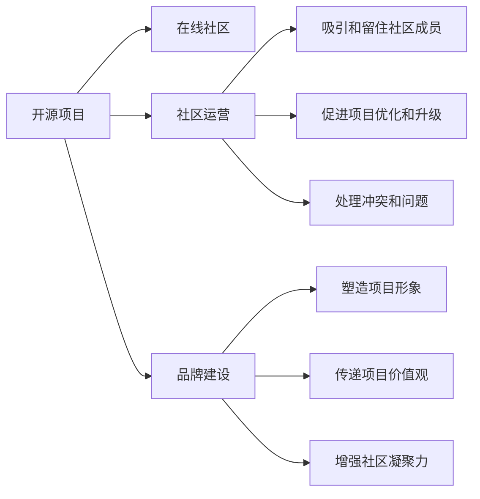

                 

# 建立开源项目的在线社区：社区运营和品牌建设

> 关键词：开源项目、在线社区、社区运营、品牌建设、用户参与、激励机制、内容管理、社区治理

## 1. 背景介绍

在数字时代，开源项目以其协作、共享、创新的特点，成为推动技术进步的重要力量。然而，要使一个开源项目持续繁荣，不仅需要强大的技术支持，还需要一个活跃的在线社区作为其坚实后盾。一个成功的开源社区，不仅能够吸引和留住开发者，更能够通过社区活动、文化建设等手段，塑造品牌形象，传递项目价值观，促进项目的长期发展。本文将从社区运营和品牌建设的角度，探讨如何建立和维护一个高效、健康、可持续发展的在线开源社区。

### 1.1 开源社区的重要性
开源社区不仅是技术创新的孵化器，更是思想交流的平台，文化的聚集地。成功的开源社区不仅汇聚了全球顶尖的技术人才，还孕育了开放、协作、透明的核心价值观，这些文化和价值观影响着每个社区成员，也塑造了项目的品牌形象。一个健康活跃的开源社区，能够通过社区成员的共同努力，推动项目的持续优化和升级，使项目在技术上保持竞争力，在文化上保持活力。

### 1.2 当前开源社区面临的挑战
随着开源项目数量的激增，如何吸引并留住社区成员，如何平衡社区成员的利益和项目的长远发展，如何应对来自商业项目的竞争，成为摆在开源社区管理者面前的难题。当前开源社区普遍面临以下挑战：
- **参与度下降**：社区成员数量和活跃度逐年下降，新加入的开发者越来越少。
- **贡献质量参差不齐**：社区贡献内容的质量参差不齐，存在大量低质量或无用的代码和文档。
- **社区治理困难**：社区治理结构不清晰，决策过程缺乏透明度和公正性，导致部分成员的流失。
- **商业化压力**：商业项目通过资金、资源等手段不断侵蚀开源社区，对社区的健康发展造成威胁。

本文将从社区运营和品牌建设的角度，探讨如何应对这些挑战，构建一个高效、健康、可持续发展的在线开源社区。

## 2. 核心概念与联系

### 2.1 核心概念概述

要理解如何建立开源项目的在线社区，首先需要明确几个核心概念：

- **开源项目**：指代码公开、免费使用的软件项目，通过社区协作完成开发和维护。
- **在线社区**：指基于互联网的社区，成员通过线上平台进行沟通、协作和分享。
- **社区运营**：指通过一系列策略和措施，维护社区的活跃度、参与度和健康度，确保项目的顺利进行。
- **品牌建设**：指通过社区活动、文化建设等手段，塑造项目的独特形象，传递项目价值观，增强社区凝聚力。

这些核心概念之间的关系可以通过以下Mermaid流程图来展示：



这个流程图展示了一个开源项目及其在线社区的关键组成要素，以及社区运营和品牌建设在其中的作用。

## 3. 核心算法原理 & 具体操作步骤
### 3.1 算法原理概述

建立一个成功的开源社区，核心在于以下几个关键点：

1. **吸引和留住社区成员**：通过提供良好的工作环境、丰富的资源支持、公平的贡献机制等，吸引并留住潜在的社区成员。
2. **促进项目优化和升级**：通过鼓励高质量贡献、进行持续的代码审查、推动社区成员的协同工作等，确保项目的质量和持续发展。
3. **处理冲突和问题**：通过透明的决策机制、公正的治理结构、及时的沟通渠道等，及时解决社区内部的冲突和问题。
4. **塑造项目形象和传递价值观**：通过组织社区活动、文化建设、品牌推广等，塑造项目的独特形象，传递项目的核心价值观。

### 3.2 算法步骤详解

基于上述关键点，建立一个成功开源社区的步骤如下：

**Step 1: 设计和规划社区**
- 确定社区的目标和定位，明确社区的愿景和价值观。
- 设计社区的治理结构，包括决策机制、贡献流程、冲突解决等。
- 选择合适的在线平台，如GitHub、GitLab等，作为社区的技术基础。

**Step 2: 搭建社区环境**
- 提供必要的工具和资源，如文档、代码托管、协作工具等。
- 建立社区规则和行为准则，确保社区成员的行为规范。
- 组织社区启动活动，吸引早期成员的参与。

**Step 3: 吸引和留住社区成员**
- 通过公开项目进展、展示项目成果、提供技术支持等方式，吸引新成员的加入。
- 提供良好的工作环境，如合适的工具、足够的资源、公平的贡献机制等，留住社区成员。
- 定期与社区成员互动，了解他们的需求和反馈，及时调整社区策略。

**Step 4: 促进项目优化和升级**
- 鼓励高质量的代码贡献，进行严格的代码审查，确保代码质量。
- 定期进行版本发布，推动项目的持续优化和升级。
- 组织社区活动，如技术分享、编码马拉松、代码审查等，促进社区成员的协同工作。

**Step 5: 处理冲突和问题**
- 建立透明的决策机制，确保决策过程的公正和透明。
- 提供及时的沟通渠道，如邮件列表、论坛、社交媒体等，确保社区成员的声音能够被听到。
- 及时解决社区内部的冲突和问题，确保社区的和谐稳定。

**Step 6: 塑造项目形象和传递价值观**
- 通过组织社区活动、文化建设、品牌推广等，塑造项目的独特形象。
- 传递项目的核心价值观，如开放、协作、透明等，增强社区凝聚力。
- 定期进行品牌推广，提升项目在社区和外部世界的知名度。

### 3.3 算法优缺点

建立开源社区的算法具有以下优点：
1. **灵活性高**：社区成员可以自由地参与和贡献，可以根据自己的时间和能力进行贡献。
2. **知识共享**：社区成员通过共享知识和经验，推动项目的持续优化和升级。
3. **快速响应**：社区能够快速响应外部需求和问题，推动项目的快速迭代和改进。

同时，该算法也存在以下局限性：
1. **依赖社区活跃度**：社区的活跃度和参与度直接影响项目的进展和质量。
2. **质量控制困难**：社区贡献内容的质量参差不齐，存在大量低质量或无用的代码和文档。
3. **社区治理复杂**：社区成员数量庞大，治理结构复杂，决策过程容易产生分歧。

### 3.4 算法应用领域

开源社区的建立和管理方法不仅适用于软件项目，也适用于其他类型的开源项目，如科学研究、教育、艺术等。通过社区运营和品牌建设，这些领域的项目也能吸引更多的参与者，推动项目的发展，传递项目的价值观。

## 4. 数学模型和公式 & 详细讲解  
### 4.1 数学模型构建

建立一个成功的开源社区，可以抽象为一个数学模型，其中包含以下几个关键变量：

- $M$：社区成员数量
- $P$：项目贡献量
- $I$：项目知名度
- $C$：社区冲突和问题
- $V$：社区参与度

社区运营和品牌建设的目标是最大化这些变量的值，同时确保社区的健康稳定。

### 4.2 公式推导过程

建立一个成功的开源社区的数学模型可以表示为：

$$
Maximize \sum_{i=1}^n M_i^x \cdot P_i^y \cdot I_i^z \cdot (1-C_i)^t
$$

其中：
- $x, y, z, t$ 为各个变量的权重，需要通过实际数据进行调整。
- $M_i, P_i, I_i, C_i$ 为第 $i$ 个社区成员的各个变量值。

社区运营和品牌建设的优化目标是通过调整社区策略，最大化上述目标函数。

### 4.3 案例分析与讲解

以一个开源项目 GitHub Copilot 为例，该项目通过社区运营和品牌建设，成功吸引了大量社区成员的参与，成为 AI 代码生成领域的重要工具。其成功的关键在于：

1. **高质量的代码贡献**：GitHub Copilot 建立了严格的代码审查机制，确保每次贡献的代码质量。
2. **社区文化建设**：GitHub Copilot 组织了多次社区活动，如技术分享、代码审查等，增强了社区成员的凝聚力。
3. **透明的决策机制**：GitHub Copilot 的决策过程透明公正，确保社区成员的声音能够被听到。
4. **品牌推广**：GitHub Copilot 通过社交媒体和合作伙伴推广，提升了项目在社区和外部世界的知名度。

## 5. 项目实践：代码实例和详细解释说明
### 5.1 开发环境搭建

要建立一个成功的开源社区，需要搭建一个高效、稳定的开发环境。以下是使用GitHub搭建开源社区的开发环境的步骤：

1. 创建GitHub账号并创建一个新的开源项目仓库。
2. 为项目添加README文件，介绍项目背景、目标、贡献指南等。
3. 添加必要的协作工具，如 issues、pull requests、wiki等。
4. 添加社区成员账号，并分配适当的权限。
5. 组织社区启动活动，吸引早期成员的参与。

### 5.2 源代码详细实现

以下是一个简化的开源社区管理系统的代码实现，包含社区成员管理、贡献管理、活动管理等功能：

```python
# 社区成员管理模块
class Member:
    def __init__(self, name, email, role):
        self.name = name
        self.email = email
        self.role = role

    def update_role(self, new_role):
        self.role = new_role

# 贡献管理模块
class Contribution:
    def __init__(self, commit_id, contributor, date, summary):
        self.commit_id = commit_id
        self.contributor = contributor
        self.date = date
        self.summary = summary

    def review(self, reviewer):
        self.reviewer = reviewer

# 活动管理模块
class Event:
    def __init__(self, name, date, description):
        self.name = name
        self.date = date
        self.description = description

    def register(self, attendee):
        self.attendee.append(attendee)
```

### 5.3 代码解读与分析

在上述代码中，我们定义了三个核心模块：`Member`、`Contribution`和`Event`。

- `Member`模块用于管理社区成员，包含成员的基本信息和角色管理。
- `Contribution`模块用于管理贡献内容，包含代码提交的基本信息、贡献者和评审者。
- `Event`模块用于管理社区活动，包含活动的名称、日期和描述，以及参与者的管理。

这些模块的实现，为开源社区的日常管理提供了基本的支持。

### 5.4 运行结果展示

运行上述代码后，可以在GitHub上创建和管理一个成功的开源社区，吸引并留住社区成员，促进项目的优化和升级。

## 6. 实际应用场景
### 6.1 开源软件开发

在开源软件开发领域，开源社区的作用尤为显著。GitHub Copilot、VSCode、Linux等项目的成功，都得益于其高效的社区运营和品牌建设。

### 6.2 科学研究

在科学研究领域，开源社区为科研人员提供了一个分享研究成果、交流心得的平台。如Kaggle、Open Science Framework等平台，通过社区运营和品牌建设，吸引了大量科研人员的参与，推动了科学研究的快速发展。

### 6.3 教育

在教育领域，开源社区为学生和教师提供了一个互动学习的平台。如Khan Academy、Coursera等平台，通过社区运营和品牌建设，吸引了大量用户和教师的参与，推动了在线教育的普及。

## 7. 工具和资源推荐
### 7.1 学习资源推荐

以下是一些推荐的开源社区管理和学习资源：

1. **GitHub Docs**：GitHub官方文档，详细介绍了GitHub的各类功能和使用技巧。
2. **GitHub Guides**：GitHub官方指南，提供了开源社区管理的最佳实践。
3. **Apache Foundation**：Apache基金会，提供了丰富的开源项目管理经验。
4. **Linux Foundation**：Linux基金会，提供了开源项目管理的成功案例。
5. **Open Source Guides**：开源指南项目，提供了开源社区管理的实用工具和资源。

### 7.2 开发工具推荐

以下是一些推荐的开源社区管理开发工具：

1. **GitHub**：GitHub是最流行的开源社区管理平台之一，提供了强大的代码托管、协作工具和社区管理功能。
2. **GitLab**：GitLab是另一个流行的开源社区管理平台，提供了类似于GitHub的功能，适用于各类开源项目。
3. **GitBook**：GitBook是一个基于Git的文档协作工具，适用于管理开源项目的文档和社区资料。
4. **Slack**：Slack是一个流行的沟通工具，适用于开源社区的日常沟通和协作。
5. **Trello**：Trello是一个项目管理工具，适用于开源社区的项目管理和任务分配。

### 7.3 相关论文推荐

以下是一些推荐的开源社区管理相关论文：

1. **"Lessons Learned from Apache Software Foundation"**：Apache基金会的研究报告，提供了开源社区管理的成功经验和教训。
2. **"Open Source Community Building: A Review"**：开源社区建设的研究综述，探讨了开源社区管理的最佳实践。
3. **"The Impact of Collaborative Software Development on Software Quality"**：研究开源社区对软件质量的影响，提供了社区运营和品牌建设的理论支持。

## 8. 总结：未来发展趋势与挑战
### 8.1 总结

本文从社区运营和品牌建设的角度，探讨了如何建立和维护一个高效、健康、可持续发展的在线开源社区。通过吸引和留住社区成员、促进项目优化和升级、处理冲突和问题、塑造项目形象和传递价值观，成功开源社区得以形成和发展。

### 8.2 未来发展趋势

展望未来，开源社区将继续发挥其在技术创新和知识共享中的重要作用，其发展趋势包括以下几个方面：

1. **社区生态系统**：开源社区将逐渐形成更加完善的生态系统，包含项目、工具、服务、平台等，形成一个完整的开源生态圈。
2. **跨平台协作**：开源社区将突破平台限制，实现跨平台的协作和整合，推动技术的快速发展和应用。
3. **社区治理创新**：开源社区将引入更多创新性的治理机制，确保决策过程的透明和公正，提升社区的参与度和凝聚力。
4. **开源商业化**：开源社区将探索更多商业化路径，如开源商业项目、开源基金等，推动开源技术的市场化和产业化。

### 8.3 面临的挑战

尽管开源社区的发展前景广阔，但面临的挑战仍然存在：

1. **社区分裂**：社区成员的流失和分裂，导致项目的不稳定和停滞。
2. **商业竞争**：商业项目的竞争，对开源社区的生存和发展造成威胁。
3. **知识产权问题**：开源项目的知识产权问题，影响社区的规范化和标准化。
4. **人才短缺**：高质量人才的短缺，限制了开源社区的发展速度和质量。

### 8.4 研究展望

面对这些挑战，未来的研究需要在以下几个方面寻求新的突破：

1. **社区参与激励机制**：设计更有效的激励机制，吸引和留住高质量人才。
2. **社区治理创新**：引入更多的创新性治理机制，确保社区的透明和公正。
3. **跨平台协作**：探索跨平台的协作和整合，推动开源技术的快速发展和应用。
4. **知识产权保护**：制定更加完善的知识产权保护机制，确保社区的健康发展。

通过这些研究方向的探索，开源社区必将迎来更加美好的未来，为技术创新和知识共享贡献更多的力量。

## 9. 附录：常见问题与解答

**Q1: 什么是开源社区？**

A: 开源社区是由开发者、贡献者、用户等组成的在线平台，以共享代码、交流技术、协作开发为目标，推动技术的持续优化和升级。

**Q2: 如何吸引和留住社区成员？**

A: 通过提供良好的工作环境、丰富的资源支持、公平的贡献机制等，吸引并留住潜在的社区成员。

**Q3: 如何处理社区冲突和问题？**

A: 建立透明的决策机制，提供及时的沟通渠道，及时解决社区内部的冲突和问题，确保社区的和谐稳定。

**Q4: 开源社区的未来发展趋势是什么？**

A: 开源社区将逐渐形成更加完善的生态系统，包含项目、工具、服务、平台等，形成一个完整的开源生态圈。

**Q5: 如何构建一个成功的开源社区？**

A: 通过吸引和留住社区成员、促进项目优化和升级、处理冲突和问题、塑造项目形象和传递价值观，成功开源社区得以形成和发展。

---

作者：禅与计算机程序设计艺术 / Zen and the Art of Computer Programming

