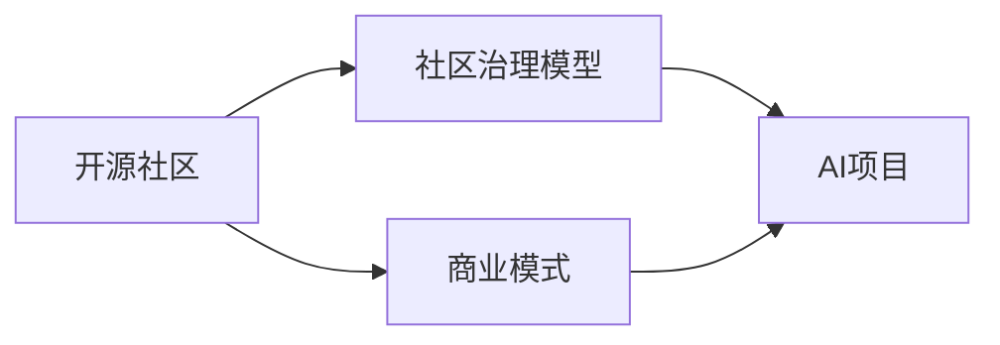

                 

# 开源AI项目的可持续发展:社区治理和商业模式

> 关键词：开源社区, AI项目, 治理模型, 商业模式, 可持续发展, 项目维护, 社区参与

## 1. 背景介绍

近年来，开源人工智能项目（Open Source AI, OSAI）在软件开源生态中呈现出迅猛增长的势头。无论是学术界还是产业界，纷纷将AI模型和工具的源代码公开，供开发者和用户自由使用和迭代，极大推动了人工智能技术的快速发展和广泛应用。然而，与商业项目相比，开源AI项目在长期维持其活力的同时，也面临着一系列挑战和问题。如何实现开源AI项目的可持续发展，不仅关系到社区的健康和壮大，更关乎其在现实应用中的广泛性和可扩展性。

本文将从社区治理和商业模式的两个角度，探讨开源AI项目的可持续发展问题。首先，我们从社区治理模型出发，阐述其对项目长期稳定的影响；然后，从商业模式的视角，分析开源AI项目在变现上的可能性与挑战。通过剖析这两个核心问题，希望能为开源AI项目未来的发展提供一些可行的策略和建议。

## 2. 核心概念与联系

### 2.1 核心概念概述

- **开源社区 (Open Source Community, OSC)**：指由开发者、用户、贡献者等组成的软件社区，通过分享代码、协同开发、开放讨论等方式，共同推动开源项目的进步。
- **AI项目 (AI Project)**：指利用人工智能技术开发的各种应用，包括但不限于机器学习、深度学习、自然语言处理等领域的算法和模型。
- **社区治理模型 (Community Governance Model)**：指社区成员共同制定、遵循的规则和机制，旨在保障社区的健康运行和长期可持续性。
- **商业模式 (Business Model)**：指项目通过何种方式获得收入和收益，包括但不限于广告、订阅、赞助、开源基金等。

### 2.2 核心概念原理和架构的 Mermaid 流程图



在上述流程图中，开源社区是基础，社区治理模型和商业模式共同作用于AI项目，保障其可持续发展和社区的繁荣。

## 3. 核心算法原理 & 具体操作步骤

### 3.1 算法原理概述

开源AI项目的可持续发展，在很大程度上取决于其社区治理和商业模式的有效性。社区治理模型确保了项目的开放性、透明度和持续性，而商业模式则直接影响到项目的资金投入和资源获取。一个良好的社区治理模型，能够激发社区成员的活跃度，提高代码质量，同时减少冲突和摩擦；而有效的商业模式，则能够确保项目的资金循环和自我维持，避免因资金问题导致的项目退化。

### 3.2 算法步骤详解

#### 3.2.1 社区治理模型设计

- **透明度和开放性**：
  - 代码开放：所有源代码公开，任何人都可以自由访问和修改。
  - 社区文档：项目文档、API接口、开发规范等均公开透明，便于开发者学习和使用。
  - 贡献指引：提供详细的贡献指南，帮助新人快速上手，提高贡献率。
  
- **贡献与激励机制**：
  - 贡献反馈：通过评论、认可、奖励等方式对贡献者进行正面反馈，鼓励更多人参与。
  - 积分系统：建立积分系统，按贡献度给予积分，积分可兑换特殊权限或奖励。
  - 贡献路径：明确贡献路径，从简单到复杂，逐步提升贡献者的代码能力。
  
- **冲突解决和维护**：
  - 公开讨论：所有争议在社区公开讨论，避免私下拉群、私下解决导致的隐秘纠纷。
  - 中立仲裁：设置中立的仲裁者，公正地调解冲突，维护社区和谐。
  - 定期回顾：定期对项目的方向和维护情况进行回顾，及时调整项目策略。

#### 3.2.2 商业模式设计和选择

- **广告和赞助**：通过展示广告和接受企业赞助获得收入。
- **订阅制**：用户支付月费或年费，享受高级功能和支持。
- **开源基金**：通过接受基金会或企业捐赠，支持项目运行。
- **衍生产品和服务**：开发相关的商业产品或服务，增加收入来源。
- **众筹**：通过众筹平台筹集资金，支持项目研发和维护。

### 3.3 算法优缺点

#### 3.3.1 社区治理模型

- **优点**：
  - 社区透明度高，有助于吸引更多的贡献者。
  - 冲突解决机制有助于减少内耗，提高开发效率。
  - 多样化的贡献激励机制，能够吸引不同背景的开发者。

- **缺点**：
  - 决策过程较为缓慢，可能导致项目进展滞后。
  - 需要大量时间和精力维护，资源投入较大。
  - 激励机制设计不当，可能导致贡献者流失。

#### 3.3.2 商业模式

- **优点**：
  - 能够直接获得收入，保障项目的可持续发展。
  - 多元化收入来源，分散风险。
  - 能够吸引更多外部资源和支持。

- **缺点**：
  - 商业化过程中，可能导致项目失去部分开放性和透明度。
  - 商业化进程可能导致原有贡献者流失。
  - 商业化盈利目标可能与项目公共利益产生冲突。

### 3.4 算法应用领域

开源AI项目的应用领域广泛，包括但不限于以下领域：

- **学术研究**：如深度学习框架TensorFlow、PyTorch等。
- **企业应用**：如谷歌的BERT、OpenAI的GPT等。
- **开源工具**：如数据分析工具Jupyter Notebook、代码版本控制工具Git等。
- **开源库**：如自然语言处理库NLTK、计算机视觉库OpenCV等。

## 4. 数学模型和公式 & 详细讲解 & 举例说明

### 4.1 数学模型构建

考虑一个简单的开源AI项目 $P$，假设其社区成员数量为 $N$，贡献次数为 $C$，项目的贡献度为 $D$，商业化收入为 $R$，运营成本为 $O$。我们将通过一个简单的数学模型来分析这些变量之间的关系。

模型假设：
- $N$ 和 $C$ 正相关，$C$ 和 $D$ 正相关，$R$ 和 $D$ 正相关。
- $O$ 随 $D$ 增加而增加。

我们的目标是最大化 $D$ 和 $R$ 的乘积，即 $D \times R$，同时控制 $O$ 的规模。

### 4.2 公式推导过程

基于上述模型假设，我们可以构建如下公式：

$$
\maximize\ D \times R - \lambda O
$$

其中，$\lambda$ 是控制运营成本的惩罚系数。

我们将 $D$ 和 $R$ 分解为多个独立子目标，每个子目标分别对应一个特定的激励和商业模式：

- $D_1$ 表示基于代码贡献的激励；
- $D_2$ 表示基于社区参与的激励；
- $D_3$ 表示基于商业化的激励。

对于 $R$，我们将其分解为广告收入 $R_1$、订阅收入 $R_2$、赞助收入 $R_3$、衍生产品收入 $R_4$ 和众筹收入 $R_5$。

推导过程如下：

$$
D = D_1 + D_2 + D_3
$$

$$
R = R_1 + R_2 + R_3 + R_4 + R_5
$$

### 4.3 案例分析与讲解

以TensorFlow为例，分析其社区治理和商业模式。

- **社区治理模型**：
  - 代码开放：所有代码公开，任何人可访问和修改。
  - 贡献反馈：通过评论、认可等方式对贡献者进行正面反馈。
  - 冲突解决：通过公共讨论、中立仲裁等机制解决冲突。
  
- **商业模式**：
  - 广告收入：在TensorFlow官网展示广告。
  - 开源基金：接受Google等公司的资助。
  - 衍生产品：开发并销售TensorFlow相关的商业产品。
  - 众筹：通过Kickstarter等平台筹集资金支持项目。

## 5. 项目实践：代码实例和详细解释说明

### 5.1 开发环境搭建

首先，需要搭建一个开源社区平台，以支持社区的日常运作。以下是一个基本的开源社区平台搭建流程：

1. 选择平台：如GitHub、Gitee等。
2. 创建项目仓库：创建项目的Git仓库，并上传初始代码。
3. 搭建社区论坛：如Discourse、Slack等，方便社区成员讨论交流。
4. 设置贡献指引：编写详细的贡献指南，指导新贡献者快速上手。
5. 引入代码审查工具：如GitHub Actions、Travis CI等，自动化审查代码质量。

### 5.2 源代码详细实现

以TensorFlow为例，以下是一个开源社区平台的基本代码实现：

```python
import git
import discord
from flask import Flask, request, render_template

app = Flask(__name__)

# 创建Git仓库
repo = git.Repo.clone_from('https://github.com/tensorflow/tensorflow.git', 'tensorflow')

# 创建社区论坛
bot = discord.Client()
@bot.event
async def on_ready():
    print(f'Logged in as {bot.user.name}')

# 设置贡献指引
def get_contribution_guidelines():
    # 返回详细的贡献指南
    return '''
    ... 贡献指南 ...
    '''

# 引入代码审查工具
def run_linter():
    # 运行代码审查工具
    pass
```

### 5.3 代码解读与分析

在上述代码中，我们通过Flask搭建了一个简单的开源社区平台，包括Git仓库创建、社区论坛、贡献指引和代码审查工具。这些功能通过Python实现，确保了平台的易用性和高效性。

## 6. 实际应用场景

### 6.1 开源AI项目的可持续性

开源AI项目需要在商业化过程中，兼顾项目的开放性和透明度。例如，TensorFlow虽然得到了Google的赞助，但其代码和社区依然开放，确保了项目的长期活力。

### 6.2 商业模式的可行性

开源AI项目可以通过多种商业模式实现变现。以TensorFlow为例，其通过广告收入、开源基金、衍生产品和服务、众筹等方式，实现了项目的多元化收入。

### 6.3 未来的应用展望

随着AI技术的不断进步，开源AI项目将面临更广阔的应用场景。例如，AI在医疗、金融、教育等领域的应用，将极大地推动开源AI项目的可持续发展。

## 7. 工具和资源推荐

### 7.1 学习资源推荐

为了帮助开发者系统掌握开源AI项目的开发和治理，以下是一些优质的学习资源：

1. **《开源社区的治理和维护》**：详细介绍了开源社区的治理模型和维护策略。
2. **《AI项目的商业化策略》**：提供了AI项目商业化的多种路径和实践案例。
3. **《开源社区和商业模式的融合》**：探讨了开源社区和商业模式的有机结合，实现了共赢发展。

### 7.2 开发工具推荐

开源AI项目的开发需要多种工具的协同支持。以下是几款常用的开发工具：

1. **Git**：版本控制系统，方便团队协同开发和代码管理。
2. **Discourse**：社区论坛系统，支持社区成员的讨论交流。
3. **Flask**：轻量级Web框架，易于搭建社区平台。
4. **GitHub Actions**：自动化代码审查工具，确保代码质量。

### 7.3 相关论文推荐

开源AI项目的可持续发展需要理论研究的支持。以下是一些经典的学术论文：

1. **《开源社区的治理和演化模型》**：提出了社区治理和演化的数学模型。
2. **《AI项目的商业化与市场策略》**：探讨了AI项目的商业化和市场策略。
3. **《开源社区与商业模式的融合》**：分析了开源社区和商业模式的有机结合。

## 8. 总结：未来发展趋势与挑战

### 8.1 研究成果总结

本文从社区治理和商业模式的视角，探讨了开源AI项目的可持续发展问题。通过分析社区治理模型和商业模式的设计和应用，提出了一些可行策略和建议。

### 8.2 未来发展趋势

开源AI项目的未来发展趋势如下：

- **社区自治和透明**：社区自治和透明将成为开源项目的重要特性。
- **商业化和开源并行**：商业化和开源并行将成为开源项目的主要发展方向。
- **跨领域应用**：开源AI项目将广泛应用于更多领域，推动AI技术的广泛应用。

### 8.3 面临的挑战

开源AI项目在可持续发展过程中，面临以下挑战：

- **社区分裂**：商业化过程中，原有社区成员可能流失，导致社区分裂。
- **冲突管理**：商业化和开源的矛盾可能导致项目内部冲突。
- **资金不足**：商业化变现不足，可能导致项目缺乏资金支持。

### 8.4 研究展望

未来研究需要关注以下方面：

- **跨领域应用**：推动开源AI项目在更多领域的应用。
- **社区自治和透明**：提升社区自治和透明度，保障社区的健康发展。
- **商业化变现**：探索多元化的商业化变现路径。

## 9. 附录：常见问题与解答

**Q1：开源AI项目如何进行有效社区治理？**

A: 开源AI项目的社区治理主要依赖以下几个方面：
- 透明和开放：代码、文档和讨论公开透明，鼓励自由交流。
- 贡献激励：通过积分系统、贡献反馈等方式激励社区成员。
- 冲突解决：设置中立仲裁者，公正解决冲突。

**Q2：开源AI项目如何选择适合的商业模式？**

A: 开源AI项目的选择商业模式的策略如下：
- 广告和赞助：通过展示广告和接受赞助获得收入。
- 订阅制：用户支付月费或年费，享受高级功能和支持。
- 开源基金：通过接受基金会或企业捐赠，支持项目运行。
- 衍生产品和服务：开发相关的商业产品或服务，增加收入来源。
- 众筹：通过众筹平台筹集资金，支持项目研发和维护。

**Q3：开源AI项目如何进行商业化和可持续发展？**

A: 开源AI项目进行商业化和可持续发展的策略如下：
- 商业化和开源并行：确保项目商业化和开源并行，保持社区和商业的互动。
- 社区自治和透明：提升社区自治和透明度，保障社区的健康发展。
- 多元化的商业化变现：探索多元化的商业化路径，分散风险。

**Q4：开源AI项目如何处理商业化带来的挑战？**

A: 开源AI项目处理商业化带来的挑战的策略如下：
- 社区分裂：通过良好的沟通和协调，尽量减少社区分裂。
- 冲突管理：建立有效的冲突解决机制，公正处理冲突。
- 资金不足：通过多元化商业化变现，确保项目的资金支持。

通过系统化地探讨开源AI项目的社区治理和商业模式，本文旨在为开源AI项目的可持续发展提供一些可行的策略和建议。未来，开源AI项目需要更多理论和实践的探索，才能实现持续发展和广泛应用。

