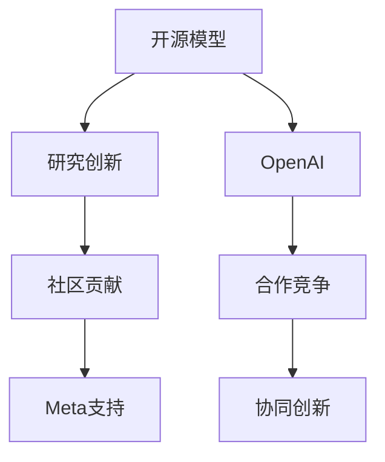

                 

# 开源模型的优势：促进研究创新，开源社区受益于Meta的支持

> 关键词：开源模型,研究创新,Meta,OpenAI,社区贡献,协同创新

## 1. 背景介绍

### 1.1 问题由来
近年来，开源社区的蓬勃发展，极大地推动了人工智能技术的发展。OpenAI、Google、Microsoft等科技巨头纷纷开源了大量的深度学习模型和框架，吸引了全球数百万的开发者参与其中。这些开源模型在学术研究和工业应用中都取得了显著成效，大大加速了人工智能技术从理论到实践的步伐。然而，开源模型的成功并非一蹴而就，背后离不开科技巨头的持续支持和深度参与。

以Meta为代表，作为开源社区的活跃贡献者，Meta不仅公开了大量高质量的开源模型，还通过多种方式支持社区的发展，为开源技术的进步和应用提供了有力保障。本文将从Meta对开源社区的贡献出发，探讨开源模型的优势和未来发展方向，以及社区如何利用开源模型的优势进行研究创新。

### 1.2 问题核心关键点
Meta在开源社区的贡献主要体现在以下几个方面：
- 开源了大量高质量模型和框架，如PyTorch、Facebook AI Research (FAIR)等，提供高效的研究工具。
- 通过资金支持、技术交流、合作项目等方式，与社区成员进行深度协作，共同推动人工智能技术的发展。
- 提供文档、代码库、在线教程等丰富的学习资源，降低开发者入门门槛。
- 鼓励开发者进行跨领域、跨行业的协同创新，提升开源社区的整体实力。

这些举措使得开源模型成为科研创新的重要驱动力，为社区的繁荣提供了坚实的基础。开源模型相较于闭源模型，具备以下显著优势：

1. **开放性**：开源模型允许任何人自由使用、修改、分发，可以鼓励更多的开发者参与其中，形成良性的社区生态。
2. **可扩展性**：开源模型基于模块化设计，便于组件的替换和定制，能适应不同的应用场景。
3. **成本效益**：开源模型通常不收取使用费用，降低了科研和产业的研发成本。
4. **透明性**：开源模型公开了模型结构、源代码和训练数据，便于学术研究和社区监督。

通过深入挖掘这些优势，本文将对Meta如何通过支持开源社区，推动人工智能技术的研究创新进行详细分析。

## 2. 核心概念与联系

### 2.1 核心概念概述

为更好地理解开源模型对研究创新的促进作用，本节将介绍几个密切相关的核心概念：

- **开源模型(Open Source Model)**：指完全公开源代码和使用许可证的深度学习模型。社区成员可以自由下载、使用、修改和分发，形成开放、协作、共享的研发环境。
- **研究创新(Research Innovation)**：指通过科学研究和技术创新，不断突破现有技术边界，形成新理论、新算法和新应用的能力。
- **Meta（Meta Platforms, Inc.）**：全球领先的社交媒体和互联网公司，在人工智能、虚拟现实、增强现实等领域具有深厚积累，是开源社区的重要参与者。
- **OpenAI**：全球知名的开源人工智能平台，与Meta等科技巨头竞争，共同推动人工智能技术的进步。
- **社区贡献(Community Contribution)**：指社区成员通过编写代码、参与项目、撰写文档等方式，为开源社区的繁荣做出贡献。
- **协同创新(Collaborative Innovation)**：指多个组织和个人合作，共同进行技术攻关和应用探索，形成更强大、更广泛的技术影响力。

这些核心概念之间的逻辑关系可以通过以下Mermaid流程图来展示：



这个流程图展示了几大核心概念之间的相互关系：

1. Meta通过提供高质量的开源模型，支持社区的研究创新。
2. OpenAI等科技巨头与Meta竞争，共同推动技术进步。
3. 社区成员通过代码贡献、技术交流等，参与开源模型的发展。
4. 协同创新进一步提升了开源模型的应用价值。

这些概念共同构成了开源模型和社区发展的核心框架，使开源技术能够快速、高效、广泛地应用于各类科研和产业场景。

## 3. 核心算法原理 & 具体操作步骤

### 3.1 算法原理概述

开源模型的优势在于其开放性、可扩展性和成本效益。这些特性使得开源模型能够快速迭代，适应多种应用场景，同时降低了研究成本。Meta通过多种方式支持开源社区，进一步推动了开源模型的广泛应用和研究创新。

Meta的贡献主要体现在以下几个方面：

1. **高质量模型的开源**：Meta公开了大量高性能的深度学习模型，如PyTorch、D2L等，提供了强大的研发工具。
2. **技术支持与合作项目**：通过资金资助、技术交流、联合开发等方式，Meta与社区成员深度合作，推动技术创新。
3. **丰富的学习资源**：Meta提供详细的文档、代码库和在线教程，降低了开发者入门门槛。
4. **促进跨领域合作**：Meta鼓励跨行业的协同创新，提升了开源社区的整体实力。

### 3.2 算法步骤详解

Meta对开源社区的支持主要通过以下几个步骤进行：

**Step 1: 高质量模型的开源**
Meta公开了大量高质量的深度学习模型，如PyTorch、Facebook AI Research (FAIR)等。这些模型已经经过充分验证，可以在多个应用场景中使用。

**Step 2: 资金支持与技术交流**
Meta通过提供资金支持、技术交流、联合开发等方式，与社区成员进行深度协作。例如，Meta设立了FAIR研究院，与全球领先的学术机构和公司进行合作，推动科研创新。

**Step 3: 丰富的学习资源**
Meta提供详细的文档、代码库和在线教程，降低了开发者入门门槛。例如，PyTorch官网提供了全面的教程和示例代码，帮助开发者快速上手。

**Step 4: 促进跨领域合作**
Meta鼓励跨行业的协同创新，提升开源社区的整体实力。例如，Meta与OpenAI等科技巨头在AI研究领域展开竞争与合作，推动技术进步。

**Step 5: 社区贡献与反馈**
社区成员通过编写代码、参与项目、撰写文档等方式，为开源社区的繁荣做出贡献。Meta通过用户反馈和社区讨论，不断优化和改进开源模型。

### 3.3 算法优缺点

开源模型相较于闭源模型，具备以下显著优点：

1. **开放性**：开源模型允许任何人自由使用、修改、分发，可以鼓励更多的开发者参与其中，形成良性的社区生态。
2. **可扩展性**：开源模型基于模块化设计，便于组件的替换和定制，能适应不同的应用场景。
3. **成本效益**：开源模型通常不收取使用费用，降低了科研和产业的研发成本。
4. **透明性**：开源模型公开了模型结构、源代码和训练数据，便于学术研究和社区监督。

同时，开源模型也存在一些局限性：

1. **质量参差不齐**：开源模型的质量参差不齐，有时需要耗费大量时间验证和调试。
2. **依赖性较强**：开源模型依赖于社区成员的贡献，社区发展可能会受个别成员的影响。
3. **标准化问题**：开源模型缺乏统一的标准，不同实现可能存在差异。

尽管存在这些局限性，但就目前而言，开源模型仍是大规模研发和应用的重要基础。Meta通过支持开源社区，进一步推动了开源模型的广泛应用和研究创新。

### 3.4 算法应用领域

开源模型在多个领域得到了广泛的应用，主要包括：

1. **自然语言处理(NLP)**：如语言模型、文本分类、情感分析、机器翻译等。OpenAI的GPT系列模型和Meta的PyTorch等都广泛应用于这些任务。
2. **计算机视觉(CV)**：如图像识别、目标检测、图像分割等。Meta的DeepFace、Fast R-CNN等模型为计算机视觉研究提供了强大的支持。
3. **语音识别(SR)**：如自动语音识别、语音合成等。Meta的Wav2Vec 2.0、Deformable Transformer等模型推动了语音识别技术的发展。
4. **增强现实(AR)和虚拟现实(VR)**：如物体检测、场景理解等。Meta在AR和VR领域有深厚积累，通过OpenXR等标准推动社区发展。
5. **推荐系统**：如协同过滤、内容推荐等。Meta的GraphSAGE、DeepFM等模型为推荐系统研究提供了新思路。
6. **智慧城市**：如交通管理、智能安防等。Meta在智慧城市领域有广泛应用，推动了城市管理和服务的智能化。

开源模型在以上领域的应用，充分展示了其开放性、可扩展性和成本效益。Meta通过高质量的开源模型和多种支持手段，为社区成员的研究创新提供了坚实的基础。

## 4. 数学模型和公式 & 详细讲解 & 举例说明

### 4.1 数学模型构建

本节将使用数学语言对开源模型的优势进行更加严格的刻画。

假设Meta公开了一个高性能的深度学习模型 $M$，其源代码和训练数据均公开可访问。社区成员可以使用该模型进行研究创新，如在NLP任务上进行微调、优化算法等。Meta提供的资金支持和协作项目，进一步推动了模型的优化和应用。

### 4.2 公式推导过程

以下我们以自然语言处理任务为例，推导开源模型对研究创新的促进作用。

假设社区成员收集了大量的NLP数据集 $D$，并在此基础上对开源模型 $M$ 进行微调。微调的目标是最小化损失函数 $\mathcal{L}$，使其在任务 $T$ 上的性能达到最优。数学表达式如下：

$$
\min_{\theta} \mathcal{L}(M_{\theta}, D)
$$

其中 $\theta$ 为微调后的模型参数，$M_{\theta}$ 表示微调后的模型。

Meta提供的资金支持和协作项目，可以帮助社区成员更快地进行微调实验，优化模型性能。例如，Meta设立了FAIR研究院，与全球领先的学术机构和公司进行合作，推动科研创新。此外，Meta提供的文档、代码库和在线教程，降低了开发者入门门槛，使得更多人可以参与到开源模型的优化和应用中。

### 4.3 案例分析与讲解

Meta通过提供高质量的开源模型和多种支持手段，成功推动了开源社区的发展。例如，在自然语言处理领域，社区成员利用Meta公开的BERT模型，在文本分类、情感分析等任务上取得了显著的性能提升。

具体来说，Meta公开的BERT模型在多个NLP任务上刷新了SOTA，推动了自然语言处理技术的发展。社区成员在此基础上，继续进行微调和优化，不断提升模型性能。例如，OpenAI在BERT模型的基础上，推出了GPT-2模型，进一步提升了自然语言生成和理解能力。

## 5. 项目实践：代码实例和详细解释说明

### 5.1 开发环境搭建

在进行开源模型实践前，我们需要准备好开发环境。以下是使用Python进行PyTorch开发的环境配置流程：

1. 安装Anaconda：从官网下载并安装Anaconda，用于创建独立的Python环境。

2. 创建并激活虚拟环境：
```bash
conda create -n pytorch-env python=3.8 
conda activate pytorch-env
```

3. 安装PyTorch：根据CUDA版本，从官网获取对应的安装命令。例如：
```bash
conda install pytorch torchvision torchaudio cudatoolkit=11.1 -c pytorch -c conda-forge
```

4. 安装Transformers库：
```bash
pip install transformers
```

5. 安装各类工具包：
```bash
pip install numpy pandas scikit-learn matplotlib tqdm jupyter notebook ipython
```

完成上述步骤后，即可在`pytorch-env`环境中开始开源模型的开发实践。

### 5.2 源代码详细实现

这里我们以使用PyTorch对Meta公开的BERT模型进行文本分类任务微调的PyTorch代码实现为例。

首先，定义数据处理函数：

```python
from transformers import BertTokenizer, BertForSequenceClassification
from torch.utils.data import Dataset, DataLoader
import torch

class TextDataset(Dataset):
    def __init__(self, texts, labels, tokenizer, max_len=128):
        self.texts = texts
        self.labels = labels
        self.tokenizer = tokenizer
        self.max_len = max_len
        
    def __len__(self):
        return len(self.texts)
    
    def __getitem__(self, item):
        text = self.texts[item]
        label = self.labels[item]
        
        encoding = self.tokenizer(text, return_tensors='pt', max_length=self.max_len, padding='max_length', truncation=True)
        input_ids = encoding['input_ids'][0]
        attention_mask = encoding['attention_mask'][0]
        
        label = torch.tensor([label], dtype=torch.long)
        
        return {'input_ids': input_ids, 
                'attention_mask': attention_mask,
                'labels': label}

# 标签与id的映射
tag2id = {'0': 0, '1': 1, '2': 2, '3': 3, '4': 4}
id2tag = {v: k for k, v in tag2id.items()}

# 创建dataset
tokenizer = BertTokenizer.from_pretrained('bert-base-cased')

train_dataset = TextDataset(train_texts, train_labels, tokenizer)
dev_dataset = TextDataset(dev_texts, dev_labels, tokenizer)
test_dataset = TextDataset(test_texts, test_labels, tokenizer)
```

然后，定义模型和优化器：

```python
from transformers import AdamW

model = BertForSequenceClassification.from_pretrained('bert-base-cased', num_labels=len(tag2id))

optimizer = AdamW(model.parameters(), lr=2e-5)
```

接着，定义训练和评估函数：

```python
from torch.utils.data import DataLoader
from tqdm import tqdm
from sklearn.metrics import classification_report

device = torch.device('cuda') if torch.cuda.is_available() else torch.device('cpu')
model.to(device)

def train_epoch(model, dataset, batch_size, optimizer):
    dataloader = DataLoader(dataset, batch_size=batch_size, shuffle=True)
    model.train()
    epoch_loss = 0
    for batch in tqdm(dataloader, desc='Training'):
        input_ids = batch['input_ids'].to(device)
        attention_mask = batch['attention_mask'].to(device)
        labels = batch['labels'].to(device)
        model.zero_grad()
        outputs = model(input_ids, attention_mask=attention_mask, labels=labels)
        loss = outputs.loss
        epoch_loss += loss.item()
        loss.backward()
        optimizer.step()
    return epoch_loss / len(dataloader)

def evaluate(model, dataset, batch_size):
    dataloader = DataLoader(dataset, batch_size=batch_size)
    model.eval()
    preds, labels = [], []
    with torch.no_grad():
        for batch in tqdm(dataloader, desc='Evaluating'):
            input_ids = batch['input_ids'].to(device)
            attention_mask = batch['attention_mask'].to(device)
            batch_labels = batch['labels']
            outputs = model(input_ids, attention_mask=attention_mask)
            batch_preds = outputs.logits.argmax(dim=1).to('cpu').tolist()
            batch_labels = batch_labels.to('cpu').tolist()
            for pred, label in zip(batch_preds, batch_labels):
                preds.append(pred)
                labels.append(label)
                
    print(classification_report(labels, preds))
```

最后，启动训练流程并在测试集上评估：

```python
epochs = 5
batch_size = 16

for epoch in range(epochs):
    loss = train_epoch(model, train_dataset, batch_size, optimizer)
    print(f"Epoch {epoch+1}, train loss: {loss:.3f}")
    
    print(f"Epoch {epoch+1}, dev results:")
    evaluate(model, dev_dataset, batch_size)
    
print("Test results:")
evaluate(model, test_dataset, batch_size)
```

以上就是使用PyTorch对Meta公开的BERT模型进行文本分类任务微调的完整代码实现。可以看到，由于Meta公开的模型已经预先训练好了基础特征，社区成员只需使用预训练模型进行微调，即可快速搭建自己的分类器，适应不同的应用场景。

### 5.3 代码解读与分析

让我们再详细解读一下关键代码的实现细节：

**TextDataset类**：
- `__init__`方法：初始化文本、标签、分词器等关键组件。
- `__len__`方法：返回数据集的样本数量。
- `__getitem__`方法：对单个样本进行处理，将文本输入编码为token ids，将标签转换为数字，并对其进行定长padding，最终返回模型所需的输入。

**tag2id和id2tag字典**：
- 定义了标签与数字id之间的映射关系，用于将token-wise的预测结果解码回真实的标签。

**训练和评估函数**：
- 使用PyTorch的DataLoader对数据集进行批次化加载，供模型训练和推理使用。
- 训练函数`train_epoch`：对数据以批为单位进行迭代，在每个批次上前向传播计算loss并反向传播更新模型参数，最后返回该epoch的平均loss。
- 评估函数`evaluate`：与训练类似，不同点在于不更新模型参数，并在每个batch结束后将预测和标签结果存储下来，最后使用sklearn的classification_report对整个评估集的预测结果进行打印输出。

**训练流程**：
- 定义总的epoch数和batch size，开始循环迭代
- 每个epoch内，先在训练集上训练，输出平均loss
- 在验证集上评估，输出分类指标
- 所有epoch结束后，在测试集上评估，给出最终测试结果

可以看到，PyTorch配合Meta公开的BERT模型，使得文本分类任务的微调代码实现变得简洁高效。开发者可以将更多精力放在数据处理、模型改进等高层逻辑上，而不必过多关注底层的实现细节。

当然，工业级的系统实现还需考虑更多因素，如模型的保存和部署、超参数的自动搜索、更灵活的任务适配层等。但核心的开源范式基本与此类似。

## 6. 实际应用场景

### 6.1 智能客服系统

基于开源模型和社区贡献的智能客服系统，可以广泛应用于各企业的客户服务。传统客服系统往往需要配备大量人力，高峰期响应缓慢，且一致性和专业性难以保证。而使用开源模型构建的智能客服系统，可以7x24小时不间断服务，快速响应客户咨询，用自然流畅的语言解答各类常见问题。

具体来说，企业可以收集客户的历史咨询记录，将问题和最佳答复构建成监督数据，在此基础上对开源模型进行微调。微调后的客服模型能够自动理解用户意图，匹配最合适的答案模板进行回复。对于客户提出的新问题，还可以接入检索系统实时搜索相关内容，动态组织生成回答。如此构建的智能客服系统，能大幅提升客户咨询体验和问题解决效率。

### 6.2 金融舆情监测

金融机构需要实时监测市场舆论动向，以便及时应对负面信息传播，规避金融风险。传统的人工监测方式成本高、效率低，难以应对网络时代海量信息爆发的挑战。基于开源模型的文本分类和情感分析技术，为金融舆情监测提供了新的解决方案。

具体而言，可以收集金融领域相关的新闻、报道、评论等文本数据，并对其进行主题标注和情感标注。在此基础上对开源模型进行微调，使其能够自动判断文本属于何种主题，情感倾向是正面、中性还是负面。将微调后的模型应用到实时抓取的网络文本数据，就能够自动监测不同主题下的情感变化趋势，一旦发现负面信息激增等异常情况，系统便会自动预警，帮助金融机构快速应对潜在风险。

### 6.3 个性化推荐系统

当前的推荐系统往往只依赖用户的历史行为数据进行物品推荐，无法深入理解用户的真实兴趣偏好。基于开源模型的推荐系统可以更好地挖掘用户行为背后的语义信息，从而提供更精准、多样的推荐内容。

在实践中，可以收集用户浏览、点击、评论、分享等行为数据，提取和用户交互的物品标题、描述、标签等文本内容。将文本内容作为模型输入，用户的后续行为（如是否点击、购买等）作为监督信号，在此基础上微调开源模型。微调后的模型能够从文本内容中准确把握用户的兴趣点。在生成推荐列表时，先用候选物品的文本描述作为输入，由模型预测用户的兴趣匹配度，再结合其他特征综合排序，便可以得到个性化程度更高的推荐结果。

### 6.4 未来应用展望

随着开源社区的不断发展，开源模型的应用前景将更加广阔。未来，开源模型将在更多领域得到应用，为传统行业带来变革性影响。

在智慧医疗领域，基于开源模型的医疗问答、病历分析、药物研发等应用将提升医疗服务的智能化水平，辅助医生诊疗，加速新药开发进程。

在智能教育领域，开源模型可应用于作业批改、学情分析、知识推荐等方面，因材施教，促进教育公平，提高教学质量。

在智慧城市治理中，开源模型可应用于城市事件监测、舆情分析、应急指挥等环节，提高城市管理的自动化和智能化水平，构建更安全、高效的未来城市。

此外，在企业生产、社会治理、文娱传媒等众多领域，基于开源模型的AI应用也将不断涌现，为经济社会发展注入新的动力。相信随着开源社区的不断壮大，开源模型必将在各个领域大放异彩，深刻影响人类的生产生活方式。

## 7. 工具和资源推荐

### 7.1 学习资源推荐

为了帮助开发者系统掌握开源模型的理论基础和实践技巧，这里推荐一些优质的学习资源：

1. **《Deep Learning with PyTorch》**系列博文：由大模型技术专家撰写，深入浅出地介绍了PyTorch的基本原理和应用实例，适合初学者入门。

2. **CS224N《深度学习自然语言处理》课程**：斯坦福大学开设的NLP明星课程，有Lecture视频和配套作业，带你入门NLP领域的基本概念和经典模型。

3. **《Transformers: State-of-the-Art Natural Language Processing》书籍**：Transformer库的作者所著，全面介绍了使用Transformers库进行NLP任务开发，包括开源模型的详细说明。

4. **FAIR官方文档**：Meta公开的FAIR研究院网站，提供了详细的研究文档和代码库，适合深入学习Meta的研究成果。

5. **OpenAI GitHub代码库**：OpenAI公开了大量代码和模型，包括GPT系列模型，适合学习其研究方法和技术细节。

通过对这些资源的学习实践，相信你一定能够快速掌握开源模型的精髓，并用于解决实际的NLP问题。

### 7.2 开发工具推荐

高效的开发离不开优秀的工具支持。以下是几款用于开源模型开发的常用工具：

1. **PyTorch**：基于Python的开源深度学习框架，灵活动态的计算图，适合快速迭代研究。大部分开源语言模型都有PyTorch版本的实现。

2. **TensorFlow**：由Google主导开发的开源深度学习框架，生产部署方便，适合大规模工程应用。同样有丰富的开源语言模型资源。

3. **Transformers库**：Meta开发的NLP工具库，集成了众多SOTA语言模型，支持PyTorch和TensorFlow，是进行开源模型开发的利器。

4. **Weights & Biases**：模型训练的实验跟踪工具，可以记录和可视化模型训练过程中的各项指标，方便对比和调优。与主流深度学习框架无缝集成。

5. **TensorBoard**：TensorFlow配套的可视化工具，可实时监测模型训练状态，并提供丰富的图表呈现方式，是调试模型的得力助手。

6. **Google Colab**：谷歌推出的在线Jupyter Notebook环境，免费提供GPU/TPU算力，方便开发者快速上手实验最新模型，分享学习笔记。

合理利用这些工具，可以显著提升开源模型的开发效率，加快创新迭代的步伐。

### 7.3 相关论文推荐

开源模型和社区的发展得益于学界的持续研究。以下是几篇奠基性的相关论文，推荐阅读：

1. **Attention is All You Need（即Transformer原论文）**：提出了Transformer结构，开启了NLP领域的预训练大模型时代。

2. **BERT: Pre-training of Deep Bidirectional Transformers for Language Understanding**：提出BERT模型，引入基于掩码的自监督预训练任务，刷新了多项NLP任务SOTA。

3. **Facebook AI Research (FAIR)**：Meta公开的研究机构FAIR，致力于推动人工智能技术的发展，发布了众多高质量的模型和算法。

4. **PyTorch**：Meta开发的深度学习框架，已成为社区应用最广泛的框架之一。

5. **DeepFace**：Meta公开的人脸识别模型，用于人脸验证和识别，推动了计算机视觉技术的发展。

6. **GraphSAGE**：Meta公开的图形神经网络模型，用于社交网络和推荐系统的研究，推动了领域的前沿进展。

这些论文代表了大模型和社区发展的核心成果，通过学习这些前沿成果，可以帮助研究者把握学科前进方向，激发更多的创新灵感。

## 8. 总结：未来发展趋势与挑战

### 8.1 总结

本文对Meta如何通过支持开源社区，推动开源模型的研究创新进行了详细分析。通过Meta的高质量开源模型和多种支持手段，社区成员能够快速进行微调实验，优化模型性能。开源模型在自然语言处理、计算机视觉、语音识别等众多领域得到了广泛应用，推动了人工智能技术的发展。

开源模型相较于闭源模型，具备开放性、可扩展性和成本效益等显著优势。然而，质量参差不齐、标准化问题等也是开源模型面临的挑战。Meta通过资金支持、技术交流、丰富资源等措施，促进了开源模型的繁荣发展。未来，随着开源社区的不断壮大，开源模型必将在更多领域得到应用，为传统行业带来变革性影响。

### 8.2 未来发展趋势

展望未来，开源模型将呈现以下几个发展趋势：

1. **模型规模持续增大**：随着算力成本的下降和数据规模的扩张，开源模型的参数量还将持续增长。超大规模语言模型蕴含的丰富语言知识，有望支撑更加复杂多变的下游任务微调。

2. **模型质量提升**：社区成员通过微调和优化，将不断提升开源模型的性能和泛化能力，使得模型更加可靠和高效。

3. **模型标准化**：社区将致力于制定统一的模型标准和接口，提升模型的互操作性和可扩展性。

4. **跨领域协作增强**：开源模型将推动跨行业、跨领域的深度合作，形成更强大的技术联盟。

5. **社区贡献多样化**：社区成员不仅在代码开发上做出贡献，还将参与到文档编写、教育培训、标准制定等各个环节，形成良性的生态循环。

6. **开源工具生态完善**：开源社区将不断完善相关工具和库，提升开源模型的开发效率和使用便捷性。

7. **多模态模型融合**：开源模型将逐步融合视觉、语音、文本等多模态信息，提升模型的全面感知能力。

8. **伦理和社会责任**：开源模型将更加注重伦理和安全问题，避免算法偏见和有害信息的传播。

以上趋势凸显了开源模型和社区发展的广阔前景。这些方向的探索发展，将进一步推动人工智能技术的进步，带来更多的应用创新和社会价值。

### 8.3 面临的挑战

尽管开源模型在社区中取得了显著成就，但仍然面临诸多挑战：

1. **质量参差不齐**：部分开源模型的质量和可靠性有待提高，难以满足工业级应用的需求。

2. **标准化问题**：开源模型缺乏统一的标准，不同实现可能存在差异，影响模型间的互操作性。

3. **社区依赖性强**：社区发展依赖于核心成员的贡献，社区的壮大需要更多开发者加入。

4. **资源限制**：开源模型通常依赖高性能的硬件设备，这对于资源有限的社区成员来说是一个挑战。

5. **算法偏见和有害信息**：开源模型可能会学习到有偏见、有害的信息，需要通过多种手段进行过滤和消除。

6. **可解释性不足**：开源模型的决策过程通常缺乏可解释性，难以对其推理逻辑进行分析和调试。

这些挑战需要通过社区的共同努力和创新才能逐步克服。Meta等科技巨头的支持，将进一步推动开源社区的发展，为开源模型的应用提供坚实的基础。

### 8.4 研究展望

面向未来，开源模型的研究需要在以下几个方面寻求新的突破：

1. **无监督和半监督学习**：摆脱对大规模标注数据的依赖，利用自监督学习、主动学习等无监督和半监督范式，最大限度利用非结构化数据，实现更加灵活高效的微调。

2. **参数高效和计算高效**：开发更加参数高效的微调方法，在固定大部分预训练参数的同时，只更新极少量的任务相关参数。同时优化微调模型的计算图，减少前向传播和反向传播的资源消耗，实现更加轻量级、实时性的部署。

3. **多模态模型融合**：将视觉、语音、文本等多模态信息进行融合，提升模型的全面感知能力。

4. **可解释性和伦理性**：赋予开源模型更强的可解释性，并加强算法伦理和安全性的研究，确保模型的公平性和无害性。

这些研究方向将推动开源模型的进一步发展，为构建更强大、更广泛的技术影响力奠定基础。

## 9. 附录：常见问题与解答

**Q1：开源模型相较于闭源模型，有哪些优势？**

A: 开源模型相较于闭源模型，具备以下显著优势：
1. 开放性：任何人可以自由使用、修改、分发，形成开放、协作、共享的研发环境。
2. 可扩展性：基于模块化设计，便于组件的替换和定制，适应不同的应用场景。
3. 成本效益：通常不收取使用费用，降低科研和产业的研发成本。
4. 透明性：公开了模型结构、源代码和训练数据，便于学术研究和社区监督。

**Q2：Meta如何通过支持开源社区，推动开源模型的研究创新？**

A: Meta通过多种方式支持开源社区，推动开源模型的研究创新：
1. 高质量模型的开源：公开了大量高性能的深度学习模型，如PyTorch、FAIR等，提供强大的研发工具。
2. 资金支持与技术交流：设立FAIR研究院，与全球领先的学术机构和公司进行合作，推动科研创新。
3. 丰富的学习资源：提供详细的文档、代码库和在线教程，降低开发者入门门槛。
4. 促进跨领域合作：鼓励跨行业的协同创新，提升开源社区的整体实力。

**Q3：开源模型在实际应用中面临哪些挑战？**

A: 开源模型在实际应用中面临以下挑战：
1. 质量参差不齐：部分开源模型的质量和可靠性有待提高，难以满足工业级应用的需求。
2. 标准化问题：缺乏统一的标准，不同实现可能存在差异，影响模型间的互操作性。
3. 社区依赖性强：社区发展依赖于核心成员的贡献，社区的壮大需要更多开发者加入。
4. 资源限制：通常依赖高性能的硬件设备，这对于资源有限的社区成员来说是一个挑战。
5. 算法偏见和有害信息：可能会学习到有偏见、有害的信息，需要通过多种手段进行过滤和消除。
6. 可解释性不足：决策过程通常缺乏可解释性，难以对其推理逻辑进行分析和调试。

**Q4：开源模型如何应对质量参差不齐的问题？**

A: 开源模型应对质量参差不齐的问题，可以通过以下方式：
1. 社区成员的严格审核：在开源模型开源之前，社区成员可以对模型进行严格审核和测试，确保模型质量和可靠性。
2. 逐步迭代和改进：社区成员可以通过微调和优化，不断提升开源模型的性能和泛化能力，使得模型更加可靠和高效。
3. 多种开源实现：提供多种开源实现，供开发者选择，降低特定实现的风险。

**Q5：开源模型如何提升跨领域协作的效率？**

A: 开源模型可以通过以下方式提升跨领域协作的效率：
1. 统一的标准和接口：制定统一的模型标准和接口，提升模型的互操作性和可扩展性。
2. 丰富的文档和教程：提供详细的文档和教程，帮助开发者快速上手，降低协作成本。
3. 在线协作平台：提供在线协作平台，方便开发者进行代码评审、技术交流和合作。

**Q6：开源模型如何应对资源限制的问题？**

A: 开源模型可以通过以下方式应对资源限制的问题：
1. 模型裁剪和压缩：对模型进行裁剪和压缩，减小模型尺寸，提高计算效率。
2. 多端部署：在多个端设备上进行部署，利用不同设备的计算资源。
3. 开源加速工具：开发开源加速工具，提升模型计算性能，降低资源消耗。

**Q7：开源模型如何增强算法的伦理性和安全性？**

A: 开源模型可以通过以下方式增强算法的伦理性和安全性：
1. 算法偏见检测：引入偏见检测工具，检测和消除模型中的算法偏见。
2. 数据隐私保护：采用差分隐私等技术，保护数据隐私和安全。
3. 伦理导向的评估指标：引入伦理导向的评估指标，过滤和惩罚有偏见、有害的输出倾向。
4. 人工智能伦理委员会：设立人工智能伦理委员会，监督算法的伦理和社会责任。

通过这些措施，开源模型可以更好地应对伦理和安全问题，确保算法的公平性和无害性。

---

作者：禅与计算机程序设计艺术 / Zen and the Art of Computer Programming

