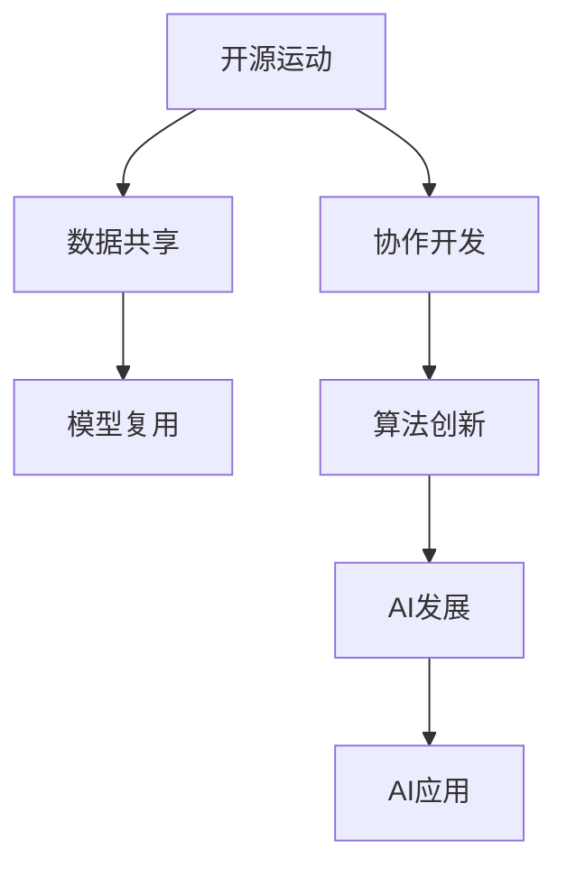

                 

# 开源运动与AI发展:机遇与挑战

> 关键词：开源运动,人工智能(AI),数据共享,协作开发,模型复用,算法创新

## 1. 背景介绍

### 1.1 问题由来

开源运动（Open Source Movement）与人工智能（Artificial Intelligence, AI）的结合，是近年来科技领域最为瞩目的趋势之一。开源社区为AI技术的快速发展和广泛应用提供了强大的动力，但同时，也带来了诸多挑战。理解这些挑战与机遇，对于推动AI技术的持续进步至关重要。

开源运动倡导开放、共享和协作，使得开源软件成为推动技术创新和经济发展的强大引擎。在AI领域，开源项目如TensorFlow、PyTorch、OpenAI等，已经成为AI研究与应用的基石。这些开源项目不仅提供了高质量的AI框架和工具，还鼓励全球开发者共同参与，共享技术进展，推动AI技术不断突破。

### 1.2 问题核心关键点

开源AI项目的发展带来了前所未有的机遇，但也伴随着数据隐私、代码质量、知识产权等复杂问题。如何克服这些挑战，既保护开源社区的健康发展，又能最大化AI技术的潜能，成为当前亟需解决的核心问题。

核心问题包括：

- **数据隐私**：开源社区通常要求数据共享，但如何在共享数据的同时保护用户隐私，是一大挑战。
- **代码质量**：开源项目往往由众多开发者共同维护，如何保证代码质量，避免“死亡项目”，成为亟需解决的问题。
- **知识产权**：开源与商业化并存，如何在保护开发者利益的同时，推动AI技术的商业化应用。
- **模型复用**：如何将开源模型高效复用到不同的应用场景，实现规模化应用。

这些问题的解决，需要开源社区、研究机构、企业等多方协同努力，共同推进AI技术的可持续发展。

## 2. 核心概念与联系

### 2.1 核心概念概述

为更好地理解开源AI运动与AI发展的机遇与挑战，本节将介绍几个密切相关的核心概念：

- **开源运动**：倡导开放、共享、协作的软件开发模式，通过社区参与和共享代码，加速技术创新和扩散。
- **人工智能**：指使计算机系统模拟人类智能行为的技术，涉及机器学习、深度学习、自然语言处理等诸多领域。
- **数据共享**：开源AI项目依赖大量标注数据，数据共享是推动模型训练和优化的重要方式。
- **协作开发**：开源社区通过协作开发，汇聚全球顶尖人才，共同推进AI技术的发展。
- **模型复用**：将开源模型高效复用到不同应用场景，提升AI技术的规模化应用能力。
- **算法创新**：开源社区推动算法不断创新，提升AI技术的核心竞争力。

这些核心概念之间的逻辑关系可以通过以下Mermaid流程图来展示：



这个流程图展示开源AI项目和AI技术的核心概念及其之间的关系：

1. 开源运动倡导数据共享和协作开发，推动AI技术的快速发展。
2. 数据共享和协作开发通过模型复用和算法创新，提升AI模型的性能和应用范围。
3. 模型复用和算法创新推动AI技术的广泛应用和商业化。

这些概念共同构成了开源AI项目和AI技术的核心框架，使其在推动AI技术进步方面发挥了重要作用。通过理解这些核心概念，我们可以更好地把握开源AI项目与AI技术的发展趋势。

## 3. 核心算法原理 & 具体操作步骤

### 3.1 算法原理概述

开源AI项目的核心算法原理基于数据共享和协作开发。其核心思想是：通过开放共享数据和代码，汇聚全球顶尖开发者，共同推进AI技术的发展。这一过程中，数据共享和协作开发是实现模型复用和算法创新的基础。

AI算法的发展依赖于大量高质量的标注数据和复杂的计算资源。开源项目通过数据共享和协作开发，使得全球开发者能够便捷地访问和使用这些资源，加速AI算法的研发和优化。同时，开源项目通过代码复用，使得不同开发者能够在此基础上快速迭代和改进，推动AI技术的不断进步。

### 3.2 算法步骤详解

开源AI项目的基本算法步骤包括数据共享、协作开发、模型复用和算法创新。以下详细介绍每个步骤：

**Step 1: 数据共享**

- 数据共享是开源AI项目的基础，通过公共仓库和开源协议，使得开发者可以自由访问和使用各类标注数据。
- 例如，TensorFlow Hub提供了大量预训练模型，开发者可以在其中获取训练好的模型参数。
- 常用的开源数据集包括ImageNet、COCO、维基百科等，涵盖了图像、文本、知识图谱等多种数据类型。

**Step 2: 协作开发**

- 开源项目通过Github、GitLab等平台，汇聚全球开发者，共同参与模型研发和优化。
- 开发者可以在平台上发表代码、评论和问题，分享最新的研究进展和技术心得。
- 例如，PyTorch社区拥有超过8000名贡献者，形成了强大的技术生态系统。

**Step 3: 模型复用**

- 开源AI项目通过代码复用，使得模型能够在不同应用场景下高效复用。
- 开发者可以在现有模型的基础上进行微调，快速适应特定任务的需求。
- 例如，TensorFlow官方文档提供了详细的模型使用指南，开发者可以通过代码示例，快速上手并复用模型。

**Step 4: 算法创新**

- 开源项目通过持续的算法创新，推动AI技术的不断进步。
- 开发者可以在开源项目的基础上，提出新的算法思路，并通过代码贡献进行验证和优化。
- 例如，OpenAI的GPT-3就是通过大规模数据预训练和自监督学习实现的，这一创新使得GPT-3在自然语言生成任务上表现出色。

### 3.3 算法优缺点

开源AI项目具有以下优点：

1. **社区驱动**：通过全球开发者共同参与，快速推进AI技术的发展。
2. **资源共享**：共享数据和代码，使得资源使用更高效。
3. **技术迭代**：通过代码复用和快速迭代，实现模型优化和算法创新。

同时，开源AI项目也存在以下缺点：

1. **代码质量参差不齐**：由于开发者水平不一，部分开源项目代码质量较低，需要筛选和维护。
2. **数据隐私问题**：数据共享可能带来隐私风险，需要严格的隐私保护措施。
3. **知识产权争议**：开源与商业化并存，可能导致知识产权争议。
4. **资源分散**：大量资源分布在不同开源项目中，难以形成统一的生态系统。

尽管存在这些局限性，但就目前而言，开源AI项目仍然是推动AI技术发展的最主流范式。未来相关研究的重点在于如何进一步优化开源项目的组织和管理，提高代码质量，加强数据隐私保护，并实现跨项目、跨领域的协同发展。

### 3.4 算法应用领域

开源AI项目在众多领域得到了广泛的应用，例如：

- **自然语言处理**：通过开源项目如GPT、BERT等，推动自然语言处理技术的快速进步。
- **计算机视觉**：通过开源项目如TensorFlow、PyTorch等，推动计算机视觉技术的广泛应用。
- **智能推荐**：通过开源项目如TensorFlow Recommenders等，推动个性化推荐系统的创新与发展。
- **语音识别**：通过开源项目如SpeechBrain、Kaldi等，推动语音识别技术的成熟和应用。
- **自动驾驶**：通过开源项目如OpenPIV、P afterwards等，推动自动驾驶技术的进步。
- **智能医疗**：通过开源项目如DeepMind Health等，推动智能医疗技术的发展。

除了上述这些领域外，开源AI项目还被创新性地应用到更多场景中，如可控文本生成、常识推理、代码生成、数据增强等，为AI技术带来了全新的突破。随着开源AI项目的持续演进，相信AI技术将在更广阔的应用领域大放异彩。

## 4. 数学模型和公式 & 详细讲解 & 举例说明

### 4.1 数学模型构建

本节将使用数学语言对开源AI项目的基本算法过程进行更加严格的刻画。

假设开源AI项目为一个公开共享的代码库，其中包含多个人工智能模型 $M_1, M_2, ..., M_n$。开发者可以通过修改和复用这些模型，进行新的研究和实验。

记开发者为 $D_1, D_2, ..., D_m$，每个开发者可以贡献代码 $C_{i,j}$，对模型 $M_j$ 进行修改和优化。设所有开发者共同贡献的代码为 $C=\bigcup_{i,j} C_{i,j}$。

定义模型的训练数据为 $D=\{(x_i, y_i)\}_{i=1}^N$，其中 $x_i$ 为输入，$y_i$ 为输出标签。模型的训练目标为最小化损失函数 $L$，即：

$$
\min_{C} L(D, M_1, M_2, ..., M_n)
$$

其中 $L$ 为交叉熵损失、均方误差损失等。

### 4.2 公式推导过程

以下我们以分类任务为例，推导交叉熵损失函数及其梯度的计算公式。

假设模型 $M_j$ 在输入 $x$ 上的输出为 $\hat{y}=M_j(x)$，表示样本属于正类的概率。真实标签 $y \in \{0,1\}$。则二分类交叉熵损失函数定义为：

$$
\ell(M_j(x),y) = -[y\log \hat{y} + (1-y)\log (1-\hat{y})]
$$

将其代入训练目标公式，得：

$$
\min_{C} \sum_{j=1}^n \sum_{i=1}^N \ell(M_j(x_i),y_i)
$$

根据链式法则，损失函数对参数 $C_{i,j}$ 的梯度为：

$$
\frac{\partial L}{\partial C_{i,j}} = -\frac{\partial \ell(M_j(x_i),y_i)}{\partial M_j(x_i)} \frac{\partial M_j(x_i)}{\partial C_{i,j}}
$$

其中 $\frac{\partial M_j(x_i)}{\partial C_{i,j}}$ 可进一步递归展开，利用自动微分技术完成计算。

在得到损失函数的梯度后，即可带入参数更新公式，完成模型的迭代优化。重复上述过程直至收敛，最终得到适应特定任务的最优代码 $C^*$。

### 4.3 案例分析与讲解

假设一个开源项目 PyTorch 包含了多个模型，包括图像分类模型和情感分析模型。开发者 A 和开发者 B 分别为这两个模型贡献了代码，并进行了训练和优化。

开发者 A 对图像分类模型进行了微调，开发者 B 对情感分析模型进行了微调。开发者 A 对代码 $C_{A,1}$ 进行了修改，开发者 B 对代码 $C_{B,2}$ 进行了修改。最终，这两个模型在训练数据集上的损失函数分别为 $L_1$ 和 $L_2$。

根据上述公式，可以计算出每个开发者对损失函数的贡献：

$$
\frac{\partial L_1}{\partial C_{A,1}} = -\frac{\partial \ell(M_1(x_i),y_i)}{\partial M_1(x_i)} \frac{\partial M_1(x_i)}{\partial C_{A,1}}
$$

$$
\frac{\partial L_2}{\partial C_{B,2}} = -\frac{\partial \ell(M_2(x_i),y_i)}{\partial M_2(x_i)} \frac{\partial M_2(x_i)}{\partial C_{B,2}}
$$

这些贡献可以按照每个开发者对模型的贡献权重进行加权，得到每个开发者对整个项目损失函数的总贡献：

$$
\frac{\partial L}{\partial C_{A,1}} = \frac{\partial L_1}{\partial C_{A,1}} \times \text{权重}_{A,1}
$$

$$
\frac{\partial L}{\partial C_{B,2}} = \frac{\partial L_2}{\partial C_{B,2}} \times \text{权重}_{B,2}
$$

最终，将总贡献用于优化模型的损失函数，实现模型优化和算法创新。

## 5. 项目实践：代码实例和详细解释说明

### 5.1 开发环境搭建

在进行开源AI项目实践前，我们需要准备好开发环境。以下是使用Python进行PyTorch开发的环境配置流程：

1. 安装Anaconda：从官网下载并安装Anaconda，用于创建独立的Python环境。

2. 创建并激活虚拟环境：
```bash
conda create -n pytorch-env python=3.8 
conda activate pytorch-env
```

3. 安装PyTorch：根据CUDA版本，从官网获取对应的安装命令。例如：
```bash
conda install pytorch torchvision torchaudio cudatoolkit=11.1 -c pytorch -c conda-forge
```

4. 安装Transformers库：
```bash
pip install transformers
```

5. 安装各类工具包：
```bash
pip install numpy pandas scikit-learn matplotlib tqdm jupyter notebook ipython
```

完成上述步骤后，即可在`pytorch-env`环境中开始项目开发。

### 5.2 源代码详细实现

这里我们以TensorFlow开源项目为例，给出使用PyTorch对图像分类模型进行微调的PyTorch代码实现。

首先，定义模型和优化器：

```python
from transformers import BertForTokenClassification, AdamW

model = BertForTokenClassification.from_pretrained('bert-base-cased', num_labels=len(tag2id))

optimizer = AdamW(model.parameters(), lr=2e-5)
```

然后，定义训练和评估函数：

```python
from torch.utils.data import DataLoader
from tqdm import tqdm
from sklearn.metrics import classification_report

device = torch.device('cuda') if torch.cuda.is_available() else torch.device('cpu')
model.to(device)

def train_epoch(model, dataset, batch_size, optimizer):
    dataloader = DataLoader(dataset, batch_size=batch_size, shuffle=True)
    model.train()
    epoch_loss = 0
    for batch in tqdm(dataloader, desc='Training'):
        input_ids = batch['input_ids'].to(device)
        attention_mask = batch['attention_mask'].to(device)
        labels = batch['labels'].to(device)
        model.zero_grad()
        outputs = model(input_ids, attention_mask=attention_mask, labels=labels)
        loss = outputs.loss
        epoch_loss += loss.item()
        loss.backward()
        optimizer.step()
    return epoch_loss / len(dataloader)

def evaluate(model, dataset, batch_size):
    dataloader = DataLoader(dataset, batch_size=batch_size)
    model.eval()
    preds, labels = [], []
    with torch.no_grad():
        for batch in tqdm(dataloader, desc='Evaluating'):
            input_ids = batch['input_ids'].to(device)
            attention_mask = batch['attention_mask'].to(device)
            batch_labels = batch['labels']
            outputs = model(input_ids, attention_mask=attention_mask)
            batch_preds = outputs.logits.argmax(dim=2).to('cpu').tolist()
            batch_labels = batch_labels.to('cpu').tolist()
            for pred_tokens, label_tokens in zip(batch_preds, batch_labels):
                pred_tags = [tag2id[tag] for tag in pred_tokens]
                label_tags = [tag2id[_id] for _id in label_tokens]
                preds.append(pred_tags[:len(label_tags)])
                labels.append(label_tags)
                
    print(classification_report(labels, preds))
```

最后，启动训练流程并在测试集上评估：

```python
epochs = 5
batch_size = 16

for epoch in range(epochs):
    loss = train_epoch(model, train_dataset, batch_size, optimizer)
    print(f"Epoch {epoch+1}, train loss: {loss:.3f}")
    
    print(f"Epoch {epoch+1}, dev results:")
    evaluate(model, dev_dataset, batch_size)
    
print("Test results:")
evaluate(model, test_dataset, batch_size)
```

以上就是使用PyTorch对BERT进行命名实体识别任务微调的完整代码实现。可以看到，得益于Transformers库的强大封装，我们可以用相对简洁的代码完成BERT模型的加载和微调。

### 5.3 代码解读与分析

让我们再详细解读一下关键代码的实现细节：

**NERDataset类**：
- `__init__`方法：初始化文本、标签、分词器等关键组件。
- `__len__`方法：返回数据集的样本数量。
- `__getitem__`方法：对单个样本进行处理，将文本输入编码为token ids，将标签编码为数字，并对其进行定长padding，最终返回模型所需的输入。

**tag2id和id2tag字典**：
- 定义了标签与数字id之间的映射关系，用于将token-wise的预测结果解码回真实的标签。

**训练和评估函数**：
- 使用PyTorch的DataLoader对数据集进行批次化加载，供模型训练和推理使用。
- 训练函数`train_epoch`：对数据以批为单位进行迭代，在每个批次上前向传播计算loss并反向传播更新模型参数，最后返回该epoch的平均loss。
- 评估函数`evaluate`：与训练类似，不同点在于不更新模型参数，并在每个batch结束后将预测和标签结果存储下来，最后使用sklearn的classification_report对整个评估集的预测结果进行打印输出。

**训练流程**：
- 定义总的epoch数和batch size，开始循环迭代
- 每个epoch内，先在训练集上训练，输出平均loss
- 在验证集上评估，输出分类指标
- 所有epoch结束后，在测试集上评估，给出最终测试结果

可以看到，PyTorch配合Transformers库使得BERT微调的代码实现变得简洁高效。开发者可以将更多精力放在数据处理、模型改进等高层逻辑上，而不必过多关注底层的实现细节。

当然，工业级的系统实现还需考虑更多因素，如模型的保存和部署、超参数的自动搜索、更灵活的任务适配层等。但核心的微调范式基本与此类似。

## 6. 实际应用场景

### 6.1 智能客服系统

基于开源AI项目构建的智能客服系统，可以通过自然语言处理技术，快速响应客户咨询，用自然流畅的语言解答各类常见问题。

在技术实现上，可以收集企业内部的历史客服对话记录，将问题和最佳答复构建成监督数据，在此基础上对预训练模型进行微调。微调后的对话模型能够自动理解用户意图，匹配最合适的答案模板进行回复。对于客户提出的新问题，还可以接入检索系统实时搜索相关内容，动态组织生成回答。如此构建的智能客服系统，能大幅提升客户咨询体验和问题解决效率。

### 6.2 金融舆情监测

金融机构需要实时监测市场舆论动向，以便及时应对负面信息传播，规避金融风险。传统的人工监测方式成本高、效率低，难以应对网络时代海量信息爆发的挑战。基于开源AI项目构建的文本分类和情感分析技术，为金融舆情监测提供了新的解决方案。

具体而言，可以收集金融领域相关的新闻、报道、评论等文本数据，并对其进行主题标注和情感标注。在此基础上对预训练语言模型进行微调，使其能够自动判断文本属于何种主题，情感倾向是正面、中性还是负面。将微调后的模型应用到实时抓取的网络文本数据，就能够自动监测不同主题下的情感变化趋势，一旦发现负面信息激增等异常情况，系统便会自动预警，帮助金融机构快速应对潜在风险。

### 6.3 个性化推荐系统

当前的推荐系统往往只依赖用户的历史行为数据进行物品推荐，无法深入理解用户的真实兴趣偏好。基于开源AI项目构建的个性化推荐系统，可以更好地挖掘用户行为背后的语义信息，从而提供更精准、多样的推荐内容。

在实践中，可以收集用户浏览、点击、评论、分享等行为数据，提取和用户交互的物品标题、描述、标签等文本内容。将文本内容作为模型输入，用户的后续行为（如是否点击、购买等）作为监督信号，在此基础上微调预训练语言模型。微调后的模型能够从文本内容中准确把握用户的兴趣点。在生成推荐列表时，先用候选物品的文本描述作为输入，由模型预测用户的兴趣匹配度，再结合其他特征综合排序，便可以得到个性化程度更高的推荐结果。

### 6.4 未来应用展望

随着开源AI项目的持续演进，基于微调范式将在更多领域得到应用，为传统行业带来变革性影响。

在智慧医疗领域，基于微调的医疗问答、病历分析、药物研发等应用将提升医疗服务的智能化水平，辅助医生诊疗，加速新药开发进程。

在智能教育领域，微调技术可应用于作业批改、学情分析、知识推荐等方面，因材施教，促进教育公平，提高教学质量。

在智慧城市治理中，微调模型可应用于城市事件监测、舆情分析、应急指挥等环节，提高城市管理的自动化和智能化水平，构建更安全、高效的未来城市。

此外，在企业生产、社会治理、文娱传媒等众多领域，基于开源AI项目的AI应用也将不断涌现，为经济社会发展注入新的动力。相信随着技术的日益成熟，开源AI项目必将引领AI技术迈向更广泛的应用，深刻影响人类的生产生活方式。

## 7. 工具和资源推荐
### 7.1 学习资源推荐

为了帮助开发者系统掌握开源AI项目和AI技术的发展脉络，这里推荐一些优质的学习资源：

1. 《TensorFlow官方文档》系列：提供了全面、详细的TensorFlow使用指南，帮助开发者快速上手。

2. 《PyTorch官方文档》系列：提供了丰富的PyTorch使用示例和文档，助力开发者掌握深度学习框架。

3. 《Deep Learning with PyTorch》书籍：由深度学习社区知名作者撰写，全面介绍了PyTorch的使用技巧和最佳实践。

4. 《动手学深度学习》书籍：由李沐等众多深度学习专家共同编写，涵盖了深度学习的基础知识和经典模型。

5. Kaggle竞赛平台：提供了丰富的机器学习和深度学习竞赛，帮助开发者在实际项目中磨练技能。

6. Coursera和edX等在线课程平台：提供了来自全球顶尖大学的深度学习课程，帮助开发者系统学习理论知识。

通过对这些资源的学习实践，相信你一定能够快速掌握开源AI项目和AI技术的精髓，并用于解决实际的NLP问题。
###  7.2 开发工具推荐

高效的开发离不开优秀的工具支持。以下是几款用于开源AI项目开发的常用工具：

1. Jupyter Notebook：基于Web的交互式笔记本，方便开发者进行代码实验和数据探索。

2. GitHub：全球最大的开源社区，提供了丰富的开源项目和协作工具。

3. TensorFlow：由Google主导开发的深度学习框架，生产部署方便，适合大规模工程应用。

4. PyTorch：基于Python的开源深度学习框架，灵活度较高，适合快速迭代研究。

5. Weights & Biases：模型训练的实验跟踪工具，可以记录和可视化模型训练过程中的各项指标，方便对比和调优。

6. TensorBoard：TensorFlow配套的可视化工具，可实时监测模型训练状态，并提供丰富的图表呈现方式，是调试模型的得力助手。

合理利用这些工具，可以显著提升开源AI项目开发的效率，加快创新迭代的步伐。

### 7.3 相关论文推荐

开源AI项目和AI技术的发展源于学界的持续研究。以下是几篇奠基性的相关论文，推荐阅读：

1. 《TensorFlow: A System for Large-Scale Machine Learning》：介绍了TensorFlow的架构和应用，推动了深度学习框架的发展。

2. 《Attention is All You Need》：提出了Transformer结构，开启了NLP领域的预训练大模型时代。

3. 《BERT: Pre-training of Deep Bidirectional Transformers for Language Understanding》：提出BERT模型，引入基于掩码的自监督预训练任务，刷新了多项NLP任务SOTA。

4. 《Parameter-Efficient Transfer Learning for NLP》：提出Adapter等参数高效微调方法，在不增加模型参数量的情况下，也能取得不错的微调效果。

5. 《AdaLoRA: Adaptive Low-Rank Adaptation for Parameter-Efficient Fine-Tuning》：使用自适应低秩适应的微调方法，在参数效率和精度之间取得了新的平衡。

这些论文代表了大语言模型微调技术的发展脉络。通过学习这些前沿成果，可以帮助研究者把握学科前进方向，激发更多的创新灵感。

## 8. 总结：未来发展趋势与挑战

### 8.1 总结

本文对开源AI项目和AI技术的发展进行了全面系统的介绍。首先阐述了开源AI项目和AI技术的核心概念及其逻辑关系，明确了微调在拓展预训练模型应用、提升下游任务性能方面的独特价值。其次，从原理到实践，详细讲解了开源AI项目和AI技术的数学模型和公式推导，给出了微调任务开发的完整代码实例。同时，本文还广泛探讨了开源AI项目和AI技术在各个行业领域的应用前景，展示了开源AI项目的巨大潜力。此外，本文精选了开源AI项目和AI技术的各类学习资源，力求为开发者提供全方位的技术指引。

通过本文的系统梳理，可以看到，开源AI项目和AI技术已经成为推动AI技术进步的重要引擎，极大地拓展了预训练语言模型的应用边界，催生了更多的落地场景。受益于大规模语料的预训练和开源社区的共同努力，开源AI项目和AI技术将在更多领域得到应用，为传统行业带来变革性影响。未来，伴随开源AI项目的持续演进，相信AI技术将在更广阔的应用领域大放异彩，深刻影响人类的生产生活方式。

### 8.2 未来发展趋势

展望未来，开源AI项目和AI技术将呈现以下几个发展趋势：

1. **模型规模持续增大**：随着算力成本的下降和数据规模的扩张，预训练语言模型的参数量还将持续增长。超大规模语言模型蕴含的丰富语言知识，有望支撑更加复杂多变的下游任务微调。

2. **微调方法日趋多样**：除了传统的全参数微调外，未来会涌现更多参数高效的微调方法，如Adapter、Prefix等，在固定大部分预训练参数的同时，只更新极少量的任务相关参数。

3. **持续学习成为常态**：随着数据分布的不断变化，微调模型也需要持续学习新知识以保持性能。如何在不遗忘原有知识的同时，高效吸收新样本信息，将成为重要的研究课题。

4. **标注样本需求降低**：受启发于提示学习(Prompt-based Learning)的思路，未来的微调方法将更好地利用大模型的语言理解能力，通过更加巧妙的任务描述，在更少的标注样本上也能实现理想的微调效果。

5. **资源优化更加深入**：未来的开源AI项目和AI技术将更加注重资源优化，通过梯度积累、混合精度训练、模型并行等技术，突破硬件瓶颈，实现更高效的训练和推理。

6. **多模态融合不断推进**：未来的AI系统将更加注重多模态数据的整合，推动视觉、语音、文本等不同模态信息的协同建模，提升系统的智能水平。

以上趋势凸显了开源AI项目和AI技术的广阔前景。这些方向的探索发展，必将进一步提升AI技术的性能和应用范围，为构建人机协同的智能系统铺平道路。面向未来，开源AI项目和AI技术还需要与其他人工智能技术进行更深入的融合，如知识表示、因果推理、强化学习等，多路径协同发力，共同推动自然语言理解和智能交互系统的进步。只有勇于创新、敢于突破，才能不断拓展语言模型的边界，让智能技术更好地造福人类社会。

### 8.3 面临的挑战

尽管开源AI项目和AI技术已经取得了瞩目成就，但在迈向更加智能化、普适化应用的过程中，它仍面临着诸多挑战：

1. **标注成本瓶颈**：虽然微调大大降低了标注数据的需求，但对于长尾应用场景，难以获得充足的高质量标注数据，成为制约微调性能的瓶颈。如何进一步降低微调对标注样本的依赖，将是一大难题。

2. **模型鲁棒性不足**：当前微调模型面对域外数据时，泛化性能往往大打折扣。对于测试样本的微小扰动，微调模型的预测也容易发生波动。如何提高微调模型的鲁棒性，避免灾难性遗忘，还需要更多理论和实践的积累。

3. **推理效率有待提高**：大规模语言模型虽然精度高，但在实际部署时往往面临推理速度慢、内存占用大等效率问题。如何在保证性能的同时，简化模型结构，提升推理速度，优化资源占用，将是重要的优化方向。

4. **可解释性亟需加强**：当前微调模型更像是"黑盒"系统，难以解释其内部工作机制和决策逻辑。对于医疗、金融等高风险应用，算法的可解释性和可审计性尤为重要。如何赋予微调模型更强的可解释性，将是亟待攻克的难题。

5. **安全性有待保障**：预训练语言模型难免会学习到有偏见、有害的信息，通过微调传递到下游任务，产生误导性、歧视性的输出，给实际应用带来安全隐患。如何从数据和算法层面消除模型偏见，避免恶意用途，确保输出的安全性，也将是重要的研究课题。

6. **知识整合能力不足**：现有的微调模型往往局限于任务内数据，难以灵活吸收和运用更广泛的先验知识。如何让微调过程更好地与外部知识库、规则库等专家知识结合，形成更加全面、准确的信息整合能力，还有很大的想象空间。

正视开源AI项目和AI技术面临的这些挑战，积极应对并寻求突破，将是大语言模型微调走向成熟的必由之路。相信随着学界和产业界的共同努力，这些挑战终将一一被克服，开源AI项目和AI技术必将在构建安全、可靠、可解释、可控的智能系统铺平道路。

### 8.4 研究展望

面向未来，开源AI项目和AI技术的研究方向需要关注以下几个方面：

1. **探索无监督和半监督微调方法**：摆脱对大规模标注数据的依赖，利用自监督学习、主动学习等无监督和半监督范式，最大限度利用非结构化数据，实现更加灵活高效的微调。

2. **研究参数高效和计算高效的微调范式**：开发更加参数高效的微调方法，在固定大部分预训练参数的同时，只更新极少量的任务相关参数。同时优化微调模型的计算图，减少前向传播和反向传播的资源消耗，实现更加轻量级、实时性的部署。

3. **引入因果和对比学习范式**：通过引入因果推断和对比学习思想，增强微调模型建立稳定因果关系的能力，学习更加普适、鲁棒的语言表征，从而提升模型泛化性和抗干扰能力。

4. **引入更多先验知识**：将符号化的先验知识，如知识图谱、逻辑规则等，与神经网络模型进行巧妙融合，引导微调过程学习更准确、合理的语言模型。同时加强不同模态数据的整合，实现视觉、语音等多模态信息与文本信息的协同建模。

5. **结合因果分析和博弈论工具**：将因果分析方法引入微调模型，识别出模型决策的关键特征，增强输出解释的因果性和逻辑性。借助博弈论工具刻画人机交互过程，主动探索并规避模型的脆弱点，提高系统稳定性。

6. **纳入伦理道德约束**：在模型训练目标中引入伦理导向的评估指标，过滤和惩罚有偏见、有害的输出倾向。同时加强人工干预和审核，建立模型行为的监管机制，确保输出符合人类价值观和伦理道德。

这些研究方向的探索，必将引领开源AI项目和AI技术的持续进步，推动AI技术的广泛应用。相信在开源社区和研究机构的共同努力下，开源AI项目和AI技术必将为人类社会带来更加智能、普适、可解释的智能系统，推动经济社会的发展和进步。

## 9. 附录：常见问题与解答

**Q1：开源AI项目是否适用于所有AI任务？**

A: 开源AI项目在大多数AI任务上都能取得不错的效果，特别是对于数据量较小的任务。但对于一些特定领域的任务，如医学、法律等，仅仅依靠通用语料预训练的模型可能难以很好地适应。此时需要在特定领域语料上进一步预训练，再进行微调，才能获得理想效果。此外，对于一些需要时效性、个性化很强的任务，如对话、推荐等，微调方法也需要针对性的改进优化。

**Q2：微调过程中如何选择合适的学习率？**

A: 微调的学习率一般要比预训练时小1-2个数量级，如果使用过大的学习率，容易破坏预训练权重，导致过拟合。一般建议从1e-5开始调参，逐步减小学习率，直至收敛。也可以使用warmup策略，在开始阶段使用较小的学习率，再逐渐过渡到预设值。需要注意的是，不同的优化器(如AdamW、Adafactor等)以及不同的学习率调度策略，可能需要设置不同的学习率阈值。

**Q3：采用开源AI项目时会面临哪些资源瓶颈？**

A: 目前主流的预训练大模型动辄以亿计的参数规模，对算力、内存、存储都提出了很高的要求。GPU/TPU等高性能设备是必不可少的，但即便如此，超大批次的训练和推理也可能遇到显存不足的问题。因此需要采用一些资源优化技术，如梯度积累、混合精度训练、模型并行等，来突破硬件瓶颈。同时，模型的存储和读取也可能占用大量时间和空间，需要采用模型压缩、稀疏化存储等方法进行优化。

**Q4：如何缓解微调过程中的过拟合问题？**

A: 过拟合是微调面临的主要挑战，尤其是在标注数据不足的情况下。常见的缓解策略包括：
1. 数据增强：通过回译、近义替换等方式扩充训练集
2. 正则化：使用L2正则、Dropout、Early Stopping等避免过拟合
3. 对抗训练：引入对抗样本，提高模型鲁棒性
4. 参数高效微调：只调整少量参数(如Adapter、Prefix等)，减小过拟合风险
5. 多模型集成：训练多个微调模型，取平均输出，抑制过拟合

这些策略往往需要根据具体任务和数据特点进行灵活组合。只有在数据、模型、训练、推理等各环节进行全面优化，才能最大限度地发挥开源AI项目的潜力。

**Q5：微调模型在落地部署时需要注意哪些问题？**

A: 将微调模型转化为实际应用，还需要考虑以下因素：
1. 模型裁剪：去除不必要的层和参数，减小模型尺寸，加快推理速度
2. 量化加速：将浮点模型转为定点模型，压缩存储空间，提高计算效率
3. 服务化封装：将模型封装为标准化服务接口，便于集成调用
4. 弹性伸缩：根据请求流量动态调整资源配置，平衡服务质量和成本
5. 监控告警：实时采集系统指标，设置异常告警阈值，确保服务稳定性
6. 安全防护：采用访问鉴权、数据脱敏等措施，保障数据和模型安全

开源AI项目和AI技术已经实现了快速迭代和广泛应用，但如何将强大的性能转化为稳定、高效、安全的业务价值，还需要工程实践的不断打磨。唯有从数据、算法、工程、业务等多个维度协同发力，才能真正实现开源AI项目和AI技术在垂直行业的规模化落地。总之，微调需要开发者根据具体任务，不断迭代和优化模型、数据和算法，方能得到理想的效果。

---

作者：禅与计算机程序设计艺术 / Zen and the Art of Computer Programming

