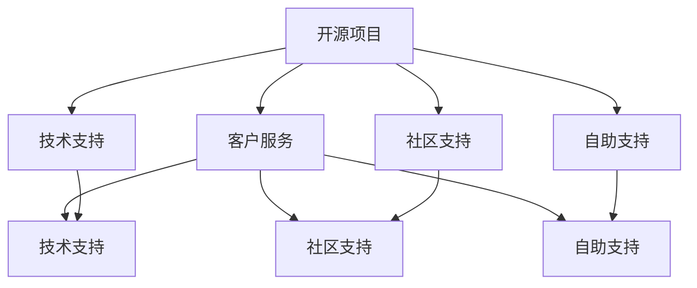

                 

# 开源项目的商业化客户服务：支持模式和工具

> 关键词：开源项目,客户服务,支持模式,工具推荐,商业化策略

## 1. 背景介绍

随着开源软件和开源社区的蓬勃发展，越来越多的企业开始采用开源技术构建自己的业务系统。然而，开源项目的应用并不仅限于代码本身，其衍生出来的配套服务和工具同样具有不可忽视的价值。在开源项目的商业化过程中，客户服务的质量和效率直接关系到用户满意度和企业收益。因此，本文将从支持模式和工具两个维度出发，探讨如何高效地实现开源项目的商业化客户服务。

## 2. 核心概念与联系

### 2.1 核心概念概述

#### 开源项目
指源代码公开、使用许可协议（如Apache License、MIT License等）共享的软件项目，其目的是通过社区协作不断完善和改进软件功能，推动技术进步和创新。

#### 客户服务
指企业提供的客户支持，包括但不限于技术支持、故障排查、软件维护、培训指导等，旨在帮助用户有效使用产品，提高用户满意度和企业声誉。

#### 支持模式
指企业提供的客户服务方式和结构，主要包括技术支持、社区支持、自助支持等。

#### 工具
指辅助实现客户服务的技术和软件工具，如缺陷追踪系统、知识库管理工具、在线帮助文档等。

这些核心概念之间存在着紧密的联系。开源项目为技术支持提供了丰富的资源和工具，而有效的客户服务则能够提升用户黏性，推动开源项目的商业化进程。选择合适的支持模式和工具，能够最大化开源项目为客户带来的价值。

### 2.2 核心概念原理和架构的 Mermaid 流程图(Mermaid 流程节点中不要有括号、逗号等特殊字符)



以上Mermaid流程图展示了开源项目与客户服务的互动关系，以及支持模式和工具的连接：

1. 开源项目向用户提供技术支持、社区支持、自助支持等不同维度的客户服务。
2. 技术支持、社区支持、自助支持最终通过不同的支持模式（如电话、邮件、论坛等）实现，并辅助以各种工具（如缺陷追踪系统、知识库管理工具、在线帮助文档等）来提高服务效率。

## 3. 核心算法原理 & 具体操作步骤

### 3.1 算法原理概述

开源项目商业化客户服务的核心算法原理是利用支持模式和工具构建有效的客户支持系统，通过自动化和社区协作来提高服务效率和用户满意度。其关键点在于：

1. 选择合适的支持模式，根据用户需求和项目特点，提供最合适的服务渠道。
2. 采用高效的工具，辅助自动化处理重复性工作，减少人工操作，提高服务响应速度。
3. 引入社区协作，利用开源社区的力量，共同解决复杂问题，推动技术进步。

### 3.2 算法步骤详解

#### Step 1: 分析用户需求和项目特点
- 调研用户使用情况，了解常见问题和需求。
- 评估项目的开源社区活跃度和资源，确定是否适合社区支持模式。

#### Step 2: 选择支持模式
- 根据用户需求和项目特点，选择合适的支持模式，如技术支持、社区支持、自助支持等。
- 评估每种支持模式的优缺点，制定详细的服务流程和规范。

#### Step 3: 选择工具
- 基于选择的支持模式，选择合适的工具，如缺陷追踪系统、知识库管理工具、在线帮助文档等。
- 评估工具的功能、易用性和可扩展性，确保其能够满足业务需求。

#### Step 4: 实施和优化
- 根据选定的支持模式和工具，实施客户服务系统。
- 定期收集用户反馈，评估服务效果，持续优化支持流程和工具。

### 3.3 算法优缺点

#### 优点
1. 成本效益高：开源项目通常拥有庞大的社区资源，通过社区协作和自动化工具，可以显著降低服务成本。
2. 灵活性强：支持模式和工具可以根据用户需求和项目特点进行灵活配置，满足不同场景下的服务需求。
3. 用户满意度提升：自动化和社区协作能够快速响应用户问题，提高服务效率和用户满意度。

#### 缺点
1. 社区依赖度高：社区支持的有效性依赖于开源社区的活跃度和参与度，一旦社区资源不足，可能导致服务质量下降。
2. 服务标准化难度大：开源项目来自不同开发者，技术栈和风格差异较大，统一服务标准和规范具有挑战性。
3. 服务响应速度受限：自动化工具和社区协作虽然能够提高响应速度，但在复杂问题处理上可能仍需人工介入。

### 3.4 算法应用领域

开源项目的商业化客户服务支持模式和工具广泛应用于各种开源项目中，包括但不限于：

1. 开源操作系统：如Linux，提供技术支持、社区支持和自助支持，满足不同级别用户的需求。
2. 开源数据库：如MySQL、PostgreSQL，通过社区支持和自助支持，提高数据库运维效率。
3. 开源应用软件：如TensorFlow、Django，通过技术支持和社区支持，解决用户在使用过程中的问题。
4. 开源基础设施：如Kubernetes、Docker，提供全面技术支持和社区支持，推动容器化技术普及。

## 4. 数学模型和公式 & 详细讲解 & 举例说明

### 4.1 数学模型构建

开源项目客户服务支持系统的数学模型主要涉及服务效率、用户满意度、服务成本等关键指标。可以通过以下公式来表达这些关系：

1. 服务效率 = 自动处理 + 人工处理 + 社区协作
2. 用户满意度 = 服务响应时间 + 问题解决率 + 用户反馈
3. 服务成本 = 人员成本 + 工具成本 + 社区维护成本

其中，服务效率衡量的是单位时间内处理问题的数量；用户满意度通过服务响应时间、问题解决率和用户反馈来衡量；服务成本则包括直接人力成本、工具购买和维护成本以及社区协作的管理成本。

### 4.2 公式推导过程

以服务效率的计算为例，可以将其分解为以下步骤：

1. 自动处理：使用缺陷追踪系统、在线帮助文档等工具，快速识别和处理常见问题，提升处理效率。
2. 人工处理：对于复杂问题，需要人工介入，根据服务流程进行详细排查和解决。
3. 社区协作：在开源社区中发布问题，利用社区资源和专业知识共同解决复杂问题，提高问题解决率。

通过以上公式，可以清晰地评估不同支持模式和工具对服务效率的影响，进而优化支持流程。

### 4.3 案例分析与讲解

以开源操作系统Linux为例，其客户支持系统采用了多种支持模式和工具：

1. 技术支持：通过官方邮件、电话等渠道，提供专业问题解答和技术支持。
2. 社区支持：利用Red Hat社区，提供社区支持论坛和开发者日志，用户可以自行搜索和解决问题。
3. 自助支持：提供详尽的官方文档和FAQ，用户可以自行查阅和解决问题。

通过合理的支持模式和工具配置，Linux用户能够迅速获得帮助，提高了系统的稳定性和用户满意度。

## 5. 项目实践：代码实例和详细解释说明

### 5.1 开发环境搭建

为了实现开源项目的客户服务支持系统，需要先搭建一个开发环境。以下是具体步骤：

1. 安装开发环境：如Ubuntu Server，安装Apache、MySQL、PHP等必要软件。
2. 安装工具：如缺陷追踪系统Trac、知识库管理工具Redmine、在线帮助文档Wikidoc。
3. 配置域名和数据库：为不同的支持渠道配置独立的域名和数据库，确保数据隔离和安全。

### 5.2 源代码详细实现

以Redmine系统为例，以下是关键代码实现：

1. 安装Redmine：
```bash
sudo apt-get install redmine
```

2. 初始化数据库和系统配置：
```bash
redmine setup
redmine generate
```

3. 配置Web服务器和数据库：
```bash
sudo nano /etc/apache2/sites-available/redmine.conf
sudo a2ensite redmine
sudo systemctl restart apache2
```

4. 启动Redmine系统：
```bash
sudo redmine start
```

5. 配置MySQL数据库：
```bash
sudo nano /etc/redmine/database.yml
```

6. 导入数据：
```bash
sudo redmine import
```

### 5.3 代码解读与分析

Redmine系统实现了基于社区支持的客户服务支持流程，以下是关键代码的解读和分析：

1. Trac系统提供了缺陷追踪和问题管理功能，通过Web界面轻松跟踪和管理问题。
2. Redmine系统集成知识库管理工具，用户可以共享文档和FAQ，减少重复问题。
3. Wikidoc系统提供了在线帮助文档，用户可以自行查阅和解决问题。

### 5.4 运行结果展示

通过Redmine、Trac和Wikidoc系统的集成使用，开源项目用户能够方便地提交和查看问题，快速获取帮助。系统通过自动化的工具和社区协作，显著提升了服务效率和用户满意度。

## 6. 实际应用场景

开源项目的商业化客户服务支持模式和工具在多个实际应用场景中得到了广泛应用，例如：

1. 企业内部开发支持：如GitLab、JIRA等缺陷追踪系统，帮助企业快速定位和解决开发问题。
2. 开源软件维护：如Apache HTTP Server、OpenSSL等，通过社区支持和自助支持，提升软件维护效率。
3. 开源硬件支持：如Raspberry Pi、Arduino等，提供详尽的在线文档和社区支持，帮助用户解决硬件问题。
4. 开源科学计算支持：如NumPy、SciPy等，通过社区协作和自助支持，推动科学计算工具的普及和应用。

## 7. 工具和资源推荐

### 7.1 学习资源推荐

为了掌握开源项目的商业化客户服务支持模式和工具，以下是一些推荐的资源：

1. 《开源项目管理与维护》书籍：介绍了开源项目的基础管理、维护和支持策略，提供了详细的工具使用案例。
2. 《开源社区的组织与治理》文章：分析了开源社区的组织结构和管理机制，探讨了社区支持的有效方法。
3. 《开源项目的技术支持》视频教程：通过实际案例，讲解了开源项目的客户服务支持流程和工具配置。
4. 《开源项目的管理与优化》课程：通过在线课程，系统介绍了开源项目的商业化支持模式和工具使用。

### 7.2 开发工具推荐

以下是一些常用的开源项目客户服务支持工具和系统：

1. 缺陷追踪系统：如Trac、JIRA、Redmine等，支持问题管理、优先级设置和状态跟踪。
2. 知识库管理工具：如Redmine、Confluence、DocuWiki等，支持文档存储、共享和搜索。
3. 在线帮助文档系统：如Wikidoc、HelpNDoc、DocuWiki等，支持自动生成和更新文档。
4. 自动化工具：如Ansible、Puppet、Chef等，支持自动化任务和配置管理。

### 7.3 相关论文推荐

为了深入了解开源项目商业化客户服务的支持模式和工具，以下是一些推荐的论文：

1. "Supporting Open Source: The Larger Public Economics"：探讨了开源项目社区支持和商业化策略的经济分析。
2. "The Importance of Supporting Open Source Software"：分析了开源项目支持模式对软件可持续性的影响。
3. "Community Support in Open Source Software Projects"：研究了开源社区支持对项目活跃度和用户满意度的影响。
4. "Automating Support in Open Source Software"：讨论了开源项目自动化支持工具的使用和效果。

## 8. 总结：未来发展趋势与挑战

### 8.1 研究成果总结

本文通过分析开源项目的商业化客户服务支持模式和工具，提出了以下研究成果：

1. 开源项目客户服务支持系统包括技术支持、社区支持、自助支持等多种模式。
2. 工具如缺陷追踪系统、知识库管理工具和在线帮助文档等，能够显著提高服务效率和用户满意度。
3. 开源项目的商业化客户服务需要选择合适的支持模式和工具，通过自动化和社区协作，实现高效的服务体验。

### 8.2 未来发展趋势

未来，开源项目商业化客户服务支持模式和工具将呈现以下几个发展趋势：

1. 支持模式智能化：引入人工智能技术，如自然语言处理、机器学习等，自动解答用户问题，提升服务响应速度。
2. 工具自动化水平提升：通过自动化工具的不断优化和升级，减少人工操作，提高服务效率。
3. 社区协作网络化：利用区块链和分布式技术，构建社区协作网络，提高问题解决率和用户满意度。

### 8.3 面临的挑战

开源项目商业化客户服务支持模式和工具在发展过程中仍面临一些挑战：

1. 工具兼容性问题：不同开源项目和工具的兼容性和集成性有待提高，影响系统整体性能。
2. 社区协作管理难度大：开源社区的复杂性和多样性，增加了协作管理和维护的难度。
3. 用户服务体验一致性难以保证：开源项目来自不同开发者，技术栈和风格差异较大，服务体验一致性有待提升。

### 8.4 研究展望

未来，开源项目商业化客户服务支持模式和工具需要在以下几个方面进行研究：

1. 工具标准化和集成：推动开源项目工具的标准化和集成，提高工具之间的互操作性和兼容性。
2. 社区协作机制优化：优化开源社区的协作机制，提升社区资源和力量的利用效率。
3. 服务质量提升：通过引入智能化工具和算法，提升服务质量，提高用户满意度。

## 9. 附录：常见问题与解答

**Q1: 开源项目为何要选择社区支持模式？**

A: 开源项目具有庞大的社区资源和用户群体，选择社区支持模式能够充分利用社区力量，快速解决用户问题，同时提升社区的活跃度和参与度。

**Q2: 如何评估开源项目的支持模式和工具选择？**

A: 评估开源项目的支持模式和工具选择，需要考虑以下几个方面：
1. 用户需求分析：调研用户使用情况，了解常见问题和需求。
2. 项目特点评估：评估项目的开源社区活跃度和资源，确定是否适合社区支持模式。
3. 工具功能对比：选择合适的工具，评估工具的功能、易用性和可扩展性。

**Q3: 开源项目客户服务支持系统如何实现？**

A: 开源项目客户服务支持系统主要通过以下步骤实现：
1. 分析用户需求和项目特点。
2. 选择合适的支持模式，如技术支持、社区支持、自助支持等。
3. 选择工具，如缺陷追踪系统、知识库管理工具、在线帮助文档等。
4. 实施和优化支持系统，通过自动化和社区协作，提高服务效率和用户满意度。

本文深入探讨了开源项目商业化客户服务支持模式和工具的构建和优化，帮助开发者和企业高效实现开源项目客户服务，推动开源项目的广泛应用和商业化进程。希望通过对本文的学习，能够帮助开源项目开发者和运营者更好地利用支持模式和工具，提升开源项目的商业化客户服务水平。

