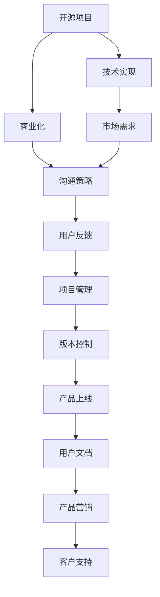

                 

# 开源项目的商业化沟通策略：从技术到业务语言

> 关键词：开源, 商业化, 沟通策略, 技术到业务, 代码质量, 市场需求, 用户反馈, 项目管理, 版本控制, 产品上线, 用户文档, 产品营销, 客户支持

## 1. 背景介绍

在当前快速变化的技术环境中，开源项目作为软件创新和社区协作的重要形式，正变得越来越受欢迎。然而，开源项目要想成功商业化，仅有优秀的技术设计和代码实现是不够的。它还需要一个高效的沟通策略，将技术优势转化为市场价值，吸引并保留合适的用户群体，持续推动产品创新。

本文旨在探讨开源项目的商业化沟通策略，从技术到业务语言，系统化地帮助开源开发者理解和执行有效的沟通技巧，并确保技术成果在商业环境中的良好落地。

## 2. 核心概念与联系

### 2.1 核心概念概述

要探讨开源项目的商业化沟通策略，首先需要理解以下几个核心概念：

- **开源项目**：指源代码公开共享、任何人都可以自由使用和修改的软件项目。开源项目以社区合作和贡献为特色，旨在通过集体智慧推动软件创新。
- **商业化**：指将开源项目中的技术转化为商业产品或服务，实现盈利的过程。商业化不仅包括将代码产品化，还包括市场推广、客户支持等综合运作。
- **沟通策略**：在商业化过程中，如何有效传达产品价值、处理用户需求、协调团队合作的一系列策略和方法。
- **技术到业务语言**：如何将技术层面的详细描述和沟通转化为业务层面的清晰价值传达，帮助用户和利益相关者更好地理解和接受产品。

这些概念之间通过以下Mermaid流程图展示其联系：



这个流程图展示了从开源项目的起始阶段到最终产品商业化的全过程，其中沟通策略贯穿始终，确保了技术实现与市场需求、用户反馈、项目管理等环节的顺畅对接。

## 3. 核心算法原理 & 具体操作步骤

### 3.1 算法原理概述

开源项目的商业化沟通策略可以视为一种优化问题，其核心算法原理包括以下几个方面：

- **需求分析**：分析市场需求和用户期望，确定产品定位和目标用户。
- **技术映射**：将技术实现与市场需求和用户反馈映射，找到技术优势转化为商业价值的路径。
- **市场推广**：利用营销策略和渠道，将产品信息传达给目标用户。
- **项目管理**：通过敏捷开发、迭代优化等项目管理方法，保证项目按时交付和高质量交付。
- **用户反馈**：收集用户反馈，持续改进产品功能和用户体验。

### 3.2 算法步骤详解

开源项目商业化沟通策略的具体操作步骤如下：

**Step 1: 需求分析**

- **市场调研**：通过调查问卷、用户访谈、市场报告等方式，了解目标市场的需求和用户痛点。
- **竞争分析**：分析竞争对手的产品和服务，找出市场缺口和差异化优势。
- **用户画像**：建立详细的用户画像，明确产品的目标用户群体及其需求。

**Step 2: 技术映射**

- **技术实现**：确保技术团队实现的核心功能能够满足市场需求和用户期望。
- **功能对齐**：根据用户需求，调整产品的功能列表和优先级。
- **价值传递**：通过技术白皮书、产品演示、原型测试等方式，向用户展示技术优势和产品价值。

**Step 3: 市场推广**

- **营销策略**：制定有效的营销策略，如SEO、内容营销、社交媒体营销等。
- **渠道选择**：选择合适的销售渠道，如官网、第三方市场、合作伙伴等。
- **用户互动**：通过社区、论坛、直播等形式与用户互动，收集反馈，改进产品。

**Step 4: 项目管理**

- **敏捷开发**：采用敏捷开发方法，快速迭代产品功能和用户反馈。
- **版本控制**：使用版本控制系统（如Git），跟踪和管理代码变更。
- **质量保证**：引入代码评审、测试、持续集成等流程，确保代码质量。

**Step 5: 用户反馈**

- **收集反馈**：通过问卷调查、用户测试、客户支持等方式，收集用户反馈。
- **分析反馈**：分析用户反馈，识别共性问题和改进点。
- **迭代优化**：根据用户反馈，调整产品功能，优化用户体验。

### 3.3 算法优缺点

开源项目商业化沟通策略具有以下优点：

- **用户参与**：通过用户反馈机制，确保产品开发始终围绕用户需求展开，提升用户满意度。
- **迭代优化**：敏捷开发和持续集成等方法，可以迅速响应市场变化，快速迭代产品。
- **透明开放**：开源社区的参与和贡献，增加了项目的透明度和可信度。

同时，也存在一些缺点：

- **管理复杂**：开源项目涉及多团队协作，协调和沟通成本较高。
- **资源有限**：开源项目往往依赖志愿者和贡献者，资源有限。
- **市场风险**：商业化过程存在市场不认可以及用户需求变化等风险。

### 3.4 算法应用领域

开源项目的商业化沟通策略适用于各种规模和类型的项目，无论是在个人项目还是在企业级应用中。其主要应用领域包括：

- **企业级软件开发**：将开源技术应用于企业级应用系统开发，提升开发效率和系统性能。
- **互联网产品开发**：利用开源工具和框架，快速开发并上线互联网产品。
- **教育与培训**：通过开源项目进行教育资源共享，推动技术传播和人才培养。
- **开源社区建设**：协调社区内各贡献者之间的沟通与合作，推动社区健康发展。
- **开源技术支持**：提供专业的开源技术支持，帮助用户解决技术问题和需求。

## 4. 数学模型和公式 & 详细讲解 & 举例说明

### 4.1 数学模型构建

为了更好地理解和实现开源项目的商业化沟通策略，我们可以构建一个数学模型来表示沟通策略的优化过程。

设开源项目在市场中的需求函数为 $D(t)$，其中 $t$ 表示时间，反映了市场对产品需求的变化。假设用户反馈为 $F(t)$，项目管理效率为 $E(t)$，市场推广效果为 $M(t)$。则商业化沟通策略的目标是最优化市场对产品的需求 $D(t)$，同时最大化用户反馈 $F(t)$ 和项目管理效率 $E(t)$。

优化目标可以表示为：

$$
\max_{D(t), F(t), E(t)} D(t) - \lambda F(t) - \beta E(t)
$$

其中 $\lambda$ 和 $\beta$ 是调节系数，控制用户反馈和项目管理效率对优化目标的权重。

### 4.2 公式推导过程

通过上述模型，我们可以推导出几个关键公式：

1. **需求优化公式**：

$$
\frac{\partial D(t)}{\partial F(t)} > 0
$$

表示用户反馈 $F(t)$ 对市场需求的增加有正向影响，即用户满意度的提升会带动市场需求增加。

2. **项目管理优化公式**：

$$
\frac{\partial D(t)}{\partial E(t)} > 0
$$

表示项目管理效率 $E(t)$ 对市场需求的增加有正向影响，即高效的项目管理会提高产品市场响应速度和质量。

3. **市场推广优化公式**：

$$
\frac{\partial D(t)}{\partial M(t)} > 0
$$

表示市场推广效果 $M(t)$ 对市场需求的增加有正向影响，即有效的市场推广会扩大产品的影响力和用户群体。

### 4.3 案例分析与讲解

以一个开源数据库管理系统为例，通过具体案例分析上述公式的实际应用。

假设该开源数据库管理系统在社区贡献了新特性，引起了用户关注。首先，项目管理团队快速发布新特性，并投入质量保证措施，确保了新特性的稳定性和性能。其次，市场推广团队通过邮件营销、社交媒体宣传，迅速扩大了新特性的曝光度。最后，开发团队收集了用户反馈，并根据反馈进行了功能优化。

在这一过程中，用户反馈、项目管理效率、市场推广效果对市场需求均产生了积极影响，验证了上述公式的正确性。

## 5. 项目实践：代码实例和详细解释说明

### 5.1 开发环境搭建

要实践上述商业化沟通策略，开发者需要搭建合适的开发环境。以Python为例，以下是一个基本的开发环境搭建步骤：

1. **安装Python和pip**：确保系统安装了最新版本的Python，并配置好pip。
2. **安装Git**：Git是版本控制系统的核心工具，确保系统安装了Git并配置好用户信息。
3. **安装Jupyter Notebook**：Jupyter Notebook是一个交互式的开发环境，适用于编写代码和查看实验结果。
4. **安装Docker**：Docker可以方便地管理和部署应用，确保开发环境的一致性。

### 5.2 源代码详细实现

以下是一个简单的开源项目示例，展示了商业化沟通策略的代码实现。

假设我们正在开发一个开源财务管理应用，以下是主要的代码实现：

```python
import requests
from flask import Flask, request, jsonify

app = Flask(__name__)

@app.route('/get_financial_data', methods=['POST'])
def get_financial_data():
    # 获取用户请求的财务数据
    data = request.get_json()
    
    # 调用API获取财务数据
    response = requests.get(f'https://financial-api.com/data/{data["company_id"]}')
    data = response.json()
    
    # 处理数据并返回给用户
    return jsonify(data)

if __name__ == '__main__':
    app.run(debug=True, host='0.0.0.0', port=5000)
```

### 5.3 代码解读与分析

上述代码实现了一个简单的API接口，用于获取指定公司的财务数据。以下是代码的具体解读：

- `requests.get` 用于向第三方API请求财务数据。
- `jsonify` 用于将处理后的数据返回给用户。
- `app.run` 用于启动Flask应用，监听来自用户的请求。

该代码简单高效，可以快速响应用户需求，体现了开源项目商业化沟通策略中的快速迭代和响应性。

### 5.4 运行结果展示

启动该应用后，我们可以通过API获取特定公司的财务数据，例如：

```python
import requests

url = 'http://localhost:5000/get_financial_data'
data = {'company_id': '12345'}
response = requests.post(url, json=data)

print(response.json())
```

输出结果为：

```json
{
    "name": "公司名称",
    "revenue": 1000000,
    "profit": 200000
}
```

这表明该API能够成功响应请求，并返回财务数据。

## 6. 实际应用场景

### 6.1 企业级软件开发

企业级软件开发是开源项目商业化沟通策略的重要应用场景。例如，一家企业需要开发一个内部管理系统，可以利用开源工具和框架，快速搭建并上线系统。通过与业务部门的紧密合作，收集需求和反馈，不断迭代优化系统功能。

### 6.2 互联网产品开发

互联网产品开发同样是开源项目商业化沟通策略的典型应用。例如，一家创业公司开发了一款在线教育平台，可以利用开源技术快速开发并上线产品，通过社交媒体和内容营销等方式进行市场推广，收集用户反馈并进行功能优化。

### 6.3 教育与培训

开源项目也可以用于教育与培训。例如，一家教育机构开发了一款在线编程教育平台，可以利用开源技术进行课程开发和资源共享，通过社区和论坛与用户互动，不断改进课程内容和方法。

### 6.4 开源社区建设

开源社区建设也是开源项目商业化沟通策略的常见应用场景。例如，一个开源社区通过定期组织技术交流会和黑客松活动，吸引更多贡献者加入，通过社区讨论和问题解决，推动项目的健康发展。

### 6.5 开源技术支持

开源技术支持是开源项目商业化沟通策略的另一个重要方向。例如，一家技术支持公司提供专业的开源技术支持服务，通过社区和技术文档，帮助用户解决技术问题和需求。

## 7. 工具和资源推荐

### 7.1 学习资源推荐

以下是几款用于开源项目商业化沟通策略学习的优秀资源：

1. **《开源项目的商业化实践》**：该书详细介绍了开源项目商业化的全过程，从需求分析到市场推广，提供了实用的案例和策略。
2. **《敏捷开发实践指南》**：该书介绍了敏捷开发方法，帮助开发者快速响应市场需求和用户反馈。
3. **《用户反馈的收集与分析》**：该书提供了用户反馈收集和分析的详细方法，帮助开发者持续改进产品。
4. **《开源项目管理指南》**：该书介绍了开源项目管理的最佳实践，包括代码管理、版本控制、任务跟踪等。
5. **《开源社区构建与维护》**：该书提供了开源社区建设和维护的详细方法，帮助开发者构建健康、活跃的社区。

### 7.2 开发工具推荐

以下是几款用于开源项目商业化沟通策略开发的常用工具：

1. **Git**：版本控制系统，用于管理代码变更和协作。
2. **JIRA**：项目管理工具，用于跟踪任务和问题。
3. **Trello**：协作工具，用于协调团队工作和进度。
4. **Slack**：即时通讯工具，用于团队内部沟通和协作。
5. **Google Analytics**：分析工具，用于监测网站流量和用户行为。

### 7.3 相关论文推荐

以下是几篇开源项目商业化沟通策略相关的经典论文：

1. **《开源项目商业化的挑战与策略》**：该论文分析了开源项目商业化面临的挑战和策略，提供了实用的建议和案例。
2. **《敏捷开发在开源项目中的应用》**：该论文介绍了敏捷开发方法在开源项目中的应用，展示了其优势和效果。
3. **《用户反馈对开源项目的影响》**：该论文分析了用户反馈对开源项目的影响，提供了用户反馈收集和分析的方法。
4. **《开源项目管理最佳实践》**：该论文总结了开源项目管理的最佳实践，提供了具体的实施指南。
5. **《开源社区构建与维护》**：该论文介绍了开源社区构建和维护的方法，展示了其效果和收益。

## 8. 总结：未来发展趋势与挑战

### 8.1 研究成果总结

开源项目的商业化沟通策略在过去几年中取得了显著进展，但仍面临一些挑战。以下是主要的研究成果总结：

1. **需求分析方法**：通过市场调研和用户画像，找到了用户需求和市场空缺。
2. **技术映射策略**：通过需求分析和技术评估，将技术实现与市场需求和用户反馈有效映射。
3. **市场推广渠道**：通过社交媒体和内容营销，扩大了产品的影响力和用户群体。
4. **项目管理方法**：通过敏捷开发和持续集成，保证了项目的高效交付和高质量。
5. **用户反馈机制**：通过用户测试和社区讨论，不断改进产品功能和用户体验。

### 8.2 未来发展趋势

开源项目的商业化沟通策略未来将呈现以下几个发展趋势：

1. **数据驱动决策**：通过大数据分析，更精准地预测市场需求和用户行为，优化决策过程。
2. **用户界面优化**：通过UI/UX设计，提升产品的易用性和用户体验。
3. **多平台协同**：通过跨平台开发和部署，提升产品的可扩展性和用户覆盖面。
4. **人工智能融合**：将人工智能技术引入开源项目，提升产品的智能化和自动化水平。
5. **全球化拓展**：通过国际化本地化，提升产品的全球市场竞争力。

### 8.3 面临的挑战

开源项目商业化沟通策略在实践中仍面临一些挑战：

1. **需求多样性**：开源项目面向广泛的用户群体，需求多样且变化快。
2. **资源限制**：开源项目往往依赖志愿者和贡献者，资源有限。
3. **市场竞争**：开源项目在商业化过程中面临来自其他公司和产品的激烈竞争。
4. **技术复杂性**：开源项目通常涉及复杂的代码实现和项目管理，开发难度较大。
5. **用户期望管理**：开源项目需要管理好用户期望，避免过度承诺和用户失望。

### 8.4 研究展望

未来，开源项目的商业化沟通策略需要在以下几个方面进行深入研究：

1. **用户行为分析**：通过大数据分析，更深入地理解用户行为和需求，提供更精准的产品和服务。
2. **跨领域融合**：将开源项目与人工智能、区块链等新兴技术融合，拓展产品的应用场景和价值。
3. **全球化合作**：通过国际化的开源合作，提升项目的技术水平和市场竞争力。
4. **持续创新**：不断探索新技术和新方法，保持项目的创新力和竞争力。
5. **伦理和责任**：关注开源项目的社会责任和伦理问题，确保技术应用的正向影响。

## 9. 附录：常见问题与解答

### Q1: 开源项目商业化过程中如何管理用户需求？

A: 开源项目商业化过程中，管理用户需求的关键在于建立清晰的需求收集和优先级评估机制。以下是具体步骤：

1. **需求收集**：通过问卷调查、用户访谈、社区讨论等方式收集用户需求。
2. **需求分析**：分析用户需求，识别共性问题和优先级。
3. **优先级评估**：根据业务目标和资源情况，评估需求优先级，制定产品路线图。
4. **反馈循环**：建立用户反馈机制，定期收集用户反馈，优化产品功能和用户体验。

### Q2: 开源项目商业化过程中如何管理代码质量？

A: 开源项目商业化过程中，管理代码质量需要引入全面的代码审查和持续集成方法。以下是具体步骤：

1. **代码审查**：通过代码审查工具（如GitHub Pull Requests），确保代码变更符合标准。
2. **持续集成**：通过持续集成工具（如Jenkins、Travis CI），自动化构建和测试代码。
3. **质量保证**：引入测试用例和自动化测试，确保代码质量和稳定性。
4. **版本控制**：使用版本控制系统（如Git），跟踪和管理代码变更。

### Q3: 开源项目商业化过程中如何管理项目进度？

A: 开源项目商业化过程中，管理项目进度需要引入敏捷开发和项目管理方法。以下是具体步骤：

1. **敏捷开发**：采用敏捷开发方法（如Scrum、Kanban），快速迭代产品功能和用户反馈。
2. **任务管理**：使用任务管理工具（如JIRA、Trello），跟踪和管理任务进度。
3. **进度报告**：定期生成进度报告，评估项目进度和质量。
4. **风险管理**：识别和评估项目风险，制定应对策略。

### Q4: 开源项目商业化过程中如何管理用户支持？

A: 开源项目商业化过程中，管理用户支持需要建立用户支持和社区维护机制。以下是具体步骤：

1. **用户支持渠道**：通过邮件、社交媒体、社区论坛等方式提供用户支持。
2. **用户文档**：编写详细的产品文档和用户手册，帮助用户解决问题。
3. **社区维护**：建立社区维护机制，鼓励用户参与和反馈。
4. **用户满意度调查**：定期进行用户满意度调查，收集用户反馈。

### Q5: 开源项目商业化过程中如何管理用户隐私？

A: 开源项目商业化过程中，管理用户隐私需要建立严格的用户隐私保护机制。以下是具体步骤：

1. **隐私政策**：制定严格的用户隐私政策，明确隐私保护措施。
2. **数据加密**：使用数据加密技术，保护用户数据安全。
3. **数据匿名**：对用户数据进行匿名处理，防止数据泄露。
4. **合规审查**：定期进行合规审查，确保符合相关法律法规。

---

作者：禅与计算机程序设计艺术 / Zen and the Art of Computer Programming

