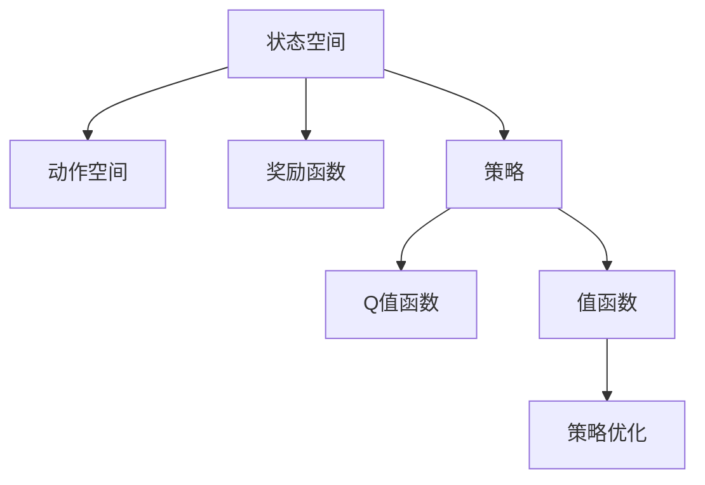

                 

# 强化学习在机器人控制中的应用

> 关键词：强化学习, 机器人控制, 行动空间, 状态空间, 策略, 连续控制, 状态转移概率, Q-learning, Deep Q-learning, 策略梯度方法, 深度策略网络, 模型基学习

## 1. 背景介绍

### 1.1 问题由来

随着智能技术的发展，机器人逐步从制造业向生活服务领域扩展。与传统的基于规则控制不同，智能机器人需要具备在复杂、不确定环境中的自主决策和动作执行能力，从而实现高灵活性和适应性。强化学习(Reinforcement Learning, RL)成为解决这类问题的关键技术。

强化学习基于试错反馈机制，让机器人在不断试错中逐步优化动作策略，学习如何最大化累积奖励，从而适应复杂环境并完成任务。强化学习已成功应用于游戏、机器人控制、自动驾驶等领域，并逐渐成为下一代智能机器人技术的重要基础。

### 1.2 问题核心关键点

强化学习在机器人控制中的应用核心在于构建状态空间、动作空间、奖励函数，并利用这些信息进行策略优化，从而指导机器人执行复杂动作并实现特定目标。

核心概念包括：

- **状态空间(State Space)**：机器人可以感知和操作的环境状态，如位置、姿态、速度、周围物体等。
- **动作空间(Action Space)**：机器人可以执行的行动集，如关节角度、电机转速、轨迹规划等。
- **奖励函数(Reward Function)**：定义动作执行后机器人获得的奖励或惩罚，如完成任务的成功率、能耗最小化、路径规划合理性等。
- **策略(Policy)**：机器人选择动作的规则或函数，用于从状态空间映射到动作空间。

这些概念相互联系，共同构成了强化学习在机器人控制中的基础框架。

## 2. 核心概念与联系

### 2.1 核心概念概述

为更好地理解强化学习在机器人控制中的应用，本节将介绍几个关键概念：

- **状态空间(State Space)**：描述机器人当前所处环境的物理状态，如位置、速度、姿态、周围物体等。
- **动作空间(Action Space)**：机器人可以采取的具体动作集合，如关节角度、电机转速、轨迹规划等。
- **奖励函数(Reward Function)**：定义动作执行后机器人获得的奖励或惩罚，用于指导机器人优化动作策略。
- **策略(Policy)**：机器人选择动作的规则或函数，用于从状态空间映射到动作空间。
- **Q值函数(Q-values)**：动作在当前状态下的长期累积奖励的估计值。
- **值函数(Value Function)**：评估状态在当前策略下的期望奖励值。
- **策略优化(Strategy Optimization)**：通过优化策略，使机器人能够适应不同环境并最大化累积奖励。

这些概念之间的逻辑关系可以通过以下Mermaid流程图来展示：



这个流程图展示出强化学习中各核心概念之间的联系：

1. 状态空间为机器人提供了感知环境的依据。
2. 动作空间定义了机器人可以采取的具体动作。
3. 奖励函数指导机器人如何通过动作获得奖励或惩罚。
4. 策略用于选择动作，从而使机器人能够在状态空间中决策。
5. Q值函数和值函数评估动作和策略的效果，用于指导策略优化。
6. 策略优化通过不断调整策略，使机器人能够适应复杂环境并最大化累积奖励。

## 3. 核心算法原理 & 具体操作步骤

### 3.1 算法原理概述

强化学习的核心算法是策略优化，目标是通过优化策略，使机器人能够适应复杂环境并最大化累积奖励。具体来说，机器人通过与环境交互，观察状态并采取动作，根据动作执行结果和奖励函数更新策略。算法过程如下：

1. 定义状态空间、动作空间、奖励函数。
2. 设定初始策略。
3. 通过与环境的交互，机器人观察当前状态，选择动作并执行。
4. 根据动作执行结果和奖励函数，更新策略。
5. 重复步骤3和4，直至策略收敛。

强化学习的核心在于如何优化策略，使其能够最大化累积奖励。常见的策略优化算法包括Q-learning、Deep Q-learning、策略梯度方法等。

### 3.2 算法步骤详解

以Q-learning算法为例，介绍强化学习的具体操作步骤。

**Step 1: 定义状态、动作和奖励**

定义状态空间 $\mathcal{S}$、动作空间 $\mathcal{A}$ 和奖励函数 $r$。

**Step 2: 设定初始策略**

随机初始化一个策略 $\pi$，即随机选择一个动作。

**Step 3: 与环境交互**

1. 机器人观察当前状态 $s$。
2. 根据策略 $\pi$ 选择动作 $a$。
3. 执行动作 $a$，观察状态 $s'$ 并获得奖励 $r$。
4. 记录当前状态 $s$ 和动作 $a$，以及新状态 $s'$ 和奖励 $r$。

**Step 4: 更新策略**

计算当前状态 $s$ 的Q值 $Q(s,a)$，根据Q-learning公式更新Q值：

$$
Q(s,a) = (1-\alpha) Q(s,a) + \alpha(r + \gamma \max_{a'} Q(s',a'))
$$

其中 $\alpha$ 是学习率，$\gamma$ 是折扣因子。

**Step 5: 重复执行**

重复步骤3和4，直至策略收敛或达到预设迭代次数。

**Step 6: 测试和部署**

在测试集上评估微调后模型 $M_{\hat{\theta}}$ 的性能，对比微调前后的精度提升。

以上是Q-learning的基本操作步骤。在实际应用中，还需要针对具体任务的特点，对算法进行优化设计，如改进奖励函数设计，引入更多的正则化技术，搜索最优的超参数组合等，以进一步提升模型性能。

### 3.3 算法优缺点

Q-learning等强化学习算法具有以下优点：

- 算法原理简单，易于实现。
- 适用于动作空间连续或离散的各种机器人控制问题。
- 能够自动适应环境变化，具有较高的灵活性。
- 不需要大量标注数据，仅需对状态和动作进行观察和执行。

但这些算法也存在一定的局限性：

- 当状态空间或动作空间过大时，计算复杂度高，难以处理。
- 学习过程受奖励函数设计的影响较大，设计不当可能陷入局部最优。
- 需要大量迭代次数，收敛速度慢。
- 对连续动作空间的优化效果较差，难以处理复杂连续动作。

尽管存在这些局限性，但就目前而言，强化学习仍是机器人控制的重要技术。未来相关研究的重点在于如何进一步降低算法复杂度，提高算法收敛速度，同时兼顾动作优化效果。

### 3.4 算法应用领域

强化学习在机器人控制中的应用广泛，覆盖了众多不同的机器人控制场景，例如：

- 自动驾驶：通过感知环境状态和规划路径，实现车辆自动驾驶。
- 机器人导航：使机器人能够在复杂环境中自主导航，避开障碍物。
- 机器人装配：通过优化装配动作，提高机器人的装配效率和精度。
- 机器人协作：协调多个机器人共同完成任务，实现资源共享和任务分配。
- 机器人安全：通过学习避障策略，增强机器人的安全性和可靠性。
- 机器人游戏：让机器人学习游戏策略，实现自主游戏。

除了这些经典应用外，强化学习还被创新性地应用到更多场景中，如机器人视觉、机器人编舞、机器人健康护理等，为机器人技术的未来发展提供了新的方向。

## 4. 数学模型和公式 & 详细讲解  
### 4.1 数学模型构建

本节将使用数学语言对强化学习在机器人控制中的应用进行更加严格的刻画。

定义状态空间 $\mathcal{S}$、动作空间 $\mathcal{A}$，以及奖励函数 $r$。设机器人在状态 $s \in \mathcal{S}$ 下采取动作 $a \in \mathcal{A}$，观察到新状态 $s' \in \mathcal{S}$ 并获得奖励 $r \in \mathbb{R}$。机器人的目标是通过学习策略 $\pi$，最大化累积奖励：

$$
\max_{\pi} \mathbb{E}\left[\sum_{t=0}^{\infty} \gamma^t r(s_t, a_t) \right]
$$

其中 $\gamma$ 是折扣因子，$\sum_{t=0}^{\infty}$ 表示无限步长的时间累积。

在强化学习中，策略 $\pi$ 可以通过状态-动作值函数 $Q(s,a)$ 或状态值函数 $V(s)$ 来表示。值函数 $Q(s,a)$ 表示在状态 $s$ 下采取动作 $a$ 的长期累积奖励，状态值函数 $V(s)$ 表示在状态 $s$ 下的期望奖励。

### 4.2 公式推导过程

以下我们以Q-learning算法为例，推导算法的基本公式和更新过程。

**Step 1: 定义状态和动作**

设状态空间 $\mathcal{S} = \{s_1, s_2, \ldots, s_n\}$，动作空间 $\mathcal{A} = \{a_1, a_2, \ldots, a_m\}$。

**Step 2: 设定初始策略**

随机初始化策略 $\pi$，即随机选择一个动作 $a$。

**Step 3: 与环境交互**

1. 机器人观察当前状态 $s$。
2. 根据策略 $\pi$ 选择动作 $a$。
3. 执行动作 $a$，观察状态 $s'$ 并获得奖励 $r$。
4. 记录当前状态 $s$ 和动作 $a$，以及新状态 $s'$ 和奖励 $r$。

**Step 4: 更新策略**

计算当前状态 $s$ 的Q值 $Q(s,a)$，根据Q-learning公式更新Q值：

$$
Q(s,a) = (1-\alpha) Q(s,a) + \alpha(r + \gamma \max_{a'} Q(s',a'))
$$

其中 $\alpha$ 是学习率，$\gamma$ 是折扣因子。

**Step 5: 重复执行**

重复步骤3和4，直至策略收敛或达到预设迭代次数。

### 4.3 案例分析与讲解

以一个简单的机器人导航任务为例，说明强化学习在其中的应用。

假设机器人在一个二维空间中导航，目标是到达目标位置。状态空间为 $\mathcal{S} = \{(x,y)\}$，动作空间为 $\mathcal{A} = \{N,W,S,E\}$，分别表示向上、左、下、右移动。奖励函数为 $r(s,a) = -1$，即无论采取什么动作，机器人都会获得-1的奖励。

初始策略 $\pi$ 为随机策略，即随机选择一个动作。通过与环境的交互，机器人逐步优化动作策略，学习如何最大化累积奖励。

具体来说，机器人观察当前位置 $(x,y)$，随机选择一个动作，然后执行该动作，观察到新位置 $(x',y')$。根据Q-learning公式更新Q值：

$$
Q((x,y),N) = (1-\alpha) Q((x,y),N) + \alpha(-1 + \gamma \max_{a} Q((x',y'),a))
$$

重复以上过程，直至策略收敛。最终，机器人能够学习到一种能够避开障碍并快速到达目标位置的策略。

## 5. 项目实践：代码实例和详细解释说明
### 5.1 开发环境搭建

在进行强化学习实践前，我们需要准备好开发环境。以下是使用Python进行强化学习开发的环境配置流程：

1. 安装Anaconda：从官网下载并安装Anaconda，用于创建独立的Python环境。

2. 创建并激活虚拟环境：
```bash
conda create -n rl-env python=3.8 
conda activate rl-env
```

3. 安装相关库：
```bash
conda install gym=0.18.0 numpy scipy matplotlib pydot
```

4. 安装gym库，用于构建和模拟各种强化学习环境。

5. 安装TensorFlow：
```bash
pip install tensorflow==2.6.0
```

6. 安装Keras：
```bash
pip install keras==2.6.0
```

完成上述步骤后，即可在`rl-env`环境中开始强化学习实践。

### 5.2 源代码详细实现

下面我们以Q-learning算法在CartPole环境中的应用为例，给出使用Python和TensorFlow进行强化学习实验的代码实现。

首先，导入相关库和环境：

```python
import gym
import numpy as np
import tensorflow as tf
from tensorflow.keras import layers

# 设置环境
env = gym.make('CartPole-v0')
```

然后，定义Q网络：

```python
# 定义Q网络
class QNetwork(tf.keras.Model):
    def __init__(self, input_shape, output_shape):
        super(QNetwork, self).__init__()
        self.dense1 = layers.Dense(24, input_shape=input_shape)
        self.dense2 = layers.Dense(48, activation='relu')
        self.dense3 = layers.Dense(output_shape, activation='linear')
        
    def call(self, inputs):
        x = self.dense1(inputs)
        x = self.dense2(x)
        return self.dense3(x)
        
# 创建Q网络
input_shape = (4,)
output_shape = (2,)
q_network = QNetwork(input_shape, output_shape)
```

接着，定义策略和优化器：

```python
# 定义策略
def epsilon_greedy(q_values, epsilon=0.1):
    a = np.random.rand()
    if a < epsilon:
        return np.random.randint(0, output_shape[0])
    else:
        return np.argmax(q_values)

# 定义优化器
learning_rate = 0.1
optimizer = tf.keras.optimizers.Adam(learning_rate)
```

然后，定义训练函数：

```python
# 训练函数
def train():
    for episode in range(1000):
        state = env.reset()
        done = False
        while not done:
            q_values = q_network(tf.convert_to_tensor([state]))
            action = epsilon_greedy(q_values.numpy())
            next_state, reward, done, _ = env.step(action)
            target = reward + gamma * np.max(q_network(tf.convert_to_tensor([next_state])).numpy())
            target_q_value = q_values.numpy()[0][action]
            target_q_value = target if done else target_q_value + learning_rate * (target - target_q_value)
            optimizer.zero_grad()
            q_values[0][action].assign(tf.constant(target_q_value))
            q_values = q_network(tf.convert_to_tensor([state]))
            state = next_state
        
        env.render()
```

最后，启动训练流程：

```python
# 训练Q-learning模型
gamma = 0.95
env.seed(1)
train()
```

以上就是使用Python和TensorFlow进行强化学习实验的完整代码实现。可以看到，在gym环境中，我们通过构建Q网络、定义策略和优化器，实现了Q-learning算法的核心功能。

### 5.3 代码解读与分析

让我们再详细解读一下关键代码的实现细节：

**QNetwork类**：
- `__init__`方法：初始化Q网络，包含三个全连接层。
- `call`方法：定义Q网络的计算流程，通过多个全连接层将输入转换为输出。

**epsilon_greedy函数**：
- 定义探索-利用策略，通过设定探索率 $\epsilon$ 随机选择一个动作，或者选择Q值最大的动作。

**训练函数train**：
- 遍历1000个episode，在每个episode中模拟机器人与环境的交互。
- 在每个时间步，选择动作并执行，根据动作执行结果和Q网络计算出的Q值，更新Q值。
- 使用Adam优化器更新Q网络的权重。
- 在每个episode结束时，在环境中渲染结果。

通过以上代码，我们实现了基本的Q-learning算法，使得机器人能够在CartPole环境中通过与环境的交互，逐步学习到最优动作策略。

## 6. 实际应用场景

### 6.1 自动驾驶

自动驾驶是强化学习在机器人控制中的一个重要应用场景。自动驾驶系统需要处理复杂的交通环境，通过感知周围环境和车辆状态，制定最优驾驶策略，实现安全、高效的自动驾驶。

在自动驾驶中，状态空间包括车辆的位置、速度、周围车辆、道路状况等，动作空间包括加速、减速、转向、刹车等操作。奖励函数可以定义为安全驾驶、避免碰撞、减少能耗等。

通过强化学习，自动驾驶系统能够在复杂交通环境中学习到最优驾驶策略，实现自主驾驶。目前，自动驾驶技术已经在部分高级驾驶辅助系统(ADAS)中得到应用，未来有望实现全无人驾驶。

### 6.2 机器人协作

机器人协作是强化学习在机器人控制中的另一个重要应用场景。多个机器人需要在同一环境下协作完成共同任务，如搬运货物、组装零件等。

在机器人协作中，状态空间包括多个机器人的位置、姿态、速度等，动作空间包括机器人的操作指令。奖励函数可以定义为完成任务的成功率、能耗最小化、路径优化等。

通过强化学习，机器人协作系统能够在多机器人环境中学习到最优协作策略，实现资源共享和任务分配，提高整体效率。机器人协作技术已经在制造、仓储、物流等领域得到应用，未来有望在更多场景中发挥作用。

### 6.3 机器人健康护理

机器人健康护理是强化学习在机器人控制中的新兴应用场景。机器人需要在病人周围执行各种护理任务，如喂食、清洁、巡视等。

在机器人健康护理中，状态空间包括病人的状态、机器人的位置、环境状况等，动作空间包括机器人的操作指令。奖励函数可以定义为病人的舒适程度、护理任务的成功率、机器人的能量消耗等。

通过强化学习，机器人健康护理系统能够在病人周围学习到最优护理策略，实现高质量的病人护理。机器人健康护理技术已经在医院、养老院等场所得到应用，未来有望在更多领域推广。

### 6.4 未来应用展望

随着强化学习技术的不断进步，未来在机器人控制中的应用将更加广泛，涵盖更多不同的机器人控制场景，如机器人游戏、机器人娱乐、机器人教育等。

在机器人游戏领域，强化学习可以用于训练机器人玩家，提升游戏水平。在机器人娱乐领域，机器人可以通过与用户交互，提供更加自然、个性化的娱乐体验。在机器人教育领域，机器人可以辅助学生学习，解答问题，提供个性化辅导。

此外，随着多模态技术的不断进步，未来机器人将能够感知和处理更多类型的信息，如声音、图像、触觉等。这将使得强化学习在机器人控制中具有更广泛的应用，提高机器人的感知能力和智能化水平。

## 7. 工具和资源推荐
### 7.1 学习资源推荐

为了帮助开发者系统掌握强化学习在机器人控制中的应用，这里推荐一些优质的学习资源：

1. 《Reinforcement Learning: An Introduction》书籍：由Richard S. Sutton和Andrew G. Barto所著，全面介绍了强化学习的基本概念和算法。

2. Coursera《Reinforcement Learning》课程：由David Silver主讲，介绍了强化学习的基本原理和实际应用。

3. Udacity《Artificial General Intelligence》课程：由AI领域的知名专家主讲，介绍了AI技术的发展历程和未来趋势。

4. Gym库官方文档：详细介绍了Gym库的各个组件和用法，是进行强化学习实验的基础。

5. OpenAI Gym论文：介绍了Gym库的设计思想和使用方法，是学习强化学习的必读材料。

通过这些资源的学习实践，相信你一定能够快速掌握强化学习在机器人控制中的应用，并用于解决实际的机器人控制问题。

### 7.2 开发工具推荐

高效的开发离不开优秀的工具支持。以下是几款用于强化学习开发的常用工具：

1. Gym库：用于构建和模拟各种强化学习环境，是进行强化学习实验的基础。

2. TensorFlow：由Google开发的深度学习框架，支持大规模深度神经网络的训练和推理。

3. Keras：基于TensorFlow的高级神经网络库，提供了简单易用的API接口，适合快速开发和实验。

4. PyTorch：由Facebook开发的深度学习框架，支持动态计算图，适合研究性实验和工程开发。

5. Jupyter Notebook：用于编写和运行Python代码的环境，支持交互式开发和可视化。

合理利用这些工具，可以显著提升强化学习实验的开发效率，加快创新迭代的步伐。

### 7.3 相关论文推荐

强化学习在机器人控制中的应用受到了广泛的关注，以下是几篇奠基性的相关论文，推荐阅读：

1. DeepMind的《Playing Atari with Deep Reinforcement Learning》：介绍如何使用深度强化学习实现复杂游戏的自动控制。

2. OpenAI的《OpenAI Five: OpenAI's approach to playing Dota 2》：介绍如何使用强化学习实现多人在线游戏《Dota 2》的自动控制。

3. Berkeley的《DeepRL》：介绍深度强化学习的基本原理和应用场景。

4. UCL的《Real World Reinforcement Learning》：介绍强化学习在实际应用中的挑战和解决方法。

这些论文代表了大规模强化学习技术的发展脉络。通过学习这些前沿成果，可以帮助研究者把握学科前进方向，激发更多的创新灵感。

## 8. 总结：未来发展趋势与挑战

### 8.1 总结

本文对强化学习在机器人控制中的应用进行了全面系统的介绍。首先阐述了强化学习在机器人控制中的应用背景和意义，明确了强化学习在复杂环境中的自主决策和动作执行能力。其次，从原理到实践，详细讲解了强化学习的数学模型和核心算法，给出了强化学习任务开发的完整代码实例。同时，本文还广泛探讨了强化学习在自动驾驶、机器人协作、机器人健康护理等各个领域的应用前景，展示了强化学习技术的广阔前景。此外，本文精选了强化学习技术的各类学习资源，力求为读者提供全方位的技术指引。

通过本文的系统梳理，可以看到，强化学习在机器人控制中的研究正在不断深入，技术日趋成熟，未来将会在更多领域得到应用，为智能技术的发展带来新的动力。

### 8.2 未来发展趋势

展望未来，强化学习在机器人控制中的应用将呈现以下几个发展趋势：

1. 模型规模持续增大。随着算力成本的下降和数据规模的扩张，强化学习模型的参数量还将持续增长。超大规模强化学习模型蕴含的丰富控制知识，有望支撑更加复杂、多变的机器人控制问题。

2. 算法复杂度不断降低。未来算法将朝着更加简单、高效的方向发展，能够处理更大规模的状态空间和动作空间，降低计算复杂度。

3. 多模态控制技术兴起。当前强化学习主要聚焦于纯文本数据，未来将进一步拓展到图像、声音、触觉等多模态数据控制。多模态信息的融合，将显著提升机器人对现实世界的感知和理解能力。

4. 实时决策技术完善。未来强化学习将结合实时数据流，实现对环境的实时感知和动态决策，提高机器人的灵活性和适应性。

5. 跨领域知识整合能力提升。未来的强化学习将更多地结合外部知识库和专家知识，提高模型的知识整合能力和泛化能力，增强机器人的智能水平。

以上趋势凸显了强化学习在机器人控制中的广泛应用前景。这些方向的探索发展，必将进一步提升机器人系统的性能和智能化水平，为机器人的广泛应用提供新的技术支持。

### 8.3 面临的挑战

尽管强化学习在机器人控制中的应用已经取得了显著进展，但在迈向更加智能化、普适化应用的过程中，它仍面临着诸多挑战：

1. 状态空间和动作空间过大。当机器人的状态空间或动作空间过大时，计算复杂度高，难以处理。这将需要更高效的算法和硬件支持。

2. 奖励函数设计困难。当前强化学习的效果很大程度上依赖于奖励函数的设计，而设计一个合适的奖励函数是一个复杂且耗时的过程。

3. 训练时间长。强化学习通常需要大量迭代次数，训练时间较长。这将需要更高效的算法和更强大的计算资源。

4. 过拟合问题。强化学习中的过拟合问题需要进一步研究，以确保模型在复杂环境中具有泛化能力。

5. 安全性和稳定性。强化学习模型在实际应用中可能存在安全隐患和稳定性问题，需要进一步研究和优化。

6. 可解释性不足。当前强化学习模型通常被视为"黑盒"，难以解释其内部工作机制和决策逻辑。

正视强化学习面临的这些挑战，积极应对并寻求突破，将使强化学习技术在机器人控制中不断完善和优化，推动机器人的广泛应用。

### 8.4 研究展望

面对强化学习在机器人控制中所面临的挑战，未来的研究需要在以下几个方面寻求新的突破：

1. 探索更加高效的算法。开发更高效的算法，以处理更大规模的状态空间和动作空间，降低计算复杂度。

2. 改进奖励函数设计。引入更智能的奖励函数设计方法，如基于模型的奖励函数、逆强化学习等，提高奖励函数设计的效率和质量。

3. 提高模型可解释性。引入可解释性技术，如梯度权重、模型可视等，增强强化学习模型的可解释性和透明性。

4. 结合跨领域知识。将符号化的先验知识，如知识图谱、逻辑规则等，与神经网络模型进行巧妙融合，引导强化学习过程学习更准确、合理的控制策略。

5. 实现多模态控制。结合视觉、听觉、触觉等多模态信息，实现更全面、更灵活的机器人控制。

这些研究方向的研究突破，将使强化学习在机器人控制中更加智能化、普适化，实现更高水平的自主决策和动作执行能力，推动机器人技术在更多领域的应用和普及。

## 9. 附录：常见问题与解答

**Q1：强化学习是否适用于所有机器人控制问题？**

A: 强化学习在机器人控制中的应用有一定的限制，主要体现在状态空间和动作空间的大小。对于状态空间和动作空间较小的机器人控制问题，强化学习能够取得较好的效果。但对于一些复杂的、高维的机器人控制问题，强化学习的效果可能不如传统的规则控制方法。

**Q2：强化学习如何处理连续动作空间？**

A: 对于连续动作空间的问题，可以使用Q-learning等算法的变种，如深度Q-learning等，来处理连续动作空间的优化问题。同时，也可以结合模型预测和控制，如深度确定性策略梯度(DDPG)算法，来解决连续动作空间的强化学习问题。

**Q3：强化学习在机器人控制中如何处理不确定性？**

A: 强化学习可以通过引入不确定性的奖励函数，如基于概率的奖励函数，来处理不确定性问题。同时，也可以结合模型预测和控制，如强化学习中的贝叶斯优化方法，来处理不确定性问题。

**Q4：强化学习在机器人控制中如何处理多智能体问题？**

A: 强化学习可以通过引入多智能体算法，如分布式强化学习、群体智能等，来解决多智能体问题。同时，也可以结合模型预测和控制，如强化学习中的分布式模型预测控制方法，来处理多智能体问题。

**Q5：强化学习在机器人控制中如何处理复杂环境？**

A: 强化学习可以通过引入深度强化学习等高级算法，来处理复杂环境问题。同时，也可以结合模型预测和控制，如强化学习中的深度确定性策略梯度(DDPG)算法，来处理复杂环境问题。

这些问答涉及强化学习在机器人控制中的常见问题，回答这些问题有助于更好地理解强化学习在机器人控制中的应用和局限性。通过不断探索和研究，相信强化学习在机器人控制中的应用将更加广泛和深入。

