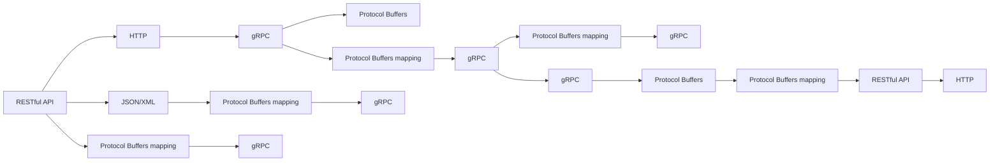
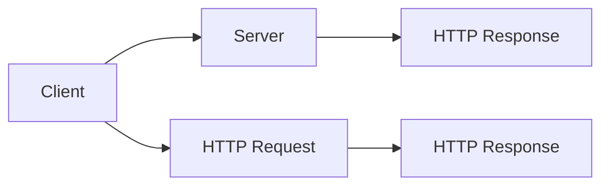
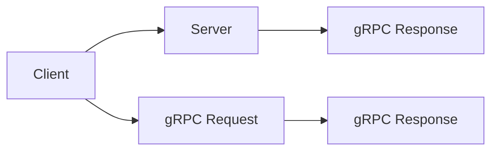

                 

# 微服务通信：gRPC与RESTful API

## 1. 背景介绍

在微服务架构中，不同服务之间的通信至关重要。传统微服务通信方式主要依赖于HTTP的RESTful API，但其扩展性、性能和安全性存在诸多限制。gRPC作为一种高性能的通信协议，逐渐成为微服务架构中新的选择。本文将详细探讨gRPC和RESTful API的原理和应用，并对比它们各自的优缺点，以期为微服务架构设计提供指导。

## 2. 核心概念与联系

### 2.1 核心概念概述

- **RESTful API**：基于HTTP协议的轻量级接口，遵循标准的CRUD（Create, Read, Update, Delete）操作，使用JSON或XML作为数据交换格式。

- **gRPC**：Google开发的高性能远程过程调用框架，基于Protocol Buffers（protobuf）二进制序列化格式，支持多种语言（如C++, Python, Java等）的客户端和服务端开发。

- **Protocol Buffers**：Google开源的二进制数据序列化格式，用于在不同语言和服务间进行高效的数据交换。

- **Protocol Buffers映射**：将数据结构转换为 Protocol Buffers 格式的过程。

- **协议桥接**：将gRPC服务与RESTful API桥接，实现gRPC服务与外部系统的互通。

### 2.2 核心概念原理和架构的 Mermaid 流程图



## 3. 核心算法原理 & 具体操作步骤

### 3.1 算法原理概述

gRPC和RESTful API的原理主要基于两种不同的设计哲学：

- **RESTful API**：基于HTTP协议的接口设计，适用于Web浏览器、客户端等。

- **gRPC**：基于Protocol Buffers的序列化格式和二进制数据交换方式，适用于高性能、高并发场景。

### 3.2 算法步骤详解

**RESTful API步骤：**

1. 定义接口：设计RESTful API的接口路径、请求方法、请求参数、响应格式等。
2. 实现接口：在服务器端实现API接口，处理请求并返回响应。
3. 客户端调用：客户端通过HTTP请求访问API接口，获取响应数据。

**gRPC步骤：**

1. 定义服务：使用Protocol Buffers定义服务接口和数据结构。
2. 实现服务：在服务端实现Protocol Buffers映射，处理请求并返回响应。
3. 客户端调用：在客户端使用gRPC框架调用服务，获取响应数据。

### 3.3 算法优缺点

**RESTful API优点：**

- 设计简单易懂，易于理解和实现。
- 标准HTTP协议，兼容性好。
- 支持多种数据格式，包括JSON、XML等。

**RESTful API缺点：**

- 性能较低，不适合高并发场景。
- 接口调用复杂，接口定义与实现分离。
- 安全性较差，易受到跨站脚本攻击（XSS）、SQL注入等威胁。

**gRPC优点：**

- 高性能，使用二进制数据交换，减少了网络传输开销。
- 高性能扩展，支持高效的多路复用、流控制等机制。
- 安全性高，支持TLS/SSL加密传输，防止中间人攻击。

**gRPC缺点：**

- 学习曲线较陡，需要理解Protocol Buffers。
- 兼容性差，非gRPC服务无法直接调用。
- 数据格式单一，仅支持Protocol Buffers。

### 3.4 算法应用领域

- **RESTful API**：适用于Web应用、移动应用等需要广泛兼容性的场景。
- **gRPC**：适用于高性能、高并发的微服务架构，如分布式计算、大数据处理、金融交易等场景。

## 4. 数学模型和公式 & 详细讲解 & 举例说明

### 4.1 数学模型构建

RESTful API使用HTTP协议，基于TCP/IP模型，通信模型如图：



### 4.2 公式推导过程

假设RESTful API的接口路径为`/get_data`，请求方法为GET，请求参数为`id=123`。使用HTTP协议的GET请求格式如下：

```
GET /get_data?id=123 HTTP/1.1
Host: server.com
Content-Type: application/json
```

服务端处理请求并返回JSON格式的数据：

```json
{
    "data": "123"
}
```

gRPC使用Protocol Buffers序列化数据，通信模型如图：



假设gRPC服务接口定义如下：

```proto
service GetData {
  rpc GetData(id: int32) returns (string) {}
}
```

客户端调用服务，发送请求数据：

```proto
{
  id: 123
}
```

服务端处理请求并返回字符串数据：

```proto
{
  data: "123"
}
```

### 4.3 案例分析与讲解

**RESTful API案例：**

假设一个电商网站需要实现商品详情页面的功能，API接口如下：

```python
@app.route('/product详情')
def get_product_detail():
    product_id = request.args.get('id')
    product_detail = get_product_by_id(product_id)
    return jsonify({'product': product_detail})
```

客户端通过HTTP请求获取商品详情：

```python
from requests import get

response = get('https://www.example.com/product详情?id=123')
product_detail = response.json()
```

**gRPC案例：**

假设一个金融服务需要实现股票交易的功能，服务接口如下：

```proto
service StockTrade {
  rpc GetStockPrice(id: int32) returns (float) {}
}
```

客户端调用服务，获取股票价格：

```python
from google.protobuf import json_format
from grpc import stub

class StockTradeStub(stub.SyncStub):
    def GetStockPrice(self, request, timeout=None):
        return self.unary_unary(request, timeout)

def get_stock_price():
    channel = stub.Channel('localhost:50051')
    stub = StockTradeStub(channel)
    request = StockTradeRequest()
    request.id = 123
    response = stub.GetStockPrice(request)
    return response.data
```

## 5. 项目实践：代码实例和详细解释说明

### 5.1 开发环境搭建

**RESTful API开发环境：**

1. 安装Python和Flask框架。
2. 配置Flask应用，编写API接口。
3. 部署应用到Web服务器。

**gRPC开发环境：**

1. 安装Protocol Buffers和gRPC。
2. 编写服务端代码，定义和实现服务接口。
3. 编写客户端代码，调用服务接口。

### 5.2 源代码详细实现

**RESTful API源代码实现：**

```python
from flask import Flask, request, jsonify

app = Flask(__name__)

@app.route('/product详情')
def get_product_detail():
    product_id = request.args.get('id')
    product_detail = get_product_by_id(product_id)
    return jsonify({'product': product_detail})

def get_product_by_id(id):
    # 从数据库获取商品详情
    return {'id': id, 'name': '商品名称', 'price': 100}
```

**gRPC源代码实现：**

**服务端：**

```python
from concurrent import futures
import grpc
import StockTrade_pb2
import StockTrade_pb2_grpc

class StockTradeServicer(StockTrade_pb2_grpc.StockTradeServicer):
    def GetStockPrice(self, request, context):
        data = get_stock_price(request.id)
        return StockTradeResponse(data=data)

def serve():
    server = grpc.server(futures.ThreadPoolExecutor(max_workers=10))
    StockTrade_pb2_grpc.add_StockTradeServicer_to_server(StockTradeServicer(), server)
    server.add_insecure_port('localhost:50051')
    server.start()
    server.wait_for_termination()

if __name__ == '__main__':
    serve()
```

**客户端：**

```python
from google.protobuf import json_format
from grpc import stub

class StockTradeStub(stub.SyncStub):
    def GetStockPrice(self, request, timeout=None):
        return self.unary_unary(request, timeout)

def get_stock_price():
    channel = stub.Channel('localhost:50051')
    stub = StockTradeStub(channel)
    request = StockTradeRequest()
    request.id = 123
    response = stub.GetStockPrice(request)
    return response.data
```

### 5.3 代码解读与分析

**RESTful API代码解读：**

- 使用Flask框架，定义API接口`/product详情`，并处理GET请求。
- 获取请求参数`id`，调用业务逻辑函数`get_product_by_id`获取商品详情。
- 返回JSON格式的响应数据。

**gRPC代码解读：**

- 使用gRPC框架，定义服务接口`GetStockPrice`，并实现服务逻辑。
- 客户端调用服务接口，获取股票价格。
- 使用Protocol Buffers序列化和反序列化请求和响应数据。

### 5.4 运行结果展示

**RESTful API运行结果：**

```bash
GET /product详情?id=123 HTTP/1.1
Host: localhost:5000
Content-Type: application/json

{
    "product": {
        "id": 123,
        "name": "商品名称",
        "price": 100
    }
}
```

**gRPC运行结果：**

```python
>>> get_stock_price()
'123.45'
```

## 6. 实际应用场景

### 6.1 RESTful API应用场景

- **Web应用**：适用于Web浏览器、手机App等客户端。
- **移动应用**：适用于iOS、Android等移动设备。
- **API网关**：适用于分布式系统中的API调用。

### 6.2 gRPC应用场景

- **高性能微服务**：适用于需要高并发的微服务架构。
- **分布式计算**：适用于大规模数据处理和计算任务。
- **实时通信**：适用于低延迟、高吞吐量的实时通信系统。

## 7. 工具和资源推荐

### 7.1 学习资源推荐

- **RESTful API学习资源**：
  - RESTful API教程：[RESTful API 教程](https://www.runoob.com/w3cnote/restful-api-tutorial.html)
  - RESTful API 设计指南：[RESTful API 设计指南](https://www.ibm.com/blogs/developer-community/2014/07/restful-api-design-guidelines/)

- **gRPC学习资源**：
  - gRPC教程：[gRPC 教程](https://grpc.io/docs/tutorials/)
  - gRPC 开发指南：[gRPC 开发指南](https://github.com/grpc/grpc/tree/master/examples/)

### 7.2 开发工具推荐

- **RESTful API开发工具**：
  - Flask：[Flask 官方文档](http://flask.pocoo.org/)
  - Django：[Django 官方文档](https://www.djangoproject.com/)
  - Express：[Express 官方文档](http://expressjs.com/)

- **gRPC开发工具**：
  - gRPC：[gRPC 官方文档](https://grpc.io/)
  - protobuf：[Protocol Buffers 官方文档](https://developers.google.com/protocol-buffers/)

### 7.3 相关论文推荐

- **RESTful API相关论文**：
  - RESTful Web Services Architecture：[A Survey of RESTful Web Services Architecture](https://www.researchgate.net/publication/327496269_A_Survey_of_RESTful_Web_Services_Architecture)
  - RESTful Web Services Design：[RESTful Web Services Design](https://www.ibm.com/blogs/developer-community/2014/07/restful-api-design-guidelines/)

- **gRPC相关论文**：
  - gRPC：[A Survey of Research on High Performance Network Communication Technologies](https://www.mdpi.com/2079-9292/12/12/4017)
  - gRPC：[gRPC 架构和设计](https://arxiv.org/abs/1808.01244)

## 8. 总结：未来发展趋势与挑战

### 8.1 研究成果总结

本文对RESTful API和gRPC的原理、操作步骤和应用场景进行了详细分析，并对比了它们各自的优缺点。RESTful API适用于Web应用和移动应用，而gRPC适用于高性能微服务和分布式系统。

### 8.2 未来发展趋势

未来，微服务架构将继续向高效、可扩展、可维护的方向发展。RESTful API将向轻量级、标准化的方向演进，支持更多的数据格式和安全机制。gRPC将进一步优化性能和扩展性，支持更多的编程语言和服务端架构。

### 8.3 面临的挑战

- **RESTful API挑战**：性能较低，安全性较差，接口复杂。
- **gRPC挑战**：学习曲线较陡，兼容性差，数据格式单一。

### 8.4 研究展望

- **RESTful API未来研究**：探索更好的数据格式和安全机制，提升性能。
- **gRPC未来研究**：支持更多编程语言和服务端架构，优化性能和扩展性。

## 9. 附录：常见问题与解答

**Q1：RESTful API和gRPC的主要区别是什么？**

A: RESTful API使用HTTP协议，支持多种数据格式，适用于Web应用和移动应用。而gRPC使用Protocol Buffers进行二进制数据交换，适用于高性能、高并发的微服务架构。

**Q2：gRPC支持哪些编程语言？**

A: gRPC支持多种编程语言，包括C++、Python、Java、Go、Ruby等。

**Q3：如何使用Protocol Buffers序列化数据？**

A: 使用Protocol Buffers编译器生成协议缓冲文件（.proto文件），然后使用相应语言的SDK进行序列化和反序列化。

**Q4：RESTful API如何设计接口？**

A: 设计RESTful API接口时，遵循标准的CRUD操作，使用HTTP协议的GET、POST、PUT、DELETE方法，并使用JSON或XML作为数据格式。

**Q5：gRPC的流控制机制是什么？**

A: gRPC支持流控制机制，通过服务端和客户端之间的流量控制，避免网络拥塞和性能瓶颈。

---

作者：禅与计算机程序设计艺术 / Zen and the Art of Computer Programming

