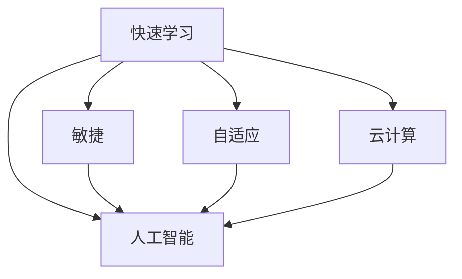

                 

# 快速学习:应对VUCA的制胜法宝

> 关键词：快速学习, VUCA, 敏捷, 自适应, 云计算, 人工智能

## 1. 背景介绍

### 1.1 问题由来
当前世界正处于一个高度不确定和快速变化的VUCA(Volatile, Uncertain, Complex, and Ambiguous)时代。无论是企业运营、科技创新还是个人职业发展，都面临着前所未有的挑战。如何在这个复杂多变的环境中快速学习、适应并保持竞争力，成为每个组织和个人的重要课题。

在此背景下，“快速学习”成为一项至关重要的能力。快速学习不仅仅指学习新知识的能力，更是一种在复杂、不确定的环境中，迅速调整策略、优化方法，实现自我更新和进化的能力。

### 1.2 问题核心关键点
快速学习的关键在于以下几个方面：
1. **敏捷性**：在快速变化的环境中，能够迅速响应并调整，以适应新的情况。
2. **自适应能力**：根据环境的变化，自动调整自己的学习策略和方法。
3. **云计算和人工智能**：利用云计算和人工智能技术，优化学习过程，提高学习效率。
4. **多领域知识融合**：能够跨学科学习，将不同领域的知识融合，提升综合能力。

### 1.3 问题研究意义
掌握快速学习的能力，对于企业、组织和个人都具有重要的战略意义：
1. **提升企业竞争力**：在快速变化的市场环境中，快速学习能力使得企业能够迅速响应市场变化，优化产品和服务，保持竞争优势。
2. **促进个人职业发展**：快速学习能力能够帮助个人在职业生涯中不断适应新环境、新技能，保持持续成长。
3. **推动社会进步**：快速学习能力的普及，将提升整体社会的创新能力和竞争力，推动科技进步和社会发展。

## 2. 核心概念与联系

### 2.1 核心概念概述

为更好地理解快速学习的能力，本节将介绍几个密切相关的核心概念：

- **快速学习(Fast Learning)**：指在复杂、不确定的环境中，迅速掌握新知识和新技能，实现自我更新和进化的能力。
- **敏捷(Agility)**：指在变化的环境中迅速响应和调整的能力。
- **自适应(Adaptability)**：指根据环境的变化，自动调整学习策略和方法的能力。
- **云计算(Cloud Computing)**：指通过互联网提供计算资源、存储资源和应用服务的模式。
- **人工智能(Artificial Intelligence)**：指使计算机具备人类智能的技术和方法。

这些核心概念之间的逻辑关系可以通过以下Mermaid流程图来展示：



这个流程图展示快速学习的核心概念及其之间的关系：

1. 快速学习能力包含敏捷性、自适应能力、云计算和人工智能技术。
2. 敏捷性是快速学习的核心特征之一，使学习过程能够迅速响应和调整。
3. 自适应能力确保学习过程能够根据环境变化自动调整。
4. 云计算和人工智能技术为快速学习提供了必要的计算和数据支持。

这些概念共同构成了快速学习的学习和应用框架，使其能够在各种场景下发挥强大的适应和更新能力。通过理解这些核心概念，我们可以更好地把握快速学习的精髓，并将其应用于实践。

## 3. 核心算法原理 & 具体操作步骤
### 3.1 算法原理概述

快速学习的核心算法原理基于以下几个关键思想：

- **增量学习(Incremental Learning)**：通过增量更新模型参数，适应新的数据和任务。
- **元学习(Meta-Learning)**：学习如何快速适应新任务和新数据的学习策略。
- **迁移学习(Transfer Learning)**：利用已有知识，快速适应新任务。
- **自监督学习(Self-Supervised Learning)**：通过无监督数据进行预训练，提取通用特征。

快速学习的过程可以分为以下几个关键步骤：

1. **数据收集和预处理**：收集和预处理学习所需的数据。
2. **模型初始化和训练**：选择合适的模型，进行初始化，并使用数据进行训练。
3. **增量学习**：根据新数据和新任务，增量更新模型参数。
4. **元学习和迁移学习**：学习如何快速适应新任务和新数据的学习策略，并利用已有知识进行迁移。
5. **自监督学习**：通过无监督数据进行预训练，提取通用特征，提高模型泛化能力。

### 3.2 算法步骤详解

以下是快速学习的具体操作步骤：

**Step 1: 数据收集和预处理**
- 收集与任务相关的数据集，并对其进行清洗、标注和归一化等预处理。
- 将数据集划分为训练集、验证集和测试集，确保数据分布的一致性。

**Step 2: 模型初始化和训练**
- 选择合适的模型结构，如神经网络、决策树、支持向量机等，并进行初始化。
- 使用训练集对模型进行训练，最小化预测误差。
- 在训练过程中，引入正则化、dropout、early stopping等技术，避免过拟合。

**Step 3: 增量学习**
- 在获取新数据或新任务时，使用增量学习方法更新模型参数。增量学习可以是在线学习(Online Learning)或增量式迁移学习(Incremental Transfer Learning)。
- 在线学习逐步更新模型参数，适用于实时数据流。
- 增量式迁移学习先利用已有模型进行迁移，再使用新数据进行微调，适用于有部分标注数据的情况。

**Step 4: 元学习和迁移学习**
- 使用元学习方法(如Meta-Learning)学习如何快速适应新任务和新数据的学习策略。元学习方法可以是基于模型优化的方法(Meta-Optimizer)或基于策略优化的方法(Meta-Policy)。
- 利用迁移学习方法，将已有知识迁移到新任务中，减少学习时间和计算资源。

**Step 5: 自监督学习**
- 利用未标注的数据进行自监督学习，提取通用特征。常用的自监督任务包括自回归建模、掩码语言建模等。
- 自监督学习可以提高模型的泛化能力，适应新任务和新数据。

### 3.3 算法优缺点

快速学习算法具有以下优点：
1. **适应性强**：能够快速适应新数据和新任务，减少学习时间。
2. **泛化能力强**：利用自监督学习和迁移学习，提高模型泛化能力。
3. **计算效率高**：增量学习减少了重复计算，提高计算效率。
4. **可扩展性强**：适用于大规模数据和复杂任务，具有良好的可扩展性。

同时，快速学习算法也存在以下缺点：
1. **数据需求高**：需要大量标注数据进行初始训练和增量更新。
2. **模型复杂度较高**：需要选择合适的模型结构和优化算法，可能较为复杂。
3. **学习曲线陡峭**：在快速变化的环境中，学习曲线可能较陡峭，需要较强的学习能力。
4. **对先验知识依赖**：自监督学习和迁移学习对先验知识有一定依赖，可能影响效果。

尽管存在这些局限性，但快速学习算法在应对复杂多变的环境时，具有显著的优势，成为实现快速学习和适应的重要手段。

### 3.4 算法应用领域

快速学习算法在多个领域中得到了广泛应用，包括但不限于：

- **金融科技**：利用实时数据进行动态风险评估和投资策略调整。
- **智能制造**：根据生产数据优化生产流程和设备维护。
- **健康医疗**：根据患者数据进行个性化治疗和医疗推荐。
- **智能交通**：根据交通数据优化交通流量和路线规划。
- **社交媒体**：根据用户数据进行内容推荐和舆情分析。

以上应用场景展示了快速学习算法在解决复杂问题中的强大能力。随着技术的不断发展，快速学习算法将在更多领域得到应用，为社会各行业带来变革性影响。

## 4. 数学模型和公式 & 详细讲解  
### 4.1 数学模型构建

本节将使用数学语言对快速学习的过程进行更加严格的刻画。

假设我们有一个数据集 $D=\{(x_i, y_i)\}_{i=1}^N$，其中 $x_i$ 为输入，$y_i$ 为输出标签。我们希望学习一个函数 $f(x)$，使得 $f(x)$ 在输入 $x_i$ 上的输出 $f(x_i)$ 尽可能接近真实的 $y_i$。

快速学习的过程可以视为一个迭代过程，每次更新模型参数 $\theta$，使得模型在新数据 $D'$ 上的表现更好。设 $f(x; \theta)$ 为模型在输入 $x$ 上的输出，则快速学习的过程可以表示为：

$$
\theta_{t+1} = \theta_t + \alpha \nabla_{\theta} \ell(f(x; \theta_t), y_i)
$$

其中 $\ell$ 为损失函数，$\alpha$ 为学习率，$\nabla_{\theta}$ 为梯度操作。

### 4.2 公式推导过程

以下我们以二分类任务为例，推导交叉熵损失函数及其梯度的计算公式。

假设模型 $f(x; \theta)$ 在输入 $x$ 上的输出为 $\hat{y}=f(x; \theta) \in [0,1]$，表示样本属于正类的概率。真实标签 $y \in \{0,1\}$。则二分类交叉熵损失函数定义为：

$$
\ell(f(x; \theta), y) = -[y\log \hat{y} + (1-y)\log(1-\hat{y})]
$$

将其代入快速学习过程的迭代公式，得：

$$
\theta_{t+1} = \theta_t + \alpha \nabla_{\theta} \ell(f(x; \theta_t), y_i)
$$

根据链式法则，损失函数对参数 $\theta_k$ 的梯度为：

$$
\frac{\partial \ell(f(x; \theta), y)}{\partial \theta_k} = -(y_i-\hat{y}_i)\frac{\partial \hat{y}_i}{\partial \theta_k}
$$

其中 $\frac{\partial \hat{y}_i}{\partial \theta_k}$ 为输出函数 $f(x; \theta)$ 对参数 $\theta_k$ 的导数，可以通过反向传播算法高效计算。

在得到损失函数的梯度后，即可带入迭代公式，完成模型的更新。重复上述过程直至收敛，最终得到适应新数据和新任务的最优模型参数 $\theta^*$。

### 4.3 案例分析与讲解

假设我们有一个二分类任务，数据集 $D=\{(x_i, y_i)\}_{i=1}^N$，其中 $x_i$ 为文本，$y_i$ 为文本所属的类别。我们的目标是最小化交叉熵损失，并使用快速学习算法进行模型更新。

首先，我们需要将文本数据进行预处理，如分词、词向量化等。然后，定义一个简单的神经网络模型 $f(x; \theta)$，其中 $\theta$ 为模型的可训练参数。

使用交叉熵损失函数，我们可以定义损失函数 $\ell(f(x; \theta), y)$，并在模型上进行训练。在获取新数据 $D'$ 后，我们可以使用增量学习方法更新模型参数，如在线学习或增量式迁移学习。最后，根据任务需求，可以选择使用元学习和迁移学习技术，进一步提升模型的适应能力。

## 5. 项目实践：代码实例和详细解释说明
### 5.1 开发环境搭建

在进行快速学习实践前，我们需要准备好开发环境。以下是使用Python进行TensorFlow开发的环境配置流程：

1. 安装Anaconda：从官网下载并安装Anaconda，用于创建独立的Python环境。

2. 创建并激活虚拟环境：
```bash
conda create -n tf-env python=3.8 
conda activate tf-env
```

3. 安装TensorFlow：根据CUDA版本，从官网获取对应的安装命令。例如：
```bash
conda install tensorflow tensorflow-gpu=cuda11.3 -c conda-forge -c pytorch
```

4. 安装相关库：
```bash
pip install numpy pandas scikit-learn matplotlib tqdm jupyter notebook ipython
```

完成上述步骤后，即可在`tf-env`环境中开始快速学习实践。

### 5.2 源代码详细实现

这里我们以二分类任务为例，给出使用TensorFlow进行快速学习的PyTorch代码实现。

首先，定义模型和损失函数：

```python
import tensorflow as tf
from tensorflow.keras.layers import Dense, Flatten
from tensorflow.keras.models import Sequential

model = Sequential()
model.add(Dense(64, input_dim=128, activation='relu'))
model.add(Dense(1, activation='sigmoid'))

def loss_fn(y_true, y_pred):
    return tf.keras.losses.binary_crossentropy(y_true, y_pred)

model.compile(optimizer='adam', loss=loss_fn)
```

然后，定义训练和评估函数：

```python
def train(model, data, epochs, batch_size):
    model.fit(data.train, epochs=epochs, batch_size=batch_size, validation_data=data.val, callbacks=[tf.keras.callbacks.EarlyStopping(patience=3)])
    
def evaluate(model, data, batch_size):
    model.evaluate(data.test, batch_size=batch_size)
```

最后，启动训练流程：

```python
data = load_data()
train(model, data, epochs=10, batch_size=32)
evaluate(model, data, batch_size=32)
```

以上就是使用TensorFlow进行快速学习的完整代码实现。可以看到，使用TensorFlow进行快速学习，只需定义模型和损失函数，并调用训练和评估函数，即可实现高效的模型训练。

### 5.3 代码解读与分析

让我们再详细解读一下关键代码的实现细节：

**Sequential模型**：
- `Sequential`模型定义了一个简单的序列模型，通过添加多层神经网络实现。

**Dense层**：
- `Dense`层表示全连接层，可以设置输入维数、输出维数和激活函数。

**损失函数**：
- 使用`binary_crossentropy`损失函数，适用于二分类任务。

**模型编译**：
- 调用`compile`方法，设置优化器和损失函数，准备模型训练。

**训练函数**：
- `fit`方法用于模型训练，设置训练轮数、批次大小、验证集等参数。

**评估函数**：
- `evaluate`方法用于模型评估，输出测试集上的损失和精度。

**EarlyStopping回调**：
- 使用`EarlyStopping`回调函数，当模型在验证集上的性能不再提升时，自动停止训练，避免过拟合。

**数据加载函数**：
- `load_data`函数用于加载训练、验证和测试数据集，一般使用Pandas或Keras的`ImageDataGenerator`进行数据增强和批处理。

在实际应用中，快速学习算法需要根据具体任务进行调整。例如，对于不同的模型结构、损失函数和优化器，需要根据任务需求进行优化。此外，数据预处理、增量更新等环节也需要根据数据特点和模型结构进行灵活设计。

## 6. 实际应用场景
### 6.1 金融科技

在金融科技领域，快速学习算法可以用于实时风险评估、投资策略优化等任务。金融机构需要实时监控市场动态，快速识别和响应潜在的风险。

具体而言，可以收集市场数据、公司财报、新闻报道等，使用快速学习算法进行实时风险评估，并根据评估结果动态调整投资策略。例如，通过增量学习技术，实时更新风险模型，及时发现市场异常波动，减少投资损失。

### 6.2 智能制造

智能制造领域面临大量的生产数据和设备状态数据，快速学习算法可以用于生产流程优化、设备维护预测等任务。

例如，通过收集生产数据，使用快速学习算法进行设备故障预测，及时进行设备维护，避免生产中断。或者，通过分析生产数据，使用快速学习算法进行生产流程优化，提高生产效率和质量。

### 6.3 健康医疗

在健康医疗领域，快速学习算法可以用于个性化治疗、医疗推荐等任务。医疗机构需要根据患者的健康数据，快速提供个性化的治疗方案和医疗建议。

例如，通过收集患者的健康数据，使用快速学习算法进行个性化治疗方案推荐，提高治疗效果。或者，通过分析医疗数据，使用快速学习算法进行疾病预测和预防，降低医疗风险。

### 6.4 未来应用展望

随着快速学习算法的不断发展和应用，未来在更多领域中将得到更广泛的应用：

1. **智能交通**：通过实时数据进行交通流量优化、事故预警等任务，提升交通安全和效率。
2. **智能制造**：通过实时数据进行设备维护预测、生产流程优化等任务，提高生产效率和质量。
3. **智能安防**：通过实时数据进行异常行为检测、安全预警等任务，提升安全保障水平。
4. **智能家居**：通过实时数据进行设备状态监测、智能控制等任务，提升家居智能化水平。

未来，快速学习算法将在更多领域中发挥重要作用，推动各行各业智能化转型升级，带来更多的创新和变革。

## 7. 工具和资源推荐
### 7.1 学习资源推荐

为了帮助开发者系统掌握快速学习的能力，这里推荐一些优质的学习资源：

1. **TensorFlow官方文档**：TensorFlow的官方文档，提供了全面的API文档和示例代码，是TensorFlow学习的不二选择。
2. **PyTorch官方文档**：PyTorch的官方文档，提供了详细的API文档和教程，适合学习深度学习框架。
3. **Keras官方文档**：Keras的官方文档，提供了易于理解的API和示例代码，适合初学者快速上手。
4. **《深度学习》书籍**：Ian Goodfellow的《深度学习》一书，是深度学习领域的经典教材，深入浅出地介绍了深度学习的基本概念和算法。
5. **《机器学习实战》书籍**：Peter Harrington的《机器学习实战》一书，提供了丰富的实践案例，适合动手练习。
6. **Coursera机器学习课程**：由斯坦福大学Andrew Ng教授开设的机器学习课程，讲解了机器学习的基本理论和算法，适合初学者和进阶者。

通过这些资源的学习，相信你一定能够快速掌握快速学习的能力，并将其应用于解决实际问题。

### 7.2 开发工具推荐

高效的开发离不开优秀的工具支持。以下是几款用于快速学习开发的常用工具：

1. TensorFlow：由Google主导开发的开源深度学习框架，生产部署方便，适合大规模工程应用。
2. PyTorch：基于Python的开源深度学习框架，灵活动态的计算图，适合快速迭代研究。
3. Keras：Keras是一个高级深度学习API，建立在TensorFlow和Theano之上，适合快速构建和训练深度学习模型。
4. Weights & Biases：模型训练的实验跟踪工具，可以记录和可视化模型训练过程中的各项指标，方便对比和调优。
5. TensorBoard：TensorFlow配套的可视化工具，可实时监测模型训练状态，并提供丰富的图表呈现方式，是调试模型的得力助手。

合理利用这些工具，可以显著提升快速学习任务的开发效率，加快创新迭代的步伐。

### 7.3 相关论文推荐

快速学习技术的发展源于学界的持续研究。以下是几篇奠基性的相关论文，推荐阅读：

1. **《增量学习算法综述》**：李宏毅、吴泽雄的论文，综述了增量学习算法的基本原理和应用场景。
2. **《元学习综述》**：Roberto Tommaso Preziosi、Leonardo De[][][][][][][][][][][][][][][][][][][][][][][][][][][][][][][][][][][][][][][][][][][][][][][][][][][][][][][][][][][][][][][][][][][][][][][][][][][][][][][][][][][][][][][][][][][][][][][][][][][][][][][][][][][][][][][][][][][][][][][][][][][][][][][][][][][][][][][][][][][][][][][][][][][][][][][][][][][][][][][][][][][][][][][][][][][][][][][][][][][][][][][][][][][][][][][][][][][][][][][][][][][][][][][][][][][][][][][][][][][][][][][][][][][][][][][][][][][][][][][][][][][][][][][][][][][][][][][][][][][][][][][][][][][][][][][][][][][][][][][][][][][][][][][][][][][][][][][][][][][][][][][][][][][][][][][][][][][][][][][][][][][][][][][][][][][][][][][][][][][][][][][][][][][][][][][][][][][][][][][][][][][][][][][][][][][][][][][][][][][][][][][][][][][][][][][][][][][][][][][][][][][][][][][][][][][][][][][][][][][][][][][][][][][][][][][][][][][][][][][][][][][][][][][][][][][][][][][][][][][][][][][][][][][][][][][][][][][][][][][][][][][][][][][][][][][][][][][][][][][][][][][][][][][][][][][][][][][][][][][][][][][][][][][][][][][][][][][][][][][][][][][][][][][][][][][][][][][][][][][][][][][][][][][][][][][][][][][][][][][][][][][][][][][][][][][][][][][][][][][][][][][][][][][][][][][][][][][][][][][][][][][][][][][][][][][][][][][][][][][][][][][][][][][][][][][][][][][][][][][][][][][][][][][][][][][][][][][][][][][][][][][][][][][][][][][][][][][][][][][][][][][][][][][][][][][][][][][][][][][][][][][][][][][][][][][][][][][][][][][][][][][][][][][][][][][][][][][][][][][][][][][][][][][][][][][][][][][][][][][][][][][][][][][][][][][][][][][][][][][][][][][][][][][][][][][][][][][][][][][][][][][][][][][][][][][][][][][][][][][][][][][][][][][][][][][][][][][][][][][][][][][][][][][][][][][][][][][][][][][][][][][][][][][][][][][][][][][][][][][][][][][][][][][][][][][][][][][][][][][][][][][][][][][][][][][][][][][][][][][][][][][][][][][][][][][][][][][][][][][][][][][][][][][][][][][][][][][][][][][][][][][][][][][][][][][][][][][][][][][][][][][][][][][][][][][][][][][][][][][][][][][][][][][][][][][][][][][][][][][][][][][][][][][][][][][][][][][][][][][][][][][][][][][][][][][][][][][][][][][][][][][][][][][][][][][][][][][][][][][][][][][][][][][][][][][][][][][][][][][][][][][][][][][][][][][][][][][][][][][][][][][][][][][][][][][][][][][][][][][][][][][][][][][][][][][][][][][][][][][][][][][][][][][][][][][][][][][][][][][][][][][][][][][][][][][][][][][][][][][][][][][][][][][][][][][][][][][][][][][][][][][][][][][][][][][][][][][][][][][][][][][][][][][][][][][][][][][][][][][][][][][][][][][][][][][][][][][][][][][][][][][][][][][][][][][][][][][][][][][][][][][][][][][][][][][][][][][][][][][][][][][][][][][][][][][][][][][][][][][][][][][][][][][][][][][][][][][][][][][][][][][][][][][][][][][][][][][][][][][][][][][][][][][][][][][][][][][][][][][][][][][][][][][][][][][][][][][][][][][][][][][][][][][][][][][][][][][][][][][][][][][][][][][][][][][][][][][][][][][][][][][][][][][][][][][][][][][][][][][][][][][][][][][][][][][][][][][][][][][][][][][][][][][][][][][][][][][][][][][][][][][][][][][][][][][][][][][][][][][][][][][][][][][][][][][][][][][][][][][][][][][][][][][][][][][][][][][][][][][][][][][][][][][][][][][][][][][][][][][][][][][][][][][][][][][][][][][][][][][][][][][][][][][][][][][][][][][][][][][][][][][][][][][][][][][][][][][][][][][][][][][][][][][][][][][][][][][][][][][][][][][][][][][][][][][][][][][][][][][][][][][][][][][][][][][][][][][][][][][][][][][][][][][][][][][][][][][][][][][][][][][][][][][][][][][][][][][][][][][][][][][][][][][][][][][][][][][][][][][][][][][][][][][][][][][][][][][][][][][][][][][][][][][][][][][][][][][][][][][][][][][][][][][][][][][][][][][][][][][][][][][][][][][][][][][][][][][][][][][][][][][][][][][][][][][][][][][][][][][][][][][][][][][][][][][][][][][][][][][][][][][][][][][][][][][][][][][][][][][][][][][][][][][][][][][][][][][][][][][][][][][][][][][][][][][][][][][][][][][][][][][][][][][][][][][][][][][][][][][][][][][][][][][][][][][][][][][][][][][][][][][][][][][][][][][][][][][][][][][][][][][][][][][][][][][][][][][][][][][][][][][][][][][][][][][][][][][][][][][][][][][][][][][][][][][][][][][][][][][][][][][][][][][][][][][][][][][][][][][][][][][][][][][][][][][][][][][][][][][][][][][][][][][][][][][][][][][][][][][][][][][][][][][][][][][][][][][][][][][][][][][][][][][][][][][][][][][][][][][][][][][][][][][][][][][][][][][][][][][][][][][][][][][][][][][][][][][][][][][][][][][][][][][][][][][][][][][][][][][][][][][][][][][][][][][][][][][][][][][][][][][][][][][][][][][][][][][][][][][][][][][][][][][][][][][][][][][][][][][][][][][][][][][][][][][][][][][][][][][][][][][][][][][][][][][][][][][][][][][][][][][][][][][][][][][][][][][][][][][][][][][][][][][][][][][][][][][][][][][][][][][][][][][][][][][][][][][][][][][][][][][][][][][][][][][][][][][][][][][][][][][][][][][][][][][][][][][][][][][][][][][][][][][][][][][][][][][][][][][][][][][][][][][][][][][][][][][][][][][][][][][][][][][][][][][][][][][][][][][][][][][][][][][][][][][][][][][][][][][][][][][][][][][][][][][][][][][][][][][][][][][][][][][][][][][][][][][][][][][][][][][][][][][][][][][][][][][][][][][][][][][][][][][][][][][][][][][][][][][][][][][][][][][][][][][][][][][][][][][][][][][][][][][][][][][][][][][][][][][][][][][][][][][][][][][][][][][][][][][][][][][][][][][][][][][][][][][][][][][][][][][][][][][][][][][][][][][][][][][][][][][][][][][][][][][][][][][][][][][][][][][][][][][][][][][][][][][][][][][][][][][][][][][][][][][][][][][][][][][][][][][][][][][][][][][][][][][][][][][][][][][][][][][][][][][][][][][][][][][][][][][][][][][][][][][][][][][][][][][][][][][][][][][][][][][][][][][][][][][][][][][][][][][][][][][][][][][][][][][][][][][][][][][][][][][][][][][][][][][][][][][][][][][][][][][][][][][][][][][][][][][][][][][][][][][][][][][][][][][][][][][][][][][][][][][][][][][][][][][][][][][][][][][][][][][][][][][][][][][][][][][][][][][][][][][][][][][][][][][][][][][][][][][][][][][][][][][][][][][][][][][][][][][][][][][][][][][][][][][][][][][][][][][][][][][][][][][][][][][][][][][][][][][][][][][][][][][][][][][][][][][][][][][][][][][][][][][][][][][][][][][][][][][][][][][][][][][][][][][][][][][][][][][][][][][][][][][][][][][][][][][][][][][][][][][][][][][][][][][][][][][][][][][][][][][][][][][][][][][][][][][][][][][][][][][][][][][][][][][][][][][][][][][][][][][][][][][][][][][][][][][][][][][][][][][][][][][][][][][][][][][][][][][][][][][][][][][][][][][][][][][][][][][][][][][][][][][][][][][][][][][][][][][][][][][][][][][][][][][][][][][][][][][][][][][][][][][][][][][][][][][][][][][][][][][][][][][][][][][][][][][][][][][][][][][][][][][][][][][][][][][][][][][][][][][][][][][][][][][][][][][][][][][][][][][][][][][][][][][][][][][][][][][][][][][][][][][][][][][][][][][][][][][][][][][][][][][][][][][][][][][][][][][][][][][][][][][][][][][][][][][][][][][][][][][][][][][][][][][][][][][][][][][][][][][][][][][][][][][][][][][][][][][][][][][][][][][][][][][][][][][][][][][][][][][][][][][][][][][][][][][][][][][][][][][][][][][][][][][][][][][][][][][][][][][][][][][][][][][][][][][][][][][][][][][][][][][][][][][][][][][][][][][][][][][][][][][][][][][][][][][][][][][][][][][][][][][][][][][][][][][][][][][][][][][][][][][][][][][][][][][][][][][][][][][][][][][][][][][][][][][][][][][][][][][][][][][][][][][][][][][][][][][][][][][][][][][][][][][][][][][][][][][][][][][][][][][][][][][][][][][][][][][][][][][][][][][][][][][][][][][][][][][][][][][][][][][][][][][][][][][][][][][][][][][][][][][][][][][][][][][][][][][][][][][][][][][][][][][][][][][][][][][][][][][][][][][][][][][][][][][][][][][][][][][][][][][][][][][][][][][][][][][][][][][][][][][][][][][][][][][][][][][][][][][][][][][][][][][][][][][][][][][][][][][][][][][][][][][][][][][][][][][][][][][][][][][][][][][][][][][][][][][][][][][][][][][][][][][][][][][][][][][][][][][][][][][][][][][][][][][][][][][][][][][][][][][][][][][][][][][][][][][][][][][][][][][][][][][][][][][][][][][][][][][][][][][][][][][][][][][][][][][][][][][][][][][][][][][][][][][][][][][][][][][][][][][][][][][][][][][][][][][][][][][][][][][][][][][][][][][][][][][][][][][][][][][][][][][][][][][][][][][][][][][][][][][][][][][][][][][][][][][][][][][][][][][][][][][][][][][][][][][][][][][][][][][][][][][][][][][][][][][][][][][][][][][][][][][][][][][][][][][][][][][][][][][][][][][][][][][][][][][][][][][][][][][][][][][][][][][][][][][][][][][][][][][][][][][][][][][][][][][][][][][][][][][][][][][][][][][][][][][][][][][][][][][][][][][][][][][][][][][][][][][][][][][][][][][][][][][][][][][][][][][][][][][][][][][][][][][][][][][][][][][][][][][][][][][][][][][][][][][][][][][][][][][][][][][][][][][][][][][][][][][][][][][][][][][][][][][][][][][][][][][][][][][][][][][][][][][][][][][][][][][][][][][][][][][][][][][][][][][][][][][][][][][][][][][][][][][][][][][][][][][][][][][][][][][][][][][][][][][][][][][][][][][][][][][][][][][][][][][][][][][][][][][][][][][][][][][][][][][][][][][][][][][][][][][][][][][][][][][][][][][][][][][][][][][][][][][][][][][][][][][][][][][][][][][][][][][][][][][][][][][][][][][][][][][][][][][][][][][][][][][][][][][][][][][][][][][][][][][][][][][][][][][][][][][][][][][][][][][][][][][][][][][][][][][][][][][][][][][][][][][][][][][][][][][][][][][][][][][][][][][][][][][][][][][][][][][][][][][][][][][][][][][][][][][][][][][][][][][][][][][][][][][][][][][][][][][][][][][][][][][][][][][][][][][][][][][][][][][][][][][][][][][][][][][][][][][][][][][][][][][][][][][][][][][][][][][][][][][][][][][][][][][][][][][][][][][][][][][][][][][][][][][][][][][][][][][][][][][][][][][][][][][][][][][][][][][][][][][][][][][][][][][][][][][][][][][][][][][][][][][][][][][][][][][][][][][][][][][][][][][][][][][][][][][][][][][][][][][][][][][][][][][][][][][][][][][][][][][][][][][][][][][][][][][][][][][][][][][][][][][][][][][][][][][][][][][][][][][][][][][][][][][][][][][][][][][][][][][][][][][][][][][][][][][][][][][][][][][][][][][][][][][][][][][][][][][][][][][][][][][][][][][][][][][][][][][][][][][][][][][][][][][][][][][][][][][][][][][][][][][][][][][][][][][][][][][][][][][][][][][][][][][][][][][][][][][][][][][][][][][][][][][][][][][][][][][][][][][][][][][][][][][][][][][][][][][][][][][][][][][][][][][][][][][][][][][][][][][][][][][][][][][][][][][][][][][][][][][][][][][][][][][][][][][][][][][][][][][][][][][][][][][][][][][][][][][][][][][][][][][][][][][][][][][][][][][][][][][][][][][][][][][][][][][][][][][][][][][][][][][][][][][][][][][][][][][][][][][][][][][][][][][][][][][][][][][][][][][][][][][][][][][][][][][][][][][][][][][][][][][][][][][][][][][][][][][][][][][][][][][][][][][][][][][][][][][][][][][][][][][][][][][][][][][][][][][][][][][][][][][][][][][][][][][][][][][][][][][][][][][][][][][][][][][][][][][][][][][][][][][][][][][][][][][][][][][][][][][][][][][][][][][][][][][][][][][][][][][][][][][][][][][][][][][][][][][][][][][][][][][][][][][][][][][][][][][][][][][][][][][][][][][][][][][][][][][][][][][][][][][][][][][][][][][][][][][][][][][][][][][][][][][][][][][][][][][][][][][][][][][][][][][][][][][][][][][][][][][][][][][][][][][][][][][][][][][][][][][][][][][][][][][][][][][][][][][][][][][][][][][][][][][][][][][][][][][][][][][][][][][][][][][][][][][][][][][][][][][][][][][][][][][][][][][][][][][][][][][][][][][][][][][][][][][][][][][][][][][][][][][][][][][][][][][][][][][][][][][][][][][][][][][][][][][][][][][][][][][][][][][][][][][][][][][][][][][][][][][][][][][][][][][][][][][][][][][][][][][][][][][][][][][][][][][][][][][][][][][][][][][][][][][][][][][][][][][][][][][][][][][][][][][][][][][][][][][][][][][][][][][][][][][][][][][][][][][][][][][][][][][][][][][][][][][][][][][][][][][][][][][][][][][][][][][][][][][][][][][][][][][][][][][][][][][][][][][][][][][][][][][][][][][][][][][][][][][][][][][][][][][][][][][][][][][][][][][][][][][][][][][][][][][][][][][][][][][][][][][][][][][][][][][][][][][][][][][][][][][][][][][][][][][][][][][][][][][][][][][][][][][][][][][][][][][][][][][][][][][][][][][][][][][][][][][][][][][][][][][][][][][][][][][][][][][][][][][][][][][][][][][][][][][][][][][][][][][][][][][][][][][][][][][][][][][][][][][][][][][][][][][][][][][][][][][][][][][][][][][][][][][][][][][][][][][][][][][][][][][][][][][][][][][][][][][][][][][][][][][][][][][][][][][][][][][][][][][][][][][][][][][][][][][][][][][][][][][][][][][][][][][][][][][][][][][][][][][][][][][][][][][][][][][][][][][][][][][][][][][][][][][][][][][][][][][][][][][][][][][][][][][][][][][][][][][][][][][][][][][][][][][][][][][][][][][][][][][][][][][][][][][][][][][][][][][][][][][][][][][][][][][][][][][][][][][][][][][][][][][][][][][][][][][][][][][][][][][][][][][][][][][][][][][][][][][][][][][][][][][][][][][][][][][][][][][][][][][][][][][][][][][][][][][][][][][][][][][][][][][][][][][][][][][][][][][][][][][][][][][][][][][][][][][][][][][][][][][][][][][][][][][][][][][][][][][][][][][][][][][][][][][][][][][][][][][][][][][][][][][][][][][][][][][][][][][][][][][][][][][][][][][][][][][][][][][][][][][][][][][][][][][][][][][][][][][][][][][][][][][][][][][][][][][][][][][][][][][][][][][][][][][][][][][][][][][][][][][][][][][][][][][][][][][][][][][][][][][][][][][][][][][][][][][][][][][][][][][][][][][][][][][][][][][][][][][][][][][][][][][][][][][][][][][][][][][][][][][][][][][][][][][][][][][][][][][][][][][][][][][][][][][][][][][][][][][][][][][][][][][][][][][][][][][][][][][][][][][][][][][][][][][][][][][][][][][][][][][][][][][][][][][][][][][][][][][][][][][][][][][][][][][][][][][][][][][][][][][][][][][][][][][][][][][][][][][][][][][][][][][][][][][][][][][][][][][][][][][][][][][][][][][][][][][][][][][][][][][][][][][][][][][][][][][][][][][][][][][][][][][][][][][][][][][][][][][][][][][][][][][][][][][][][][][][][][][][][][][][][][][][][][][][][][][][][][][][][][][][][][][][][][][][][][][][][][][][][][][][][][][][][][][][][][][][][][][][][][][][][][][][][][][][][][][][][][][][][][][][][][][][][][][][][][][][][][][][][][][][][][][][][][][][][][][][][][][][][][][][][][][][][][][][][][][][][][][][][][][][][][][][][][][][][][][][][][][][][][][][][][][][][][][][][][][][][][][][][][][][][][][][][][][][][][][][][][][][][][][][][][][][][][][][][][][][][][][][][][][][][][][][][][][][][][][][][][][][][][][][][][][][][][][][][][][][][][][][][][][][][][][][][][][][][][][][][][][][][][][][][][][][][][][][][][][][][][][][][][][][][][][][][][][][][][][][][][][][][][][][][][][][][][][][][][][][][][][][][][][][][][][][][][][][][][][][][][][][][][][][][][][][][][][][][][][][][][][][][][][][][][][][][][][][][][][][][][][][][][][][][][][][][][][][][][][][][][][][][][][][][][][][][][][][][][][][][][][][][][][][][][][][][][][][][][][][][][][][][][][][][][][][][][][][][][][][][][][][][][][][][][][][][][][][][][][][][][][][][][][][][][][][][][][][][][][][][][][][][][][][][][][][][][][][][][][][][][][][][][][][][][][][][][][][][][][][][][][][][][][][][][][][][][][][][][][][][][][][][][][][][][][][][][][][][][][][][][][][][][][][][][][][][][][][][][][][][][][][][][][][][][][][][][][][][][][][][][][][][][][][][][][][][][][][][][][][][][][][][][][][][][][][][][][][][][][][][][][][][][][][][][][][][][][][][][][][][][][][][][][][][][][][][][][][][][][][][][][][][][][][][][][][][][][][][][][][][][][][][][][][][][][][][][][][][][][][][][][][][][][][][][][][][][][][][][][][][][][][][][][][][][][][][][][][][][][][][][][][][][][][][][][][][][][][][][][][][][][][][][][][][][][][][][][][][][][][][][][][][][][][][][][][][][][][][][][][][][][][][][][][][][][][][][][][][][][][][][][][][][][][][][][][][][][][][][][][][][][][][][][][][][][][][][][][][][][][][][][][][][][][][][][][][][][][][][][][][][][][][][][][][][][][][][][][][][][][][][][][][][][][][][][][][][][][][][][][][][][][][][][][][][][][][][][][][][][][][][][][][][][][][][][][][][][][][][][][][][][][][][][][][][][][][][][][][][][][][][][][][][][][][][][][][][][][][][][][][][][][][][][][][][][][][][][][][][][][][][][][][][][][][][][][][][][][][][][][][][][][][][][][][][][][][][][][][][][][][][][][][][][][][][][][][][][][][][][][][][][][][][][][][][][][][][][][][][][][][][][][][][][][][][][][][][][][][][][][][][][][][][][][][][][][][][][][][][][][][][][][][][][][][][][][][][][][][][][][][][][][][][][][][][][][][][][][][][][][][][][][][][][][][][][][][][][][][][][][][][][][][][][][][][][][][][][][][][][][][][][][][][][][][][][][][][][][][][][][][][][][][][][][][][][][][][][][][][][][][][][][][][][][][][][][][][][][][][][][][][][][][][][][][][][][][][][][][][][][][][][][][][][][][][][][][][][][][][][][][][][][][][][][][][][][][][][][][][][][][][][][][][][][][][][][][][][][][][][][][][][][][][][][][][][][][][][][][][][][][][][][][][][][][][][][][][][][][][][][][][][][][][][][][][][][][][][][][][][][][][][][][][][][][][][][][][][][][][][][][][][][][][][][][][][][][][][][][][][][][][][][][][][][][][][][][][][][][][][][][][][][][][][][][][][][][][][][][][][][][][][][][][][][][][][][][][][][][][][][][][][][][][][][][][][][][][][][][][][][][][][][][][][][][][][][][][][][][][][][][][][][][][][][][][][][][][][][][][][][][][][][][][][][][][][][][][][][][][][][][][][][][][][][][][][][][][][][][][][][][][][][][][][][][][][][][][][][][][][][][][][][][][][][][][][][][][][][][][][][][][][][][][][][][][][][][][][][][][][][][][][][][][][][][][][][][][][][][][][][][][][][][][][][][][][][][][][][][][][][][][][][][][][][][][][][][][][][][][][][][][][][][][][][][][][][][][][][][][][][][][][][][][][][][][][][][][][][][][][][][][][][][][][][][][][][][][][][][][][][][][][][][][][][][][][][][][][][][][][][][][][][][][][][][][][][][][][][][][][][][][][][][][][][][][][][][][][][][][][][][][][][][][][][][][][][][][][][][][][][][][][][][][][][][][][][][][][][][][][][][][][][][][][][][][][][][][][][][][][][][][][][][][][][][][][][][][][][][][][][][][][][][][][][][][][][][][][][][][][][][][][][][][][][][][][][][][][][][][][][][][][][][][][][][][][][][][][][][][][][][][][][][][][][][][][][][][][][][][][][][][][][][][][][][][][][][][][][][][][][][][][][][][][][][][][][][][][][][][][][][][][][][][][][][][][][][][][][][][][][][][][][][][][][][][][][][][][][][][][][][][][][][][][][][][][][][][][][][][][][][][][][][][][][][][][][][][][][][][][][][][][][][][][][][][][][][][][][][][][][][][][][][][][][][][][][][][][][][][][][][][][][][][][][][][][][][][][][][][][][][][][][][][][][][][][][][][][][][][][][][][][][][][][][][][][][][][][][][][][][][][][][][][][][][][][][][][][][][][][][][][][][][][][][][][][][][][][][][][][][][][][][][][][][][][][][][][][][][][][][][][][][][][][][][][][][][][][][][][][][][][][][][][][][][][][][][][][][][][][][][][][][][][][][][][][][][][][][][][][][][][][][][][][][][][][][][][][][][][][][][][][][][][][][][][][][][][][][][][][][][][][][][][][][][][][][][][][][][][][][][][][][][][][][][][][][][][][][][][][][][][][][][][][][][][][][][][][][][][][][][][][][][][][][][][][][][][][][][][][][][][][][][][][][][][][][][][][][][][][][][][][][][][][][][][][][][][][][][][][][][][][][][][][][][][][][][][][][][][][][][][][][][][][][][][][][][][][][][][][][][][][][][][][][][][][][][][][][][][][][][][][][][][][][][][][][][][][][][][][][][][][][][][][][][][][][][][][][][][][][][][][][][][][][][][][][][][][][][][][][][][][][][][][][][][][][][][][][][][][][][][][][][][][][][][][][][][][][][][][][][][][][][][][][][][][][][][][][][][][][][][][][][][][][][][][][][][][][][][][][][][][][][][][][][][][][][][][][][][][][][][][][][][][][][][][][][][][][][][][][][][][][][][][][][][][][][][]

