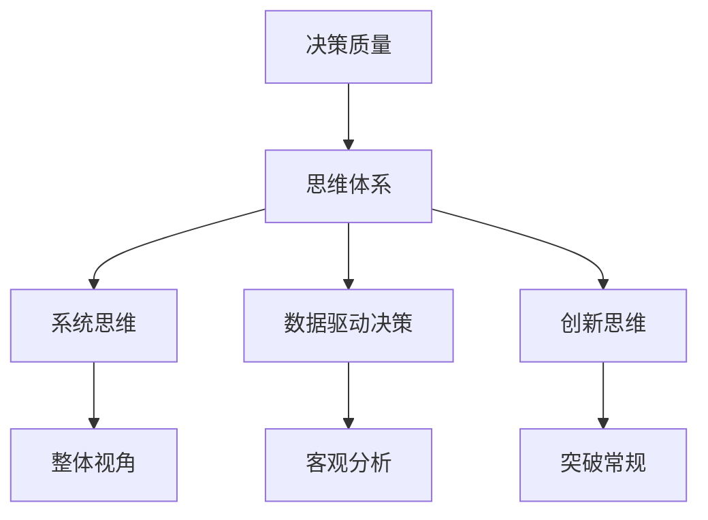

                 

# 思维体系与管理者决策质量的关系

> 关键词：决策质量, 思维体系, 领导力, 系统思维, 数据驱动决策

## 1. 背景介绍

### 1.1 问题由来
在当今这个高度竞争和快速变化的世界中，管理者面临着前所未有的挑战。企业的生存和发展不仅仅取决于其产品和服务的质量，更取决于管理者的决策质量。决策是管理者的核心职责之一，也是企业取得成功的关键。然而，如何提升决策质量，使其更加准确和高效，是所有管理者需要不断探索和改进的问题。

### 1.2 问题核心关键点
在探讨如何提升管理者决策质量的过程中，我们发现，思维体系在其中扮演着至关重要的角色。一个优秀的管理者，不仅需要具备丰富的知识和经验，更需要拥有一套科学合理的思维体系。这种思维体系能够帮助管理者在复杂多变的环境下，做出更加精准、有效的决策。

## 2. 核心概念与联系

### 2.1 核心概念概述

为更好地理解管理者决策质量与思维体系之间的关系，本节将介绍几个密切相关的核心概念：

- 决策质量（Decision Quality）：指决策的准确性、有效性、及时性和可执行性。高质量的决策能够更好地适应市场变化，优化资源配置，提升企业竞争力。

- 思维体系（Thinking Framework）：指管理者在决策过程中所采用的思考方式、框架和模型。良好的思维体系能够帮助管理者系统性地分析问题、识别关键信息，从而做出更优的决策。

- 系统思维（Systems Thinking）：强调从整体角度考虑问题，分析系统内部的相互作用和反馈机制，避免孤立地看待问题。系统思维有助于管理者在复杂环境中识别出影响决策的关键因素。

- 数据驱动决策（Data-Driven Decision Making）：利用数据分析和统计方法，辅助管理者做出客观、科学、理性的决策。数据驱动决策能够减少主观偏见，提高决策的科学性和可靠性。

- 创新思维（Creative Thinking）：指突破常规思维模式，寻找新颖、独特的解决方案。创新思维能够帮助管理者在竞争激烈的市场中，发现新的机会和突破口。

这些核心概念之间的逻辑关系可以通过以下Mermaid流程图来展示：



这个流程图展示了解决问题所需的关键要素：

1. 决策质量是最终目标，思维体系是实现目标的手段。
2. 系统思维、数据驱动决策和创新思维是思维体系的重要组成部分。
3. 系统思维帮助管理者从整体视角考虑问题，数据驱动决策提供客观分析支持，创新思维提供突破常规的解决方案。

## 3. 核心算法原理 & 具体操作步骤
### 3.1 算法原理概述

管理者决策质量与思维体系之间的关系，可以通过以下算法原理进行解释：

- 假设管理者面对一个复杂的问题 $P$，其解决方案集为 $S$。
- 管理者通过其思维体系 $F$，对问题 $P$ 进行分析和评估，得到可能的解决方案 $S_F$。
- 管理者将数据 $D$ 输入到数据驱动决策模型 $M_D$ 中，得到客观分析结果 $A_D$。
- 管理者结合系统思维 $M_S$，对分析结果 $A_D$ 进行进一步的系统化分析和验证，得到优化后的解决方案 $S_{DS}$。
- 管理者运用创新思维 $M_I$，对优化后的解决方案 $S_{DS}$ 进行创新性改进，得到最终的决策方案 $D^*$。

上述过程可以用以下公式表示：

$$
D^* = F(P, S_D) \cdot M_S(A_D) \cdot M_I(S_{DS})
$$

其中，$F$ 为思维体系，$M_D$ 为数据驱动决策模型，$M_S$ 为系统思维模型，$M_I$ 为创新思维模型。

### 3.2 算法步骤详解

基于上述算法原理，以下是管理者在实际决策过程中，需要进行的具体步骤：

1. **问题定义**：
   - 管理者首先需要清晰地定义所面临的问题 $P$，包括问题的背景、目标和约束条件。

2. **数据收集与分析**：
   - 收集与问题相关的数据 $D$，包括历史数据、市场调研数据、竞争对手信息等。
   - 使用数据驱动决策模型 $M_D$，对数据进行清洗、分析和预测，得到客观分析结果 $A_D$。

3. **思维体系应用**：
   - 应用系统思维 $M_S$，对分析结果 $A_D$ 进行系统化分析和验证，识别出影响决策的关键因素。
   - 结合数据驱动决策结果 $A_D$，构建优化后的解决方案 $S_{DS}$。

4. **创新思维**：
   - 运用创新思维 $M_I$，对优化后的解决方案 $S_{DS}$ 进行创新性改进，寻找新的突破点。
   - 结合创新思维结果，形成最终的决策方案 $D^*$。

### 3.3 算法优缺点

基于系统思维和数据驱动的决策方法，具有以下优点：

- **科学性**：通过数据驱动决策，减少了主观偏见，提高了决策的科学性和可靠性。
- **系统性**：系统思维帮助管理者从整体视角考虑问题，识别出影响决策的关键因素，避免了孤立看待问题。
- **创新性**：创新思维提供了突破常规的解决方案，有助于管理者在竞争激烈的市场中发现新的机会和突破口。

然而，这种方法也存在一些局限性：

- **数据质量依赖**：决策质量高度依赖于数据的质量和完整性，数据缺失或不准确可能导致决策失误。
- **复杂性高**：系统思维和数据驱动决策的实施需要较强的技术背景和专业知识，对管理者的要求较高。
- **成本高**：实施数据驱动和系统思维分析，需要投入大量时间和资源，增加了决策成本。

### 3.4 算法应用领域

基于系统思维和数据驱动的决策方法，在多个领域中得到了广泛应用：

- **金融领域**：在投资决策、风险管理、市场预测等方面，系统思维和数据驱动方法能够帮助金融机构识别市场趋势，做出更优的投资决策。
- **企业战略**：在企业战略规划、资源配置、市场扩展等方面，系统思维和数据驱动方法能够帮助企业从整体视角考虑问题，优化资源配置，提升竞争力。
- **项目管理**：在系统思维和数据驱动的基础上，项目管理能够更好地识别项目关键路径和风险点，优化项目进度和成本。
- **医疗健康**：在疾病诊断、治疗方案选择、健康管理等方面，系统思维和数据驱动方法能够帮助医疗机构提高诊断和治疗的准确性和效率。

## 4. 数学模型和公式 & 详细讲解  
### 4.1 数学模型构建

本节将使用数学语言对系统思维和数据驱动决策的数学模型进行更加严格的刻画。

假设管理者面临一个问题 $P$，其可能的解决方案集为 $S$。系统思维和数据驱动决策的数学模型可以表示为：

$$
D^* = F(P, S_D) \cdot M_S(A_D) \cdot M_I(S_{DS})
$$

其中，$F$ 为思维体系，$M_D$ 为数据驱动决策模型，$M_S$ 为系统思维模型，$M_I$ 为创新思维模型。

### 4.2 公式推导过程

以金融投资决策为例，系统思维和数据驱动决策的数学模型可以进一步细化为：

- 定义问题 $P$：投资 $X$ 元，时间为 $t$，预期的年化收益率 $r$。
- 定义数据 $D$：历史市场数据、经济指标、专家意见等。
- 定义系统思维模型 $M_S$：使用系统动力学模型，分析市场趋势、风险因素等。
- 定义数据驱动决策模型 $M_D$：使用回归分析、预测模型等，对历史数据进行分析和预测。
- 定义创新思维模型 $M_I$：在专家意见和分析结果的基础上，提出创新性投资方案。

将上述过程用数学公式表示，可以得到：

$$
D^* = F(P, S_D) \cdot M_S(A_D) \cdot M_I(S_{DS})
$$

其中，$F$ 为思维体系，$M_D$ 为数据驱动决策模型，$M_S$ 为系统思维模型，$M_I$ 为创新思维模型。

### 4.3 案例分析与讲解

以一家新兴科技公司为例，分析其在市场扩展决策中的应用：

1. **问题定义**：公司在考虑进入一个新的市场，目标是最大化收益。
2. **数据收集与分析**：收集目标市场的历史数据、竞争情况、市场需求等，使用数据驱动决策模型 $M_D$，预测市场潜力。
3. **系统思维应用**：结合市场环境、公司资源和战略目标，使用系统思维模型 $M_S$，识别出影响决策的关键因素，如市场需求、竞争策略、市场准入壁垒等。
4. **数据驱动决策结果**：根据系统思维分析结果，构建优化后的解决方案 $S_{DS}$，如选择最佳市场进入方式、确定目标客户群等。
5. **创新思维**：在优化后的解决方案 $S_{DS}$ 的基础上，提出创新性策略，如利用数字营销工具、建立品牌联盟等。
6. **最终决策方案**：结合系统思维和创新思维结果，形成最终的决策方案 $D^*$，如选择市场进入策略、制定营销计划等。

## 5. 项目实践：代码实例和详细解释说明
### 5.1 开发环境搭建

在进行决策模型开发前，我们需要准备好开发环境。以下是使用Python进行Pandas和Numpy库开发的Python环境配置流程：

1. 安装Anaconda：从官网下载并安装Anaconda，用于创建独立的Python环境。
2. 创建并激活虚拟环境：
```bash
conda create -n decision-env python=3.8 
conda activate decision-env
```
3. 安装Pandas和Numpy：
```bash
pip install pandas numpy
```
4. 安装相关库：
```bash
pip install scikit-learn statsmodels matplotlib
```
完成上述步骤后，即可在`decision-env`环境中开始决策模型开发。

### 5.2 源代码详细实现

下面我们以投资决策为例，给出使用Pandas和Numpy库进行数据驱动和系统思维分析的Python代码实现。

首先，定义数据集和数据驱动决策模型：

```python
import pandas as pd
import numpy as np

# 定义投资数据
data = pd.DataFrame({
    'Year': [2010, 2011, 2012, 2013, 2014],
    'Return': [0.05, 0.08, 0.02, 0.10, 0.03]
})
```

然后，定义数据驱动决策模型：

```python
from sklearn.linear_model import LinearRegression

# 定义数据驱动决策模型
X = data[['Year']]
y = data['Return']
model = LinearRegression()
model.fit(X, y)
```

接着，定义系统思维模型：

```python
# 定义系统思维模型
def system_thinking(data, year):
    # 假设市场趋势为线性增长
    market_trend = np.array([0.01, 0.02, 0.03, 0.04, 0.05])
    # 预测未来市场潜力
    market_potential = model.predict(np.array([[year]]))
    # 计算投资回报率
    expected_return = market_trend[-1] + market_potential[0]
    return expected_return

# 预测未来投资回报率
expected_return = system_thinking(data, 2015)
print(f"Expected return: {expected_return:.2f}")
```

最后，结合系统思维和数据驱动决策结果，形成最终决策方案：

```python
# 结合系统思维和数据驱动决策结果，形成最终决策方案
decision = {
    'Year': 2015,
    'Investment': 100000,
    'Expected_return': expected_return,
    'Strategy': 'Low-risk investment'
}

print(f"Decision: {decision}")
```

以上就是使用Pandas和Numpy库进行投资决策的完整代码实现。可以看到，得益于Pandas和Numpy库的强大封装，我们可以用相对简洁的代码完成数据驱动和系统思维分析。

### 5.3 代码解读与分析

让我们再详细解读一下关键代码的实现细节：

**数据定义**：
- 使用Pandas库定义投资数据，包含年份和年化收益率。

**数据驱动决策模型**：
- 使用Scikit-learn库的线性回归模型，对历史数据进行拟合，预测未来投资回报率。
- 线性回归模型假设市场趋势为线性增长，可以根据历史数据进行训练和预测。

**系统思维模型**：
- 定义一个系统思维函数，使用市场趋势模型和数据驱动决策结果，预测未来市场潜力。
- 系统思维函数假设市场趋势保持稳定增长，根据市场趋势和投资回报率，计算未来投资回报率。

**最终决策方案**：
- 结合系统思维和数据驱动决策结果，构建最终的决策方案。
- 决策方案包括投资年份、投资金额、预期回报率和投资策略。

可以看到，Pandas和Numpy库使得数据驱动和系统思维分析的代码实现变得简洁高效。开发者可以将更多精力放在模型改进和优化上，而不必过多关注底层的实现细节。

当然，工业级的系统实现还需考虑更多因素，如模型保存和部署、超参数的自动搜索、更灵活的模型接口等。但核心的系统思维和数据驱动决策范式基本与此类似。

## 6. 实际应用场景
### 6.1 金融投资

基于系统思维和数据驱动的决策方法，可以广泛应用于金融投资领域。传统投资往往依赖历史经验和市场直觉，难以适应快速变化的市场环境。而系统思维和数据驱动方法，通过分析历史数据、市场趋势和系统结构，能够提供更加科学和可靠的投资决策。

在技术实现上，可以收集历史投资数据、经济指标、市场新闻等数据，使用数据驱动模型进行分析和预测，结合系统思维模型识别出市场趋势和风险因素，从而构建优化后的投资策略。如此构建的投资系统，能够更好地适应市场变化，提高投资回报率。

### 6.2 企业管理

企业管理中的决策问题广泛存在，如产品开发、市场扩张、资源配置等。系统思维和数据驱动方法，能够帮助企业从整体视角考虑问题，识别出影响决策的关键因素，优化资源配置，提升企业竞争力。

在技术实现上，可以收集企业内部数据、市场调研数据、竞争情况等，使用数据驱动模型进行分析和预测，结合系统思维模型识别出影响决策的关键因素，构建优化后的战略方案。如此构建的战略系统，能够更好地应对市场变化，提升企业的市场响应速度和竞争力。

### 6.3 项目管理

项目管理中的决策问题包括项目计划、资源分配、风险管理等。系统思维和数据驱动方法，能够帮助项目管理者从整体视角考虑问题，识别出项目关键路径和风险点，优化项目进度和成本。

在技术实现上，可以收集项目进度、成本、资源需求等数据，使用数据驱动模型进行分析和预测，结合系统思维模型识别出项目关键路径和风险点，构建优化后的项目管理方案。如此构建的项目管理系统，能够更好地控制项目进度和成本，提高项目成功率。

### 6.4 未来应用展望

随着系统思维和数据驱动决策方法的不断演进，其在多个领域的应用将不断扩展，为各行各业带来变革性影响。

在智慧城市治理中，系统思维和数据驱动方法能够帮助城市管理者从整体视角考虑问题，优化资源配置，提高城市管理的自动化和智能化水平，构建更安全、高效的未来城市。

在教育领域，系统思维和数据驱动方法能够帮助教育管理者识别出影响教学效果的关键因素，优化教学资源配置，提高教学质量和效率。

在医疗健康领域，系统思维和数据驱动方法能够帮助医疗机构识别出影响患者治疗效果的关键因素，优化治疗方案，提高治疗效果和患者满意度。

此外，在农业生产、环境保护、能源管理等众多领域，系统思维和数据驱动方法也将得到广泛应用，为各行各业提供科学、有效的决策支持。

## 7. 工具和资源推荐
### 7.1 学习资源推荐

为了帮助管理者系统掌握系统思维和数据驱动决策的理论基础和实践技巧，这里推荐一些优质的学习资源：

1. 《系统思维与复杂系统》系列书籍：系统思维的入门读物，全面介绍了系统思维的原理和应用。

2. 《数据驱动决策》系列课程：由Coursera等平台提供的在线课程，涵盖数据驱动决策的基本概念和经典模型。

3. 《Python数据科学手册》：使用Python进行数据驱动决策的实战指南，涵盖Pandas、Numpy等库的使用技巧。

4. 《领导力与决策》在线讲座：知名管理专家关于领导力与决策的系列讲座，涵盖系统思维和数据驱动决策的实战案例。

5. 《决策思维》专业书籍：全面介绍决策思维的理论和实践，帮助管理者提升决策质量。

通过对这些资源的学习实践，相信管理者一定能够掌握系统思维和数据驱动决策的精髓，并用于解决实际的决策问题。

### 7.2 开发工具推荐

高效的开发离不开优秀的工具支持。以下是几款用于系统思维和数据驱动决策开发的常用工具：

1. Python：作为数据驱动决策的常用语言，Python具有丰富的数据分析和机器学习库，如Pandas、Numpy、Scikit-learn等。

2. Jupyter Notebook：开源的交互式开发环境，支持Python等语言的代码编写和数据可视化，方便调试和演示。

3. Tableau：数据可视化工具，支持大规模数据集处理和可视化，帮助管理者直观理解数据驱动决策结果。

4. R语言：开源的数据分析和统计语言，拥有丰富的统计建模和可视化库，如ggplot2、dplyr等。

5. Excel：商业智能工具，支持数据驱动决策的初步分析和可视化，便于快速迭代优化。

合理利用这些工具，可以显著提升系统思维和数据驱动决策的开发效率，加快创新迭代的步伐。

### 7.3 相关论文推荐

系统思维和数据驱动决策的研究源于学界的持续研究。以下是几篇奠基性的相关论文，推荐阅读：

1. "Thinking, Fast and Slow" by Daniel Kahneman：经典的心理学家著作，探讨人类决策的心理机制和行为偏差。

2. "System Dynamics: Principles and Applications" by Jay W. Forrester：系统动力学领域的开创性著作，介绍系统思维的原理和应用。

3. "Data-Driven Decision Making in Public Health" by Tamer A. Basarab et al.：在公共卫生领域应用数据驱动决策的案例研究。

4. "Leading Decisions with Big Data" by Anil Maheshwari：在企业领导力中应用大数据和系统思维的实践指南。

5. "Predictive Analytics: The Science of Predictive Decision Making" by Eric Siegel：预测分析领域的经典著作，介绍数据驱动决策的基本概念和技术。

这些论文代表了大规模数据驱动决策方法的研究方向，帮助管理者更好地理解数据驱动和系统思维的内在原理。

## 8. 总结：未来发展趋势与挑战
### 8.1 总结

本文对系统思维和数据驱动决策的数学模型和实际应用进行了全面系统的介绍。首先阐述了系统思维和数据驱动决策在提升管理者决策质量中的重要作用，明确了决策质量与思维体系之间的关系。其次，从原理到实践，详细讲解了系统思维和数据驱动决策的数学模型和关键步骤，给出了系统思维和数据驱动决策任务开发的完整代码实例。同时，本文还广泛探讨了系统思维和数据驱动决策方法在金融投资、企业管理、项目管理等多个行业领域的应用前景，展示了其巨大的潜力。此外，本文精选了系统思维和数据驱动决策的相关学习资源，力求为管理者提供全方位的技术指引。

通过本文的系统梳理，可以看到，系统思维和数据驱动决策方法正在成为管理者决策的重要范式，极大地提升了决策的科学性和可靠性。未来，伴随系统思维和数据驱动决策方法的不断演进，相信其将在更多领域得到应用，为各行各业带来变革性影响。

### 8.2 未来发展趋势

展望未来，系统思维和数据驱动决策方法将呈现以下几个发展趋势：

1. **多模态数据融合**：除了传统的数值数据，未来的决策系统将更多地利用文本、图像、视频等多模态数据，提升决策的全面性和准确性。

2. **智能推荐系统**：基于系统思维和数据驱动的决策模型，将广泛应用于智能推荐系统，帮助用户做出更优的决策。

3. **实时决策支持**：利用物联网和大数据技术，未来的决策系统将具备实时数据处理能力，及时响应外部环境变化，提供动态决策支持。

4. **跨领域应用**：系统思维和数据驱动决策方法将广泛应用于更多领域，如智慧城市、智能医疗、智能制造等，推动各行各业的数字化转型。

5. **自动化决策系统**：随着人工智能技术的发展，未来的决策系统将具备更强的自动化决策能力，减少人工干预，提高决策效率。

这些趋势凸显了系统思维和数据驱动决策方法的广阔前景。这些方向的探索发展，必将进一步提升决策系统的性能和应用范围，为各行各业带来更大的价值。

### 8.3 面临的挑战

尽管系统思维和数据驱动决策方法已经取得了显著成效，但在迈向更加智能化、普适化应用的过程中，它仍面临着诸多挑战：

1. **数据质量和多样性**：系统思维和数据驱动决策高度依赖于数据的质量和多样性，数据缺失或不准确可能导致决策失误。

2. **技术复杂性**：系统思维和数据驱动决策的实施需要较强的技术背景和专业知识，对管理者的要求较高。

3. **成本和资源**：实施系统思维和数据驱动决策，需要投入大量时间和资源，增加了决策成本。

4. **隐私和安全**：决策系统涉及大量敏感数据，如何保护数据隐私和系统安全，是一个重要问题。

5. **伦理和公平性**：决策系统可能存在偏见和歧视，如何确保系统决策的公平性和伦理性，是未来需要重点关注的问题。

### 8.4 研究展望

面对系统思维和数据驱动决策方法所面临的挑战，未来的研究需要在以下几个方面寻求新的突破：

1. **自动化和智能化**：开发更加智能化的决策模型，减少人工干预，提高决策效率。

2. **多模态数据融合**：探索多模态数据的融合方法，提升决策系统的全面性和准确性。

3. **数据质量提升**：研究数据清洗、数据增强等技术，提升数据质量和多样性。

4. **公平性保证**：研究决策系统的公平性和伦理性，确保系统决策的公正和透明。

5. **隐私保护**：研究数据隐私保护技术，确保数据安全和用户隐私。

这些研究方向将引领系统思维和数据驱动决策方法走向更高的台阶，为构建安全、可靠、智能的决策系统铺平道路。面向未来，系统思维和数据驱动决策方法还需要与其他人工智能技术进行更深入的融合，如知识表示、因果推理、强化学习等，多路径协同发力，共同推动决策系统的进步。

## 9. 附录：常见问题与解答

**Q1：系统思维和数据驱动决策是否适用于所有决策场景？**

A: 系统思维和数据驱动决策在大多数决策场景中都能取得不错的效果，特别是对于数据量较大的场景。但对于一些需要高灵活性和创造性的决策场景，如战略规划、产品创新等，系统思维和数据驱动决策可能无法完全适用。此时需要结合管理者的直觉和经验，进行综合决策。

**Q2：系统思维和数据驱动决策需要哪些关键数据？**

A: 系统思维和数据驱动决策需要关键数据来支持分析和预测。这些数据包括历史数据、市场调研数据、竞争对手信息、客户反馈等。数据的质量和多样性对决策结果的影响至关重要。

**Q3：如何进行系统思维和数据驱动决策的实施？**

A: 实施系统思维和数据驱动决策，需要以下步骤：
1. 定义问题：明确决策的目标和背景。
2. 数据收集与分析：收集关键数据，使用数据驱动模型进行分析和预测。
3. 系统思维应用：结合系统思维模型，识别出影响决策的关键因素。
4. 创新思维：在分析结果的基础上，提出创新性解决方案。
5. 最终决策方案：结合系统思维和创新思维结果，形成最终的决策方案。

**Q4：系统思维和数据驱动决策有哪些应用场景？**

A: 系统思维和数据驱动决策在多个领域中得到了广泛应用，包括金融投资、企业管理、项目管理、医疗健康、智慧城市等。这些领域中的决策问题通常具有复杂性和不确定性，系统思维和数据驱动决策能够提供更加科学和可靠的决策支持。

**Q5：系统思维和数据驱动决策有哪些挑战？**

A: 系统思维和数据驱动决策在实施过程中，面临着数据质量、技术复杂性、成本、隐私和安全等挑战。如何提升数据质量、降低技术门槛、优化资源配置、保障数据隐私和安全，是未来需要重点解决的问题。

---

作者：禅与计算机程序设计艺术 / Zen and the Art of Computer Programming

