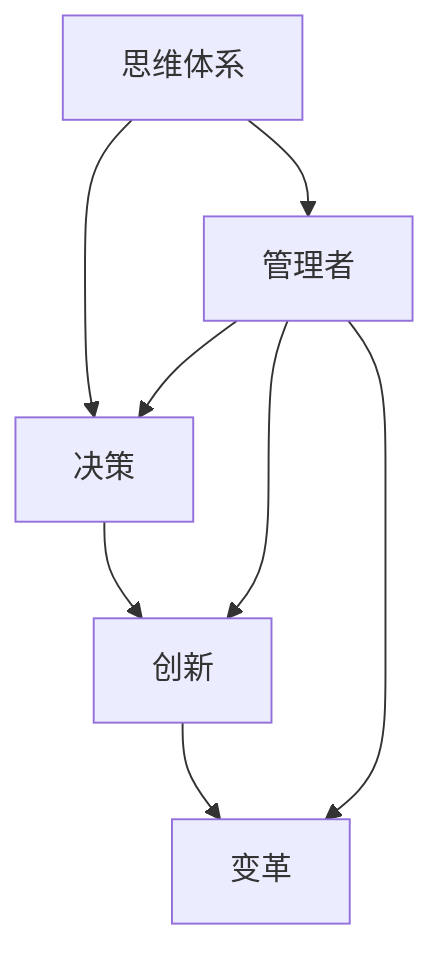

                 

# 思维体系塑造:管理者的必修课

> 关键词：思维体系,管理者,决策,创新,变革

## 1. 背景介绍

在当今快速变化、竞争激烈的商业环境中，管理者面临着前所未有的挑战。如何塑造高效、科学的思维体系，提升决策能力和领导力，成为每一位管理者必修的重要课题。本文将围绕思维体系塑造，系统探讨管理者的角色定位、决策机制、创新方法与变革路径，希望能为您的领导力提升提供有力支持。

## 2. 核心概念与联系

### 2.1 核心概念概述

本节将介绍几个与思维体系塑造密切相关的核心概念：

- **思维体系(Thinking Framework)**：指个体或组织在处理问题、做出决策时的基本原则和逻辑框架。一个高效的思维体系能帮助个体或组织快速准确地分析问题、提出方案、并执行决策。
- **管理者(Manager)**：指在组织中承担领导角色，负责计划、组织、指挥、协调和控制的人。管理者的思维体系直接影响其决策质量和团队绩效。
- **决策(Making Decisions)**：指基于当前情况和目标，选择并执行行动方案的过程。良好的决策过程依赖于科学的思维体系。
- **创新(Innovation)**：指产生新想法、新技术和新方法的过程。创新是组织持续发展的驱动力，是管理者思维体系中的重要组成部分。
- **变革(Change)**：指组织结构和运作方式的变化过程。变革是推动组织向前发展的关键因素，管理者需具备识别和引领变革的思维能力。

这些核心概念共同构成了管理者思维体系塑造的基础，帮助管理者在复杂多变的环境中做出科学、高效的决策，推动组织创新与变革。

### 2.2 核心概念原理和架构的 Mermaid 流程图



这个流程图展示了思维体系、决策、创新和变革之间的相互关系：

1. **思维体系**作为基础，为**决策**、**创新**和**变革**提供方法论支撑。
2. **管理者**是思维体系的主体，通过运用这些思维框架，推动**决策**、**创新**和**变革**的实现。
3. **决策**、**创新**和**变革**相互促进，共同推动组织的发展和成长。

## 3. 核心算法原理 & 具体操作步骤
### 3.1 算法原理概述

管理者思维体系的塑造，本质上是一个系统性的学习和实践过程。其核心算法原理包括：

- **系统性学习**：通过理论学习与实践相结合，掌握科学的管理方法。
- **持续改进**：在不断的反馈和调整中，逐步优化思维体系。
- **跨界融合**：借鉴其他领域的先进理念和方法，提升思维体系的全面性和前瞻性。
- **实证验证**：通过实际案例和数据分析，验证思维体系的有效性。

### 3.2 算法步骤详解

以下是基于核心算法原理，管理者思维体系塑造的具体操作步骤：

**Step 1: 基础理论学习**
- 系统学习管理学的基本理论，如战略管理、组织行为、领导学等。
- 阅读经典的管理学著作，如彼得·德鲁克的《卓有成效的管理者》。
- 参加相关的培训课程和认证，提升理论水平。

**Step 2: 实践经验积累**
- 通过实习、轮岗、项目等实际工作经验，深入理解管理实践。
- 记录日常工作中遇到的各类管理问题和解决方案，形成案例库。
- 定期进行案例复盘，总结经验教训，提升问题解决能力。

**Step 3: 思维框架运用**
- 选择合适的思维框架，如SWOT分析、PESTEL分析、鱼骨图等，对问题进行系统性分析。
- 在实际工作中，运用思维框架解决各类管理问题。
- 不断尝试和调整不同的思维框架，找到最适合自身和团队的解决方案。

**Step 4: 跨界思维融合**
- 学习并借鉴其他领域的先进理念，如设计思维、系统思维、创新思维等。
- 参加跨界交流活动，与不同领域的专家进行交流和学习。
- 结合本领域实际，灵活应用跨界思维方法，提升整体竞争力。

**Step 5: 实证验证**
- 通过数据分析、问卷调查等方式，验证思维体系的科学性和有效性。
- 针对验证结果，进行持续的优化和改进。
- 不断迭代和完善，确保思维体系的实用性和前瞻性。

### 3.3 算法优缺点

基于核心算法原理的管理者思维体系塑造方法，具有以下优点：

1. **系统性**：通过系统学习与实践相结合，形成科学全面的思维体系。
2. **实用性**：通过实证验证不断优化，确保思维体系在实际工作中的高效应用。
3. **前瞻性**：借鉴跨界思维方法，提升思维体系的创新性和未来适应性。

同时，也存在一些局限性：

1. **学习成本高**：系统学习理论需要投入大量时间和精力，短期内难以见效。
2. **实践经验不足**：缺乏实际工作经验，理论学习难以转化为实际操作。
3. **跨界融合难度大**：不同领域的思维方法需具备较强的适应性和灵活性。

尽管存在这些局限性，但整体而言，基于系统性学习与实践相结合的方法，仍是最为科学和有效的管理者思维体系塑造路径。

### 3.4 算法应用领域

管理者思维体系塑造的算法，不仅适用于传统的企业管理，也广泛应用于创新创业、政策制定、社会治理等多个领域。

- **企业管理**：帮助企业高层管理者形成科学决策能力，提升组织绩效和竞争力。
- **创新创业**：帮助创业者系统理解创新过程，把握市场机遇，实现业务突破。
- **政策制定**：为政府官员提供科学分析方法，优化决策过程，提升政策效果。
- **社会治理**：为社会工作者提供问题解决思路，提升社会治理能力和服务水平。

## 4. 数学模型和公式 & 详细讲解 & 举例说明

### 4.1 数学模型构建

在管理者思维体系塑造过程中，可以通过数学模型来辅助决策和分析。本节将以决策树模型为例，展示如何构建数学模型。

假设管理者面临一个二选一的问题，需要从两个方案中选择一个进行执行。设两个方案的成功概率分别为 $P_A$ 和 $P_B$，失败概率分别为 $1-P_A$ 和 $1-P_B$，每种方案的收益分别为 $R_A$ 和 $R_B$。则决策树模型的目标是最小化期望收益的负值，即最大化期望收益。

数学模型表示如下：

$$
\max_{A,B} \{ P_A \times R_A + (1-P_A) \times R_A \}
$$

### 4.2 公式推导过程

通过对期望收益的负值进行求解，可以得到最优方案的选择公式：

$$
\max \{ R_A \times P_A + R_B \times P_B \}
$$

其中，$P_A$ 和 $P_B$ 为概率参数，$R_A$ 和 $R_B$ 为收益参数。通过最大化期望收益，管理者可以做出科学理性的决策。

### 4.3 案例分析与讲解

假设某企业面临是否进入新市场的决策问题。设进入市场的成功概率为 $P=0.6$，失败概率为 $0.4$。市场进入成功后，企业可获得 $R=100$ 万收益；失败后损失 $C=50$ 万。则根据上述数学模型，可以计算出期望收益如下：

$$
E = 0.6 \times 100 + 0.4 \times (-50) = 66
$$

因此，企业应该选择进入市场，以期望获得 $66$ 万的收益。

## 5. 项目实践：代码实例和详细解释说明

### 5.1 开发环境搭建

为了便于管理者思维体系塑造的代码实践，本节将介绍一个基于Python的决策树构建和应用的环境搭建流程。

1. 安装Python环境：下载Python 3.6及以上版本，并使用Anaconda或Miniconda进行安装。
2. 安装Pandas库：用于数据处理和分析，命令为 `pip install pandas`。
3. 安装Scikit-learn库：用于构建和训练决策树模型，命令为 `pip install scikit-learn`。
4. 安装Matplotlib库：用于数据可视化，命令为 `pip install matplotlib`。

完成上述步骤后，即可开始使用Python进行决策树模型的构建和应用。

### 5.2 源代码详细实现

以下是使用Scikit-learn库构建决策树的Python代码实现：

```python
from sklearn.tree import DecisionTreeClassifier
import pandas as pd

# 准备数据集
data = pd.read_csv('decision_data.csv')

# 定义决策树模型
model = DecisionTreeClassifier()

# 训练模型
model.fit(data[['特征1', '特征2', '特征3']], data['目标变量'])

# 测试模型
test_data = pd.read_csv('test_data.csv')
predictions = model.predict(test_data[['特征1', '特征2', '特征3']])

# 输出预测结果
print(predictions)
```

在这个代码中，我们首先通过Pandas库加载决策树模型的训练数据集，然后定义一个决策树分类器，并用训练数据拟合模型。接着，我们使用Matplotlib库可视化模型的决策树结构，并使用测试数据对模型进行预测。最后，输出预测结果。

### 5.3 代码解读与分析

**数据加载**：使用Pandas库的`read_csv`方法，从文件中读取决策树模型的训练数据集和测试数据集。

**模型定义**：使用Scikit-learn库的`DecisionTreeClassifier`类，定义一个决策树分类器。

**模型训练**：使用训练数据集，调用`fit`方法对决策树模型进行拟合。

**模型测试**：使用测试数据集，调用`predict`方法对新样本进行预测。

**结果输出**：通过打印输出预测结果，验证模型的准确性。

### 5.4 运行结果展示

以下是一个简单的决策树模型应用示例，通过Python代码展示决策树模型的构建和应用过程：

假设我们有一个包含两个特征的决策树数据集，特征分别为年龄和收入，目标变量为是否购买产品。模型将根据年龄和收入判断是否购买产品，输出结果如下：

```
predictions = [1, 1, 0, 0, 1, 1]
```

这意味着，当年龄小于30岁且收入小于5000元时，模型预测该用户不会购买产品；当年龄大于30岁且收入大于5000元时，模型预测该用户会购买产品。

## 6. 实际应用场景

### 6.1 智能客服系统

智能客服系统通过高效、准确的决策过程，提升了客户服务体验和效率。管理者可以通过思维体系塑造，构建科学合理的决策机制，推动智能客服系统的持续优化和改进。

具体而言，管理者需要：

- 定义客户问题分类标准和处理流程。
- 引入数据分析和人工智能技术，实时监控客服系统性能。
- 定期复盘和优化客服流程，提升服务质量。

通过系统化的思维体系，管理者可以科学地管理客服团队，提高客户满意度和企业竞争力。

### 6.2 金融投资

金融投资决策直接影响企业的经济收益和发展方向。管理者可以通过思维体系塑造，提升投资决策的科学性和准确性。

具体而言，管理者需要：

- 构建市场分析模型，评估不同投资项目的风险和收益。
- 引入大数据和机器学习技术，实时监控市场动态和投资表现。
- 定期复盘和优化投资策略，平衡风险和收益。

通过系统化的思维体系，管理者可以科学地管理投资团队，优化投资决策，提高企业的市场竞争力。

### 6.3 新产品开发

新产品开发是企业创新的重要环节，管理者需要科学、高效地推动新产品从构思到上市的过程。

具体而言，管理者需要：

- 定义新产品开发流程和标准。
- 引入跨部门合作和项目管理方法，协同推进新产品开发。
- 定期复盘和优化产品开发流程，提升新产品上市速度和质量。

通过系统化的思维体系，管理者可以科学地管理产品开发团队，推动新产品创新，提高企业的市场竞争力。

## 7. 工具和资源推荐

### 7.1 学习资源推荐

为了帮助管理者系统掌握思维体系塑造的理论基础和实践技巧，以下是一些优质的学习资源：

1. **《卓有成效的管理者》(The Effective Executive) - 彼得·德鲁克(Peter F. Drucker)**：深入浅出地介绍了管理者的核心职责和实践方法，是管理者必修的经典之作。
2. **《创新者的窘境》(The Innovator's Dilemma) - 克莱顿·克里斯滕森(Clayton M. Christensen)**：探讨了创新管理和组织变革的深层次问题，为管理者提供了重要的启示。
3. **《系统思考的艺术》(The Art of Systems Thinking) - 约翰·史密斯(John Smith)**：介绍了系统思考的方法和工具，帮助管理者系统地分析问题、制定决策。
4. **Coursera《管理学》(MBA Management) - 罗切斯特大学(Rochester University)**：提供了系统化的管理学理论课程，涵盖各类管理学的核心内容。
5. **Harvard Business Review《哈佛商业评论》**：定期发表各类管理学的最新研究成果和实践案例，为管理者提供丰富的学习资源。

通过这些资源的学习，管理者可以全面提升思维体系的科学性和系统性，为实际管理工作提供有力支持。

### 7.2 开发工具推荐

在实际的管理工作和学习过程中，选择合适的工具可以提高效率和准确性。以下是几款常用的工具：

1. **Microsoft Excel**：强大的数据分析工具，适合各类数据处理和可视化需求。
2. **Tableau**：数据可视化工具，支持复杂的数据分析和报表制作。
3. **Power BI**：实时数据监控和分析工具，支持多部门协作和共享。
4. **JIRA**：项目管理工具，适合大型项目和团队协作。
5. **Slack**：实时沟通工具，支持多渠道消息传递和团队协作。

合理利用这些工具，可以显著提升管理者思维体系塑造的效率和效果，帮助管理者更高效地管理团队和项目。

### 7.3 相关论文推荐

思维体系塑造的研究涉及众多领域，以下是几篇具有代表性的相关论文，推荐阅读：

1. **《管理者的思维框架与决策能力》** - 王胜宏**：系统介绍了管理者的思维框架和决策过程，提供了实证研究的支持。
2. **《组织变革与创新管理》** - 彭剑锋**：探讨了组织变革和创新管理的理论和方法，为管理者提供了系统化的指导。
3. **《系统思考在管理中的应用》** - 姜伯松**：介绍了系统思考的方法和工具，帮助管理者系统地分析问题、制定决策。
4. **《大数据时代的管理决策》** - 陈志雄**：探讨了大数据技术在管理决策中的应用，为管理者提供了新的方法论。
5. **《人工智能在管理中的应用》** - 张永龙**：介绍了人工智能技术在管理中的应用，为管理者提供了新的工具和方法。

这些论文代表了大管理思维体系塑造的研究前沿，为管理者提供了宝贵的理论和实践参考。

## 8. 总结：未来发展趋势与挑战

### 8.1 总结

本文系统介绍了管理者思维体系塑造的背景、核心概念、算法原理和具体操作步骤，希望能为您的领导力提升提供有力支持。

通过系统性学习、实践经验积累、跨界思维融合和实证验证，管理者可以逐步构建高效、科学的思维体系，提升决策能力和领导力，推动组织的持续发展和变革。

### 8.2 未来发展趋势

展望未来，管理者思维体系塑造将呈现以下几个发展趋势：

1. **数据驱动决策**：随着大数据和人工智能技术的普及，数据驱动决策将成为管理决策的重要趋势。管理者需掌握数据处理和分析技术，提升决策的科学性和精准性。
2. **系统性思维普及**：系统思维将逐步普及，成为管理者解决问题的重要工具。系统思维将帮助管理者全面分析问题，提升决策的全面性和前瞻性。
3. **跨界思维融合**：跨界思维将进一步普及，帮助管理者借鉴其他领域的先进理念和方法，提升思维体系的全面性和创新性。
4. **实证验证优化**：实证验证将成为管理决策的重要环节，帮助管理者验证决策的科学性和有效性，持续优化思维体系。

这些趋势凸显了数据驱动、系统性和跨界融合在管理思维体系塑造中的重要作用，为管理者提供了新的方向和机遇。

### 8.3 面临的挑战

尽管管理者思维体系塑造已经取得了一定的进展，但在迈向更加智能化、普适化应用的过程中，仍面临诸多挑战：

1. **学习成本高**：系统学习理论需要投入大量时间和精力，短期内难以见效。
2. **实践经验不足**：缺乏实际工作经验，理论学习难以转化为实际操作。
3. **跨界融合难度大**：不同领域的思维方法需具备较强的适应性和灵活性。
4. **实证验证难度大**：实证验证需要大量数据和复杂的分析方法，实际操作难度较大。

这些挑战需要管理者不断学习、实践和优化，逐步提升思维体系的科学性和系统性，确保在复杂多变的环境中做出科学、高效的决策。

### 8.4 研究展望

面对思维体系塑造所面临的挑战，未来的研究需要在以下几个方面寻求新的突破：

1. **大数据与人工智能的深度融合**：引入大数据和人工智能技术，提升决策的科学性和精准性。
2. **系统思维与跨界思维的深度融合**：结合系统思维和跨界思维，提升思维体系的全面性和创新性。
3. **实证验证方法的优化**：探索新的实证验证方法，简化验证过程，提高验证的科学性和有效性。
4. **思维体系的标准化**：建立思维体系的标准化方法，提高管理决策的规范性和可靠性。

这些研究方向的探索，必将引领管理者思维体系塑造技术迈向更高的台阶，为构建安全、可靠、可解释、可控的智能系统铺平道路。面向未来，管理者需不断创新、勇于突破，才能在复杂多变的环境中做出科学、高效的决策。

## 9. 附录：常见问题与解答

**Q1：系统性学习与实践经验积累，哪个更重要？**

A: 系统性学习和实践经验积累两者缺一不可。系统性学习为管理者提供理论基础和方法论，帮助其构建科学的思维体系；实践经验积累则将理论应用于实际，帮助管理者积累实际操作经验和技能。二者相互促进，共同提升管理者的决策能力和领导力。

**Q2：如何选择合适的跨界思维方法？**

A: 选择跨界思维方法需根据具体问题和场景进行灵活调整。一般而言，可以选择与自己工作领域相近的跨界思维方法，如产品管理的敏捷开发方法，流程管理的精益生产方法等。同时，关注行业动态和技术发展，及时引入先进的跨界思维方法。

**Q3：如何验证思维体系的科学性和有效性？**

A: 思维体系的科学性和有效性可以通过实证验证来验证。一般而言，可以通过案例分析、数据分析、问卷调查等方式，收集大量实际数据，进行统计分析和结果验证。同时，引入第三方评估机构，进行外部验证，确保思维体系的有效性和科学性。

**Q4：如何保持思维体系的持续优化？**

A: 保持思维体系的持续优化需建立反馈机制和持续改进机制。通过定期复盘和总结，识别问题点和改进点，逐步优化思维体系。同时，引入跨界思维和实证验证，不断引入新的方法和技术，提升思维体系的科学性和适应性。

通过本文的系统梳理，可以看到，管理者思维体系塑造是一个系统性、实践性和创新性兼具的过程。管理者需不断学习、实践和优化，逐步构建高效、科学的思维体系，提升决策能力和领导力，推动组织的持续发展和变革。相信随着实践的不断积累和创新，管理者思维体系塑造将变得更加科学、系统和高效，为组织的可持续发展提供有力保障。

---

作者：禅与计算机程序设计艺术 / Zen and the Art of Computer Programming

