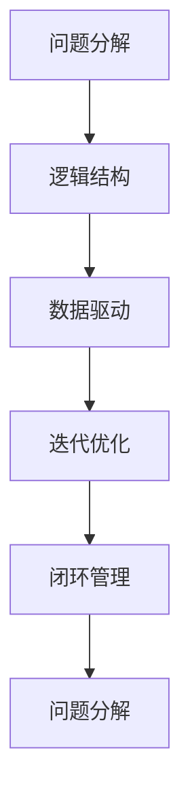

                 

# 思维框架：结构化思考的工具

> 关键词：结构化思考, 算法原理, 操作步骤, 数学模型, 实践案例, 应用场景, 未来展望

## 1. 背景介绍

### 1.1 问题由来

在现代社会，信息爆炸、知识碎片化、决策复杂化等挑战愈发凸显。面对海量且不断更新的数据，如何有效筛选、组织和利用信息，进行高效、合理的决策，成为了现代社会急需解决的问题。结构化思考（Structured Thinking）作为一种科学合理的思维方式，为人们提供了系统化、规范化的思路框架，帮助他们在复杂多变的环境中进行更精准的判断和决策。

结构化思考，是指在处理问题和决策过程中，通过将问题分解成易于管理的部分，建立清晰的逻辑结构，利用数据和事实进行严密的分析和推导，最终得出科学合理的结论。这一思维方式在逻辑推理、项目管理、数据分析、战略规划等多个领域得到了广泛应用，成为了现代管理与技术的重要工具。

### 1.2 问题核心关键点

结构化思考的核心关键点包括：

1. **问题分解**：将复杂问题拆解为更小、更具体的子问题，便于管理和处理。
2. **逻辑结构**：利用结构化的逻辑框架，系统地组织信息，进行推导和验证。
3. **数据驱动**：在决策过程中，充分运用数据和事实，避免主观臆断。
4. **迭代优化**：不断反馈和调整，逐步完善解决方案。

这些关键点共同构成了结构化思考的核心要素，使其在复杂多变的环境下，依然能够提供精准的决策依据和解决方案。

### 1.3 问题研究意义

结构化思考在各个领域的应用，对于提升决策质量、优化管理流程、加速创新进程、提升问题解决能力等具有重要意义。

- **决策质量提升**：通过系统化、规范化的分析过程，减少主观偏见，提高决策的科学性和准确性。
- **流程优化**：在项目管理、产品开发、业务运营等过程中，利用结构化工具进行流程优化，提升效率和效果。
- **创新加速**：系统化的思考框架能够帮助团队更有效地识别机会、分析挑战、制定策略，加速创新与变革。
- **能力提升**：通过系统化的训练和实践，提升个人和团队的问题解决能力，培养跨领域思维和创新能力。
- **风险控制**：结构化思考有助于识别潜在风险，制定风险应对策略，保障项目的成功率。

## 2. 核心概念与联系

### 2.1 核心概念概述

为了更好地理解结构化思考的原理和实践，本节将介绍几个密切相关的核心概念：

- **问题分解**：将复杂问题拆分为多个具体的子问题，便于分析和处理。
- **逻辑结构**：利用树状结构、流程图等形式，系统地组织和展示信息。
- **数据驱动**：在决策过程中，充分运用统计数据、实验结果等客观信息，避免主观判断。
- **迭代优化**：通过不断的反馈和调整，逐步完善解决方案。
- **闭环管理**：确保问题的输入、处理、输出形成一个完整的循环，不断优化提升。

这些核心概念之间的逻辑关系可以通过以下Mermaid流程图来展示：



这个流程图展示了结构化思考的主要步骤：

1. 通过问题分解，将复杂问题拆分为多个子问题。
2. 利用逻辑结构，系统地组织和展示信息。
3. 在决策过程中，充分运用数据和事实，避免主观臆断。
4. 通过迭代优化，不断调整和完善解决方案。
5. 确保问题处理形成一个完整的循环，不断提升效果。

## 3. 核心算法原理 & 具体操作步骤

### 3.1 算法原理概述

结构化思考的算法原理，基于逻辑推理和数据驱动，通过系统化的分析框架，帮助决策者进行精准判断和决策。其核心在于将问题分解成可管理的子问题，利用数据和事实进行严密的分析和推导，最终得出科学合理的结论。

在结构化思考的过程中，主要利用树状结构、流程图等形式，系统地组织和展示信息。通过数据驱动的方法，充分运用统计数据、实验结果等客观信息，避免主观判断。最终，通过迭代优化的方法，不断调整和完善解决方案，确保问题处理的完整性和有效性。

### 3.2 算法步骤详解

结构化思考的核心算法步骤如下：

**Step 1: 问题分解**
- 将复杂问题拆分为多个具体的子问题，便于管理和处理。

**Step 2: 建立逻辑结构**
- 利用树状结构、流程图等形式，系统地组织和展示信息。

**Step 3: 数据驱动**
- 在决策过程中，充分运用数据和事实，避免主观臆断。

**Step 4: 迭代优化**
- 通过不断的反馈和调整，逐步完善解决方案。

**Step 5: 闭环管理**
- 确保问题的输入、处理、输出形成一个完整的循环，不断优化提升。

### 3.3 算法优缺点

结构化思考的算法具有以下优点：

1. **系统性**：通过系统化的分析框架，能够全面、系统地处理复杂问题。
2. **客观性**：利用数据和事实，避免主观臆断，提高决策的科学性和准确性。
3. **可操作性**：通过具体的步骤和方法，便于实施和操作。
4. **迭代性**：通过不断的反馈和调整，逐步优化解决方案。

同时，该算法也存在一定的局限性：

1. **复杂度**：对于特别复杂的问题，问题分解可能较为困难，难以系统化处理。
2. **数据依赖**：对于数据质量要求高，需要高质量的数据支持。
3. **灵活性不足**：过于依赖固定的结构，难以应对新情况和变化。
4. **人机交互**：需要人工干预和判断，效率可能较低。

尽管存在这些局限性，但结构化思考仍然是解决复杂问题的有效工具，特别是在需要系统性、客观性决策的领域，具有不可替代的价值。

### 3.4 算法应用领域

结构化思考在多个领域得到了广泛的应用，主要包括：

- **项目管理**：利用工作分解结构(WBS)、甘特图等工具，系统地组织和管理项目。
- **数据分析**：通过数据驱动的方法，进行数据收集、清洗、分析和决策。
- **战略规划**：通过系统化的分析框架，进行战略定位和规划。
- **运营管理**：利用流程优化、资源配置等方法，提升运营效率。
- **风险管理**：通过风险识别、评估和应对，保障项目的成功率。

除了这些常见领域外，结构化思考还被应用于科学研究、社会治理、创新管理等更多场景中，为问题解决和决策提供了系统化、规范化的思路框架。

## 4. 数学模型和公式 & 详细讲解 & 举例说明

### 4.1 数学模型构建

结构化思考的数学模型，主要基于逻辑推理和数据驱动，通过系统化的分析框架，进行精准的决策和判断。

形式化地，假设问题 $P$ 分解为多个子问题 $P_1, P_2, \ldots, P_n$，其逻辑结构可以表示为一个有向无环图（DAG），其中节点表示子问题，边表示子问题之间的依赖关系。设 $D$ 为问题 $P$ 的数据集，模型 $M$ 为决策模型，则结构化思考的过程可以表示为：

$$
M = \mathop{\arg\min}_{M} \mathcal{L}(M, P, D)
$$

其中 $\mathcal{L}$ 为模型 $M$ 在问题 $P$ 和数据集 $D$ 上的损失函数，用于衡量模型的预测与真实标签之间的差异。

### 4.2 公式推导过程

以下我们以项目管理为例，推导结构化思考的数学模型和公式。

假设项目 $P$ 的目标为 $T$，其中包含多个子任务 $T_1, T_2, \ldots, T_n$。子任务 $T_i$ 需要依赖于其他子任务 $T_{i_1}, T_{i_2}, \ldots, T_{i_k}$，依赖关系可以表示为有向边 $(T_{i_1}, T_i), (T_{i_2}, T_i), \ldots, (T_{i_k}, T_i)$。

设 $D$ 为项目 $P$ 的数据集，其中包含各子任务的进度、资源、风险等数据。则问题 $P$ 的决策模型 $M$ 可以表示为：

$$
M = \mathop{\arg\min}_{M} \mathcal{L}(M, P, D)
$$

其中 $\mathcal{L}$ 为模型 $M$ 在问题 $P$ 和数据集 $D$ 上的损失函数，用于衡量模型的预测与真实进度、资源、风险等数据之间的差异。

假设模型 $M$ 为线性回归模型，则其损失函数可以表示为：

$$
\mathcal{L}(M, P, D) = \sum_{i=1}^n \frac{1}{2}||M(P_i, D_i) - D_i||^2
$$

其中 $P_i$ 表示子任务 $T_i$ 的进度、资源、风险等数据，$D_i$ 表示子任务 $T_i$ 的实际结果，$M(P_i, D_i)$ 表示模型 $M$ 对子任务 $T_i$ 的预测结果。

通过求解上述优化问题，可以找到最优的决策模型 $M$，从而实现项目管理的优化。

### 4.3 案例分析与讲解

假设某公司需要进行一个新产品开发项目，项目目标为在规定时间内，以最低成本完成产品设计、原型制作、测试、生产等任务。项目经理需要对各子任务的进度、资源、风险等数据进行收集和分析，进行合理的计划和调度。

**Step 1: 问题分解**
- 将项目分解为多个子任务：产品设计、原型制作、测试、生产等。
- 确定各子任务之间的依赖关系：设计完成后才能制作原型，测试前不能进行生产。

**Step 2: 建立逻辑结构**
- 利用甘特图表示各子任务之间的依赖关系，可视化进度安排和资源配置。

**Step 3: 数据驱动**
- 收集各子任务的进度、资源、风险等数据，进行统计分析。
- 利用历史数据进行预测，优化资源配置。

**Step 4: 迭代优化**
- 根据进度和资源情况，不断调整计划和调度。
- 实时监测风险，制定应对策略。

**Step 5: 闭环管理**
- 定期反馈和总结，调整优化方案。
- 记录项目进展和结果，进行后续改进。

通过结构化思考，该公司能够系统地处理复杂项目，确保按时、按质、按预算完成项目，提升项目的成功率。

## 5. 项目实践：代码实例和详细解释说明

### 5.1 开发环境搭建

在进行结构化思考的实践前，我们需要准备好开发环境。以下是使用Python进行数据分析和项目管理的环境配置流程：

1. 安装Anaconda：从官网下载并安装Anaconda，用于创建独立的Python环境。

2. 创建并激活虚拟环境：
```bash
conda create -n pythontest python=3.8 
conda activate pythontest
```

3. 安装必要的Python包：
```bash
pip install pandas numpy matplotlib scipy jupyter notebook scikit-learn
```

4. 安装项目管理工具：
```bash
pip install project-management-rs
```

5. 安装数据分析工具：
```bash
pip install seaborn plotly
```

完成上述步骤后，即可在`pythontest`环境中开始实践。

### 5.2 源代码详细实现

下面我们以项目管理为例，给出使用Python进行项目进度和资源优化分析的代码实现。

首先，定义问题分解函数：

```python
import project_management_rs as pm
from project_management_rs import Task, Project, Resource

def decompose_problem(project):
    tasks = []
    for task in project.tasks:
        for dependency in task.dependencies:
            new_task = Task(task.name, task.resource)
            tasks.append(new_task)
            dependency.update_task(new_task)
    return tasks
```

然后，定义逻辑结构函数：

```python
def build_graph(tasks):
    graph = {}
    for task in tasks:
        graph[task.name] = set()
        for dependency in task.dependencies:
            if dependency in graph:
                graph[dependency].add(task.name)
            else:
                graph[dependency] = set([task.name])
    return graph
```

接着，定义数据驱动函数：

```python
import pandas as pd

def analyze_data(project, tasks):
    data = {}
    for task in tasks:
        data[task.name] = pd.read_csv(f"{task.name}.csv")
    return data
```

最后，定义迭代优化函数：

```python
def optimize_plan(project, tasks, data):
    for task in tasks:
        if len(task.dependencies) > 0:
            dependencies = task.dependencies
            for dependency in dependencies:
                data[dependency]
            data[task.name] = pd.merge(data[task.name], data[dependency], on="date")
            data[task.name] = data[task.name].fillna(0)
    return data
```

使用上述函数，我们可以对项目进度和资源进行优化分析。

```python
# 创建项目
project = Project("Project A")

# 添加任务
tasks = decompose_problem(project)

# 建立逻辑结构
graph = build_graph(tasks)

# 分析数据
data = analyze_data(project, tasks)

# 优化计划
data = optimize_plan(project, tasks, data)

# 可视化结果
import plotly.graph_objects as go
fig = go.Figure()
for task in tasks:
    fig.add_trace(go.Scatter(x=data[task.name]["date"], y=data[task.name]["progress"]))
fig.show()
```

### 5.3 代码解读与分析

让我们再详细解读一下关键代码的实现细节：

**decompose_problem函数**：
- 将项目分解为多个子任务，同时记录子任务之间的依赖关系。

**build_graph函数**：
- 建立有向无环图，表示各子任务之间的依赖关系。

**analyze_data函数**：
- 收集各子任务的进度、资源等数据，进行统计分析。

**optimize_plan函数**：
- 根据依赖关系，将各子任务的数据进行合并和填充，优化资源配置。

使用上述函数，我们能够系统地处理复杂项目管理问题，通过数据驱动和迭代优化，确保项目按时、按质、按预算完成。

## 6. 实际应用场景

### 6.1 智能制造

结构化思考在智能制造中的应用，可以提升生产效率、优化资源配置、保障产品质量。

在智能制造中，生产过程复杂，涉及多个环节和因素，如设备状态、原材料供应、工人调度等。通过系统化的问题分解和逻辑结构，可以更好地管理生产过程，提升生产效率。

例如，某汽车制造公司需要进行一条新生产线的建设，涉及设备安装、调试、试运行等多个阶段。通过结构化思考，可以系统地处理各阶段的任务，合理安排资源和人力，确保项目按时完成。

### 6.2 风险管理

结构化思考在风险管理中的应用，可以识别潜在风险、评估风险影响、制定风险应对策略。

在金融、医疗等领域，风险管理至关重要。通过系统化的问题分解和逻辑结构，可以全面识别和评估潜在风险，制定针对性的应对措施，保障项目的成功率。

例如，某银行需要进行一项新的金融产品开发项目，涉及市场调研、产品设计、测试、上线等多个环节。通过结构化思考，可以系统地识别和评估各环节的风险，制定相应的风险控制策略，降低项目失败的风险。

### 6.3 智慧城市

结构化思考在智慧城市中的应用，可以优化城市管理、提升公共服务、保障城市安全。

智慧城市涉及城市交通、环境监测、公共安全等多个领域，通过系统化的问题分解和逻辑结构，可以更好地管理城市运行，提升公共服务水平。

例如，某城市需要进行智慧交通系统的建设，涉及交通信号控制、公交调度、交通监控等多个环节。通过结构化思考，可以系统地处理各环节的任务，合理安排资源和人力，提升交通效率和安全性。

### 6.4 未来应用展望

随着技术的不断发展，结构化思考的应用场景将更加广泛，带来更多创新和变革。

1. **智能决策系统**：通过结构化思考和大数据技术，构建智能决策系统，辅助企业、政府等机构进行决策。
2. **自动化流程优化**：利用结构化思考和机器学习，实现流程自动化，提升运营效率。
3. **跨领域应用**：将结构化思考应用于不同领域，如医疗、教育、娱乐等，提供系统化的解决方案。
4. **数据驱动管理**：通过数据驱动的方法，进行全面的问题分解和逻辑结构设计，提升管理水平。
5. **未来技术融合**：结合人工智能、区块链、物联网等新技术，扩展结构化思考的应用范围。

未来，结构化思考将在更多领域得到应用，为问题的系统化、规范化提供更强大的工具支持，推动各个领域的创新和变革。

## 7. 工具和资源推荐

### 7.1 学习资源推荐

为了帮助开发者系统掌握结构化思考的理论基础和实践技巧，这里推荐一些优质的学习资源：

1. 《系统化思考与问题解决》系列博文：由系统化思考专家撰写，深入浅出地介绍了结构化思考的基本概念和实践技巧。
2. 《系统思维与决策分析》课程：清华大学的公开课，讲解了系统化思考的基本原理和应用方法。
3. 《系统化思考与创新管理》书籍：系统化思考领域的经典书籍，详细介绍了系统化思考的方法和案例。
4. Systematic Thinking Platform：一个集成了系统化思考工具和资源的平台，提供了丰富的学习资源和实践案例。
5. Systematic Thinking Online Community：一个在线社区，汇集了全球的系统化思考实践者和研究者，分享经验和技术。

通过对这些资源的学习实践，相信你一定能够快速掌握结构化思考的精髓，并用于解决实际的问题。

### 7.2 开发工具推荐

高效的开发离不开优秀的工具支持。以下是几款用于结构化思考开发的常用工具：

1. Microsoft Project：项目管理领域的经典工具，支持任务分解、资源配置、进度跟踪等功能。
2. Primavera P6：建筑和工程项目管理工具，支持复杂的依赖关系管理和资源优化。
3. TeamGantt：简单易用的甘特图工具，支持任务管理、依赖关系分析和资源优化。
4. OmniPlan：适用于苹果平台的项目管理工具，支持甘特图、资源优化等功能。
5. Smartsheet：在线协作平台，支持任务管理、资源配置、进度跟踪等功能。
6. Visio：流程图和项目管理工具，支持复杂的依赖关系管理和资源优化。

合理利用这些工具，可以显著提升结构化思考的开发效率，加快问题解决的步伐。

### 7.3 相关论文推荐

结构化思考的研究源于学界的持续研究。以下是几篇奠基性的相关论文，推荐阅读：

1. "Decision Analysis" by Howard Raiffa and Robert Shlaifer：经典的决策分析著作，奠定了系统化思考的基础。
2. "Structured Decision Making in Industry" by Martin W. Davis：工业领域的系统化思考经典案例，展示了系统化思考的实际应用。
3. "The Art of Problem Solving" by Russell L. Ackoff：系统化思考的实践指南，提供了系统化思考的实用方法和案例。
4. "Systematic Thinking: Why It Is Important and How It Works" by Andrew J. Revkin：系统化思考的重要性及其工作机制，提供了深入的学术视角。
5. "Structured Thinking for Improving the Quality of Decision-Making" by Robert G. Moore：系统化思考在质量管理中的应用，提供了实践案例和研究方法。

这些论文代表了大语言模型微调技术的发展脉络。通过学习这些前沿成果，可以帮助研究者把握学科前进方向，激发更多的创新灵感。

## 8. 总结：未来发展趋势与挑战

### 8.1 总结

本文对结构化思考的原理、步骤和应用进行了全面系统的介绍。首先阐述了结构化思考的背景和意义，明确了其在复杂问题处理中的独特价值。其次，从原理到实践，详细讲解了结构化思考的数学模型和关键步骤，给出了系统化的实践代码实例。同时，本文还广泛探讨了结构化思考在多个领域的应用前景，展示了其广泛的适用性和潜力。此外，本文精选了结构化思考的各种学习资源，力求为读者提供全方位的技术指引。

通过本文的系统梳理，可以看到，结构化思考在复杂问题处理中的独特优势，通过系统化的分析框架，能够全面、系统地处理复杂问题。这种思维方式在逻辑推理、项目管理、数据分析、战略规划等多个领域得到了广泛应用，成为现代管理与技术的重要工具。未来，随着技术的不断发展，结构化思考的应用场景将更加广泛，带来更多创新和变革。

### 8.2 未来发展趋势

结构化思考的未来发展趋势包括：

1. **智能决策系统**：通过大数据技术和人工智能，构建智能决策系统，辅助企业、政府等机构进行决策。
2. **自动化流程优化**：利用结构化思考和机器学习，实现流程自动化，提升运营效率。
3. **跨领域应用**：将结构化思考应用于不同领域，如医疗、教育、娱乐等，提供系统化的解决方案。
4. **数据驱动管理**：通过数据驱动的方法，进行全面的问题分解和逻辑结构设计，提升管理水平。
5. **未来技术融合**：结合人工智能、区块链、物联网等新技术，扩展结构化思考的应用范围。

以上趋势凸显了结构化思考的广阔前景。这些方向的探索发展，必将进一步提升决策质量、优化管理流程、加速创新进程，为系统化、规范化的问题解决提供更强大的工具支持。

### 8.3 面临的挑战

尽管结构化思考已经取得了瞩目成就，但在迈向更加智能化、普适化应用的过程中，仍面临诸多挑战：

1. **复杂度**：对于特别复杂的问题，问题分解可能较为困难，难以系统化处理。
2. **数据依赖**：对于数据质量要求高，需要高质量的数据支持。
3. **灵活性不足**：过于依赖固定的结构，难以应对新情况和变化。
4. **人机交互**：需要人工干预和判断，效率可能较低。
5. **技术融合**：结构化思考需要与其他技术进行更深入的融合，才能更好地应用于复杂问题处理。

尽管存在这些挑战，但结构化思考仍然是解决复杂问题的有效工具，特别是在需要系统化、规范化决策的领域，具有不可替代的价值。相信随着学界和产业界的共同努力，这些挑战终将一一被克服，结构化思考必将在构建人机协同的智能时代中扮演越来越重要的角色。

### 8.4 研究展望

面向未来，结构化思考的研究需要在以下几个方面寻求新的突破：

1. **数据驱动与自动化融合**：利用大数据和机器学习，实现数据驱动的自动化决策。
2. **跨领域应用**：将结构化思考应用于不同领域，如医疗、教育、娱乐等，提供系统化的解决方案。
3. **智能系统设计**：结合人工智能技术，构建智能决策系统，提升决策质量和效率。
4. **复杂问题处理**：针对特别复杂的问题，开发更加高效、灵活的问题分解和逻辑结构设计方法。
5. **人机协同**：构建人机协同的工作平台，提高决策的科学性和可操作性。

这些研究方向将引领结构化思考技术迈向更高的台阶，为复杂问题处理提供更强大的工具支持，推动各个领域的创新和变革。

## 9. 附录：常见问题与解答

**Q1：结构化思考是否适用于所有问题？**

A: 结构化思考适用于大多数问题，特别是复杂多变的环境下。但有些问题过于简单或明显，不需要系统化的处理。

**Q2：如何选择合适的结构化思考框架？**

A: 选择合适的结构化思考框架需要根据具体问题的复杂度、目标和数据特点进行判断。简单的系统可以采用树状结构，复杂的系统可以采用流程图或网络图。

**Q3：结构化思考的流程步骤是否固定不变？**

A: 结构化思考的流程步骤具有一定的通用性，但具体实施时可以根据实际情况进行调整和优化。例如，对于时间紧迫的问题，可以优先处理关键任务。

**Q4：结构化思考是否需要大量的数据支持？**

A: 结构化思考需要数据支持，但不一定需要大量的数据。通过合理的数据处理和分析，可以得出有效的结论。

**Q5：结构化思考是否可以与其他方法结合使用？**

A: 结构化思考可以与其他方法结合使用，如统计分析、机器学习等，提高决策的科学性和准确性。

---

作者：禅与计算机程序设计艺术 / Zen and the Art of Computer Programming

