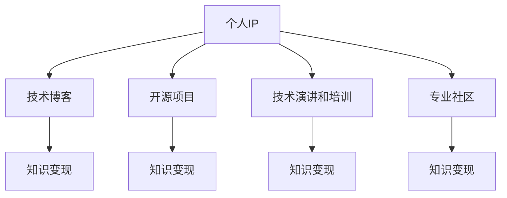

                 

# 打造个人IP：程序员的知识变现之路

## 1. 背景介绍

在当今快速变化的技术环境中，程序员不仅需要掌握最新的编程技能，还需要能够将知识进行有效地表达和传播，以实现自我增值和职业发展。打造个人IP成为程序员职业发展中的关键一环。本文将探讨如何通过知识变现的方式，提升个人品牌价值，构建有影响力的技术社区，从而实现个人职业的跨越式发展。

## 2. 核心概念与联系

### 2.1 核心概念概述

为更好地理解如何打造个人IP，本文将介绍几个关键概念及其相互关联：

- **个人IP**：指个人品牌或形象，通过技术专长、专业形象、公众影响力等方面塑造，以达到个人职业目标。
- **知识变现**：通过提供技术培训、咨询、写作、演讲等形式，将个人知识转化为经济收益的过程。
- **技术博客**：以技术话题为核心内容的博客，通过提供有价值的见解和解决方案，吸引受众并建立个人权威。
- **开源项目**：在公共平台上贡献代码，提升个人技术影响力和项目经验。
- **技术演讲和培训**：通过公开或私人的方式，分享技术知识，提升公众影响力。
- **专业社区**：在技术社区中积极参与讨论，发布原创内容，建立专业形象和社交网络。

这些概念之间相互影响，共同构成了打造个人IP的基础。

### 2.2 核心概念原理和架构的 Mermaid 流程图



这个流程图展示了个人IP的构建路径：通过技术博客、开源项目、技术演讲和培训、专业社区等多渠道获取资源，并将这些资源进行有效利用，最终实现知识变现，提升个人品牌价值。

## 3. 核心算法原理 & 具体操作步骤

### 3.1 算法原理概述

打造个人IP的本质在于持续积累和传播技术知识，提升个人在特定技术领域的影响力。这一过程可以看作是一个“知识输入-处理-输出”的闭环，可以通过以下步骤实现：

1. **知识输入**：通过阅读、学习和实践，积累技术知识。
2. **知识处理**：将知识内化，形成自己的理解和见解。
3. **知识输出**：通过博客、开源项目、演讲等方式，将知识传播给更广泛的受众。

### 3.2 算法步骤详解

#### 3.2.1 选择技术领域

选择一个你既感兴趣又具有市场需求的领域，如云计算、人工智能、网络安全等。这不仅需要考虑个人兴趣和专业知识，还要评估该领域的市场前景和竞争情况。

#### 3.2.2 确定目标受众

明确你的目标受众是谁，如初级开发者、中高级工程师、CTO等。这将决定你内容的深度和广度。

#### 3.2.3 知识输入

1. **阅读和学习**：订阅相关的技术博客、期刊、书籍，参加线上线下的技术会议和工作坊，不断积累知识。
2. **实践和项目经验**：参与实际项目，实践所学知识，积累实战经验。

#### 3.2.4 知识处理

1. **内化知识**：通过写代码、写博客、做项目，将知识转化为自己的理解和见解。
2. **形成系统化的理解**：构建技术栈、解决实际问题，形成系统化的知识体系。

#### 3.2.5 知识输出

1. **技术博客**：创建并维护一个技术博客，分享你的学习和实践心得，建立专业形象。
2. **开源项目**：参与或贡献开源项目，展示你的技术实力和项目经验。
3. **技术演讲和培训**：在技术社区、公司内部或公开场合进行技术分享，提升公众影响力。
4. **专业社区**：加入技术社区，如GitHub、Stack Overflow、知乎等，积极参与讨论，发布原创内容。

### 3.3 算法优缺点

**优点**：

- **高效积累知识**：通过多种渠道获取知识，快速提升技术水平。
- **广泛传播影响力**：利用多个平台进行知识输出，能够覆盖更多受众。
- **持续增值**：知识变现不仅包括直接的收入，还包括个人品牌和影响力的提升。

**缺点**：

- **时间和精力投入大**：需要持续学习和输出，对个人时间和精力要求较高。
- **市场竞争激烈**：技术领域竞争激烈，需要不断创新和提升。
- **质量控制难**：内容质量和准确性需要严格把控，避免误导受众。

### 3.4 算法应用领域

知识变现技术广泛应用于软件开发、数据分析、人工智能、云计算等领域。无论是初入职场的开发者，还是经验丰富的资深工程师，都可以通过知识变现提升自己的专业形象和收入水平。

## 4. 数学模型和公式 & 详细讲解 & 举例说明

### 4.1 数学模型构建

假设个人品牌价值为 $V$，影响因素包括技术知识积累 $K$、内容输出量 $C$、受众数量 $A$、互动程度 $I$ 和市场竞争 $C$。

$$ V = f(K, C, A, I, C) $$

其中 $f$ 是一个复杂函数，反映了各因素之间的相互作用关系。

### 4.2 公式推导过程

- **技术知识积累 $K$**：通过阅读、学习和实践，不断增加自己的知识储备。
- **内容输出量 $C$**：通过博客、开源项目、演讲等方式，定期输出内容，保持受众的关注。
- **受众数量 $A$**：通过多种渠道吸引和保持受众，提升影响力。
- **互动程度 $I$**：通过评论、点赞、社交媒体互动等方式，增强与受众的连接。
- **市场竞争 $C$**：评估市场竞争情况，调整策略以保持竞争力。

### 4.3 案例分析与讲解

以某知名技术博主为例，他通过在GitHub上开源大量项目，同时在Medium和知乎等平台上持续发表高质量的技术文章，建立了强大的技术影响力。通过接广告、提供付费课程和咨询服务，实现了知识变现。

## 5. 项目实践：代码实例和详细解释说明

### 5.1 开发环境搭建

1. **创建GitHub账号**：在GitHub上创建账号，设置个人项目仓库。
2. **安装Git和GitHub Desktop**：下载并安装Git和GitHub Desktop，用于版本控制和项目管理。
3. **编写技术博客**：使用Markdown和HTML技术，创建和维护技术博客。
4. **参与开源项目**：选择感兴趣的开源项目，提交代码和问题。

### 5.2 源代码详细实现

以下是一个简单的开源项目示例，用于计算斐波那契数列：

```python
def fibonacci(n):
    if n <= 1:
        return n
    else:
        return fibonacci(n-1) + fibonacci(n-2)

# 测试代码
for i in range(10):
    print(fibonacci(i))
```

### 5.3 代码解读与分析

- **代码结构**：函数定义简洁明了，代码风格符合Python规范。
- **性能优化**：使用递归实现斐波那契数列，虽然代码简洁，但时间复杂度较高，可以进一步优化为循环实现。
- **代码注释**：代码中包含必要的注释，提高代码的可读性和可维护性。

### 5.4 运行结果展示

运行上述代码，输出斐波那契数列的前10项：

```
0
1
1
2
3
5
8
13
21
34
```

## 6. 实际应用场景

### 6.1 软件开发

通过技术博客和开源项目展示编程技巧和经验，吸引开发者关注。通过提供技术咨询和定制开发服务，实现知识变现。

### 6.2 数据分析

通过数据可视化博客和开源数据分析工具，展示数据分析能力。通过提供数据分析咨询服务，获取商业价值。

### 6.3 人工智能

通过深度学习模型的项目演示和博客文章，展示技术实力。通过提供AI项目和定制解决方案，实现商业化。

### 6.4 未来应用展望

未来，随着技术的发展和市场的变化，知识变现的形式将更加多样化，如在线课程、教育平台、技术讲座等。通过不断创新和提升，个人IP将进一步扩大其影响力。

## 7. 工具和资源推荐

### 7.1 学习资源推荐

1. **《算法导论》**：深入了解算法和数据结构的基础知识。
2. **《深度学习》**：全面介绍深度学习的基本原理和应用。
3. **Coursera和Udacity**：提供高质量在线课程，覆盖多种技术领域。
4. **GitHub**：学习和展示开源项目的最佳平台。
5. **Medium和知乎**：发布高质量技术文章，扩大影响力。

### 7.2 开发工具推荐

1. **Git**：版本控制工具，支持代码协作和版本管理。
2. **GitHub Desktop**：简化GitHub的操作，提高工作效率。
3. **Visual Studio Code**：轻量级代码编辑器，支持多种编程语言。
4. **Jupyter Notebook**：交互式编程环境，适合数据科学和机器学习项目。
5. **PyCharm**：全功能IDE，支持Python开发，提供丰富的插件和工具。

### 7.3 相关论文推荐

1. **《软件开发者如何有效推广自己的个人品牌》**：探讨软件开发者如何通过技术博客和开源项目提升个人品牌。
2. **《通过开源项目建立技术影响力》**：分析开源项目对个人品牌和知识传播的影响。
3. **《技术演讲和培训的有效性》**：评估技术演讲和培训在知识传播中的作用。

## 8. 总结：未来发展趋势与挑战

### 8.1 研究成果总结

打造个人IP的知识变现之路是一个持续学习和提升的过程。通过技术博客、开源项目、技术演讲和培训、专业社区等多渠道获取资源，并将这些资源进行有效利用，最终实现知识变现。

### 8.2 未来发展趋势

1. **多渠道传播**：通过更多渠道传播技术知识和个人品牌，如视频平台、直播等。
2. **专业化和细分化**：选择更具专业化和细分化方向的技术领域，提升影响力。
3. **技术社区合作**：与技术社区进行合作，共享资源和知识，共同提升影响力。

### 8.3 面临的挑战

1. **市场竞争**：技术领域竞争激烈，需要不断创新和提升。
2. **知识更新**：技术快速变化，需要不断学习和更新知识。
3. **内容质量**：内容质量和准确性需要严格把控，避免误导受众。

### 8.4 研究展望

未来，个人IP的知识变现将更加注重技术深度和广度，通过多渠道、多形式的内容输出，提升个人品牌价值，实现持续增值。通过与技术社区、企业的合作，进一步拓展知识和影响力，为个人职业发展提供更多机会。

## 9. 附录：常见问题与解答

**Q1：如何选择合适的技术领域？**

A: 选择既感兴趣又具有市场需求的技术领域。可以通过市场调研、技术趋势分析和个人兴趣评估来选择。

**Q2：如何保持内容输出的质量？**

A: 定期学习新知识，保持技术敏锐度。同时，通过反馈和互动，不断改进和优化内容。

**Q3：如何提升受众互动程度？**

A: 通过社区互动、社交媒体营销等方式，增强与受众的连接。积极回应评论和问题，建立良好的互动氛围。

**Q4：如何评估知识变现的效果？**

A: 通过跟踪内容阅读量、粉丝增长、收入情况等指标，评估知识变现的效果。同时，可以通过反馈和问卷调查，了解受众的需求和满意度。

**Q5：如何应对市场竞争？**

A: 不断提升个人技术水平和内容质量，通过创新和差异化，保持竞争优势。同时，通过与企业、技术社区的合作，扩大影响力。

---

作者：禅与计算机程序设计艺术 / Zen and the Art of Computer Programming

