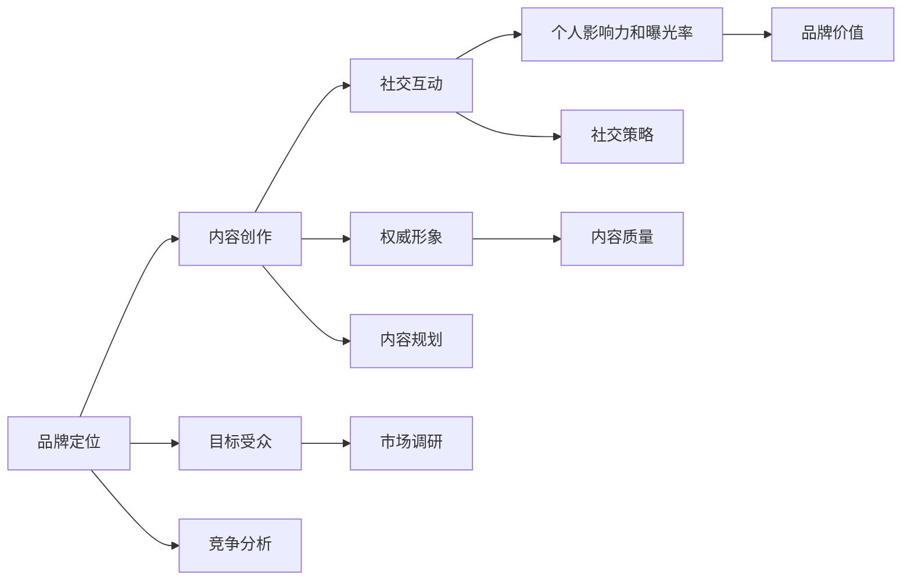

                 

# 打造个人品牌纪录片：讲述你的成长故事

> 关键词：品牌建设, 个人成长, 技术创业, 互联网思维, 影响力和领导力

## 1. 背景介绍

### 1.1 问题由来
在信息爆炸的时代，个人的品牌建设变得至关重要。无论是技术专家、创业者还是产品经理，一个强大的个人品牌都能在求职、融资、产品推广等方面带来巨大的优势。特别是在互联网领域，一个清晰、专业的个人品牌不仅能提升个人知名度，还能帮助企业在竞争中脱颖而出。

### 1.2 问题核心关键点
构建个人品牌并非易事，它需要时间和精力的投入，更需要有系统的方法和策略。本文将通过讲述一位技术专家的品牌建设历程，来探讨如何打造属于自己的个人品牌，并为读者提供一套行之有效的方法和策略。

## 2. 核心概念与联系

### 2.1 核心概念概述

个人品牌建设，本质上是一个通过自我营销、内容创作和社交互动，逐步提升个人知名度和影响力的过程。它涉及到了品牌定位、内容创作、社交媒体运营等多个环节，需要综合运用多学科知识，才能实现目标。

- **品牌定位**：确定个人在行业内的核心竞争力和独特卖点，明确目标受众。
- **内容创作**：通过高质量的技术文章、演讲、视频等形式，传递专业知识和见解，建立权威形象。
- **社交互动**：利用LinkedIn、Twitter、GitHub等平台，积极与同行互动，扩大社交网络，提升个人影响力和曝光率。

这些概念之间存在紧密的联系，共同构成了个人品牌建设的全链条。本文将详细探讨这些核心概念，并给出实践中的具体操作方法。

### 2.2 核心概念原理和架构的 Mermaid 流程图

这个流程图展示了个人品牌建设的主要环节及其内在联系：

1. 品牌定位通过调研和分析，确定目标受众，从而进行有针对性的内容创作和社交互动。
2. 内容创作通过高质量的内容输出，建立权威形象，提升个人影响力。
3. 社交互动通过扩大社交网络，进一步提升个人品牌价值。

## 3. 核心算法原理 & 具体操作步骤

### 3.1 算法原理概述

个人品牌建设并非一个纯粹的算法问题，而是一个复杂的多学科应用领域。它的成功依赖于对市场需求的理解、对自身优势的认识以及有效的内容传递。因此，本文将采用一种更加多元化的视角来探讨这个问题。

### 3.2 算法步骤详解

#### 3.2.1 确定品牌定位
品牌定位是个人品牌建设的基础。它需要通过市场调研和竞争分析，明确自己在行业内的核心竞争力和独特卖点。

1. **市场调研**：使用问卷调查、社交媒体分析和行业报告等工具，了解目标受众的需求和偏好。
2. **竞争分析**：通过SWOT分析，评估自己在技术领域内的优势、劣势、机会和威胁。
3. **确定目标受众**：根据调研结果，明确个人品牌的目标受众，如IT公司技术管理者、创业者、技术爱好者等。

#### 3.2.2 内容创作
内容创作是个人品牌建设的核心环节。它需要通过高质量的技术文章、演讲、视频等形式，传递专业知识和见解，建立权威形象。

1. **内容规划**：根据品牌定位和目标受众，规划内容主题和形式。例如，针对技术管理者可以撰写关于技术管理、团队建设的文章；针对技术爱好者可以制作技术教程和代码演示视频。
2. **内容生产**：选择适合自己的内容创作方式，如撰写博客、录制视频、开设课程等。保持高频率和高质量的输出，建立稳定的内容生态。
3. **内容推广**：利用社交媒体、电子邮件和合作伙伴等多种渠道，推广自己的内容，扩大曝光率。

#### 3.2.3 社交互动
社交互动是个人品牌建设的重要补充。它通过扩大社交网络，提升个人影响力和曝光率，进一步巩固品牌形象。

1. **选择合适的平台**：根据目标受众和内容形式，选择适合的社交媒体平台，如LinkedIn、Twitter、GitHub等。
2. **活跃参与互动**：积极参与讨论、回答问题、发布最新动态，保持与受众的互动。
3. **建立专业圈子**：加入行业协会、技术社区和专业群组，与同行建立联系，扩大社交网络。

### 3.3 算法优缺点

#### 3.3.1 优点
- **灵活性高**：个人品牌建设可以根据自身特点和市场需求进行调整，具有较高的灵活性。
- **影响力大**：通过高质量的内容输出和有效的社交互动，可以迅速提升个人知名度和影响力。
- **可持续性**：个人品牌建设是一个长期的过程，通过不断的优化和调整，可以持续提升自己的市场地位。

#### 3.3.2 缺点
- **时间和精力投入大**：品牌建设需要长时间的积累和努力，对时间和精力要求较高。
- **需要多学科知识**：个人品牌建设涉及品牌定位、内容创作、社交互动等多个环节，需要综合运用多学科知识。
- **市场风险**：市场变化快速，个人品牌需要不断适应市场变化，风险较高。

### 3.4 算法应用领域

个人品牌建设不仅适用于技术专家和创业者，对产品经理、市场经理等职位同样具有重要意义。通过建立自己的品牌形象，提升个人影响力，可以在职场上获得更多机会和资源，为企业的成功奠定坚实基础。

## 4. 数学模型和公式 & 详细讲解 & 举例说明

虽然个人品牌建设主要依赖于实践经验，但在某些环节仍可以通过数学模型进行辅助分析。例如，在市场调研中，可以通过统计分析方法，评估目标受众的需求和偏好。在内容创作中，可以通过机器学习模型，预测热门话题和趋势。

### 4.1 数学模型构建

#### 4.1.1 市场调研模型
假设目标受众的需求和偏好可以用以下特征表示：

- $x_1$：技术背景
- $x_2$：职业阶段
- $x_3$：兴趣领域

通过对目标受众进行问卷调查，得到以下数据：

- $N$：总样本数
- $n_i$：特征$x_i$取值为$i$的样本数
- $p_i$：特征$x_i$取值为$i$的概率

可以构建一个简单的概率模型，表示受众的需求和偏好：

$$
p(x_i = i) = \frac{n_i}{N}
$$

#### 4.1.2 内容质量评估模型
假设内容质量可以用以下几个指标来衡量：

- $q_1$：内容的专业性
- $q_2$：内容的实用性
- $q_3$：内容的创新性

通过专家评估和用户反馈，可以得到以下数据：

- $Q_i$：内容质量指标$q_i$的评估得分
- $n_i$：内容质量指标$q_i$的样本数

可以构建一个简单的评估模型，表示内容的质量：

$$
Q_i = \frac{\sum_{j=1}^N w_i x_{ij}}{\sum_{j=1}^N w_i}
$$

其中，$w_i$为每个指标的权重，可以根据实际需要进行调整。

### 4.2 公式推导过程

#### 4.2.1 市场调研模型推导
根据市场调研数据，可以计算出每个特征的概率分布：

$$
p(x_i = i) = \frac{n_i}{N}
$$

进而得到每个特征的概率密度函数：

$$
f(x_i) = p(x_i = i) = \frac{n_i}{N}
$$

#### 4.2.2 内容质量评估模型推导
根据内容质量评估数据，可以计算出每个指标的平均得分：

$$
Q_i = \frac{\sum_{j=1}^N w_i x_{ij}}{\sum_{j=1}^N w_i}
$$

通过逐步优化权重$w_i$，可以更好地反映内容的实际质量。

### 4.3 案例分析与讲解

以技术专家李明为例，通过对其个人品牌建设的分析，说明如何构建个人品牌。

1. **品牌定位**：李明通过调研发现，目标受众对技术管理、云计算和大数据等领域较为感兴趣。因此，他决定将品牌定位为“技术管理专家”，专注于技术管理、团队建设等方面的内容输出。
2. **内容创作**：他选择了撰写博客和录制视频两种形式，保持每周至少一篇博客和两次视频更新。通过不断优化内容质量，逐步建立了自己的权威形象。
3. **社交互动**：李明在LinkedIn和Twitter上积极参与讨论，回答问题，发布最新动态。通过不断扩大社交网络，提升了自己的知名度和影响力。

## 5. 项目实践：代码实例和详细解释说明

### 5.1 开发环境搭建

在开始个人品牌建设之前，需要先搭建好开发环境。以下是一些常用的开发工具和平台：

1. **代码托管平台**：GitHub、GitLab、Bitbucket等平台，方便代码管理和版本控制。
2. **博客平台**：Medium、CSDN、博客园等平台，用于发布技术文章。
3. **视频录制和编辑工具**：Adobe Premiere、Final Cut Pro、OBS Studio等工具，方便视频录制和编辑。
4. **社交媒体管理工具**：Buffer、Hootsuite等工具，方便多平台内容发布和互动管理。

### 5.2 源代码详细实现

#### 5.2.1 博客文章发布
以Medium平台为例，创建一个博客账户，并撰写一篇技术文章。

1. 注册Medium账户，填写个人资料和兴趣标签。
2. 登录Medium，撰写博客文章，选择“技术”类别。
3. 编辑文章内容，添加必要的代码和图片。
4. 预览文章，检查格式和内容。
5. 发布文章，并分享至LinkedIn、Twitter等平台。

#### 5.2.2 视频录制和编辑
以Adobe Premiere为例，录制并编辑一个技术教程视频。

1. 准备录制设备，确保网络连接和音频质量。
2. 使用Adobe Premiere进行视频录制，添加必要的特效和字幕。
3. 导出视频，并上传到YouTube或Bilibili等平台。
4. 在社交媒体上发布视频，并与受众互动。

#### 5.2.3 社交媒体互动
以LinkedIn为例，进行社交媒体互动。

1. 登录LinkedIn，关注感兴趣的技术群组和话题。
2. 积极参与讨论，回答问题，发布最新动态。
3. 与同行建立联系，加入专业协会和社区。

### 5.3 代码解读与分析

通过上述代码实例，可以看出，个人品牌建设并非一项简单的技术任务，而是一个需要多学科知识和实际操作的综合过程。其中，博客文章发布、视频录制和编辑、社交媒体互动等环节，都需要对工具和平台有深入的了解和熟练的使用。

## 6. 实际应用场景

### 6.1 技术专家
对于技术专家，个人品牌建设是一个展示自己技术实力和行业见解的重要渠道。通过高质量的内容输出和有效的社交互动，可以迅速提升自己在行业内的知名度和影响力。例如，可以撰写关于最新技术趋势、行业动态的文章，发布技术教程和代码示例，参与技术社区和话题讨论，建立自己的技术权威形象。

### 6.2 创业者
对于创业者，个人品牌建设不仅可以帮助自己吸引投资和客户，还可以提升企业的品牌价值。例如，通过撰写创业经验、产品设计和市场分析等文章，分享创业过程中的心得和教训，展示自己的行业见解和市场判断能力，吸引志同道合的投资者和合作伙伴。

### 6.3 产品经理
对于产品经理，个人品牌建设可以提升自己在团队和公司的影响力。例如，通过撰写关于产品设计、用户体验和市场策略的文章，分享自己的产品思路和市场分析，展示自己的产品思维和市场敏锐度，赢得团队的信任和支持。

## 7. 工具和资源推荐

### 7.1 学习资源推荐

1. **技术博客**：如CSDN、博客园、Medium等平台，可以阅读大量的技术文章，学习他人的成功经验。
2. **视频平台**：如YouTube、Bilibili等平台，可以观看技术讲座和演示视频，学习实战技巧。
3. **在线课程**：如Coursera、edX、Udacity等平台，可以系统学习技术知识和商业知识，提升自己的综合能力。
4. **社交媒体管理工具**：如Buffer、Hootsuite等工具，可以帮助高效管理多平台内容发布和互动。

### 7.2 开发工具推荐

1. **代码托管平台**：如GitHub、GitLab、Bitbucket等平台，方便代码管理和版本控制。
2. **博客平台**：如Medium、CSDN、博客园等平台，用于发布技术文章。
3. **视频录制和编辑工具**：如Adobe Premiere、Final Cut Pro、OBS Studio等工具，方便视频录制和编辑。
4. **社交媒体管理工具**：如Buffer、Hootsuite等工具，方便多平台内容发布和互动。

### 7.3 相关论文推荐

1. **品牌建设**：《品牌管理：理论和实践》（Brand Management: Theory and Practice）一书，介绍了品牌建设的基本原理和策略。
2. **内容创作**：《内容营销策略》（Content Marketing Strategy）一书，介绍了内容创作和内容运营的基本方法和技巧。
3. **社交媒体运营**：《社交媒体营销》（Social Media Marketing）一书，介绍了社交媒体营销的原理和实践。

## 8. 总结：未来发展趋势与挑战

### 8.1 未来发展趋势

个人品牌建设将迎来新的发展趋势，包括以下几个方面：

1. **内容形式多样化**：随着技术的进步，个人品牌建设的内容形式将更加多样化，包括视频、播客、直播等多种形式。
2. **社交网络平台多元化**：随着社交网络平台的多样化，个人品牌建设将不再局限于某一平台，而是可以在多个平台上进行跨平台互动。
3. **个性化推荐系统**：利用个性化推荐系统，能够更好地匹配受众的兴趣和需求，提升个人品牌的影响力。

### 8.2 面临的挑战

在个人品牌建设的过程中，仍面临诸多挑战：

1. **时间和精力的投入**：个人品牌建设需要长期的投入，如何在繁忙的工作中保持稳定的输出，是一个挑战。
2. **多学科知识的应用**：个人品牌建设涉及品牌定位、内容创作、社交互动等多个环节，需要综合运用多学科知识。
3. **市场变化**：市场变化快速，个人品牌需要不断适应市场变化，风险较高。

### 8.3 研究展望

未来的研究应关注以下几个方向：

1. **个性化推荐系统**：研究如何利用个性化推荐系统，提升个人品牌的影响力。
2. **内容创作自动化**：探索内容创作的自动化技术，提升内容创作的效率和质量。
3. **跨平台互动**：研究跨平台互动的优化方法，提升互动的效果和频率。

## 9. 附录：常见问题与解答

**Q1：如何确定品牌定位？**

A: 通过市场调研和竞争分析，明确自己的核心竞争力和独特卖点，确定目标受众。

**Q2：如何选择合适的平台？**

A: 根据目标受众和内容形式，选择适合的社交媒体平台，如LinkedIn、Twitter、GitHub等。

**Q3：如何进行内容创作？**

A: 制定内容规划，选择适合自己的内容创作方式，如撰写博客、录制视频、开设课程等。

**Q4：如何扩大社交网络？**

A: 积极参与讨论、回答问题、发布最新动态，加入专业协会和社区，扩大社交网络。

**Q5：如何提升品牌影响力？**

A: 通过高质量的内容输出和有效的社交互动，逐步提升个人知名度和影响力。

---

作者：禅与计算机程序设计艺术 / Zen and the Art of Computer Programming

