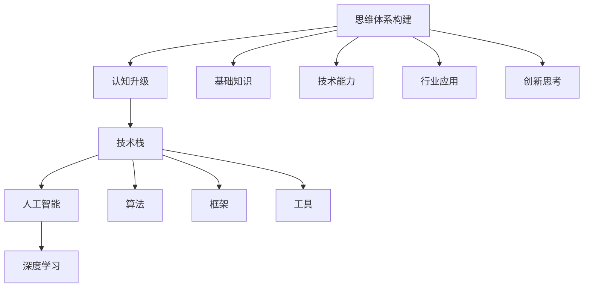

                 

# 打造个人思维体系的意义

> 关键词：思维体系构建,认知升级,技术栈,人工智能,深度学习

## 1. 背景介绍

### 1.1 问题由来
在信息技术高速发展的今天，人工智能、深度学习、自然语言处理等前沿技术正深刻改变着人类生活的方方面面。AI与深度学习已经从实验室走向实际应用，并渗透到医疗、教育、金融、制造、交通等多个行业，带来了前所未有的效率提升和创新变革。然而，随着技术的复杂性不断提高，跨学科知识的融合愈发重要。

### 1.2 问题核心关键点
要在大数据和复杂场景下取得成功，不仅要掌握核心技术，还需要构建一个完整的个人思维体系，以系统地理解和应用所学知识。这不仅包括基础的理论知识，更包括技术能力、逻辑思维和创新能力的全面提升。

### 1.3 问题研究意义
构建个人思维体系的意义主要体现在以下三个方面：

1. **提升能力：** 系统学习AI、深度学习等前沿技术，能够显著提升个人技术能力和行业竞争力。
2. **促进创新：** 思维体系的构建，有助于产生更多跨领域的新想法和创新思路。
3. **加速成长：** 形成科学合理的思维方式，能够更高效地积累和应用新知识，加快职业成长速度。

## 2. 核心概念与联系

### 2.1 核心概念概述

构建个人思维体系，需要明确几个关键概念：

- **思维体系：** 一个结构化的知识框架，涵盖基础知识、技术能力、行业应用和创新思考。
- **认知升级：** 通过不断学习新知识，更新旧观念，不断优化自己的知识结构和思维模式。
- **技术栈：** 技术领域的知识体系和技能树，涵盖基础库、框架、算法、工具等。
- **人工智能：** 以模拟人类智能为目标，通过学习、推理、自然语言处理等技术实现的计算模型。
- **深度学习：** 通过多层神经网络进行模拟计算，模仿人脑处理复杂任务的能力。

### 2.2 核心概念原理和架构的 Mermaid 流程图



该流程图展示了思维体系构建与认知升级、技术栈、人工智能、深度学习之间的联系。其中，基础知识、技术能力、行业应用和创新思考是思维体系的重要组成部分。

## 3. 核心算法原理 & 具体操作步骤

### 3.1 算法原理概述

构建个人思维体系，需要通过系统的学习与实践，不断更新知识体系和思维模式。核心算法原理主要包括：

- **自监督学习：** 利用大量未标注数据进行学习，以提升对数据分布的理解和预测能力。
- **迁移学习：** 将一个领域学到的知识迁移到另一个领域，以减少新任务的学习负担。
- **强化学习：** 通过奖励机制，训练模型在复杂环境中做出最优决策。
- **逻辑回归：** 二分类任务的经典模型，用于处理结构化数据的预测问题。
- **卷积神经网络（CNN）：** 处理图像数据的强大工具，通过卷积操作提取特征。
- **循环神经网络（RNN）：** 处理序列数据的经典模型，通过记忆单元捕捉时间依赖关系。
- **Transformer模型：** 深度学习中最先进的模型之一，用于处理序列数据，具有较好的并行性和可扩展性。

### 3.2 算法步骤详解

构建思维体系的具体操作步骤包括：

1. **确定学习目标：** 根据职业发展方向，确定需要学习的内容和技术栈。
2. **系统学习理论知识：** 通过阅读书籍、参加课程、参加研讨会等方式，学习相关领域的理论知识。
3. **实践掌握技术能力：** 通过编程实现、项目实践等方式，掌握各类技术和算法。
4. **应用行业场景：** 将所学知识应用于实际项目中，积累经验。
5. **持续创新思考：** 在工作中不断思考，寻找改进点和创新点，形成独特的思维模式。

### 3.3 算法优缺点

- **优点：**
  - **提升全面能力：** 系统学习各个环节的知识，有助于形成全面的技术能力和思维方式。
  - **加速学习进程：** 有系统的学习框架，有助于提升学习效率和深度。
  - **促进创新思维：** 持续的创新思考，有助于产生新的思维模式和解决方案。

- **缺点：**
  - **学习曲线陡峭：** 需要覆盖多个领域和环节，初学者的学习门槛较高。
  - **时间成本较高：** 需要大量时间进行系统的学习和实践，短期内难以见效。
  - **个性化不足：** 系统学习可能过于通用，难以适应个人的独特需求和兴趣点。

### 3.4 算法应用领域

构建个人思维体系的应用领域非常广泛，涵盖以下几个方面：

- **基础研究：** 适用于学术界研究人员，提升论文发表和研究能力。
- **产业开发：** 适用于企业技术开发者，提升产品开发和创新能力。
- **教育培训：** 适用于教育机构和培训机构，提升学生和学员的技术水平和创新能力。
- **创业创新：** 适用于创业者，提升创业项目的技术实现和市场竞争力。

## 4. 数学模型和公式 & 详细讲解 & 举例说明

### 4.1 数学模型构建

构建思维体系的数学模型可以表示为：

$$
M_{\text{体系}} = M_{\text{基础}} + M_{\text{技术}} + M_{\text{行业}} + M_{\text{创新}}
$$

其中：

- $M_{\text{基础}}$ 表示基础理论知识，如线性代数、概率论、统计学等。
- $M_{\text{技术}}$ 表示技术能力和算法知识，如数据结构、机器学习、深度学习等。
- $M_{\text{行业}}$ 表示行业应用和领域知识，如金融、医疗、教育等。
- $M_{\text{创新}}$ 表示创新思考和跨领域知识，如人工智能伦理、数据隐私保护等。

### 4.2 公式推导过程

以深度学习中的卷积神经网络（CNN）为例，推导其基本公式。

假设输入为二维矩阵 $x_{i,j}$，卷积核为 $w_{m,n}$，输出为 $y_{i,j}$，则卷积操作可以表示为：

$$
y_{i,j} = \sum_{m=-r}^{r} \sum_{n=-r}^{r} w_{m,n} x_{i+m,j+n}
$$

其中，$r$ 表示卷积核的大小。

### 4.3 案例分析与讲解

以图像识别任务为例，展示如何构建深度学习模型并进行系统训练。

1. **数据准备：** 收集并预处理图像数据集，进行分批和标准化处理。
2. **模型构建：** 使用Keras或TensorFlow等框架构建卷积神经网络模型，设置卷积层、池化层、全连接层等。
3. **模型训练：** 设置优化器、损失函数、评估指标，进行模型训练和验证。
4. **模型优化：** 根据训练结果调整模型结构、超参数，进行模型微调。
5. **模型评估：** 在测试集上评估模型性能，进行模型优化。

## 5. 项目实践：代码实例和详细解释说明

### 5.1 开发环境搭建

1. **安装Anaconda：** 从官网下载并安装Anaconda，用于创建独立的Python环境。
2. **创建并激活虚拟环境：** 
   ```bash
   conda create -n myenv python=3.8
   conda activate myenv
   ```
3. **安装Python库和依赖：** 
   ```bash
   pip install tensorflow numpy scikit-learn matplotlib
   ```

### 5.2 源代码详细实现

```python
import tensorflow as tf
from tensorflow.keras import layers

# 构建卷积神经网络模型
model = tf.keras.Sequential([
    layers.Conv2D(32, (3, 3), activation='relu', input_shape=(28, 28, 1)),
    layers.MaxPooling2D((2, 2)),
    layers.Flatten(),
    layers.Dense(10, activation='softmax')
])

# 编译模型
model.compile(optimizer=tf.keras.optimizers.Adam(),
              loss=tf.keras.losses.SparseCategoricalCrossentropy(),
              metrics=['accuracy'])

# 加载数据集
(x_train, y_train), (x_test, y_test) = tf.keras.datasets.mnist.load_data()

# 数据预处理
x_train = x_train.reshape(-1, 28, 28, 1) / 255.0
x_test = x_test.reshape(-1, 28, 28, 1) / 255.0

# 训练模型
model.fit(x_train, y_train, epochs=10, batch_size=64, validation_data=(x_test, y_test))

# 评估模型
model.evaluate(x_test, y_test)
```

### 5.3 代码解读与分析

**构建卷积神经网络模型：**
- 使用`tf.keras.Sequential`创建序列模型。
- 添加卷积层、池化层和全连接层，其中卷积核大小为$(3,3)$，激活函数为ReLU，输入形状为$(28,28,1)$。

**编译模型：**
- 使用Adam优化器。
- 设置损失函数为交叉熵损失。
- 设置评估指标为准确率。

**加载数据集：**
- 使用`tf.keras.datasets.mnist.load_data()`加载手写数字数据集。

**数据预处理：**
- 将数据形状从$(28,28)$变为$(28,28,1)$。
- 将像素值标准化到[0,1]区间。

**训练模型：**
- 使用`model.fit()`进行模型训练。
- 设置训练轮数为10，批次大小为64。

**评估模型：**
- 使用`model.evaluate()`进行模型评估。

## 6. 实际应用场景

### 6.1 实际应用场景

构建个人思维体系在实际应用场景中，有着重要的应用价值：

1. **智能医疗：** 通过深度学习技术，构建医疗影像分析、疾病预测等智能医疗系统，提升诊断和治疗效果。
2. **金融科技：** 利用机器学习算法，构建信用评分、风险评估等金融科技系统，提升金融决策的准确性。
3. **教育培训：** 开发个性化学习平台，通过数据分析和推荐算法，提升教育培训效果和学生学习体验。
4. **自动驾驶：** 利用计算机视觉和深度学习技术，构建自动驾驶系统，提升行车安全和效率。
5. **智能客服：** 使用自然语言处理技术，构建智能客服系统，提升客户服务体验。

### 6.4 未来应用展望

随着深度学习和人工智能技术的发展，未来个人思维体系的构建将更加系统和深入。未来的趋势包括：

1. **多模态融合：** 将视觉、语音、文本等多种模态信息进行融合，构建更加全面的思维体系。
2. **跨领域应用：** 将人工智能技术应用于更多行业，如医疗、教育、金融、制造等。
3. **自动化学习：** 利用自动化学习算法，提升自我学习效率和深度。
4. **协同合作：** 利用协作平台和开源社区，共享知识资源和项目经验。

## 7. 工具和资源推荐

### 7.1 学习资源推荐

- **《深度学习》课程：** 斯坦福大学吴恩达教授的深度学习课程，全面介绍深度学习的基本概念和算法。
- **《TensorFlow实战》书籍：** 详细讲解TensorFlow的实现原理和应用场景，是深度学习领域的重要参考资料。
- **Kaggle竞赛：** 参与Kaggle数据科学竞赛，锻炼数据处理和模型优化能力。
- **GitHub开源项目：** 参与开源项目，学习和分享代码实现和模型优化经验。

### 7.2 开发工具推荐

- **Anaconda：** 用于创建和管理虚拟环境，方便不同项目的库管理。
- **Jupyter Notebook：** 在线代码编辑器，支持Python、R等语言，方便开发和协作。
- **Git：** 版本控制工具，方便代码的协作和项目管理。

### 7.3 相关论文推荐

- **《卷积神经网络：视觉识别中的应用》：** 详细讲解卷积神经网络的基本原理和实现。
- **《深度学习：基础与实践》：** 介绍深度学习的基本概念和应用场景，适合初学者入门。
- **《自然语言处理综论》：** 详细介绍自然语言处理的基本概念和应用场景，涵盖词法、语法、语义等多个方面。

## 8. 总结：未来发展趋势与挑战

### 8.1 研究成果总结

构建个人思维体系的研究成果主要包括：

1. **基础知识：** 系统掌握数学、统计、算法等基础知识。
2. **技术能力：** 掌握各类算法和框架，如深度学习、机器学习、自然语言处理等。
3. **行业应用：** 掌握特定领域的应用场景和技术，如医疗、金融、教育等。
4. **创新思考：** 培养跨领域的创新思维和解决问题的能力。

### 8.2 未来发展趋势

未来的发展趋势主要包括以下几个方面：

1. **技术融合：** 人工智能、深度学习、自然语言处理等技术融合，形成更全面的知识体系。
2. **跨领域应用：** 技术应用到更多领域，提升各个行业的工作效率和决策能力。
3. **自动化学习：** 利用自动化学习算法，提升自我学习和知识积累效率。
4. **智能化管理：** 利用AI技术，提升管理效率和决策水平。

### 8.3 面临的挑战

构建个人思维体系面临的挑战主要包括：

1. **技术门槛高：** 需要掌握多个领域的知识和技术，初学者的门槛较高。
2. **时间和精力投入大：** 系统学习需要大量时间和精力，短期内难以见效。
3. **个性化需求不足：** 通用的学习框架难以满足个性化需求和兴趣点。

### 8.4 研究展望

未来研究展望主要包括以下几个方面：

1. **个性化学习：** 针对个性化需求，开发更加灵活的学习框架和工具。
2. **自动化学习：** 利用自动化学习算法，提升自我学习和知识积累效率。
3. **跨领域应用：** 将人工智能技术应用于更多领域，提升各个行业的工作效率和决策能力。
4. **智能化管理：** 利用AI技术，提升管理效率和决策水平。

## 9. 附录：常见问题与解答

**Q1: 如何选择合适的学习资源？**

A: 选择合适的学习资源需要考虑以下几个因素：

- **质量与可信度：** 选择权威的书籍、论文、课程等，确保知识来源的可靠性。
- **适用性与适用性：** 选择适合自己的学习方式，如视频、文章、实践项目等。
- **更新性与时效性：** 选择最新和最前沿的学习资料，确保学习的知识具有时效性。

**Q2: 如何高效地掌握技术栈？**

A: 掌握技术栈需要以下几个步骤：

- **系统学习：** 从基础到高级，系统学习各个技术点。
- **实践应用：** 通过实际项目和代码实现，加深理解和记忆。
- **持续学习：** 定期更新和补充知识，保持技术栈的前沿性。

**Q3: 如何克服学习过程中的困难？**

A: 克服学习困难需要以下几个步骤：

- **明确目标：** 设定清晰的学习目标，明确学习的方向和重点。
- **分步学习：** 将学习内容分解成小块，逐步学习和理解。
- **交流合作：** 参与在线社区和论坛，与他人交流和合作，互相帮助解决问题。

---

作者：禅与计算机程序设计艺术 / Zen and the Art of Computer Programming

