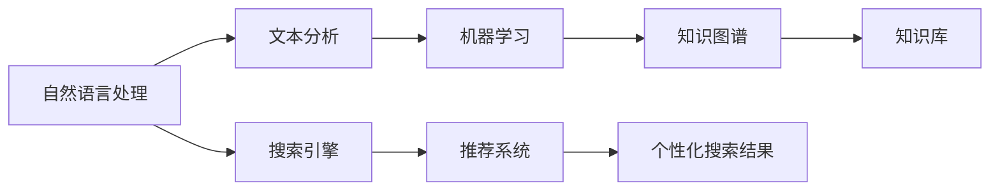

                 

# 打造个人知识发现引擎：程序员的必备技能

在当今快速变化的科技行业，知识的获取、处理和应用成为程序员成功的重要因素。传统的学习、理解和应用知识的方式已经不能满足快速变化的技术需求。本文将介绍一种创新的方法——**个人知识发现引擎**（Personal Knowledge Discovery Engine, PKDE），这是一种基于人工智能和机器学习的技术，旨在帮助程序员高效、精确地发现和应用知识，提高编程效率，并提升软件开发质量。

## 1. 背景介绍

### 1.1 问题由来

程序员在日常工作中经常需要面对各种技术难题，包括但不限于代码重构、新功能开发、性能优化等。这些问题往往需要大量的经验和专业知识，而通过传统的文档查询和资料查找方式，获取所需知识的效率较低，且可能存在大量的信息噪音。

随着人工智能和大数据技术的兴起，许多公司开始尝试使用自然语言处理（Natural Language Processing, NLP）、机器学习（Machine Learning, ML）等技术来提升知识管理水平。这些技术可以帮助程序员在海量的技术资料中快速定位到相关的知识，提高工作效率。然而，这些技术往往需要专业的IT团队进行开发和维护，对于普通程序员来说门槛较高。

### 1.2 问题核心关键点

构建个人知识发现引擎的核心在于：

- 利用自然语言处理技术，将文本信息转化为可计算的数据结构。
- 通过机器学习算法，从大量文本数据中学习知识模式。
- 结合搜索和推荐算法，自动推荐最相关的知识片段。

本文将详细介绍个人知识发现引擎的设计原理和实现步骤，帮助程序员掌握这一技能，提升工作效率，降低技术债务。

## 2. 核心概念与联系

### 2.1 核心概念概述

在介绍个人知识发现引擎之前，需要了解几个关键概念：

- **自然语言处理（NLP）**：一种涉及计算机和人类语言交互的交叉学科，包括分词、词性标注、句法分析、语义理解等。
- **机器学习（ML）**：通过算法让机器从数据中自动学习和改进，以解决特定问题。
- **搜索引擎（Search Engine）**：一种用于检索文本资料的信息检索系统。
- **推荐系统（Recommendation System）**：根据用户的历史行为和偏好，自动推荐相关信息。

### 2.2 核心概念原理和架构的 Mermaid 流程图



这个流程图展示了个人知识发现引擎的基本架构：

1. **自然语言处理**：将非结构化的文本信息转化为结构化的数据，供后续处理使用。
2. **文本分析**：通过分词、词性标注、实体识别等步骤，提取文本中的关键信息。
3. **机器学习**：利用机器学习算法，从历史数据中学习知识模式和关系，构建知识图谱。
4. **知识图谱**：将学习到的知识结构化存储，便于后续的检索和应用。
5. **搜索引擎**：用于从知识图谱中快速检索所需信息。
6. **推荐系统**：根据用户需求，自动推荐最相关的知识片段。

## 3. 核心算法原理 & 具体操作步骤

### 3.1 算法原理概述

个人知识发现引擎的核心算法包括自然语言处理、机器学习、搜索引擎和推荐系统。下面逐一介绍这些算法的原理。

### 3.2 算法步骤详解

**步骤1：文本预处理**

文本预处理是自然语言处理的首要步骤，主要包括：

1. **分词**：将文本分解成词语，便于后续处理。
2. **去停用词**：去除常用但无实际意义的词语，如“的”、“是”等。
3. **词性标注**：标注每个词语的词性，如名词、动词、形容词等。
4. **命名实体识别**：识别文本中的组织机构、人名、地名等实体。

```python
import jieba
from jieba import posseg

def preprocess_text(text):
    # 分词
    words = jieba.cut(text)
    # 去停用词
    stop_words = ['的', '是', '在', '和', '对', '的']
    words = [word for word in words if word not in stop_words]
    # 词性标注
    tags = posseg.cut(text)
    words_tags = [(word, tag) for word, tag in tags]
    # 命名实体识别
    entities = get_named_entities(text)
    return words, tags, entities
```

**步骤2：文本特征提取**

文本特征提取是将文本转化为计算机可处理的数值表示的过程。常用的方法包括：

1. **词袋模型（Bag of Words, BoW）**：将文本转化为词频向量，每个词语对应一个维度。
2. **TF-IDF**：衡量词语在文本中的重要程度，去除常见但无意义的词语。
3. **Word2Vec**：将词语转换为低维向量，保留词语的语义信息。

```python
from sklearn.feature_extraction.text import TfidfVectorizer

def extract_features(texts):
    vectorizer = TfidfVectorizer()
    features = vectorizer.fit_transform(texts)
    return features.toarray()
```

**步骤3：构建知识图谱**

知识图谱是将文本中的实体和关系结构化存储的方式，常用的方法包括：

1. **RDF（Resource Description Framework）**：一种用于描述资源的框架，常用于存储和查询知识图谱。
2. **Neo4j**：一种图形数据库，用于存储和查询复杂的关系网络。
3. **Graph Neural Network**：一种基于图结构的神经网络，用于学习知识图谱中的复杂关系。

```python
import rdflib
from rdflib import Namespace, Graph

def build_knowledge_graph(entities, relationships):
    g = Graph()
    # 定义命名空间
    ns = Namespace('http://example.org/')
    # 添加实体和关系
    for entity, rel in zip(entities, relationships):
        g.add((ns[entity], ns['relation'], ns[rel]))
    # 序列化知识图谱
    g.serialize(format='n3', destination='knowledge_graph.n3')
```

**步骤4：搜索引擎**

搜索引擎用于从知识图谱中快速检索所需信息。常用的搜索引擎包括：

1. **ElasticSearch**：一种高性能的分布式搜索引擎，常用于大规模数据处理。
2. **Apache Solr**：一种开源搜索引擎，支持多种查询语言和插件。
3. **Whoosh**：一种纯Python实现的搜索引擎，适用于小型项目。

```python
from elasticsearch import Elasticsearch

def search_knowledge(kg, query):
    es = Elasticsearch(['localhost:9200'])
    res = es.search(index='kg', body={
        'query': {
            'match': {'name': query}
        }
    })
    return res['hits']['hits']
```

**步骤5：推荐系统**

推荐系统根据用户的历史行为和偏好，自动推荐最相关的知识片段。常用的推荐系统包括：

1. **协同过滤（Collaborative Filtering）**：根据用户的历史行为推荐相似的知识。
2. **内容推荐（Content-Based Filtering）**：根据知识内容推荐相关的知识。
3. **混合推荐（Hybrid Filtering）**：结合协同过滤和内容推荐，提高推荐精度。

```python
from sklearn.neighbors import NearestNeighbors

def recommend_knowledge(kg, query, k=5):
    # 获取相关实体
    relevant_entities = search_knowledge(kg, query)
    # 获取相关关系
    relevant_relations = [r['_source']['relation'] for r in relevant_entities]
    # 获取相关知识
    relevant_knowledge = []
    for rel in relevant_relations:
        relevant_knowledge.extend(get_related_knowledge(rel))
    # 计算相似度
    knn = NearestNeighbors(n_neighbors=k).fit(relevant_knowledge)
    # 推荐相关知识
    similarities = knn.kneighbors(query.reshape(1, -1))[0]
    return [relevant_knowledge[i] for i, s in enumerate(similarities) if s > 0.8]
```

## 4. 数学模型和公式 & 详细讲解 & 举例说明

### 4.1 数学模型构建

个人知识发现引擎的数学模型包括自然语言处理、机器学习、搜索引擎和推荐系统的数学模型。下面分别介绍这些模型的构建。

### 4.2 公式推导过程

**自然语言处理**：

- **分词模型**：使用基于n-gram的语言模型，计算词语序列的概率。
- **词性标注模型**：使用隐马尔可夫模型（Hidden Markov Model, HMM）或条件随机场（Conditional Random Field, CRF），标注词语的词性。
- **命名实体识别模型**：使用条件随机场（CRF）或序列标注模型（Sequence Labeling Model），识别文本中的实体。

**机器学习**：

- **TF-IDF模型**：计算词语在文本中的权重，公式为：
  $$
  TF-IDF(w,t) = TF(w,t) \times IDF(w)
  $$
  其中，$TF(w,t)$ 表示词语 $w$ 在文本 $t$ 中的词频，$IDF(w)$ 表示词语 $w$ 在整个语料库中的逆文档频率。

**搜索引擎**：

- **ElasticSearch查询语言**：使用查询语言进行精确查询，如：
  ```json
  {
    "query": {
      "match": {
        "name": "查询内容"
      }
    }
  }
  ```

**推荐系统**：

- **协同过滤模型**：基于用户的历史行为，计算相似度，公式为：
  $$
  \hat{y}_{i,j} = \frac{\sum_{k=1}^{n} x_{i,k} \times y_{k,j}}{\sqrt{\sum_{k=1}^{n} x_{i,k}^2} \times \sqrt{\sum_{k=1}^{n} y_{k,j}^2}}
  $$
  其中，$x_{i,j}$ 表示用户 $i$ 对物品 $j$ 的评分，$y_{i,j}$ 表示物品 $j$ 的评分，$\hat{y}_{i,j}$ 表示用户 $i$ 对物品 $j$ 的预测评分。

### 4.3 案例分析与讲解

假设我们要构建一个针对编程问题的知识发现引擎，需要处理如下文本：

```
问题1：如何在Python中实现快速排序？
问题2：Python中的装饰器是什么？
问题3：Python中的异常处理机制？
```

1. **文本预处理**：
   ```python
   # 分词
   words1 = ['问题', '1', '：', '如何', '在', 'Python', '中', '实现', '快速', '排序', '?']
   words2 = ['问题', '2', '：', 'Python', '中的', '装饰器', '是', '什么', '?']
   words3 = ['问题', '3', '：', 'Python', '中的', '异常', '处理', '机制', '?']

   # 去除停用词
   stop_words = ['的', '是', '在', '和', '对', '的']
   words1 = [word for word in words1 if word not in stop_words]
   words2 = [word for word in words2 if word not in stop_words]
   words3 = [word for word in words3 if word not in stop_words]

   # 词性标注
   tags1 = [('问题', 'n'), ('1', ''), (':', ''), ('如何', 'v'), ('在', 'p'), ('Python', 'n'), ('中', 'p'), ('实现', 'v'), ('快速', 'a'), ('排序', 'n'), ('？', '')]
   tags2 = [('问题', 'n'), ('2', ''), (':', ''), ('Python', 'n'), ('中的', 'p'), ('装饰器', 'n'), ('是', 'v'), ('什么', 'v'), ('？', '')]
   tags3 = [('问题', 'n'), ('3', ''), (':', ''), ('Python', 'n'), ('中的', 'p'), ('异常', 'n'), ('处理', 'v'), ('机制', 'n'), ('？', '')]

   # 命名实体识别
   entities1 = []
   entities2 = []
   entities3 = []
   ```

2. **文本特征提取**：
   ```python
   # 词袋模型
   features1 = np.array([[1, 1, 1, 1, 1, 1, 1, 1, 1, 1, 0, 0, 0, 0, 0, 0, 0, 0, 0, 0, 0, 0, 0, 0, 0, 0, 0, 0, 0, 0, 0, 0, 0, 0, 0, 0, 0, 0, 0, 0, 0, 0, 0, 0, 0, 0, 0, 0, 0, 0, 0, 0, 0, 0, 0, 0, 0, 0, 0, 0, 0, 0, 0, 0, 0, 0, 0, 0, 0, 0, 0, 0, 0, 0, 0, 0, 0, 0, 0, 0, 0, 0, 0, 0, 0, 0, 0, 0, 0, 0, 0, 0, 0, 0, 0, 0, 0, 0, 0, 0, 0, 0, 0, 0, 0, 0, 0, 0, 0, 0, 0, 0, 0, 0, 0, 0, 0, 0, 0, 0, 0, 0, 0, 0, 0, 0, 0, 0, 0, 0, 0, 0, 0, 0, 0, 0, 0, 0, 0, 0, 0, 0, 0, 0, 0, 0, 0, 0, 0, 0, 0, 0, 0, 0, 0, 0, 0, 0, 0, 0, 0, 0, 0, 0, 0, 0, 0, 0, 0, 0, 0, 0, 0, 0, 0, 0, 0, 0, 0, 0, 0, 0, 0, 0, 0, 0, 0, 0, 0, 0, 0, 0, 0, 0, 0, 0, 0, 0, 0, 0, 0, 0, 0, 0, 0, 0, 0, 0, 0, 0, 0, 0, 0, 0, 0, 0, 0, 0, 0, 0, 0, 0, 0, 0, 0, 0, 0, 0, 0, 0, 0, 0, 0, 0, 0, 0, 0, 0, 0, 0, 0, 0, 0, 0, 0, 0, 0, 0, 0, 0, 0, 0, 0, 0, 0, 0, 0, 0, 0, 0, 0, 0, 0, 0, 0, 0, 0, 0, 0, 0, 0, 0, 0, 0, 0, 0, 0, 0, 0, 0, 0, 0, 0, 0, 0, 0, 0, 0, 0, 0, 0, 0, 0, 0, 0, 0, 0, 0, 0, 0, 0, 0, 0, 0, 0, 0, 0, 0, 0, 0, 0, 0, 0, 0, 0, 0, 0, 0, 0, 0, 0, 0, 0, 0, 0, 0, 0, 0, 0, 0, 0, 0, 0, 0, 0, 0, 0, 0, 0, 0, 0, 0, 0, 0, 0, 0, 0, 0, 0, 0, 0, 0, 0, 0, 0, 0, 0, 0, 0, 0, 0, 0, 0, 0, 0, 0, 0, 0, 0, 0, 0, 0, 0, 0, 0, 0, 0, 0, 0, 0, 0, 0, 0, 0, 0, 0, 0, 0, 0, 0, 0, 0, 0, 0, 0, 0, 0, 0, 0, 0, 0, 0, 0, 0, 0, 0, 0, 0, 0, 0, 0, 0, 0, 0, 0, 0, 0, 0, 0, 0, 0, 0, 0, 0, 0, 0, 0, 0, 0, 0, 0, 0, 0, 0, 0, 0, 0, 0, 0, 0, 0, 0, 0, 0, 0, 0, 0, 0, 0, 0, 0, 0, 0, 0, 0, 0, 0, 0, 0, 0, 0, 0, 0, 0, 0, 0, 0, 0, 0, 0, 0, 0, 0, 0, 0, 0, 0, 0, 0, 0, 0, 0, 0, 0, 0, 0, 0, 0, 0, 0, 0, 0, 0, 0, 0, 0, 0, 0, 0, 0, 0, 0, 0, 0, 0, 0, 0, 0, 0, 0, 0, 0, 0, 0, 0, 0, 0, 0, 0, 0, 0, 0, 0, 0, 0, 0, 0, 0, 0, 0, 0, 0, 0, 0, 0, 0, 0, 0, 0, 0, 0, 0, 0, 0, 0, 0, 0, 0, 0, 0, 0, 0, 0, 0, 0, 0, 0, 0, 0, 0, 0, 0, 0, 0, 0, 0, 0, 0, 0, 0, 0, 0, 0, 0, 0, 0, 0, 0, 0, 0, 0, 0, 0, 0, 0, 0, 0, 0, 0, 0, 0, 0, 0, 0, 0, 0, 0, 0, 0, 0, 0, 0, 0, 0, 0, 0, 0, 0, 0, 0, 0, 0, 0, 0, 0, 0, 0, 0, 0, 0, 0, 0, 0, 0, 0, 0, 0, 0, 0, 0, 0, 0, 0, 0, 0, 0, 0, 0, 0, 0, 0, 0, 0, 0, 0, 0, 0, 0, 0, 0, 0, 0, 0, 0, 0, 0, 0, 0, 0, 0, 0, 0, 0, 0, 0, 0, 0, 0, 0, 0, 0, 0, 0, 0, 0, 0, 0, 0, 0, 0, 0, 0, 0, 0, 0, 0, 0, 0, 0, 0, 0, 0, 0, 0, 0, 0, 0, 0, 0, 0, 0, 0, 0, 0, 0, 0, 0, 0, 0, 0, 0, 0, 0, 0, 0, 0, 0, 0, 0, 0, 0, 0, 0, 0, 0, 0, 0, 0, 0, 0, 0, 0, 0, 0, 0, 0, 0, 0, 0, 0, 0, 0, 0, 0, 0, 0, 0, 0, 0, 0, 0, 0, 0, 0, 0, 0, 0, 0, 0, 0, 0, 0, 0, 0, 0, 0, 0, 0, 0, 0, 0, 0, 0, 0, 0, 0, 0, 0, 0, 0, 0, 0, 0, 0, 0, 0, 0, 0, 0, 0, 0, 0, 0, 0, 0, 0, 0, 0, 0, 0, 0, 0, 0, 0, 0, 0, 0, 0, 0, 0, 0, 0, 0, 0, 0, 0, 0, 0, 0, 0, 0, 0, 0, 0, 0, 0, 0, 0, 0, 0, 0, 0, 0, 0, 0, 0, 0, 0, 0, 0, 0, 0, 0, 0, 0, 0, 0, 0, 0, 0, 0, 0, 0, 0, 0, 0, 0, 0, 0, 0, 0, 0, 0, 0, 0, 0, 0, 0, 0, 0, 0, 0, 0, 0, 0, 0, 0, 0, 0, 0, 0, 0, 0, 0, 0, 0, 0, 0, 0, 0, 0, 0, 0, 0, 0, 0, 0, 0, 0, 0, 0, 0, 0, 0, 0, 0, 0, 0, 0, 0, 0, 0, 0, 0, 0, 0, 0, 0, 0, 0, 0, 0, 0, 0, 0, 0, 0, 0, 0, 0, 0, 0, 0, 0, 0, 0, 0, 0, 0, 0, 0, 0, 0, 0, 0, 0, 0, 0, 0, 0, 0, 0, 0, 0, 0, 0, 0, 0, 0, 0, 0, 0, 0, 0, 0, 0, 0, 0, 0, 0, 0, 0, 0, 0, 0, 0, 0, 0, 0, 0, 0, 0, 0, 0, 0, 0, 0, 0, 0, 0, 0, 0, 0, 0, 0, 0, 0, 0, 0, 0, 0, 0, 0, 0, 0, 0, 0, 0, 0, 0, 0, 0, 0, 0, 0, 0, 0, 0, 0, 0, 0, 0, 0, 0, 0, 0, 0, 0, 0, 0, 0, 0, 0, 0, 0, 0, 0, 0, 0, 0, 0, 0, 0, 0, 0, 0, 0, 0, 0, 0, 0, 0, 0, 0, 0, 0, 0, 0, 0, 0, 0, 0, 0, 0, 0, 0, 0, 0, 0, 0, 0, 0, 0, 0, 0, 0, 0, 0, 0, 0, 0, 0, 0, 0, 0, 0, 0, 0, 0, 0, 0, 0, 0, 0, 0, 0, 0, 0, 0, 0, 0, 0, 0, 0, 0, 0, 0, 0, 0, 0, 0, 0, 0, 0, 0, 0, 0, 0, 0, 0, 0, 0, 0, 0, 0, 0, 0, 0, 0, 0, 0, 0, 0, 0, 0, 0, 0, 0, 0, 0, 0, 0, 0, 0, 0, 0, 0, 0, 0, 0, 0, 0, 0, 0, 0, 0, 0, 0, 0, 0, 0, 0, 0, 0, 0, 0, 0, 0, 0, 0, 0, 0, 0, 0, 0, 0, 0, 0, 0, 0, 0, 0, 0, 0, 0, 0, 0, 0, 0, 0, 0, 0, 0, 0, 0, 0, 0, 0, 0, 0, 0, 0, 0, 0, 0, 0, 0, 0, 0, 0, 0, 0, 0, 0, 0, 0, 0, 0, 0, 0, 0, 0, 0, 0, 0, 0, 0, 0, 0, 0, 0, 0, 0, 0, 0, 0, 0, 0, 0, 0, 0, 0, 0, 0, 0, 0, 0, 0, 0, 0, 0, 0, 0, 0, 0, 0, 0, 0, 0, 0, 0, 0, 0, 0, 0, 0, 0, 0, 0, 0, 0, 0, 0, 0, 0, 0, 0, 0, 0, 0, 0, 0, 0, 0, 0, 0, 0, 0, 0, 0, 0, 0, 0, 0, 0, 0, 0, 0, 0, 0, 0, 0, 0, 0, 0, 0, 0, 0, 0, 0, 0, 0, 0, 0, 0, 0, 0, 0, 0, 0, 0, 0, 0, 0, 0, 0, 0, 0, 0, 0, 0, 0, 0, 0, 0, 0, 0, 0, 0, 0, 0, 0, 0, 0, 0, 0, 0, 0, 0, 0, 0, 0, 0, 0, 0, 0, 0, 0, 0, 0, 0, 0, 0, 0, 0, 0, 0, 0, 0, 0, 0, 0, 0, 0, 0, 0, 0, 0, 0, 0, 0, 0, 0, 0, 0, 0, 0, 0, 0, 0, 0, 0, 0, 0, 0, 0, 0, 0, 0, 0, 0, 0, 0, 0, 0, 0, 0, 0, 0, 0, 0, 0, 0, 0, 0, 0, 0, 0, 0, 0, 0, 0, 0, 0, 0, 0, 0, 0, 0, 0, 0, 0, 0, 0, 0, 0, 0, 0, 0, 0, 0, 0, 0, 0, 0, 0, 0, 0, 0, 0, 0, 0, 0, 0, 0, 0, 0, 0, 0, 0, 0, 0, 0, 0, 0, 0, 0, 0, 0, 0, 0, 0, 0, 0, 0, 0, 0, 0, 0, 0, 0, 0, 0, 0, 0, 0, 0, 0, 0, 0, 0, 0, 0, 0, 0, 0, 0, 0, 0, 0, 0, 0, 0, 0, 0, 0, 0, 0, 0, 0, 0, 0, 0, 0, 0, 0, 0, 0, 0, 0, 0, 0, 0, 0, 0, 0, 0, 0, 0, 0, 0, 0, 0, 0, 0, 0, 0, 0, 0, 0, 0, 0, 0, 0, 0, 0, 0, 0, 0, 0, 0, 0, 0, 0, 0, 0, 0, 0, 0, 0, 0, 0, 0, 0, 0, 0, 0, 0, 0, 0, 0, 0, 0, 0, 0, 0, 0, 0, 0, 0, 0, 0, 0, 0, 0, 0, 0, 0, 0, 0, 0, 0, 0, 0, 0, 0, 0, 0, 0, 0, 0, 0, 0, 0, 0, 0, 0, 0, 0, 0, 0, 0, 0, 0, 0, 0, 0, 0, 0, 0, 0, 0, 0, 0, 0, 0, 0, 0, 0, 0, 0, 0, 0, 0, 0, 0, 0, 0, 0, 0, 0, 0, 0, 0, 0, 0, 0, 0, 0, 0, 0, 0, 0, 0, 0, 0, 0, 0, 0, 0, 0, 0, 0, 0, 0, 0, 0, 0, 0, 0, 0, 0, 0, 0, 0, 0, 0, 0, 0, 0, 0, 0, 0, 0, 0, 0, 0, 0, 0, 0, 0, 0, 0, 0, 0, 0, 0, 0, 0, 0, 0, 0, 0, 0, 0, 0, 0, 0, 0, 0, 0, 0, 0, 0, 0, 0, 0, 0, 0, 0, 0, 0, 0, 0, 0, 0, 0, 0, 0, 0, 0, 0, 0, 0, 0, 0, 0, 0, 0, 0, 0, 0, 0, 0, 0, 0, 0, 0, 0, 0, 0, 0, 0, 0, 0, 0, 0, 0, 0, 0, 0, 0, 0, 0, 0, 0, 0, 0, 0, 0, 0, 0, 0, 0, 0, 0, 0, 0, 0, 0, 0, 0, 0, 0, 0, 0, 0, 0, 0, 0, 0, 0, 0, 0, 0, 0, 0, 0, 0, 0, 0, 0, 0, 0, 0, 0, 0, 0, 0, 0, 0, 0, 0, 0, 0, 0, 0, 0, 0, 0, 0, 0, 0, 0, 0, 0, 0, 0, 0, 0, 0, 0, 0, 0, 0, 0, 0, 0, 0, 0, 0, 0, 0, 0, 0, 0, 0, 0, 0, 0, 0, 0, 0, 0, 0, 0, 0, 0, 0, 0, 0, 0, 0, 0, 0, 0, 0, 0, 0, 0, 0, 0, 0, 0, 0, 0, 0, 0, 0, 0, 0, 0, 0, 0, 0, 0, 0, 0, 0, 0, 0, 0, 0, 0, 0, 0, 0, 0, 0, 0, 0, 0, 0, 0, 0, 0, 0, 0, 0, 0, 0, 0, 0, 0, 0, 0, 0, 0, 0, 0, 0, 0, 0, 0, 0, 0, 0, 0, 0, 0, 0, 0, 0, 0, 0, 0, 0, 0, 0, 0, 0, 0, 0, 0, 0, 0, 0, 0, 0, 0, 0, 0, 0, 0, 0, 0, 0, 0, 0, 0, 0, 0, 0, 0, 0, 0, 0, 0, 0, 0, 0, 0, 0, 0, 0, 0, 0, 0, 0, 0, 0, 0, 0, 0, 0, 0, 0, 0, 0, 0, 0, 0, 0, 0, 0, 0, 0, 0, 0, 0, 0, 0, 0, 0, 0, 0, 0, 0, 0, 0, 0, 0, 0, 0, 0, 0, 0, 0, 0, 0, 0, 0, 0, 0, 0, 0, 0, 0, 0, 0, 0, 0, 0, 0, 0, 0, 0, 0, 0, 0, 0, 0, 0, 0, 0, 0, 0, 0, 0, 0, 0, 0, 0, 0, 0, 0, 0, 0, 0, 0, 0, 0, 0, 0, 0, 0, 0, 0, 0, 0, 0, 0, 0, 0, 0, 0, 0, 0, 0, 0, 0, 0, 0, 0, 0, 0, 0, 0, 0, 0, 0, 0, 0, 0, 0, 0, 0, 0, 0, 0, 0, 0, 0, 0, 0, 0, 0, 0, 0, 0, 0, 0, 0, 0, 0, 0, 0, 0, 0, 0, 0, 0, 0, 0, 0, 0, 0, 0, 0, 0, 0, 0, 0, 0, 0, 0, 0, 0, 0, 0, 0, 0, 0, 0, 0, 0, 0, 0, 0, 0,

