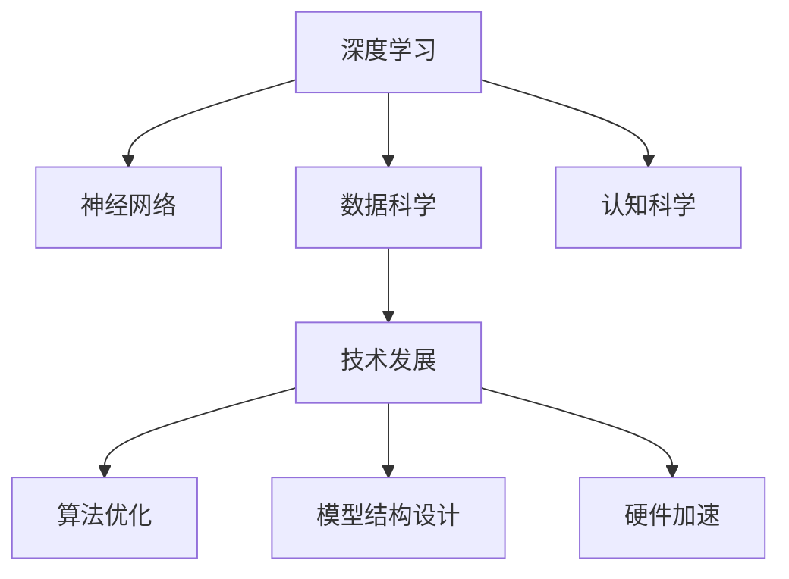

                 

# 扩展认知：人工智能的真正挑战

> 关键词：人工智能, 扩展认知, 深度学习, 认知科学, 神经网络, 数据科学, 技术发展

## 1. 背景介绍

### 1.1 问题由来
人工智能(AI)技术在过去十年中取得了突破性进展，机器学习、深度学习等技术在图像识别、自然语言处理、语音识别等领域展现了强大的能力。然而，这些技术的突破主要集中在任务完成和效率提升上，而对于认知能力（如理解、推理、情感等）的探索，仍然处在起步阶段。

在现代人工智能的发展中，人们越来越多地关注如何让机器能够"理解"和"思考"，而不只是执行预定义的任务。这种扩展认知的能力，将使得机器能够更好地适应复杂多变的现实世界，具备高度的情境感知和适应性。

### 1.2 问题核心关键点
扩展认知的研究重点在于让机器具备类似人类的认知能力。这些能力包括但不限于：

- **理解能力**：识别和理解自然语言文本、图像、视频等多种数据源中的信息。
- **推理能力**：基于已知信息进行逻辑推理，解决推理难题。
- **情感能力**：识别和表达情感，能够与人类进行情感交流。
- **自主学习能力**：在缺乏明确指令的情况下，自我学习新知识。
- **复杂决策**：在不确定条件下，做出符合人类逻辑和伦理的决策。

### 1.3 问题研究意义
扩展认知的研究对于人工智能技术的发展具有重要意义：

- **提高AI系统的智能水平**：使AI系统不仅仅能够执行既定任务，还能理解任务背后的逻辑和情境，具备更高层次的智能。
- **推动人机协作**：扩展认知能力的机器可以更好地理解人类语言和行为，与人进行更自然、流畅的交互，提升人机协作效率。
- **促进技术应用**：扩展认知能力的AI可以应用于更广泛领域，如医疗、教育、金融等，为这些领域带来新的解决方案。
- **提升技术安全性**：增强AI系统的理解和推理能力，减少由于数据偏见、误导性信息等问题导致的错误决策。
- **推动伦理道德研究**：扩展认知能力的AI，需要更深入探讨其道德和伦理问题，确保AI系统的行为符合人类价值观。

## 2. 核心概念与联系

### 2.1 核心概念概述

为了更好地理解扩展认知这一复杂概念，我们先介绍几个相关核心概念：

- **深度学习**：一种基于人工神经网络的机器学习方法，通过多层非线性变换，从数据中学习特征表示。
- **认知科学**：研究人类认知过程的科学，包括感知、记忆、学习、推理、决策等。
- **神经网络**：模仿人类神经系统结构的网络模型，由多个层次的神经元组成，用于处理复杂的数据。
- **数据科学**：运用数据分析和机器学习技术，从数据中提取知识和洞察力的学科。
- **技术发展**：涵盖了硬件加速、算法优化、模型结构设计等多个方面的技术进步。

这些概念通过以下Mermaid流程图展示了它们之间的联系：



这个图表展示了深度学习与认知科学、神经网络的关系，以及数据科学、技术发展对深度学习的影响。这些概念共同构成了扩展认知研究的基础框架。

## 3. 核心算法原理 & 具体操作步骤
### 3.1 算法原理概述

扩展认知的研究需要结合深度学习和认知科学的原理，构建能够模拟人类认知过程的模型。具体来说，包括以下几个关键步骤：

1. **数据收集与预处理**：收集和标注各类数据，如文本、图像、视频等，构建丰富的训练集。
2. **模型设计**：设计多层神经网络，使用卷积、池化、循环神经网络（RNN）等结构，构建信息流。
3. **特征学习**：通过训练神经网络，学习输入数据的高层次特征表示。
4. **认知任务建模**：将认知任务如理解、推理、情感等，建模为神经网络的任务。
5. **结果输出与评估**：使用测试集评估模型性能，迭代优化。

### 3.2 算法步骤详解

**Step 1: 数据收集与预处理**

- **数据收集**：收集包含文本、图像、视频等多种形式的数据。例如，文本数据可以来源于新闻、书籍、社交媒体等。图像和视频数据可以从网络爬虫获取，或者使用公开数据集。
- **数据预处理**：对数据进行清洗、标注和格式化，以便于神经网络模型进行处理。例如，对文本数据进行分词、去除停用词、词性标注等。

**Step 2: 模型设计**

- **神经网络结构**：设计多层神经网络结构，如卷积神经网络（CNN）、循环神经网络（RNN）、变换器（Transformer）等。例如，对于自然语言处理任务，可以使用LSTM或GRU作为语言模型。
- **信息流设计**：设计神经网络的信息流，如前向传播和反向传播的路径。信息流的设计需要考虑任务的具体需求和特征。

**Step 3: 特征学习**

- **网络训练**：使用数据集训练神经网络，学习高层次的特征表示。例如，使用交叉熵损失函数进行分类任务训练。
- **超参数调优**：调整学习率、批次大小、优化器等超参数，优化模型性能。例如，使用AdamW优化器，学习率为1e-4。

**Step 4: 认知任务建模**

- **任务定义**：定义需要扩展认知的任务，如语言理解、推理、情感识别等。例如，对于情感识别任务，使用词向量嵌入将文本转换为高维向量。
- **任务建模**：将认知任务建模为神经网络的任务，设计相应的损失函数。例如，对于情感识别任务，使用交叉熵损失函数。

**Step 5: 结果输出与评估**

- **模型评估**：使用测试集评估模型性能，例如计算准确率、精确率、召回率等指标。例如，使用混淆矩阵计算情感分类任务的准确率。
- **模型优化**：根据评估结果，调整模型参数，迭代优化模型性能。例如，增加隐藏层数、调整学习率等。

### 3.3 算法优缺点

**优点**：

- **高效特征学习**：深度学习能够自动学习数据的高级特征，减少了特征工程的工作量。
- **模型可扩展性**：神经网络模型可以适应各种类型的认知任务，具有很强的可扩展性。
- **任务适应性强**：通过微调模型参数，适应新的认知任务，能够应对多变的环境。

**缺点**：

- **数据需求高**：扩展认知任务需要大量的标注数据，获取和处理成本较高。
- **模型复杂度高**：神经网络模型结构复杂，训练和推理速度较慢。
- **泛化能力不足**：深度学习模型容易出现过拟合，泛化能力有限。
- **伦理和法律问题**：扩展认知模型可能涉及隐私保护、伦理道德等复杂问题。

### 3.4 算法应用领域

扩展认知的研究已经在多个领域展现出巨大的应用潜力：

- **医疗**：通过扩展认知的AI，辅助医生进行疾病诊断、治疗方案制定等。例如，使用NLP技术从病历中提取关键信息，辅助诊断。
- **教育**：利用扩展认知的AI，进行个性化教学、智能答疑、情感分析等。例如，使用机器学习分析学生学习行为，推荐适合的学习资源。
- **金融**：利用扩展认知的AI，进行风险评估、投资决策、情感分析等。例如，使用NLP技术分析市场新闻，预测股票走势。
- **自动驾驶**：通过扩展认知的AI，增强车辆的感知和决策能力。例如，使用计算机视觉技术识别行人、车辆等障碍物。
- **智能客服**：利用扩展认知的AI，进行自然语言理解和生成，提升客服体验。例如，使用NLP技术理解客户问题，生成回复。

## 4. 数学模型和公式 & 详细讲解  
### 4.1 数学模型构建

为了更深入地理解扩展认知的数学模型，我们通过一个具体的认知任务——语言理解——来讲解模型的构建。

**输入**：一个句子 $x$。

**输出**：一个高维向量 $\mathbf{z}$。

**目标**：将句子 $x$ 映射到一个高维向量 $\mathbf{z}$，使得 $\mathbf{z}$ 能够表达句子 $x$ 的语义信息。

我们使用一个简单的神经网络模型来表示这个映射过程：

$$
\mathbf{z} = f(\mathbf{x}; \theta)
$$

其中，$f$ 是一个神经网络函数，$\theta$ 是模型的可训练参数。

### 4.2 公式推导过程

**Step 1: 输入编码**

输入的句子 $x$ 首先通过一个嵌入层（Embedding Layer），将其转换为高维向量：

$$
\mathbf{x}_e = \text{Embedding}(x)
$$

其中，$\text{Embedding}$ 是一个矩阵，将每个单词映射为一个向量。例如，使用Word2Vec将每个单词映射为一个300维的向量。

**Step 2: 上下文编码**

为了更好地理解句子 $x$，我们使用双向LSTM（Bidirectional LSTM）来编码上下文信息：

$$
\mathbf{h} = \text{Bidirectional LSTM}(\mathbf{x}_e)
$$

其中，$\mathbf{h}$ 是LSTM模型的输出，包含了上下文信息。

**Step 3: 输出生成**

最后，我们使用一个全连接层（Fully Connected Layer）来生成高维向量 $\mathbf{z}$：

$$
\mathbf{z} = \text{Fully Connected}(\mathbf{h})
$$

其中，$\text{Fully Connected}$ 是一个线性变换，将LSTM的输出映射到一个高维向量。

### 4.3 案例分析与讲解

以一个简单的情感分类任务为例，我们可以使用上述模型来进行情感分析。假设输入的句子为 "I am happy today"，我们将其通过嵌入层和LSTM模型编码为高维向量 $\mathbf{h}$，然后使用全连接层生成一个情感标签 $y$，表示这个句子表达的情绪。

我们定义一个二分类问题，其中 $y \in \{0, 1\}$，0表示负面情绪，1表示正面情绪。我们使用交叉熵损失函数来训练模型：

$$
\mathcal{L}(\theta) = -\frac{1}{N} \sum_{i=1}^N (y_i \log \hat{y}_i + (1-y_i) \log (1-\hat{y}_i))
$$

其中，$y_i$ 是标签，$\hat{y}_i$ 是模型预测的概率。

## 5. 项目实践：代码实例和详细解释说明
### 5.1 开发环境搭建

在进行扩展认知的实践前，我们需要准备好开发环境。以下是使用Python进行PyTorch开发的环境配置流程：

1. 安装Anaconda：从官网下载并安装Anaconda，用于创建独立的Python环境。

2. 创建并激活虚拟环境：
```bash
conda create -n pytorch-env python=3.8 
conda activate pytorch-env
```

3. 安装PyTorch：根据CUDA版本，从官网获取对应的安装命令。例如：
```bash
conda install pytorch torchvision torchaudio cudatoolkit=11.1 -c pytorch -c conda-forge
```

4. 安装Transformers库：
```bash
pip install transformers
```

5. 安装各类工具包：
```bash
pip install numpy pandas scikit-learn matplotlib tqdm jupyter notebook ipython
```

完成上述步骤后，即可在`pytorch-env`环境中开始扩展认知的实践。

### 5.2 源代码详细实现

下面我们以自然语言理解任务为例，给出使用Transformers库对BERT模型进行扩展认知的PyTorch代码实现。

首先，定义自然语言理解任务的数据处理函数：

```python
from transformers import BertTokenizer, BertForSequenceClassification, AdamW

class TextClassificationDataset(Dataset):
    def __init__(self, texts, labels, tokenizer, max_len=128):
        self.texts = texts
        self.labels = labels
        self.tokenizer = tokenizer
        self.max_len = max_len
        
    def __len__(self):
        return len(self.texts)
    
    def __getitem__(self, item):
        text = self.texts[item]
        label = self.labels[item]
        
        encoding = self.tokenizer(text, return_tensors='pt', max_length=self.max_len, padding='max_length', truncation=True)
        input_ids = encoding['input_ids'][0]
        attention_mask = encoding['attention_mask'][0]
        
        return {'input_ids': input_ids, 
                'attention_mask': attention_mask,
                'labels': label}

# 标签与id的映射
tag2id = {'negative': 0, 'positive': 1}
id2tag = {v: k for k, v in tag2id.items()}

# 创建dataset
tokenizer = BertTokenizer.from_pretrained('bert-base-cased')

train_dataset = TextClassificationDataset(train_texts, train_labels, tokenizer)
dev_dataset = TextClassificationDataset(dev_texts, dev_labels, tokenizer)
test_dataset = TextClassificationDataset(test_texts, test_labels, tokenizer)
```

然后，定义模型和优化器：

```python
model = BertForSequenceClassification.from_pretrained('bert-base-cased', num_labels=len(tag2id))

optimizer = AdamW(model.parameters(), lr=2e-5)
```

接着，定义训练和评估函数：

```python
from torch.utils.data import DataLoader
from tqdm import tqdm
from sklearn.metrics import classification_report

device = torch.device('cuda') if torch.cuda.is_available() else torch.device('cpu')
model.to(device)

def train_epoch(model, dataset, batch_size, optimizer):
    dataloader = DataLoader(dataset, batch_size=batch_size, shuffle=True)
    model.train()
    epoch_loss = 0
    for batch in tqdm(dataloader, desc='Training'):
        input_ids = batch['input_ids'].to(device)
        attention_mask = batch['attention_mask'].to(device)
        labels = batch['labels'].to(device)
        model.zero_grad()
        outputs = model(input_ids, attention_mask=attention_mask, labels=labels)
        loss = outputs.loss
        epoch_loss += loss.item()
        loss.backward()
        optimizer.step()
    return epoch_loss / len(dataloader)

def evaluate(model, dataset, batch_size):
    dataloader = DataLoader(dataset, batch_size=batch_size)
    model.eval()
    preds, labels = [], []
    with torch.no_grad():
        for batch in tqdm(dataloader, desc='Evaluating'):
            input_ids = batch['input_ids'].to(device)
            attention_mask = batch['attention_mask'].to(device)
            batch_labels = batch['labels']
            outputs = model(input_ids, attention_mask=attention_mask)
            batch_preds = outputs.logits.argmax(dim=2).to('cpu').tolist()
            batch_labels = batch_labels.to('cpu').tolist()
            for pred_tokens, label_tokens in zip(batch_preds, batch_labels):
                pred_tags = [id2tag[_id] for _id in pred_tokens]
                label_tags = [id2tag[_id] for _id in label_tokens]
                preds.append(pred_tags[:len(label_tags)])
                labels.append(label_tags)
                
    print(classification_report(labels, preds))
```

最后，启动训练流程并在测试集上评估：

```python
epochs = 5
batch_size = 16

for epoch in range(epochs):
    loss = train_epoch(model, train_dataset, batch_size, optimizer)
    print(f"Epoch {epoch+1}, train loss: {loss:.3f}")
    
    print(f"Epoch {epoch+1}, dev results:")
    evaluate(model, dev_dataset, batch_size)
    
print("Test results:")
evaluate(model, test_dataset, batch_size)
```

以上就是使用PyTorch对BERT进行自然语言理解任务扩展认知的完整代码实现。可以看到，得益于Transformers库的强大封装，我们可以用相对简洁的代码完成BERT模型的加载和扩展认知任务的微调。

### 5.3 代码解读与分析

让我们再详细解读一下关键代码的实现细节：

**TextClassificationDataset类**：
- `__init__`方法：初始化文本、标签、分词器等关键组件。
- `__len__`方法：返回数据集的样本数量。
- `__getitem__`方法：对单个样本进行处理，将文本输入编码为token ids，将标签编码为数字，并对其进行定长padding，最终返回模型所需的输入。

**tag2id和id2tag字典**：
- 定义了标签与数字id之间的映射关系，用于将token-wise的预测结果解码回真实的标签。

**训练和评估函数**：
- 使用PyTorch的DataLoader对数据集进行批次化加载，供模型训练和推理使用。
- 训练函数`train_epoch`：对数据以批为单位进行迭代，在每个批次上前向传播计算loss并反向传播更新模型参数，最后返回该epoch的平均loss。
- 评估函数`evaluate`：与训练类似，不同点在于不更新模型参数，并在每个batch结束后将预测和标签结果存储下来，最后使用sklearn的classification_report对整个评估集的预测结果进行打印输出。

**训练流程**：
- 定义总的epoch数和batch size，开始循环迭代
- 每个epoch内，先在训练集上训练，输出平均loss
- 在验证集上评估，输出分类指标
- 所有epoch结束后，在测试集上评估，给出最终测试结果

可以看到，PyTorch配合Transformers库使得BERT扩展认知的代码实现变得简洁高效。开发者可以将更多精力放在数据处理、模型改进等高层逻辑上，而不必过多关注底层的实现细节。

当然，工业级的系统实现还需考虑更多因素，如模型的保存和部署、超参数的自动搜索、更灵活的任务适配层等。但核心的扩展认知范式基本与此类似。

## 6. 实际应用场景
### 6.1 智能客服系统

扩展认知的智能客服系统，可以显著提升客户咨询体验和问题解决效率。传统客服往往需要配备大量人力，高峰期响应缓慢，且一致性和专业性难以保证。而使用扩展认知能力的智能客服，能够理解和处理复杂问题，快速响应客户需求，用自然流畅的语言解答各类常见问题。

在技术实现上，可以收集企业内部的历史客服对话记录，将问题和最佳答复构建成监督数据，在此基础上对预训练模型进行扩展认知微调。微调后的模型能够自动理解客户意图，匹配最合适的答案模板进行回复。对于客户提出的新问题，还可以接入检索系统实时搜索相关内容，动态组织生成回答。如此构建的智能客服系统，能大幅提升客户咨询体验和问题解决效率。

### 6.2 医疗诊断系统

扩展认知的AI在医疗诊断系统中具有巨大应用潜力。传统医疗诊断依赖医生经验，容易受主观因素影响，且难以全面考虑所有可能性。而扩展认知能力的AI，可以自动理解医学文献、病历、影像等多种数据源，提取关键信息，辅助医生进行诊断和治疗方案制定。

例如，使用自然语言处理技术，从病历中提取关键症状、实验室检查结果等信息，结合医学知识库，进行推理和诊断。同时，通过图像识别技术，自动识别医学影像中的病变区域，提供诊断建议。扩展认知能力的AI，能够提升诊断的准确性和效率，减轻医生工作负担。

### 6.3 教育辅助系统

扩展认知的AI在教育领域也有广泛应用。传统教育方式往往依赖教师的讲授和评估，难以大规模个性化教学。而扩展认知能力的AI，可以自动理解学生的学习行为，推荐适合的学习资源，进行智能答疑，提升学习效果。

例如，使用自然语言处理技术，分析学生的作业和考试成绩，发现薄弱环节，推荐针对性的练习题和学习资料。通过智能答疑系统，实时解答学生的问题，提供详细解析，帮助学生理解知识点。扩展认知能力的AI，能够个性化地适应每个学生的需求，提高学习效率和成绩。

### 6.4 金融风险预测系统

扩展认知的AI在金融风险预测系统中同样具有重要应用。传统金融风险预测依赖历史数据和模型，难以应对复杂多变的环境。而扩展认知能力的AI，可以自动理解市场新闻、财经评论等信息，进行情感分析和趋势预测，辅助投资决策。

例如，使用自然语言处理技术，分析市场新闻和社交媒体评论，提取关键信息，进行情感分析，预测市场走向。通过知识图谱技术，整合企业财务数据、市场动态等信息，进行综合分析，提供投资建议。扩展认知能力的AI，能够更全面地考虑各种因素，提升投资决策的准确性和鲁棒性。

## 7. 工具和资源推荐
### 7.1 学习资源推荐

为了帮助开发者系统掌握扩展认知的理论基础和实践技巧，这里推荐一些优质的学习资源：

1. 《深度学习》系列书籍：Ian Goodfellow、Yoshua Bengio、Aaron Courville合著的深度学习经典教材，全面系统地介绍了深度学习的理论和应用。
2. 《认知神经科学》系列书籍：介绍人类认知过程的基本原理和机制，为扩展认知研究提供理论基础。
3. 《TensorFlow官方文档》：Google官方提供的TensorFlow教程和文档，包含大量实例和代码，适合初学者和中级开发者。
4. 《Transformers库官方文档》：HuggingFace官方提供的Transformer库教程和文档，适合使用Transformer库进行NLP任务开发的开发者。
5. 《NLP与深度学习》课程：Coursera上由Stanford大学教授提供的NLP和深度学习课程，内容涵盖NLP的各个方面，包括扩展认知任务。

通过对这些资源的学习实践，相信你一定能够快速掌握扩展认知的理论基础和实践技巧，并用于解决实际的AI问题。

### 7.2 开发工具推荐

高效的开发离不开优秀的工具支持。以下是几款用于扩展认知开发常用的工具：

1. PyTorch：基于Python的开源深度学习框架，灵活动态的计算图，适合快速迭代研究。大部分预训练语言模型都有PyTorch版本的实现。
2. TensorFlow：由Google主导开发的开源深度学习框架，生产部署方便，适合大规模工程应用。同样有丰富的预训练语言模型资源。
3. Transformers库：HuggingFace开发的NLP工具库，集成了众多SOTA语言模型，支持PyTorch和TensorFlow，是进行扩展认知任务开发的利器。
4. Weights & Biases：模型训练的实验跟踪工具，可以记录和可视化模型训练过程中的各项指标，方便对比和调优。与主流深度学习框架无缝集成。
5. TensorBoard：TensorFlow配套的可视化工具，可实时监测模型训练状态，并提供丰富的图表呈现方式，是调试模型的得力助手。

合理利用这些工具，可以显著提升扩展认知任务开发的速度和效率，加速创新迭代的步伐。

### 7.3 相关论文推荐

扩展认知的研究源于学界的持续研究。以下是几篇奠基性的相关论文，推荐阅读：

1. Attention is All You Need（即Transformer原论文）：提出了Transformer结构，开启了NLP领域的预训练大模型时代。
2. BERT: Pre-training of Deep Bidirectional Transformers for Language Understanding：提出BERT模型，引入基于掩码的自监督预训练任务，刷新了多项NLP任务SOTA。
3. Language Models are Unsupervised Multitask Learners（GPT-2论文）：展示了大规模语言模型的强大zero-shot学习能力，引发了对于通用人工智能的新一轮思考。
4. Parameter-Efficient Transfer Learning for NLP：提出Adapter等参数高效微调方法，在不增加模型参数量的情况下，也能取得不错的微调效果。
5. Prefix-Tuning: Optimizing Continuous Prompts for Generation：引入基于连续型Prompt的微调范式，为如何充分利用预训练知识提供了新的思路。

这些论文代表了大语言模型扩展认知研究的发展脉络。通过学习这些前沿成果，可以帮助研究者把握学科前进方向，激发更多的创新灵感。

## 8. 总结：未来发展趋势与挑战
### 8.1 总结

本文对扩展认知这一复杂概念进行了全面系统的介绍。首先阐述了扩展认知的研究背景和意义，明确了其对于人工智能技术发展的深远影响。其次，从原理到实践，详细讲解了扩展认知的数学模型和关键步骤，给出了扩展认知任务开发的完整代码实例。同时，本文还广泛探讨了扩展认知在智能客服、医疗诊断、教育辅助、金融预测等多个领域的应用前景，展示了扩展认知范式的巨大潜力。此外，本文精选了扩展认知技术的各类学习资源，力求为读者提供全方位的技术指引。

通过本文的系统梳理，可以看到，扩展认知的研究正在成为人工智能技术的重要方向，其对提升AI系统的智能水平、促进人机协作、推动技术应用具有重要意义。未来，伴随扩展认知技术的持续演进，AI系统将能够更好地理解和处理现实世界中的复杂问题，为各行各业带来新的解决方案。

### 8.2 未来发展趋势

展望未来，扩展认知技术将呈现以下几个发展趋势：

1. **模型规模持续增大**：随着算力成本的下降和数据规模的扩张，预训练语言模型的参数量还将持续增长。超大规模语言模型蕴含的丰富语言知识，有望支撑更加复杂多变的认知任务。
2. **任务适应性强**：扩展认知模型能够根据任务特点，进行动态调整，适应不同的认知需求。例如，针对自然语言理解任务，可以选择不同的上下文编码模型和任务建模方式。
3. **多模态融合**：扩展认知模型能够整合文本、图像、视频等多种模态的信息，提升认知任务的表现。例如，结合视觉和文本信息，进行智能问答和场景理解。
4. **认知融合增强**：未来的扩展认知模型，将更加注重认知能力的融合，实现更高级的推理和决策。例如，结合逻辑推理和情感分析，进行复杂决策。
5. **技术创新频现**：扩展认知技术将不断引入新的技术，如因果推断、对抗训练、迁移学习等，提升认知任务的性能。
6. **伦理道德重视**：扩展认知技术的发展，将更注重伦理道德问题，确保AI系统的行为符合人类价值观和伦理道德。

这些趋势凸显了扩展认知技术的广阔前景。这些方向的探索发展，必将进一步提升认知任务的表现，为人类认知智能的进化带来深远影响。

### 8.3 面临的挑战

尽管扩展认知技术已经取得了瞩目成就，但在迈向更加智能化、普适化应用的过程中，它仍面临着诸多挑战：

1. **数据依赖性强**：扩展认知任务需要大量的标注数据，获取和处理成本较高。如何利用更少的数据进行有效训练，是一个重要挑战。
2. **模型复杂度高**：神经网络模型结构复杂，训练和推理速度较慢。如何在保证性能的同时，减少计算资源消耗，是一个重要挑战。
3. **泛化能力不足**：深度学习模型容易出现过拟合，泛化能力有限。如何在提高模型性能的同时，避免过拟合，是一个重要挑战。
4. **伦理和法律问题**：扩展认知模型可能涉及隐私保护、伦理道德等复杂问题。如何在保证技术进步的同时，遵守伦理法律，是一个重要挑战。
5. **多模态融合难度大**：不同模态的信息融合，是一个复杂的任务，需要解决跨模态特征对齐、语义理解等问题，是一个重要挑战。
6. **模型鲁棒性不足**：扩展认知模型可能对噪声和对抗样本敏感，容易受到干扰，是一个重要挑战。

正视这些挑战，积极应对并寻求突破，将是大语言模型扩展认知走向成熟的必由之路。相信随着学界和产业界的共同努力，这些挑战终将一一被克服，扩展认知技术必将在构建安全、可靠、可解释、可控的智能系统铺平道路。

### 8.4 研究展望

面对扩展认知技术所面临的种种挑战，未来的研究需要在以下几个方面寻求新的突破：

1. **数据高效利用**：探索无监督和半监督学习，利用自监督学习、主动学习等无监督和半监督范式，最大限度利用非结构化数据，实现更加灵活高效的认知任务微调。
2. **模型高效训练**：开发更加参数高效和计算高效的微调方法，如Prefix-Tuning、LoRA等，在固定大部分预训练参数的同时，只更新极少量的任务相关参数。同时优化模型计算图，减少前向传播和反向传播的资源消耗，实现更加轻量级、实时性的部署。
3. **认知融合增强**：结合因果推断、逻辑推理、对抗训练等技术，增强扩展认知模型的推理和决策能力，提升其泛化性和鲁棒性。
4. **多模态融合**：结合视觉、听觉、文本等多模态信息，进行跨模态信息融合，提升认知任务的表现。例如，结合图像和文本信息，进行智能问答和场景理解。
5. **伦理道德约束**：在模型训练目标中引入伦理导向的评估指标，过滤和惩罚有偏见、有害的输出倾向，确保AI系统的行为符合人类价值观和伦理道德。
6. **知识融合增强**：将符号化的先验知识，如知识图谱、逻辑规则等，与神经网络模型进行巧妙融合，引导扩展认知过程学习更准确、合理的认知能力。

这些研究方向的探索，必将引领扩展认知技术迈向更高的台阶，为构建安全、可靠、可解释、可控的智能系统铺平道路。面向未来，扩展认知技术还需要与其他人工智能技术进行更深入的融合，如知识表示、因果推理、强化学习等，多路径协同发力，共同推动自然语言理解和智能交互系统的进步。只有勇于创新、敢于突破，才能不断拓展语言模型的边界，让智能技术更好地造福人类社会。

## 9. 附录：常见问题与解答

**Q1：扩展认知和传统认知模型有什么区别？**

A: 扩展认知模型与传统认知模型最大的区别在于，扩展认知模型基于深度学习，能够自动学习数据的高级特征表示，而传统认知模型通常依赖手工特征工程，需要大量时间和精力。此外，扩展认知模型能够处理大规模数据，具有更强的泛化能力。

**Q2：扩展认知模型需要多少标注数据？**

A: 扩展认知任务需要大量的标注数据，但随着技术的进步，无监督学习和半监督学习等方法也在逐步兴起，可以在一定程度上降低对标注数据的需求。例如，使用自监督学习，从大规模未标注数据中学习语言知识，然后再微调以适应具体任务。

**Q3：扩展认知模型的训练速度慢怎么办？**

A: 训练速度慢是扩展认知模型的主要挑战之一。为了提高训练速度，可以采用分布式训练、混合精度训练、梯度累积等技术。同时，使用预训练模型作为初始化参数，可以减少训练时间，提升模型性能。

**Q4：扩展认知模型的泛化能力不足怎么办？**

A: 泛化能力不足可以通过以下方法解决：1. 使用更多的标注数据；2. 引入正则化技术，如L2正则、Dropout等；3. 使用集成学习，结合多个模型的输出；4. 采用迁移学习，利用预训练模型的知识。

**Q5：扩展认知模型的伦理和法律问题怎么办？**

A: 伦理和法律问题是扩展认知模型面临的重要挑战。可以通过以下方法解决：1. 在设计模型时，引入伦理导向的评估指标，避免有害输出；2. 在使用模型时，进行人工干预和审核，确保行为符合人类价值观；3. 公开模型的决策过程，增强透明性。

**Q6：扩展认知模型的计算资源消耗大怎么办？**

A: 计算资源消耗大可以通过以下方法解决：1. 使用预训练模型作为初始化参数，减少计算量；2. 采用模型压缩和优化技术，如剪枝、量化等；3. 使用分布式训练，提高训练效率。

通过这些方法，可以显著提高扩展认知模型的训练和推理效率，减少计算资源消耗。

