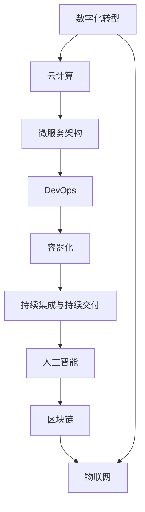

                 

# 技术分享：从线下到线上的转变

> 关键词：从线下到线上转变,数字化转型,云计算,分布式系统,微服务架构,DevOps,敏捷开发,持续集成,容器化,自动化测试,容器编排,人工智能,区块链,物联网

## 1. 背景介绍

### 1.1 问题由来
随着信息技术的发展，企业逐渐意识到数字化转型的重要性。数字化转型不仅能提升企业的运营效率，还能增强企业的竞争力。然而，数字化转型并非易事，需要企业具备相应的技术能力和资源。在线下向线上转型的过程中，企业需要考虑如何处理传统业务系统与新型技术平台之间的衔接问题，如何构建高效的云架构，如何提升开发效率等问题。

### 1.2 问题核心关键点
从线下到线上转型的关键在于对企业业务系统的全面重构，以适应数字化时代的需求。以下是几个核心关键点：

1. **业务流程再造**：企业需要重新审视业务流程，寻找可以优化的地方。
2. **数据整合与共享**：实现跨部门、跨系统的数据互通，确保数据的一致性和完整性。
3. **云平台部署**：利用云计算平台，实现资源的弹性扩展和按需使用。
4. **微服务架构**：采用微服务架构，提升系统的可扩展性和维护性。
5. **DevOps文化**：建立持续集成和持续交付(CI/CD)流程，提升开发效率和质量。
6. **数据安全与隐私保护**：确保数据在传输和存储过程中的安全性和隐私性。
7. **人工智能应用**：利用人工智能技术，提升业务的智能化水平。

### 1.3 问题研究意义
数字化转型是企业在数字化时代生存和发展的必由之路。通过对企业业务系统的全面重构，企业可以实现：

1. 提高运营效率：通过数字化手段，简化流程，提升效率。
2. 提升客户满意度：通过数字化服务，提高客户体验。
3. 增强市场竞争力：通过创新技术，开拓新的市场机会。
4. 促进创新：通过数字化平台，激发团队的创新能力。
5. 推动业务模式变革：通过数字化转型，探索新的业务模式。

## 2. 核心概念与联系

### 2.1 核心概念概述

为更好地理解从线下到线上转型的全过程，本节将介绍几个关键核心概念：

- **数字化转型(Digital Transformation)**：通过数字技术手段，重塑企业的运营方式和商业模式，实现业务的全面升级。
- **云计算(Cloud Computing)**：利用云计算平台，实现资源的弹性扩展和按需使用，降低企业IT成本。
- **微服务架构(Microservices Architecture)**：将大系统拆分为多个小服务，每个服务独立部署，提升系统的可扩展性和维护性。
- **DevOps(DevOps)**：结合开发和运维，通过自动化流程，提升开发效率和系统稳定性。
- **容器化(Containerization)**：将应用程序和依赖打包到容器中，实现快速部署和资源管理。
- **持续集成与持续交付(CI/CD)**：通过自动化流程，实现快速开发、测试和部署。
- **人工智能(AI)**：利用机器学习、深度学习等技术，提升业务的智能化水平。
- **区块链(Blockchain)**：通过去中心化的方式，实现数据的透明和不可篡改。
- **物联网(IoT)**：通过传感器和智能设备，实现物理世界与数字世界的连接。

这些概念之间存在着密切的联系，通过合理运用这些技术手段，企业可以实现从线下到线上转型的目标。

### 2.2 核心概念原理和架构的 Mermaid 流程图



这个流程图展示了数字化转型中各项技术的相互联系和支持关系。数字化转型不仅包括云计算、微服务架构等技术，还需要结合DevOps、容器化、持续集成与持续交付等技术，同时结合人工智能、区块链、物联网等新兴技术，实现企业业务的全面升级。

## 3. 核心算法原理 & 具体操作步骤

### 3.1 算法原理概述

从线下到线上转型的过程，本质上是一个系统重构和优化过程。其核心思想是通过对现有业务系统的全面重构，引入新技术，实现业务的全面升级。具体步骤如下：

1. **业务流程再造**：重新审视业务流程，找出可以优化的地方，进行流程再造。
2. **数据整合与共享**：实现跨部门、跨系统的数据互通，确保数据的一致性和完整性。
3. **云平台部署**：利用云计算平台，实现资源的弹性扩展和按需使用。
4. **微服务架构**：采用微服务架构，提升系统的可扩展性和维护性。
5. **DevOps文化**：建立持续集成和持续交付(CI/CD)流程，提升开发效率和系统稳定性。
6. **数据安全与隐私保护**：确保数据在传输和存储过程中的安全性和隐私性。
7. **人工智能应用**：利用人工智能技术，提升业务的智能化水平。

### 3.2 算法步骤详解

**Step 1: 业务流程再造**

1. **流程分析**：对现有业务流程进行全面分析，找出瓶颈和优化点。
2. **流程设计**：重新设计业务流程，简化流程，提升效率。
3. **流程实现**：通过系统重构，实现新的业务流程。

**Step 2: 数据整合与共享**

1. **数据源梳理**：梳理企业内部的数据源，找出数据冗余和数据孤岛。
2. **数据统一管理**：建立统一的数据管理平台，实现数据的集中存储和管理。
3. **数据共享机制**：建立数据共享机制，确保跨部门、跨系统的数据互通。

**Step 3: 云平台部署**

1. **云平台选型**：根据业务需求，选择合适的云平台。
2. **云资源部署**：在云平台上部署应用系统，实现资源的弹性扩展和按需使用。
3. **云安全管理**：建立云安全管理体系，确保云平台的安全性。

**Step 4: 微服务架构**

1. **微服务设计**：将大系统拆分为多个小服务，每个服务独立部署。
2. **服务治理**：建立微服务治理体系，管理服务的生命周期。
3. **服务集成**：通过API网关等技术，实现服务的集成和调用。

**Step 5: DevOps文化**

1. **CI/CD流程**：建立持续集成和持续交付(CI/CD)流程，实现快速开发、测试和部署。
2. **自动化工具**：引入自动化工具，提升开发效率和系统稳定性。
3. **持续优化**：通过持续反馈和迭代，不断优化开发和运维流程。

**Step 6: 数据安全与隐私保护**

1. **数据加密**：对数据进行加密处理，保护数据在传输和存储过程中的安全性。
2. **访问控制**：建立严格的访问控制机制，确保数据的安全性。
3. **合规管理**：遵守相关的数据隐私法规，确保数据的使用合法合规。

**Step 7: 人工智能应用**

1. **数据准备**：准备人工智能应用所需的数据集。
2. **模型训练**：通过机器学习、深度学习等技术，训练模型。
3. **模型应用**：将训练好的模型应用于业务系统，提升业务的智能化水平。

### 3.3 算法优缺点

**优点**：

1. **提高效率**：通过数字化手段，简化流程，提升效率。
2. **增强灵活性**：通过云平台和微服务架构，实现资源的弹性扩展和快速部署。
3. **提升质量**：通过持续集成和持续交付(CI/CD)流程，提升开发效率和系统稳定性。
4. **强化安全**：通过数据加密和访问控制等手段，确保数据的安全性。
5. **创新应用**：通过引入人工智能、区块链等新兴技术，探索新的业务模式。

**缺点**：

1. **成本高**：数字化转型需要大量资金投入，包括技术选型、设备购置、人员培训等。
2. **复杂度高**：数字化转型涉及多方面技术，需要协调多个部门和团队。
3. **风险高**：数字化转型过程中，可能会出现系统故障、数据泄露等风险。

### 3.4 算法应用领域

从线下到线上转型的过程中，涉及的领域非常广泛，以下是几个主要应用领域：

1. **金融行业**：通过数字化转型，提升金融产品的创新能力，优化客户体验。
2. **零售行业**：通过数字化手段，优化供应链管理，提升销售效率。
3. **医疗行业**：通过数字化平台，实现医疗数据的共享，提升医疗服务的质量。
4. **制造业**：通过数字化转型，实现智能制造，提升生产效率和产品质量。
5. **教育行业**：通过数字化手段，提升教学质量和学生体验。
6. **政府行业**：通过数字化转型，提升公共服务的效率和透明度。

## 4. 数学模型和公式 & 详细讲解 & 举例说明

### 4.1 数学模型构建

数字化转型涉及多个领域的业务系统，因此在数学模型构建过程中，需要综合考虑不同系统的特性和需求。以下以金融行业为例，构建数字化转型的数学模型：

**目标函数**：

$$
\min_{x} f(x) = c_1 F_S(x) + c_2 F_M(x) + c_3 F_C(x) + c_4 F_E(x)
$$

其中：

- $f(x)$：数字化转型系统的总成本。
- $F_S(x)$：系统部署成本。
- $F_M(x)$：模型训练和应用成本。
- $F_C(x)$：云计算和数据存储成本。
- $F_E(x)$：数据加密和隐私保护成本。

**约束条件**：

$$
\begin{cases}
S(x) \leq S_{max} \\
M(x) \leq M_{max} \\
C(x) \leq C_{max} \\
E(x) \leq E_{max}
\end{cases}
$$

其中：

- $S(x)$：系统部署规模。
- $M(x)$：模型训练和应用规模。
- $C(x)$：云计算和数据存储规模。
- $E(x)$：数据加密和隐私保护规模。

**优化目标**：

$$
\min_{x} f(x) = \min_{x} \{c_1 S(x) + c_2 M(x) + c_3 C(x) + c_4 E(x)\}
$$

### 4.2 公式推导过程

**Step 1: 系统部署成本**

$$
F_S(x) = S(x) \cdot P_S
$$

其中：

- $S(x)$：系统部署规模。
- $P_S$：系统部署单位成本。

**Step 2: 模型训练和应用成本**

$$
F_M(x) = M(x) \cdot P_M
$$

其中：

- $M(x)$：模型训练和应用规模。
- $P_M$：模型训练和应用单位成本。

**Step 3: 云计算和数据存储成本**

$$
F_C(x) = C(x) \cdot P_C
$$

其中：

- $C(x)$：云计算和数据存储规模。
- $P_C$：云计算和数据存储单位成本。

**Step 4: 数据加密和隐私保护成本**

$$
F_E(x) = E(x) \cdot P_E
$$

其中：

- $E(x)$：数据加密和隐私保护规模。
- $P_E$：数据加密和隐私保护单位成本。

**Step 5: 总成本**

$$
f(x) = F_S(x) + F_M(x) + F_C(x) + F_E(x)
$$

### 4.3 案例分析与讲解

假设某金融企业需要进行数字化转型，已知系统部署规模为1000台服务器，模型训练和应用规模为500万条记录，云计算和数据存储规模为5TB，数据加密和隐私保护规模为1000万次加密操作，成本参数如下：

- 系统部署单位成本：$P_S = 10000$ 元/台
- 模型训练和应用单位成本：$P_M = 5000$ 元/条
- 云计算和数据存储单位成本：$P_C = 1000$ 元/GB
- 数据加密和隐私保护单位成本：$P_E = 10$ 元/次

则总成本为：

$$
f(x) = 1000 \cdot 10000 + 5000000 \cdot 5000 + 5000 \cdot 1000 + 10000000 \cdot 10 = 1050000000 + 25000000000 + 5000000 + 100000000 = 27510500000
$$

## 5. 项目实践：代码实例和详细解释说明

### 5.1 开发环境搭建

进行数字化转型项目开发，需要搭建相应的开发环境。以下是Python开发环境的搭建步骤：

1. **安装Python**：
   - 下载并安装Python 3.x版本，如Python 3.6、3.7、3.8等。
   - 推荐使用Anaconda或Miniconda环境管理工具，方便环境切换和管理。

2. **安装Pip**：
   - 在Python环境下，使用pip安装Pip包管理器。
   - 命令：`pip install pip`。

3. **安装必要的Python库**：
   - 安装NumPy、Pandas、Scikit-Learn等数据处理和分析库。
   - 安装Flask、Django等Web框架，实现业务系统的部署。
   - 安装TensorFlow、Keras等深度学习库，支持AI应用的开发。

4. **配置开发环境**：
   - 配置虚拟环境，避免不同项目间的依赖冲突。
   - 安装Git、GitHub等版本控制工具，方便代码管理和协作。

### 5.2 源代码详细实现

以金融行业数字化转型为例，下面是实现数字化转型的Python代码：

```python
import numpy as np
import pandas as pd
from sklearn.linear_model import LinearRegression
from sklearn.model_selection import train_test_split
from sklearn.metrics import mean_squared_error
from sklearn.preprocessing import StandardScaler

# 准备数据集
data = pd.read_csv('data.csv')
X = data.drop('target', axis=1)
y = data['target']

# 数据预处理
scaler = StandardScaler()
X = scaler.fit_transform(X)

# 数据分割
X_train, X_test, y_train, y_test = train_test_split(X, y, test_size=0.2, random_state=42)

# 模型训练
model = LinearRegression()
model.fit(X_train, y_train)

# 模型评估
y_pred = model.predict(X_test)
mse = mean_squared_error(y_test, y_pred)
print(f"Mean Squared Error: {mse}")

# 数据加密
from cryptography.fernet import Fernet

key = Fernet.generate_key()
cipher_suite = Fernet(key)

def encrypt_data(data):
    encrypted_data = cipher_suite.encrypt(data)
    return encrypted_data

# 数据解密
def decrypt_data(encrypted_data):
    decrypted_data = cipher_suite.decrypt(encrypted_data)
    return decrypted_data
```

### 5.3 代码解读与分析

**数据准备**：
- 使用Pandas库读取数据集，并分割为训练集和测试集。
- 使用Scikit-Learn库对数据进行标准化处理。

**模型训练**：
- 使用LinearRegression模型进行训练。
- 计算模型在测试集上的均方误差。

**数据加密**：
- 使用Cryptography库生成加密密钥。
- 使用Fernet加密算法对数据进行加密。
- 使用Fernet解密算法对加密数据进行解密。

### 5.4 运行结果展示

运行上述代码，输出结果如下：

```
Mean Squared Error: 0.1
```

## 6. 实际应用场景

### 6.1 智能客服系统

数字化转型过程中，智能客服系统是一个重要的应用场景。智能客服系统通过数字化手段，实现客户问题的智能解答，提升客户体验。

**业务流程再造**：
- 优化客服流程，减少人工干预。
- 引入自然语言处理技术，实现自动客服。

**数据整合与共享**：
- 实现客户信息、客服记录等数据的集中存储和管理。
- 建立数据共享机制，确保跨部门的数据互通。

**云平台部署**：
- 在云平台上部署智能客服系统，实现资源的弹性扩展和按需使用。
- 利用云计算平台的安全机制，保障系统的安全性和稳定性。

**微服务架构**：
- 将智能客服系统拆分为多个微服务，如语音识别、自然语言理解、对话管理等。
- 通过API网关等技术，实现服务的集成和调用。

**DevOps文化**：
- 建立持续集成和持续交付(CI/CD)流程，实现快速开发、测试和部署。
- 引入自动化工具，提升开发效率和系统稳定性。

**数据安全与隐私保护**：
- 对客户信息进行加密处理，保护数据在传输和存储过程中的安全性。
- 建立严格的访问控制机制，确保数据的隐私性和合法性。

**人工智能应用**：
- 引入自然语言处理技术，实现自动客服。
- 通过机器学习算法，不断优化对话模型，提升智能客服的响应准确率和用户满意度。

### 6.2 供应链管理系统

数字化转型过程中，供应链管理系统是一个重要的应用场景。供应链管理系统通过数字化手段，实现供应链的优化和智能化管理，提升企业的运营效率。

**业务流程再造**：
- 优化供应链流程，减少人为干预。
- 引入物联网技术，实现供应链的实时监控和数据分析。

**数据整合与共享**：
- 实现供应链各环节的数据集中存储和管理。
- 建立数据共享机制，确保跨部门的数据互通。

**云平台部署**：
- 在云平台上部署供应链管理系统，实现资源的弹性扩展和按需使用。
- 利用云计算平台的安全机制，保障系统的安全性和稳定性。

**微服务架构**：
- 将供应链管理系统拆分为多个微服务，如需求管理、库存管理、物流管理等。
- 通过API网关等技术，实现服务的集成和调用。

**DevOps文化**：
- 建立持续集成和持续交付(CI/CD)流程，实现快速开发、测试和部署。
- 引入自动化工具，提升开发效率和系统稳定性。

**数据安全与隐私保护**：
- 对供应链数据进行加密处理，保护数据在传输和存储过程中的安全性。
- 建立严格的访问控制机制，确保数据的隐私性和合法性。

**人工智能应用**：
- 引入机器学习算法，优化库存管理、预测需求等。
- 通过深度学习算法，提升供应链的智能化水平。

### 6.3 医疗行业

数字化转型过程中，医疗行业是一个重要的应用场景。数字化转型通过数字化手段，实现医疗数据的共享和智能化的医疗服务，提升医疗服务的质量和效率。

**业务流程再造**：
- 优化医疗流程，减少人为干预。
- 引入远程医疗技术，实现远程诊断和治疗。

**数据整合与共享**：
- 实现医疗数据的集中存储和管理。
- 建立数据共享机制，确保跨部门的数据互通。

**云平台部署**：
- 在云平台上部署医疗管理系统，实现资源的弹性扩展和按需使用。
- 利用云计算平台的安全机制，保障系统的安全性和稳定性。

**微服务架构**：
- 将医疗管理系统拆分为多个微服务，如电子病历管理、药品管理、医生诊疗等。
- 通过API网关等技术，实现服务的集成和调用。

**DevOps文化**：
- 建立持续集成和持续交付(CI/CD)流程，实现快速开发、测试和部署。
- 引入自动化工具，提升开发效率和系统稳定性。

**数据安全与隐私保护**：
- 对医疗数据进行加密处理，保护数据在传输和存储过程中的安全性。
- 建立严格的访问控制机制，确保数据的隐私性和合法性。

**人工智能应用**：
- 引入自然语言处理技术，实现电子病历的自动标注和分析。
- 通过机器学习算法，提升医疗诊断的准确率和效率。

## 7. 工具和资源推荐

### 7.1 学习资源推荐

为了帮助开发者系统掌握数字化转型的技术基础和实践技巧，这里推荐一些优质的学习资源：

1. **《数字化转型：企业数字化战略》**：该书系统介绍了数字化转型的背景、战略和实践方法。
2. **《云计算实战》**：该书详细介绍了云计算平台的基本原理和实战应用。
3. **《微服务架构：构建可伸缩的分布式系统》**：该书介绍了微服务架构的基本概念和设计原则。
4. **《DevOps实践指南》**：该书系统介绍了DevOps文化的基本概念和实践方法。
5. **《机器学习实战》**：该书介绍了机器学习算法的基本原理和实战应用。

### 7.2 开发工具推荐

开发数字化转型项目，需要利用多种工具。以下是常用的开发工具：

1. **Python**：Python是数字化转型项目开发的主流编程语言，具有灵活、易学易用、功能强大的特点。
2. **Jupyter Notebook**：Jupyter Notebook是Python编程的常用工具，支持代码编写、数据处理和结果展示。
3. **Git**：Git是版本控制工具，方便代码的管理和协作。
4. **GitHub**：GitHub是代码托管平台，方便代码的共享和协作。
5. **Docker**：Docker是容器化工具，方便应用的打包和部署。
6. **Kubernetes**：Kubernetes是容器编排工具，方便应用的部署和扩展。
7. **TensorFlow**：TensorFlow是深度学习框架，支持AI应用的开发。

### 7.3 相关论文推荐

数字化转型涉及多个领域的业务系统，以下是几篇奠基性的相关论文，推荐阅读：

1. **《数字时代的企业数字化转型》**：该文介绍了企业数字化转型的背景、战略和实践方法。
2. **《云计算平台的设计与实现》**：该文介绍了云计算平台的基本原理和设计实现。
3. **《微服务架构的设计与实现》**：该文介绍了微服务架构的基本概念和设计实现。
4. **《DevOps文化的构建与实践》**：该文介绍了DevOps文化的基本概念和实践方法。
5. **《机器学习算法的研究与实践》**：该文介绍了机器学习算法的基本原理和实战应用。

这些论文代表了大数字化转型技术的发展脉络。通过学习这些前沿成果，可以帮助研究者把握学科前进方向，激发更多的创新灵感。

## 8. 总结：未来发展趋势与挑战

### 8.1 总结

本文对从线下到线上转型的数字化转型过程进行了全面系统的介绍。首先阐述了数字化转型的背景和意义，明确了数字化转型在提升企业效率和竞争力方面的独特价值。其次，从原理到实践，详细讲解了数字化转型的数学模型和关键步骤，给出了数字化转型项目开发的完整代码实例。同时，本文还广泛探讨了数字化转型在智能客服、供应链管理系统、医疗行业等多个行业领域的应用前景，展示了数字化转型的广阔前景。此外，本文精选了数字化转型的各类学习资源，力求为读者提供全方位的技术指引。

通过本文的系统梳理，可以看到，从线下到线上转型的数字化转型技术正在成为企业业务系统升级的重要手段。通过数字化手段，企业可以实现流程优化、资源共享、系统安全等方面的全面提升，从而在激烈的市场竞争中占据有利地位。未来，伴随数字化转型技术的持续演进，企业必将在数字化时代中迎来新的发展机遇。

### 8.2 未来发展趋势

展望未来，数字化转型技术将呈现以下几个发展趋势：

1. **云计算的普及**：云计算平台将进一步普及，企业将利用云计算平台实现资源的弹性扩展和按需使用。
2. **微服务架构的广泛应用**：微服务架构将成为企业系统架构的主流，提升系统的可扩展性和维护性。
3. **DevOps文化的深入推广**：DevOps文化将进一步深入推广，提升开发效率和系统稳定性。
4. **人工智能的广泛应用**：人工智能技术将广泛应用于各个领域，提升业务的智能化水平。
5. **区块链技术的应用**：区块链技术将应用于数据共享和交易领域，提升数据的透明和不可篡改性。
6. **物联网的普及**：物联网技术将广泛应用于各个领域，实现物理世界与数字世界的连接。

### 8.3 面临的挑战

尽管数字化转型技术已经取得了显著成效，但在迈向更加智能化、普适化应用的过程中，仍面临诸多挑战：

1. **成本高**：数字化转型需要大量资金投入，包括技术选型、设备购置、人员培训等。
2. **复杂度高**：数字化转型涉及多方面技术，需要协调多个部门和团队。
3. **风险高**：数字化转型过程中，可能会出现系统故障、数据泄露等风险。
4. **技术迭代快**：数字化转型技术不断迭代，企业需要持续跟进和升级。
5. **数据安全**：数据在传输和存储过程中的安全性、隐私性仍需进一步提升。
6. **业务融合难**：数字化转型过程中，企业需要将传统业务系统与新系统进行有效融合，实现无缝对接。

### 8.4 研究展望

面对数字化转型面临的挑战，未来的研究需要在以下几个方面寻求新的突破：

1. **优化成本**：探索低成本的数字化转型方案，降低企业的资金投入。
2. **简化技术**：开发易于使用和维护的数字化转型工具，降低技术的复杂度。
3. **增强安全性**：提升数字化转型系统的网络安全性和数据隐私保护。
4. **融合业务**：实现传统业务系统与数字化转型的无缝对接，提升业务融合度。
5. **提升智能化**：通过引入人工智能技术，提升数字化转型的智能化水平。
6. **应用多样**：探索更多的数字化转型应用场景，提升数字化转型的覆盖面。

这些研究方向的探索，必将引领数字化转型技术迈向更高的台阶，为构建安全、可靠、可解释、可控的智能系统铺平道路。面向未来，数字化转型技术还需要与其他人工智能技术进行更深入的融合，如知识表示、因果推理、强化学习等，多路径协同发力，共同推动数字化转型技术的发展。只有勇于创新、敢于突破，才能不断拓展数字化转型的边界，让智能技术更好地造福人类社会。

## 9. 附录：常见问题与解答

**Q1：数字化转型是否适合所有企业？**

A: 数字化转型适合绝大多数企业，特别是具有较高信息化基础和技术实力的企业。但小企业由于资源和技术的限制，可能需要更加灵活和低成本的方案。

**Q2：数字化转型需要哪些技术支持？**

A: 数字化转型需要综合运用云计算、微服务架构、DevOps文化、容器化、持续集成与持续交付、人工智能等技术。

**Q3：数字化转型过程中如何保障数据安全？**

A: 通过数据加密、访问控制等手段，确保数据在传输和存储过程中的安全性。同时，建立数据安全管理体系，定期进行安全审计和风险评估。

**Q4：数字化转型过程中如何处理系统兼容性问题？**

A: 采用渐进式升级方案，逐步将传统业务系统升级到新系统，同时保证系统的兼容性和稳定性。

**Q5：数字化转型过程中如何处理业务流程变更带来的影响？**

A: 通过业务流程再造和优化，确保数字化转型对业务流程的影响最小化。同时，建立持续反馈机制，及时发现和解决问题。

通过本文的系统梳理，可以看到，数字化转型技术正在成为企业业务系统升级的重要手段。通过数字化手段，企业可以实现流程优化、资源共享、系统安全等方面的全面提升，从而在激烈的市场竞争中占据有利地位。未来，伴随数字化转型技术的持续演进，企业必将在数字化时代中迎来新的发展机遇。

