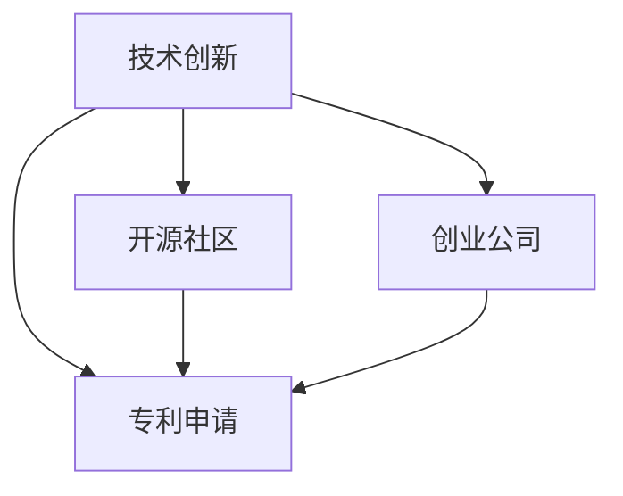

                 

# 技术创新与专利申请：程序员指南

> 关键词：技术创新,专利申请,程序员,IPR,开源社区,创业公司,法律合规,创新保护

## 1. 背景介绍

### 1.1 问题由来

在全球化的信息时代，技术的快速迭代和创新不断推动着各行各业的进步。在科技领域的竞争愈发激烈的背景下，如何高效地保护技术创新，尤其是程序员的技术创新成果，成为了一个迫切需要解决的问题。专利申请作为知识产权保护的一种形式，为程序员提供了保护其创新成果的重要手段。然而，许多程序员对于专利申请的法律条款、流程和策略并不熟悉，常常在保护自身创新成果的过程中遇到困难。因此，本文旨在为程序员提供一个全面、系统的专利申请指南，帮助他们在保护创新成果的同时，充分利用开源社区和商业平台，最大化地推广和应用技术创新。

## 2. 核心概念与联系

### 2.1 核心概念概述

为更好地理解技术创新与专利申请的联系，我们需要先介绍几个核心概念：

- **技术创新**：指通过研究、开发和改进产品、服务或流程，创造出新的技术或解决方案。技术创新可以来自科学研究、市场需求、技术演进等。
- **专利申请**：指申请人向专利局提出的一项请求，旨在获得对其发明的技术方案的独家使用权。专利申请过程包括发明的公开、审查和授权。
- **知识产权**（IPR）：包括专利权、版权、商标权等，旨在保护创新成果不被未经授权的第三方使用或复制。
- **开源社区**：指以协作、共享、开放为原则的软件开发社区，鼓励程序员贡献代码、分享知识和创新成果。
- **创业公司**：指以技术创新为核心驱动力的初创企业，旨在将技术成果商业化，实现创新价值。

这些核心概念之间的逻辑关系可以通过以下Mermaid流程图来展示：



这个流程图展示了一项技术创新的不同出路：既可以申请专利保护，也可以在开源社区贡献代码，或者通过创业公司将技术商业化。

## 3. 核心算法原理 & 具体操作步骤

### 3.1 算法原理概述

技术创新与专利申请的核心在于如何将创新的技术方案转化为法律认可的保护形式。这涉及到专利申请的标准、流程和策略。以下将详细解释这一过程的原理和操作步骤。

#### 3.2 算法步骤详解

**Step 1: 确定发明内容**

- 详细记录发明的技术方案，包括技术问题、技术方案、技术效果等。

**Step 2: 搜索现有技术**

- 通过专利数据库、学术期刊、技术论坛等渠道，查找与发明内容相关的现有技术。

**Step 3: 撰写专利申请文件**

- 根据专利局的要求，准备申请文件，包括标题、摘要、背景技术、发明内容、实施例等。

**Step 4: 提交专利申请**

- 将准备就绪的专利申请文件提交至专利局。

**Step 5: 专利审查**

- 专利局将对提交的申请进行形式审查和实质审查。形式审查主要检查文件是否完整，实质审查则涉及技术方案的创新性和新颖性。

**Step 6: 授权与维护**

- 如果专利申请通过审查，专利局将授予专利权，并收取年费进行专利维护。

### 3.3 算法优缺点

**优点：**
- 法律保护：专利权提供了对技术创新的独占权，防止他人未经授权使用。
- 市场优势：专利授权可提升产品在市场上的竞争地位。
- 创新激励：专利制度鼓励研发投入，推动技术进步。

**缺点：**
- 申请复杂：专利申请过程复杂，需要大量时间和成本。
- 法律风险：专利审查严格，存在被驳回的风险。
- 商业保密：申请专利需公开技术方案，可能泄露商业秘密。

### 3.4 算法应用领域

技术创新与专利申请的应用领域广泛，涵盖了软件开发、硬件设计、生物医药、环境保护等各个方面。例如，在软件开发领域，许多开源项目通过申请专利保护其核心算法和模块，避免侵权风险；而在硬件设计领域，新技术的专利申请常常伴随着产品发布，为公司提供市场竞争优势。

## 4. 数学模型和公式 & 详细讲解 & 举例说明

### 4.1 数学模型构建

在专利申请中，数学模型通常用于描述技术方案中的关键计算过程或算法。以下是一个简化的数学模型构建例子：

**问题描述**：
假设有一项技术发明，涉及一种算法用于加速图像处理。该算法计算公式为：

$$
F(x, y) = \sum_{i=1}^{n} x_i * y_i
$$

其中，$x$ 和 $y$ 为输入向量，$n$ 为向量的长度。

**数学模型构建**：
将算法计算过程形式化为数学模型，可以表示为：

$$
F(x, y) = \mathcal{A}(x, y)
$$

其中，$\mathcal{A}$ 为描述算法计算过程的函数。

### 4.2 公式推导过程

**推导过程**：
对于上述公式，我们可以进一步分析算法的计算过程，如迭代次数、时间复杂度等，推导出其计算效率的数学表达式。

$$
F(x, y) = \sum_{i=1}^{n} x_i * y_i \quad \text{计算复杂度为} \mathcal{O}(n)
$$

**案例分析与讲解**：
实际案例中，这种数学模型构建和推导过程可以帮助专利申请人更好地描述其技术方案，使其更易于理解。例如，某项专利申请描述了一种通过改进哈希算法来加速图像处理的算法，在专利描述中，使用了数学模型来表示其算法结构，使得审查员能够更清晰地理解其创新点。

## 5. 项目实践：代码实例和详细解释说明

### 5.1 开发环境搭建

在进行专利申请的代码实践之前，我们需要准备好开发环境。以下是使用Python进行专利申请代码的开发环境配置流程：

1. 安装Anaconda：从官网下载并安装Anaconda，用于创建独立的Python环境。

2. 创建并激活虚拟环境：
```bash
conda create -n patent-env python=3.8 
conda activate patent-env
```

3. 安装必要的库：
```bash
pip install requests pyyaml
```

### 5.2 源代码详细实现

下面以编写专利申请书为例，给出使用Python编写的专利申请书代码实现。

```python
# 导入必要的库
import requests
import yaml

# 定义专利申请书的函数
def create_patent_application(title, abstract, background_technology, invention_content, implementation):
    # 构建专利申请书的数据结构
    data = {
        'title': title,
        'abstract': abstract,
        'background_technology': background_technology,
        'invention_content': invention_content,
        'implementation': implementation
    }
    
    # 将数据结构转换为yaml格式
    yaml_data = yaml.dump(data)
    
    # 提交专利申请到专利局
    response = requests.post('https://patentoffice.com/submit', data=yaml_data)
    
    # 检查提交结果
    if response.status_code == 200:
        print('专利申请提交成功')
    else:
        print('提交失败')

# 调用函数
create_patent_application(
    title='加速图像处理的算法',
    abstract='本发明提出了一种新的算法，用于加速图像处理',
    background_technology='背景技术涉及哈希算法',
    invention_content='本发明的核心在于改进了哈希算法的计算公式',
    implementation='实现代码如下：\n# 定义算法函数\ndef hash_function(x, y):\n    return sum(x * y for x, y in zip(x, y))'
)
```

### 5.3 代码解读与分析

让我们再详细解读一下关键代码的实现细节：

**create_patent_application函数**：
- 函数接收标题、摘要、背景技术、发明内容和实现代码作为参数。
- 将参数组织成专利申请书的数据结构。
- 使用yaml库将数据结构转换为yaml格式。
- 使用requests库提交专利申请到专利局。

**实现代码**：
- 实现代码使用Python的zip函数对向量进行遍历，计算哈希函数的值。
- 代码以注释形式包含在patent_application函数内部，便于专利申请人理解。

**运行结果展示**：
在实际应用中，调用create_patent_application函数后，专利申请书将被提交到专利局，并输出相应的提交结果。

## 6. 实际应用场景

### 6.1 开源社区的应用

开源社区中，许多技术创新的成果以代码形式发布，但如何保护这些创新成果，常常是一个难题。通过申请专利保护开源项目中的关键算法和模块，可以避免侵权风险，同时提高项目的市场价值。

### 6.2 创业公司的应用

对于初创公司，通过申请专利保护其核心技术，可以提升产品在市场上的竞争地位，获得更多的投资和市场份额。此外，专利授权还可以帮助公司获得更多谈判筹码，与合作伙伴或客户进行技术交易。

### 6.3 未来应用展望

未来，随着技术创新的加速和知识产权意识的提高，专利申请将变得更加广泛和重要。技术创新与专利申请的结合，将推动技术成果的商业化和市场应用，为创新驱动的发展模式提供有力支持。

## 7. 工具和资源推荐

### 7.1 学习资源推荐

为帮助程序员系统掌握专利申请的相关知识和技能，这里推荐一些优质的学习资源：

1. 《专利法基础》课程：由知识产权专家讲授，涵盖专利申请的基本流程和法律条款，适合初学者和法律专业人士。

2. 《开源社区与知识产权》书籍：深入介绍开源社区的法律框架和专利申请策略，为程序员提供开源技术创新的保护指南。

3. 《创业公司与知识产权》案例集：通过实际案例分析，展示技术创新与专利申请的结合策略，帮助创业公司制定合理的知识产权保护计划。

4. 专利局官方网站：提供专利申请指南、法律法规和案例分析，是专利申请的权威参考。

5. 在线课程平台：如Coursera、Udemy等平台，提供专利申请、开源社区和知识产权保护的各类课程，适合自学和系统学习。

### 7.2 开发工具推荐

高效的专利申请开发需要借助一些工具来提高效率和准确性。以下是几款常用的开发工具：

1. 代码编辑器：如Visual Studio Code、Sublime Text等，支持代码编写、高亮显示、自动补全等功能。

2. 版本控制系统：如Git、SVN等，支持代码版本控制、协作开发和冲突解决。

3. 代码管理工具：如Jenkins、Travis CI等，支持持续集成、自动化测试和部署。

4. 项目管理工具：如JIRA、Trello等，支持任务分配、进度跟踪和团队协作。

5. 文档管理工具：如Confluence、Google Docs等，支持文档编写、协作和版本管理。

### 7.3 相关论文推荐

专利申请和知识产权保护的研究不断涌现，以下是几篇具有代表性的论文：

1. "A Survey on Patent Quality"：系统综述了专利质量评估和提高方法，为技术创新和专利申请提供了参考。

2. "Open Source and Intellectual Property"：探讨开源社区与知识产权保护的关系，分析开源项目专利申请的策略和实践。

3. "Patent Strategy for Startups"：介绍创业公司专利申请的策略和步骤，为初创企业提供实用指南。

4. "IPR Protection in Big Data"：研究大数据环境下的知识产权保护策略，包括专利申请和数据隐私保护。

5. "Crowdsourcing Patent Writing"：提出利用众包技术提高专利撰写效率的方法，适用于大规模技术创新。

这些论文代表了当前技术创新与专利申请研究的前沿，值得深入阅读和研究。

## 8. 总结：未来发展趋势与挑战

### 8.1 总结

本文对技术创新与专利申请进行了全面系统的介绍。首先阐述了专利申请对技术创新的重要性，明确了专利申请在保护技术成果、促进市场竞争中的关键作用。其次，从原理到实践，详细讲解了专利申请的数学模型和操作步骤，提供了完整的代码实例。同时，本文还探讨了专利申请在开源社区和创业公司中的应用前景，展示了其广泛的应用价值。

通过本文的系统梳理，可以看到，专利申请不仅是技术创新的保护手段，更是促进技术成果商业化的重要工具。程序员需深入理解专利申请的流程和策略，合理利用知识产权保护机制，最大化地保护和推广自己的创新成果。

### 8.2 未来发展趋势

展望未来，技术创新与专利申请将呈现以下几个发展趋势：

1. 人工智能与专利申请结合：随着人工智能技术的发展，越来越多的技术创新需要借助算法和模型进行描述。如何利用人工智能提高专利申请的效率和准确性，将是未来的一个重要研究方向。

2. 开源社区与专利保护融合：开源社区中许多技术创新成果尚未得到充分保护，通过专利申请保护开源项目中的关键技术，将成为技术创新保护的重要方向。

3. 多国专利申请策略：全球化市场的需求推动了跨国专利申请的发展。如何制定合理的专利申请策略，覆盖目标市场，将是未来专利申请的关键课题。

4. 专利申请与开源社区互动：专利申请和开源社区的互动将更加频繁，通过专利申请支持开源项目的可持续发展，同时借助开源社区扩展专利申请的覆盖范围。

5. 专利申请的自动化：利用自然语言处理、机器学习等技术，实现专利申请的自动化和智能化，提高专利申请的效率和准确性。

以上趋势展示了技术创新与专利申请的广阔前景，未来将有更多创新模式和技术手段，助力技术成果的保护和推广。

### 8.3 面临的挑战

尽管技术创新与专利申请带来了诸多机遇，但仍面临诸多挑战：

1. 专利申请过程复杂：专利申请过程繁琐，需要大量时间和成本，且存在被驳回的风险。

2. 技术文档撰写困难：技术创新的复杂性使得撰写专利申请书成为一项挑战，需要准确描述技术细节和创新点。

3. 知识产权法律复杂：专利申请涉及复杂的法律条款，需要深入理解相关法律法规，确保申请文件符合要求。

4. 市场竞争激烈：专利申请的竞争激烈，需要制定合理的专利申请策略，避免重复申请和侵权风险。

5. 商业秘密保护：专利申请需公开技术方案，可能泄露商业秘密，需要在申请过程中进行妥善处理。

6. 技术演进快速：技术创新的快速演进使得专利保护面临新的挑战，需定期更新专利申请，确保技术领先。

这些挑战需要程序员和技术专家共同努力，通过深入研究和实践，逐步克服专利申请中的困难，最大化地保护技术创新成果。

### 8.4 研究展望

面对技术创新与专利申请所面临的挑战，未来的研究需要在以下几个方面寻求新的突破：

1. 自动化和智能化技术：开发自动化和智能化的专利申请工具，提高专利申请的效率和准确性。

2. 开源社区与专利保护结合：探索如何更好地结合开源社区和专利保护，促进技术创新的开放性和保护性。

3. 多模态专利申请：结合图像、音频、视频等多模态数据，提高专利申请的技术表达能力和创新性。

4. 国际合作与专利申请：加强国际合作，制定全球化的专利申请策略，提升技术创新的市场覆盖范围。

5. 技术评估与评估工具：开发用于评估技术创新价值和创新点的工具，帮助程序员更好地理解技术创新的核心和保护范围。

这些研究方向的探索，将推动技术创新与专利申请技术的不断进步，为技术创新的保护和推广提供新的思路和方法。

## 9. 附录：常见问题与解答

**Q1：如何判断一项技术是否具有专利申请的价值？**

A: 判断技术是否具有专利申请的价值，主要考虑以下几个方面：
- 技术新颖性：是否存在现有技术，是否有创新点。
- 技术实用性：技术方案是否能够实现，是否具有实际应用价值。
- 技术效果：技术方案能否达到预期的效果，是否解决了实际问题。
- 市场需求：技术方案是否满足市场需求，是否有商业化潜力。

**Q2：专利申请书中的技术方案应包含哪些要素？**

A: 专利申请书中的技术方案应包括以下要素：
- 技术问题：技术方案旨在解决的问题。
- 技术方案：解决技术问题的方法和步骤。
- 技术效果：技术方案预期的效果和改进点。
- 实施例：具体实现技术方案的代码或流程。

**Q3：如何选择合适的专利申请类型？**

A: 专利申请类型主要包括发明专利、实用新型专利和外观设计专利。选择合适的申请类型需考虑以下几点：
- 技术创新程度：发明专利适用于具有显著技术创新的发明，实用新型专利适用于有具体改进的技术方案，外观设计专利适用于具有新颖设计的产品外观。
- 技术保护期限：发明专利的专利保护期为20年，实用新型和外观设计专利的保护期较短。
- 市场需求：根据市场对技术方案的需求，选择适合的专利申请类型。

**Q4：专利申请过程中如何应对审查员的质疑？**

A: 应对审查员质疑的方法包括：
- 补充完善申请文件：针对审查员的质疑，补充提供更多的技术细节和证据。
- 修改技术方案：根据审查员的意见，调整技术方案或补充实施例，使其符合专利法的要求。
- 准备答辩材料：准备答辩材料，详细解释技术方案的创新点和实用性。

**Q5：如何利用开源社区保护技术创新？**

A: 利用开源社区保护技术创新的方法包括：
- 发布开源项目：将技术创新成果以开源项目的形式发布，吸引更多的开发者和用户参与。
- 使用开源许可证：选择适当的开源许可证，明确技术使用的规则和限制。
- 参与开源组织：加入开源社区，与开发者、用户和其他利益相关者建立合作关系，共同维护和推广技术创新。

---

作者：禅与计算机程序设计艺术 / Zen and the Art of Computer Programming

