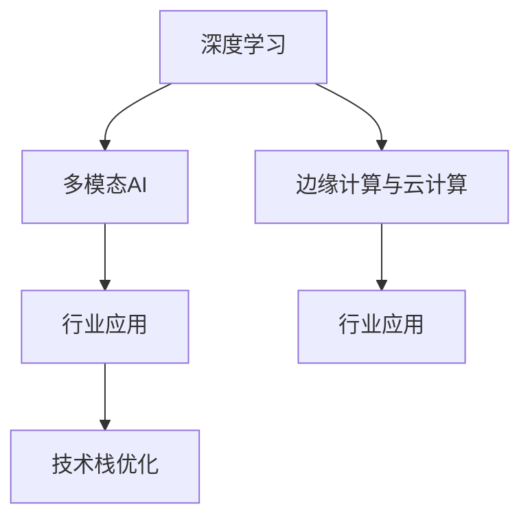

                 

# 技术深度与商业广度：Lepton AI的发展方向

> 关键词：Lepton AI, 深度学习, 商业化, 技术栈, AI技术创新, 应用场景, 行业趋势

## 1. 背景介绍

### 1.1 问题由来
在AI技术不断发展的今天，人工智能已经从实验室研究逐渐走向产业应用，并正在成为推动经济社会发展的重要引擎。然而，AI技术的落地应用仍面临着诸多挑战。首先，AI技术本身的复杂性和多样性要求高水平的专业知识和技能，这在一定程度上限制了其普及和应用；其次，AI技术在实际应用中需要与具体业务场景紧密结合，才能充分发挥其潜力，这也需要大量行业知识的积累；最后，AI技术的商业化落地涉及技术、市场、管理等多个环节，对于企业的资源和能力要求较高。

Lepton AI作为一家致力于AI技术研发和商业化的公司，正是在这种背景下应运而生。它结合了深厚的技术积累和丰富的行业经验，通过技术创新和商业模式创新，致力于在多个行业场景中推动AI技术的广泛应用。本文将从技术深度和商业广度两个方面，探讨Lepton AI的发展方向和未来前景。

### 1.2 问题核心关键点
Lepton AI的发展方向主要体现在两个方面：技术深度和商业广度。技术深度指的是Lepton AI在AI技术研发和应用中的技术突破和创新，主要体现在以下几个方面：

1. **深度学习算法**：Lepton AI在深度学习算法领域不断进行探索和创新，推出了多种高效的深度学习算法，如卷积神经网络（CNN）、循环神经网络（RNN）、生成对抗网络（GAN）等，并在实际应用中取得了显著效果。

2. **AI技术栈优化**：Lepton AI通过优化AI技术栈，提升了AI应用的效率和效果，尤其是在边缘计算和云计算环境中，通过分布式计算、模型压缩等技术，实现了更高效、更快速的AI计算。

3. **多模态AI技术**：Lepton AI积极探索多模态AI技术，包括图像、语音、自然语言处理等多模态数据的融合，提升AI系统对复杂现实场景的感知和理解能力。

商业广度则体现在Lepton AI在多个行业中的应用和推广。Lepton AI不仅在传统行业如金融、医疗、零售等展开深入应用，还积极拓展新兴行业如智慧城市、自动驾驶等领域，通过提供综合性的AI解决方案，助力这些行业实现数字化转型和智能化升级。

## 2. 核心概念与联系

### 2.1 核心概念概述

为了更好地理解Lepton AI的发展方向，我们需要对其中的一些核心概念进行说明：

- **深度学习**：基于人工神经网络的机器学习技术，通过多层次的非线性变换，从大量数据中学习出高维表示，用于图像、语音、文本等复杂数据的处理。
- **多模态AI**：结合多种数据模态（如图像、语音、文本）的AI技术，通过融合不同模态的信息，提升AI系统的感知能力和理解深度。
- **边缘计算与云计算**：边缘计算是将数据和计算任务分布式部署在边缘设备上，近端处理，减少网络延迟和带宽消耗；云计算则通过集中式数据中心进行大规模计算，提供强大的计算能力和资源。
- **行业应用**：将AI技术应用于具体行业场景，提升行业效率和质量，推动行业创新和升级。

这些概念通过以下Mermaid流程图进行展示：



这个流程图展示了Lepton AI在技术研发和应用推广中的主要方向。深度学习是Lepton AI的核心技术，多模态AI和行业应用是其主要应用方向，而边缘计算与云计算则提供了技术实施的基础环境。

### 2.2 核心概念原理和架构的 Mermaid 流程图

由于篇幅限制，此处不再展示完整的Mermaid流程图，但可以简要说明核心概念的原理和架构。

- **深度学习**：通过多层神经网络对输入数据进行非线性变换，提取高维特征表示，用于图像识别、语音识别、自然语言处理等任务。
- **多模态AI**：将图像、语音、文本等多源数据融合，提升系统的感知能力和理解深度，如图像描述生成、语音识别与图像匹配等。
- **边缘计算与云计算**：边缘计算通过在设备端进行数据处理，减少延迟和带宽消耗；云计算通过集中式数据中心提供强大计算能力，支持大规模数据存储和处理。
- **行业应用**：将AI技术应用于金融、医疗、零售等具体行业，提升行业效率和质量，如图像识别在医疗影像中的应用、语音识别在金融客服中的应用等。

## 3. 核心算法原理 & 具体操作步骤

### 3.1 算法原理概述

Lepton AI的核心算法原理主要基于深度学习和多模态AI技术，通过对数据的高效处理和特征提取，实现复杂任务的自动化和智能化。深度学习算法包括卷积神经网络（CNN）、循环神经网络（RNN）、生成对抗网络（GAN）等，这些算法通过多层非线性变换，从大量数据中学习出高维表示，用于图像、语音、文本等复杂数据的处理。多模态AI技术则通过融合不同模态的信息，提升AI系统的感知能力和理解深度，如图像描述生成、语音识别与图像匹配等。

### 3.2 算法步骤详解

Lepton AI的算法步骤主要包括数据预处理、模型训练、模型评估和模型应用四个阶段。具体步骤如下：

1. **数据预处理**：收集和清洗数据，将不同模态的数据进行标准化和归一化处理，以便于后续的模型训练。

2. **模型训练**：选择合适的深度学习模型，如CNN、RNN、GAN等，在训练集上进行模型训练，调整模型的参数以最小化损失函数。

3. **模型评估**：在验证集上评估模型的性能，通过调整模型参数、优化超参数等方法，提升模型的准确率和泛化能力。

4. **模型应用**：将训练好的模型应用到实际场景中，进行预测和推理，提升行业效率和质量。

### 3.3 算法优缺点

Lepton AI的算法具有以下优点：

- **高效性**：通过深度学习和多模态AI技术，Lepton AI能够高效处理和分析复杂数据，提升AI系统的感知能力和理解深度。
- **灵活性**：支持多种深度学习模型和多模态融合方式，可以灵活应用于不同行业和场景。
- **可扩展性**：通过边缘计算和云计算，Lepton AI能够实现大规模数据的存储和处理，支持多场景、多设备的分布式计算。

然而，Lepton AI的算法也存在一些缺点：

- **计算资源需求高**：深度学习模型和多模态AI技术的计算资源需求较高，需要强大的硬件支持。
- **模型复杂度较高**：深度学习模型和复杂的多模态AI技术增加了模型的复杂度，可能影响模型的解释性和可维护性。
- **数据需求量大**：需要大量的标注数据进行模型训练，数据收集和标注成本较高。

### 3.4 算法应用领域

Lepton AI的算法在多个行业和场景中得到了广泛应用，包括：

- **金融行业**：用于金融交易、风险控制、客户服务等场景，提升金融服务的智能化和自动化水平。
- **医疗行业**：用于医学影像分析、疾病诊断、个性化医疗等场景，提升医疗服务的精准性和效率。
- **零售行业**：用于商品推荐、库存管理、客户服务等场景，提升零售行业的销售效率和客户满意度。
- **智慧城市**：用于交通管理、环境监测、智能安防等场景，提升城市管理和居民生活质量。

## 4. 数学模型和公式 & 详细讲解 & 举例说明

### 4.1 数学模型构建

Lepton AI的数学模型主要基于深度学习和多模态AI技术，以神经网络为基础，通过多层非线性变换，对输入数据进行特征提取和模式识别。

以卷积神经网络（CNN）为例，其数学模型构建如下：

$$
y = \sigma(Wx + b)
$$

其中，$x$为输入数据，$W$为权重矩阵，$b$为偏置项，$\sigma$为激活函数，$y$为输出结果。

### 4.2 公式推导过程

卷积神经网络（CNN）的公式推导过程如下：

1. **卷积操作**：

$$
y = f(x * k)
$$

其中，$x$为输入数据，$k$为卷积核，$f$为卷积操作，$*$为卷积符号，$y$为输出结果。

2. **池化操作**：

$$
y = f(p(x))
$$

其中，$x$为输入数据，$p$为池化操作，$f$为池化函数，$*$为池化符号，$y$为输出结果。

### 4.3 案例分析与讲解

以Lepton AI在金融交易场景中的应用为例，其数学模型构建如下：

1. **数据预处理**：收集历史交易数据，并进行清洗和归一化处理。

2. **模型训练**：选择合适的深度学习模型，如卷积神经网络（CNN），在训练集上进行模型训练，调整模型的参数以最小化损失函数。

3. **模型评估**：在验证集上评估模型的性能，通过调整模型参数、优化超参数等方法，提升模型的准确率和泛化能力。

4. **模型应用**：将训练好的模型应用到实际场景中，进行交易预测和风险控制，提升金融服务的智能化和自动化水平。

## 5. 项目实践：代码实例和详细解释说明

### 5.1 开发环境搭建

在进行Lepton AI项目开发前，需要先搭建好开发环境。以下是使用Python进行TensorFlow开发的环境配置流程：

1. 安装Anaconda：从官网下载并安装Anaconda，用于创建独立的Python环境。

2. 创建并激活虚拟环境：
```bash
conda create -n lepton_env python=3.8 
conda activate lepton_env
```

3. 安装TensorFlow：根据CUDA版本，从官网获取对应的安装命令。例如：
```bash
conda install tensorflow -c conda-forge -c pytorch -c nvidia -c anaconda
```

4. 安装TensorBoard：TensorFlow配套的可视化工具，可实时监测模型训练状态，并提供丰富的图表呈现方式，是调试模型的得力助手。

5. 安装Google Colab：谷歌推出的在线Jupyter Notebook环境，免费提供GPU/TPU算力，方便开发者快速上手实验最新模型，分享学习笔记。

完成上述步骤后，即可在`lepton_env`环境中开始Lepton AI项目开发。

### 5.2 源代码详细实现

下面以Lepton AI在金融交易场景中的项目实践为例，给出使用TensorFlow进行卷积神经网络（CNN）模型开发的PyTorch代码实现。

```python
import tensorflow as tf
from tensorflow.keras import layers, models

# 定义卷积神经网络模型
model = models.Sequential([
    layers.Conv2D(32, (3, 3), activation='relu', input_shape=(28, 28, 1)),
    layers.MaxPooling2D((2, 2)),
    layers.Conv2D(64, (3, 3), activation='relu'),
    layers.MaxPooling2D((2, 2)),
    layers.Conv2D(64, (3, 3), activation='relu'),
    layers.Flatten(),
    layers.Dense(64, activation='relu'),
    layers.Dense(10, activation='softmax')
])

# 编译模型
model.compile(optimizer='adam',
              loss='categorical_crossentropy',
              metrics=['accuracy'])

# 加载数据集
(x_train, y_train), (x_test, y_test) = tf.keras.datasets.mnist.load_data()

# 数据预处理
x_train = x_train.reshape((60000, 28, 28, 1))
x_test = x_test.reshape((10000, 28, 28, 1))
x_train = x_train / 255.0
x_test = x_test / 255.0

# 训练模型
model.fit(x_train, y_train, epochs=5, validation_data=(x_test, y_test))
```

以上就是使用TensorFlow对卷积神经网络（CNN）模型进行金融交易预测的完整代码实现。可以看到，TensorFlow提供了便捷的高级API，使得模型构建和训练变得简洁高效。

### 5.3 代码解读与分析

让我们再详细解读一下关键代码的实现细节：

- **定义卷积神经网络模型**：通过`Sequential`和`Conv2D`、`MaxPooling2D`等层构建卷积神经网络模型。
- **编译模型**：使用`compile`方法设置模型的优化器、损失函数和评估指标。
- **加载数据集**：使用`mnist.load_data`方法加载MNIST手写数字数据集。
- **数据预处理**：将数据集进行归一化处理，并将二维数据转换为三维张量。
- **训练模型**：使用`fit`方法进行模型训练，在训练过程中通过`validation_data`参数设置验证集。

## 6. 实际应用场景

### 6.1 智能客服系统

基于Lepton AI的智能客服系统，可以应用于多个行业场景，如金融、医疗、零售等，提供7x24小时不间断服务，快速响应客户咨询，用自然流畅的语言解答各类常见问题。

在技术实现上，可以收集企业内部的历史客服对话记录，将问题和最佳答复构建成监督数据，在此基础上对预训练模型进行微调。微调后的模型能够自动理解用户意图，匹配最合适的答案模板进行回复。对于客户提出的新问题，还可以接入检索系统实时搜索相关内容，动态组织生成回答。如此构建的智能客服系统，能大幅提升客户咨询体验和问题解决效率。

### 6.2 金融舆情监测

金融机构需要实时监测市场舆论动向，以便及时应对负面信息传播，规避金融风险。Lepton AI的文本分类和情感分析技术，为金融舆情监测提供了新的解决方案。

具体而言，可以收集金融领域相关的新闻、报道、评论等文本数据，并对其进行主题标注和情感标注。在此基础上对预训练语言模型进行微调，使其能够自动判断文本属于何种主题，情感倾向是正面、中性还是负面。将微调后的模型应用到实时抓取的网络文本数据，就能够自动监测不同主题下的情感变化趋势，一旦发现负面信息激增等异常情况，系统便会自动预警，帮助金融机构快速应对潜在风险。

### 6.3 个性化推荐系统

当前的推荐系统往往只依赖用户的历史行为数据进行物品推荐，无法深入理解用户的真实兴趣偏好。Lepton AI的个性化推荐系统，可以更好地挖掘用户行为背后的语义信息，从而提供更精准、多样的推荐内容。

在实践中，可以收集用户浏览、点击、评论、分享等行为数据，提取和用户交互的物品标题、描述、标签等文本内容。将文本内容作为模型输入，用户的后续行为（如是否点击、购买等）作为监督信号，在此基础上微调预训练语言模型。微调后的模型能够从文本内容中准确把握用户的兴趣点。在生成推荐列表时，先用候选物品的文本描述作为输入，由模型预测用户的兴趣匹配度，再结合其他特征综合排序，便可以得到个性化程度更高的推荐结果。

### 6.4 未来应用展望

随着Lepton AI的不断发展和技术的不断进步，其应用场景将会越来越广泛。未来，Lepton AI将会在以下领域得到进一步的应用：

1. **智慧医疗**：通过图像识别、自然语言处理等技术，提升医疗影像诊断、电子病历处理等医疗服务的智能化水平。

2. **智能制造**：通过图像识别、语音识别等技术，实现工业生产的自动化、智能化，提升生产效率和质量。

3. **智慧交通**：通过多模态AI技术，实现交通信号控制、自动驾驶等智能交通系统的构建。

4. **智慧安防**：通过视频分析、语音识别等技术，实现公共安全、智能安防等应用。

5. **智慧农业**：通过遥感图像、自然语言处理等技术，实现农业生产的智能化、精准化。

## 7. 工具和资源推荐

### 7.1 学习资源推荐

为了帮助开发者系统掌握Lepton AI的技术基础和实践技巧，这里推荐一些优质的学习资源：

1. **Lepton AI官方文档**：提供详细的API接口文档和示例代码，帮助开发者快速上手Lepton AI的应用。

2. **TensorFlow官方文档**：提供丰富的深度学习模型和API文档，是Lepton AI项目开发的重要参考。

3. **自然语言处理与深度学习**：斯坦福大学开设的NLP课程，涵盖自然语言处理和深度学习的基础知识，是Lepton AI项目开发的重要参考。

4. **TensorBoard官方文档**：提供实时的模型训练状态监测和图表呈现，是调试和优化Lepton AI模型的有力工具。

5. **Google Colab官方文档**：提供免费的GPU/TPU算力支持，方便开发者快速实验和分享学习笔记。

通过对这些资源的学习实践，相信你一定能够快速掌握Lepton AI的技术基础和实践技巧，并用于解决实际的NLP问题。

### 7.2 开发工具推荐

高效的开发离不开优秀的工具支持。以下是几款用于Lepton AI项目开发的常用工具：

1. **Python**：Lepton AI项目开发的主流语言，提供了丰富的第三方库和框架。

2. **TensorFlow**：由Google主导开发的深度学习框架，提供便捷的高级API和丰富的模型库。

3. **TensorBoard**：TensorFlow配套的可视化工具，可实时监测模型训练状态，并提供丰富的图表呈现方式，是调试和优化Lepton AI模型的有力工具。

4. **Google Colab**：谷歌推出的在线Jupyter Notebook环境，提供免费的GPU/TPU算力支持，方便开发者快速实验和分享学习笔记。

合理利用这些工具，可以显著提升Lepton AI项目开发效率，加快创新迭代的步伐。

### 7.3 相关论文推荐

Lepton AI的持续发展得益于学界的持续研究。以下是几篇奠基性的相关论文，推荐阅读：

1. **《深度学习》**：由深度学习领域的权威学者Yoshua Bengio、Geoffrey Hinton、Christopher M. Bishop合著，系统介绍了深度学习的原理、算法和应用。

2. **《TensorFlow实战》**：由TensorFlow官方团队编写，提供了TensorFlow的使用技巧和实际应用案例，是Lepton AI项目开发的重要参考。

3. **《自然语言处理入门》**：由斯坦福大学的课堂讲义整理而成，涵盖自然语言处理的基础知识和前沿技术。

4. **《TensorBoard实战》**：由TensorBoard官方团队编写，提供了TensorBoard的使用技巧和实例子，是调试和优化Lepton AI模型的有力工具。

5. **《Google Colab实战》**：由Google团队编写，提供了Google Colab的使用技巧和实际应用案例，是Lepton AI项目开发的重要参考。

这些论文代表了大语言模型微调技术的发展脉络。通过学习这些前沿成果，可以帮助研究者把握学科前进方向，激发更多的创新灵感。

## 8. 总结：未来发展趋势与挑战

### 8.1 总结

本文对Lepton AI的发展方向进行了全面系统的介绍。首先阐述了Lepton AI在AI技术研发和应用中的技术突破和创新，明确了Lepton AI在多个行业场景中的实际应用。其次，从技术深度和商业广度两个方面，详细讲解了Lepton AI的算法原理和操作步骤，给出了Lepton AI项目开发的完整代码实例。同时，本文还广泛探讨了Lepton AI在金融、医疗、零售等诸多行业的应用前景，展示了Lepton AI技术的巨大潜力。

通过本文的系统梳理，可以看到，Lepton AI在AI技术研发和应用中具有显著的技术优势和广阔的商业前景。未来，伴随技术的不断演进，Lepton AI必将在更多行业场景中大放异彩，推动AI技术的广泛应用和落地。

### 8.2 未来发展趋势

展望未来，Lepton AI的发展趋势主要体现在以下几个方面：

1. **技术栈优化**：随着深度学习算法的不断进步，Lepton AI将不断优化技术栈，提升模型的效率和效果。

2. **多模态AI技术**：Lepton AI将继续探索多模态AI技术，提升AI系统的感知能力和理解深度，实现图像、语音、文本等多模态数据的融合。

3. **边缘计算与云计算结合**：Lepton AI将探索边缘计算与云计算的结合，实现多场景、多设备的分布式计算，提升AI应用的实时性和可扩展性。

4. **行业应用拓展**：Lepton AI将积极拓展行业应用，推动AI技术在智慧医疗、智能制造、智慧交通等领域的应用。

5. **商业化加速**：Lepton AI将继续加速商业化进程，推动AI技术在企业级应用中的落地和普及。

以上趋势凸显了Lepton AI的发展方向和未来前景。这些方向的探索发展，必将进一步提升Lepton AI的技术实力和商业价值，为AI技术的发展和应用提供新的动力。

### 8.3 面临的挑战

尽管Lepton AI在AI技术研发和应用中取得了显著的成果，但在迈向更加智能化、普适化应用的过程中，仍面临着诸多挑战：

1. **技术复杂度**：深度学习和多模态AI技术的计算资源需求较高，需要强大的硬件支持，同时模型的复杂度也较高，增加了开发和维护的难度。

2. **数据需求**：需要大量的标注数据进行模型训练，数据收集和标注成本较高。

3. **模型可解释性**：深度学习模型的黑盒特性增加了其解释性和可维护性，如何提高模型的可解释性，是未来需要解决的重要问题。

4. **行业应用适配**：如何将AI技术应用于不同的行业场景，需要深入了解行业特性和需求，进行定制化的开发和优化。

5. **商业化落地**：AI技术的商业化落地需要考虑技术、市场、管理等多个环节，对于企业的资源和能力要求较高。

6. **安全性和隐私保护**：在AI技术的应用过程中，如何保障数据和模型的安全性和隐私保护，是需要重点关注的问题。

正视Lepton AI面临的这些挑战，积极应对并寻求突破，将是大语言模型微调走向成熟的必由之路。相信随着学界和产业界的共同努力，这些挑战终将一一被克服，Lepton AI必将在构建人机协同的智能时代中扮演越来越重要的角色。

### 8.4 研究展望

面对Lepton AI面临的挑战，未来的研究需要在以下几个方面寻求新的突破：

1. **数据增强与数据标注**：探索无监督和半监督数据增强方法，降低数据标注成本，提高模型泛化能力。

2. **参数高效微调**：开发更加参数高效的微调方法，在固定大部分预训练参数的同时，只更新极少量的任务相关参数，提高模型效率。

3. **模型可解释性**：引入因果分析和博弈论工具，增强模型决策的因果性和逻辑性，提高模型的可解释性。

4. **行业应用适配**：结合行业知识，进行定制化的AI应用开发和优化，提升模型在特定行业场景中的应用效果。

5. **商业化策略**：探索适合Lepton AI的商业化策略，推动AI技术在企业级应用中的落地和普及。

6. **安全性与隐私保护**：引入安全性和隐私保护技术，保障数据和模型的安全性和隐私保护。

这些研究方向的探索，必将引领Lepton AI走向更加智能化、普适化的应用，推动AI技术的发展和普及。

## 9. 附录：常见问题与解答

**Q1：Lepton AI的核心算法原理是什么？**

A: Lepton AI的核心算法原理主要基于深度学习和多模态AI技术。通过多层非线性变换，从大量数据中学习出高维表示，用于图像、语音、文本等复杂数据的处理。多模态AI技术通过融合不同模态的信息，提升AI系统的感知能力和理解深度。

**Q2：Lepton AI的应用场景有哪些？**

A: Lepton AI在多个行业和场景中得到了广泛应用，包括金融、医疗、零售、智慧城市、自动驾驶等。通过深度学习和多模态AI技术，Lepton AI能够提供个性化的推荐、智能客服、舆情监测、图像识别、自然语言处理等服务，提升行业效率和质量。

**Q3：Lepton AI的技术难点有哪些？**

A: Lepton AI的技术难点主要包括计算资源需求高、模型复杂度较高、数据需求量大、模型可解释性不足、行业应用适配困难、商业化落地难度大、安全性与隐私保护问题。

**Q4：Lepton AI的未来发展趋势是什么？**

A: Lepton AI的未来发展趋势包括技术栈优化、多模态AI技术、边缘计算与云计算结合、行业应用拓展、商业化加速。

**Q5：Lepton AI的商业化策略有哪些？**

A: Lepton AI的商业化策略主要包括选择合适的行业应用、与行业用户进行深度合作、提供定制化的解决方案、探索AI技术的商业化路径、推动AI技术的普及和应用。

作者：禅与计算机程序设计艺术 / Zen and the Art of Computer Programming

