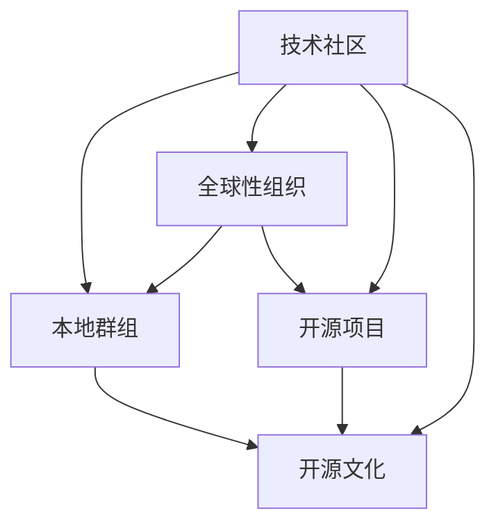

                 

# 技术社区建设：从本地群组到全球性组织

> 关键词：技术社区, 建设, 本地群组, 全球性组织, 开发者, 开源项目, 开源文化

## 1. 背景介绍

### 1.1 问题由来
在过去几十年中，技术社区的崛起在推动技术进步和创新方面发挥了至关重要的作用。这些社区，无论是本地的开发者小组还是全球性的开源项目，都为技术交流、知识共享和协同开发提供了宝贵的平台。随着互联网和社交媒体的普及，技术社区的影响力进一步扩大，成为技术领域内不可或缺的一部分。

然而，尽管技术社区不断发展壮大，其在组织结构、管理和文化建设方面仍面临诸多挑战。例如，如何有效地整合来自不同地域、文化背景和技能水平的开发者？如何促进社区成员之间的深度交流与合作？这些问题需要技术社区建设者们进行深入思考和创新实践。

### 1.2 问题核心关键点
本文旨在探讨技术社区建设的关键要素和最佳实践，特别是从本地群组到全球性组织的演变过程。我们关注的核心关键点包括：

- **组织结构设计**：如何建立能够有效支持技术创新和知识共享的社区结构？
- **文化建设**：如何营造一个包容、协作和开放的社区文化？
- **资源分配**：如何合理分配社区资源（如资金、人力和技术）以支持社区活动和项目？
- **治理机制**：如何设计透明的治理机制以确保社区的可持续发展？

## 2. 核心概念与联系

### 2.1 核心概念概述

为更好地理解技术社区的建设，本节将介绍几个关键概念及其相互关系：

- **技术社区（Technical Community）**：由技术爱好者、开发者和专家组成的网络，旨在通过交流、合作和创新推动技术进步。
- **本地群组（Local Groups）**：以地理位置为基础的开发者社区，通常通过线下的聚会、会议和技术讨论会等形式进行交流。
- **全球性组织（Global Organizations）**：基于互联网和开源项目的技术社区，能够跨越地理和文化的界限，吸引全球开发者共同参与。
- **开发者（Developers）**：在技术社区中积极参与和贡献的个人，通常是软件开发人员、数据科学家、系统管理员等。
- **开源项目（Open Source Projects）**：由社区成员共同开发和维护的代码库，旨在促进技术共享和协作。
- **开源文化（Open Source Culture）**：以共享、协作、透明和开放为核心的文化理念，推动开源项目的繁荣和发展。

这些概念之间的逻辑关系可以通过以下Mermaid流程图来展示：



这个流程图展示了一些核心概念及其相互关系：

1. **技术社区**是连接本地群组和全球性组织的基础，同时也是开源项目的母体。
2. **本地群组**和**全球性组织**通过**技术社区**实现交流和协作，共同支持**开源项目**的开发和维护。
3. **开源项目**和**开源文化**相互促进，推动技术社区的健康发展和社区成员的成长。

## 3. 核心算法原理 & 具体操作步骤

### 3.1 算法原理概述

技术社区建设的过程，可以视为一个逐步演变和优化的过程。在这一过程中，社区通过不断地吸引新成员、整合资源、调整组织结构和优化文化建设，逐步从一个简单的本地群组成长为一个具有全球影响力的技术组织。这一过程涉及多个方面的优化和调整，包括但不限于组织结构设计、文化建设、资源分配和治理机制。

### 3.2 算法步骤详解

**Step 1: 确定社区目标和愿景**
- 明确社区的目标和愿景，确定社区建设的核心方向。
- 制定社区章程和规则，确保所有成员共同遵守。

**Step 2: 建立沟通机制**
- 选择合适的沟通工具，如Slack、GitHub、Discord等，建立社区成员之间的沟通渠道。
- 定期组织线上和线下活动，促进成员之间的交流和协作。

**Step 3: 设计组织结构**
- 确定社区的核心团队和管理层，分配职责和权限。
- 建立项目管理和任务分配机制，确保每个项目都有专人负责。

**Step 4: 推动开源项目**
- 选择符合社区目标的开源项目，进行孵化和支持。
- 鼓励成员积极参与项目开发和维护，形成良性的社区生态。

**Step 5: 营造社区文化**
- 倡导共享、协作、透明和开放的文化理念，营造积极的社区氛围。
- 通过举办技术分享会、代码评审会等活动，促进知识和技能的交流。

**Step 6: 优化资源分配**
- 合理分配社区资源，包括资金、人力和技术支持。
- 引入赞助商和合作伙伴，扩大社区的影响力和资源。

**Step 7: 设计治理机制**
- 制定透明的治理规则和流程，确保社区决策的公平和透明。
- 引入社区投票和反馈机制，增强成员的参与感和归属感。

**Step 8: 持续改进和扩展**
- 定期评估社区的运营情况，识别问题和改进空间。
- 寻找新的合作机会和扩展方向，推动社区的持续发展和壮大。

### 3.3 算法优缺点

技术社区建设的优点包括：

- **促进知识共享**：通过开放和透明的沟通渠道，成员可以自由地分享知识和经验，推动技术创新。
- **加强协作和合作**：有效的组织结构和治理机制，能够促进成员之间的深度协作和跨项目合作。
- **提高社区凝聚力**：通过积极的文化建设和活动组织，增强成员的归属感和参与感。

然而，社区建设也面临一些挑战：

- **管理复杂性**：社区规模的扩大和成员数量的增加，可能导致管理复杂性的提升。
- **文化差异**：来自不同地域和背景的成员，可能存在文化差异，影响社区的凝聚力和协作效果。
- **资源限制**：社区的资源限制，如资金和技术支持，可能成为制约社区发展的瓶颈。

## 4. 数学模型和公式 & 详细讲解 & 举例说明

### 4.1 数学模型构建

我们可以将技术社区的建设过程抽象为一个优化问题，其中目标函数为社区成员的满意度最大化，约束条件包括资源限制、规则和章程等。设社区的成员数量为 $N$，满意度函数为 $S(N)$，资源限制函数为 $R(N)$。

### 4.2 公式推导过程

$$
\max_{N} S(N) \quad \text{subject to} \quad R(N)
$$

其中 $S(N)$ 和 $R(N)$ 的具体形式取决于社区的具体情况和目标。例如，$S(N)$ 可能包括社区成员的参与度、项目完成度等因素，而 $R(N)$ 则可能涉及资金、人力和技术支持等资源限制。

### 4.3 案例分析与讲解

以一个开源项目为例，我们可以分析社区规模对项目贡献度的影响。假设社区的成员数量为 $N$，每个成员每周贡献的代码行数为 $C(N)$，则项目的总贡献度 $T(N)$ 可以表示为：

$$
T(N) = \sum_{i=1}^N C(i)
$$

进一步，如果假设每个成员的贡献度随社区规模的增加而增加，则有：

$$
C(N) = f(N)
$$

其中 $f(N)$ 是一个关于 $N$ 的单调递增函数。此时，社区的总体满意度 $S(N)$ 可以表示为：

$$
S(N) = g(T(N))
$$

其中 $g(x)$ 是一个关于 $T(N)$ 的单调递增函数。因此，最优的社区规模 $N^*$ 可以通过求解以下优化问题得到：

$$
\max_{N} g\left(\sum_{i=1}^N f(i)\right) \quad \text{subject to} \quad R(N)
$$

通过求解上述优化问题，可以找到使社区总体满意度最大化的最优成员数量。

## 5. 项目实践：代码实例和详细解释说明

### 5.1 开发环境搭建

在进行社区建设实践前，我们需要准备好开发环境。以下是使用Python进行OpenAPI和GitHub API开发的环境配置流程：

1. 安装Anaconda：从官网下载并安装Anaconda，用于创建独立的Python环境。

2. 创建并激活虚拟环境：
```bash
conda create -n openapi-env python=3.8 
conda activate openapi-env
```

3. 安装相关库：
```bash
pip install requests
pip install openpyapi
```

4. 安装GitHub API库：
```bash
pip install pygithub
```

完成上述步骤后，即可在`openapi-env`环境中开始社区开发实践。

### 5.2 源代码详细实现

下面以一个简单的技术社区活动管理系统为例，给出使用Python和GitHub API实现的代码实现。

首先，定义社区活动模型：

```python
class Event:
    def __init__(self, title, description, date, location):
        self.title = title
        self.description = description
        self.date = date
        self.location = location
```

然后，实现活动列表查询功能：

```python
def list_events():
    events = []
    github = pygithub.Github("username", "password")
    for repo in github.repos():
        for pull_request in repo.pulls():
            if pull_request.state == "closed" and "event" in pull_request.title:
                event = Event(
                    pull_request.title.replace("event ", ""),
                    pull_request.body,
                    pull_request.closed_at,
                    pull_request.base.repo.html_url
                )
                events.append(event)
    return events
```

最后，启动活动列表查询，并输出结果：

```python
events = list_events()
for event in events:
    print(f"Event: {event.title}")
    print(f"Description: {event.description}")
    print(f"Date: {event.date}")
    print(f"Location: {event.location}\n")
```

以上就是使用Python和GitHub API进行技术社区活动管理系统的完整代码实现。可以看到，通过GitHub API，我们可以方便地获取社区成员的活动信息，并进行处理和展示。

### 5.3 代码解读与分析

让我们再详细解读一下关键代码的实现细节：

**Event类**：
- `__init__`方法：初始化事件的基本信息，如标题、描述、日期和地点。

**list_events函数**：
- 使用GitHub API获取社区所有已关闭的pull request，筛选出以"event"为标题的事件，并将其转换为Event对象，存储到列表中。
- 使用requests库访问GitHub API，使用pygithub库解析pull request信息，实现活动信息的获取。

**查询活动列表**：
- 循环遍历所有事件，输出事件的信息，包括标题、描述、日期和地点。

通过上述代码，我们展示了如何使用GitHub API和Python进行社区活动信息的获取和展示。尽管这个例子较为简单，但体现了GitHub API在社区管理中的应用潜力。

## 6. 实际应用场景

### 6.1 开源项目管理和协调

技术社区的核心活动之一是对开源项目的管理和协调。通过有效的项目管理工具和沟通平台，社区能够高效地推动项目进展，促进成员之间的协作。例如，社区可以使用GitHub、GitLab等代码托管平台，结合Jira、Trello等项目管理工具，实现代码的提交、审查和合并，以及任务和问题的跟踪和解决。

### 6.2 技术培训和教育

社区可以通过举办技术培训和教育活动，提升成员的技术能力和知识水平。例如，社区可以组织线上和线下的技术分享会、编程竞赛和黑客马拉松，邀请行业专家进行技术讲座和指导。通过这些活动，成员可以学习最新的技术趋势和开发方法，提升自身的技术实力。

### 6.3 知识分享和文档编写

社区的知识分享和文档编写能力，是推动技术创新和知识传播的重要手段。社区成员可以通过撰写技术博客、创建文档库和编写代码示例，积累和传播技术知识和经验。例如，社区可以建立一个Wiki页面，记录技术细节、最佳实践和常见问题的解决方案，供成员查阅和学习。

### 6.4 未来应用展望

随着技术社区的发展，未来将在以下几个方面进一步扩展应用：

1. **社区协作平台**：社区将建设更加完善的协作平台，支持实时通讯、代码共享和任务分配等功能，提升协作效率。
2. **智能推荐系统**：通过机器学习和推荐算法，智能推荐相关的项目、任务和学习资源，帮助成员快速找到感兴趣的内容。
3. **社区治理自动化**：引入区块链和智能合约技术，实现社区治理的自动化和透明化，提高决策的公平性和效率。
4. **多语言支持**：社区将支持多语言交流和文化，吸引全球范围内的开发者参与，提升国际影响力。

## 7. 工具和资源推荐

### 7.1 学习资源推荐

为了帮助开发者系统掌握技术社区建设的知识，这里推荐一些优质的学习资源：

1. **《社区组织管理手册》**：详细介绍了社区组织结构设计、文化建设、资源分配和治理机制等核心内容，是技术社区建设者的必备指南。

2. **Coursera《社区建设与运营》课程**：由社区管理专家讲授，涵盖社区建设的全过程，包括规划、实施和评估等环节。

3. **GitHub官方文档**：GitHub API的使用指南，提供了丰富的API接口和示例代码，方便开发者进行社区活动管理和资源利用。

4. **Slack官方文档**：Slack的消息平台使用指南，提供了详细的API接口和集成示例，方便开发者进行社区沟通和协作。

5. **Jira官方文档**：Jira的项目管理工具使用指南，提供了丰富的项目和任务管理功能，方便开发者进行项目协调和进度跟踪。

通过这些资源的学习，开发者可以系统掌握技术社区建设的理论和实践，为社区的建设和运营提供强有力的支持。

### 7.2 开发工具推荐

高效的开发离不开优秀的工具支持。以下是几款用于技术社区建设开发的常用工具：

1. **GitHub**：全球最大的代码托管平台，提供了丰富的API接口和社区协作功能，支持开源项目的管理和协调。

2. **Slack**：基于即时通讯的平台，支持实时通讯和文件共享，方便社区成员之间的沟通和协作。

3. **Jira**：项目管理工具，支持任务分配、进度跟踪和问题解决等功能，促进项目的顺利进行。

4. **Trello**：看板式任务管理工具，支持任务分类、进度跟踪和协作讨论，便于任务分配和进度管理。

5. **Confluence**：文档管理工具，支持知识分享和协作编辑，便于积累和传播技术知识和经验。

6. **Zoom**：视频会议工具，支持实时视频和音频通讯，方便社区成员的线上交流和协作。

合理利用这些工具，可以显著提升技术社区的建设和管理效率，促进社区成员之间的深度交流与合作。

### 7.3 相关论文推荐

技术社区建设的研究始于学界的不断探索和实践。以下是几篇奠基性的相关论文，推荐阅读：

1. **《社区驱动的开源软件项目研究》**：研究了开源项目中社区的组织结构和治理机制，揭示了社区驱动的创新模式。

2. **《技术社区的形成与演化》**：分析了技术社区的形成机理和演化过程，探讨了社区成长的驱动力和关键因素。

3. **《社区文化建设与知识共享》**：讨论了技术社区文化建设的重要性，以及如何通过知识共享和协作提升社区成员的技术水平。

4. **《开源社区的治理与激励机制》**：研究了开源社区的治理机制和激励机制，提出了提高社区参与度和贡献度的策略。

5. **《社区协作平台的设计与实现》**：探讨了社区协作平台的设计原则和实现技术，提供了具体的平台实现方案和案例分析。

这些论文代表了大规模技术社区建设的研究脉络，为社区建设提供了宝贵的理论支持和实践参考。

## 8. 总结：未来发展趋势与挑战

### 8.1 总结

本文对技术社区的建设过程进行了全面系统的介绍。首先阐述了社区建设的背景和意义，明确了社区建设的核心要素。其次，从原理到实践，详细讲解了社区建设的数学模型和操作步骤，给出了社区活动管理的代码实例。同时，本文还探讨了社区建设在开源项目管理和知识传播等方面的应用，展示了社区建设的广阔前景。

通过本文的系统梳理，可以看到，技术社区建设是一个系统工程，涉及组织结构设计、文化建设、资源分配和治理机制等多个方面。只有在数据、技术、管理和文化等各环节进行全面优化，才能构建一个高效、开放和可持续发展的技术社区。

### 8.2 未来发展趋势

展望未来，技术社区建设将呈现以下几个发展趋势：

1. **社区自动化管理**：引入人工智能和自动化技术，实现社区管理的自动化和智能化，提升管理效率。

2. **社区社交网络**：构建社区内部的社交网络，促进成员之间的深度交流和协作，提升社区的凝聚力和协作效果。

3. **社区知识图谱**：建立社区的知识图谱，整合和关联社区成员的技术知识、项目和文档，形成社区的知识库。

4. **社区个性化服务**：通过推荐算法和个性化定制，提供适合社区成员的资源和服务，提升用户体验和满意度。

5. **社区可持续发展**：引入生态经济和可持续发展理念，推动社区的长期健康发展，形成良性的社区生态。

以上趋势凸显了技术社区建设的多样性和复杂性，为社区管理者提供了新的挑战和机遇。通过不断创新和优化，相信技术社区将在推动技术进步和社会发展方面发挥更大的作用。

### 8.3 面临的挑战

尽管技术社区建设已经取得了显著进展，但在迈向更加智能化、普适化和可持续发展方面，仍面临诸多挑战：

1. **社区管理复杂性**：随着社区规模的扩大和成员数量的增加，社区管理复杂性将进一步提升，需要引入更为高效的管理手段。

2. **文化差异与融合**：来自不同地域和背景的成员，可能存在文化差异，影响社区的凝聚力和协作效果。如何促进文化融合，增强社区的包容性和多样性，仍需深入探索。

3. **资源限制**：社区的资源限制，如资金和技术支持，可能成为制约社区发展的瓶颈。如何优化资源分配，实现资源的有效利用，仍需持续努力。

4. **安全与隐私**：社区的开放性和透明性可能导致安全与隐私问题，如何保护成员的个人隐私和数据安全，仍是社区管理的重要课题。

5. **治理机制透明度**：社区的治理机制需要更加透明和公正，确保所有成员的权益得到保护。如何设计透明的治理规则和流程，增强成员的信任和参与感，仍需不断改进。

6. **社区健康与伦理**：社区的健康与伦理问题需要得到重视，如何营造一个积极、健康和伦理的社区环境，仍需社区管理者的持续努力。

这些挑战凸显了技术社区建设的多重困境，需要社区管理者在管理、文化、资源、安全和治理等方面进行全面优化和创新。唯有如此，才能构建一个高效、开放和可持续发展的技术社区，为技术进步和社会发展提供强有力的支持。

### 8.4 研究展望

面对技术社区建设所面临的挑战，未来的研究需要在以下几个方面寻求新的突破：

1. **社区自动化管理技术**：引入人工智能和自动化技术，实现社区管理的自动化和智能化，提升管理效率。

2. **社区社交网络构建**：构建社区内部的社交网络，促进成员之间的深度交流和协作，提升社区的凝聚力和协作效果。

3. **社区知识图谱的建设**：建立社区的知识图谱，整合和关联社区成员的技术知识、项目和文档，形成社区的知识库。

4. **社区个性化服务设计**：通过推荐算法和个性化定制，提供适合社区成员的资源和服务，提升用户体验和满意度。

5. **社区可持续发展模式**：引入生态经济和可持续发展理念，推动社区的长期健康发展，形成良性的社区生态。

这些研究方向将为技术社区建设提供新的思路和解决方案，推动社区的全面升级和可持续发展。相信随着社区建设的不断进步，技术社区将在推动技术创新和社会发展方面发挥更大的作用。

## 9. 附录：常见问题与解答

**Q1：如何评估社区成员的贡献度？**

A: 社区可以定义一系列指标来评估成员的贡献度，如代码提交量、任务完成数、社区活动参与度等。通过这些指标，可以量化成员对社区的贡献，并据此进行激励和认可。

**Q2：如何选择社区活动主题？**

A: 社区活动主题应与社区目标和成员兴趣紧密相关。可以通过问卷调查、讨论会等方式，收集成员的意见和建议，确定活动主题。同时，可以参考当前的热点话题和技术趋势，选择有影响力的主题。

**Q3：如何提高社区的参与度和活跃度？**

A: 通过定期举办技术分享会、编程竞赛和黑客马拉松等活动，激励成员积极参与。同时，可以设立社区贡献奖励机制，如积分系统、排名榜等，增强成员的参与感和归属感。

**Q4：社区如何应对外部攻击和风险？**

A: 社区应建立严格的安全机制，如访问控制、数据加密、安全审计等，保护成员的个人隐私和数据安全。同时，应定期进行安全演练和应急预案演练，提升社区的安全防护能力。

**Q5：如何设计透明的治理规则和流程？**

A: 社区的治理规则和流程应公开透明，明确所有成员的权益和责任。可以通过社区投票和反馈机制，增强成员的参与感和信任感。同时，应定期评估治理机制的执行情况，及时调整和优化。

这些问题的答案，展示了技术社区建设的实际应用场景和挑战，为社区管理者提供了宝贵的实践参考。通过不断探索和优化，相信技术社区将在推动技术进步和社会发展方面发挥更大的作用。

---

作者：禅与计算机程序设计艺术 / Zen and the Art of Computer Programming

