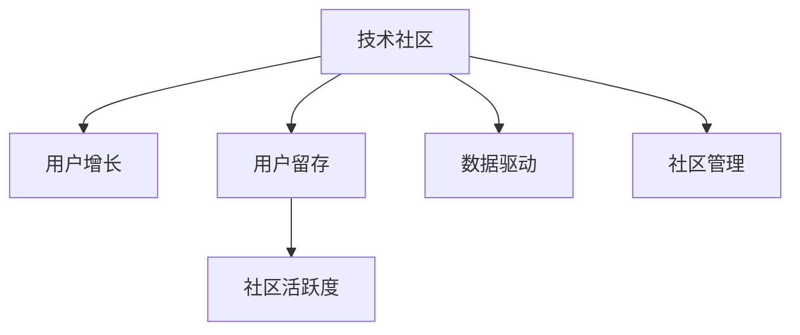

                 

# 技术社区运营：从0到10000用户

> 关键词：技术社区, 用户增长, 社区运营, 用户粘性, 用户留存, 社区管理, 数据驱动, 技术分析

## 1. 背景介绍

### 1.1 问题由来

在互联网行业，技术社区作为一个交流技术、分享经验、促进创新和合作的重要平台，越来越受到重视。无论是开源社区如GitHub、Stack Overflow，还是专业论坛如CSDN、知乎，都在积极探索如何提升用户规模和质量，增强用户粘性，提高社区活跃度。然而，建立一个庞大的技术社区并非易事，需要系统化、持续化的运营策略，尤其是用户增长和留存方面。本文将从0到10000用户的运营策略出发，探索如何构建和运营一个成功的技术社区。

### 1.2 问题核心关键点

- **用户增长**：如何快速吸引并扩大社区用户规模。
- **用户留存**：如何提高用户粘性，减少用户流失。
- **社区活跃度**：如何促进社区内信息流通和互动，形成良性循环。
- **数据驱动**：如何利用数据驱动决策，优化运营策略。
- **社区管理**：如何制定并执行有效的社区管理规则。

### 1.3 问题研究意义

构建和运营一个成功的技术社区，不仅能提升企业在技术领域的影响力，还能带动技术人才的发展和创新。对于企业而言，技术社区成为人才招聘、品牌宣传和技术合作的有效渠道，对于用户而言，技术社区提供了一个学习和分享的平台，促进了知识传播和社区文化的形成。本文旨在系统介绍技术社区运营的核心策略和实践，为社区建设者和运营者提供参考。

## 2. 核心概念与联系

### 2.1 核心概念概述

为更好地理解技术社区运营的核心策略，本节将介绍几个密切相关的核心概念：

- **技术社区**：指围绕特定技术主题或领域，聚集技术爱好者、开发者、专家等的交流平台，包括但不限于开源社区、技术博客、问答论坛等。
- **用户增长**：指通过有效的运营策略，吸引并增加社区用户规模的过程。
- **用户留存**：指通过持续运营，保持已有用户活跃，减少用户流失的策略。
- **社区活跃度**：指社区内信息流通和用户互动的活跃程度，是衡量社区健康的重要指标。
- **数据驱动**：指利用数据分析和数据可视化工具，指导运营决策，优化运营策略。
- **社区管理**：指通过制定规则和执行规则，维护社区秩序和用户行为的策略。

这些核心概念之间的逻辑关系可以通过以下Mermaid流程图来展示：



这个流程图展示了这个概念之间的相互关系：

1. 技术社区通过吸引用户增长，增加社区规模。
2. 用户留存策略有助于维持已有用户的活跃度，减少流失。
3. 社区活跃度直接影响用户粘性和社区整体活力。
4. 数据驱动有助于运营策略的科学决策和效果评估。
5. 社区管理确保社区秩序和用户行为规范。

这些概念共同构成了技术社区运营的核心框架，使得社区能够在健康、有序的环境下发展。通过理解这些核心概念，我们可以更好地把握技术社区运营的方向和手段。

## 3. 核心算法原理 & 具体操作步骤

### 3.1 算法原理概述

技术社区运营的核心理论基础是用户增长模型和社区管理模型，其中用户增长模型主要关注如何通过运营策略吸引和增加用户规模，社区管理模型则侧重于如何通过规则和措施保持社区秩序和用户行为规范。

用户增长模型通常采用漏斗模型，将用户生命周期分为几个阶段，包括获取用户、激活用户、转化用户、提高用户留存率、增加用户贡献度等。每个阶段都有相应的策略和指标，例如AARRR模型（获取用户Acquisition、激活用户Activation、保留用户Retention、获得收益Revenue、推荐用户Referral）。

社区管理模型则更多关注如何通过有效的规则和措施，维护社区秩序，提升用户满意度，减少负面行为和内容。例如通过版主监管、举报系统、惩罚机制等手段，确保社区的健康发展。

### 3.2 算法步骤详解

#### 3.2.1 用户增长策略

1. **用户获取策略**：
   - **搜索引擎优化(SEO)**：优化网站和内容，提升在搜索引擎中的排名，吸引更多用户访问。
   - **社交媒体推广**：通过社交媒体平台，如微信、微博、Twitter等，进行广告投放和内容分享，扩大社区影响力。
   - **合作与联盟**：与相关技术社区、博客、论坛等进行合作，互惠互利，共同推广。
   - **邮件营销**：发送有价值的内容，吸引用户注册和使用。

2. **用户激活策略**：
   - **引导新用户注册和登录**：设计友好的注册和登录流程，提供快速注册选项。
   - **推荐优质内容**：通过个性化推荐系统，向新用户推荐相关话题和文章，增强用户体验。
   - **设置用户门槛**：设置适当的用户门槛，如实名注册、邮箱验证等，提高用户质量。

3. **用户转化策略**：
   - **积分系统和奖励机制**：通过积分系统、勋章、等级等，激励用户参与社区互动和内容贡献。
   - **社区参与活动**：定期组织线上线下活动，如技术讲座、编程马拉松等，吸引用户参与。
   - **提升内容质量**：鼓励高质量内容的创作和分享，形成良性循环。

4. **用户留存策略**：
   - **用户反馈与改进**：及时收集用户反馈，持续改进社区功能和用户体验。
   - **定期通知和互动**：通过邮件、推送通知等方式，保持用户活跃度。
   - **内容更新和多样化**：持续更新社区内容，增加内容的丰富性和多样性，吸引用户回访。

#### 3.2.2 社区管理策略

1. **规则制定与执行**：
   - **社区规则制定**：制定明确的用户行为规范和社区管理规则，如内容发布、评论互动等。
   - **规则执行与监督**：通过版主和管理员团队，监督用户行为，执行规则，处理违规行为。

2. **用户互动与引导**：
   - **话题引导**：根据社区定位和用户兴趣，引导话题讨论，避免过度商业化或偏颇内容。
   - **用户互动**：通过评论、点赞、分享等互动方式，促进用户参与和讨论。

3. **内容审核与优化**：
   - **内容审核**：对社区内容进行审核，及时发现和处理不当内容。
   - **内容优化**：根据用户反馈和数据分析，持续优化社区内容结构，提升用户体验。

4. **激励与惩罚机制**：
   - **激励机制**：通过积分、勋章、等级等奖励机制，激励用户积极参与和贡献。
   - **惩罚机制**：对违规用户进行警告、扣分、禁言等惩罚，维护社区秩序。

### 3.3 算法优缺点

#### 3.3.1 用户增长策略的优点

1. **多渠道覆盖**：通过多种渠道进行推广和运营，覆盖面广，效果显著。
2. **数据驱动优化**：通过数据分析和用户行为分析，不断优化策略，提高用户获取效率。
3. **多样化内容**：丰富内容形式，吸引不同类型的用户，提高社区活跃度。

#### 3.3.2 用户增长策略的缺点

1. **成本高**：用户获取和留存策略需要投入大量资源，如广告费用、人力成本等。
2. **依赖用户自身**：用户获取和留存效果依赖用户自身意愿和行为，难以完全控制。
3. **市场竞争激烈**：技术社区面临激烈的市场竞争，需要不断创新和优化策略。

#### 3.3.3 社区管理策略的优点

1. **秩序维护**：通过明确的规则和严格的执行，维护社区秩序，提升用户满意度。
2. **用户引导**：通过话题引导和互动，促进用户积极参与和讨论，提高社区活跃度。
3. **内容优化**：通过持续优化内容，提升用户体验，增强用户粘性。

#### 3.3.4 社区管理策略的缺点

1. **规则执行难度大**：社区管理需要大量人工监督和执行，规则执行难度大。
2. **用户多样性**：不同用户背景和需求不同，规则制定和执行存在难度。
3. **激励惩罚平衡**：激励和惩罚机制需要平衡，避免过度激励或惩罚影响用户体验。

### 3.4 算法应用领域

基于上述策略，技术社区运营在多个领域得到了广泛应用：

1. **开源社区**：如GitHub、SourceForge等，通过代码托管、版本控制、项目管理和社区讨论，吸引开发者参与。
2. **技术博客和论坛**：如CSDN、知乎、Stack Overflow等，提供技术文章、问答、讨论等功能，增强用户粘性。
3. **技术培训和认证**：如Coursera、Udacity、Codecademy等，通过课程培训和认证，提高用户技能和社区影响力。
4. **技术合作与交流**：通过技术社区平台，促进企业间、机构间的技术合作和交流。

这些应用领域展示了技术社区运营的广泛性和多样性，也为社区建设者和运营者提供了丰富的实践参考。

## 4. 数学模型和公式 & 详细讲解 & 举例说明

### 4.1 数学模型构建

用户增长模型通常采用漏斗模型，将用户生命周期分为几个阶段，包括获取用户、激活用户、转化用户、提高用户留存率、增加用户贡献度等。以AARRR模型为例，其数学模型如下：

- **获取用户**：用户数量 $U_{A}$ 的增长函数：$f_{A}(t)$
- **激活用户**：用户数量 $U_{R}$ 的增长函数：$f_{R}(t)$
- **保留用户**：用户数量 $U_{A}$ 的保留率函数：$r_A(t)$
- **获得收益**：用户数量 $U_{R}$ 的转化率函数：$c_{R}(t)$
- **推荐用户**：用户数量 $U_{R}$ 的推荐率函数：$p_{R}(t)$

社区管理模型则更多关注如何通过规则和措施，维护社区秩序和用户行为规范。例如，通过版主监管、举报系统、惩罚机制等手段，确保社区的健康发展。

### 4.2 公式推导过程

以获取用户模型为例，假设每天新注册用户数量为 $u(t)$，激活用户数量为 $a(t)$，保留用户数量为 $r(t)$，则获取用户模型的基本公式为：

$$
f_{A}(t) = u(t)
$$

激活用户模型的基本公式为：

$$
f_{R}(t) = a(t) \times r_A(t)
$$

保留用户模型的基本公式为：

$$
r_{A}(t) = \alpha \times f_{R}(t-1)
$$

其中 $\alpha$ 为保留率系数。

### 4.3 案例分析与讲解

假设某技术社区的日新增用户数量 $u(t)$ 服从泊松分布 $P(\lambda)$，激活率 $\lambda=10$，保留率为 $0.8$，则获取用户模型和激活用户模型的公式推导如下：

1. **获取用户模型**：

$$
f_{A}(t) = P(\lambda) = \frac{\lambda^t}{t!}e^{-\lambda}
$$

2. **激活用户模型**：

$$
f_{R}(t) = f_{A}(t) \times r_A(t) = P(\lambda) \times 0.8^t
$$

通过上述公式，社区运营者可以计算每天新增激活用户数量，进而评估社区获取和激活用户的效率。

## 5. 项目实践：代码实例和详细解释说明

### 5.1 开发环境搭建

在进行社区运营数据分析时，我们通常需要搭建基于Python的数据分析环境。以下是使用Python进行数据分析的开发环境配置流程：

1. 安装Anaconda：从官网下载并安装Anaconda，用于创建独立的Python环境。

2. 创建并激活虚拟环境：
```bash
conda create -n py分析环境 python=3.8 
conda activate py分析环境
```

3. 安装Python数据分析包：
```bash
pip install pandas numpy matplotlib seaborn jupyter notebook ipython
```

4. 安装社区数据分析工具：
```bash
pip install uvicorn flask
```

完成上述步骤后，即可在`py分析环境`环境中开始社区数据分析实践。

### 5.2 源代码详细实现

以下是一个简单的社区数据分析示例，使用Python的Pandas库对社区用户增长和留存数据进行可视化分析。

```python
import pandas as pd
import matplotlib.pyplot as plt

# 读取社区用户增长和留存数据
user_growth_data = pd.read_csv('user_growth.csv')
user_retention_data = pd.read_csv('user_retention.csv')

# 用户增长数据可视化
plt.figure(figsize=(10, 5))
plt.plot(user_growth_data['day'], user_growth_data['new_users'], label='New Users')
plt.xlabel('Days')
plt.ylabel('Number of New Users')
plt.title('User Growth Over Time')
plt.legend()
plt.show()

# 用户留存数据可视化
plt.figure(figsize=(10, 5))
plt.plot(user_retention_data['day'], user_retention_data['active_users'], label='Active Users')
plt.xlabel('Days')
plt.ylabel('Number of Active Users')
plt.title('User Retention Over Time')
plt.legend()
plt.show()
```

### 5.3 代码解读与分析

上述代码示例展示了如何利用Pandas库对社区用户增长和留存数据进行可视化分析：

1. **读取数据**：使用Pandas库的`read_csv`方法读取用户增长和留存数据。
2. **用户增长数据可视化**：使用Matplotlib库的`plot`方法绘制用户增长趋势图，直观展示每天新增用户的数量。
3. **用户留存数据可视化**：使用Matplotlib库的`plot`方法绘制用户留存趋势图，直观展示每天活跃用户的数量。

通过上述代码，社区运营者可以直观了解用户增长和留存的变化趋势，及时发现并解决问题，优化运营策略。

## 6. 实际应用场景

### 6.1 开源社区运营

开源社区如GitHub、GitLab等，通过代码托管、版本控制、项目管理和社区讨论等功能，吸引了大量开发者参与。其运营策略包括：

1. **项目引导和优化**：通过项目管理工具如Jira、Trello等，引导开发者参与项目，优化项目结构和代码质量。
2. **社区活动和培训**：定期举办线上线下技术讲座、编程马拉松等活动，增强社区凝聚力。
3. **用户反馈和改进**：及时收集用户反馈，持续改进社区功能，提升用户体验。

### 6.2 技术博客和论坛运营

技术博客如CSDN、知乎、Stack Overflow等，通过提供技术文章、问答、讨论等功能，吸引了大量技术爱好者和开发者。其运营策略包括：

1. **高质量内容**：鼓励高质量内容的创作和分享，通过奖励机制激励用户。
2. **互动与引导**：通过评论、点赞、分享等互动方式，促进用户积极参与和讨论。
3. **用户社区建设**：建立用户社区，如技术小组、兴趣讨论组等，增强用户粘性。

### 6.3 技术培训和认证运营

技术培训和认证平台如Coursera、Udacity、Codecademy等，通过课程培训和认证，提高了用户的技术技能和社区影响力。其运营策略包括：

1. **课程设计和管理**：设计高质量课程内容，管理课程更新和发布，确保课程质量。
2. **学习支持与社区**：提供学习支持系统，建立学习社区，增强用户学习体验。
3. **证书与奖励**：提供认证证书和奖励机制，激励用户完成课程和认证。

## 7. 工具和资源推荐

### 7.1 学习资源推荐

为了帮助开发者系统掌握技术社区运营的理论基础和实践技巧，这里推荐一些优质的学习资源：

1. **《社区运营之道》系列博文**：由社区运营专家撰写，深入浅出地介绍了社区运营的核心策略和实践方法。
2. **《社区管理与运营》课程**：由知名大学开设的社区运营和管理的在线课程，涵盖社区运营的核心概念和策略。
3. **《社区运营实战》书籍**：社区运营实战书籍，通过案例分析，介绍社区运营的详细流程和实践技巧。
4. **社区运营交流平台**：如Medium、知乎等，交流社区运营经验，获取行业动态。
5. **社区运营工具集**：如HubSpot、Facebook等，提供社区运营工具和资源，帮助运营者提升效率。

通过对这些资源的学习实践，相信你一定能够快速掌握技术社区运营的精髓，并用于解决实际的社区运营问题。

### 7.2 开发工具推荐

高效的社区运营离不开优秀的工具支持。以下是几款用于社区运营开发的常用工具：

1. **Flask**：轻量级的Web框架，适合开发社区管理后台和用户互动功能。
2. **uvicorn**：异步非阻塞服务器，适合处理社区高并发请求。
3. **Jupyter Notebook**：交互式开发环境，适合数据分析和社区运营决策。
4. **TensorBoard**：TensorFlow配套的可视化工具，适合社区数据监控和分析。
5. **Prometheus和Grafana**：监控和数据可视化工具，适合社区运营指标监控和分析。

合理利用这些工具，可以显著提升技术社区运营的开发效率，加快创新迭代的步伐。

### 7.3 相关论文推荐

技术社区运营的研究源于学界的持续研究。以下是几篇奠基性的相关论文，推荐阅读：

1. **《社区构建与运营》**：研究社区构建和运营的核心策略和方法，提供系统化的指导。
2. **《用户增长与留存》**：研究用户增长的理论基础和实践策略，提供数据驱动的运营方案。
3. **《社区管理与激励》**：研究社区管理的核心概念和激励机制，提供可操作的实施方案。
4. **《用户行为分析》**：研究用户行为和社区互动的定量分析方法，提供优化运营策略的数据支撑。
5. **《社区网络模型》**：研究社区网络的结构和动态，提供社区运营的深度分析工具。

这些论文代表了大数据和社区运营领域的研究进展，通过学习这些前沿成果，可以帮助研究者把握学科前进方向，激发更多的创新灵感。

## 8. 总结：未来发展趋势与挑战

### 8.1 总结

本文对技术社区运营的核心策略和实践进行了系统介绍。首先阐述了技术社区运营的背景和意义，明确了用户增长和社区管理的核心策略。其次，从原理到实践，详细讲解了社区运营的数学模型和具体操作步骤，给出了社区运营任务开发的完整代码实例。同时，本文还广泛探讨了社区运营在开源社区、技术博客、技术培训等多个领域的应用前景，展示了社区运营范式的广泛适用性。此外，本文精选了社区运营的学习资源和开发工具，力求为社区建设者和运营者提供全面的技术指引。

通过本文的系统梳理，可以看到，技术社区运营的核心理论基础包括用户增长和社区管理，通过多种运营策略和工具，可以有效地吸引用户、提高用户粘性、保持社区活跃度。未来，随着技术社区运营的不断演进，必将进一步提升社区用户的参与度和满意度，推动技术社区的健康发展。

### 8.2 未来发展趋势

展望未来，技术社区运营将呈现以下几个发展趋势：

1. **数据驱动**：通过大数据和机器学习技术，深入分析用户行为和社区数据，指导运营策略的优化。
2. **自动化管理**：利用AI和机器学习算法，实现社区内容的自动审核、用户行为自动识别和预警。
3. **跨平台整合**：通过API和数据同步技术，实现不同平台和社区的整合和数据共享。
4. **个性化服务**：通过用户行为分析和推荐算法，提供个性化的内容和推荐服务。
5. **社区生态建设**：建立跨社区的生态系统，促进社区间的交流和合作。

以上趋势凸显了技术社区运营的广阔前景。这些方向的探索发展，必将进一步提升社区用户的参与度和满意度，推动技术社区的健康发展。

### 8.3 面临的挑战

尽管技术社区运营已经取得了显著进展，但在迈向更加智能化、普适化应用的过程中，它仍面临着诸多挑战：

1. **用户多样性**：不同用户背景和需求不同，社区管理和运营需要灵活应对。
2. **内容质量控制**：社区内容的真实性和质量控制，防止不良内容扩散。
3. **运营成本高**：社区运营需要投入大量资源，如人力、技术支持等。
4. **用户体验提升**：如何提高用户体验，增强用户粘性，需要持续优化。
5. **数据安全和隐私**：社区运营需要保障用户数据安全和隐私，防止数据泄露。

正视社区运营面临的这些挑战，积极应对并寻求突破，将是大数据和社区运营迈向成熟的必由之路。相信随着技术的发展和优化，社区运营技术将继续提升社区用户的参与度和满意度，推动技术社区的健康发展。

### 8.4 研究展望

面对技术社区运营所面临的挑战，未来的研究需要在以下几个方面寻求新的突破：

1. **个性化推荐算法**：开发更加高效的个性化推荐算法，提升用户满意度和社区活跃度。
2. **社区健康评估**：建立社区健康评估指标体系，实时监控和评估社区运营效果。
3. **自动化管理工具**：开发自动化管理工具，减少人工干预，提升运营效率。
4. **多平台整合技术**：研究跨平台整合技术，实现不同平台和社区的整合和数据共享。
5. **用户行为分析**：深入研究用户行为分析技术，优化社区运营策略。

这些研究方向的探索，必将引领技术社区运营技术的不断进步，为社区建设者和运营者提供更高效、更智能的运营手段。面向未来，技术社区运营需要从多个维度协同发力，共同推动社区的可持续健康发展。

## 9. 附录：常见问题与解答

**Q1：社区运营的主要策略是什么？**

A: 社区运营的主要策略包括用户增长策略和社区管理策略。用户增长策略主要关注如何吸引和扩大社区用户规模，社区管理策略则侧重于如何通过规则和措施保持社区秩序和用户行为规范。

**Q2：如何进行社区用户增长？**

A: 社区用户增长的策略包括SEO、社交媒体推广、合作与联盟、邮件营销等，通过多种渠道进行推广和运营，覆盖面广，效果显著。

**Q3：如何提高社区用户的留存率？**

A: 提高社区用户留存率的策略包括用户反馈与改进、定期通知和互动、内容更新和多样化等，通过持续优化社区功能和用户体验，增强用户粘性。

**Q4：社区运营的挑战有哪些？**

A: 社区运营的挑战包括用户多样性、内容质量控制、运营成本高、用户体验提升、数据安全和隐私等，需要通过科学策略和技术手段逐一应对。

**Q5：社区运营的未来趋势是什么？**

A: 社区运营的未来趋势包括数据驱动、自动化管理、跨平台整合、个性化服务、社区生态建设等，通过技术创新和优化，不断提升社区用户的参与度和满意度。

---

作者：禅与计算机程序设计艺术 / Zen and the Art of Computer Programming

