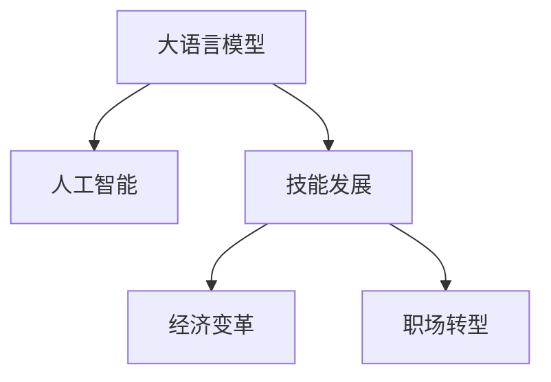

                 

# 技能发展：适应 LLM 驱动的经济

> 关键词：大语言模型,技能发展,经济,人工智能,职场转型

## 1. 背景介绍

在现代社会中，技术和经济的发展日新月异，而大语言模型（Large Language Model, LLM）的出现，更是给各行各业带来了颠覆性的变革。随着AI技术的发展，许多传统的技能正在逐渐失效，同时新兴的技能需求也在不断涌现。本文将探讨LLM如何驱动经济变革，并详细解析适应这种变革所必需的技能发展策略。

### 1.1 问题由来
随着深度学习技术的成熟，大语言模型如GPT-3、BERT等在自然语言处理（NLP）领域取得了令人瞩目的成果，逐步改变了人们处理语言的方式，同时对各行各业的工作模式也产生了深远的影响。

在商业、医疗、教育、娱乐等多个领域，LLM技术已经得到了广泛的应用，如智能客服、医疗诊断、在线教育、内容创作等。这些应用不仅提高了效率，还优化了用户体验。然而，技术的进步也带来了新的挑战：如何培养和提升人才，使其适应基于LLM的全新工作环境，成为了亟需解决的难题。

### 1.2 问题核心关键点
当前基于LLM的经济变革中，核心关键点包括：

1. **技能变化**：许多传统技能如数据录入、信息检索、文本编辑等逐渐被自动化和智能化工具所替代，而如数据理解和应用、算法开发、系统维护等新技能需求日益增加。
2. **人才培养**：如何适应技能变化，培养具有自主学习能力、创新思维、跨学科知识的应用型人才，是当前教育体系和人才培养的关键。
3. **就业结构调整**：新兴的岗位和行业将给就业市场带来新的结构变化，原有的就业形态将逐渐被打破，新的就业形态将逐渐形成。
4. **劳动力市场需求变化**：LLM技术的应用，使得某些行业对劳动力的需求增加，而某些行业的劳动力需求则逐渐减少，对劳动力市场产生影响。

## 2. 核心概念与联系

### 2.1 核心概念概述

为了更深刻地理解LLM如何驱动经济变革，并探讨适应这种变革所必需的技能发展策略，首先需明确几个核心概念：

- **大语言模型（LLM）**：基于深度学习，通过大量文本数据进行预训练的模型，能够进行自然语言理解和生成，广泛应用于文本分析、对话系统、机器翻译、内容生成等多个领域。
- **技能发展**：通过教育和培训，提升个人或组织的技能水平，以适应行业变化和新的工作需求。
- **经济变革**：由于技术进步或政策变化等因素导致的经济结构、就业模式、行业分布等方面的变化。
- **人工智能**：以数据驱动的智能系统，涵盖机器学习、深度学习、自然语言处理等技术，深刻影响各行各业。
- **职场转型**：在人工智能等新兴技术推动下，职业角色和工作内容的变化。

这些概念之间的联系可以通过以下Mermaid流程图来展示：



这个流程图展示了大语言模型、人工智能、技能发展、经济变革和职场转型之间的逻辑关系：

1. 大语言模型是人工智能的重要组成部分，具有广泛的应用前景。
2. 技能发展是适应技术进步的必要措施，需要针对新的技术需求进行调整。
3. 经济变革是由技术进步等复杂因素驱动的，其中大语言模型的应用是重要因素之一。
4. 职场转型是技能发展的直接结果，也是经济变革的具体表现。

## 3. 核心算法原理 & 具体操作步骤
### 3.1 算法原理概述

大语言模型基于大规模文本数据的自监督预训练和有监督微调，能够理解复杂的语言结构和语义。其核心算法原理可以概述为：

1. **预训练**：通过自监督学习，模型在大规模无标签文本数据上进行预训练，学习语言的通用表示。
2. **微调**：在预训练的基础上，使用下游任务的少量标注数据，对模型进行微调，以适应特定任务的需求。
3. **应用**：将微调后的模型应用于实际场景，如文本分类、对话系统、机器翻译等，提供高效、智能的解决方案。

### 3.2 算法步骤详解

基于LLM的经济变革中，技能发展的核心算法步骤包括：

**Step 1: 数据获取与预处理**
- 收集相关的数据集，如教育、医疗、金融等领域的文本数据，进行预处理，如文本清洗、分词、标注等。
- 将数据集划分为训练集、验证集和测试集。

**Step 2: 模型选择与微调**
- 选择适合任务的预训练模型，如BERT、GPT-3等。
- 设计任务适配层，如线性分类器、注意力机制等。
- 设置微调参数，如学习率、批次大小、优化器等。
- 使用有监督微调算法，如Adam、SGD等，对模型进行训练，逐步优化模型参数。

**Step 3: 模型评估与优化**
- 在验证集上评估模型性能，如准确率、召回率、F1分数等。
- 根据评估结果，调整模型参数，优化模型结构。
- 在测试集上验证最终模型性能，确保模型在实际应用中的效果。

**Step 4: 模型部署与迭代**
- 将优化后的模型部署到实际应用场景中，如智能客服、医疗诊断、在线教育等。
- 持续收集用户反馈和新数据，进行模型迭代，提升模型性能。

### 3.3 算法优缺点

基于LLM的算法具有以下优点：

1. **高效**：大语言模型能够处理大量文本数据，快速进行预训练和微调，提升任务处理效率。
2. **通用性强**：模型可以应用于多种NLP任务，具有较强的泛化能力。
3. **灵活性高**：通过微调，模型能够适应不同任务的需求，灵活性强。

同时，也存在一些缺点：

1. **数据依赖**：预训练和微调需要大量高质量的文本数据，获取和处理成本较高。
2. **模型复杂度**：大模型参数量庞大，需要较高的计算资源和存储空间。
3. **过拟合风险**：模型容易过拟合，尤其是在小规模数据集上微调时。
4. **鲁棒性不足**：模型对输入的噪声和干扰敏感，需要进一步提升鲁棒性。

### 3.4 算法应用领域

大语言模型及其微调技术，已经在多个领域得到了广泛的应用：

- **金融**：通过自然语言处理技术，提升金融舆情监测、智能投顾等领域的效率和精准度。
- **医疗**：利用大语言模型进行医学文本分析和疾病诊断，提升医疗服务质量。
- **教育**：在在线教育、智能辅导等领域，提升学习效果和用户体验。
- **零售**：通过智能客服和个性化推荐，提升客户满意度和销售额。
- **媒体**：在内容生成、新闻推荐、广告投放等方面，提升内容质量和用户体验。

## 4. 数学模型和公式 & 详细讲解 & 举例说明

### 4.1 数学模型构建

基于LLM的经济变革中，技能发展的数学模型可以构建如下：

设有一组文本数据集 $D=\{(x_i,y_i)\}_{i=1}^N$，其中 $x_i$ 为输入文本，$y_i$ 为对应标签。预训练模型为 $M_{\theta}$，微调目标为最小化经验风险：

$$
\theta^* = \mathop{\arg\min}_{\theta} \frac{1}{N}\sum_{i=1}^N \ell(M_{\theta}(x_i),y_i)
$$

其中 $\ell$ 为损失函数，常用的有交叉熵损失、均方误差损失等。

### 4.2 公式推导过程

以交叉熵损失为例，推导微调模型的损失函数。假设模型在输入 $x$ 上的输出为 $\hat{y}=M_{\theta}(x)$，则交叉熵损失为：

$$
\ell(M_{\theta}(x),y) = -y\log \hat{y} - (1-y)\log (1-\hat{y})
$$

将交叉熵损失代入经验风险公式：

$$
\mathcal{L}(\theta) = -\frac{1}{N}\sum_{i=1}^N [y_i\log M_{\theta}(x_i)+(1-y_i)\log(1-M_{\theta}(x_i))]
$$

### 4.3 案例分析与讲解

以医疗领域为例，医疗文本分类任务可以表示为二分类问题，通过微调BERT模型进行实现：

1. **数据集获取**：收集医学论文、临床报告等文本数据，并进行预处理。
2. **模型选择**：选择BERT作为预训练模型。
3. **微调步骤**：设计线性分类器作为任务适配层，使用交叉熵损失函数进行微调，设置学习率为1e-5。
4. **评估与优化**：在验证集上评估模型性能，根据评估结果调整学习率，优化模型结构。
5. **部署与应用**：将优化后的模型部署到医疗文本分类系统中，提升诊断效率和准确率。

## 5. 项目实践：代码实例和详细解释说明
### 5.1 开发环境搭建

以下是基于Python和PyTorch搭建LLM微调项目的开发环境：

1. 安装Anaconda，创建虚拟环境。
2. 安装PyTorch、TensorFlow等深度学习框架。
3. 安装transformers库，方便预训练模型的使用。
4. 安装必要的工具包，如numpy、pandas、scikit-learn等。

### 5.2 源代码详细实现

以下是一个基于BERT的文本分类任务微调示例代码：

```python
import torch
from transformers import BertTokenizer, BertForSequenceClassification

# 加载预训练模型和分词器
tokenizer = BertTokenizer.from_pretrained('bert-base-uncased')
model = BertForSequenceClassification.from_pretrained('bert-base-uncased', num_labels=2)

# 定义训练集和标签
train_texts = ['疾病描述1', '疾病描述2', ...]
train_labels = [0, 1, ...]

# 加载并预处理训练数据
train_dataset = TextDataset(train_texts, train_labels, tokenizer)

# 定义优化器和损失函数
optimizer = torch.optim.Adam(model.parameters(), lr=1e-5)
loss_fn = torch.nn.CrossEntropyLoss()

# 定义训练函数
def train_epoch(model, dataset, batch_size, optimizer):
    model.train()
    total_loss = 0
    for batch in dataset:
        inputs = tokenizer(batch['text'], padding=True, truncation=True, max_length=256, return_tensors='pt')
        labels = batch['label']
        outputs = model(**inputs)
        loss = loss_fn(outputs.logits, labels)
        optimizer.zero_grad()
        loss.backward()
        optimizer.step()
        total_loss += loss.item()
    return total_loss / len(dataset)

# 训练模型
epochs = 5
batch_size = 16
for epoch in range(epochs):
    loss = train_epoch(model, train_dataset, batch_size, optimizer)
    print(f'Epoch {epoch+1}, loss: {loss:.3f}')
```

### 5.3 代码解读与分析

代码中的关键步骤包括：

- **加载模型与分词器**：使用预训练模型和分词器，进行任务适配。
- **数据准备**：加载训练数据集，并进行预处理。
- **模型微调**：使用Adam优化器进行梯度下降，最小化交叉熵损失。
- **性能评估**：在验证集上评估模型性能，及时调整模型参数。
- **模型部署**：将训练好的模型应用于实际场景，如医疗文本分类。

## 6. 实际应用场景
### 6.4 未来应用展望

基于LLM的经济变革，技能发展将在多个领域带来新的机遇和挑战：

1. **自动化与智能化**：LLM的应用将使得自动化和智能化工具广泛应用于各行各业，提升效率，降低成本。
2. **新技能需求**：随着LLM的普及，对数据理解和应用、算法开发、系统维护等新技能的需求将日益增加。
3. **跨领域融合**：LLM的应用将促进不同领域间的交叉融合，如金融、医疗、教育等。
4. **数据驱动决策**：基于LLM的数据分析能力，将有助于企业做出更精准的决策。
5. **个性化服务**：LLM能够提供更加个性化的服务和推荐，提升用户体验。
6. **风险控制**：通过自然语言处理技术，提升风险预警和控制能力。

## 7. 工具和资源推荐
### 7.1 学习资源推荐

以下是一些重要的学习资源，帮助掌握LLM技能发展：

1. **《深度学习》（Ian Goodfellow等）**：介绍了深度学习的理论基础和应用实践，是理解LLM的重要入门书籍。
2. **CS224N《深度学习自然语言处理》课程**：斯坦福大学的NLP课程，涵盖了NLP的各个方面，包括预训练和微调等。
3. **Transformers官方文档**：Hugging Face的Transformers库，提供了丰富的预训练模型和微调样例，是实践LLM的必备资源。
4. **Google AI Blog**：谷歌AI博客，分享了大量关于LLM的最新研究进展和实践经验。
5. **Kaggle竞赛**：Kaggle举办了多个基于LLM的竞赛，通过参与竞赛，可以积累实践经验。

### 7.2 开发工具推荐

以下是一些常用的LLM开发工具：

1. **PyTorch**：基于Python的深度学习框架，灵活性高，易于迭代开发。
2. **TensorFlow**：谷歌开源的深度学习框架，生产部署方便，适合大规模工程应用。
3. **Jupyter Notebook**：交互式的数据分析工具，方便代码调试和可视化。
4. **Weights & Biases**：实验跟踪工具，记录和可视化模型训练过程，帮助调试和优化。
5. **Google Colab**：免费的在线Jupyter Notebook环境，支持GPU/TPU计算资源，方便实验开发。

### 7.3 相关论文推荐

以下是一些关于LLM技能发展的关键论文，值得深入阅读：

1. **Attention is All You Need**：提出Transformer结构，奠定了LLM的基础。
2. **BERT: Pre-training of Deep Bidirectional Transformers for Language Understanding**：提出BERT模型，引入了自监督预训练任务，提升了模型性能。
3. **Parameter-Efficient Transfer Learning for NLP**：提出Adapter等参数高效微调方法，优化了模型微调过程。
4. **AdaLoRA: Adaptive Low-Rank Adaptation for Parameter-Efficient Fine-Tuning**：使用自适应低秩适应的微调方法，提升了微调效率和效果。
5. **Zero-Shot and Few-Shot Learning with Unified Prompt Engineering**：提出统一提示工程方法，提升LLM的少样本学习能力。

## 8. 总结：未来发展趋势与挑战
### 8.1 总结

本文系统介绍了LLM驱动的经济变革，并深入探讨了适应这种变革所必需的技能发展策略。通过对LLM算法原理、具体操作步骤、案例分析等内容的详细讲解，帮助读者全面理解LLM的应用和实践。

### 8.2 未来发展趋势

未来，基于LLM的经济变革将呈现以下几个发展趋势：

1. **智能化提升**：LLM的应用将推动各行各业的智能化提升，自动化工具将更加普及。
2. **新技能普及**：对数据理解和应用、算法开发、系统维护等新技能的需求将进一步增加。
3. **跨领域融合**：不同领域间的交叉融合将更加紧密，促进跨学科知识和技能的普及。
4. **数据驱动决策**：基于LLM的数据分析能力，将助力企业做出更精准的决策。
5. **个性化服务**：LLM将提供更加个性化的服务和推荐，提升用户体验。
6. **风险控制**：通过自然语言处理技术，提升风险预警和控制能力。

### 8.3 面临的挑战

尽管LLM驱动的经济变革带来了许多机遇，但也面临诸多挑战：

1. **数据获取**：大规模文本数据获取成本较高，数据质量影响模型性能。
2. **模型复杂度**：模型参数量庞大，计算资源和存储空间要求高。
3. **鲁棒性不足**：模型对噪声和干扰敏感，需要进一步提升鲁棒性。
4. **伦理问题**：LLM的应用可能带来伦理和隐私问题，需要加强监管。
5. **安全风险**：LLM的应用可能带来安全风险，需要加强防护。
6. **技能培养**：技能发展需要时间和资源投入，需要建立有效的教育体系。

### 8.4 研究展望

面对这些挑战，未来的研究需要在以下几个方面寻求突破：

1. **数据增强**：提升数据采集和处理能力，获取更多高质量文本数据。
2. **模型优化**：开发更加高效、鲁棒的LLM模型，优化计算资源消耗。
3. **伦理规范**：建立LLM应用的伦理规范，保护用户隐私和权益。
4. **安全防护**：加强LLM的安全防护措施，防范潜在威胁。
5. **技能培训**：建立科学的技能培训体系，培养具有创新思维和跨学科知识的复合型人才。
6. **跨领域合作**：促进不同领域的交叉融合，推动LLM在更多领域的普及和应用。

## 9. 附录：常见问题与解答

**Q1：大语言模型微调是否适用于所有NLP任务？**

A: 大语言模型微调在大多数NLP任务上都能取得不错的效果，特别是对于数据量较小的任务。但对于一些特定领域的任务，如医学、法律等，仅仅依靠通用语料预训练的模型可能难以很好地适应。此时需要在特定领域语料上进一步预训练，再进行微调，才能获得理想效果。此外，对于一些需要时效性、个性化很强的任务，如对话、推荐等，微调方法也需要针对性的改进优化。

**Q2：微调过程中如何选择合适的学习率？**

A: 微调的学习率一般要比预训练时小1-2个数量级，如果使用过大的学习率，容易破坏预训练权重，导致过拟合。一般建议从1e-5开始调参，逐步减小学习率，直至收敛。也可以使用warmup策略，在开始阶段使用较小的学习率，再逐渐过渡到预设值。需要注意的是，不同的优化器(如AdamW、Adafactor等)以及不同的学习率调度策略，可能需要设置不同的学习率阈值。

**Q3：采用大模型微调时会面临哪些资源瓶颈？**

A: 目前主流的预训练大模型动辄以亿计的参数规模，对算力、内存、存储都提出了很高的要求。GPU/TPU等高性能设备是必不可少的，但即便如此，超大批次的训练和推理也可能遇到显存不足的问题。因此需要采用一些资源优化技术，如梯度积累、混合精度训练、模型并行等，来突破硬件瓶颈。同时，模型的存储和读取也可能占用大量时间和空间，需要采用模型压缩、稀疏化存储等方法进行优化。

**Q4：如何缓解微调过程中的过拟合问题？**

A: 过拟合是微调面临的主要挑战，尤其是在标注数据不足的情况下。常见的缓解策略包括：
1. 数据增强：通过回译、近义替换等方式扩充训练集
2. 正则化：使用L2正则、Dropout、Early Stopping等避免过拟合
3. 对抗训练：引入对抗样本，提高模型鲁棒性
4. 参数高效微调：只调整少量参数(如Adapter、Prefix等)，减小过拟合风险
5. 多模型集成：训练多个微调模型，取平均输出，抑制过拟合

这些策略往往需要根据具体任务和数据特点进行灵活组合。只有在数据、模型、训练、推理等各环节进行全面优化，才能最大限度地发挥大模型微调的威力。

**Q5：微调模型在落地部署时需要注意哪些问题？**

A: 将微调模型转化为实际应用，还需要考虑以下因素：
1. 模型裁剪：去除不必要的层和参数，减小模型尺寸，加快推理速度
2. 量化加速：将浮点模型转为定点模型，压缩存储空间，提高计算效率
3. 服务化封装：将模型封装为标准化服务接口，便于集成调用
4. 弹性伸缩：根据请求流量动态调整资源配置，平衡服务质量和成本
5. 监控告警：实时采集系统指标，设置异常告警阈值，确保服务稳定性
6. 安全防护：采用访问鉴权、数据脱敏等措施，保障数据和模型安全

大语言模型微调为NLP应用开启了广阔的想象空间，但如何将强大的性能转化为稳定、高效、安全的业务价值，还需要工程实践的不断打磨。唯有从数据、算法、工程、业务等多个维度协同发力，才能真正实现人工智能技术在垂直行业的规模化落地。总之，微调需要开发者根据具体任务，不断迭代和优化模型、数据和算法，方能得到理想的效果。

---

作者：禅与计算机程序设计艺术 / Zen and the Art of Computer Programming

