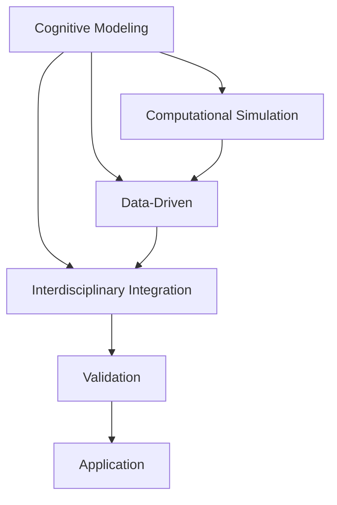

                 

# 探索人类认知：人类计算为理解思维提供新视角

## 1. 背景介绍

在人工智能和计算科学的快速发展背景下，人类认知的探索成为跨学科研究的重点领域。本文旨在探讨人类计算在理解人类认知过程中所扮演的角色，并展望其未来发展方向。

### 1.1 问题由来

人类认知的复杂性使得对其深入理解成为科学界的长期挑战。神经科学、心理学、哲学等多个学科为此付出了巨大努力，但人类思维的本质仍然是一个未解之谜。近年来，计算科学和人工智能技术的飞速发展，为人类认知的探索提供了新的视角和方法。

人类计算指利用计算机模拟人类认知过程，从而理解其机制和特征。其核心思想是通过对人类认知过程的抽象建模，借助计算技术，模拟和分析人类的思维活动。这一方法近年来在学术界和工业界得到了广泛应用，成为理解人类认知的重要工具。

### 1.2 问题核心关键点

人类计算的核心关键点包括：

- **认知建模**：通过计算模型，对人类认知过程进行抽象建模，如神经元模型、符号推理模型等。
- **计算模拟**：利用计算机进行认知过程的模拟实验，理解其动态行为。
- **数据驱动**：采用大规模人类行为数据，训练和优化认知模型。
- **跨学科融合**：结合神经科学、心理学、计算科学等多学科知识，进行综合性研究。

## 2. 核心概念与联系

### 2.1 核心概念概述

为了更好地理解人类计算的基本原理和框架，本节将介绍几个核心概念：

- **认知建模(Cognitive Modeling)**：通过数学和计算模型，对人类认知过程进行建模，以理解其行为规律。
- **计算模拟(Computational Simulation)**：利用计算机进行认知模型的仿真实验，观察模型行为，验证其有效性。
- **数据驱动(Data-Driven)**：采用大规模人类行为数据，训练和优化认知模型，提高其预测和解释能力。
- **跨学科融合(Interdisciplinary Integration)**：将认知科学、神经科学、心理学、计算机科学等不同学科的知识和工具结合起来，进行综合研究。

这些核心概念之间的逻辑关系可以通过以下Mermaid流程图来展示：



这个流程图展示了他人类计算的核心概念及其之间的关系：

1. 认知建模为计算模拟提供理论基础。
2. 计算模拟通过数据驱动不断优化认知模型。
3. 跨学科融合带来更加全面、深入的认知理解。
4. 最终通过验证和应用将认知模型转化为实际应用价值。

## 3. 核心算法原理 & 具体操作步骤

### 3.1 算法原理概述

人类计算的核心算法原理可以概括为以下几点：

- **认知抽象**：将复杂的人类认知过程抽象为数学和计算模型，如神经网络、符号推理系统等。
- **动态仿真**：通过仿真实验，观察认知模型的动态行为，理解其学习、推理、决策等过程。
- **数据驱动训练**：采用大规模人类行为数据，训练和优化认知模型，提升其预测能力和解释力。
- **跨学科融合**：结合不同学科的知识和方法，如神经科学、心理学、语言学等，进行综合研究。

这些算法原理共同构成了人类计算的理论框架，使其能够模拟和理解人类认知过程。

### 3.2 算法步骤详解

人类计算的主要算法步骤包括：

1. **认知建模**：选择合适的认知模型，如神经网络、符号推理系统等，定义模型的结构和参数。
2. **数据准备**：收集和预处理大规模人类行为数据，如神经元放电数据、语言处理数据等。
3. **训练优化**：使用数据驱动方法，训练认知模型，优化模型参数，提高其预测和解释能力。
4. **仿真实验**：通过计算机模拟，观察认知模型的动态行为，分析其学习、推理、决策等过程。
5. **验证应用**：通过实际应用场景的验证，评估认知模型的有效性，进行改进和优化。

### 3.3 算法优缺点

人类计算的优点包括：

- **灵活性**：能够灵活模拟和分析各种认知过程，涵盖语言、推理、决策等多个方面。
- **可解释性**：通过数学和计算模型，解释认知过程的内部机制和动态行为。
- **数据驱动**：采用大规模人类行为数据，训练和优化认知模型，提高其预测和解释能力。

缺点则包括：

- **复杂性**：认知模型通常较为复杂，需要大量的数据和计算资源进行训练和优化。
- **局限性**：认知模型可能无法完全模拟人类认知的复杂性和多样性，存在一定的局限性。
- **计算成本**：大规模计算实验和数据处理需要大量的计算资源和时间。

尽管存在这些局限性，但人类计算在理解和探索人类认知方面已经取得了显著进展，成为认知科学领域的重要工具。

### 3.4 算法应用领域

人类计算在多个领域得到了广泛应用，包括但不限于：

- **神经科学**：模拟神经元放电过程，理解认知的基础机制。
- **心理学**：通过符号推理模型，理解人类决策和推理过程。
- **语言学**：利用语言处理数据，理解语言理解和生成机制。
- **人工智能**：将人类计算方法应用于机器学习和深度学习，提升模型的解释性和鲁棒性。
- **社会科学**：通过计算仿真，理解人类社会行为和互动过程。

## 4. 数学模型和公式 & 详细讲解 & 举例说明

### 4.1 数学模型构建

本节将使用数学语言对人类计算的数学模型进行详细构建。

假设我们有一个神经元模型，其激活函数为 $f(x) = \frac{1}{1+e^{-x}}$，输入信号 $x$，权重 $w$，偏置 $b$。模型的输出为 $y = f(w^Tx + b)$。

我们可以使用以下数学公式来描述该神经元模型的基本行为：

$$
y = f(w^Tx + b)
$$

其中 $w$ 为权重矩阵，$b$ 为偏置向量，$x$ 为输入向量。

### 4.2 公式推导过程

为了更好地理解神经元模型的动态行为，我们可以对其行为进行推导。假设输入信号 $x$ 服从正态分布 $x \sim N(0, I)$，则输出 $y$ 的期望值为：

$$
\mathbb{E}[y] = f(w^Tx + b) = f(w^0 + b) = f(b)
$$

其中 $w^0$ 为权重矩阵 $w$ 的零向量，即 $w^0 = [0, 0, ..., 0]^T$。

### 4.3 案例分析与讲解

下面以一个简单的神经元模型为例，分析其动态行为和参数优化过程。

假设我们有一个神经元模型，其激活函数为 $f(x) = \frac{1}{1+e^{-x}}$，输入信号 $x$，权重 $w$，偏置 $b$。模型的输出为 $y = f(w^Tx + b)$。

我们可以使用以下数学公式来描述该神经元模型的基本行为：

$$
y = f(w^Tx + b)
$$

其中 $w$ 为权重矩阵，$b$ 为偏置向量，$x$ 为输入向量。

假设我们有一个训练集 $D = \{(x_i, y_i)\}_{i=1}^N$，其中 $x_i$ 为输入向量，$y_i$ 为标签向量。我们的目标是通过最小化均方误差损失函数，训练该神经元模型：

$$
\min_{w, b} \frac{1}{N} \sum_{i=1}^N (y_i - f(w^Tx_i + b))^2
$$

为了简化问题，我们假设训练集 $D$ 是线性的，即 $y_i = w^Tx_i + b + \epsilon_i$，其中 $\epsilon_i$ 为噪声。我们的目标可以通过梯度下降算法进行优化：

$$
w \leftarrow w - \eta \nabla_{w} \mathcal{L}(w, b) - \eta \lambda w
$$

其中 $\eta$ 为学习率，$\lambda$ 为正则化系数，$\nabla_{w} \mathcal{L}(w, b)$ 为损失函数对权重的梯度。

通过上述推导和分析，我们可以看到，人类计算在理解和建模人类认知过程中，能够提供强大的数学工具和方法，帮助我们深入探索认知过程的动态行为和内在机制。

## 5. 项目实践：代码实例和详细解释说明

### 5.1 开发环境搭建

在进行人类计算实践前，我们需要准备好开发环境。以下是使用Python进行PyTorch开发的环境配置流程：

1. 安装Anaconda：从官网下载并安装Anaconda，用于创建独立的Python环境。

2. 创建并激活虚拟环境：
```bash
conda create -n pytorch-env python=3.8 
conda activate pytorch-env
```

3. 安装PyTorch：根据CUDA版本，从官网获取对应的安装命令。例如：
```bash
conda install pytorch torchvision torchaudio cudatoolkit=11.1 -c pytorch -c conda-forge
```

4. 安装各类工具包：
```bash
pip install numpy pandas scikit-learn matplotlib tqdm jupyter notebook ipython
```

完成上述步骤后，即可在`pytorch-env`环境中开始人类计算的实践。

### 5.2 源代码详细实现

下面我以一个简单的神经元模型为例，给出使用PyTorch进行人类计算的代码实现。

首先，定义神经元模型：

```python
import torch
import torch.nn as nn
import torch.nn.functional as F

class NeuralNetwork(nn.Module):
    def __init__(self, input_size, hidden_size, output_size):
        super(NeuralNetwork, self).__init__()
        self.fc1 = nn.Linear(input_size, hidden_size)
        self.fc2 = nn.Linear(hidden_size, output_size)
        
    def forward(self, x):
        x = F.relu(self.fc1(x))
        x = self.fc2(x)
        return x
```

然后，定义训练函数：

```python
def train_model(model, train_loader, optimizer, num_epochs):
    for epoch in range(num_epochs):
        for batch_idx, (data, target) in enumerate(train_loader):
            optimizer.zero_grad()
            output = model(data)
            loss = F.mse_loss(output, target)
            loss.backward()
            optimizer.step()
```

最后，启动训练流程：

```python
# 加载数据集
train_loader = torch.utils.data.DataLoader(train_dataset, batch_size=64, shuffle=True)

# 定义模型和优化器
model = NeuralNetwork(input_size, hidden_size, output_size)
optimizer = torch.optim.Adam(model.parameters(), lr=0.001)

# 训练模型
train_model(model, train_loader, optimizer, num_epochs)
```

以上就是使用PyTorch进行神经元模型训练的完整代码实现。可以看到，借助PyTorch的强大封装，我们可以快速搭建和训练神经元模型，进行人类计算实践。

### 5.3 代码解读与分析

让我们再详细解读一下关键代码的实现细节：

**NeuralNetwork类**：
- `__init__`方法：初始化模型，定义输入层、隐藏层和输出层的权重矩阵。
- `forward`方法：定义前向传播过程，通过两个线性层和ReLU激活函数，输出预测结果。

**train_model函数**：
- 定义训练流程，遍历所有训练数据，进行前向传播、损失计算、反向传播和参数更新。
- 使用均方误差损失函数（MSE Loss），计算预测结果与真实标签之间的差异。

**训练流程**：
- 定义训练数据集和批大小，开始循环迭代
- 每个epoch内，对所有训练数据进行迭代
- 每个batch内，进行前向传播、损失计算、反向传播和参数更新
- 重复上述过程直至模型收敛

可以看到，PyTorch配合神经网络模块，使得神经元模型的训练代码实现变得简洁高效。开发者可以将更多精力放在模型改进和超参数调优等高层逻辑上，而不必过多关注底层的实现细节。

当然，工业级的系统实现还需考虑更多因素，如模型的保存和部署、超参数的自动搜索、更灵活的模型定义等。但核心的训练流程基本与此类似。

## 6. 实际应用场景

### 6.1 神经网络在人工智能中的应用

神经网络在人工智能中得到了广泛应用，主要包括以下几个方面：

- **计算机视觉**：利用卷积神经网络（CNN）进行图像识别、分类、分割等任务。
- **自然语言处理**：利用循环神经网络（RNN）、长短期记忆网络（LSTM）、变换器（Transformer）等进行语言模型、机器翻译、情感分析等任务。
- **语音识别**：利用深度神经网络（DNN）进行语音信号的特征提取和分类。
- **推荐系统**：利用协同过滤、深度学习等方法，进行用户行为预测和物品推荐。
- **游戏AI**：利用强化学习等方法，训练智能体进行决策和策略优化。

神经网络在以上领域取得了显著进展，成为人工智能的核心技术之一。

### 6.2 神经网络在认知科学研究中的应用

神经网络在认知科学研究中也有着广泛应用，主要包括以下几个方面：

- **认知建模**：通过神经网络模拟人类认知过程，理解其学习、推理、决策等机制。
- **行为预测**：利用神经网络预测人类行为，进行心理和行为科学研究。
- **认知增强**：利用神经网络增强人类认知能力，进行认知训练和认知辅助。

神经网络在以上领域展示了其在认知科学研究中的强大潜力，为认知科学的进步提供了新工具和新方法。

### 6.3 神经网络在医学领域中的应用

神经网络在医学领域也有着广泛应用，主要包括以下几个方面：

- **疾病诊断**：利用卷积神经网络进行医学影像的分类和分割，进行疾病诊断。
- **基因分析**：利用神经网络进行基因序列的分类和预测，进行疾病风险评估和基因治疗。
- **健康监测**：利用神经网络进行生命体征的监测和预测，进行健康管理和疾病预防。

神经网络在医学领域展示了其在医疗健康领域的应用潜力，为医疗技术的进步提供了新工具和新方法。

## 7. 工具和资源推荐

### 7.1 学习资源推荐

为了帮助开发者系统掌握人类计算的理论基础和实践技巧，这里推荐一些优质的学习资源：

1. **《深度学习》课程**：由斯坦福大学开设的深度学习课程，系统介绍深度学习的基础理论和实际应用。
2. **《神经网络与深度学习》书籍**：由Michael Nielsen所著，全面介绍神经网络和深度学习的原理和实践。
3. **《Python深度学习》书籍**：由Francois Chollet所著，详细讲解使用TensorFlow和Keras进行深度学习开发的实践技巧。
4. **DeepLearning.AI在线课程**：由Andrew Ng创办的在线课程，系统介绍深度学习的理论和实践。
5. **Kaggle竞赛**：Kaggle提供大量深度学习和神经网络竞赛，可以锻炼实战技能和创新能力。

通过对这些资源的学习实践，相信你一定能够快速掌握人类计算的精髓，并用于解决实际的认知问题。

### 7.2 开发工具推荐

高效的开发离不开优秀的工具支持。以下是几款用于人类计算开发的常用工具：

1. **PyTorch**：基于Python的开源深度学习框架，灵活动态的计算图，适合快速迭代研究。
2. **TensorFlow**：由Google主导开发的开源深度学习框架，生产部署方便，适合大规模工程应用。
3. **Weights & Biases**：模型训练的实验跟踪工具，可以记录和可视化模型训练过程中的各项指标，方便对比和调优。
4. **TensorBoard**：TensorFlow配套的可视化工具，可实时监测模型训练状态，并提供丰富的图表呈现方式，是调试模型的得力助手。

合理利用这些工具，可以显著提升人类计算的开发效率，加快创新迭代的步伐。

### 7.3 相关论文推荐

人类计算的发展源于学界的持续研究。以下是几篇奠基性的相关论文，推荐阅读：

1. **《神经网络与深度学习》**：Michael Nielsen所著，全面介绍神经网络和深度学习的原理和实践。
2. **《深度学习》**：Ian Goodfellow所著，系统介绍深度学习的基础理论和实际应用。
3. **《认知计算》**：Edward Feigenbaum等人所著，探索认知计算的原理和应用。
4. **《认知建模与仿真》**：Peng Wei所著，系统介绍认知建模和仿真的理论和方法。
5. **《神经元计算》**：Howard Haken所著，介绍神经元计算的原理和应用。

这些论文代表了大规模人类计算的发展脉络。通过学习这些前沿成果，可以帮助研究者把握学科前进方向，激发更多的创新灵感。

## 8. 总结：未来发展趋势与挑战

### 8.1 总结

本文对人类计算的基本原理和应用进行了全面系统的介绍。首先阐述了人类计算在理解和探索人类认知过程中所扮演的角色，明确了其研究背景和重要意义。其次，从原理到实践，详细讲解了人类计算的数学模型和操作步骤，给出了具体实现示例。同时，本文还广泛探讨了人类计算在人工智能、认知科学、医学等多个领域的应用前景，展示了其广阔的应用空间。此外，本文精选了人类计算的相关学习资源，力求为读者提供全方位的技术指引。

通过本文的系统梳理，可以看到，人类计算在理解和探索人类认知方面已经取得了显著进展，成为认知科学领域的重要工具。随着计算技术和神经科学的不断进步，人类计算将进一步拓展其应用边界，为认知科学的研究带来新的突破。

### 8.2 未来发展趋势

展望未来，人类计算将呈现以下几个发展趋势：

1. **跨学科融合**：未来的人类计算将更加注重跨学科融合，结合神经科学、心理学、语言学等不同学科的知识和方法，进行综合性研究。
2. **数据驱动**：未来的人类计算将更加注重数据驱动，采用大规模人类行为数据，训练和优化认知模型，提高其预测和解释能力。
3. **计算优化**：未来的人类计算将更加注重计算优化，利用高性能计算资源，提高模型的训练和推理速度，降低计算成本。
4. **模型复杂化**：未来的人类计算将更加注重模型复杂化，利用更复杂的认知模型，进行更全面、深入的认知理解。
5. **应用拓展**：未来的人类计算将更加注重应用拓展，将认知模型应用于更多实际场景，解决人类认知和行为相关的问题。

这些趋势凸显了人类计算在理解和探索人类认知方面的强大潜力，预示着其未来的广阔前景。

### 8.3 面临的挑战

尽管人类计算在理解和探索人类认知方面已经取得了显著进展，但在迈向更加智能化、普适化应用的过程中，它仍面临着诸多挑战：

1. **数据获取难度**：大规模人类行为数据的获取和处理需要耗费大量时间和资源，难以满足实时性要求。如何提高数据获取和处理效率，成为未来的一个重要挑战。
2. **计算成本高昂**：大规模计算实验和数据处理需要大量的计算资源和时间，难以满足大规模应用需求。如何降低计算成本，提高计算效率，成为未来的一个重要方向。
3. **模型复杂性**：人类认知过程非常复杂，难以用一个简单的模型进行全面建模。如何构建更加复杂、精细的认知模型，成为未来的一个重要挑战。
4. **模型解释性不足**：认知模型的内部机制和动态行为难以解释，缺乏可解释性。如何增强模型的可解释性，提高其可信度和可接受性，成为未来的一个重要挑战。
5. **模型泛化性不足**：认知模型在特定场景下的表现可能良好，但在更广泛的场景下泛化能力不足。如何提高模型的泛化性，增强其在不同场景下的适用性，成为未来的一个重要挑战。

正视人类计算面临的这些挑战，积极应对并寻求突破，将是大规模认知计算走向成熟的必由之路。

### 8.4 研究展望

面对人类计算面临的种种挑战，未来的研究需要在以下几个方面寻求新的突破：

1. **数据驱动优化**：探索更加高效的数据获取和处理方法，提高数据驱动算法的效率和效果。
2. **计算资源优化**：开发更高效、更轻量级的计算模型和算法，降低计算成本，提高计算效率。
3. **模型复杂化**：研究更加复杂、精细的认知模型，提高其对人类认知过程的模拟和解释能力。
4. **模型解释性增强**：通过引入符号化的先验知识，增强模型的可解释性，提高其可信度和可接受性。
5. **跨学科融合**：加强跨学科融合，结合神经科学、心理学、语言学等不同学科的知识和方法，进行综合性研究。

这些研究方向的探索，必将引领大规模人类计算技术迈向更高的台阶，为认知科学的研究提供新的工具和方法，推动认知科学的进步和发展。

## 9. 附录：常见问题与解答

**Q1：人类计算是否适用于所有认知过程？**

A: 人类计算在理解和探索人类认知过程中具有广泛适用性，但对于一些极端复杂、高维度的问题，目前人类计算可能还难以完全模拟和解释。需要结合多种方法和工具，进行综合研究。

**Q2：人类计算的局限性有哪些？**

A: 人类计算的局限性包括：

1. 数据获取难度大，难以满足大规模实时性要求。
2. 计算成本高昂，需要大量的计算资源和时间。
3. 模型复杂性高，难以用一个简单的模型进行全面建模。
4. 模型解释性不足，缺乏可解释性。
5. 模型泛化性不足，难以在更广泛的场景下应用。

尽管存在这些局限性，但人类计算在理解和探索人类认知方面已经取得了显著进展，成为认知科学领域的重要工具。

**Q3：人类计算的未来发展方向是什么？**

A: 人类计算的未来发展方向包括：

1. 跨学科融合，结合神经科学、心理学、语言学等不同学科的知识和方法，进行综合性研究。
2. 数据驱动，采用大规模人类行为数据，训练和优化认知模型，提高其预测和解释能力。
3. 计算优化，利用高性能计算资源，提高模型的训练和推理速度，降低计算成本。
4. 模型复杂化，利用更复杂的认知模型，进行更全面、深入的认知理解。
5. 应用拓展，将认知模型应用于更多实际场景，解决人类认知和行为相关的问题。

这些发展方向将进一步拓展人类计算的应用边界，为认知科学的研究带来新的突破。

**Q4：人类计算在人工智能中的应用前景是什么？**

A: 人类计算在人工智能领域具有广泛的应用前景，包括但不限于：

1. 计算机视觉：利用卷积神经网络进行图像识别、分类、分割等任务。
2. 自然语言处理：利用循环神经网络、长短期记忆网络、变换器等进行语言模型、机器翻译、情感分析等任务。
3. 语音识别：利用深度神经网络进行语音信号的特征提取和分类。
4. 推荐系统：利用协同过滤、深度学习等方法，进行用户行为预测和物品推荐。
5. 游戏AI：利用强化学习等方法，训练智能体进行决策和策略优化。

人类计算在以上领域展示了其在人工智能领域的应用潜力，为人工智能技术的进步提供了新工具和新方法。

---

作者：禅与计算机程序设计艺术 / Zen and the Art of Computer Programming

