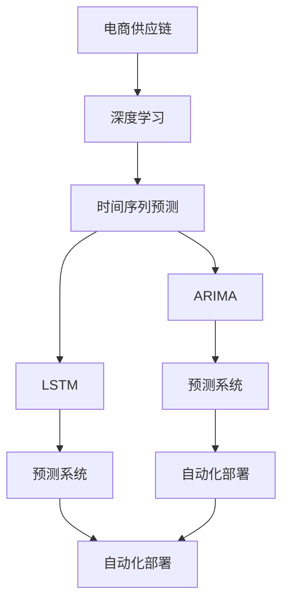

                 

# 探索基于大模型的电商智能供应链预测系统

> 关键词：
- 大模型
- 电商供应链
- 预测系统
- 深度学习
- 时间序列分析
- 决策优化
- 自动化部署

## 1. 背景介绍

### 1.1 问题由来

随着电子商务的迅猛发展，电商企业的供应链管理面临着巨大的挑战。传统的供应链管理方法无法及时准确地预测市场需求、供应商配送情况、库存水平等关键指标，导致库存积压、配送延迟等问题频发，严重影响了企业的运营效率和客户满意度。而基于深度学习的大模型，特别是时间序列预测模型，为电商供应链管理提供了新的解决方案。

大模型能够从大量的历史数据中提取复杂的模式和规律，提供准确的预测结果，从而帮助企业优化库存管理和物流配送，提升供应链效率和客户体验。但如何构建高效的预测模型，并将其部署到实际的生产系统中，仍然是一个复杂且极具挑战性的问题。

### 1.2 问题核心关键点

构建基于大模型的电商智能供应链预测系统，关键在于：
1. 选择合适的预测模型，如ARIMA、LSTM等时间序列预测模型。
2. 设计有效的特征工程，提取关键的业务特征。
3. 对模型进行参数优化，提高预测精度。
4. 将模型部署到实际的供应链系统中，实现自动化和集成化。
5. 对预测结果进行评估和监控，保证模型的稳定性和可靠性。

本文将系统介绍如何使用深度学习大模型构建电商智能供应链预测系统，包括模型的选择、特征提取、参数优化、部署和评估等环节，力求为电商供应链管理提供全面的技术指导。

## 2. 核心概念与联系

### 2.1 核心概念概述

为更好地理解基于大模型的电商供应链预测系统，本节将介绍几个密切相关的核心概念：

- 深度学习(Deep Learning)：指使用多层神经网络进行学习和预测的机器学习方法。深度学习通过模拟人脑神经网络结构，实现对复杂数据的处理和预测。
- 时间序列预测(Time Series Forecasting)：指对随时间变化的数据序列进行预测的统计方法。时间序列预测广泛应用于股票价格、天气变化、交通流量等领域。
- ARIMA模型(Autoregressive Integrated Moving Average)：一种常用的时间序列预测模型，通过AR、I、MA三个组件进行建模，适合处理平稳的数据。
- LSTM模型(Long Short-Term Memory)：一种特殊的RNN网络结构，能够有效解决长序列数据的预测问题。LSTM在深度学习领域被广泛应用。
- 电商供应链(E-commerce Supply Chain)：指电商企业内部的采购、库存、配送等各个环节，是一个复杂的业务系统。
- 预测系统(Prediction System)：指基于特定业务场景构建的预测模型系统，能够实现自动化预测和决策。

这些核心概念之间的逻辑关系可以通过以下Mermaid流程图来展示：



这个流程图展示了大模型在电商供应链预测系统中的核心概念及其之间的关系：

1. 电商供应链系统是一个复杂的业务系统，包含了采购、库存、配送等环节。
2. 深度学习为大模型提供了预测能力，是构建电商供应链预测系统的基础。
3. 时间序列预测是电商供应链预测的核心方法，常用模型包括ARIMA和LSTM。
4. 模型部署到预测系统中，实现自动化和集成化。
5. 预测系统与自动化部署结合，提供实际应用价值。

这些概念共同构成了电商智能供应链预测系统的基本框架，使其能够为电商企业的供应链管理提供有力支持。通过理解这些核心概念，我们可以更好地把握系统的设计和实现。

## 3. 核心算法原理 & 具体操作步骤
### 3.1 算法原理概述

基于深度学习的大模型预测系统，通常采用时间序列预测算法，通过神经网络对历史数据进行建模，学习数据序列中的复杂模式，从而实现对未来数据的预测。具体步骤如下：

1. **数据准备**：收集历史订单、库存、配送等数据，进行预处理和特征提取。
2. **模型选择**：选择合适的预测模型，如ARIMA、LSTM等。
3. **模型训练**：使用历史数据训练模型，调整参数以提高预测精度。
4. **模型评估**：使用测试数据评估模型性能，选择合适的评估指标。
5. **模型部署**：将训练好的模型部署到实际的供应链系统中，实现自动化预测。
6. **系统监控**：实时监控预测结果，保证模型的稳定性和可靠性。

### 3.2 算法步骤详解

下面详细讲解基于深度学习的大模型电商供应链预测系统的具体操作步骤：

**Step 1: 数据准备**

电商供应链预测系统需要大量的历史数据作为训练样本，包括订单、库存、配送等关键数据。数据集构建需要考虑以下几个方面：

1. **数据采集**：从电商平台获取订单、库存、配送等关键数据。
2. **数据清洗**：清洗数据中的异常值和缺失值，保证数据质量。
3. **数据划分**：将数据划分为训练集、验证集和测试集。

**Step 2: 特征工程**

特征工程是构建电商智能供应链预测系统的关键步骤，主要包括以下几个环节：

1. **特征提取**：从订单、库存、配送等数据中提取关键特征，如订单量、库存量、配送时间等。
2. **特征变换**：对提取的特征进行归一化、标准化等处理，提高模型的鲁棒性。
3. **特征组合**：通过组合、交互等手段，构造新的特征，增强模型的预测能力。

**Step 3: 模型选择**

选择适合的预测模型是电商智能供应链预测系统的核心步骤。常见的预测模型包括ARIMA、LSTM等。ARIMA模型适合处理平稳的数据，而LSTM模型能够处理长序列数据的预测问题。选择模型的关键在于：

1. **模型适用性**：根据历史数据的特点选择最合适的模型。
2. **模型复杂度**：控制模型的复杂度，避免过拟合。
3. **模型训练时间**：考虑模型的训练时间，确保模型能够实时预测。

**Step 4: 模型训练**

模型训练是将历史数据输入模型，调整模型参数，提高预测精度的过程。训练过程需要考虑以下几个方面：

1. **训练算法**：选择合适的训练算法，如梯度下降、Adam等。
2. **超参数优化**：调整模型的超参数，如学习率、批大小等，提高模型性能。
3. **模型验证**：在验证集上评估模型性能，选择合适的模型。

**Step 5: 模型评估**

模型评估是衡量预测系统性能的重要环节，主要包括以下几个步骤：

1. **评估指标**：选择合适的评估指标，如均方误差、均方根误差等。
2. **模型比较**：对比不同模型的预测结果，选择最优模型。
3. **误差分析**：分析预测结果的误差来源，优化特征工程和模型选择。

**Step 6: 模型部署**

模型部署是将训练好的模型应用到实际供应链系统中的过程。部署过程需要考虑以下几个方面：

1. **模型集成**：将模型集成到供应链系统中，实现自动化预测。
2. **接口设计**：设计模型预测接口，实现与供应链系统的无缝集成。
3. **系统监控**：实时监控预测结果，保证模型的稳定性和可靠性。

### 3.3 算法优缺点

基于深度学习的大模型电商供应链预测系统具有以下优点：

1. **预测精度高**：通过学习数据序列中的复杂模式，能够实现高精度的预测。
2. **模型灵活性强**：深度学习模型能够处理多变量、非线性等复杂数据，适应性较强。
3. **实时性强**：深度学习模型能够在较短的时间内进行预测，满足实时性的需求。
4. **预测结果可视化**：通过可视化工具展示预测结果，帮助业务决策。

但该方法也存在以下局限性：

1. **数据质量要求高**：预测结果依赖于历史数据的质量，数据清洗和特征工程环节工作量大。
2. **模型复杂度大**：深度学习模型复杂度高，训练和推理过程中资源消耗大。
3. **模型可解释性差**：深度学习模型是一个黑盒系统，难以解释其内部工作机制。
4. **系统集成难度高**：模型部署到供应链系统中，需要进行复杂的软件集成和接口设计。

尽管存在这些局限性，但就目前而言，基于深度学习的大模型电商供应链预测系统仍然是电商企业供应链管理的首选方法。未来相关研究的重点在于如何进一步降低预测对历史数据的依赖，提高模型的泛化能力和可解释性，同时兼顾实时性和系统集成。

### 3.4 算法应用领域

基于深度学习的大模型电商供应链预测系统已经在电商领域得到了广泛应用，具体应用场景包括：

1. **需求预测**：预测未来的订单量和销售趋势，优化库存管理。
2. **库存管理**：根据预测结果，自动调整库存水平，避免库存积压或短缺。
3. **配送优化**：预测配送时间和配送路线，优化配送效率和成本。
4. **价格优化**：预测市场价格变化，动态调整商品价格，提高销售收益。
5. **风险管理**：预测潜在的供应链风险，提前采取应对措施。

除了上述这些经典应用外，电商供应链预测系统还被创新性地应用于物流规划、仓储管理、供应商选择等领域，为电商企业的供应链管理带来了显著的优化效果。

## 4. 数学模型和公式 & 详细讲解
### 4.1 数学模型构建

假设电商供应链预测系统的输入数据为 $X_t = [x_{t-1}, x_{t-2}, \cdots, x_1]$，其中 $x_t$ 表示第 $t$ 天的订单量、库存量等关键指标。输出数据为 $Y_t$，表示第 $t$ 天的预测值。构建深度学习预测模型的过程可以如下表示：

$$
Y_t = f(X_t; \theta)
$$

其中 $f$ 表示深度学习模型，$\theta$ 为模型参数。

### 4.2 公式推导过程

以LSTM模型为例，推导预测系统的数学模型。LSTM模型的数学表示如下：

$$
h_t = f(h_{t-1}, x_t; \theta)
$$

其中 $h_t$ 表示第 $t$ 天的LSTM隐藏状态，$f$ 表示LSTM模型。

预测结果 $Y_t$ 可以通过LSTM模型输出层的线性变换得到：

$$
Y_t = g(h_t; \phi)
$$

其中 $g$ 表示预测模型的输出层，$\phi$ 为输出层的参数。

### 4.3 案例分析与讲解

以LSTM模型为例，通过案例分析，解释LSTM模型在电商供应链预测系统中的工作原理和应用效果。

假设我们有一个电商平台的订单数据，包含每日订单量、库存量和配送时间等关键指标。我们希望通过LSTM模型预测未来的订单量和库存水平，优化供应链管理。

1. **数据准备**：从平台获取历史订单数据，进行预处理和特征提取。
2. **模型选择**：选择LSTM模型作为预测模型，设计模型结构和超参数。
3. **模型训练**：使用历史数据训练LSTM模型，调整参数以提高预测精度。
4. **模型评估**：在测试集上评估模型性能，选择最优模型。
5. **模型部署**：将训练好的LSTM模型集成到供应链系统中，实现自动化预测。

通过LSTM模型的预测，我们能够实时监控订单量和库存水平，及时调整供应链策略，优化库存管理，提高供应链效率。

## 5. 项目实践：代码实例和详细解释说明
### 5.1 开发环境搭建

在进行电商智能供应链预测系统开发前，我们需要准备好开发环境。以下是使用Python进行TensorFlow开发的环境配置流程：

1. 安装Anaconda：从官网下载并安装Anaconda，用于创建独立的Python环境。

2. 创建并激活虚拟环境：
```bash
conda create -n tf-env python=3.8 
conda activate tf-env
```

3. 安装TensorFlow：根据CUDA版本，从官网获取对应的安装命令。例如：
```bash
pip install tensorflow==2.4
```

4. 安装各类工具包：
```bash
pip install numpy pandas scikit-learn matplotlib tqdm jupyter notebook ipython
```

完成上述步骤后，即可在`tf-env`环境中开始开发实践。

### 5.2 源代码详细实现

下面我以LSTM模型为例，给出使用TensorFlow构建电商智能供应链预测系统的代码实现。

首先，定义模型参数和LSTM单元：

```python
import tensorflow as tf

# 定义模型参数
learning_rate = 0.001
batch_size = 32
epochs = 100

# 定义LSTM单元
lstm_cell = tf.keras.layers.LSTMCell(units=128, return_sequences=True, return_state=True)
```

然后，构建LSTM模型：

```python
# 定义输入层
inputs = tf.keras.Input(shape=(None,), dtype=tf.float32, name='inputs')

# 定义LSTM层
outputs, state_h, state_c = tf.keras.layers.RNN(lstm_cell, return_sequences=True, return_state=True)(inputs)

# 定义全连接层
outputs = tf.keras.layers.Dense(1, activation='linear')(outputs)

# 定义模型
model = tf.keras.Model(inputs=inputs, outputs=outputs)
```

接着，编译和训练模型：

```python
# 编译模型
model.compile(optimizer=tf.keras.optimizers.Adam(learning_rate=learning_rate),
              loss=tf.keras.losses.MeanSquaredError(),
              metrics=[tf.keras.metrics.MeanSquaredError()])

# 训练模型
model.fit(x_train, y_train, batch_size=batch_size, epochs=epochs, validation_data=(x_val, y_val))
```

最后，进行模型评估和预测：

```python
# 评估模型
test_loss = model.evaluate(x_test, y_test)

# 预测未来订单量
future_order = model.predict(x_future)
```

以上就是使用TensorFlow对LSTM模型进行电商智能供应链预测系统的完整代码实现。可以看到，TensorFlow提供了强大的深度学习框架和模型库，使得构建和训练深度学习模型变得简单易行。

### 5.3 代码解读与分析

让我们再详细解读一下关键代码的实现细节：

**LSTM模型定义**：
- `tf.keras.layers.LSTMCell`：定义LSTM单元。
- `tf.keras.layers.RNN`：将LSTM单元堆叠成多层LSTM网络。
- `tf.keras.layers.Dense`：定义全连接层，将LSTM输出转换为预测值。
- `tf.keras.Model`：定义预测模型。

**模型编译与训练**：
- `model.compile`：编译模型，设置优化器、损失函数和评估指标。
- `model.fit`：训练模型，指定训练集、验证集和批大小。

**模型评估与预测**：
- `model.evaluate`：评估模型在测试集上的性能。
- `model.predict`：使用训练好的模型进行预测。

通过这些代码，我们能够快速构建和训练一个基于LSTM模型的电商智能供应链预测系统，实现对未来订单量的预测。

## 6. 实际应用场景
### 6.1 智能库存管理

电商智能供应链预测系统的一个重要应用场景是智能库存管理。传统库存管理方法依赖人工经验，无法实时监控库存水平，容易出现库存积压或短缺。而基于深度学习的大模型，能够实时预测未来的订单量和销售趋势，从而自动调整库存水平，优化库存管理。

具体而言，电商企业可以收集每日订单量、库存量、配送量等关键数据，通过预测模型对未来的订单量进行预测，自动调整库存水平，避免库存积压或短缺。同时，预测模型还可以根据订单量变化，自动调整配送策略，优化配送效率和成本。

### 6.2 需求预测

电商智能供应链预测系统还可以用于需求预测。通过预测未来的订单量和销售趋势，电商企业可以优化供应链策略，提前采购商品，避免库存短缺。同时，还可以根据预测结果，动态调整商品价格，提高销售收益。

具体而言，电商企业可以收集历史订单数据、销售趋势、季节性因素等数据，通过预测模型对未来的订单量进行预测。根据预测结果，企业可以提前采购商品，优化库存管理，避免库存积压或短缺。同时，还可以根据预测结果，动态调整商品价格，提高销售收益。

### 6.3 配送优化

电商智能供应链预测系统还可以用于配送优化。通过预测未来的配送需求，电商企业可以优化配送路线和配送时间，提高配送效率和客户满意度。

具体而言，电商企业可以收集历史配送数据、订单量、物流成本等数据，通过预测模型对未来的配送需求进行预测。根据预测结果，企业可以优化配送路线和配送时间，提高配送效率和客户满意度。同时，还可以根据预测结果，优化配送策略，降低物流成本。

### 6.4 未来应用展望

随着深度学习技术的不断发展，基于大模型的电商智能供应链预测系统将在更多领域得到应用，为电商企业的供应链管理带来新的突破。

在智慧物流领域，基于深度学习的大模型可以用于物流车辆的路径规划、配送优化、配送时间预测等环节，提升物流配送效率和客户满意度。

在智能客服领域，电商企业可以构建基于深度学习的大模型预测系统，自动预测客户需求，提供个性化的客户服务，提升客户体验。

在电商数据分析领域，基于深度学习的大模型可以用于商品推荐、广告投放、市场分析等环节，提升电商平台的运营效率和用户粘性。

除了上述这些经典应用外，基于深度学习的大模型预测系统还将被创新性地应用于智能仓储、供应商选择、风险管理等领域，为电商企业的供应链管理带来更多的优化效果。

## 7. 工具和资源推荐
### 7.1 学习资源推荐

为了帮助开发者系统掌握基于深度学习的大模型电商智能供应链预测技术的理论基础和实践技巧，这里推荐一些优质的学习资源：

1. 《深度学习》系列书籍：由多位知名学者合著，系统介绍了深度学习的基本概念、原理和应用。
2. TensorFlow官方文档：TensorFlow的官方文档，提供了完整的深度学习框架和模型库，是学习深度学习的必备资料。
3. Kaggle竞赛：Kaggle是一个数据科学竞赛平台，提供了大量数据集和竞赛，是提升深度学习实战能力的绝佳途径。
4. Udacity深度学习课程：Udacity提供的深度学习课程，由多位知名教授授课，适合初学者和进阶者学习。
5. 深度学习社区：深度学习社区提供了大量开源模型和代码，是获取深度学习前沿资讯和资源的平台。

通过对这些资源的学习实践，相信你一定能够快速掌握基于深度学习的大模型电商智能供应链预测技术的精髓，并用于解决实际的供应链管理问题。

### 7.2 开发工具推荐

高效的开发离不开优秀的工具支持。以下是几款用于大模型电商智能供应链预测系统开发的常用工具：

1. TensorFlow：由Google主导开发的深度学习框架，提供强大的模型库和训练工具，适合大规模工程应用。
2. PyTorch：由Facebook主导开发的深度学习框架，提供灵活的计算图和动态模型构建能力，适合研究型应用。
3. Keras：基于TensorFlow和Theano的高级深度学习框架，提供简单易用的接口，适合快速原型开发。
4. Jupyter Notebook：交互式Python开发环境，支持代码块的逐行执行和展示，适合数据探索和模型调试。
5. Scikit-learn：基于NumPy的科学计算库，提供常用的机器学习算法和工具，适合数据预处理和特征工程。

合理利用这些工具，可以显著提升电商智能供应链预测系统的开发效率，加快创新迭代的步伐。

### 7.3 相关论文推荐

大模型和深度学习技术的发展源于学界的持续研究。以下是几篇奠基性的相关论文，推荐阅读：

1. "Long Short-Term Memory"（Hochreiter & Schmidhuber，1997）：提出了LSTM结构，为处理长序列数据提供了新的思路。
2. "The Elements of Statistical Learning"（Hastie et al.，2009）：介绍了统计学习的基本概念和方法，为深度学习提供了坚实的理论基础。
3. "Deep Learning"（Goodfellow et al.，2016）：介绍了深度学习的理论、算法和应用，是深度学习领域的经典教材。
4. "Neural Computation"（Hinton et al.，2006）：介绍了神经网络的基本概念和算法，是深度学习领域的入门教材。
5. "Predictive Analytics"（Fawcett，2006）：介绍了预测分析的基本概念和方法，为电商智能供应链预测系统提供了理论支持。

这些论文代表了大模型和深度学习技术的发展脉络。通过学习这些前沿成果，可以帮助研究者把握学科前进方向，激发更多的创新灵感。

## 8. 总结：未来发展趋势与挑战
### 8.1 总结

本文对基于深度学习的大模型电商智能供应链预测系统进行了全面系统的介绍。首先阐述了电商供应链预测系统的背景和意义，明确了深度学习和大模型预测在电商供应链管理中的独特价值。其次，从原理到实践，详细讲解了预测系统的构建和实现过程，给出了完整的代码实例和详细解释说明。同时，本文还广泛探讨了预测系统在智能库存管理、需求预测、配送优化等多个电商供应链管理场景中的应用前景，展示了深度学习技术在电商领域的广阔应用空间。

通过本文的系统梳理，可以看到，基于深度学习的大模型电商智能供应链预测系统正在成为电商企业供应链管理的重要工具，极大地提升了供应链管理的效率和效果。未来，伴随深度学习技术的不断发展，基于大模型的电商智能供应链预测系统将进一步优化，为电商企业的供应链管理带来更多的变革。

### 8.2 未来发展趋势

展望未来，基于深度学习的大模型电商智能供应链预测系统将呈现以下几个发展趋势：

1. **模型复杂度提升**：随着深度学习技术的不断进步，预测模型的复杂度将进一步提升，能够处理更加复杂多变的供应链问题。
2. **数据采集和处理能力增强**：随着物联网技术的发展，电商企业能够采集更多的实时数据，预测模型的数据采集和处理能力将进一步增强。
3. **多模态数据的整合**：电商企业能够采集更多的多模态数据，如视频、图像、语音等，预测模型将能够整合这些数据，提供更全面、准确的数据预测。
4. **预测精度和实时性提升**：预测模型的精度和实时性将进一步提升，能够实时预测供应链中的关键指标，及时调整供应链策略。
5. **自动化程度提升**：预测模型将更加自动化，能够自动进行数据清洗、特征提取、模型训练和预测，减少人工干预，提高预测效率。

这些趋势凸显了大模型在电商供应链预测系统中的广阔前景。这些方向的探索发展，必将进一步提升预测系统的预测精度和实时性，为电商企业的供应链管理带来更大的价值。

### 8.3 面临的挑战

尽管基于深度学习的大模型电商智能供应链预测系统已经取得了瞩目成就，但在迈向更加智能化、普适化应用的过程中，它仍面临着诸多挑战：

1. **数据质量问题**：电商企业的数据质量参差不齐，存在缺失、异常等问题，需要大量的数据清洗和处理工作。
2. **模型复杂度问题**：深度学习模型复杂度高，训练和推理过程中资源消耗大，需要高效的计算平台和算法。
3. **模型可解释性问题**：深度学习模型是一个黑盒系统，难以解释其内部工作机制和决策逻辑，需要改进模型可解释性。
4. **系统集成问题**：电商智能供应链预测系统需要与供应链系统的各个环节进行集成，需要考虑复杂的软件集成和接口设计问题。
5. **系统安全性问题**：电商智能供应链预测系统需要保证数据和模型的安全性，需要考虑数据隐私保护和模型攻击等问题。

尽管存在这些挑战，但未来深度学习技术的发展和应用实践将逐步解决这些问题，推动电商智能供应链预测系统向更高的台阶发展。

### 8.4 研究展望

面对深度学习在电商智能供应链预测系统面临的挑战，未来的研究需要在以下几个方面寻求新的突破：

1. **数据采集和处理技术**：研究高效的数据采集和处理技术，提升数据的质量和数量。
2. **模型压缩和优化**：研究模型压缩和优化技术，减少模型复杂度，提升推理速度和资源利用率。
3. **模型可解释性**：研究模型可解释性技术，提供更加透明、可解释的预测结果。
4. **系统集成和接口设计**：研究高效的系统集成和接口设计技术，实现预测系统与供应链系统的无缝集成。
5. **系统安全性和隐私保护**：研究系统安全性和隐私保护技术，保障数据和模型的安全。

这些研究方向的探索，必将引领大模型电商智能供应链预测系统迈向更高的台阶，为电商企业的供应链管理带来更加智能化、普适化的解决方案。面向未来，大模型预测系统需要在模型复杂度、数据质量、模型可解释性等方面不断优化，才能真正实现人工智能技术在电商供应链管理中的价值。

## 9. 附录：常见问题与解答

**Q1：电商智能供应链预测系统如何处理缺失和异常数据？**

A: 电商智能供应链预测系统处理缺失和异常数据，通常采用以下几种方法：

1. **数据补全**：使用均值、中位数、插值等方法对缺失数据进行补全，保证数据完整性。
2. **异常检测**：使用统计方法或机器学习方法，检测和处理异常数据，减少数据噪声。
3. **数据变换**：对异常数据进行归一化、标准化等处理，提高模型的鲁棒性。
4. **模型选择**：选择具有较强处理缺失和异常数据能力的模型，如LSTM模型等。

这些方法能够有效提升数据质量，增强预测系统的准确性和稳定性。

**Q2：电商智能供应链预测系统如何选择合适的模型？**

A: 电商智能供应链预测系统选择合适的模型需要考虑以下几个方面：

1. **数据特性**：根据历史数据的特点选择合适的模型，如平稳数据适合ARIMA模型，非平稳数据适合LSTM模型。
2. **模型复杂度**：控制模型的复杂度，避免过拟合，选择合适的超参数。
3. **训练时间和资源**：考虑模型的训练时间和资源消耗，确保模型能够实时预测。
4. **预测精度**：通过模型评估指标，选择预测精度最高的模型。

综合考虑以上因素，选择最适合的预测模型，是电商智能供应链预测系统成功的关键。

**Q3：电商智能供应链预测系统如何处理多变量数据？**

A: 电商智能供应链预测系统处理多变量数据，通常采用以下几种方法：

1. **特征工程**：通过特征提取和组合，构造新的特征，增强模型的预测能力。
2. **多变量模型**：选择具有较强处理多变量数据能力的模型，如LSTM模型等。
3. **数据降维**：使用PCA、LDA等方法，对多变量数据进行降维处理，提高模型的效率和准确性。
4. **集成学习**：通过集成多个模型，提升预测系统的鲁棒性和泛化能力。

这些方法能够有效提升预测系统的预测精度和实时性，为电商企业的供应链管理带来更大的价值。

**Q4：电商智能供应链预测系统如何进行模型优化？**

A: 电商智能供应链预测系统进行模型优化，通常采用以下几种方法：

1. **超参数调优**：通过网格搜索、随机搜索等方法，寻找最优超参数组合，提升模型性能。
2. **模型集成**：通过集成多个模型，提升预测系统的鲁棒性和泛化能力。
3. **模型压缩**：使用模型压缩和优化技术，减少模型复杂度，提升推理速度和资源利用率。
4. **知识融合**：将领域知识与模型结合，增强模型的泛化能力和鲁棒性。

这些方法能够有效提升预测系统的预测精度和实时性，为电商企业的供应链管理带来更大的价值。

**Q5：电商智能供应链预测系统如何进行模型评估？**

A: 电商智能供应链预测系统进行模型评估，通常采用以下几种方法：

1. **均方误差**：使用均方误差（MSE）等指标，评估模型预测值与真实值之间的差异。
2. **R平方**：使用R平方（R2）等指标，评估模型对数据变化的解释能力。
3. **平均绝对误差**：使用平均绝对误差（MAE）等指标，评估模型预测值的平均准确性。
4. **ROC曲线**：使用ROC曲线等方法，评估模型的分类性能和鲁棒性。

这些方法能够有效评估预测系统的性能，帮助电商企业选择最优的预测模型。

通过本文的系统梳理，可以看到，基于深度学习的大模型电商智能供应链预测系统正在成为电商企业供应链管理的重要工具，极大地提升了供应链管理的效率和效果。未来，伴随深度学习技术的不断发展，基于大模型的电商智能供应链预测系统将进一步优化，为电商企业的供应链管理带来更大的价值。

---

作者：禅与计算机程序设计艺术 / Zen and the Art of Computer Programming

