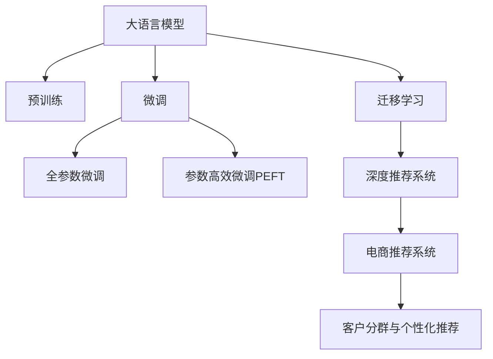

                 

# 探索基于大模型的电商智能客户分群与个性化营销系统

## 1. 背景介绍

### 1.1 问题由来
近年来，随着电商行业竞争日益激烈，精准化、个性化营销成为商家争夺市场的重要手段。传统的客户细分和营销策略，由于缺乏对客户行为和需求的深入理解，往往难以产生理想的效果。为此，利用大数据技术，结合机器学习算法，对客户进行智能分群和个性化推荐，成为电商营销的重要方向。

大语言模型（Large Language Model, LLM）的崛起，为电商智能客户分群与个性化营销提供了新的可能性。通过预训练模型，大语言模型可以学习到通用的语言表示，进而通过微调，学习特定电商领域的知识和数据分布，提供高效、准确的客户分群与个性化推荐服务。

### 1.2 问题核心关键点
本研究聚焦于基于大模型的电商智能客户分群与个性化营销系统，主要关注以下几个核心问题：
- 大语言模型如何应用于客户分群和推荐任务？
- 如何构建有效的电商领域预训练模型？
- 微调策略如何设计，才能高效提升模型性能？
- 推荐系统的评估指标有哪些，如何进行合理设计？

通过深入探讨这些问题，本研究旨在为电商企业提供一种全新的智能客户分群和个性化推荐解决方案，大幅提升电商营销的精准度和效果。

## 2. 核心概念与联系

### 2.1 核心概念概述

为了更好地理解本研究，本节将介绍几个密切相关的核心概念：

- 大语言模型(Large Language Model, LLM)：指通过大规模无标签文本数据预训练得到的通用语言模型，如GPT、BERT等。这些模型通过学习语言的知识和规律，具备强大的语言理解与生成能力。
- 预训练(Pre-training)：指在大规模无标签数据上训练语言模型的过程，通常包括自监督学习任务，如语言建模、掩码语言模型等。
- 微调(Fine-tuning)：指在预训练模型的基础上，通过小规模标注数据，有监督地训练模型，使其适应特定任务，如电商客户分群与个性化推荐。
- 迁移学习(Transfer Learning)：指将预训练模型的知识迁移到新任务中，提高模型的泛化能力和性能。
- 深度推荐系统(Deep Recommendation System)：指利用深度学习技术，构建个性化推荐系统，为用户提供推荐服务。

这些核心概念之间的逻辑关系可以通过以下Mermaid流程图来展示：



这个流程图展示了大语言模型在电商推荐系统中的应用路径：

1. 大语言模型通过预训练获得基础能力。
2. 微调使得模型更好地适应电商领域，学习电商领域的数据分布和知识。
3. 深度推荐系统利用微调后的模型，构建个性化推荐服务。
4. 电商推荐系统对用户行为进行实时分析，提供精准的客户分群与个性化推荐服务。

## 3. 核心算法原理 & 具体操作步骤
### 3.1 算法原理概述

基于大模型的电商智能客户分群与个性化营销系统的核心原理是：利用大语言模型的预训练能力，通过微调，适应电商领域的数据分布和知识，进而构建深度推荐系统，为用户提供精准的个性化推荐服务。

假设原始电商数据集为 $D=\{(x_i, y_i)\}_{i=1}^N$，其中 $x_i$ 为电商用户行为数据，$y_i$ 为对应的客户标签。模型通过微调，优化目标函数 $\mathcal{L}(\theta)$，使其最小化预测输出与真实标签之间的差异，即：

$$
\theta^* = \mathop{\arg\min}_{\theta} \mathcal{L}(M_{\theta},D)
$$

其中 $M_{\theta}$ 为微调后的语言模型，$\theta$ 为模型参数，$\mathcal{L}$ 为针对电商推荐任务的损失函数，通常包括交叉熵损失、均方误差损失等。

### 3.2 算法步骤详解

基于大模型的电商智能客户分群与个性化营销系统的构建，一般包括以下几个关键步骤：

**Step 1: 准备电商数据集**
- 收集电商领域的用户行为数据和客户标签数据，构建电商数据集 $D=\{(x_i, y_i)\}_{i=1}^N$，其中 $x_i$ 为电商用户行为，如浏览记录、购买记录、评价等；$y_i$ 为对应的客户标签，如高价值客户、流失客户等。
- 将数据集划分为训练集、验证集和测试集，通常要求训练集与验证集/测试集的分布尽量一致。

**Step 2: 构建电商领域预训练模型**
- 选择适当的预训练模型，如BERT、GPT等，并调整其架构，添加电商领域特定的任务层。
- 对模型进行预训练，使其学习电商领域的知识。通常可以在大规模无标签电商数据上进行自监督学习，如语言建模、掩码语言模型等。

**Step 3: 设计电商推荐系统**
- 根据电商推荐任务特点，设计适合的推荐算法和任务层。如基于协同过滤的推荐算法、基于内容推荐的算法等。
- 将预训练模型作为特征提取器，提取电商用户行为数据的特征表示。
- 利用提取的特征表示，构建推荐模型，通过微调优化模型参数。

**Step 4: 微调电商推荐模型**
- 选择合适的优化算法及其参数，如AdamW、SGD等，设置学习率、批大小、迭代轮数等。
- 设置正则化技术及强度，包括权重衰减、Dropout、Early Stopping等。
- 确定冻结预训练参数的策略，如仅微调顶层，或全部参数都参与微调。

**Step 5: 测试和部署**
- 在测试集上评估微调后的电商推荐模型性能，对比微调前后的推荐效果。
- 使用微调后的模型进行实时推荐，集成到电商系统中。
- 持续收集新的电商数据，定期重新微调模型，以适应数据分布的变化。

### 3.3 算法优缺点

基于大模型的电商智能客户分群与个性化营销系统具有以下优点：
1. 能够充分利用大语言模型的预训练能力，适应电商领域的知识。
2. 对于电商领域的小规模标注数据，能够快速适应，提升推荐精度。
3. 能够高效处理高维稀疏电商数据，构建精准的推荐模型。
4. 能够实时更新，根据用户行为数据进行动态调整。

同时，该方法也存在一定的局限性：
1. 依赖标注数据。微调的效果很大程度上取决于标注数据的质量和数量，获取高质量标注数据的成本较高。
2. 迁移能力有限。当电商领域与其他领域的分布差异较大时，微调的性能提升有限。
3. 可解释性不足。电商推荐模型通常缺乏可解释性，难以对其推荐逻辑进行分析和调试。

尽管存在这些局限性，但就目前而言，基于大模型的电商智能客户分群与个性化推荐系统仍然是一种高效、可行的解决方案。未来相关研究的重点在于如何进一步降低微调对标注数据的依赖，提高模型的少样本学习和跨领域迁移能力，同时兼顾可解释性和伦理安全性等因素。

### 3.4 算法应用领域

基于大模型的电商智能客户分群与个性化营销系统已经在电商推荐、广告投放、个性化营销等多个电商领域得到广泛应用。具体应用场景如下：

1. **电商推荐系统**：对用户浏览、购买记录进行分析，推荐用户可能感兴趣的商品。通过微调模型，提升推荐精度和个性化程度。
2. **广告投放**：对用户行为进行深入分析，推荐合适广告内容，提升广告投放效果和转化率。
3. **个性化营销**：根据用户历史行为和兴趣标签，设计个性化营销方案，提高用户粘性和转化率。
4. **客户流失预警**：通过分析用户行为数据，预测高风险客户，提前进行干预，降低流失率。
5. **个性化推荐算法**：结合电商领域的知识，设计更加精确的推荐算法，提高推荐效果和用户满意度。

## 4. 数学模型和公式 & 详细讲解 & 举例说明

### 4.1 数学模型构建

假设电商推荐系统中的用户行为数据为 $x_i$，推荐模型输出的客户标签为 $y_i$，则电商推荐系统的损失函数为：

$$
\mathcal{L}(y_i, \hat{y_i}) = -\frac{1}{N} \sum_{i=1}^N \log \hat{y_i}
$$

其中 $\hat{y_i}$ 为模型预测的客户标签。

### 4.2 公式推导过程

电商推荐系统的优化目标是：

$$
\theta^* = \mathop{\arg\min}_{\theta} \mathcal{L}(y_i, \hat{y_i})
$$

对于每条电商用户行为数据 $x_i$，前向传播计算模型输出 $\hat{y_i}$，并计算损失函数 $\mathcal{L}(y_i, \hat{y_i})$。然后，通过反向传播计算参数梯度，并利用优化算法更新模型参数。重复上述过程直至收敛，最终得到适应电商推荐任务的最优模型参数 $\theta^*$。

### 4.3 案例分析与讲解

以电商推荐系统为例，假设我们使用BERT模型作为预训练模型，构建电商推荐模型。

**Step 1: 准备电商数据集**
- 收集电商领域的用户行为数据和客户标签数据，构建电商数据集 $D=\{(x_i, y_i)\}_{i=1}^N$，其中 $x_i$ 为电商用户行为，如浏览记录、购买记录、评价等；$y_i$ 为对应的客户标签，如高价值客户、流失客户等。

**Step 2: 构建电商领域预训练模型**
- 使用BERT作为预训练模型，并对其架构进行调整，添加电商领域特定的任务层。
- 对模型进行预训练，使其学习电商领域的知识。

**Step 3: 设计电商推荐系统**
- 根据电商推荐任务特点，设计适合的推荐算法和任务层。如基于协同过滤的推荐算法、基于内容推荐的算法等。
- 将预训练模型作为特征提取器，提取电商用户行为数据的特征表示。

**Step 4: 微调电商推荐模型**
- 选择合适的优化算法及其参数，如AdamW、SGD等，设置学习率、批大小、迭代轮数等。
- 设置正则化技术及强度，包括权重衰减、Dropout、Early Stopping等。
- 确定冻结预训练参数的策略，如仅微调顶层，或全部参数都参与微调。

**Step 5: 测试和部署**
- 在测试集上评估微调后的电商推荐模型性能，对比微调前后的推荐效果。
- 使用微调后的模型进行实时推荐，集成到电商系统中。
- 持续收集新的电商数据，定期重新微调模型，以适应数据分布的变化。

## 5. 项目实践：代码实例和详细解释说明

### 5.1 开发环境搭建

在进行电商智能客户分群与个性化推荐系统的开发之前，我们需要准备好开发环境。以下是使用Python进行PyTorch开发的环境配置流程：

1. 安装Anaconda：从官网下载并安装Anaconda，用于创建独立的Python环境。

2. 创建并激活虚拟环境：
```bash
conda create -n ecommerce-env python=3.8 
conda activate ecommerce-env
```

3. 安装PyTorch：根据CUDA版本，从官网获取对应的安装命令。例如：
```bash
conda install pytorch torchvision torchaudio cudatoolkit=11.1 -c pytorch -c conda-forge
```

4. 安装TensorFlow：
```bash
conda install tensorflow
```

5. 安装各类工具包：
```bash
pip install numpy pandas scikit-learn matplotlib tqdm jupyter notebook ipython
```

完成上述步骤后，即可在`ecommerce-env`环境中开始电商智能客户分群与个性化推荐系统的开发。

### 5.2 源代码详细实现

下面我们以电商推荐系统为例，给出使用PyTorch和TensorFlow进行电商智能客户分群与个性化推荐系统的PyTorch代码实现。

首先，定义电商推荐系统的数据处理函数：

```python
import pandas as pd
from sklearn.model_selection import train_test_split
from transformers import BertTokenizer, BertForSequenceClassification
import torch
import torch.nn as nn
import torch.optim as optim

# 加载电商数据集
data = pd.read_csv('ecommerce_data.csv')

# 数据预处理
def preprocess_data(data):
    # 提取用户行为和客户标签
    X = data[['click', 'view', 'purchase']]
    y = data['label']
    
    # 对用户行为数据进行编码
    tokenizer = BertTokenizer.from_pretrained('bert-base-uncased')
    X_encoded = tokenizer(X, padding=True, truncation=True, max_length=128)
    
    # 构建数据集
    train_X, test_X, train_y, test_y = train_test_split(X_encoded, y, test_size=0.2)
    
    return train_X, train_y, test_X, test_y

# 构建模型
def build_model(model_type, num_labels):
    # 选择预训练模型
    if model_type == 'bert':
        model = BertForSequenceClassification.from_pretrained('bert-base-uncased', num_labels=num_labels)
    elif model_type == 'gpt':
        model = GPTForSequenceClassification.from_pretrained('gpt2', num_labels=num_labels)
    else:
        raise ValueError('Unsupported model type')
    
    # 定义优化器
    optimizer = optim.Adam(model.parameters(), lr=2e-5)
    
    return model, optimizer

# 训练模型
def train_model(model, train_X, train_y, num_epochs, batch_size, device):
    model.train()
    for epoch in range(num_epochs):
        total_loss = 0
        for i, (inputs, labels) in enumerate(zip(train_X, train_y)):
            inputs = inputs.to(device)
            labels = labels.to(device)
            optimizer.zero_grad()
            outputs = model(inputs)
            loss = outputs.loss
            total_loss += loss.item()
            loss.backward()
            optimizer.step()
        print(f'Epoch {epoch+1}, Train Loss: {total_loss / len(train_X)}')
    
    return model

# 评估模型
def evaluate_model(model, test_X, test_y, device):
    model.eval()
    total_loss = 0
    total_correct = 0
    with torch.no_grad():
        for inputs, labels in zip(test_X, test_y):
            inputs = inputs.to(device)
            labels = labels.to(device)
            outputs = model(inputs)
            loss = outputs.loss
            total_loss += loss.item()
            predictions = outputs.logits.argmax(dim=1)
            total_correct += (predictions == labels).sum().item()
        print(f'Test Loss: {total_loss / len(test_X)}, Test Accuracy: {total_correct / len(test_X)}')

# 训练过程
train_X, train_y, test_X, test_y = preprocess_data(data)
model, optimizer = build_model('bert', num_labels=len(set(train_y)))
device = torch.device('cuda') if torch.cuda.is_available() else torch.device('cpu')
model.to(device)
train_model(model, train_X, train_y, num_epochs=10, batch_size=16, device=device)
evaluate_model(model, test_X, test_y, device)
```

这里假设我们有一个电商数据集 `ecommerce_data.csv`，包含用户行为数据和客户标签。我们首先使用 `preprocess_data` 函数进行数据预处理，将用户行为数据进行编码，并划分训练集和测试集。然后，使用 `build_model` 函数构建模型，选择合适的预训练模型（如BERT），并定义优化器。接着，在训练过程中，通过 `train_model` 函数进行模型训练，并在测试集上进行评估。

### 5.3 代码解读与分析

让我们再详细解读一下关键代码的实现细节：

**preprocess_data函数**：
- 加载电商数据集。
- 提取用户行为数据和客户标签。
- 使用BertTokenizer对用户行为数据进行编码。
- 构建训练集和测试集，并进行划分。

**build_model函数**：
- 根据指定的模型类型，选择合适的预训练模型。
- 定义优化器，并设置学习率。

**train_model函数**：
- 在训练过程中，对模型进行前向传播和反向传播。
- 计算损失函数并更新模型参数。
- 输出每个epoch的训练损失。

**evaluate_model函数**：
- 在测试集上对模型进行评估。
- 计算损失函数和准确率。
- 输出测试损失和准确率。

**训练过程**：
- 调用preprocess_data函数，获取训练集和测试集。
- 调用build_model函数，构建BERT模型。
- 将模型迁移到GPU上。
- 调用train_model函数，进行模型训练。
- 调用evaluate_model函数，在测试集上进行评估。

通过上述代码，可以看出，使用PyTorch和TensorFlow进行电商智能客户分群与个性化推荐系统的开发，具有较高的灵活性和可扩展性。开发者可以根据自己的需求，调整模型架构、优化器参数等，以实现最佳的电商推荐效果。

## 6. 实际应用场景

### 6.1 智能客服系统

电商智能客服系统利用大语言模型微调，能够处理用户查询，并根据用户行为进行个性化推荐。客户通过聊天机器人提出问题，系统能够快速回答，并推荐相关商品，提升客户满意度。

在技术实现上，可以收集电商平台的客户互动数据，将问题-答案对作为微调数据，训练模型学习匹配答案。对于客户提出的新问题，还可以接入检索系统实时搜索相关内容，动态组织生成回答。如此构建的智能客服系统，能大幅提升客户咨询体验和问题解决效率。

### 6.2 客户流失预警

电商客户流失预警系统利用大语言模型微调，能够对高风险客户进行早期预警，帮助商家提前采取措施，降低流失率。

在技术实现上，可以收集电商客户的购买历史、行为数据，将客户标签作为微调数据，训练模型学习预测流失风险。对于预测为高风险的客户，系统能够实时发送预警信息，商家可以及时进行干预，提升客户粘性。

### 6.3 个性化推荐算法

电商个性化推荐系统利用大语言模型微调，能够构建更加精准的推荐算法，提升推荐效果和用户满意度。

在技术实现上，可以将用户的浏览、购买记录作为输入，通过预训练模型提取特征，并利用微调后的推荐模型生成推荐列表。通过持续收集用户反馈，系统能够不断优化推荐算法，实现更加精准的推荐。

### 6.4 未来应用展望

随着大语言模型微调技术的发展，基于大模型的电商智能客户分群与个性化营销系统将具有更广阔的应用前景：

1. **跨领域应用**：未来，大模型微调技术将不仅仅应用于电商领域，还将拓展到其他垂直领域，如医疗、金融、教育等，为各行各业提供智能化解决方案。

2. **实时性提升**：通过进一步优化模型结构和算法，电商智能客户分群与个性化推荐系统的实时性将得到提升，能够快速响应用户需求，提供更加精准的推荐服务。

3. **个性化定制**：未来，基于大模型的推荐系统将能够提供更加个性化的推荐服务，满足不同用户的需求，提升用户体验和满意度。

4. **多模态融合**：电商智能客户分群与个性化推荐系统将进一步拓展到多模态数据融合，结合用户画像、行为数据、评论反馈等，提升推荐的准确性和多样性。

5. **模型解释性增强**：未来，推荐系统的可解释性将得到加强，用户能够更加直观地理解推荐逻辑，提升信任度和满意度。

6. **数据隐私保护**：电商智能客户分群与个性化推荐系统将更加注重数据隐私保护，通过差分隐私、联邦学习等技术，保护用户数据安全。

通过这些应用前景，可以看到，大语言模型微调技术将在电商智能客户分群与个性化推荐系统中发挥重要作用，推动电商行业向智能化、个性化方向发展。

## 7. 工具和资源推荐

### 7.1 学习资源推荐

为了帮助开发者系统掌握大语言模型微调的理论基础和实践技巧，这里推荐一些优质的学习资源：

1. 《深度学习入门：基于TensorFlow和Keras的实践》系列博文：由大模型技术专家撰写，深入浅出地介绍了TensorFlow和Keras的基础知识和应用场景。

2. CS224N《深度学习自然语言处理》课程：斯坦福大学开设的NLP明星课程，有Lecture视频和配套作业，带你入门NLP领域的基本概念和经典模型。

3. 《自然语言处理与深度学习》书籍：由知名NLP专家编写，全面介绍了自然语言处理和深度学习的基本原理和应用技术。

4. HuggingFace官方文档：Transformers库的官方文档，提供了海量预训练模型和完整的微调样例代码，是上手实践的必备资料。

5. Kaggle竞赛平台：提供了丰富的NLP数据集和挑战赛，通过实际项目积累经验，提升实战能力。

通过对这些资源的学习实践，相信你一定能够快速掌握大语言模型微调的精髓，并用于解决实际的电商推荐问题。

### 7.2 开发工具推荐

高效的开发离不开优秀的工具支持。以下是几款用于大语言模型微调开发的常用工具：

1. PyTorch：基于Python的开源深度学习框架，灵活动态的计算图，适合快速迭代研究。大部分预训练语言模型都有PyTorch版本的实现。

2. TensorFlow：由Google主导开发的开源深度学习框架，生产部署方便，适合大规模工程应用。同样有丰富的预训练语言模型资源。

3. Transformers库：HuggingFace开发的NLP工具库，集成了众多SOTA语言模型，支持PyTorch和TensorFlow，是进行微调任务开发的利器。

4. Weights & Biases：模型训练的实验跟踪工具，可以记录和可视化模型训练过程中的各项指标，方便对比和调优。与主流深度学习框架无缝集成。

5. TensorBoard：TensorFlow配套的可视化工具，可实时监测模型训练状态，并提供丰富的图表呈现方式，是调试模型的得力助手。

6. Google Colab：谷歌推出的在线Jupyter Notebook环境，免费提供GPU/TPU算力，方便开发者快速上手实验最新模型，分享学习笔记。

合理利用这些工具，可以显著提升大语言模型微调任务的开发效率，加快创新迭代的步伐。

### 7.3 相关论文推荐

大语言模型和微调技术的发展源于学界的持续研究。以下是几篇奠基性的相关论文，推荐阅读：

1. Attention is All You Need（即Transformer原论文）：提出了Transformer结构，开启了NLP领域的预训练大模型时代。

2. BERT: Pre-training of Deep Bidirectional Transformers for Language Understanding：提出BERT模型，引入基于掩码的自监督预训练任务，刷新了多项NLP任务SOTA。

3. Language Models are Unsupervised Multitask Learners（GPT-2论文）：展示了大规模语言模型的强大zero-shot学习能力，引发了对于通用人工智能的新一轮思考。

4. Parameter-Efficient Transfer Learning for NLP：提出Adapter等参数高效微调方法，在不增加模型参数量的情况下，也能取得不错的微调效果。

5. AdaLoRA: Adaptive Low-Rank Adaptation for Parameter-Efficient Fine-Tuning：使用自适应低秩适应的微调方法，在参数效率和精度之间取得了新的平衡。

6. Fine-tuning GPT-2 for Reducing Sources of Distraction in Explainable Dialog Systems：介绍如何将GPT-2应用于可解释性对话系统中，减少引导性信息和有害信息的影响。

这些论文代表了大语言模型微调技术的发展脉络。通过学习这些前沿成果，可以帮助研究者把握学科前进方向，激发更多的创新灵感。

## 8. 总结：未来发展趋势与挑战

### 8.1 研究成果总结

本文对基于大模型的电商智能客户分群与个性化营销系统进行了全面系统的介绍。首先阐述了大语言模型和微调技术的研究背景和意义，明确了微调在电商推荐系统中的重要价值。其次，从原理到实践，详细讲解了微调的数学原理和关键步骤，给出了电商推荐系统的完整代码实例。同时，本文还探讨了微调方法在智能客服、客户流失预警、个性化推荐等电商推荐系统中的实际应用场景，展示了微调范式的巨大潜力。此外，本文精选了微调技术的各类学习资源，力求为开发者提供全方位的技术指引。

通过本文的系统梳理，可以看到，基于大模型的电商智能客户分群与个性化推荐系统具有广阔的应用前景。借助大语言模型强大的预训练能力，通过微调，能够快速适应电商领域，提升推荐系统的准确性和个性化程度，大幅提升电商营销的精准度和效果。未来，随着预训练模型和微调方法的持续演进，电商推荐系统将进一步优化，为电商企业提供更全面、高效的智能化服务。

### 8.2 未来发展趋势

展望未来，基于大模型的电商智能客户分群与个性化营销系统将呈现以下几个发展趋势：

1. **模型规模持续增大**：随着算力成本的下降和数据规模的扩张，预训练语言模型的参数量还将持续增长。超大规模语言模型蕴含的丰富语言知识，有望支撑更加复杂多变的电商推荐任务。

2. **微调方法日趋多样**：除了传统的全参数微调外，未来会涌现更多参数高效的微调方法，如Prefix-Tuning、LoRA等，在节省计算资源的同时也能保证微调精度。

3. **持续学习成为常态**：随着数据分布的不断变化，微调模型也需要持续学习新知识以保持性能。如何在不遗忘原有知识的同时，高效吸收新样本信息，将成为重要的研究课题。

4. **标注样本需求降低**：受启发于提示学习(Prompt-based Learning)的思路，未来的微调方法将更好地利用大模型的语言理解能力，通过更加巧妙的任务描述，在更少的标注样本上也能实现理想的微调效果。

5. **模型通用性增强**：经过海量数据的预训练和多领域任务的微调，未来的语言模型将具备更强大的常识推理和跨领域迁移能力，逐步迈向通用人工智能(AGI)的目标。

以上趋势凸显了大语言模型微调技术的广阔前景。这些方向的探索发展，必将进一步提升电商推荐系统的性能和应用范围，为电商企业提供更全面、高效的智能化服务。

### 8.3 面临的挑战

尽管大语言模型微调技术已经取得了瞩目成就，但在迈向更加智能化、普适化应用的过程中，它仍面临着诸多挑战：

1. **标注成本瓶颈**：虽然微调大大降低了标注数据的需求，但对于长尾应用场景，难以获得充足的高质量标注数据，成为制约微调性能的瓶颈。如何进一步降低微调对标注样本的依赖，将是一大难题。

2. **模型鲁棒性不足**：当前微调模型面对域外数据时，泛化性能往往大打折扣。对于测试样本的微小扰动，微调模型的预测也容易发生波动。如何提高微调模型的鲁棒性，避免灾难性遗忘，还需要更多理论和实践的积累。

3. **推理效率有待提高**：大规模语言模型虽然精度高，但在实际部署时往往面临推理速度慢、内存占用大等效率问题。如何在保证性能的同时，简化模型结构，提升推理速度，优化资源占用，将是重要的优化方向。

4. **可解释性亟需加强**：当前微调模型通常缺乏可解释性，难以对其推荐逻辑进行分析和调试。对于医疗、金融等高风险应用，算法的可解释性和可审计性尤为重要。如何赋予微调模型更强的可解释性，将是亟待攻克的难题。

5. **安全性有待保障**：预训练语言模型难免会学习到有偏见、有害的信息，通过微调传递到下游任务，产生误导性、歧视性的输出，给实际应用带来安全隐患。如何从数据和算法层面消除模型偏见，避免恶意用途，确保输出的安全性，也将是重要的研究课题。

6. **知识整合能力不足**：现有的微调模型往往局限于任务内数据，难以灵活吸收和运用更广泛的先验知识。如何让微调过程更好地与外部知识库、规则库等专家知识结合，形成更加全面、准确的信息整合能力，还有很大的想象空间。

正视微调面临的这些挑战，积极应对并寻求突破，将是大语言模型微调走向成熟的必由之路。相信随着学界和产业界的共同努力，这些挑战终将一一被克服，大语言模型微调必将在构建人机协同的智能系统过程中发挥重要作用。

### 8.4 研究展望

面对大语言模型微调所面临的种种挑战，未来的研究需要在以下几个方面寻求新的突破：

1. **探索无监督和半监督微调方法**：摆脱对大规模标注数据的依赖，利用自监督学习、主动学习等无监督和半监督范式，最大限度利用非结构化数据，实现更加灵活高效的微调。

2. **研究参数高效和计算高效的微调范式**：开发更加参数高效的微调方法，在固定大部分预训练参数的同时，只更新极少量的任务相关参数。同时优化微调模型的计算图，减少前向传播和反向传播的资源消耗，实现更加轻量级、实时性的部署。

3. **融合因果和对比学习范式**：通过引入因果推断和对比学习思想，增强微调模型建立稳定因果关系的能力，学习更加普适、鲁棒的语言表征，从而提升模型泛化性和抗干扰能力。

4. **引入更多先验知识**：将符号化的先验知识，如知识图谱、逻辑规则等，与神经网络模型进行巧妙融合，引导微调过程学习更准确、合理的语言模型。同时加强不同模态数据的整合，实现视觉、语音等多模态信息与文本信息的协同建模。

5. **结合因果分析和博弈论工具**：将因果分析方法引入微调模型，识别出模型决策的关键特征，增强输出解释的因果性和逻辑性。借助博弈论工具刻画人机交互过程，主动探索并规避模型的脆弱点，提高系统稳定性。

6. **纳入伦理道德约束**：在模型训练目标中引入伦理导向的评估指标，过滤和惩罚有偏见、有害的输出倾向。同时加强人工干预和审核，建立模型行为的监管机制，确保输出符合人类价值观和伦理道德。

这些研究方向的探索，必将引领大语言模型微调技术迈向更高的台阶，为构建安全、可靠、可解释、可控的智能系统铺平道路。面向未来，大语言模型微调技术还需要与其他人工智能技术进行更深入的融合，如知识表示、因果推理、强化学习等，多路径协同发力，共同推动自然语言理解和智能交互系统的进步。只有勇于创新、敢于突破，才能不断拓展语言模型的边界，让智能技术更好地造福人类社会。

## 9. 附录：常见问题与解答

**Q1：大语言模型微调是否适用于所有NLP任务？**

A: 大语言模型微调在大多数NLP任务上都能取得不错的效果，特别是对于数据量较小的任务。但对于一些特定领域的任务，如医学、法律等，仅仅依靠通用语料预训练的模型可能难以很好地适应。此时需要在特定领域语料上进一步预训练，再进行微调，才能获得理想效果。此外，对于一些需要时效性、个性化很强的任务，如对话、推荐等，微调方法也需要针对性的改进优化。

**Q2：微调过程中如何选择合适的学习率？**

A: 微调的学习率一般要比预训练时小1-2个数量级，如果使用过大的学习率，容易破坏预训练权重，导致过拟合。一般建议从1e-5开始调参，逐步减小学习率，直至收敛。也可以使用warmup策略，在开始阶段使用较小的学习率，再逐渐过渡到预设值。需要注意的是，不同的优化器(如AdamW、Adafactor等)以及不同的学习率调度策略，可能需要设置不同的学习率阈值。

**Q3：采用大模型微调时会面临哪些资源瓶颈？**

A: 目前主流的预训练大模型动辄以亿计的参数规模，对算力、内存、存储都提出了很高的要求。GPU/TPU等高性能设备是必不可少的，但即便如此，超大批次的训练和推理也可能遇到显存不足的问题。因此需要采用一些资源优化技术，如梯度积累、混合精度训练、模型并行等，来突破硬件瓶颈。同时，模型的存储和读取也可能占用大量时间和空间，需要采用模型压缩、稀疏化存储等方法进行优化。

**Q4：如何缓解微调过程中的过拟合问题？**

A: 过拟合是微调面临的主要挑战，尤其是在标注数据不足的情况下。常见的缓解策略包括：
1. 数据增强：通过回译、近义替换等方式扩充训练集
2. 正则化：使用L2正则、Dropout、Early Stopping等避免过拟合
3. 对抗训练：引入对抗样本，提高模型鲁棒性
4. 参数高效微调：只调整少量参数(如Adapter、Prefix等)，减小过拟合风险
5. 多模型集成：训练多个微调模型，取平均输出，抑制过拟合

这些策略往往需要根据具体任务和数据特点进行灵活组合。只有在数据、模型、训练、推理等各环节进行全面优化，才能最大限度地发挥大模型微调的威力。

**Q5：微调模型在落地部署时需要注意哪些问题？**

A: 将微调模型转化为实际应用，还需要考虑以下因素：
1. 模型裁剪：去除不必要的层和参数，减小模型尺寸，加快推理速度
2. 量化加速：将浮点模型转为定点模型，压缩存储空间，提高计算效率
3. 服务化封装：将模型封装为标准化服务接口，便于集成调用
4. 弹性伸缩：根据请求流量动态调整资源配置，平衡服务质量和成本
5. 监控告警：实时采集系统指标，设置异常告警阈值，确保服务稳定性
6. 安全防护：采用访问鉴权、数据脱敏等措施，保障数据和模型安全

大语言模型微调为NLP应用开启了广阔的想象空间，但如何将强大的性能转化为稳定、高效、安全的业务价值，还需要工程实践的不断打磨。唯有从数据、算法、工程、业务等多个维度协同发力，才能真正实现人工智能技术在垂直行业的规模化落地。总之，微调需要开发者根据具体任务，不断迭代和优化模型、数据和算法，方能得到理想的效果。

---

作者：禅与计算机程序设计艺术 / Zen and the Art of Computer Programming

