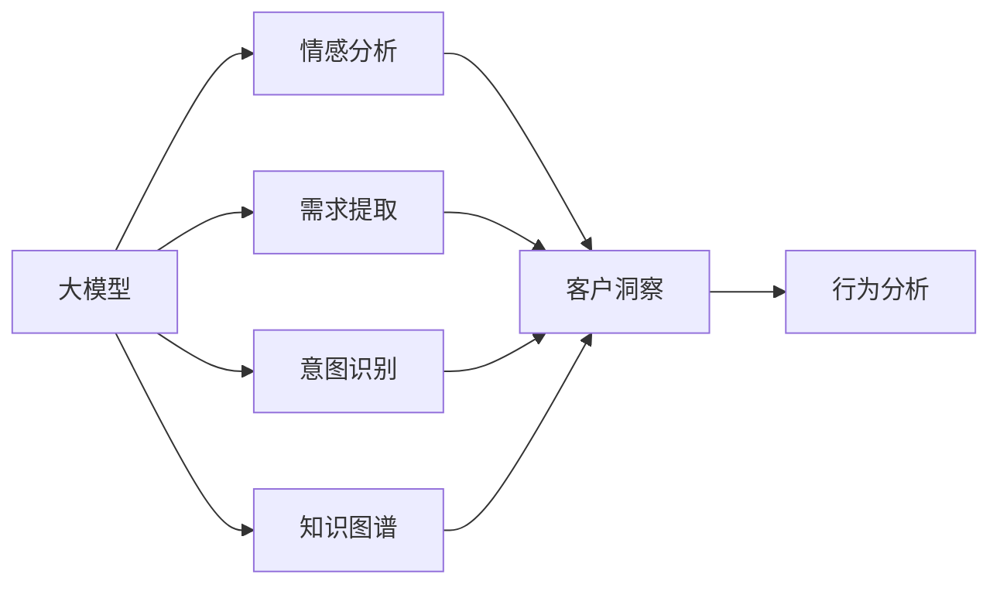

                 

# 探索基于大模型的电商智能客户洞察系统

## 1. 背景介绍

### 1.1 问题由来
随着电商行业的发展，客户洞察系统已成为商家提升用户体验、优化产品策略、精准营销的重要工具。传统的客户洞察系统依赖于结构化数据（如点击、浏览、购买记录等）进行统计分析，难以捕捉用户更深刻的情感和需求。而基于大模型的自然语言处理技术，可以自动解析非结构化文本数据，挖掘客户背后的深层次需求，实现更精准的客户洞察。

近年来，电商平台的文本数据量急剧增长，客户评价、产品评论、用户反馈等文本数据被广泛收集。这些文本数据蕴含着大量用户的情感、需求、意见和建议，是大模型探索客户洞察的宝贵资源。

### 1.2 问题核心关键点
基于大模型的客户洞察系统，需要解决以下核心问题：

- 如何从电商文本数据中高效提取客户情感和需求？
- 如何将客户洞察转化为可操作的用户行为分析？
- 如何在保证准确性的同时，提高系统响应速度和可解释性？

本文将重点介绍如何构建基于大模型的电商智能客户洞察系统，并通过详细的算法原理和代码实践，展示系统设计的全流程。

## 2. 核心概念与联系

### 2.1 核心概念概述

为更好地理解大模型在电商客户洞察中的应用，本节将介绍几个关键概念：

- 大模型（Large Model）：指具有海量参数、广泛语料预训练的深度学习模型，如BERT、GPT-3、T5等。通过预训练学习到丰富的语言表示，具备强大的自然语言理解和生成能力。

- 客户洞察（Customer Insight）：指从客户行为数据中，提取和分析客户的情感、需求、态度等信息，以支持产品策略优化、客户细分、精准营销等决策。

- 情感分析（Sentiment Analysis）：指从文本中识别和度量情感极性，如正面、中性、负面等。

- 需求提取（Demand Extraction）：指从文本中识别和提取用户的具体需求，如产品功能、价格、服务等。

- 意图识别（Intent Recognition）：指识别用户的行为意图，如查询、反馈、投诉等。

- 知识图谱（Knowledge Graph）：指将结构化数据和非结构化数据结合，构建语义化的知识结构，辅助客户洞察。

这些核心概念之间存在紧密联系，共同构成了大模型在电商客户洞察系统中的应用框架。以下是一个Mermaid流程图，展示了大模型与客户洞察之间的逻辑关系：



这个流程图展示了从大模型到客户洞察的各个步骤：

1. 大模型提取文本中的情感、需求、意图等信息。
2. 将提取的信息整合到知识图谱中，构建语义化的客户画像。
3. 客户洞察系统基于客户画像，进行行为分析和策略优化。

## 3. 核心算法原理 & 具体操作步骤

### 3.1 算法原理概述

基于大模型的电商智能客户洞察系统，主要包括情感分析、需求提取、意图识别和知识图谱构建四个核心模块。其核心思想是：

1. 利用大模型从电商文本数据中提取丰富的情感、需求和意图信息。
2. 将提取的信息整合并构建知识图谱，构建客户画像。
3. 基于客户画像进行行为分析和策略优化，实现智能化的客户洞察。

具体而言，假设大模型为 $M_{\theta}$，输入文本为 $x$，则各个模块的具体算法如下：

- **情感分析**：输入文本 $x$，输出情感标签 $y$，模型结构为 $y = M_{\theta}(x)$。
- **需求提取**：输入文本 $x$，输出需求标签 $d$，模型结构为 $d = M_{\theta}(x)$。
- **意图识别**：输入文本 $x$，输出意图标签 $i$，模型结构为 $i = M_{\theta}(x)$。
- **知识图谱构建**：输入客户画像 $p$，输出知识图谱 $G$，模型结构为 $G = M_{\theta}(p)$。

### 3.2 算法步骤详解

基于大模型的客户洞察系统主要包括以下关键步骤：

**Step 1: 数据准备与预处理**

- 收集电商平台的客户评价、产品评论、用户反馈等文本数据，划分为训练集、验证集和测试集。
- 对文本数据进行清洗、分词、去除停用词等预处理操作，并统一转换为模型所需的格式。

**Step 2: 大模型微调**

- 选择合适的预训练语言模型 $M_{\theta}$，如BERT、GPT等。
- 在大模型顶层设计合适的情感分析、需求提取和意图识别模型。
- 使用电商数据集对模型进行微调，设置合适的超参数，如学习率、批大小等。
- 使用正则化技术如L2正则、Dropout等防止过拟合。

**Step 3: 客户画像构建**

- 将客户画像信息与电商数据整合并构建知识图谱。
- 使用大模型对知识图谱进行训练，生成客户画像向量 $p$。

**Step 4: 客户行为分析与策略优化**

- 将客户画像向量 $p$ 输入到行为分析模型中，得到客户行为特征 $f$。
- 根据客户行为特征，进行行为预测、情感分类、需求识别等操作。
- 基于客户洞察，生成优化建议，支持客户细分、精准营销等业务决策。

### 3.3 算法优缺点

基于大模型的客户洞察系统具有以下优点：

1. **高准确性**：利用大模型强大的自然语言处理能力，能够自动解析复杂的电商文本，提取情感、需求和意图等信息，提升洞察的准确性。
2. **自动扩展**：大模型可以不断积累和融合新数据，自动扩展其语言表示能力，适应电商市场变化。
3. **高效性**：通过微调优化模型参数，可以在较少的标注数据上实现高效的客户洞察。
4. **可解释性**：大模型通过逐层激活分析和模型可视化，可以提供模型输出的可解释性。

同时，该方法也存在以下局限性：

1. **数据依赖性**：大模型依赖于标注数据，标注数据的数量和质量对系统性能有较大影响。
2. **模型复杂性**：大模型参数量庞大，推理复杂度较高，需要高性能计算资源支持。
3. **鲁棒性不足**：电商文本数据存在噪声和干扰，可能影响模型的鲁棒性和泛化能力。
4. **成本高昂**：大模型的训练和推理成本较高，需要大规模的算力和存储资源。

尽管存在这些局限性，但大模型在电商客户洞察系统中的应用前景广阔，仍值得深入探索。

### 3.4 算法应用领域

基于大模型的客户洞察系统在电商领域具有广泛的应用场景，包括但不限于：

- 客户情感分析：识别用户对产品或服务的情感倾向，帮助商家改进产品策略，提升用户满意度。
- 需求识别与分析：提取用户的具体需求，如产品功能、价格、服务质量等，指导产品开发和市场定位。
- 意图识别：理解用户的购买意图，优化推荐算法，提高销售转化率。
- 行为预测：预测用户未来的行为，如购买意向、流失风险等，支持个性化营销和精准推荐。
- 客户细分：基于客户画像，对用户进行分类，制定差异化的营销策略。
- 客户投诉与反馈：分析用户投诉和反馈内容，及时调整产品和服务，提升用户体验。

## 4. 数学模型和公式 & 详细讲解 & 举例说明

### 4.1 数学模型构建

本节将使用数学语言对基于大模型的客户洞察系统进行更加严格的刻画。

记大模型为 $M_{\theta}$，输入文本为 $x$，情感分析模型为 $S$，需求提取模型为 $D$，意图识别模型为 $I$。客户画像向量为 $p$，行为分析模型为 $F$，优化建议模型为 $O$。

假设情感分析任务的标注数据集为 $\{(x_i,y_i)\}_{i=1}^N$，其中 $x_i$ 为输入文本，$y_i \in \{0,1\}$ 为情感标签。需求提取和意图识别任务同样使用标注数据集。

情感分析模型的损失函数为：

$$
\mathcal{L}_S = -\frac{1}{N}\sum_{i=1}^N y_i \log M_S(x_i) + (1-y_i) \log (1-M_S(x_i))
$$

需求提取和意图识别模型的损失函数同理。

客户画像向量 $p$ 与知识图谱 $G$ 的模型结构为：

$$
p = M_K(G)
$$

其中 $M_K$ 为知识图谱构建模型。

客户行为分析与策略优化的目标函数为：

$$
\mathcal{L}_O = \mathcal{L}_F(f) + \lambda \mathcal{L}_C(\Delta S, \Delta D, \Delta I)
$$

其中 $\mathcal{L}_F$ 为行为分析模型的损失函数，$\mathcal{L}_C$ 为优化建议模型的损失函数，$\Delta S, \Delta D, \Delta I$ 为情感、需求、意图等客户洞察信息的优化变化量。

### 4.2 公式推导过程

以下我们将以情感分析任务为例，推导大模型的损失函数及其梯度的计算公式。

假设情感分析模型 $S$ 的输出为 $\hat{y} = S(x)$，表示模型预测情感极性。真实标签 $y \in \{0,1\}$。则二分类交叉熵损失函数定义为：

$$
\ell(S(x),y) = -[y\log \hat{y} + (1-y)\log (1-\hat{y})]
$$

将其代入经验风险公式，得：

$$
\mathcal{L}_S = -\frac{1}{N}\sum_{i=1}^N [y_i\log S(x_i)+(1-y_i)\log(1-S(x_i))]
$$

根据链式法则，损失函数对模型参数 $\theta$ 的梯度为：

$$
\frac{\partial \mathcal{L}_S}{\partial \theta} = -\frac{1}{N}\sum_{i=1}^N (\frac{y_i}{S(x_i)}-\frac{1-y_i}{1-S(x_i)}) \frac{\partial S(x_i)}{\partial \theta}
$$

其中 $\frac{\partial S(x_i)}{\partial \theta}$ 可进一步递归展开，利用自动微分技术完成计算。

在得到损失函数的梯度后，即可带入模型参数更新公式，完成模型的迭代优化。重复上述过程直至收敛，最终得到适应电商情感分析任务的最优模型参数 $\theta^*$。

## 5. 项目实践：代码实例和详细解释说明

### 5.1 开发环境搭建

在进行客户洞察系统开发前，我们需要准备好开发环境。以下是使用Python进行PyTorch开发的环境配置流程：

1. 安装Anaconda：从官网下载并安装Anaconda，用于创建独立的Python环境。

2. 创建并激活虚拟环境：
```bash
conda create -n ecommerce-env python=3.8 
conda activate ecommerce-env
```

3. 安装PyTorch：根据CUDA版本，从官网获取对应的安装命令。例如：
```bash
conda install pytorch torchvision torchaudio cudatoolkit=11.1 -c pytorch -c conda-forge
```

4. 安装相关库：
```bash
pip install transformers sentence-transformers sklearn pandas
```

5. 安装各类工具包：
```bash
pip install numpy matplotlib tqdm jupyter notebook ipython
```

完成上述步骤后，即可在`ecommerce-env`环境中开始客户洞察系统的开发。

### 5.2 源代码详细实现

下面我们以客户情感分析任务为例，给出使用Transformers库对BERT模型进行微调的PyTorch代码实现。

首先，定义情感分析任务的标注数据集：

```python
from transformers import BertTokenizer
from torch.utils.data import Dataset
import torch

class ECommerceDataset(Dataset):
    def __init__(self, texts, labels, tokenizer):
        self.texts = texts
        self.labels = labels
        self.tokenizer = tokenizer
        
    def __len__(self):
        return len(self.texts)
    
    def __getitem__(self, item):
        text = self.texts[item]
        label = self.labels[item]
        
        encoding = self.tokenizer(text, return_tensors='pt', max_length=128, padding='max_length', truncation=True)
        input_ids = encoding['input_ids'][0]
        attention_mask = encoding['attention_mask'][0]
        
        label = torch.tensor(label, dtype=torch.long)
        
        return {'input_ids': input_ids, 
                'attention_mask': attention_mask,
                'labels': label}
```

然后，定义模型和优化器：

```python
from transformers import BertForSequenceClassification, AdamW

model = BertForSequenceClassification.from_pretrained('bert-base-cased', num_labels=2)

optimizer = AdamW(model.parameters(), lr=2e-5)
```

接着，定义训练和评估函数：

```python
from torch.utils.data import DataLoader
from tqdm import tqdm
from sklearn.metrics import accuracy_score, precision_recall_fscore_support

device = torch.device('cuda') if torch.cuda.is_available() else torch.device('cpu')
model.to(device)

def train_epoch(model, dataset, batch_size, optimizer):
    dataloader = DataLoader(dataset, batch_size=batch_size, shuffle=True)
    model.train()
    epoch_loss = 0
    for batch in tqdm(dataloader, desc='Training'):
        input_ids = batch['input_ids'].to(device)
        attention_mask = batch['attention_mask'].to(device)
        labels = batch['labels'].to(device)
        model.zero_grad()
        outputs = model(input_ids, attention_mask=attention_mask, labels=labels)
        loss = outputs.loss
        epoch_loss += loss.item()
        loss.backward()
        optimizer.step()
    return epoch_loss / len(dataloader)

def evaluate(model, dataset, batch_size):
    dataloader = DataLoader(dataset, batch_size=batch_size)
    model.eval()
    preds, labels = [], []
    with torch.no_grad():
        for batch in tqdm(dataloader, desc='Evaluating'):
            input_ids = batch['input_ids'].to(device)
            attention_mask = batch['attention_mask'].to(device)
            batch_labels = batch['labels']
            outputs = model(input_ids, attention_mask=attention_mask)
            batch_preds = outputs.logits.argmax(dim=1).to('cpu').tolist()
            batch_labels = batch_labels.to('cpu').tolist()
            for pred, label in zip(batch_preds, batch_labels):
                preds.append(pred)
                labels.append(label)
                
    accuracy = accuracy_score(labels, preds)
    precision, recall, f1, _ = precision_recall_fscore_support(labels, preds, average='binary')
    
    print(f'Accuracy: {accuracy:.4f}, Precision: {precision:.4f}, Recall: {recall:.4f}, F1 Score: {f1:.4f}')
```

最后，启动训练流程并在测试集上评估：

```python
epochs = 5
batch_size = 16

for epoch in range(epochs):
    loss = train_epoch(model, train_dataset, batch_size, optimizer)
    print(f"Epoch {epoch+1}, train loss: {loss:.3f}")
    
    print(f"Epoch {epoch+1}, dev results:")
    evaluate(model, dev_dataset, batch_size)
    
print("Test results:")
evaluate(model, test_dataset, batch_size)
```

以上就是使用PyTorch对BERT进行客户情感分析任务微调的完整代码实现。可以看到，得益于Transformers库的强大封装，我们可以用相对简洁的代码完成BERT模型的加载和微调。

### 5.3 代码解读与分析

让我们再详细解读一下关键代码的实现细节：

**ECommerceDataset类**：
- `__init__`方法：初始化文本、标签、分词器等关键组件。
- `__len__`方法：返回数据集的样本数量。
- `__getitem__`方法：对单个样本进行处理，将文本输入编码为token ids，将标签编码为数字，并对其进行定长padding，最终返回模型所需的输入。

**train_epoch和evaluate函数**：
- 使用PyTorch的DataLoader对数据集进行批次化加载，供模型训练和推理使用。
- 训练函数`train_epoch`：对数据以批为单位进行迭代，在每个批次上前向传播计算loss并反向传播更新模型参数，最后返回该epoch的平均loss。
- 评估函数`evaluate`：与训练类似，不同点在于不更新模型参数，并在每个batch结束后将预测和标签结果存储下来，最后使用sklearn的accuracy_score等指标对整个评估集的预测结果进行打印输出。

**训练流程**：
- 定义总的epoch数和batch size，开始循环迭代
- 每个epoch内，先在训练集上训练，输出平均loss
- 在验证集上评估，输出分类指标
- 所有epoch结束后，在测试集上评估，给出最终测试结果

可以看到，PyTorch配合Transformers库使得BERT微调的代码实现变得简洁高效。开发者可以将更多精力放在数据处理、模型改进等高层逻辑上，而不必过多关注底层的实现细节。

当然，工业级的系统实现还需考虑更多因素，如模型的保存和部署、超参数的自动搜索、更灵活的任务适配层等。但核心的微调范式基本与此类似。

## 6. 实际应用场景

### 6.1 智能客服系统

基于大模型的客户洞察系统，可以应用于智能客服系统的构建。传统客服往往需要配备大量人力，高峰期响应缓慢，且一致性和专业性难以保证。而使用客户洞察系统，能够自动解析客户对话内容，识别用户需求和情感，生成智能回复，提高客服系统的响应速度和客户满意度。

在技术实现上，可以收集平台的历史客户对话记录，将问题和最佳答复构建成监督数据，在此基础上对预训练模型进行微调。微调后的模型能够自动理解客户意图，匹配最合适的答案模板进行回复。对于客户提出的新问题，还可以接入检索系统实时搜索相关内容，动态组织生成回答。如此构建的智能客服系统，能大幅提升客户咨询体验和问题解决效率。

### 6.2 个性化推荐系统

客户洞察系统还可应用于个性化推荐系统，帮助电商平台推荐用户感兴趣的商品。通过对客户情感、需求、行为等信息的分析，推荐系统可以更精准地匹配用户偏好，提高推荐效果。

在实践中，可以收集用户浏览、点击、评论、分享等行为数据，提取和用户交互的物品标题、描述、标签等文本内容。将文本内容作为模型输入，用户的后续行为（如是否点击、购买等）作为监督信号，在此基础上微调预训练语言模型。微调后的模型能够从文本内容中准确把握用户的兴趣点。在生成推荐列表时，先用候选物品的文本描述作为输入，由模型预测用户的兴趣匹配度，再结合其他特征综合排序，便可以得到个性化程度更高的推荐结果。

### 6.3 品牌营销优化

客户洞察系统在品牌营销优化中同样有重要应用。通过分析客户的情感和需求，品牌营销团队可以更有针对性地制定营销策略，提高营销效果。

在实践中，品牌可以收集客户对产品或品牌的评价，进行情感分析和需求提取，了解客户对品牌的整体感知和具体需求。基于客户洞察，品牌营销团队可以设计更有吸引力的广告创意、调整产品策略、优化用户体验，从而提升品牌美誉度和市场份额。

## 7. 工具和资源推荐

### 7.1 学习资源推荐

为了帮助开发者系统掌握大模型在电商客户洞察中的应用，这里推荐一些优质的学习资源：

1. 《Transformers From Scratch》系列博文：由大模型技术专家撰写，深入浅出地介绍了Transformers库的基本用法和微调技术，适合初学者入门。

2. 《NLP实战入门》课程：基于PyTorch的NLP项目实战教程，涵盖情感分析、需求提取等核心任务，适合有一定编程基础的开发者。

3. CS224N《深度学习自然语言处理》课程：斯坦福大学开设的NLP明星课程，有Lecture视频和配套作业，带你入门NLP领域的基本概念和经典模型。

4. 《Natural Language Processing with Python》书籍：详细介绍了NLP中常用的文本预处理、特征提取、模型训练等技术，适合进阶学习。

5. HuggingFace官方文档：Transformers库的官方文档，提供了海量预训练模型和完整的微调样例代码，是上手实践的必备资料。

通过对这些资源的学习实践，相信你一定能够快速掌握大模型在电商客户洞察系统中的应用，并用于解决实际的NLP问题。

### 7.2 开发工具推荐

高效的开发离不开优秀的工具支持。以下是几款用于大模型客户洞察系统开发的常用工具：

1. PyTorch：基于Python的开源深度学习框架，灵活动态的计算图，适合快速迭代研究。大部分预训练语言模型都有PyTorch版本的实现。

2. TensorFlow：由Google主导开发的开源深度学习框架，生产部署方便，适合大规模工程应用。同样有丰富的预训练语言模型资源。

3. Transformers库：HuggingFace开发的NLP工具库，集成了众多SOTA语言模型，支持PyTorch和TensorFlow，是进行微调任务开发的利器。

4. Weights & Biases：模型训练的实验跟踪工具，可以记录和可视化模型训练过程中的各项指标，方便对比和调优。与主流深度学习框架无缝集成。

5. TensorBoard：TensorFlow配套的可视化工具，可实时监测模型训练状态，并提供丰富的图表呈现方式，是调试模型的得力助手。

6. Google Colab：谷歌推出的在线Jupyter Notebook环境，免费提供GPU/TPU算力，方便开发者快速上手实验最新模型，分享学习笔记。

合理利用这些工具，可以显著提升大模型客户洞察系统的开发效率，加快创新迭代的步伐。

### 7.3 相关论文推荐

大模型和客户洞察技术的发展源于学界的持续研究。以下是几篇奠基性的相关论文，推荐阅读：

1. Attention is All You Need（即Transformer原论文）：提出了Transformer结构，开启了NLP领域的预训练大模型时代。

2. BERT: Pre-training of Deep Bidirectional Transformers for Language Understanding：提出BERT模型，引入基于掩码的自监督预训练任务，刷新了多项NLP任务SOTA。

3. Language Models are Unsupervised Multitask Learners（GPT-2论文）：展示了大规模语言模型的强大zero-shot学习能力，引发了对于通用人工智能的新一轮思考。

4. Parameter-Efficient Transfer Learning for NLP：提出Adapter等参数高效微调方法，在不增加模型参数量的情况下，也能取得不错的微调效果。

5. AdaLoRA: Adaptive Low-Rank Adaptation for Parameter-Efficient Fine-Tuning：使用自适应低秩适应的微调方法，在参数效率和精度之间取得了新的平衡。

这些论文代表了大模型客户洞察技术的发展脉络。通过学习这些前沿成果，可以帮助研究者把握学科前进方向，激发更多的创新灵感。

## 8. 总结：未来发展趋势与挑战

### 8.1 总结

本文对基于大模型的电商智能客户洞察系统进行了全面系统的介绍。首先阐述了客户洞察系统在大模型应用中的重要性，明确了系统设计的核心目标和关键技术点。其次，从原理到实践，详细讲解了情感分析、需求提取、意图识别和知识图谱构建等核心模块的算法原理和步骤，并给出了完整的代码实现。同时，本文还广泛探讨了客户洞察系统在电商智能客服、个性化推荐、品牌营销等领域的应用前景，展示了大模型客户洞察系统的广阔应用空间。此外，本文精选了客户洞察技术的各类学习资源，力求为读者提供全方位的技术指引。

通过本文的系统梳理，可以看到，基于大模型的客户洞察系统已经在电商领域取得了初步成功，具备高准确性、高效性和可解释性等优点。尽管存在一定的数据依赖性和计算资源消耗，但通过合理的设计和优化，可以在保证性能的同时，显著提升客户洞察的精度和效率。未来，随着大模型的不断发展，客户洞察系统将有更大的应用空间和更深远的影响力。

### 8.2 未来发展趋势

展望未来，大模型客户洞察系统将呈现以下几个发展趋势：

1. **数据处理能力的提升**：随着数据预处理技术的进步，客户洞察系统可以更好地处理多样化的非结构化数据，提高情感和需求提取的准确性。

2. **模型融合与协作**：未来的客户洞察系统将不仅仅依赖单一的大模型，而是将多个大模型进行融合，形成更强大、灵活的知识图谱和客户画像。

3. **实时性提升**：通过优化模型推理和数据处理流程，客户洞察系统可以实现更高的实时性，支持实时预测和动态优化。

4. **个性化推荐**：客户洞察系统将与推荐算法深度结合，实现更加个性化、精准的推荐服务。

5. **多模态融合**：结合文本、图像、语音等多模态数据，构建更全面、立体化的客户洞察。

6. **知识图谱与语义搜索**：构建更丰富的知识图谱，提供语义搜索功能，提升客户洞察的深度和广度。

以上趋势凸显了大模型客户洞察系统的广阔前景。这些方向的探索发展，必将进一步提升客户洞察系统的性能和应用范围，为电商平台带来更大的商业价值。

### 8.3 面临的挑战

尽管大模型客户洞察系统已经取得了显著进展，但在迈向更加智能化、普适化应用的过程中，它仍面临着诸多挑战：

1. **数据隐私与安全**：客户数据隐私保护是客户洞察系统面临的重要问题，需要在数据处理和存储过程中确保数据安全。

2. **鲁棒性与泛化能力**：电商文本数据存在噪声和干扰，客户洞察模型需要在复杂环境中保持稳定性和泛化能力。

3. **模型复杂性与计算资源**：大模型参数量庞大，推理复杂度较高，需要高性能计算资源支持。

4. **可解释性与可操作性**：客户洞察系统的输出需要具有高可解释性，以便业务人员理解和操作。

5. **跨领域迁移能力**：客户洞察系统需要具备跨领域迁移能力，能够适应不同电商平台的业务场景。

6. **实时反馈与动态优化**：客户洞察系统需要具备实时反馈和动态优化能力，根据客户行为和市场变化进行持续优化。

正视客户洞察系统面临的这些挑战，积极应对并寻求突破，将是大模型客户洞察技术迈向成熟的必由之路。相信随着学界和产业界的共同努力，这些挑战终将一一被克服，大模型客户洞察系统必将在构建人机协同的智能系统过程中发挥重要作用。

### 8.4 研究展望

面向未来，客户洞察系统的研究需要在以下几个方面寻求新的突破：

1. **多模态客户洞察**：结合文本、图像、语音等多模态数据，构建更全面、立体化的客户洞察。

2. **零样本与少样本学习**：利用大模型的零样本和少样本学习能力，减少对标注数据的依赖。

3. **知识图谱与语义搜索**：构建更丰富的知识图谱，提供语义搜索功能，提升客户洞察的深度和广度。

4. **因果推理与多路径协同**：引入因果推理和多路径协同方法，增强客户洞察的因果关系和多样性。

5. **跨领域迁移学习**：探索跨领域迁移学习方法，提升客户洞察系统的通用性和适应性。

6. **分布式与联邦学习**：利用分布式与联邦学习技术，降低数据集中度风险，提升客户洞察系统的可靠性和安全性。

这些研究方向的探索，必将引领客户洞察系统的技术创新和应用优化，为构建更加智能、高效、安全的客户洞察系统铺平道路。面向未来，客户洞察系统需要在数据处理、模型构建、应用场景等方面进行全面优化，才能更好地服务于电商平台，提升客户体验和业务价值。

## 9. 附录：常见问题与解答

**Q1：大模型客户洞察系统的开发难度大吗？**

A: 大模型客户洞察系统的开发涉及数据预处理、模型微调、知识图谱构建等多个环节，相对复杂。但借助现成的预训练模型和工具库，如Transformers、sentence-transformers等，可以显著降低开发难度。一般掌握基本的Python编程和深度学习框架使用经验即可上手。

**Q2：如何选择合适的预训练大模型？**

A: 选择合适的预训练大模型需要考虑任务类型、数据规模、计算资源等因素。对于电商文本分析任务，BERT、GPT-2、T5等模型都具有不错的表现。可以从模型的参数规模、预训练数据集、应用领域等方面进行综合考虑。

**Q3：客户洞察系统如何处理长文本数据？**

A: 长文本数据的处理是大模型客户洞察系统的一个挑战。可以通过分段处理、分词、去除停用词等预处理操作，将长文本转换为模型可处理的输入格式。对于特别长的文本，还可以采用基于摘要的技术，提取关键信息进行建模。

**Q4：客户洞察系统如何保护客户数据隐私？**

A: 客户数据隐私保护是大模型客户洞察系统的一个重要考虑因素。可以在数据预处理和存储过程中采用数据加密、匿名化等技术，确保客户数据安全。在模型训练和推理过程中，应遵循相关的隐私保护法规，如GDPR、CCPA等，保护客户隐私。

**Q5：客户洞察系统的鲁棒性如何提升？**

A: 客户洞察系统的鲁棒性可以通过数据增强、对抗训练、正则化等技术进行提升。例如，可以引入对抗样本，训练模型对噪声和干扰具备一定的鲁棒性。同时，使用正则化技术，如L2正则、Dropout等，防止模型过拟合。

**Q6：客户洞察系统如何进行跨领域迁移学习？**

A: 跨领域迁移学习是大模型客户洞察系统的关键技术之一。可以通过在目标领域收集少量标注数据，对大模型进行微调，实现领域的知识迁移。同时，可以设计通用的知识图谱构建方法，提高模型的跨领域泛化能力。

这些问题的详细解答，可以帮助开发者更全面地理解大模型客户洞察系统的开发和应用。通过合理的模型选择、数据处理、系统优化，可以构建高效、精准、安全的客户洞察系统，为电商平台的客户洞察应用提供有力支撑。

---

作者：禅与计算机程序设计艺术 / Zen and the Art of Computer Programming

